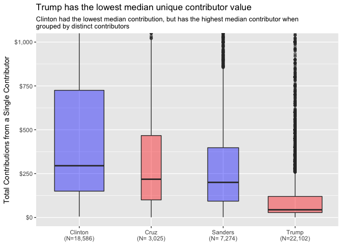

<base target="_blank"/>

# Overview

This report examines the 2016 Presidential Campaign Finance contributor report for the state of Pennsylvania, as provided by the Federal Election Commission (FEC).  Its main objective is to describe the flow of financial contributions to US presidential candidates in terms of their size, date and geography within the state of Pennsylvania. 

The report documents how, in the course of the 2016 presidential campagin, Hillary Clinton received nearly \$13m in contributions from individuals in the state of Pennsylvania, far more than the next closest candidate, Donald Trump, at approximately \$4m. In fact, Clinton's total was more than all 23 other candidates combined. 

Nevertheless, when grouping contributions by unique individuals, it becomes evident that Clinton actually gained her $9m advantage from fewer distinct individuals than Trump. The stark difference in percentage of a candidate's contributions coming from unique individuals (as opposed to repeat donations from the same individual) may reveal something important about the candidates' actual base of support.

It is also interesting to compare the geographic distribution of political contributions and presidential votes. The Democrats' fundraising advantage was geographically concentrated in urban centers. Democrats outraised Republicans in only 26 of 67 counties despite raising an additional \$6.4m.

We would expect to find a relationship between the party raising the most money in a county and the party receiving the most votes. In 50 counties, the party raising the most money did see its candidate receive the most votes. However, in 16 counties, Trump received more votes than Clinton despite Democrats outraising Republicans in the same county. In only 1 county did Clinton outperform Trump at the ballot booth despite Republicans outraising Democrats. In fact, in nearly all cases, Clinton's share in the vote was less than the share of political contributions slated for Democratic candidates.

I have hidden the code in the final document for easier viewing, but please do see the original .Rmd or .md for the code producing this report in [GitHub](https://github.com/seanangio/PA2016).

# Importing the Data

The original data, as provided by the Federal Election Commission (FEC), was found [here](http://fec.gov/disclosurep/PDownload.do), but it appears it is no longer available as they are updating their website. Please find the csv file in the Github repository until the new link can be given. Please note that the data does not include any super-PAC money, which by its nature is not officially donated to candidates themselves.

Here is a brief look at our initial raw dataset.

<table class="table table-striped table-condensed" style="width: auto !important; ">
 <thead>
  <tr>
   <th style="text-align:left;"> cmte_id </th>
   <th style="text-align:left;"> cand_id </th>
   <th style="text-align:left;"> cand_nm </th>
   <th style="text-align:left;"> contbr_nm </th>
   <th style="text-align:left;"> contbr_city </th>
   <th style="text-align:left;"> contbr_st </th>
   <th style="text-align:right;"> contbr_zip </th>
   <th style="text-align:left;"> contbr_employer </th>
   <th style="text-align:left;"> contbr_occupation </th>
   <th style="text-align:right;"> contb_receipt_amt </th>
   <th style="text-align:left;"> contb_receipt_dt </th>
   <th style="text-align:left;"> receipt_desc </th>
   <th style="text-align:left;"> memo_cd </th>
   <th style="text-align:left;"> memo_text </th>
   <th style="text-align:left;"> form_tp </th>
   <th style="text-align:right;"> file_num </th>
   <th style="text-align:left;"> tran_id </th>
   <th style="text-align:left;"> election_tp </th>
  </tr>
 </thead>
<tbody>
  <tr>
   <td style="text-align:left;"> C00580100 </td>
   <td style="text-align:left;"> P80001571 </td>
   <td style="text-align:left;"> Trump, Donald J. </td>
   <td style="text-align:left;"> ROONEY, JEAN </td>
   <td style="text-align:left;"> ALLENTOWN </td>
   <td style="text-align:left;"> PA </td>
   <td style="text-align:right;"> 18103 </td>
   <td style="text-align:left;"> INFORMATION REQUESTED </td>
   <td style="text-align:left;"> INFORMATION REQUESTED </td>
   <td style="text-align:right;"> 75.30 </td>
   <td style="text-align:left;"> 07-OCT-16 </td>
   <td style="text-align:left;"> NA </td>
   <td style="text-align:left;"> X </td>
   <td style="text-align:left;"> NA </td>
   <td style="text-align:left;"> SA18 </td>
   <td style="text-align:right;"> 1146165 </td>
   <td style="text-align:left;"> SA18.134904 </td>
   <td style="text-align:left;"> G2016 </td>
  </tr>
  <tr>
   <td style="text-align:left;"> C00577130 </td>
   <td style="text-align:left;"> P60007168 </td>
   <td style="text-align:left;"> Sanders, Bernard </td>
   <td style="text-align:left;"> LEONTOVICH, M </td>
   <td style="text-align:left;"> DOWNINGTOWN </td>
   <td style="text-align:left;"> PA </td>
   <td style="text-align:right;"> 193352266 </td>
   <td style="text-align:left;"> NOT EMPLOYED </td>
   <td style="text-align:left;"> NOT EMPLOYED </td>
   <td style="text-align:right;"> 15.00 </td>
   <td style="text-align:left;"> 04-MAR-16 </td>
   <td style="text-align:left;"> NA </td>
   <td style="text-align:left;"> NA </td>
   <td style="text-align:left;"> * EARMARKED CONTRIBUTION: SEE BELOW </td>
   <td style="text-align:left;"> SA17A </td>
   <td style="text-align:right;"> 1077404 </td>
   <td style="text-align:left;"> VPF7BKWAXT2 </td>
   <td style="text-align:left;"> P2016 </td>
  </tr>
  <tr>
   <td style="text-align:left;"> C00577130 </td>
   <td style="text-align:left;"> P60007168 </td>
   <td style="text-align:left;"> Sanders, Bernard </td>
   <td style="text-align:left;"> LEONTOVICH, M </td>
   <td style="text-align:left;"> DOWNINGTOWN </td>
   <td style="text-align:left;"> PA </td>
   <td style="text-align:right;"> 193352266 </td>
   <td style="text-align:left;"> NOT EMPLOYED </td>
   <td style="text-align:left;"> NOT EMPLOYED </td>
   <td style="text-align:right;"> 10.00 </td>
   <td style="text-align:left;"> 05-MAR-16 </td>
   <td style="text-align:left;"> NA </td>
   <td style="text-align:left;"> NA </td>
   <td style="text-align:left;"> * EARMARKED CONTRIBUTION: SEE BELOW </td>
   <td style="text-align:left;"> SA17A </td>
   <td style="text-align:right;"> 1077404 </td>
   <td style="text-align:left;"> VPF7BKXAZE6 </td>
   <td style="text-align:left;"> P2016 </td>
  </tr>
  <tr>
   <td style="text-align:left;"> C00577130 </td>
   <td style="text-align:left;"> P60007168 </td>
   <td style="text-align:left;"> Sanders, Bernard </td>
   <td style="text-align:left;"> LEONTOVICH, M </td>
   <td style="text-align:left;"> DOWNINGTOWN </td>
   <td style="text-align:left;"> PA </td>
   <td style="text-align:right;"> 193352266 </td>
   <td style="text-align:left;"> NOT EMPLOYED </td>
   <td style="text-align:left;"> NOT EMPLOYED </td>
   <td style="text-align:right;"> 10.00 </td>
   <td style="text-align:left;"> 06-MAR-16 </td>
   <td style="text-align:left;"> NA </td>
   <td style="text-align:left;"> NA </td>
   <td style="text-align:left;"> * EARMARKED CONTRIBUTION: SEE BELOW </td>
   <td style="text-align:left;"> SA17A </td>
   <td style="text-align:right;"> 1077404 </td>
   <td style="text-align:left;"> VPF7BM0HEC7 </td>
   <td style="text-align:left;"> P2016 </td>
  </tr>
  <tr>
   <td style="text-align:left;"> C00575795 </td>
   <td style="text-align:left;"> P00003392 </td>
   <td style="text-align:left;"> Clinton, Hillary Rodham </td>
   <td style="text-align:left;"> KRAMER, VICKI </td>
   <td style="text-align:left;"> PHILADELPHIA </td>
   <td style="text-align:left;"> PA </td>
   <td style="text-align:right;"> 191064153 </td>
   <td style="text-align:left;"> N/A </td>
   <td style="text-align:left;"> RETIRED </td>
   <td style="text-align:right;"> 21.64 </td>
   <td style="text-align:left;"> 06-APR-16 </td>
   <td style="text-align:left;"> NA </td>
   <td style="text-align:left;"> X </td>
   <td style="text-align:left;"> * HILLARY VICTORY FUND </td>
   <td style="text-align:left;"> SA18 </td>
   <td style="text-align:right;"> 1091718 </td>
   <td style="text-align:left;"> C4675238 </td>
   <td style="text-align:left;"> P2016 </td>
  </tr>
  <tr>
   <td style="text-align:left;"> C00577130 </td>
   <td style="text-align:left;"> P60007168 </td>
   <td style="text-align:left;"> Sanders, Bernard </td>
   <td style="text-align:left;"> KERNS, MICHAEL </td>
   <td style="text-align:left;"> PHILADELPHIA </td>
   <td style="text-align:left;"> PA </td>
   <td style="text-align:right;"> 191252423 </td>
   <td style="text-align:left;"> GERMANTOWN FRIENDS SCHOOL </td>
   <td style="text-align:left;"> TECHNICAL DIRECTOR </td>
   <td style="text-align:right;"> 15.00 </td>
   <td style="text-align:left;"> 05-MAR-16 </td>
   <td style="text-align:left;"> NA </td>
   <td style="text-align:left;"> NA </td>
   <td style="text-align:left;"> * EARMARKED CONTRIBUTION: SEE BELOW </td>
   <td style="text-align:left;"> SA17A </td>
   <td style="text-align:right;"> 1077404 </td>
   <td style="text-align:left;"> VPF7BKWKFX7 </td>
   <td style="text-align:left;"> P2016 </td>
  </tr>
</tbody>
</table>

After taking a first look at the data, here are a few initial observations:

* Most of the missing values are for variables we will ignore. `election_tp` is the lone exception, but has relatively few missing values.

<table class="table table-striped table-condensed" style="width: auto !important; ">
<caption>Missing Data</caption>
 <thead>
  <tr>
   <th style="text-align:left;"> Variable </th>
   <th style="text-align:right;"> Number Missing </th>
  </tr>
 </thead>
<tbody>
  <tr>
   <td style="text-align:left;"> cmte_id </td>
   <td style="text-align:right;"> 0 </td>
  </tr>
  <tr>
   <td style="text-align:left;"> cand_id </td>
   <td style="text-align:right;"> 0 </td>
  </tr>
  <tr>
   <td style="text-align:left;"> cand_nm </td>
   <td style="text-align:right;"> 0 </td>
  </tr>
  <tr>
   <td style="text-align:left;"> contbr_nm </td>
   <td style="text-align:right;"> 0 </td>
  </tr>
  <tr>
   <td style="text-align:left;"> contbr_city </td>
   <td style="text-align:right;"> 9 </td>
  </tr>
  <tr>
   <td style="text-align:left;"> contbr_st </td>
   <td style="text-align:right;"> 0 </td>
  </tr>
  <tr>
   <td style="text-align:left;"> contbr_zip </td>
   <td style="text-align:right;"> 23 </td>
  </tr>
  <tr>
   <td style="text-align:left;"> contbr_employer </td>
   <td style="text-align:right;"> 1,834 </td>
  </tr>
  <tr>
   <td style="text-align:left;"> contbr_occupation </td>
   <td style="text-align:right;"> 1,643 </td>
  </tr>
  <tr>
   <td style="text-align:left;"> contb_receipt_amt </td>
   <td style="text-align:right;"> 0 </td>
  </tr>
  <tr>
   <td style="text-align:left;"> contb_receipt_dt </td>
   <td style="text-align:right;"> 0 </td>
  </tr>
  <tr>
   <td style="text-align:left;"> receipt_desc </td>
   <td style="text-align:right;"> 241,328 </td>
  </tr>
  <tr>
   <td style="text-align:left;"> memo_cd </td>
   <td style="text-align:right;"> 193,406 </td>
  </tr>
  <tr>
   <td style="text-align:left;"> memo_text </td>
   <td style="text-align:right;"> 160,839 </td>
  </tr>
  <tr>
   <td style="text-align:left;"> form_tp </td>
   <td style="text-align:right;"> 0 </td>
  </tr>
  <tr>
   <td style="text-align:left;"> file_num </td>
   <td style="text-align:right;"> 0 </td>
  </tr>
  <tr>
   <td style="text-align:left;"> tran_id </td>
   <td style="text-align:right;"> 0 </td>
  </tr>
  <tr>
   <td style="text-align:left;"> election_tp </td>
   <td style="text-align:right;"> 452 </td>
  </tr>
</tbody>
</table>

* We have an equal number of unique `cand_id` and `cand_nm`, which suggests there are no errors there. We would likely want to treat candidates as a factor variable. Last name is sufficient to distinguish candidates so we can create that variable for clearer plots.

* 56,881 `contb_nm` out of 243,796 observations. That means a lot of repeat donors as shown below. How this percentage varies by candidate is something that will be explored.

<table class="table table-striped table-condensed" style="width: auto !important; ">
 <thead>
  <tr>
   <th style="text-align:center;"> Unique Contributors </th>
   <th style="text-align:center;"> Total Observations </th>
   <th style="text-align:center;"> Percent Unique </th>
  </tr>
 </thead>
<tbody>
  <tr>
   <td style="text-align:center;"> 56,881 </td>
   <td style="text-align:center;"> 243,796 </td>
   <td style="text-align:center;"> 0.233 </td>
  </tr>
</tbody>
</table>

* `contbr_st` is all PA as it should be.

* `contbr_zip` has a mix of 5 digit and 9 digit zip codes. Looking at min and max values alone suggests at least some errors.

* `contb_receipt_amt`: Our only true numeric variable surprisingly has many negative values.

* `contb_receipt_dt`: We should convert to date format.

* `tran_id`: Surprisingly not a primary key so it is unclear what this variable represents.

* `election_tp`: A few correctable errors and some missing data

* The dataset lacks any party affiliation data, but this can be easily mutated.

* I can drop the following variables: `cmte_id`, `cand_id`, `contbr_city`, `contbr_st`, `contbr_employer`, `contbr_occupation`, `form_tp`, `file_num`, `tran_id`.

# Data Wrangling

## Investigating election_tp

First, we can solve a few small problems in `election_tp`.

<table class="table table-striped table-condensed" style="width: auto !important; ">
 <thead>
  <tr>
   <th style="text-align:left;"> election_tp </th>
   <th style="text-align:left;"> n </th>
  </tr>
 </thead>
<tbody>
  <tr>
   <td style="text-align:left;"> G2016 </td>
   <td style="text-align:left;"> 92,431 </td>
  </tr>
  <tr>
   <td style="text-align:left;"> G2106 </td>
   <td style="text-align:left;"> 1 </td>
  </tr>
  <tr>
   <td style="text-align:left;"> O2016 </td>
   <td style="text-align:left;"> 43 </td>
  </tr>
  <tr>
   <td style="text-align:left;"> P2016 </td>
   <td style="text-align:left;"> 150,868 </td>
  </tr>
  <tr>
   <td style="text-align:left;"> P2020 </td>
   <td style="text-align:left;"> 1 </td>
  </tr>
  <tr>
   <td style="text-align:left;"> NA </td>
   <td style="text-align:left;"> 452 </td>
  </tr>
</tbody>
</table>

* `G2106` must be a simple error. We can recode that. 

* `O2016` is 'Other 2016'. All of these donations seem to be for Jill Stein's recount effort after the November General election. We should exclude this data because the focus of the report is to investigate how fundraising (prior to the election) impacted the outcome of the election.

* `P2020` seems like a celebratory donation after the election so we would want to remove it anyway. This will happen when we clean up `contb_receipt_dt`.

* It is not clear why 452 are blank at the moment, and so they should remain in the dataset.

## Investigating contb_receipt_dt

`contb_receipt_dt` needs to be converted from an integer to a Date format. Moreover, 2,475 contributions after the date of the election will be excluded.

## Investigating contb_receipt_amt

Starting with a histogram or density plot, we can see a few very negative values in the dataset.

We can take a look at the most negative contributions and note that many have a `receipt_desc` marked as "Refund". Some are reattributed to other individuals; others have no explanation. Altogether there are 2,486 non-positive contributions.  

<table class="table table-striped table-condensed" style="width: auto !important; ">
 <thead>
  <tr>
   <th style="text-align:left;"> contbr_nm </th>
   <th style="text-align:right;"> contb_receipt_amt </th>
   <th style="text-align:left;"> receipt_desc </th>
  </tr>
 </thead>
<tbody>
  <tr>
   <td style="text-align:left;"> CARANGI, JOE </td>
   <td style="text-align:right;"> -93308 </td>
   <td style="text-align:left;"> Refund </td>
  </tr>
  <tr>
   <td style="text-align:left;"> FOLINO, J.A. </td>
   <td style="text-align:right;"> -8100 </td>
   <td style="text-align:left;"> Refund </td>
  </tr>
  <tr>
   <td style="text-align:left;"> BALL, GEORGE </td>
   <td style="text-align:right;"> -7700 </td>
   <td style="text-align:left;"> Refund </td>
  </tr>
  <tr>
   <td style="text-align:left;"> SCHRECK, JOHN </td>
   <td style="text-align:right;"> -6175 </td>
   <td style="text-align:left;"> Refund </td>
  </tr>
  <tr>
   <td style="text-align:left;"> PHILLIPS, MARY </td>
   <td style="text-align:right;"> -5400 </td>
   <td style="text-align:left;"> Refund </td>
  </tr>
  <tr>
   <td style="text-align:left;"> MYERS, SETH C. MR. </td>
   <td style="text-align:right;"> -5400 </td>
   <td style="text-align:left;"> REATTRIBUTION TO SPOUSE </td>
  </tr>
</tbody>
</table>

On the other hand we have some very large contributions. 150 contributions exceed the maximum legal limit of $2,700.[^1]

[^1]: According to the [FEC](https://transition.fec.gov/pages/brochures/citizens.shtml), $2,700 is the maximum amount an individual can contribute to a federal candidate. Primary and general elections are considered separate elections. 

Ideally, it would be possible to match up positive and negative contributions from each contributor, but there seems to be no reliable way to do that from the data at hand. `contbr_nm` is not a primary key (people have the same names and small errors are easy to find). 

The simplifying solution taken was to remove all contributions below zero and above $2,700. This is a fairly crude measure because individuals can make multiple smaller contributions that if exceeding the maximum limit, they would need to be capped (rather than excluded) to the limit. At the same time, considering the number of observations in the dataset, these cases represent a small fraction. Moreover, even if legitimate, these large contributions are outliers by any stretch and mostly would serve to conceal patterns in the vast majority of the data.

## Investigating contbr_zip

`contbr_zip` data includes some five digit and some nine digit zip codes. I broke these into separate columns to enable analysis by zip code.

Sorting this list and viewing the head or tail reveals obvious errors. Quite a few are given as "99999""; some are a single digit; and others belong to another state. However since all states are listed as "PA", I chose not to exclude them. These are probably simple errors or perhaps people who live in two states.

## Investigating receipt description

`receipt_desc`, `memo_cd`, and `memo_text` are variables that are not particularly well documented. Many, but not all of them are contributions flagged for refund. Others are redesignations or reattributions. Given that there are so few of them compared to the rest of the dataset, I will exclude any observations with special notes to ensure cleanliness of the data, even if a very small number of legitimate contributions are excluded.

<table class="table table-striped table-condensed" style="width: auto !important; ">
 <thead>
  <tr>
   <th style="text-align:left;"> receipt_desc </th>
   <th style="text-align:right;"> n </th>
  </tr>
 </thead>
<tbody>
  <tr>
   <td style="text-align:left;"> NA </td>
   <td style="text-align:right;"> 238,054 </td>
  </tr>
  <tr>
   <td style="text-align:left;"> REDESIGNATION FROM PRIMARY </td>
   <td style="text-align:right;"> 177 </td>
  </tr>
  <tr>
   <td style="text-align:left;"> REATTRIBUTION FROM SPOUSE </td>
   <td style="text-align:right;"> 129 </td>
  </tr>
  <tr>
   <td style="text-align:left;"> SEE REATTRIBUTION </td>
   <td style="text-align:right;"> 93 </td>
  </tr>
  <tr>
   <td style="text-align:left;"> REATTRIBUTION / REDESIGNATION REQUESTED </td>
   <td style="text-align:right;"> 57 </td>
  </tr>
  <tr>
   <td style="text-align:left;"> * EARMARKED CONTRIBUTION: SEE BELOW REATTRIBUTION/REFUND PENDING </td>
   <td style="text-align:right;"> 47 </td>
  </tr>
</tbody>
</table>

## Investigating memo text

`memo_cd` marks if a memo is attached to the contribution (though not always). These memos, found in `memo_text` note earmarked contributions, or specific candidates like "Hillary Victory Fund". This seems to pose no harm to the dataset.

<table class="table table-striped table-condensed" style="width: auto !important; ">
 <thead>
  <tr>
   <th style="text-align:left;"> memo_text </th>
   <th style="text-align:right;"> n </th>
  </tr>
 </thead>
<tbody>
  <tr>
   <td style="text-align:left;"> NA </td>
   <td style="text-align:right;"> 156,345 </td>
  </tr>
  <tr>
   <td style="text-align:left;"> * EARMARKED CONTRIBUTION: SEE BELOW </td>
   <td style="text-align:right;"> 57,895 </td>
  </tr>
  <tr>
   <td style="text-align:left;"> * HILLARY VICTORY FUND </td>
   <td style="text-align:right;"> 22,990 </td>
  </tr>
  <tr>
   <td style="text-align:left;"> *BEST EFFORTS UPDATE </td>
   <td style="text-align:right;"> 335 </td>
  </tr>
  <tr>
   <td style="text-align:left;"> EARMARKED FROM MAKE DC LISTEN </td>
   <td style="text-align:right;"> 281 </td>
  </tr>
  <tr>
   <td style="text-align:left;"> * </td>
   <td style="text-align:right;"> 18 </td>
  </tr>
</tbody>
</table>

## Adding party affiliation

The dataset did not have a variable for party affiliation so we can add it and represent it as a factor.

## Assign blank election_tp

My last step in data wrangling will be to assign observations with empty election_tp values. Nearly all of the 250 observations with a blank `election_tp` were for Donald Trump. 

<table class="table table-striped table-condensed" style="width: auto !important; ">
 <thead>
  <tr>
   <th style="text-align:left;"> Candidate </th>
   <th style="text-align:left;"> No. election_tp missing </th>
  </tr>
 </thead>
<tbody>
  <tr>
   <td style="text-align:left;"> McMullin, Evan </td>
   <td style="text-align:left;"> 19 </td>
  </tr>
  <tr>
   <td style="text-align:left;"> Stein, Jill </td>
   <td style="text-align:left;"> 4 </td>
  </tr>
  <tr>
   <td style="text-align:left;"> Trump, Donald J. </td>
   <td style="text-align:left;"> 227 </td>
  </tr>
</tbody>
</table>

Observations for candidates other than Trump could only be assigned to "P2016". Trump officially secured his party's nomination on 20 July 2016. Hence, any donation before that date will be marked for the primary and thereafter for the general.

# Exploratory Data Analysis

Before really diving into the analysis, a few univariate plots help sense-check the data and ensure that data wrangling was sufficient.

## The Most Common Contribution Amounts

A histogram of `contb_receipt_amt` shows a highly right-skewed plot, with the vast majority of contributions less than $100 and a few contributions much higher, including at the maximum limit. We can also notice the lack of smoothness in the distribution because people tend to contribute in round numbers when they donate.

## The Pace of Donations over the Campaign

We can plot the number of contributions on each day to determine the pace at which contributions were received. The plot below shows just how long the campaign was with the first contributions coming in as early as 2014. The frequency though of course really picks up in 2016. The plot also suggests there were considerable day-to-day differences in the number of contributions. Some days were clearly more popular for donating than others, even in the heat of the campaign.

I have also colored the plot by `election_tp` to show contributions designated for the primary or general elections. We notice the shift shortly after June 2016 when most contributions are marked for general. Nevertheless, we see small numbers of contributions marked for the primary even after they have finished. We can also observe a greater number of primary contributions (when there were more candidates) than for the general.

## Repetition in Contributors

Do most contributors usually just give once? Or do they donate repeatedly? The output below does not tell us anything about the amounts donated. Instead, it shows that while some people donate repeatedly, it is most common just to donate once. There is an inverse relationship between the number of contributions and the number of people making that number of contributions.

As the number of donations from a single contributor increases, the number of people making that number of donations decreases. (Although we cannot see any points far on the right side of the x-axis, we know there must be at least one observation that far out given it has been included in the default scale).

We can see this disparity in a table as well. One can observe a huge drop between the number of people donating once versus those donating twice. Moreover, this trend continues as the number of donations from a single person increases.

<table class="table table-striped table-condensed" style="width: auto !important; ">
 <thead>
  <tr>
   <th style="text-align:right;"> donation_count </th>
   <th style="text-align:right;"> n </th>
  </tr>
 </thead>
<tbody>
  <tr>
   <td style="text-align:right;"> 1 </td>
   <td style="text-align:right;"> 27,868 </td>
  </tr>
  <tr>
   <td style="text-align:right;"> 2 </td>
   <td style="text-align:right;"> 7,884 </td>
  </tr>
  <tr>
   <td style="text-align:right;"> 3 </td>
   <td style="text-align:right;"> 4,134 </td>
  </tr>
  <tr>
   <td style="text-align:right;"> 4 </td>
   <td style="text-align:right;"> 2,795 </td>
  </tr>
  <tr>
   <td style="text-align:right;"> 5 </td>
   <td style="text-align:right;"> 2,020 </td>
  </tr>
  <tr>
   <td style="text-align:right;"> 6 </td>
   <td style="text-align:right;"> 1,500 </td>
  </tr>
  <tr>
   <td style="text-align:right;"> 7 </td>
   <td style="text-align:right;"> 1,253 </td>
  </tr>
  <tr>
   <td style="text-align:right;"> 8 </td>
   <td style="text-align:right;"> 1,038 </td>
  </tr>
  <tr>
   <td style="text-align:right;"> 9 </td>
   <td style="text-align:right;"> 846 </td>
  </tr>
  <tr>
   <td style="text-align:right;"> 10 </td>
   <td style="text-align:right;"> 725 </td>
  </tr>
</tbody>
</table>

At the same time, there are indeed a handful of individuals who donated more than 100 times. The extent to which this pattern varies by candidate will be explored later in the report.

<table class="table table-striped table-condensed" style="width: auto !important; ">
 <thead>
  <tr>
   <th style="text-align:left;"> contbr_nm </th>
   <th style="text-align:right;"> n </th>
  </tr>
 </thead>
<tbody>
  <tr>
   <td style="text-align:left;"> COMELLA, JOHN </td>
   <td style="text-align:right;"> 186 </td>
  </tr>
  <tr>
   <td style="text-align:left;"> BETHEA, DAMON </td>
   <td style="text-align:right;"> 179 </td>
  </tr>
  <tr>
   <td style="text-align:left;"> SHOVLIN, MARIE </td>
   <td style="text-align:right;"> 150 </td>
  </tr>
  <tr>
   <td style="text-align:left;"> ROSOFF, ANDREW </td>
   <td style="text-align:right;"> 142 </td>
  </tr>
  <tr>
   <td style="text-align:left;"> SHORT, CHRIS </td>
   <td style="text-align:right;"> 139 </td>
  </tr>
  <tr>
   <td style="text-align:left;"> LIBERTIN, MARY </td>
   <td style="text-align:right;"> 135 </td>
  </tr>
  <tr>
   <td style="text-align:left;"> WEITKAMP, RICKY </td>
   <td style="text-align:right;"> 131 </td>
  </tr>
  <tr>
   <td style="text-align:left;"> EDWARDS, JOHN P </td>
   <td style="text-align:right;"> 130 </td>
  </tr>
  <tr>
   <td style="text-align:left;"> LONCAR, BRANDON </td>
   <td style="text-align:right;"> 130 </td>
  </tr>
  <tr>
   <td style="text-align:left;"> HANN, STEVE E </td>
   <td style="text-align:right;"> 125 </td>
  </tr>
</tbody>
</table>

## Aggregate Donations by Party and Candidate

With some sense checks done, we can try to answer some basic questions. Which party (and which candidate) raised the largest amount of money? First, it is clear that Democrats outraised Republicans by a huge margin.

<table class="table table-striped table-condensed" style="width: auto !important; ">
 <thead>
  <tr>
   <th style="text-align:right;"> Party </th>
   <th style="text-align:right;"> Total Funds Raised ($) </th>
  </tr>
 </thead>
<tbody>
  <tr>
   <td style="text-align:right;"> Democrat </td>
   <td style="text-align:right;"> 15,547,628.93 </td>
  </tr>
  <tr>
   <td style="text-align:right;"> Republican </td>
   <td style="text-align:right;"> 9,172,421.80 </td>
  </tr>
  <tr>
   <td style="text-align:right;"> Independent </td>
   <td style="text-align:right;"> 93,322.61 </td>
  </tr>
  <tr>
   <td style="text-align:right;"> Green </td>
   <td style="text-align:right;"> 25,729.73 </td>
  </tr>
</tbody>
</table>

Of course in comparison to the major parties, Independent and Green parties are almost non-existent.

<!--html_preserve-->

<!--/html_preserve-->

The party variable is an aggregation of individual candidates so what we really want to examine is the candidates themselves. Clinton dominated the field. She raised over $12.9m, while the rest of the field combined raised only \$ 11.9m. We can first see the raw disparity in a table.

<!--html_preserve-->

<!--/html_preserve-->

We can also see Clinton's advantage, both in the amount of money raised and in the relative paucity of Democratic challengers compared to the much wider Republican field.

We might also like to visualize the aggregate funds by candidate in a waffle plot, where each square represents \$250,000 (and each column equals \$1m). Note that the necessary rounding to make each square conceals actual values, but it is easier to discern that Clinton raised about \$13m, Trump about \$4m, and Sanders about \$2.5m.

## The Distribution of Contributions across Candidates

Clinton has a clear aggregate advantage in fundraising, but we can also examine the distribution in order to describe a typical contribution. We should be able to answer, for instance, if a candidate mostly receives many small donations or fewer large ones.

Given that a only few candidates heavily dominate parties, I will just focus on the top candidates. Good options to visualize these distributions include boxplots, density plots and violin plots. Because our data is so heavily skewed, "zooming" in on contributions just below $200 is the best way to see the difference in the range of contribution where the bulk of the data lies.

From the boxplots below, it appears that Clinton has the lowest median contribution (nearly the same as Sanders) and seems considerably lower than Trump. However, this is misleading, as will be made clear below.

An unweighted violin plot is another method to highlight the shape of a distribution. We can see bumps at typical donation amounts-- \$25, \$50, \$100. More than any other candidate, Sanders received support in small amounts, as reflected in his Q1 of the boxplot above.

One problem though with the above box and violin plots is that we have treated each contribution individually, which hides the fact that individuals are able to donate more than once. Perhaps more interesting than a typical Trump or Clinton contribution is a typical Trump or Clinton contributor. If a contributor donates \$5 one hundred times, for most questions, it would be preferable to represent that contributor as \$500, which can be achieved by grouping. This grouping may not be entirely perfect because there are some small errors in the name list where a `contbr_nm` of a single person is spelled just slightly different, but nevertheless it achieves its purpose.

Having done this grouping, the table below shows an interesting result. Despite Clinton having far more instances of contributions in the dataset, Trump actually had more unique contributors. The percentage of instances of contributions coming from a unique contributor differs widely between Trump and the other leading candidates, including Clinton.

<table class="table table-striped table-condensed" style="width: auto !important; ">
 <thead>
  <tr>
   <th style="text-align:left;"> Candidate </th>
   <th style="text-align:right;"> No. Unique Contributors </th>
   <th style="text-align:right;"> No. Contributions </th>
   <th style="text-align:right;"> Percent of Contributions from Unique Contributors </th>
  </tr>
 </thead>
<tbody>
  <tr>
   <td style="text-align:left;"> Trump </td>
   <td style="text-align:right;"> 22,102 </td>
   <td style="text-align:right;"> 28,673 </td>
   <td style="text-align:right;"> 0.771 </td>
  </tr>
  <tr>
   <td style="text-align:left;"> Clinton </td>
   <td style="text-align:right;"> 18,586 </td>
   <td style="text-align:right;"> 117,417 </td>
   <td style="text-align:right;"> 0.158 </td>
  </tr>
  <tr>
   <td style="text-align:left;"> Sanders </td>
   <td style="text-align:right;"> 7,274 </td>
   <td style="text-align:right;"> 59,201 </td>
   <td style="text-align:right;"> 0.123 </td>
  </tr>
  <tr>
   <td style="text-align:left;"> Cruz </td>
   <td style="text-align:right;"> 3,025 </td>
   <td style="text-align:right;"> 14,973 </td>
   <td style="text-align:right;"> 0.202 </td>
  </tr>
</tbody>
</table>

After grouping by individual contributors (instead of contributions), we get a very different picture. Of any candidate, Trump had by far the smallest median distinct contributor total. The grassroots Sanders was second. Clinton's was the highest.

One last way to see this discrepancy would be to hold each unique contributor to only one donation. We can filter the data to retain only the single largest donation from each unique contributor. Clinton still leads in aggregate funds received, but the amount of funds removed from repeat donors is considerably more than other candidates, especially Trump.

While interesting, the plot above ignores a lot of perfectly valid contributions. To really show the discrepancy generated between grouping by contributions and grouping by contributors, I will focus only on the two general candidates, Clinton and Trump. In the plot below, it is easier to see how whether considering individual contributions or individual contributors makes all the difference in determining how to portray the distribution of a candidate's fundraising profile.

## Daily Candidate Totals

In addition to knowing the aggregate totals for each candidate, and understanding the increments in which it was received by examining the respective distributions, we can also examine the strength of a campaign at a particular date in time. For many questions, more important than who gave the contribution is just how much the candidate received, and on what date. We can create such a dataset with the information we have. This will let us track a candidate's progress in fundraising over time.

From the plot below, we can see how early Clinton accumulated her large aggregate advantage over the rest of the field. The growth in Trump's support, on the other hand, breaks very late, mostly after Clinton has already secured her nomination and not long before his own nomination was sealed. The lines of most other Republican candidates stop before Trump's surge even begins. This could suggest preference for other Republican candidates in Pennsylvania, or just a reflection of Trump's "self-funding" campaign style.

## Contributions by Zip Code

The last few steps to our analysis have a geographic focus. It is well known that political support varies widely by geography, commonly along urban and rural divides. Our dataset has the zip code of each contribution so that will be our starting point.

First, we have to remove a few errors in our data-- zip codes clearly not from PA. One way to get this data would be from the `zipcode` package. However, we also need to be able to link zip codes with counties. I found a record of this data [here](https://www.unitedstateszipcodes.org/zip-code-database/) at unitedstateszipcodes.org. After downloading the free version, I joined latitude, longitude and county names to a data frame of contributions summed per zip code. Considering that a zip code represents such a small area, it can be difficult to visualize. However, we can get a sense of the geographic disparity if we redundantly map contribution totals to point size, color, and alpha shading. Enable the zoom function below, particularly in the Philadelphia region, to see the concentration of financing.

<!--html_preserve-->

<script type="application/json" data-for="htmlwidget-e863bb91e2a8ba2688e3">{"x":{"html":"<?xml version=\"1.0\" encoding=\"UTF-8\"?>\n<svg xmlns=\"http://www.w3.org/2000/svg\" xmlns:xlink=\"http://www.w3.org/1999/xlink\" id=\"svg_2\" viewBox=\"0 0 432.00 360.00\">\n  <g>\n    <defs>\n      <clipPath id=\"cl2_0\">\n        <rect x=\"0.00\" y=\"360.00\" width=\"0.00\" height=\"72.00\"/>\n      <\/clipPath>\n    <\/defs>\n    <rect x=\"0.00\" y=\"0.00\" width=\"432.00\" height=\"360.00\" id=\"1\" clip-path=\"url(#cl2_0)\" fill=\"#FFFFFF\" fill-opacity=\"1\" stroke-width=\"0.75\" stroke=\"#FFFFFF\" stroke-opacity=\"1\" stroke-linejoin=\"round\" stroke-linecap=\"round\"/>\n    <defs>\n      <clipPath id=\"cl2_1\">\n        <rect x=\"0.00\" y=\"0.00\" width=\"432.00\" height=\"360.00\"/>\n      <\/clipPath>\n    <\/defs>\n    <defs>\n      <clipPath id=\"cl2_2\">\n        <rect x=\"0.00\" y=\"60.30\" width=\"432.00\" height=\"239.40\"/>\n      <\/clipPath>\n    <\/defs>\n    <rect x=\"0.00\" y=\"60.30\" width=\"432.00\" height=\"239.40\" id=\"2\" clip-path=\"url(#cl2_2)\" fill=\"#FFFFFF\" fill-opacity=\"1\" stroke-width=\"1.06698\" stroke=\"#FFFFFF\" stroke-opacity=\"1\" stroke-linejoin=\"round\" stroke-linecap=\"round\"/>\n    <defs>\n      <clipPath id=\"cl2_3\">\n        <rect x=\"0.00\" y=\"0.00\" width=\"432.00\" height=\"360.00\"/>\n      <\/clipPath>\n    <\/defs>\n    <defs>\n      <clipPath id=\"cl2_4\">\n        <rect x=\"0.00\" y=\"93.39\" width=\"355.91\" height=\"206.31\"/>\n      <\/clipPath>\n    <\/defs>\n    <circle cx=\"32.05\" cy=\"225.65\" r=\"1.80pt\" id=\"3\" clip-path=\"url(#cl2_4)\" fill=\"#470D60\" fill-opacity=\"0.13\" stroke-width=\"0.708661\" stroke=\"#470D60\" stroke-opacity=\"0.13\" stroke-linejoin=\"round\" stroke-linecap=\"round\"/>\n    <circle cx=\"33.72\" cy=\"227.11\" r=\"1.37pt\" id=\"4\" clip-path=\"url(#cl2_4)\" fill=\"#440356\" fill-opacity=\"0.11\" stroke-width=\"0.708661\" stroke=\"#440356\" stroke-opacity=\"0.11\" stroke-linejoin=\"round\" stroke-linecap=\"round\"/>\n    <circle cx=\"24.81\" cy=\"244.68\" r=\"1.11pt\" id=\"5\" clip-path=\"url(#cl2_4)\" fill=\"#440154\" fill-opacity=\"0.1\" stroke-width=\"0.708661\" stroke=\"#440154\" stroke-opacity=\"0.1\" stroke-linejoin=\"round\" stroke-linecap=\"round\"/>\n    <circle cx=\"33.72\" cy=\"224.18\" r=\"1.41pt\" id=\"6\" clip-path=\"url(#cl2_4)\" fill=\"#450457\" fill-opacity=\"0.11\" stroke-width=\"0.708661\" stroke=\"#450457\" stroke-opacity=\"0.11\" stroke-linejoin=\"round\" stroke-linecap=\"round\"/>\n    <circle cx=\"49.87\" cy=\"222.71\" r=\"1.09pt\" id=\"7\" clip-path=\"url(#cl2_4)\" fill=\"#440154\" fill-opacity=\"0.1\" stroke-width=\"0.708661\" stroke=\"#440154\" stroke-opacity=\"0.1\" stroke-linejoin=\"round\" stroke-linecap=\"round\"/>\n    <circle cx=\"29.26\" cy=\"219.77\" r=\"1.66pt\" id=\"8\" clip-path=\"url(#cl2_4)\" fill=\"#46095D\" fill-opacity=\"0.12\" stroke-width=\"0.708661\" stroke=\"#46095D\" stroke-opacity=\"0.12\" stroke-linejoin=\"round\" stroke-linecap=\"round\"/>\n    <circle cx=\"28.15\" cy=\"214.63\" r=\"1.64pt\" id=\"9\" clip-path=\"url(#cl2_4)\" fill=\"#46085C\" fill-opacity=\"0.12\" stroke-width=\"0.708661\" stroke=\"#46085C\" stroke-opacity=\"0.12\" stroke-linejoin=\"round\" stroke-linecap=\"round\"/>\n    <circle cx=\"53.77\" cy=\"261.46\" r=\"1.49pt\" id=\"10\" clip-path=\"url(#cl2_4)\" fill=\"#450559\" fill-opacity=\"0.11\" stroke-width=\"0.708661\" stroke=\"#450559\" stroke-opacity=\"0.11\" stroke-linejoin=\"round\" stroke-linecap=\"round\"/>\n    <circle cx=\"60.45\" cy=\"225.65\" r=\"1.25pt\" id=\"11\" clip-path=\"url(#cl2_4)\" fill=\"#440255\" fill-opacity=\"0.1\" stroke-width=\"0.708661\" stroke=\"#440255\" stroke-opacity=\"0.1\" stroke-linejoin=\"round\" stroke-linecap=\"round\"/>\n    <circle cx=\"41.51\" cy=\"224.18\" r=\"1.42pt\" id=\"12\" clip-path=\"url(#cl2_4)\" fill=\"#450457\" fill-opacity=\"0.11\" stroke-width=\"0.708661\" stroke=\"#450457\" stroke-opacity=\"0.11\" stroke-linejoin=\"round\" stroke-linecap=\"round\"/>\n    <circle cx=\"40.40\" cy=\"244.68\" r=\"1.79pt\" id=\"13\" clip-path=\"url(#cl2_4)\" fill=\"#470D60\" fill-opacity=\"0.13\" stroke-width=\"0.708661\" stroke=\"#470D60\" stroke-opacity=\"0.13\" stroke-linejoin=\"round\" stroke-linecap=\"round\"/>\n    <circle cx=\"26.48\" cy=\"239.57\" r=\"1.41pt\" id=\"14\" clip-path=\"url(#cl2_4)\" fill=\"#450457\" fill-opacity=\"0.11\" stroke-width=\"0.708661\" stroke=\"#450457\" stroke-opacity=\"0.11\" stroke-linejoin=\"round\" stroke-linecap=\"round\"/>\n    <circle cx=\"24.25\" cy=\"242.49\" r=\"1.46pt\" id=\"15\" clip-path=\"url(#cl2_4)\" fill=\"#450458\" fill-opacity=\"0.11\" stroke-width=\"0.708661\" stroke=\"#450458\" stroke-opacity=\"0.11\" stroke-linejoin=\"round\" stroke-linecap=\"round\"/>\n    <circle cx=\"51.54\" cy=\"260.73\" r=\"1.61pt\" id=\"16\" clip-path=\"url(#cl2_4)\" fill=\"#46085B\" fill-opacity=\"0.12\" stroke-width=\"0.708661\" stroke=\"#46085B\" stroke-opacity=\"0.12\" stroke-linejoin=\"round\" stroke-linecap=\"round\"/>\n    <circle cx=\"57.11\" cy=\"230.78\" r=\"1.59pt\" id=\"17\" clip-path=\"url(#cl2_4)\" fill=\"#46075B\" fill-opacity=\"0.11\" stroke-width=\"0.708661\" stroke=\"#46075B\" stroke-opacity=\"0.11\" stroke-linejoin=\"round\" stroke-linecap=\"round\"/>\n    <circle cx=\"52.65\" cy=\"249.07\" r=\"1.62pt\" id=\"18\" clip-path=\"url(#cl2_4)\" fill=\"#46085C\" fill-opacity=\"0.12\" stroke-width=\"0.708661\" stroke=\"#46085C\" stroke-opacity=\"0.12\" stroke-linejoin=\"round\" stroke-linecap=\"round\"/>\n    <circle cx=\"27.03\" cy=\"232.98\" r=\"1.35pt\" id=\"19\" clip-path=\"url(#cl2_4)\" fill=\"#440356\" fill-opacity=\"0.11\" stroke-width=\"0.708661\" stroke=\"#440356\" stroke-opacity=\"0.11\" stroke-linejoin=\"round\" stroke-linecap=\"round\"/>\n    <circle cx=\"32.60\" cy=\"221.98\" r=\"1.10pt\" id=\"20\" clip-path=\"url(#cl2_4)\" fill=\"#440154\" fill-opacity=\"0.1\" stroke-width=\"0.708661\" stroke=\"#440154\" stroke-opacity=\"0.1\" stroke-linejoin=\"round\" stroke-linecap=\"round\"/>\n    <circle cx=\"53.77\" cy=\"257.82\" r=\"1.21pt\" id=\"21\" clip-path=\"url(#cl2_4)\" fill=\"#440155\" fill-opacity=\"0.1\" stroke-width=\"0.708661\" stroke=\"#440155\" stroke-opacity=\"0.1\" stroke-linejoin=\"round\" stroke-linecap=\"round\"/>\n    <circle cx=\"52.10\" cy=\"244.68\" r=\"1.20pt\" id=\"22\" clip-path=\"url(#cl2_4)\" fill=\"#440155\" fill-opacity=\"0.1\" stroke-width=\"0.708661\" stroke=\"#440155\" stroke-opacity=\"0.1\" stroke-linejoin=\"round\" stroke-linecap=\"round\"/>\n    <circle cx=\"56.55\" cy=\"242.49\" r=\"1.15pt\" id=\"23\" clip-path=\"url(#cl2_4)\" fill=\"#440154\" fill-opacity=\"0.1\" stroke-width=\"0.708661\" stroke=\"#440154\" stroke-opacity=\"0.1\" stroke-linejoin=\"round\" stroke-linecap=\"round\"/>\n    <circle cx=\"52.65\" cy=\"250.53\" r=\"1.42pt\" id=\"24\" clip-path=\"url(#cl2_4)\" fill=\"#450457\" fill-opacity=\"0.11\" stroke-width=\"0.708661\" stroke=\"#450457\" stroke-opacity=\"0.11\" stroke-linejoin=\"round\" stroke-linecap=\"round\"/>\n    <circle cx=\"49.87\" cy=\"251.99\" r=\"1.08pt\" id=\"25\" clip-path=\"url(#cl2_4)\" fill=\"#440154\" fill-opacity=\"0.1\" stroke-width=\"0.708661\" stroke=\"#440154\" stroke-opacity=\"0.1\" stroke-linejoin=\"round\" stroke-linecap=\"round\"/>\n    <circle cx=\"32.05\" cy=\"220.51\" r=\"1.62pt\" id=\"26\" clip-path=\"url(#cl2_4)\" fill=\"#46085C\" fill-opacity=\"0.12\" stroke-width=\"0.708661\" stroke=\"#46085C\" stroke-opacity=\"0.12\" stroke-linejoin=\"round\" stroke-linecap=\"round\"/>\n    <circle cx=\"18.68\" cy=\"223.45\" r=\"1.15pt\" id=\"27\" clip-path=\"url(#cl2_4)\" fill=\"#440154\" fill-opacity=\"0.1\" stroke-width=\"0.708661\" stroke=\"#440154\" stroke-opacity=\"0.1\" stroke-linejoin=\"round\" stroke-linecap=\"round\"/>\n    <circle cx=\"49.31\" cy=\"224.18\" r=\"2.42pt\" id=\"28\" clip-path=\"url(#cl2_4)\" fill=\"#482979\" fill-opacity=\"0.2\" stroke-width=\"0.708661\" stroke=\"#482979\" stroke-opacity=\"0.2\" stroke-linejoin=\"round\" stroke-linecap=\"round\"/>\n    <circle cx=\"52.65\" cy=\"246.88\" r=\"1.13pt\" id=\"29\" clip-path=\"url(#cl2_4)\" fill=\"#440154\" fill-opacity=\"0.1\" stroke-width=\"0.708661\" stroke=\"#440154\" stroke-opacity=\"0.1\" stroke-linejoin=\"round\" stroke-linecap=\"round\"/>\n    <circle cx=\"33.16\" cy=\"230.05\" r=\"1.30pt\" id=\"30\" clip-path=\"url(#cl2_4)\" fill=\"#440256\" fill-opacity=\"0.1\" stroke-width=\"0.708661\" stroke=\"#440256\" stroke-opacity=\"0.1\" stroke-linejoin=\"round\" stroke-linecap=\"round\"/>\n    <circle cx=\"56.55\" cy=\"246.88\" r=\"1.11pt\" id=\"31\" clip-path=\"url(#cl2_4)\" fill=\"#440154\" fill-opacity=\"0.1\" stroke-width=\"0.708661\" stroke=\"#440154\" stroke-opacity=\"0.1\" stroke-linejoin=\"round\" stroke-linecap=\"round\"/>\n    <circle cx=\"19.79\" cy=\"227.11\" r=\"1.24pt\" id=\"32\" clip-path=\"url(#cl2_4)\" fill=\"#440155\" fill-opacity=\"0.1\" stroke-width=\"0.708661\" stroke=\"#440155\" stroke-opacity=\"0.1\" stroke-linejoin=\"round\" stroke-linecap=\"round\"/>\n    <circle cx=\"53.21\" cy=\"229.31\" r=\"1.30pt\" id=\"33\" clip-path=\"url(#cl2_4)\" fill=\"#440256\" fill-opacity=\"0.1\" stroke-width=\"0.708661\" stroke=\"#440256\" stroke-opacity=\"0.1\" stroke-linejoin=\"round\" stroke-linecap=\"round\"/>\n    <circle cx=\"23.69\" cy=\"222.71\" r=\"1.18pt\" id=\"34\" clip-path=\"url(#cl2_4)\" fill=\"#440154\" fill-opacity=\"0.1\" stroke-width=\"0.708661\" stroke=\"#440154\" stroke-opacity=\"0.1\" stroke-linejoin=\"round\" stroke-linecap=\"round\"/>\n    <circle cx=\"39.29\" cy=\"247.61\" r=\"1.20pt\" id=\"35\" clip-path=\"url(#cl2_4)\" fill=\"#440155\" fill-opacity=\"0.1\" stroke-width=\"0.708661\" stroke=\"#440155\" stroke-opacity=\"0.1\" stroke-linejoin=\"round\" stroke-linecap=\"round\"/>\n    <circle cx=\"34.27\" cy=\"229.31\" r=\"1.11pt\" id=\"36\" clip-path=\"url(#cl2_4)\" fill=\"#440154\" fill-opacity=\"0.1\" stroke-width=\"0.708661\" stroke=\"#440154\" stroke-opacity=\"0.1\" stroke-linejoin=\"round\" stroke-linecap=\"round\"/>\n    <circle cx=\"33.16\" cy=\"243.22\" r=\"1.54pt\" id=\"37\" clip-path=\"url(#cl2_4)\" fill=\"#46065A\" fill-opacity=\"0.11\" stroke-width=\"0.708661\" stroke=\"#46065A\" stroke-opacity=\"0.11\" stroke-linejoin=\"round\" stroke-linecap=\"round\"/>\n    <circle cx=\"20.91\" cy=\"224.18\" r=\"1.31pt\" id=\"38\" clip-path=\"url(#cl2_4)\" fill=\"#440256\" fill-opacity=\"0.1\" stroke-width=\"0.708661\" stroke=\"#440256\" stroke-opacity=\"0.1\" stroke-linejoin=\"round\" stroke-linecap=\"round\"/>\n    <circle cx=\"30.93\" cy=\"220.51\" r=\"1.51pt\" id=\"39\" clip-path=\"url(#cl2_4)\" fill=\"#450559\" fill-opacity=\"0.11\" stroke-width=\"0.708661\" stroke=\"#450559\" stroke-opacity=\"0.11\" stroke-linejoin=\"round\" stroke-linecap=\"round\"/>\n    <circle cx=\"52.65\" cy=\"259.28\" r=\"1.32pt\" id=\"40\" clip-path=\"url(#cl2_4)\" fill=\"#440256\" fill-opacity=\"0.1\" stroke-width=\"0.708661\" stroke=\"#440256\" stroke-opacity=\"0.1\" stroke-linejoin=\"round\" stroke-linecap=\"round\"/>\n    <circle cx=\"50.43\" cy=\"256.36\" r=\"1.44pt\" id=\"41\" clip-path=\"url(#cl2_4)\" fill=\"#450457\" fill-opacity=\"0.11\" stroke-width=\"0.708661\" stroke=\"#450457\" stroke-opacity=\"0.11\" stroke-linejoin=\"round\" stroke-linecap=\"round\"/>\n    <circle cx=\"37.62\" cy=\"243.95\" r=\"1.10pt\" id=\"42\" clip-path=\"url(#cl2_4)\" fill=\"#440154\" fill-opacity=\"0.1\" stroke-width=\"0.708661\" stroke=\"#440154\" stroke-opacity=\"0.1\" stroke-linejoin=\"round\" stroke-linecap=\"round\"/>\n    <circle cx=\"61.01\" cy=\"223.45\" r=\"1.49pt\" id=\"43\" clip-path=\"url(#cl2_4)\" fill=\"#450559\" fill-opacity=\"0.11\" stroke-width=\"0.708661\" stroke=\"#450559\" stroke-opacity=\"0.11\" stroke-linejoin=\"round\" stroke-linecap=\"round\"/>\n    <circle cx=\"29.26\" cy=\"216.84\" r=\"1.36pt\" id=\"44\" clip-path=\"url(#cl2_4)\" fill=\"#440356\" fill-opacity=\"0.11\" stroke-width=\"0.708661\" stroke=\"#440356\" stroke-opacity=\"0.11\" stroke-linejoin=\"round\" stroke-linecap=\"round\"/>\n    <circle cx=\"48.75\" cy=\"255.63\" r=\"1.33pt\" id=\"45\" clip-path=\"url(#cl2_4)\" fill=\"#440256\" fill-opacity=\"0.1\" stroke-width=\"0.708661\" stroke=\"#440256\" stroke-opacity=\"0.1\" stroke-linejoin=\"round\" stroke-linecap=\"round\"/>\n    <circle cx=\"59.89\" cy=\"229.31\" r=\"1.88pt\" id=\"46\" clip-path=\"url(#cl2_4)\" fill=\"#471164\" fill-opacity=\"0.14\" stroke-width=\"0.708661\" stroke=\"#471164\" stroke-opacity=\"0.14\" stroke-linejoin=\"round\" stroke-linecap=\"round\"/>\n    <circle cx=\"35.95\" cy=\"241.76\" r=\"1.64pt\" id=\"47\" clip-path=\"url(#cl2_4)\" fill=\"#46085C\" fill-opacity=\"0.12\" stroke-width=\"0.708661\" stroke=\"#46085C\" stroke-opacity=\"0.12\" stroke-linejoin=\"round\" stroke-linecap=\"round\"/>\n    <circle cx=\"53.77\" cy=\"260.01\" r=\"1.16pt\" id=\"48\" clip-path=\"url(#cl2_4)\" fill=\"#440154\" fill-opacity=\"0.1\" stroke-width=\"0.708661\" stroke=\"#440154\" stroke-opacity=\"0.1\" stroke-linejoin=\"round\" stroke-linecap=\"round\"/>\n    <circle cx=\"30.38\" cy=\"219.04\" r=\"1.28pt\" id=\"49\" clip-path=\"url(#cl2_4)\" fill=\"#440255\" fill-opacity=\"0.1\" stroke-width=\"0.708661\" stroke=\"#440255\" stroke-opacity=\"0.1\" stroke-linejoin=\"round\" stroke-linecap=\"round\"/>\n    <circle cx=\"55.44\" cy=\"225.65\" r=\"1.12pt\" id=\"50\" clip-path=\"url(#cl2_4)\" fill=\"#440154\" fill-opacity=\"0.1\" stroke-width=\"0.708661\" stroke=\"#440154\" stroke-opacity=\"0.1\" stroke-linejoin=\"round\" stroke-linecap=\"round\"/>\n    <circle cx=\"24.81\" cy=\"243.95\" r=\"1.19pt\" id=\"51\" clip-path=\"url(#cl2_4)\" fill=\"#440154\" fill-opacity=\"0.1\" stroke-width=\"0.708661\" stroke=\"#440154\" stroke-opacity=\"0.1\" stroke-linejoin=\"round\" stroke-linecap=\"round\"/>\n    <circle cx=\"32.60\" cy=\"228.58\" r=\"1.12pt\" id=\"52\" clip-path=\"url(#cl2_4)\" fill=\"#440154\" fill-opacity=\"0.1\" stroke-width=\"0.708661\" stroke=\"#440154\" stroke-opacity=\"0.1\" stroke-linejoin=\"round\" stroke-linecap=\"round\"/>\n    <circle cx=\"57.67\" cy=\"251.26\" r=\"1.22pt\" id=\"53\" clip-path=\"url(#cl2_4)\" fill=\"#440155\" fill-opacity=\"0.1\" stroke-width=\"0.708661\" stroke=\"#440155\" stroke-opacity=\"0.1\" stroke-linejoin=\"round\" stroke-linecap=\"round\"/>\n    <circle cx=\"59.34\" cy=\"226.38\" r=\"1.36pt\" id=\"54\" clip-path=\"url(#cl2_4)\" fill=\"#440356\" fill-opacity=\"0.11\" stroke-width=\"0.708661\" stroke=\"#440356\" stroke-opacity=\"0.11\" stroke-linejoin=\"round\" stroke-linecap=\"round\"/>\n    <circle cx=\"59.89\" cy=\"242.49\" r=\"1.23pt\" id=\"55\" clip-path=\"url(#cl2_4)\" fill=\"#440155\" fill-opacity=\"0.1\" stroke-width=\"0.708661\" stroke=\"#440155\" stroke-opacity=\"0.1\" stroke-linejoin=\"round\" stroke-linecap=\"round\"/>\n    <circle cx=\"39.84\" cy=\"221.24\" r=\"1.25pt\" id=\"56\" clip-path=\"url(#cl2_4)\" fill=\"#440255\" fill-opacity=\"0.1\" stroke-width=\"0.708661\" stroke=\"#440255\" stroke-opacity=\"0.1\" stroke-linejoin=\"round\" stroke-linecap=\"round\"/>\n    <circle cx=\"59.34\" cy=\"255.63\" r=\"1.46pt\" id=\"57\" clip-path=\"url(#cl2_4)\" fill=\"#450458\" fill-opacity=\"0.11\" stroke-width=\"0.708661\" stroke=\"#450458\" stroke-opacity=\"0.11\" stroke-linejoin=\"round\" stroke-linecap=\"round\"/>\n    <circle cx=\"43.19\" cy=\"224.18\" r=\"2.32pt\" id=\"58\" clip-path=\"url(#cl2_4)\" fill=\"#482475\" fill-opacity=\"0.19\" stroke-width=\"0.708661\" stroke=\"#482475\" stroke-opacity=\"0.19\" stroke-linejoin=\"round\" stroke-linecap=\"round\"/>\n    <circle cx=\"48.75\" cy=\"228.58\" r=\"1.09pt\" id=\"59\" clip-path=\"url(#cl2_4)\" fill=\"#440154\" fill-opacity=\"0.1\" stroke-width=\"0.708661\" stroke=\"#440154\" stroke-opacity=\"0.1\" stroke-linejoin=\"round\" stroke-linecap=\"round\"/>\n    <circle cx=\"48.75\" cy=\"228.58\" r=\"2.13pt\" id=\"60\" clip-path=\"url(#cl2_4)\" fill=\"#481B6D\" fill-opacity=\"0.16\" stroke-width=\"0.708661\" stroke=\"#481B6D\" stroke-opacity=\"0.16\" stroke-linejoin=\"round\" stroke-linecap=\"round\"/>\n    <circle cx=\"44.30\" cy=\"246.88\" r=\"1.99pt\" id=\"61\" clip-path=\"url(#cl2_4)\" fill=\"#481568\" fill-opacity=\"0.15\" stroke-width=\"0.708661\" stroke=\"#481568\" stroke-opacity=\"0.15\" stroke-linejoin=\"round\" stroke-linecap=\"round\"/>\n    <circle cx=\"53.77\" cy=\"241.03\" r=\"1.29pt\" id=\"62\" clip-path=\"url(#cl2_4)\" fill=\"#440256\" fill-opacity=\"0.1\" stroke-width=\"0.708661\" stroke=\"#440256\" stroke-opacity=\"0.1\" stroke-linejoin=\"round\" stroke-linecap=\"round\"/>\n    <circle cx=\"41.51\" cy=\"241.03\" r=\"1.69pt\" id=\"63\" clip-path=\"url(#cl2_4)\" fill=\"#460A5D\" fill-opacity=\"0.12\" stroke-width=\"0.708661\" stroke=\"#460A5D\" stroke-opacity=\"0.12\" stroke-linejoin=\"round\" stroke-linecap=\"round\"/>\n    <circle cx=\"37.06\" cy=\"232.98\" r=\"2.15pt\" id=\"64\" clip-path=\"url(#cl2_4)\" fill=\"#481C6E\" fill-opacity=\"0.16\" stroke-width=\"0.708661\" stroke=\"#481C6E\" stroke-opacity=\"0.16\" stroke-linejoin=\"round\" stroke-linecap=\"round\"/>\n    <circle cx=\"54.32\" cy=\"243.22\" r=\"1.15pt\" id=\"65\" clip-path=\"url(#cl2_4)\" fill=\"#440154\" fill-opacity=\"0.1\" stroke-width=\"0.708661\" stroke=\"#440154\" stroke-opacity=\"0.1\" stroke-linejoin=\"round\" stroke-linecap=\"round\"/>\n    <circle cx=\"54.88\" cy=\"241.03\" r=\"1.17pt\" id=\"66\" clip-path=\"url(#cl2_4)\" fill=\"#440154\" fill-opacity=\"0.1\" stroke-width=\"0.708661\" stroke=\"#440154\" stroke-opacity=\"0.1\" stroke-linejoin=\"round\" stroke-linecap=\"round\"/>\n    <circle cx=\"48.75\" cy=\"232.25\" r=\"1.77pt\" id=\"67\" clip-path=\"url(#cl2_4)\" fill=\"#470D60\" fill-opacity=\"0.13\" stroke-width=\"0.708661\" stroke=\"#470D60\" stroke-opacity=\"0.13\" stroke-linejoin=\"round\" stroke-linecap=\"round\"/>\n    <circle cx=\"51.54\" cy=\"241.03\" r=\"1.45pt\" id=\"68\" clip-path=\"url(#cl2_4)\" fill=\"#450458\" fill-opacity=\"0.11\" stroke-width=\"0.708661\" stroke=\"#450458\" stroke-opacity=\"0.11\" stroke-linejoin=\"round\" stroke-linecap=\"round\"/>\n    <circle cx=\"51.54\" cy=\"243.95\" r=\"1.39pt\" id=\"69\" clip-path=\"url(#cl2_4)\" fill=\"#450357\" fill-opacity=\"0.11\" stroke-width=\"0.708661\" stroke=\"#450357\" stroke-opacity=\"0.11\" stroke-linejoin=\"round\" stroke-linecap=\"round\"/>\n    <circle cx=\"32.05\" cy=\"237.37\" r=\"1.38pt\" id=\"70\" clip-path=\"url(#cl2_4)\" fill=\"#450357\" fill-opacity=\"0.11\" stroke-width=\"0.708661\" stroke=\"#450357\" stroke-opacity=\"0.11\" stroke-linejoin=\"round\" stroke-linecap=\"round\"/>\n    <circle cx=\"44.86\" cy=\"229.31\" r=\"1.14pt\" id=\"71\" clip-path=\"url(#cl2_4)\" fill=\"#440154\" fill-opacity=\"0.1\" stroke-width=\"0.708661\" stroke=\"#440154\" stroke-opacity=\"0.1\" stroke-linejoin=\"round\" stroke-linecap=\"round\"/>\n    <circle cx=\"46.53\" cy=\"249.07\" r=\"1.42pt\" id=\"72\" clip-path=\"url(#cl2_4)\" fill=\"#450457\" fill-opacity=\"0.11\" stroke-width=\"0.708661\" stroke=\"#450457\" stroke-opacity=\"0.11\" stroke-linejoin=\"round\" stroke-linecap=\"round\"/>\n    <circle cx=\"57.11\" cy=\"245.41\" r=\"1.53pt\" id=\"73\" clip-path=\"url(#cl2_4)\" fill=\"#46065A\" fill-opacity=\"0.11\" stroke-width=\"0.708661\" stroke=\"#46065A\" stroke-opacity=\"0.11\" stroke-linejoin=\"round\" stroke-linecap=\"round\"/>\n    <circle cx=\"55.44\" cy=\"246.15\" r=\"1.29pt\" id=\"74\" clip-path=\"url(#cl2_4)\" fill=\"#440256\" fill-opacity=\"0.1\" stroke-width=\"0.708661\" stroke=\"#440256\" stroke-opacity=\"0.1\" stroke-linejoin=\"round\" stroke-linecap=\"round\"/>\n    <circle cx=\"53.77\" cy=\"246.15\" r=\"1.19pt\" id=\"75\" clip-path=\"url(#cl2_4)\" fill=\"#440154\" fill-opacity=\"0.1\" stroke-width=\"0.708661\" stroke=\"#440154\" stroke-opacity=\"0.1\" stroke-linejoin=\"round\" stroke-linecap=\"round\"/>\n    <circle cx=\"56.55\" cy=\"247.61\" r=\"1.22pt\" id=\"76\" clip-path=\"url(#cl2_4)\" fill=\"#440155\" fill-opacity=\"0.1\" stroke-width=\"0.708661\" stroke=\"#440155\" stroke-opacity=\"0.1\" stroke-linejoin=\"round\" stroke-linecap=\"round\"/>\n    <circle cx=\"40.40\" cy=\"235.91\" r=\"1.62pt\" id=\"77\" clip-path=\"url(#cl2_4)\" fill=\"#46085C\" fill-opacity=\"0.12\" stroke-width=\"0.708661\" stroke=\"#46085C\" stroke-opacity=\"0.12\" stroke-linejoin=\"round\" stroke-linecap=\"round\"/>\n    <circle cx=\"57.11\" cy=\"243.22\" r=\"1.26pt\" id=\"78\" clip-path=\"url(#cl2_4)\" fill=\"#440255\" fill-opacity=\"0.1\" stroke-width=\"0.708661\" stroke=\"#440255\" stroke-opacity=\"0.1\" stroke-linejoin=\"round\" stroke-linecap=\"round\"/>\n    <circle cx=\"54.88\" cy=\"232.25\" r=\"1.83pt\" id=\"79\" clip-path=\"url(#cl2_4)\" fill=\"#470F62\" fill-opacity=\"0.13\" stroke-width=\"0.708661\" stroke=\"#470F62\" stroke-opacity=\"0.13\" stroke-linejoin=\"round\" stroke-linecap=\"round\"/>\n    <circle cx=\"58.22\" cy=\"240.30\" r=\"1.23pt\" id=\"80\" clip-path=\"url(#cl2_4)\" fill=\"#440155\" fill-opacity=\"0.1\" stroke-width=\"0.708661\" stroke=\"#440155\" stroke-opacity=\"0.1\" stroke-linejoin=\"round\" stroke-linecap=\"round\"/>\n    <circle cx=\"39.29\" cy=\"242.49\" r=\"2.05pt\" id=\"81\" clip-path=\"url(#cl2_4)\" fill=\"#481769\" fill-opacity=\"0.15\" stroke-width=\"0.708661\" stroke=\"#481769\" stroke-opacity=\"0.15\" stroke-linejoin=\"round\" stroke-linecap=\"round\"/>\n    <circle cx=\"37.62\" cy=\"228.58\" r=\"2.98pt\" id=\"82\" clip-path=\"url(#cl2_4)\" fill=\"#3E4C8A\" fill-opacity=\"0.31\" stroke-width=\"0.708661\" stroke=\"#3E4C8A\" stroke-opacity=\"0.31\" stroke-linejoin=\"round\" stroke-linecap=\"round\"/>\n    <circle cx=\"58.22\" cy=\"230.05\" r=\"1.25pt\" id=\"83\" clip-path=\"url(#cl2_4)\" fill=\"#440255\" fill-opacity=\"0.1\" stroke-width=\"0.708661\" stroke=\"#440255\" stroke-opacity=\"0.1\" stroke-linejoin=\"round\" stroke-linecap=\"round\"/>\n    <circle cx=\"55.99\" cy=\"239.57\" r=\"1.30pt\" id=\"84\" clip-path=\"url(#cl2_4)\" fill=\"#440256\" fill-opacity=\"0.1\" stroke-width=\"0.708661\" stroke=\"#440256\" stroke-opacity=\"0.1\" stroke-linejoin=\"round\" stroke-linecap=\"round\"/>\n    <circle cx=\"59.34\" cy=\"239.57\" r=\"1.88pt\" id=\"85\" clip-path=\"url(#cl2_4)\" fill=\"#471163\" fill-opacity=\"0.14\" stroke-width=\"0.708661\" stroke=\"#471163\" stroke-opacity=\"0.14\" stroke-linejoin=\"round\" stroke-linecap=\"round\"/>\n    <circle cx=\"54.88\" cy=\"233.71\" r=\"1.58pt\" id=\"86\" clip-path=\"url(#cl2_4)\" fill=\"#46075B\" fill-opacity=\"0.11\" stroke-width=\"0.708661\" stroke=\"#46075B\" stroke-opacity=\"0.11\" stroke-linejoin=\"round\" stroke-linecap=\"round\"/>\n    <circle cx=\"56.55\" cy=\"241.76\" r=\"1.21pt\" id=\"87\" clip-path=\"url(#cl2_4)\" fill=\"#440155\" fill-opacity=\"0.1\" stroke-width=\"0.708661\" stroke=\"#440155\" stroke-opacity=\"0.1\" stroke-linejoin=\"round\" stroke-linecap=\"round\"/>\n    <circle cx=\"48.75\" cy=\"235.91\" r=\"1.84pt\" id=\"88\" clip-path=\"url(#cl2_4)\" fill=\"#470F62\" fill-opacity=\"0.13\" stroke-width=\"0.708661\" stroke=\"#470F62\" stroke-opacity=\"0.13\" stroke-linejoin=\"round\" stroke-linecap=\"round\"/>\n    <circle cx=\"42.07\" cy=\"232.98\" r=\"1.98pt\" id=\"89\" clip-path=\"url(#cl2_4)\" fill=\"#481567\" fill-opacity=\"0.15\" stroke-width=\"0.708661\" stroke=\"#481567\" stroke-opacity=\"0.15\" stroke-linejoin=\"round\" stroke-linecap=\"round\"/>\n    <circle cx=\"47.64\" cy=\"238.83\" r=\"1.95pt\" id=\"90\" clip-path=\"url(#cl2_4)\" fill=\"#471366\" fill-opacity=\"0.15\" stroke-width=\"0.708661\" stroke=\"#471366\" stroke-opacity=\"0.15\" stroke-linejoin=\"round\" stroke-linecap=\"round\"/>\n    <circle cx=\"42.63\" cy=\"236.64\" r=\"1.38pt\" id=\"91\" clip-path=\"url(#cl2_4)\" fill=\"#450357\" fill-opacity=\"0.11\" stroke-width=\"0.708661\" stroke=\"#450357\" stroke-opacity=\"0.11\" stroke-linejoin=\"round\" stroke-linecap=\"round\"/>\n    <circle cx=\"40.40\" cy=\"238.10\" r=\"2.04pt\" id=\"92\" clip-path=\"url(#cl2_4)\" fill=\"#481769\" fill-opacity=\"0.15\" stroke-width=\"0.708661\" stroke=\"#481769\" stroke-opacity=\"0.15\" stroke-linejoin=\"round\" stroke-linecap=\"round\"/>\n    <circle cx=\"50.98\" cy=\"235.91\" r=\"2.83pt\" id=\"93\" clip-path=\"url(#cl2_4)\" fill=\"#414287\" fill-opacity=\"0.27\" stroke-width=\"0.708661\" stroke=\"#414287\" stroke-opacity=\"0.27\" stroke-linejoin=\"round\" stroke-linecap=\"round\"/>\n    <circle cx=\"49.87\" cy=\"241.03\" r=\"1.42pt\" id=\"94\" clip-path=\"url(#cl2_4)\" fill=\"#450457\" fill-opacity=\"0.11\" stroke-width=\"0.708661\" stroke=\"#450457\" stroke-opacity=\"0.11\" stroke-linejoin=\"round\" stroke-linecap=\"round\"/>\n    <circle cx=\"51.54\" cy=\"237.37\" r=\"2.44pt\" id=\"95\" clip-path=\"url(#cl2_4)\" fill=\"#472B7A\" fill-opacity=\"0.21\" stroke-width=\"0.708661\" stroke=\"#472B7A\" stroke-opacity=\"0.21\" stroke-linejoin=\"round\" stroke-linecap=\"round\"/>\n    <circle cx=\"47.64\" cy=\"233.71\" r=\"1.45pt\" id=\"96\" clip-path=\"url(#cl2_4)\" fill=\"#450458\" fill-opacity=\"0.11\" stroke-width=\"0.708661\" stroke=\"#450458\" stroke-opacity=\"0.11\" stroke-linejoin=\"round\" stroke-linecap=\"round\"/>\n    <circle cx=\"47.08\" cy=\"240.30\" r=\"1.41pt\" id=\"97\" clip-path=\"url(#cl2_4)\" fill=\"#450457\" fill-opacity=\"0.11\" stroke-width=\"0.708661\" stroke=\"#450457\" stroke-opacity=\"0.11\" stroke-linejoin=\"round\" stroke-linecap=\"round\"/>\n    <circle cx=\"44.86\" cy=\"238.83\" r=\"1.89pt\" id=\"98\" clip-path=\"url(#cl2_4)\" fill=\"#471164\" fill-opacity=\"0.14\" stroke-width=\"0.708661\" stroke=\"#471164\" stroke-opacity=\"0.14\" stroke-linejoin=\"round\" stroke-linecap=\"round\"/>\n    <circle cx=\"46.53\" cy=\"236.64\" r=\"1.95pt\" id=\"99\" clip-path=\"url(#cl2_4)\" fill=\"#471366\" fill-opacity=\"0.15\" stroke-width=\"0.708661\" stroke=\"#471366\" stroke-opacity=\"0.15\" stroke-linejoin=\"round\" stroke-linecap=\"round\"/>\n    <circle cx=\"48.20\" cy=\"238.10\" r=\"2.62pt\" id=\"100\" clip-path=\"url(#cl2_4)\" fill=\"#463480\" fill-opacity=\"0.24\" stroke-width=\"0.708661\" stroke=\"#463480\" stroke-opacity=\"0.24\" stroke-linejoin=\"round\" stroke-linecap=\"round\"/>\n    <circle cx=\"45.41\" cy=\"234.44\" r=\"1.58pt\" id=\"101\" clip-path=\"url(#cl2_4)\" fill=\"#46075A\" fill-opacity=\"0.11\" stroke-width=\"0.708661\" stroke=\"#46075A\" stroke-opacity=\"0.11\" stroke-linejoin=\"round\" stroke-linecap=\"round\"/>\n    <circle cx=\"50.98\" cy=\"233.71\" r=\"2.33pt\" id=\"102\" clip-path=\"url(#cl2_4)\" fill=\"#482475\" fill-opacity=\"0.19\" stroke-width=\"0.708661\" stroke=\"#482475\" stroke-opacity=\"0.19\" stroke-linejoin=\"round\" stroke-linecap=\"round\"/>\n    <circle cx=\"44.30\" cy=\"241.03\" r=\"1.93pt\" id=\"103\" clip-path=\"url(#cl2_4)\" fill=\"#471365\" fill-opacity=\"0.14\" stroke-width=\"0.708661\" stroke=\"#471365\" stroke-opacity=\"0.14\" stroke-linejoin=\"round\" stroke-linecap=\"round\"/>\n    <circle cx=\"50.43\" cy=\"238.83\" r=\"3.62pt\" id=\"104\" clip-path=\"url(#cl2_4)\" fill=\"#297A8E\" fill-opacity=\"0.47\" stroke-width=\"0.708661\" stroke=\"#297A8E\" stroke-opacity=\"0.47\" stroke-linejoin=\"round\" stroke-linecap=\"round\"/>\n    <circle cx=\"52.10\" cy=\"239.57\" r=\"2.05pt\" id=\"105\" clip-path=\"url(#cl2_4)\" fill=\"#481769\" fill-opacity=\"0.15\" stroke-width=\"0.708661\" stroke=\"#481769\" stroke-opacity=\"0.15\" stroke-linejoin=\"round\" stroke-linecap=\"round\"/>\n    <circle cx=\"47.08\" cy=\"238.10\" r=\"2.04pt\" id=\"106\" clip-path=\"url(#cl2_4)\" fill=\"#481769\" fill-opacity=\"0.15\" stroke-width=\"0.708661\" stroke=\"#481769\" stroke-opacity=\"0.15\" stroke-linejoin=\"round\" stroke-linecap=\"round\"/>\n    <circle cx=\"43.19\" cy=\"239.57\" r=\"1.81pt\" id=\"107\" clip-path=\"url(#cl2_4)\" fill=\"#470E61\" fill-opacity=\"0.13\" stroke-width=\"0.708661\" stroke=\"#470E61\" stroke-opacity=\"0.13\" stroke-linejoin=\"round\" stroke-linecap=\"round\"/>\n    <circle cx=\"53.77\" cy=\"238.10\" r=\"2.05pt\" id=\"108\" clip-path=\"url(#cl2_4)\" fill=\"#48186A\" fill-opacity=\"0.16\" stroke-width=\"0.708661\" stroke=\"#48186A\" stroke-opacity=\"0.16\" stroke-linejoin=\"round\" stroke-linecap=\"round\"/>\n    <circle cx=\"46.53\" cy=\"237.37\" r=\"2.61pt\" id=\"109\" clip-path=\"url(#cl2_4)\" fill=\"#463480\" fill-opacity=\"0.24\" stroke-width=\"0.708661\" stroke=\"#463480\" stroke-opacity=\"0.24\" stroke-linejoin=\"round\" stroke-linecap=\"round\"/>\n    <circle cx=\"48.75\" cy=\"232.98\" r=\"1.39pt\" id=\"110\" clip-path=\"url(#cl2_4)\" fill=\"#450357\" fill-opacity=\"0.11\" stroke-width=\"0.708661\" stroke=\"#450357\" stroke-opacity=\"0.11\" stroke-linejoin=\"round\" stroke-linecap=\"round\"/>\n    <circle cx=\"49.31\" cy=\"236.64\" r=\"1.63pt\" id=\"111\" clip-path=\"url(#cl2_4)\" fill=\"#46085C\" fill-opacity=\"0.12\" stroke-width=\"0.708661\" stroke=\"#46085C\" stroke-opacity=\"0.12\" stroke-linejoin=\"round\" stroke-linecap=\"round\"/>\n    <circle cx=\"39.84\" cy=\"232.98\" r=\"1.22pt\" id=\"112\" clip-path=\"url(#cl2_4)\" fill=\"#440155\" fill-opacity=\"0.1\" stroke-width=\"0.708661\" stroke=\"#440155\" stroke-opacity=\"0.1\" stroke-linejoin=\"round\" stroke-linecap=\"round\"/>\n    <circle cx=\"45.41\" cy=\"241.03\" r=\"1.30pt\" id=\"113\" clip-path=\"url(#cl2_4)\" fill=\"#440256\" fill-opacity=\"0.1\" stroke-width=\"0.708661\" stroke=\"#440256\" stroke-opacity=\"0.1\" stroke-linejoin=\"round\" stroke-linecap=\"round\"/>\n    <circle cx=\"47.64\" cy=\"242.49\" r=\"1.65pt\" id=\"114\" clip-path=\"url(#cl2_4)\" fill=\"#46095C\" fill-opacity=\"0.12\" stroke-width=\"0.708661\" stroke=\"#46095C\" stroke-opacity=\"0.12\" stroke-linejoin=\"round\" stroke-linecap=\"round\"/>\n    <circle cx=\"43.74\" cy=\"243.22\" r=\"2.49pt\" id=\"115\" clip-path=\"url(#cl2_4)\" fill=\"#472D7B\" fill-opacity=\"0.22\" stroke-width=\"0.708661\" stroke=\"#472D7B\" stroke-opacity=\"0.22\" stroke-linejoin=\"round\" stroke-linecap=\"round\"/>\n    <circle cx=\"43.74\" cy=\"232.25\" r=\"1.56pt\" id=\"116\" clip-path=\"url(#cl2_4)\" fill=\"#46075A\" fill-opacity=\"0.11\" stroke-width=\"0.708661\" stroke=\"#46075A\" stroke-opacity=\"0.11\" stroke-linejoin=\"round\" stroke-linecap=\"round\"/>\n    <circle cx=\"47.64\" cy=\"238.83\" r=\"1.09pt\" id=\"117\" clip-path=\"url(#cl2_4)\" fill=\"#440154\" fill-opacity=\"0.1\" stroke-width=\"0.708661\" stroke=\"#440154\" stroke-opacity=\"0.1\" stroke-linejoin=\"round\" stroke-linecap=\"round\"/>\n    <circle cx=\"49.87\" cy=\"237.37\" r=\"2.81pt\" id=\"118\" clip-path=\"url(#cl2_4)\" fill=\"#424086\" fill-opacity=\"0.27\" stroke-width=\"0.708661\" stroke=\"#424086\" stroke-opacity=\"0.27\" stroke-linejoin=\"round\" stroke-linecap=\"round\"/>\n    <circle cx=\"44.30\" cy=\"236.64\" r=\"1.66pt\" id=\"119\" clip-path=\"url(#cl2_4)\" fill=\"#46095D\" fill-opacity=\"0.12\" stroke-width=\"0.708661\" stroke=\"#46095D\" stroke-opacity=\"0.12\" stroke-linejoin=\"round\" stroke-linecap=\"round\"/>\n    <circle cx=\"44.86\" cy=\"243.22\" r=\"1.57pt\" id=\"120\" clip-path=\"url(#cl2_4)\" fill=\"#46075A\" fill-opacity=\"0.11\" stroke-width=\"0.708661\" stroke=\"#46075A\" stroke-opacity=\"0.11\" stroke-linejoin=\"round\" stroke-linecap=\"round\"/>\n    <circle cx=\"55.99\" cy=\"236.64\" r=\"1.93pt\" id=\"121\" clip-path=\"url(#cl2_4)\" fill=\"#471365\" fill-opacity=\"0.14\" stroke-width=\"0.708661\" stroke=\"#471365\" stroke-opacity=\"0.14\" stroke-linejoin=\"round\" stroke-linecap=\"round\"/>\n    <circle cx=\"47.08\" cy=\"244.68\" r=\"1.72pt\" id=\"122\" clip-path=\"url(#cl2_4)\" fill=\"#460B5E\" fill-opacity=\"0.13\" stroke-width=\"0.708661\" stroke=\"#460B5E\" stroke-opacity=\"0.13\" stroke-linejoin=\"round\" stroke-linecap=\"round\"/>\n    <circle cx=\"43.74\" cy=\"230.05\" r=\"2.43pt\" id=\"123\" clip-path=\"url(#cl2_4)\" fill=\"#472A7A\" fill-opacity=\"0.2\" stroke-width=\"0.708661\" stroke=\"#472A7A\" stroke-opacity=\"0.2\" stroke-linejoin=\"round\" stroke-linecap=\"round\"/>\n    <circle cx=\"52.65\" cy=\"230.78\" r=\"3.06pt\" id=\"124\" clip-path=\"url(#cl2_4)\" fill=\"#3B528B\" fill-opacity=\"0.33\" stroke-width=\"0.708661\" stroke=\"#3B528B\" stroke-opacity=\"0.33\" stroke-linejoin=\"round\" stroke-linecap=\"round\"/>\n    <circle cx=\"60.45\" cy=\"235.17\" r=\"1.74pt\" id=\"125\" clip-path=\"url(#cl2_4)\" fill=\"#460B5E\" fill-opacity=\"0.13\" stroke-width=\"0.708661\" stroke=\"#460B5E\" stroke-opacity=\"0.13\" stroke-linejoin=\"round\" stroke-linecap=\"round\"/>\n    <circle cx=\"41.51\" cy=\"246.15\" r=\"2.66pt\" id=\"126\" clip-path=\"url(#cl2_4)\" fill=\"#453882\" fill-opacity=\"0.24\" stroke-width=\"0.708661\" stroke=\"#453882\" stroke-opacity=\"0.24\" stroke-linejoin=\"round\" stroke-linecap=\"round\"/>\n    <circle cx=\"42.07\" cy=\"242.49\" r=\"2.32pt\" id=\"127\" clip-path=\"url(#cl2_4)\" fill=\"#482475\" fill-opacity=\"0.19\" stroke-width=\"0.708661\" stroke=\"#482475\" stroke-opacity=\"0.19\" stroke-linejoin=\"round\" stroke-linecap=\"round\"/>\n    <circle cx=\"47.64\" cy=\"238.83\" r=\"1.19pt\" id=\"128\" clip-path=\"url(#cl2_4)\" fill=\"#440154\" fill-opacity=\"0.1\" stroke-width=\"0.708661\" stroke=\"#440154\" stroke-opacity=\"0.1\" stroke-linejoin=\"round\" stroke-linecap=\"round\"/>\n    <circle cx=\"47.64\" cy=\"238.83\" r=\"1.15pt\" id=\"129\" clip-path=\"url(#cl2_4)\" fill=\"#440154\" fill-opacity=\"0.1\" stroke-width=\"0.708661\" stroke=\"#440154\" stroke-opacity=\"0.1\" stroke-linejoin=\"round\" stroke-linecap=\"round\"/>\n    <circle cx=\"48.75\" cy=\"238.10\" r=\"1.11pt\" id=\"130\" clip-path=\"url(#cl2_4)\" fill=\"#440154\" fill-opacity=\"0.1\" stroke-width=\"0.708661\" stroke=\"#440154\" stroke-opacity=\"0.1\" stroke-linejoin=\"round\" stroke-linecap=\"round\"/>\n    <circle cx=\"47.64\" cy=\"238.83\" r=\"1.08pt\" id=\"131\" clip-path=\"url(#cl2_4)\" fill=\"#440154\" fill-opacity=\"0.1\" stroke-width=\"0.708661\" stroke=\"#440154\" stroke-opacity=\"0.1\" stroke-linejoin=\"round\" stroke-linecap=\"round\"/>\n    <circle cx=\"47.64\" cy=\"238.83\" r=\"1.17pt\" id=\"132\" clip-path=\"url(#cl2_4)\" fill=\"#440154\" fill-opacity=\"0.1\" stroke-width=\"0.708661\" stroke=\"#440154\" stroke-opacity=\"0.1\" stroke-linejoin=\"round\" stroke-linecap=\"round\"/>\n    <circle cx=\"47.64\" cy=\"238.83\" r=\"1.09pt\" id=\"133\" clip-path=\"url(#cl2_4)\" fill=\"#440154\" fill-opacity=\"0.1\" stroke-width=\"0.708661\" stroke=\"#440154\" stroke-opacity=\"0.1\" stroke-linejoin=\"round\" stroke-linecap=\"round\"/>\n    <circle cx=\"47.64\" cy=\"238.83\" r=\"1.13pt\" id=\"134\" clip-path=\"url(#cl2_4)\" fill=\"#440154\" fill-opacity=\"0.1\" stroke-width=\"0.708661\" stroke=\"#440154\" stroke-opacity=\"0.1\" stroke-linejoin=\"round\" stroke-linecap=\"round\"/>\n    <circle cx=\"49.31\" cy=\"238.10\" r=\"1.19pt\" id=\"135\" clip-path=\"url(#cl2_4)\" fill=\"#440155\" fill-opacity=\"0.1\" stroke-width=\"0.708661\" stroke=\"#440155\" stroke-opacity=\"0.1\" stroke-linejoin=\"round\" stroke-linecap=\"round\"/>\n    <circle cx=\"32.60\" cy=\"257.82\" r=\"2.23pt\" id=\"136\" clip-path=\"url(#cl2_4)\" fill=\"#481F70\" fill-opacity=\"0.18\" stroke-width=\"0.708661\" stroke=\"#481F70\" stroke-opacity=\"0.18\" stroke-linejoin=\"round\" stroke-linecap=\"round\"/>\n    <circle cx=\"34.83\" cy=\"266.56\" r=\"1.21pt\" id=\"137\" clip-path=\"url(#cl2_4)\" fill=\"#440155\" fill-opacity=\"0.1\" stroke-width=\"0.708661\" stroke=\"#440155\" stroke-opacity=\"0.1\" stroke-linejoin=\"round\" stroke-linecap=\"round\"/>\n    <circle cx=\"19.79\" cy=\"249.80\" r=\"1.36pt\" id=\"138\" clip-path=\"url(#cl2_4)\" fill=\"#440356\" fill-opacity=\"0.11\" stroke-width=\"0.708661\" stroke=\"#440356\" stroke-opacity=\"0.11\" stroke-linejoin=\"round\" stroke-linecap=\"round\"/>\n    <circle cx=\"45.97\" cy=\"262.19\" r=\"1.30pt\" id=\"139\" clip-path=\"url(#cl2_4)\" fill=\"#440256\" fill-opacity=\"0.1\" stroke-width=\"0.708661\" stroke=\"#440256\" stroke-opacity=\"0.1\" stroke-linejoin=\"round\" stroke-linecap=\"round\"/>\n    <circle cx=\"32.05\" cy=\"290.51\" r=\"1.14pt\" id=\"140\" clip-path=\"url(#cl2_4)\" fill=\"#440154\" fill-opacity=\"0.1\" stroke-width=\"0.708661\" stroke=\"#440154\" stroke-opacity=\"0.1\" stroke-linejoin=\"round\" stroke-linecap=\"round\"/>\n    <circle cx=\"35.95\" cy=\"251.26\" r=\"2.43pt\" id=\"141\" clip-path=\"url(#cl2_4)\" fill=\"#472A7A\" fill-opacity=\"0.2\" stroke-width=\"0.708661\" stroke=\"#472A7A\" stroke-opacity=\"0.2\" stroke-linejoin=\"round\" stroke-linecap=\"round\"/>\n    <circle cx=\"47.64\" cy=\"278.19\" r=\"1.45pt\" id=\"142\" clip-path=\"url(#cl2_4)\" fill=\"#450458\" fill-opacity=\"0.11\" stroke-width=\"0.708661\" stroke=\"#450458\" stroke-opacity=\"0.11\" stroke-linejoin=\"round\" stroke-linecap=\"round\"/>\n    <circle cx=\"35.39\" cy=\"246.88\" r=\"1.19pt\" id=\"143\" clip-path=\"url(#cl2_4)\" fill=\"#440154\" fill-opacity=\"0.1\" stroke-width=\"0.708661\" stroke=\"#440154\" stroke-opacity=\"0.1\" stroke-linejoin=\"round\" stroke-linecap=\"round\"/>\n    <circle cx=\"43.74\" cy=\"272.38\" r=\"1.34pt\" id=\"144\" clip-path=\"url(#cl2_4)\" fill=\"#440256\" fill-opacity=\"0.11\" stroke-width=\"0.708661\" stroke=\"#440256\" stroke-opacity=\"0.11\" stroke-linejoin=\"round\" stroke-linecap=\"round\"/>\n    <circle cx=\"23.14\" cy=\"261.46\" r=\"1.30pt\" id=\"145\" clip-path=\"url(#cl2_4)\" fill=\"#440256\" fill-opacity=\"0.1\" stroke-width=\"0.708661\" stroke=\"#440256\" stroke-opacity=\"0.1\" stroke-linejoin=\"round\" stroke-linecap=\"round\"/>\n    <circle cx=\"42.07\" cy=\"262.92\" r=\"1.13pt\" id=\"146\" clip-path=\"url(#cl2_4)\" fill=\"#440154\" fill-opacity=\"0.1\" stroke-width=\"0.708661\" stroke=\"#440154\" stroke-opacity=\"0.1\" stroke-linejoin=\"round\" stroke-linecap=\"round\"/>\n    <circle cx=\"48.20\" cy=\"273.83\" r=\"1.10pt\" id=\"147\" clip-path=\"url(#cl2_4)\" fill=\"#440154\" fill-opacity=\"0.1\" stroke-width=\"0.708661\" stroke=\"#440154\" stroke-opacity=\"0.1\" stroke-linejoin=\"round\" stroke-linecap=\"round\"/>\n    <circle cx=\"46.53\" cy=\"288.34\" r=\"1.14pt\" id=\"148\" clip-path=\"url(#cl2_4)\" fill=\"#440154\" fill-opacity=\"0.1\" stroke-width=\"0.708661\" stroke=\"#440154\" stroke-opacity=\"0.1\" stroke-linejoin=\"round\" stroke-linecap=\"round\"/>\n    <circle cx=\"32.05\" cy=\"268.74\" r=\"1.26pt\" id=\"149\" clip-path=\"url(#cl2_4)\" fill=\"#440255\" fill-opacity=\"0.1\" stroke-width=\"0.708661\" stroke=\"#440255\" stroke-opacity=\"0.1\" stroke-linejoin=\"round\" stroke-linecap=\"round\"/>\n    <circle cx=\"38.73\" cy=\"257.09\" r=\"1.72pt\" id=\"150\" clip-path=\"url(#cl2_4)\" fill=\"#460B5E\" fill-opacity=\"0.13\" stroke-width=\"0.708661\" stroke=\"#460B5E\" stroke-opacity=\"0.13\" stroke-linejoin=\"round\" stroke-linecap=\"round\"/>\n    <circle cx=\"44.86\" cy=\"262.92\" r=\"1.43pt\" id=\"151\" clip-path=\"url(#cl2_4)\" fill=\"#450457\" fill-opacity=\"0.11\" stroke-width=\"0.708661\" stroke=\"#450457\" stroke-opacity=\"0.11\" stroke-linejoin=\"round\" stroke-linecap=\"round\"/>\n    <circle cx=\"45.97\" cy=\"251.99\" r=\"1.38pt\" id=\"152\" clip-path=\"url(#cl2_4)\" fill=\"#450357\" fill-opacity=\"0.11\" stroke-width=\"0.708661\" stroke=\"#450357\" stroke-opacity=\"0.11\" stroke-linejoin=\"round\" stroke-linecap=\"round\"/>\n    <circle cx=\"44.30\" cy=\"268.74\" r=\"1.19pt\" id=\"153\" clip-path=\"url(#cl2_4)\" fill=\"#440154\" fill-opacity=\"0.1\" stroke-width=\"0.708661\" stroke=\"#440154\" stroke-opacity=\"0.1\" stroke-linejoin=\"round\" stroke-linecap=\"round\"/>\n    <circle cx=\"24.81\" cy=\"273.83\" r=\"1.20pt\" id=\"154\" clip-path=\"url(#cl2_4)\" fill=\"#440155\" fill-opacity=\"0.1\" stroke-width=\"0.708661\" stroke=\"#440155\" stroke-opacity=\"0.1\" stroke-linejoin=\"round\" stroke-linecap=\"round\"/>\n    <circle cx=\"46.53\" cy=\"286.16\" r=\"1.12pt\" id=\"155\" clip-path=\"url(#cl2_4)\" fill=\"#440154\" fill-opacity=\"0.1\" stroke-width=\"0.708661\" stroke=\"#440154\" stroke-opacity=\"0.1\" stroke-linejoin=\"round\" stroke-linecap=\"round\"/>\n    <circle cx=\"28.15\" cy=\"248.34\" r=\"1.27pt\" id=\"156\" clip-path=\"url(#cl2_4)\" fill=\"#440255\" fill-opacity=\"0.1\" stroke-width=\"0.708661\" stroke=\"#440255\" stroke-opacity=\"0.1\" stroke-linejoin=\"round\" stroke-linecap=\"round\"/>\n    <circle cx=\"27.03\" cy=\"281.81\" r=\"1.11pt\" id=\"157\" clip-path=\"url(#cl2_4)\" fill=\"#440154\" fill-opacity=\"0.1\" stroke-width=\"0.708661\" stroke=\"#440154\" stroke-opacity=\"0.1\" stroke-linejoin=\"round\" stroke-linecap=\"round\"/>\n    <circle cx=\"34.27\" cy=\"251.99\" r=\"1.22pt\" id=\"158\" clip-path=\"url(#cl2_4)\" fill=\"#440155\" fill-opacity=\"0.1\" stroke-width=\"0.708661\" stroke=\"#440155\" stroke-opacity=\"0.1\" stroke-linejoin=\"round\" stroke-linecap=\"round\"/>\n    <circle cx=\"43.19\" cy=\"275.28\" r=\"1.11pt\" id=\"159\" clip-path=\"url(#cl2_4)\" fill=\"#440154\" fill-opacity=\"0.1\" stroke-width=\"0.708661\" stroke=\"#440154\" stroke-opacity=\"0.1\" stroke-linejoin=\"round\" stroke-linecap=\"round\"/>\n    <circle cx=\"39.84\" cy=\"269.47\" r=\"1.12pt\" id=\"160\" clip-path=\"url(#cl2_4)\" fill=\"#440154\" fill-opacity=\"0.1\" stroke-width=\"0.708661\" stroke=\"#440154\" stroke-opacity=\"0.1\" stroke-linejoin=\"round\" stroke-linecap=\"round\"/>\n    <circle cx=\"33.72\" cy=\"254.17\" r=\"1.21pt\" id=\"161\" clip-path=\"url(#cl2_4)\" fill=\"#440155\" fill-opacity=\"0.1\" stroke-width=\"0.708661\" stroke=\"#440155\" stroke-opacity=\"0.1\" stroke-linejoin=\"round\" stroke-linecap=\"round\"/>\n    <circle cx=\"45.97\" cy=\"270.92\" r=\"1.08pt\" id=\"162\" clip-path=\"url(#cl2_4)\" fill=\"#440154\" fill-opacity=\"0.1\" stroke-width=\"0.708661\" stroke=\"#440154\" stroke-opacity=\"0.1\" stroke-linejoin=\"round\" stroke-linecap=\"round\"/>\n    <circle cx=\"39.84\" cy=\"288.34\" r=\"1.37pt\" id=\"163\" clip-path=\"url(#cl2_4)\" fill=\"#440356\" fill-opacity=\"0.11\" stroke-width=\"0.708661\" stroke=\"#440356\" stroke-opacity=\"0.11\" stroke-linejoin=\"round\" stroke-linecap=\"round\"/>\n    <circle cx=\"46.53\" cy=\"274.55\" r=\"1.28pt\" id=\"164\" clip-path=\"url(#cl2_4)\" fill=\"#440255\" fill-opacity=\"0.1\" stroke-width=\"0.708661\" stroke=\"#440255\" stroke-opacity=\"0.1\" stroke-linejoin=\"round\" stroke-linecap=\"round\"/>\n    <circle cx=\"45.97\" cy=\"265.83\" r=\"1.11pt\" id=\"165\" clip-path=\"url(#cl2_4)\" fill=\"#440154\" fill-opacity=\"0.1\" stroke-width=\"0.708661\" stroke=\"#440154\" stroke-opacity=\"0.1\" stroke-linejoin=\"round\" stroke-linecap=\"round\"/>\n    <circle cx=\"42.07\" cy=\"264.38\" r=\"1.41pt\" id=\"166\" clip-path=\"url(#cl2_4)\" fill=\"#450457\" fill-opacity=\"0.11\" stroke-width=\"0.708661\" stroke=\"#450457\" stroke-opacity=\"0.11\" stroke-linejoin=\"round\" stroke-linecap=\"round\"/>\n    <circle cx=\"31.49\" cy=\"246.15\" r=\"1.12pt\" id=\"167\" clip-path=\"url(#cl2_4)\" fill=\"#440154\" fill-opacity=\"0.1\" stroke-width=\"0.708661\" stroke=\"#440154\" stroke-opacity=\"0.1\" stroke-linejoin=\"round\" stroke-linecap=\"round\"/>\n    <circle cx=\"33.72\" cy=\"286.16\" r=\"1.12pt\" id=\"168\" clip-path=\"url(#cl2_4)\" fill=\"#440154\" fill-opacity=\"0.1\" stroke-width=\"0.708661\" stroke=\"#440154\" stroke-opacity=\"0.1\" stroke-linejoin=\"round\" stroke-linecap=\"round\"/>\n    <circle cx=\"29.26\" cy=\"273.83\" r=\"1.11pt\" id=\"169\" clip-path=\"url(#cl2_4)\" fill=\"#440154\" fill-opacity=\"0.1\" stroke-width=\"0.708661\" stroke=\"#440154\" stroke-opacity=\"0.1\" stroke-linejoin=\"round\" stroke-linecap=\"round\"/>\n    <circle cx=\"47.64\" cy=\"258.55\" r=\"1.10pt\" id=\"170\" clip-path=\"url(#cl2_4)\" fill=\"#440154\" fill-opacity=\"0.1\" stroke-width=\"0.708661\" stroke=\"#440154\" stroke-opacity=\"0.1\" stroke-linejoin=\"round\" stroke-linecap=\"round\"/>\n    <circle cx=\"43.19\" cy=\"251.26\" r=\"2.01pt\" id=\"171\" clip-path=\"url(#cl2_4)\" fill=\"#481668\" fill-opacity=\"0.15\" stroke-width=\"0.708661\" stroke=\"#481668\" stroke-opacity=\"0.15\" stroke-linejoin=\"round\" stroke-linecap=\"round\"/>\n    <circle cx=\"35.95\" cy=\"278.19\" r=\"1.68pt\" id=\"172\" clip-path=\"url(#cl2_4)\" fill=\"#460A5D\" fill-opacity=\"0.12\" stroke-width=\"0.708661\" stroke=\"#460A5D\" stroke-opacity=\"0.12\" stroke-linejoin=\"round\" stroke-linecap=\"round\"/>\n    <circle cx=\"18.12\" cy=\"262.92\" r=\"1.13pt\" id=\"173\" clip-path=\"url(#cl2_4)\" fill=\"#440154\" fill-opacity=\"0.1\" stroke-width=\"0.708661\" stroke=\"#440154\" stroke-opacity=\"0.1\" stroke-linejoin=\"round\" stroke-linecap=\"round\"/>\n    <circle cx=\"20.91\" cy=\"270.92\" r=\"1.21pt\" id=\"174\" clip-path=\"url(#cl2_4)\" fill=\"#440155\" fill-opacity=\"0.1\" stroke-width=\"0.708661\" stroke=\"#440155\" stroke-opacity=\"0.1\" stroke-linejoin=\"round\" stroke-linecap=\"round\"/>\n    <circle cx=\"22.02\" cy=\"252.72\" r=\"1.15pt\" id=\"175\" clip-path=\"url(#cl2_4)\" fill=\"#440154\" fill-opacity=\"0.1\" stroke-width=\"0.708661\" stroke=\"#440154\" stroke-opacity=\"0.1\" stroke-linejoin=\"round\" stroke-linecap=\"round\"/>\n    <circle cx=\"20.35\" cy=\"278.91\" r=\"1.49pt\" id=\"176\" clip-path=\"url(#cl2_4)\" fill=\"#450559\" fill-opacity=\"0.11\" stroke-width=\"0.708661\" stroke=\"#450559\" stroke-opacity=\"0.11\" stroke-linejoin=\"round\" stroke-linecap=\"round\"/>\n    <circle cx=\"61.56\" cy=\"278.19\" r=\"1.64pt\" id=\"177\" clip-path=\"url(#cl2_4)\" fill=\"#46085C\" fill-opacity=\"0.12\" stroke-width=\"0.708661\" stroke=\"#46085C\" stroke-opacity=\"0.12\" stroke-linejoin=\"round\" stroke-linecap=\"round\"/>\n    <circle cx=\"83.28\" cy=\"289.06\" r=\"1.14pt\" id=\"178\" clip-path=\"url(#cl2_4)\" fill=\"#440154\" fill-opacity=\"0.1\" stroke-width=\"0.708661\" stroke=\"#440154\" stroke-opacity=\"0.1\" stroke-linejoin=\"round\" stroke-linecap=\"round\"/>\n    <circle cx=\"52.10\" cy=\"269.47\" r=\"1.21pt\" id=\"179\" clip-path=\"url(#cl2_4)\" fill=\"#440155\" fill-opacity=\"0.1\" stroke-width=\"0.708661\" stroke=\"#440155\" stroke-opacity=\"0.1\" stroke-linejoin=\"round\" stroke-linecap=\"round\"/>\n    <circle cx=\"52.10\" cy=\"266.56\" r=\"1.19pt\" id=\"180\" clip-path=\"url(#cl2_4)\" fill=\"#440154\" fill-opacity=\"0.1\" stroke-width=\"0.708661\" stroke=\"#440154\" stroke-opacity=\"0.1\" stroke-linejoin=\"round\" stroke-linecap=\"round\"/>\n    <circle cx=\"68.25\" cy=\"281.09\" r=\"1.30pt\" id=\"181\" clip-path=\"url(#cl2_4)\" fill=\"#440256\" fill-opacity=\"0.1\" stroke-width=\"0.708661\" stroke=\"#440256\" stroke-opacity=\"0.1\" stroke-linejoin=\"round\" stroke-linecap=\"round\"/>\n    <circle cx=\"56.55\" cy=\"271.65\" r=\"1.11pt\" id=\"182\" clip-path=\"url(#cl2_4)\" fill=\"#440154\" fill-opacity=\"0.1\" stroke-width=\"0.708661\" stroke=\"#440154\" stroke-opacity=\"0.1\" stroke-linejoin=\"round\" stroke-linecap=\"round\"/>\n    <circle cx=\"49.87\" cy=\"263.65\" r=\"1.39pt\" id=\"183\" clip-path=\"url(#cl2_4)\" fill=\"#450357\" fill-opacity=\"0.11\" stroke-width=\"0.708661\" stroke=\"#450357\" stroke-opacity=\"0.11\" stroke-linejoin=\"round\" stroke-linecap=\"round\"/>\n    <circle cx=\"82.17\" cy=\"284.71\" r=\"1.15pt\" id=\"184\" clip-path=\"url(#cl2_4)\" fill=\"#440154\" fill-opacity=\"0.1\" stroke-width=\"0.708661\" stroke=\"#440154\" stroke-opacity=\"0.1\" stroke-linejoin=\"round\" stroke-linecap=\"round\"/>\n    <circle cx=\"69.36\" cy=\"269.47\" r=\"1.44pt\" id=\"185\" clip-path=\"url(#cl2_4)\" fill=\"#450457\" fill-opacity=\"0.11\" stroke-width=\"0.708661\" stroke=\"#450457\" stroke-opacity=\"0.11\" stroke-linejoin=\"round\" stroke-linecap=\"round\"/>\n    <circle cx=\"47.64\" cy=\"265.10\" r=\"1.15pt\" id=\"186\" clip-path=\"url(#cl2_4)\" fill=\"#440154\" fill-opacity=\"0.1\" stroke-width=\"0.708661\" stroke=\"#440154\" stroke-opacity=\"0.1\" stroke-linejoin=\"round\" stroke-linecap=\"round\"/>\n    <circle cx=\"63.79\" cy=\"264.38\" r=\"1.13pt\" id=\"187\" clip-path=\"url(#cl2_4)\" fill=\"#440154\" fill-opacity=\"0.1\" stroke-width=\"0.708661\" stroke=\"#440154\" stroke-opacity=\"0.1\" stroke-linejoin=\"round\" stroke-linecap=\"round\"/>\n    <circle cx=\"67.69\" cy=\"272.38\" r=\"1.17pt\" id=\"188\" clip-path=\"url(#cl2_4)\" fill=\"#440154\" fill-opacity=\"0.1\" stroke-width=\"0.708661\" stroke=\"#440154\" stroke-opacity=\"0.1\" stroke-linejoin=\"round\" stroke-linecap=\"round\"/>\n    <circle cx=\"53.77\" cy=\"262.19\" r=\"1.10pt\" id=\"189\" clip-path=\"url(#cl2_4)\" fill=\"#440154\" fill-opacity=\"0.1\" stroke-width=\"0.708661\" stroke=\"#440154\" stroke-opacity=\"0.1\" stroke-linejoin=\"round\" stroke-linecap=\"round\"/>\n    <circle cx=\"48.20\" cy=\"271.65\" r=\"1.14pt\" id=\"190\" clip-path=\"url(#cl2_4)\" fill=\"#440154\" fill-opacity=\"0.1\" stroke-width=\"0.708661\" stroke=\"#440154\" stroke-opacity=\"0.1\" stroke-linejoin=\"round\" stroke-linecap=\"round\"/>\n    <circle cx=\"59.89\" cy=\"283.26\" r=\"1.22pt\" id=\"191\" clip-path=\"url(#cl2_4)\" fill=\"#440155\" fill-opacity=\"0.1\" stroke-width=\"0.708661\" stroke=\"#440155\" stroke-opacity=\"0.1\" stroke-linejoin=\"round\" stroke-linecap=\"round\"/>\n    <circle cx=\"67.69\" cy=\"286.16\" r=\"1.16pt\" id=\"192\" clip-path=\"url(#cl2_4)\" fill=\"#440154\" fill-opacity=\"0.1\" stroke-width=\"0.708661\" stroke=\"#440154\" stroke-opacity=\"0.1\" stroke-linejoin=\"round\" stroke-linecap=\"round\"/>\n    <circle cx=\"55.44\" cy=\"262.92\" r=\"1.51pt\" id=\"193\" clip-path=\"url(#cl2_4)\" fill=\"#450559\" fill-opacity=\"0.11\" stroke-width=\"0.708661\" stroke=\"#450559\" stroke-opacity=\"0.11\" stroke-linejoin=\"round\" stroke-linecap=\"round\"/>\n    <circle cx=\"55.44\" cy=\"269.47\" r=\"1.23pt\" id=\"194\" clip-path=\"url(#cl2_4)\" fill=\"#440155\" fill-opacity=\"0.1\" stroke-width=\"0.708661\" stroke=\"#440155\" stroke-opacity=\"0.1\" stroke-linejoin=\"round\" stroke-linecap=\"round\"/>\n    <circle cx=\"62.68\" cy=\"279.64\" r=\"1.26pt\" id=\"195\" clip-path=\"url(#cl2_4)\" fill=\"#440255\" fill-opacity=\"0.1\" stroke-width=\"0.708661\" stroke=\"#440255\" stroke-opacity=\"0.1\" stroke-linejoin=\"round\" stroke-linecap=\"round\"/>\n    <circle cx=\"49.31\" cy=\"274.55\" r=\"1.13pt\" id=\"196\" clip-path=\"url(#cl2_4)\" fill=\"#440154\" fill-opacity=\"0.1\" stroke-width=\"0.708661\" stroke=\"#440154\" stroke-opacity=\"0.1\" stroke-linejoin=\"round\" stroke-linecap=\"round\"/>\n    <circle cx=\"58.22\" cy=\"273.10\" r=\"1.11pt\" id=\"197\" clip-path=\"url(#cl2_4)\" fill=\"#440154\" fill-opacity=\"0.1\" stroke-width=\"0.708661\" stroke=\"#440154\" stroke-opacity=\"0.1\" stroke-linejoin=\"round\" stroke-linecap=\"round\"/>\n    <circle cx=\"54.88\" cy=\"289.06\" r=\"1.19pt\" id=\"198\" clip-path=\"url(#cl2_4)\" fill=\"#440154\" fill-opacity=\"0.1\" stroke-width=\"0.708661\" stroke=\"#440154\" stroke-opacity=\"0.1\" stroke-linejoin=\"round\" stroke-linecap=\"round\"/>\n    <circle cx=\"53.21\" cy=\"280.36\" r=\"1.14pt\" id=\"199\" clip-path=\"url(#cl2_4)\" fill=\"#440154\" fill-opacity=\"0.1\" stroke-width=\"0.708661\" stroke=\"#440154\" stroke-opacity=\"0.1\" stroke-linejoin=\"round\" stroke-linecap=\"round\"/>\n    <circle cx=\"66.02\" cy=\"276.01\" r=\"1.15pt\" id=\"200\" clip-path=\"url(#cl2_4)\" fill=\"#440154\" fill-opacity=\"0.1\" stroke-width=\"0.708661\" stroke=\"#440154\" stroke-opacity=\"0.1\" stroke-linejoin=\"round\" stroke-linecap=\"round\"/>\n    <circle cx=\"53.77\" cy=\"278.91\" r=\"1.33pt\" id=\"201\" clip-path=\"url(#cl2_4)\" fill=\"#440256\" fill-opacity=\"0.11\" stroke-width=\"0.708661\" stroke=\"#440256\" stroke-opacity=\"0.11\" stroke-linejoin=\"round\" stroke-linecap=\"round\"/>\n    <circle cx=\"76.60\" cy=\"289.79\" r=\"1.25pt\" id=\"202\" clip-path=\"url(#cl2_4)\" fill=\"#440255\" fill-opacity=\"0.1\" stroke-width=\"0.708661\" stroke=\"#440255\" stroke-opacity=\"0.1\" stroke-linejoin=\"round\" stroke-linecap=\"round\"/>\n    <circle cx=\"51.54\" cy=\"281.81\" r=\"1.21pt\" id=\"203\" clip-path=\"url(#cl2_4)\" fill=\"#440155\" fill-opacity=\"0.1\" stroke-width=\"0.708661\" stroke=\"#440155\" stroke-opacity=\"0.1\" stroke-linejoin=\"round\" stroke-linecap=\"round\"/>\n    <circle cx=\"76.60\" cy=\"273.10\" r=\"1.15pt\" id=\"204\" clip-path=\"url(#cl2_4)\" fill=\"#440154\" fill-opacity=\"0.1\" stroke-width=\"0.708661\" stroke=\"#440154\" stroke-opacity=\"0.1\" stroke-linejoin=\"round\" stroke-linecap=\"round\"/>\n    <circle cx=\"64.35\" cy=\"274.55\" r=\"1.13pt\" id=\"205\" clip-path=\"url(#cl2_4)\" fill=\"#440154\" fill-opacity=\"0.1\" stroke-width=\"0.708661\" stroke=\"#440154\" stroke-opacity=\"0.1\" stroke-linejoin=\"round\" stroke-linecap=\"round\"/>\n    <circle cx=\"52.10\" cy=\"264.38\" r=\"1.09pt\" id=\"206\" clip-path=\"url(#cl2_4)\" fill=\"#440154\" fill-opacity=\"0.1\" stroke-width=\"0.708661\" stroke=\"#440154\" stroke-opacity=\"0.1\" stroke-linejoin=\"round\" stroke-linecap=\"round\"/>\n    <circle cx=\"49.87\" cy=\"286.16\" r=\"1.13pt\" id=\"207\" clip-path=\"url(#cl2_4)\" fill=\"#440154\" fill-opacity=\"0.1\" stroke-width=\"0.708661\" stroke=\"#440154\" stroke-opacity=\"0.1\" stroke-linejoin=\"round\" stroke-linecap=\"round\"/>\n    <circle cx=\"55.44\" cy=\"273.83\" r=\"1.30pt\" id=\"208\" clip-path=\"url(#cl2_4)\" fill=\"#440256\" fill-opacity=\"0.1\" stroke-width=\"0.708661\" stroke=\"#440256\" stroke-opacity=\"0.1\" stroke-linejoin=\"round\" stroke-linecap=\"round\"/>\n    <circle cx=\"78.27\" cy=\"269.47\" r=\"1.12pt\" id=\"209\" clip-path=\"url(#cl2_4)\" fill=\"#440154\" fill-opacity=\"0.1\" stroke-width=\"0.708661\" stroke=\"#440154\" stroke-opacity=\"0.1\" stroke-linejoin=\"round\" stroke-linecap=\"round\"/>\n    <circle cx=\"59.89\" cy=\"264.38\" r=\"1.39pt\" id=\"210\" clip-path=\"url(#cl2_4)\" fill=\"#450357\" fill-opacity=\"0.11\" stroke-width=\"0.708661\" stroke=\"#450357\" stroke-opacity=\"0.11\" stroke-linejoin=\"round\" stroke-linecap=\"round\"/>\n    <circle cx=\"51.54\" cy=\"289.79\" r=\"1.15pt\" id=\"211\" clip-path=\"url(#cl2_4)\" fill=\"#440154\" fill-opacity=\"0.1\" stroke-width=\"0.708661\" stroke=\"#440154\" stroke-opacity=\"0.1\" stroke-linejoin=\"round\" stroke-linecap=\"round\"/>\n    <circle cx=\"52.65\" cy=\"273.83\" r=\"1.20pt\" id=\"212\" clip-path=\"url(#cl2_4)\" fill=\"#440155\" fill-opacity=\"0.1\" stroke-width=\"0.708661\" stroke=\"#440155\" stroke-opacity=\"0.1\" stroke-linejoin=\"round\" stroke-linecap=\"round\"/>\n    <circle cx=\"53.77\" cy=\"264.38\" r=\"1.11pt\" id=\"213\" clip-path=\"url(#cl2_4)\" fill=\"#440154\" fill-opacity=\"0.1\" stroke-width=\"0.708661\" stroke=\"#440154\" stroke-opacity=\"0.1\" stroke-linejoin=\"round\" stroke-linecap=\"round\"/>\n    <circle cx=\"57.11\" cy=\"284.71\" r=\"1.25pt\" id=\"214\" clip-path=\"url(#cl2_4)\" fill=\"#440255\" fill-opacity=\"0.1\" stroke-width=\"0.708661\" stroke=\"#440255\" stroke-opacity=\"0.1\" stroke-linejoin=\"round\" stroke-linecap=\"round\"/>\n    <circle cx=\"60.45\" cy=\"259.28\" r=\"1.36pt\" id=\"215\" clip-path=\"url(#cl2_4)\" fill=\"#440356\" fill-opacity=\"0.11\" stroke-width=\"0.708661\" stroke=\"#440356\" stroke-opacity=\"0.11\" stroke-linejoin=\"round\" stroke-linecap=\"round\"/>\n    <circle cx=\"59.89\" cy=\"270.92\" r=\"1.12pt\" id=\"216\" clip-path=\"url(#cl2_4)\" fill=\"#440154\" fill-opacity=\"0.1\" stroke-width=\"0.708661\" stroke=\"#440154\" stroke-opacity=\"0.1\" stroke-linejoin=\"round\" stroke-linecap=\"round\"/>\n    <circle cx=\"54.32\" cy=\"264.38\" r=\"1.29pt\" id=\"217\" clip-path=\"url(#cl2_4)\" fill=\"#440256\" fill-opacity=\"0.1\" stroke-width=\"0.708661\" stroke=\"#440256\" stroke-opacity=\"0.1\" stroke-linejoin=\"round\" stroke-linecap=\"round\"/>\n    <circle cx=\"64.90\" cy=\"268.01\" r=\"1.30pt\" id=\"218\" clip-path=\"url(#cl2_4)\" fill=\"#440256\" fill-opacity=\"0.1\" stroke-width=\"0.708661\" stroke=\"#440256\" stroke-opacity=\"0.1\" stroke-linejoin=\"round\" stroke-linecap=\"round\"/>\n    <circle cx=\"97.76\" cy=\"270.19\" r=\"1.60pt\" id=\"219\" clip-path=\"url(#cl2_4)\" fill=\"#46085B\" fill-opacity=\"0.12\" stroke-width=\"0.708661\" stroke=\"#46085B\" stroke-opacity=\"0.12\" stroke-linejoin=\"round\" stroke-linecap=\"round\"/>\n    <circle cx=\"88.30\" cy=\"267.29\" r=\"1.11pt\" id=\"220\" clip-path=\"url(#cl2_4)\" fill=\"#440154\" fill-opacity=\"0.1\" stroke-width=\"0.708661\" stroke=\"#440154\" stroke-opacity=\"0.1\" stroke-linejoin=\"round\" stroke-linecap=\"round\"/>\n    <circle cx=\"122.82\" cy=\"256.36\" r=\"1.20pt\" id=\"221\" clip-path=\"url(#cl2_4)\" fill=\"#440155\" fill-opacity=\"0.1\" stroke-width=\"0.708661\" stroke=\"#440155\" stroke-opacity=\"0.1\" stroke-linejoin=\"round\" stroke-linecap=\"round\"/>\n    <circle cx=\"129.51\" cy=\"269.47\" r=\"1.62pt\" id=\"222\" clip-path=\"url(#cl2_4)\" fill=\"#46085C\" fill-opacity=\"0.12\" stroke-width=\"0.708661\" stroke=\"#46085C\" stroke-opacity=\"0.12\" stroke-linejoin=\"round\" stroke-linecap=\"round\"/>\n    <circle cx=\"104.45\" cy=\"276.01\" r=\"1.44pt\" id=\"223\" clip-path=\"url(#cl2_4)\" fill=\"#450457\" fill-opacity=\"0.11\" stroke-width=\"0.708661\" stroke=\"#450457\" stroke-opacity=\"0.11\" stroke-linejoin=\"round\" stroke-linecap=\"round\"/>\n    <circle cx=\"100.55\" cy=\"258.55\" r=\"1.20pt\" id=\"224\" clip-path=\"url(#cl2_4)\" fill=\"#440155\" fill-opacity=\"0.1\" stroke-width=\"0.708661\" stroke=\"#440155\" stroke-opacity=\"0.1\" stroke-linejoin=\"round\" stroke-linecap=\"round\"/>\n    <circle cx=\"143.99\" cy=\"270.92\" r=\"1.18pt\" id=\"225\" clip-path=\"url(#cl2_4)\" fill=\"#440154\" fill-opacity=\"0.1\" stroke-width=\"0.708661\" stroke=\"#440154\" stroke-opacity=\"0.1\" stroke-linejoin=\"round\" stroke-linecap=\"round\"/>\n    <circle cx=\"118.93\" cy=\"277.46\" r=\"1.14pt\" id=\"226\" clip-path=\"url(#cl2_4)\" fill=\"#440154\" fill-opacity=\"0.1\" stroke-width=\"0.708661\" stroke=\"#440154\" stroke-opacity=\"0.1\" stroke-linejoin=\"round\" stroke-linecap=\"round\"/>\n    <circle cx=\"136.75\" cy=\"276.73\" r=\"1.20pt\" id=\"227\" clip-path=\"url(#cl2_4)\" fill=\"#440155\" fill-opacity=\"0.1\" stroke-width=\"0.708661\" stroke=\"#440155\" stroke-opacity=\"0.1\" stroke-linejoin=\"round\" stroke-linecap=\"round\"/>\n    <circle cx=\"145.66\" cy=\"275.28\" r=\"1.10pt\" id=\"228\" clip-path=\"url(#cl2_4)\" fill=\"#440154\" fill-opacity=\"0.1\" stroke-width=\"0.708661\" stroke=\"#440154\" stroke-opacity=\"0.1\" stroke-linejoin=\"round\" stroke-linecap=\"round\"/>\n    <circle cx=\"137.30\" cy=\"269.47\" r=\"1.40pt\" id=\"229\" clip-path=\"url(#cl2_4)\" fill=\"#450457\" fill-opacity=\"0.11\" stroke-width=\"0.708661\" stroke=\"#450457\" stroke-opacity=\"0.11\" stroke-linejoin=\"round\" stroke-linecap=\"round\"/>\n    <circle cx=\"111.13\" cy=\"278.19\" r=\"1.13pt\" id=\"230\" clip-path=\"url(#cl2_4)\" fill=\"#440154\" fill-opacity=\"0.1\" stroke-width=\"0.708661\" stroke=\"#440154\" stroke-opacity=\"0.1\" stroke-linejoin=\"round\" stroke-linecap=\"round\"/>\n    <circle cx=\"101.66\" cy=\"267.29\" r=\"1.19pt\" id=\"231\" clip-path=\"url(#cl2_4)\" fill=\"#440154\" fill-opacity=\"0.1\" stroke-width=\"0.708661\" stroke=\"#440154\" stroke-opacity=\"0.1\" stroke-linejoin=\"round\" stroke-linecap=\"round\"/>\n    <circle cx=\"117.26\" cy=\"283.26\" r=\"1.14pt\" id=\"232\" clip-path=\"url(#cl2_4)\" fill=\"#440154\" fill-opacity=\"0.1\" stroke-width=\"0.708661\" stroke=\"#440154\" stroke-opacity=\"0.1\" stroke-linejoin=\"round\" stroke-linecap=\"round\"/>\n    <circle cx=\"98.32\" cy=\"258.55\" r=\"1.10pt\" id=\"233\" clip-path=\"url(#cl2_4)\" fill=\"#440154\" fill-opacity=\"0.1\" stroke-width=\"0.708661\" stroke=\"#440154\" stroke-opacity=\"0.1\" stroke-linejoin=\"round\" stroke-linecap=\"round\"/>\n    <circle cx=\"124.50\" cy=\"270.19\" r=\"1.26pt\" id=\"234\" clip-path=\"url(#cl2_4)\" fill=\"#440255\" fill-opacity=\"0.1\" stroke-width=\"0.708661\" stroke=\"#440255\" stroke-opacity=\"0.1\" stroke-linejoin=\"round\" stroke-linecap=\"round\"/>\n    <circle cx=\"85.51\" cy=\"279.64\" r=\"1.16pt\" id=\"235\" clip-path=\"url(#cl2_4)\" fill=\"#440154\" fill-opacity=\"0.1\" stroke-width=\"0.708661\" stroke=\"#440154\" stroke-opacity=\"0.1\" stroke-linejoin=\"round\" stroke-linecap=\"round\"/>\n    <circle cx=\"100.55\" cy=\"283.99\" r=\"1.34pt\" id=\"236\" clip-path=\"url(#cl2_4)\" fill=\"#440256\" fill-opacity=\"0.11\" stroke-width=\"0.708661\" stroke=\"#440256\" stroke-opacity=\"0.11\" stroke-linejoin=\"round\" stroke-linecap=\"round\"/>\n    <circle cx=\"121.71\" cy=\"262.92\" r=\"1.24pt\" id=\"237\" clip-path=\"url(#cl2_4)\" fill=\"#440155\" fill-opacity=\"0.1\" stroke-width=\"0.708661\" stroke=\"#440155\" stroke-opacity=\"0.1\" stroke-linejoin=\"round\" stroke-linecap=\"round\"/>\n    <circle cx=\"93.31\" cy=\"276.73\" r=\"1.46pt\" id=\"238\" clip-path=\"url(#cl2_4)\" fill=\"#450458\" fill-opacity=\"0.11\" stroke-width=\"0.708661\" stroke=\"#450458\" stroke-opacity=\"0.11\" stroke-linejoin=\"round\" stroke-linecap=\"round\"/>\n    <circle cx=\"97.21\" cy=\"288.34\" r=\"1.15pt\" id=\"239\" clip-path=\"url(#cl2_4)\" fill=\"#440154\" fill-opacity=\"0.1\" stroke-width=\"0.708661\" stroke=\"#440154\" stroke-opacity=\"0.1\" stroke-linejoin=\"round\" stroke-linecap=\"round\"/>\n    <circle cx=\"121.71\" cy=\"267.29\" r=\"1.18pt\" id=\"240\" clip-path=\"url(#cl2_4)\" fill=\"#440154\" fill-opacity=\"0.1\" stroke-width=\"0.708661\" stroke=\"#440154\" stroke-opacity=\"0.1\" stroke-linejoin=\"round\" stroke-linecap=\"round\"/>\n    <circle cx=\"104.45\" cy=\"262.92\" r=\"1.15pt\" id=\"241\" clip-path=\"url(#cl2_4)\" fill=\"#440154\" fill-opacity=\"0.1\" stroke-width=\"0.708661\" stroke=\"#440154\" stroke-opacity=\"0.1\" stroke-linejoin=\"round\" stroke-linecap=\"round\"/>\n    <circle cx=\"110.57\" cy=\"289.79\" r=\"1.08pt\" id=\"242\" clip-path=\"url(#cl2_4)\" fill=\"#440154\" fill-opacity=\"0.1\" stroke-width=\"0.708661\" stroke=\"#440154\" stroke-opacity=\"0.1\" stroke-linejoin=\"round\" stroke-linecap=\"round\"/>\n    <circle cx=\"71.59\" cy=\"247.61\" r=\"2.14pt\" id=\"243\" clip-path=\"url(#cl2_4)\" fill=\"#481B6D\" fill-opacity=\"0.16\" stroke-width=\"0.708661\" stroke=\"#481B6D\" stroke-opacity=\"0.16\" stroke-linejoin=\"round\" stroke-linecap=\"round\"/>\n    <circle cx=\"78.27\" cy=\"259.28\" r=\"1.30pt\" id=\"244\" clip-path=\"url(#cl2_4)\" fill=\"#440256\" fill-opacity=\"0.1\" stroke-width=\"0.708661\" stroke=\"#440256\" stroke-opacity=\"0.1\" stroke-linejoin=\"round\" stroke-linecap=\"round\"/>\n    <circle cx=\"65.46\" cy=\"247.61\" r=\"1.07pt\" id=\"245\" clip-path=\"url(#cl2_4)\" fill=\"#440154\" fill-opacity=\"0.1\" stroke-width=\"0.708661\" stroke=\"#440154\" stroke-opacity=\"0.1\" stroke-linejoin=\"round\" stroke-linecap=\"round\"/>\n    <circle cx=\"68.25\" cy=\"260.01\" r=\"1.10pt\" id=\"246\" clip-path=\"url(#cl2_4)\" fill=\"#440154\" fill-opacity=\"0.1\" stroke-width=\"0.708661\" stroke=\"#440154\" stroke-opacity=\"0.1\" stroke-linejoin=\"round\" stroke-linecap=\"round\"/>\n    <circle cx=\"70.47\" cy=\"227.85\" r=\"1.55pt\" id=\"247\" clip-path=\"url(#cl2_4)\" fill=\"#46075A\" fill-opacity=\"0.11\" stroke-width=\"0.708661\" stroke=\"#46075A\" stroke-opacity=\"0.11\" stroke-linejoin=\"round\" stroke-linecap=\"round\"/>\n    <circle cx=\"64.90\" cy=\"250.53\" r=\"1.12pt\" id=\"248\" clip-path=\"url(#cl2_4)\" fill=\"#440154\" fill-opacity=\"0.1\" stroke-width=\"0.708661\" stroke=\"#440154\" stroke-opacity=\"0.1\" stroke-linejoin=\"round\" stroke-linecap=\"round\"/>\n    <circle cx=\"75.49\" cy=\"232.25\" r=\"1.16pt\" id=\"249\" clip-path=\"url(#cl2_4)\" fill=\"#440154\" fill-opacity=\"0.1\" stroke-width=\"0.708661\" stroke=\"#440154\" stroke-opacity=\"0.1\" stroke-linejoin=\"round\" stroke-linecap=\"round\"/>\n    <circle cx=\"82.73\" cy=\"246.88\" r=\"1.14pt\" id=\"250\" clip-path=\"url(#cl2_4)\" fill=\"#440154\" fill-opacity=\"0.1\" stroke-width=\"0.708661\" stroke=\"#440154\" stroke-opacity=\"0.1\" stroke-linejoin=\"round\" stroke-linecap=\"round\"/>\n    <circle cx=\"83.84\" cy=\"267.29\" r=\"1.30pt\" id=\"251\" clip-path=\"url(#cl2_4)\" fill=\"#440256\" fill-opacity=\"0.1\" stroke-width=\"0.708661\" stroke=\"#440256\" stroke-opacity=\"0.1\" stroke-linejoin=\"round\" stroke-linecap=\"round\"/>\n    <circle cx=\"69.92\" cy=\"240.30\" r=\"1.33pt\" id=\"252\" clip-path=\"url(#cl2_4)\" fill=\"#440256\" fill-opacity=\"0.1\" stroke-width=\"0.708661\" stroke=\"#440256\" stroke-opacity=\"0.1\" stroke-linejoin=\"round\" stroke-linecap=\"round\"/>\n    <circle cx=\"84.95\" cy=\"246.15\" r=\"1.27pt\" id=\"253\" clip-path=\"url(#cl2_4)\" fill=\"#440255\" fill-opacity=\"0.1\" stroke-width=\"0.708661\" stroke=\"#440255\" stroke-opacity=\"0.1\" stroke-linejoin=\"round\" stroke-linecap=\"round\"/>\n    <circle cx=\"70.47\" cy=\"226.38\" r=\"1.15pt\" id=\"254\" clip-path=\"url(#cl2_4)\" fill=\"#440154\" fill-opacity=\"0.1\" stroke-width=\"0.708661\" stroke=\"#440154\" stroke-opacity=\"0.1\" stroke-linejoin=\"round\" stroke-linecap=\"round\"/>\n    <circle cx=\"69.36\" cy=\"263.65\" r=\"1.08pt\" id=\"255\" clip-path=\"url(#cl2_4)\" fill=\"#440154\" fill-opacity=\"0.1\" stroke-width=\"0.708661\" stroke=\"#440154\" stroke-opacity=\"0.1\" stroke-linejoin=\"round\" stroke-linecap=\"round\"/>\n    <circle cx=\"67.13\" cy=\"240.30\" r=\"1.91pt\" id=\"256\" clip-path=\"url(#cl2_4)\" fill=\"#471264\" fill-opacity=\"0.14\" stroke-width=\"0.708661\" stroke=\"#471264\" stroke-opacity=\"0.14\" stroke-linejoin=\"round\" stroke-linecap=\"round\"/>\n    <circle cx=\"72.70\" cy=\"243.95\" r=\"1.08pt\" id=\"257\" clip-path=\"url(#cl2_4)\" fill=\"#440154\" fill-opacity=\"0.1\" stroke-width=\"0.708661\" stroke=\"#440154\" stroke-opacity=\"0.1\" stroke-linejoin=\"round\" stroke-linecap=\"round\"/>\n    <circle cx=\"73.82\" cy=\"244.68\" r=\"1.10pt\" id=\"258\" clip-path=\"url(#cl2_4)\" fill=\"#440154\" fill-opacity=\"0.1\" stroke-width=\"0.708661\" stroke=\"#440154\" stroke-opacity=\"0.1\" stroke-linejoin=\"round\" stroke-linecap=\"round\"/>\n    <circle cx=\"64.90\" cy=\"243.22\" r=\"1.25pt\" id=\"259\" clip-path=\"url(#cl2_4)\" fill=\"#440255\" fill-opacity=\"0.1\" stroke-width=\"0.708661\" stroke=\"#440255\" stroke-opacity=\"0.1\" stroke-linejoin=\"round\" stroke-linecap=\"round\"/>\n    <circle cx=\"62.12\" cy=\"251.26\" r=\"1.11pt\" id=\"260\" clip-path=\"url(#cl2_4)\" fill=\"#440154\" fill-opacity=\"0.1\" stroke-width=\"0.708661\" stroke=\"#440154\" stroke-opacity=\"0.1\" stroke-linejoin=\"round\" stroke-linecap=\"round\"/>\n    <circle cx=\"79.38\" cy=\"251.26\" r=\"1.16pt\" id=\"261\" clip-path=\"url(#cl2_4)\" fill=\"#440154\" fill-opacity=\"0.1\" stroke-width=\"0.708661\" stroke=\"#440154\" stroke-opacity=\"0.1\" stroke-linejoin=\"round\" stroke-linecap=\"round\"/>\n    <circle cx=\"67.69\" cy=\"255.63\" r=\"1.18pt\" id=\"262\" clip-path=\"url(#cl2_4)\" fill=\"#440154\" fill-opacity=\"0.1\" stroke-width=\"0.708661\" stroke=\"#440154\" stroke-opacity=\"0.1\" stroke-linejoin=\"round\" stroke-linecap=\"round\"/>\n    <circle cx=\"63.23\" cy=\"246.88\" r=\"2.08pt\" id=\"263\" clip-path=\"url(#cl2_4)\" fill=\"#48196B\" fill-opacity=\"0.16\" stroke-width=\"0.708661\" stroke=\"#48196B\" stroke-opacity=\"0.16\" stroke-linejoin=\"round\" stroke-linecap=\"round\"/>\n    <circle cx=\"67.13\" cy=\"246.15\" r=\"1.54pt\" id=\"264\" clip-path=\"url(#cl2_4)\" fill=\"#46065A\" fill-opacity=\"0.11\" stroke-width=\"0.708661\" stroke=\"#46065A\" stroke-opacity=\"0.11\" stroke-linejoin=\"round\" stroke-linecap=\"round\"/>\n    <circle cx=\"83.28\" cy=\"264.38\" r=\"1.11pt\" id=\"265\" clip-path=\"url(#cl2_4)\" fill=\"#440154\" fill-opacity=\"0.1\" stroke-width=\"0.708661\" stroke=\"#440154\" stroke-opacity=\"0.1\" stroke-linejoin=\"round\" stroke-linecap=\"round\"/>\n    <circle cx=\"80.50\" cy=\"247.61\" r=\"1.82pt\" id=\"266\" clip-path=\"url(#cl2_4)\" fill=\"#470E61\" fill-opacity=\"0.13\" stroke-width=\"0.708661\" stroke=\"#470E61\" stroke-opacity=\"0.13\" stroke-linejoin=\"round\" stroke-linecap=\"round\"/>\n    <circle cx=\"92.75\" cy=\"256.36\" r=\"1.34pt\" id=\"267\" clip-path=\"url(#cl2_4)\" fill=\"#440256\" fill-opacity=\"0.11\" stroke-width=\"0.708661\" stroke=\"#440256\" stroke-opacity=\"0.11\" stroke-linejoin=\"round\" stroke-linecap=\"round\"/>\n    <circle cx=\"68.25\" cy=\"224.18\" r=\"1.34pt\" id=\"268\" clip-path=\"url(#cl2_4)\" fill=\"#440256\" fill-opacity=\"0.11\" stroke-width=\"0.708661\" stroke=\"#440256\" stroke-opacity=\"0.11\" stroke-linejoin=\"round\" stroke-linecap=\"round\"/>\n    <circle cx=\"88.85\" cy=\"252.72\" r=\"1.81pt\" id=\"269\" clip-path=\"url(#cl2_4)\" fill=\"#470E61\" fill-opacity=\"0.13\" stroke-width=\"0.708661\" stroke=\"#470E61\" stroke-opacity=\"0.13\" stroke-linejoin=\"round\" stroke-linecap=\"round\"/>\n    <circle cx=\"81.61\" cy=\"246.88\" r=\"1.10pt\" id=\"270\" clip-path=\"url(#cl2_4)\" fill=\"#440154\" fill-opacity=\"0.1\" stroke-width=\"0.708661\" stroke=\"#440154\" stroke-opacity=\"0.1\" stroke-linejoin=\"round\" stroke-linecap=\"round\"/>\n    <circle cx=\"64.90\" cy=\"245.41\" r=\"1.14pt\" id=\"271\" clip-path=\"url(#cl2_4)\" fill=\"#440154\" fill-opacity=\"0.1\" stroke-width=\"0.708661\" stroke=\"#440154\" stroke-opacity=\"0.1\" stroke-linejoin=\"round\" stroke-linecap=\"round\"/>\n    <circle cx=\"71.59\" cy=\"259.28\" r=\"1.40pt\" id=\"272\" clip-path=\"url(#cl2_4)\" fill=\"#450357\" fill-opacity=\"0.11\" stroke-width=\"0.708661\" stroke=\"#450357\" stroke-opacity=\"0.11\" stroke-linejoin=\"round\" stroke-linecap=\"round\"/>\n    <circle cx=\"64.35\" cy=\"236.64\" r=\"2.02pt\" id=\"273\" clip-path=\"url(#cl2_4)\" fill=\"#481769\" fill-opacity=\"0.15\" stroke-width=\"0.708661\" stroke=\"#481769\" stroke-opacity=\"0.15\" stroke-linejoin=\"round\" stroke-linecap=\"round\"/>\n    <circle cx=\"78.83\" cy=\"241.76\" r=\"1.23pt\" id=\"274\" clip-path=\"url(#cl2_4)\" fill=\"#440155\" fill-opacity=\"0.1\" stroke-width=\"0.708661\" stroke=\"#440155\" stroke-opacity=\"0.1\" stroke-linejoin=\"round\" stroke-linecap=\"round\"/>\n    <circle cx=\"68.25\" cy=\"254.17\" r=\"1.35pt\" id=\"275\" clip-path=\"url(#cl2_4)\" fill=\"#440356\" fill-opacity=\"0.11\" stroke-width=\"0.708661\" stroke=\"#440356\" stroke-opacity=\"0.11\" stroke-linejoin=\"round\" stroke-linecap=\"round\"/>\n    <circle cx=\"70.47\" cy=\"227.11\" r=\"1.11pt\" id=\"276\" clip-path=\"url(#cl2_4)\" fill=\"#440154\" fill-opacity=\"0.1\" stroke-width=\"0.708661\" stroke=\"#440154\" stroke-opacity=\"0.1\" stroke-linejoin=\"round\" stroke-linecap=\"round\"/>\n    <circle cx=\"73.26\" cy=\"258.55\" r=\"1.10pt\" id=\"277\" clip-path=\"url(#cl2_4)\" fill=\"#440154\" fill-opacity=\"0.1\" stroke-width=\"0.708661\" stroke=\"#440154\" stroke-opacity=\"0.1\" stroke-linejoin=\"round\" stroke-linecap=\"round\"/>\n    <circle cx=\"66.02\" cy=\"245.41\" r=\"1.08pt\" id=\"278\" clip-path=\"url(#cl2_4)\" fill=\"#440154\" fill-opacity=\"0.1\" stroke-width=\"0.708661\" stroke=\"#440154\" stroke-opacity=\"0.1\" stroke-linejoin=\"round\" stroke-linecap=\"round\"/>\n    <circle cx=\"88.30\" cy=\"260.01\" r=\"1.14pt\" id=\"279\" clip-path=\"url(#cl2_4)\" fill=\"#440154\" fill-opacity=\"0.1\" stroke-width=\"0.708661\" stroke=\"#440154\" stroke-opacity=\"0.1\" stroke-linejoin=\"round\" stroke-linecap=\"round\"/>\n    <circle cx=\"61.01\" cy=\"249.07\" r=\"1.18pt\" id=\"280\" clip-path=\"url(#cl2_4)\" fill=\"#440154\" fill-opacity=\"0.1\" stroke-width=\"0.708661\" stroke=\"#440154\" stroke-opacity=\"0.1\" stroke-linejoin=\"round\" stroke-linecap=\"round\"/>\n    <circle cx=\"66.58\" cy=\"259.28\" r=\"1.23pt\" id=\"281\" clip-path=\"url(#cl2_4)\" fill=\"#440155\" fill-opacity=\"0.1\" stroke-width=\"0.708661\" stroke=\"#440155\" stroke-opacity=\"0.1\" stroke-linejoin=\"round\" stroke-linecap=\"round\"/>\n    <circle cx=\"73.82\" cy=\"232.25\" r=\"1.09pt\" id=\"282\" clip-path=\"url(#cl2_4)\" fill=\"#440154\" fill-opacity=\"0.1\" stroke-width=\"0.708661\" stroke=\"#440154\" stroke-opacity=\"0.1\" stroke-linejoin=\"round\" stroke-linecap=\"round\"/>\n    <circle cx=\"77.16\" cy=\"235.17\" r=\"1.30pt\" id=\"283\" clip-path=\"url(#cl2_4)\" fill=\"#440256\" fill-opacity=\"0.1\" stroke-width=\"0.708661\" stroke=\"#440256\" stroke-opacity=\"0.1\" stroke-linejoin=\"round\" stroke-linecap=\"round\"/>\n    <circle cx=\"69.36\" cy=\"262.92\" r=\"1.35pt\" id=\"284\" clip-path=\"url(#cl2_4)\" fill=\"#440256\" fill-opacity=\"0.11\" stroke-width=\"0.708661\" stroke=\"#440256\" stroke-opacity=\"0.11\" stroke-linejoin=\"round\" stroke-linecap=\"round\"/>\n    <circle cx=\"73.82\" cy=\"236.64\" r=\"1.11pt\" id=\"285\" clip-path=\"url(#cl2_4)\" fill=\"#440154\" fill-opacity=\"0.1\" stroke-width=\"0.708661\" stroke=\"#440154\" stroke-opacity=\"0.1\" stroke-linejoin=\"round\" stroke-linecap=\"round\"/>\n    <circle cx=\"77.16\" cy=\"224.91\" r=\"1.09pt\" id=\"286\" clip-path=\"url(#cl2_4)\" fill=\"#440154\" fill-opacity=\"0.1\" stroke-width=\"0.708661\" stroke=\"#440154\" stroke-opacity=\"0.1\" stroke-linejoin=\"round\" stroke-linecap=\"round\"/>\n    <circle cx=\"85.51\" cy=\"260.73\" r=\"1.27pt\" id=\"287\" clip-path=\"url(#cl2_4)\" fill=\"#440255\" fill-opacity=\"0.1\" stroke-width=\"0.708661\" stroke=\"#440255\" stroke-opacity=\"0.1\" stroke-linejoin=\"round\" stroke-linecap=\"round\"/>\n    <circle cx=\"69.36\" cy=\"257.82\" r=\"1.09pt\" id=\"288\" clip-path=\"url(#cl2_4)\" fill=\"#440154\" fill-opacity=\"0.1\" stroke-width=\"0.708661\" stroke=\"#440154\" stroke-opacity=\"0.1\" stroke-linejoin=\"round\" stroke-linecap=\"round\"/>\n    <circle cx=\"69.92\" cy=\"227.11\" r=\"1.24pt\" id=\"289\" clip-path=\"url(#cl2_4)\" fill=\"#440155\" fill-opacity=\"0.1\" stroke-width=\"0.708661\" stroke=\"#440155\" stroke-opacity=\"0.1\" stroke-linejoin=\"round\" stroke-linecap=\"round\"/>\n    <circle cx=\"63.79\" cy=\"246.15\" r=\"1.18pt\" id=\"290\" clip-path=\"url(#cl2_4)\" fill=\"#440154\" fill-opacity=\"0.1\" stroke-width=\"0.708661\" stroke=\"#440154\" stroke-opacity=\"0.1\" stroke-linejoin=\"round\" stroke-linecap=\"round\"/>\n    <circle cx=\"78.83\" cy=\"251.99\" r=\"1.13pt\" id=\"291\" clip-path=\"url(#cl2_4)\" fill=\"#440154\" fill-opacity=\"0.1\" stroke-width=\"0.708661\" stroke=\"#440154\" stroke-opacity=\"0.1\" stroke-linejoin=\"round\" stroke-linecap=\"round\"/>\n    <circle cx=\"63.23\" cy=\"255.63\" r=\"1.10pt\" id=\"292\" clip-path=\"url(#cl2_4)\" fill=\"#440154\" fill-opacity=\"0.1\" stroke-width=\"0.708661\" stroke=\"#440154\" stroke-opacity=\"0.1\" stroke-linejoin=\"round\" stroke-linecap=\"round\"/>\n    <circle cx=\"81.06\" cy=\"249.80\" r=\"1.23pt\" id=\"293\" clip-path=\"url(#cl2_4)\" fill=\"#440155\" fill-opacity=\"0.1\" stroke-width=\"0.708661\" stroke=\"#440155\" stroke-opacity=\"0.1\" stroke-linejoin=\"round\" stroke-linecap=\"round\"/>\n    <circle cx=\"69.36\" cy=\"252.72\" r=\"1.14pt\" id=\"294\" clip-path=\"url(#cl2_4)\" fill=\"#440154\" fill-opacity=\"0.1\" stroke-width=\"0.708661\" stroke=\"#440154\" stroke-opacity=\"0.1\" stroke-linejoin=\"round\" stroke-linecap=\"round\"/>\n    <circle cx=\"93.31\" cy=\"224.91\" r=\"2.13pt\" id=\"295\" clip-path=\"url(#cl2_4)\" fill=\"#481B6D\" fill-opacity=\"0.16\" stroke-width=\"0.708661\" stroke=\"#481B6D\" stroke-opacity=\"0.16\" stroke-linejoin=\"round\" stroke-linecap=\"round\"/>\n    <circle cx=\"113.91\" cy=\"221.98\" r=\"1.12pt\" id=\"296\" clip-path=\"url(#cl2_4)\" fill=\"#440154\" fill-opacity=\"0.1\" stroke-width=\"0.708661\" stroke=\"#440154\" stroke-opacity=\"0.1\" stroke-linejoin=\"round\" stroke-linecap=\"round\"/>\n    <circle cx=\"87.18\" cy=\"238.83\" r=\"1.50pt\" id=\"297\" clip-path=\"url(#cl2_4)\" fill=\"#450559\" fill-opacity=\"0.11\" stroke-width=\"0.708661\" stroke=\"#450559\" stroke-opacity=\"0.11\" stroke-linejoin=\"round\" stroke-linecap=\"round\"/>\n    <circle cx=\"118.37\" cy=\"226.38\" r=\"1.21pt\" id=\"298\" clip-path=\"url(#cl2_4)\" fill=\"#440155\" fill-opacity=\"0.1\" stroke-width=\"0.708661\" stroke=\"#440155\" stroke-opacity=\"0.1\" stroke-linejoin=\"round\" stroke-linecap=\"round\"/>\n    <circle cx=\"112.80\" cy=\"217.57\" r=\"1.12pt\" id=\"299\" clip-path=\"url(#cl2_4)\" fill=\"#440154\" fill-opacity=\"0.1\" stroke-width=\"0.708661\" stroke=\"#440154\" stroke-opacity=\"0.1\" stroke-linejoin=\"round\" stroke-linecap=\"round\"/>\n    <circle cx=\"81.61\" cy=\"234.44\" r=\"1.08pt\" id=\"300\" clip-path=\"url(#cl2_4)\" fill=\"#440154\" fill-opacity=\"0.1\" stroke-width=\"0.708661\" stroke=\"#440154\" stroke-opacity=\"0.1\" stroke-linejoin=\"round\" stroke-linecap=\"round\"/>\n    <circle cx=\"84.40\" cy=\"229.31\" r=\"1.09pt\" id=\"301\" clip-path=\"url(#cl2_4)\" fill=\"#440154\" fill-opacity=\"0.1\" stroke-width=\"0.708661\" stroke=\"#440154\" stroke-opacity=\"0.1\" stroke-linejoin=\"round\" stroke-linecap=\"round\"/>\n    <circle cx=\"101.10\" cy=\"221.98\" r=\"1.15pt\" id=\"302\" clip-path=\"url(#cl2_4)\" fill=\"#440154\" fill-opacity=\"0.1\" stroke-width=\"0.708661\" stroke=\"#440154\" stroke-opacity=\"0.1\" stroke-linejoin=\"round\" stroke-linecap=\"round\"/>\n    <circle cx=\"107.23\" cy=\"219.77\" r=\"1.12pt\" id=\"303\" clip-path=\"url(#cl2_4)\" fill=\"#440154\" fill-opacity=\"0.1\" stroke-width=\"0.708661\" stroke=\"#440154\" stroke-opacity=\"0.1\" stroke-linejoin=\"round\" stroke-linecap=\"round\"/>\n    <circle cx=\"91.08\" cy=\"220.51\" r=\"1.11pt\" id=\"304\" clip-path=\"url(#cl2_4)\" fill=\"#440154\" fill-opacity=\"0.1\" stroke-width=\"0.708661\" stroke=\"#440154\" stroke-opacity=\"0.1\" stroke-linejoin=\"round\" stroke-linecap=\"round\"/>\n    <circle cx=\"101.66\" cy=\"217.57\" r=\"1.16pt\" id=\"305\" clip-path=\"url(#cl2_4)\" fill=\"#440154\" fill-opacity=\"0.1\" stroke-width=\"0.708661\" stroke=\"#440154\" stroke-opacity=\"0.1\" stroke-linejoin=\"round\" stroke-linecap=\"round\"/>\n    <circle cx=\"82.73\" cy=\"219.77\" r=\"1.09pt\" id=\"306\" clip-path=\"url(#cl2_4)\" fill=\"#440154\" fill-opacity=\"0.1\" stroke-width=\"0.708661\" stroke=\"#440154\" stroke-opacity=\"0.1\" stroke-linejoin=\"round\" stroke-linecap=\"round\"/>\n    <circle cx=\"111.13\" cy=\"210.95\" r=\"1.13pt\" id=\"307\" clip-path=\"url(#cl2_4)\" fill=\"#440154\" fill-opacity=\"0.1\" stroke-width=\"0.708661\" stroke=\"#440154\" stroke-opacity=\"0.1\" stroke-linejoin=\"round\" stroke-linecap=\"round\"/>\n    <circle cx=\"93.31\" cy=\"213.16\" r=\"1.27pt\" id=\"308\" clip-path=\"url(#cl2_4)\" fill=\"#440255\" fill-opacity=\"0.1\" stroke-width=\"0.708661\" stroke=\"#440255\" stroke-opacity=\"0.1\" stroke-linejoin=\"round\" stroke-linecap=\"round\"/>\n    <circle cx=\"93.31\" cy=\"231.51\" r=\"1.28pt\" id=\"309\" clip-path=\"url(#cl2_4)\" fill=\"#440256\" fill-opacity=\"0.1\" stroke-width=\"0.708661\" stroke=\"#440256\" stroke-opacity=\"0.1\" stroke-linejoin=\"round\" stroke-linecap=\"round\"/>\n    <circle cx=\"91.64\" cy=\"235.17\" r=\"1.09pt\" id=\"310\" clip-path=\"url(#cl2_4)\" fill=\"#440154\" fill-opacity=\"0.1\" stroke-width=\"0.708661\" stroke=\"#440154\" stroke-opacity=\"0.1\" stroke-linejoin=\"round\" stroke-linecap=\"round\"/>\n    <circle cx=\"122.82\" cy=\"210.95\" r=\"1.08pt\" id=\"311\" clip-path=\"url(#cl2_4)\" fill=\"#440154\" fill-opacity=\"0.1\" stroke-width=\"0.708661\" stroke=\"#440154\" stroke-opacity=\"0.1\" stroke-linejoin=\"round\" stroke-linecap=\"round\"/>\n    <circle cx=\"117.26\" cy=\"206.54\" r=\"1.22pt\" id=\"312\" clip-path=\"url(#cl2_4)\" fill=\"#440155\" fill-opacity=\"0.1\" stroke-width=\"0.708661\" stroke=\"#440155\" stroke-opacity=\"0.1\" stroke-linejoin=\"round\" stroke-linecap=\"round\"/>\n    <circle cx=\"99.43\" cy=\"213.90\" r=\"1.23pt\" id=\"313\" clip-path=\"url(#cl2_4)\" fill=\"#440155\" fill-opacity=\"0.1\" stroke-width=\"0.708661\" stroke=\"#440155\" stroke-opacity=\"0.1\" stroke-linejoin=\"round\" stroke-linecap=\"round\"/>\n    <circle cx=\"111.13\" cy=\"227.11\" r=\"1.21pt\" id=\"314\" clip-path=\"url(#cl2_4)\" fill=\"#440155\" fill-opacity=\"0.1\" stroke-width=\"0.708661\" stroke=\"#440155\" stroke-opacity=\"0.1\" stroke-linejoin=\"round\" stroke-linecap=\"round\"/>\n    <circle cx=\"102.22\" cy=\"226.38\" r=\"1.29pt\" id=\"315\" clip-path=\"url(#cl2_4)\" fill=\"#440256\" fill-opacity=\"0.1\" stroke-width=\"0.708661\" stroke=\"#440256\" stroke-opacity=\"0.1\" stroke-linejoin=\"round\" stroke-linecap=\"round\"/>\n    <circle cx=\"103.33\" cy=\"201.38\" r=\"1.44pt\" id=\"316\" clip-path=\"url(#cl2_4)\" fill=\"#450457\" fill-opacity=\"0.11\" stroke-width=\"0.708661\" stroke=\"#450457\" stroke-opacity=\"0.11\" stroke-linejoin=\"round\" stroke-linecap=\"round\"/>\n    <circle cx=\"93.86\" cy=\"196.21\" r=\"1.09pt\" id=\"317\" clip-path=\"url(#cl2_4)\" fill=\"#440154\" fill-opacity=\"0.1\" stroke-width=\"0.708661\" stroke=\"#440154\" stroke-opacity=\"0.1\" stroke-linejoin=\"round\" stroke-linecap=\"round\"/>\n    <circle cx=\"101.66\" cy=\"210.22\" r=\"1.24pt\" id=\"318\" clip-path=\"url(#cl2_4)\" fill=\"#440155\" fill-opacity=\"0.1\" stroke-width=\"0.708661\" stroke=\"#440155\" stroke-opacity=\"0.1\" stroke-linejoin=\"round\" stroke-linecap=\"round\"/>\n    <circle cx=\"105.00\" cy=\"207.27\" r=\"1.08pt\" id=\"319\" clip-path=\"url(#cl2_4)\" fill=\"#440154\" fill-opacity=\"0.1\" stroke-width=\"0.708661\" stroke=\"#440154\" stroke-opacity=\"0.1\" stroke-linejoin=\"round\" stroke-linecap=\"round\"/>\n    <circle cx=\"84.95\" cy=\"222.71\" r=\"1.19pt\" id=\"320\" clip-path=\"url(#cl2_4)\" fill=\"#440155\" fill-opacity=\"0.1\" stroke-width=\"0.708661\" stroke=\"#440155\" stroke-opacity=\"0.1\" stroke-linejoin=\"round\" stroke-linecap=\"round\"/>\n    <circle cx=\"90.52\" cy=\"199.17\" r=\"1.16pt\" id=\"321\" clip-path=\"url(#cl2_4)\" fill=\"#440154\" fill-opacity=\"0.1\" stroke-width=\"0.708661\" stroke=\"#440154\" stroke-opacity=\"0.1\" stroke-linejoin=\"round\" stroke-linecap=\"round\"/>\n    <circle cx=\"116.70\" cy=\"186.61\" r=\"1.63pt\" id=\"322\" clip-path=\"url(#cl2_4)\" fill=\"#46085C\" fill-opacity=\"0.12\" stroke-width=\"0.708661\" stroke=\"#46085C\" stroke-opacity=\"0.12\" stroke-linejoin=\"round\" stroke-linecap=\"round\"/>\n    <circle cx=\"116.70\" cy=\"176.99\" r=\"1.16pt\" id=\"323\" clip-path=\"url(#cl2_4)\" fill=\"#440154\" fill-opacity=\"0.1\" stroke-width=\"0.708661\" stroke=\"#440154\" stroke-opacity=\"0.1\" stroke-linejoin=\"round\" stroke-linecap=\"round\"/>\n    <circle cx=\"113.36\" cy=\"179.21\" r=\"1.78pt\" id=\"324\" clip-path=\"url(#cl2_4)\" fill=\"#470D60\" fill-opacity=\"0.13\" stroke-width=\"0.708661\" stroke=\"#470D60\" stroke-opacity=\"0.13\" stroke-linejoin=\"round\" stroke-linecap=\"round\"/>\n    <circle cx=\"97.21\" cy=\"185.13\" r=\"1.42pt\" id=\"325\" clip-path=\"url(#cl2_4)\" fill=\"#450457\" fill-opacity=\"0.11\" stroke-width=\"0.708661\" stroke=\"#450457\" stroke-opacity=\"0.11\" stroke-linejoin=\"round\" stroke-linecap=\"round\"/>\n    <circle cx=\"128.39\" cy=\"173.28\" r=\"1.10pt\" id=\"326\" clip-path=\"url(#cl2_4)\" fill=\"#440154\" fill-opacity=\"0.1\" stroke-width=\"0.708661\" stroke=\"#440154\" stroke-opacity=\"0.1\" stroke-linejoin=\"round\" stroke-linecap=\"round\"/>\n    <circle cx=\"90.52\" cy=\"183.65\" r=\"1.25pt\" id=\"327\" clip-path=\"url(#cl2_4)\" fill=\"#440255\" fill-opacity=\"0.1\" stroke-width=\"0.708661\" stroke=\"#440255\" stroke-opacity=\"0.1\" stroke-linejoin=\"round\" stroke-linecap=\"round\"/>\n    <circle cx=\"150.11\" cy=\"171.80\" r=\"1.15pt\" id=\"328\" clip-path=\"url(#cl2_4)\" fill=\"#440154\" fill-opacity=\"0.1\" stroke-width=\"0.708661\" stroke=\"#440154\" stroke-opacity=\"0.1\" stroke-linejoin=\"round\" stroke-linecap=\"round\"/>\n    <circle cx=\"144.54\" cy=\"159.17\" r=\"1.25pt\" id=\"329\" clip-path=\"url(#cl2_4)\" fill=\"#440255\" fill-opacity=\"0.1\" stroke-width=\"0.708661\" stroke=\"#440255\" stroke-opacity=\"0.1\" stroke-linejoin=\"round\" stroke-linecap=\"round\"/>\n    <circle cx=\"112.80\" cy=\"186.61\" r=\"1.09pt\" id=\"330\" clip-path=\"url(#cl2_4)\" fill=\"#440154\" fill-opacity=\"0.1\" stroke-width=\"0.708661\" stroke=\"#440154\" stroke-opacity=\"0.1\" stroke-linejoin=\"round\" stroke-linecap=\"round\"/>\n    <circle cx=\"120.04\" cy=\"160.66\" r=\"1.09pt\" id=\"331\" clip-path=\"url(#cl2_4)\" fill=\"#440154\" fill-opacity=\"0.1\" stroke-width=\"0.708661\" stroke=\"#440154\" stroke-opacity=\"0.1\" stroke-linejoin=\"round\" stroke-linecap=\"round\"/>\n    <circle cx=\"123.94\" cy=\"173.28\" r=\"1.29pt\" id=\"332\" clip-path=\"url(#cl2_4)\" fill=\"#440256\" fill-opacity=\"0.1\" stroke-width=\"0.708661\" stroke=\"#440256\" stroke-opacity=\"0.1\" stroke-linejoin=\"round\" stroke-linecap=\"round\"/>\n    <circle cx=\"116.14\" cy=\"194.74\" r=\"1.17pt\" id=\"333\" clip-path=\"url(#cl2_4)\" fill=\"#440154\" fill-opacity=\"0.1\" stroke-width=\"0.708661\" stroke=\"#440154\" stroke-opacity=\"0.1\" stroke-linejoin=\"round\" stroke-linecap=\"round\"/>\n    <circle cx=\"123.94\" cy=\"181.43\" r=\"1.18pt\" id=\"334\" clip-path=\"url(#cl2_4)\" fill=\"#440154\" fill-opacity=\"0.1\" stroke-width=\"0.708661\" stroke=\"#440154\" stroke-opacity=\"0.1\" stroke-linejoin=\"round\" stroke-linecap=\"round\"/>\n    <circle cx=\"108.34\" cy=\"190.31\" r=\"1.26pt\" id=\"335\" clip-path=\"url(#cl2_4)\" fill=\"#440255\" fill-opacity=\"0.1\" stroke-width=\"0.708661\" stroke=\"#440255\" stroke-opacity=\"0.1\" stroke-linejoin=\"round\" stroke-linecap=\"round\"/>\n    <circle cx=\"117.26\" cy=\"165.86\" r=\"1.14pt\" id=\"336\" clip-path=\"url(#cl2_4)\" fill=\"#440154\" fill-opacity=\"0.1\" stroke-width=\"0.708661\" stroke=\"#440154\" stroke-opacity=\"0.1\" stroke-linejoin=\"round\" stroke-linecap=\"round\"/>\n    <circle cx=\"120.60\" cy=\"191.05\" r=\"1.13pt\" id=\"337\" clip-path=\"url(#cl2_4)\" fill=\"#440154\" fill-opacity=\"0.1\" stroke-width=\"0.708661\" stroke=\"#440154\" stroke-opacity=\"0.1\" stroke-linejoin=\"round\" stroke-linecap=\"round\"/>\n    <circle cx=\"126.72\" cy=\"165.86\" r=\"1.43pt\" id=\"338\" clip-path=\"url(#cl2_4)\" fill=\"#450457\" fill-opacity=\"0.11\" stroke-width=\"0.708661\" stroke=\"#450457\" stroke-opacity=\"0.11\" stroke-linejoin=\"round\" stroke-linecap=\"round\"/>\n    <circle cx=\"94.98\" cy=\"176.25\" r=\"1.12pt\" id=\"339\" clip-path=\"url(#cl2_4)\" fill=\"#440154\" fill-opacity=\"0.1\" stroke-width=\"0.708661\" stroke=\"#440154\" stroke-opacity=\"0.1\" stroke-linejoin=\"round\" stroke-linecap=\"round\"/>\n    <circle cx=\"90.52\" cy=\"189.57\" r=\"1.21pt\" id=\"340\" clip-path=\"url(#cl2_4)\" fill=\"#440155\" fill-opacity=\"0.1\" stroke-width=\"0.708661\" stroke=\"#440155\" stroke-opacity=\"0.1\" stroke-linejoin=\"round\" stroke-linecap=\"round\"/>\n    <circle cx=\"111.13\" cy=\"194.00\" r=\"1.14pt\" id=\"341\" clip-path=\"url(#cl2_4)\" fill=\"#440154\" fill-opacity=\"0.1\" stroke-width=\"0.708661\" stroke=\"#440154\" stroke-opacity=\"0.1\" stroke-linejoin=\"round\" stroke-linecap=\"round\"/>\n    <circle cx=\"130.06\" cy=\"177.73\" r=\"1.14pt\" id=\"342\" clip-path=\"url(#cl2_4)\" fill=\"#440154\" fill-opacity=\"0.1\" stroke-width=\"0.708661\" stroke=\"#440154\" stroke-opacity=\"0.1\" stroke-linejoin=\"round\" stroke-linecap=\"round\"/>\n    <circle cx=\"119.48\" cy=\"153.96\" r=\"1.16pt\" id=\"343\" clip-path=\"url(#cl2_4)\" fill=\"#440154\" fill-opacity=\"0.1\" stroke-width=\"0.708661\" stroke=\"#440154\" stroke-opacity=\"0.1\" stroke-linejoin=\"round\" stroke-linecap=\"round\"/>\n    <circle cx=\"106.67\" cy=\"246.15\" r=\"1.16pt\" id=\"344\" clip-path=\"url(#cl2_4)\" fill=\"#440154\" fill-opacity=\"0.1\" stroke-width=\"0.708661\" stroke=\"#440154\" stroke-opacity=\"0.1\" stroke-linejoin=\"round\" stroke-linecap=\"round\"/>\n    <circle cx=\"106.67\" cy=\"246.88\" r=\"1.29pt\" id=\"345\" clip-path=\"url(#cl2_4)\" fill=\"#440256\" fill-opacity=\"0.1\" stroke-width=\"0.708661\" stroke=\"#440256\" stroke-opacity=\"0.1\" stroke-linejoin=\"round\" stroke-linecap=\"round\"/>\n    <circle cx=\"110.57\" cy=\"247.61\" r=\"1.45pt\" id=\"346\" clip-path=\"url(#cl2_4)\" fill=\"#450458\" fill-opacity=\"0.11\" stroke-width=\"0.708661\" stroke=\"#450458\" stroke-opacity=\"0.11\" stroke-linejoin=\"round\" stroke-linecap=\"round\"/>\n    <circle cx=\"103.33\" cy=\"249.07\" r=\"1.93pt\" id=\"347\" clip-path=\"url(#cl2_4)\" fill=\"#471365\" fill-opacity=\"0.14\" stroke-width=\"0.708661\" stroke=\"#471365\" stroke-opacity=\"0.14\" stroke-linejoin=\"round\" stroke-linecap=\"round\"/>\n    <circle cx=\"103.89\" cy=\"242.49\" r=\"1.18pt\" id=\"348\" clip-path=\"url(#cl2_4)\" fill=\"#440154\" fill-opacity=\"0.1\" stroke-width=\"0.708661\" stroke=\"#440154\" stroke-opacity=\"0.1\" stroke-linejoin=\"round\" stroke-linecap=\"round\"/>\n    <circle cx=\"106.67\" cy=\"246.88\" r=\"1.30pt\" id=\"349\" clip-path=\"url(#cl2_4)\" fill=\"#440256\" fill-opacity=\"0.1\" stroke-width=\"0.708661\" stroke=\"#440256\" stroke-opacity=\"0.1\" stroke-linejoin=\"round\" stroke-linecap=\"round\"/>\n    <circle cx=\"108.90\" cy=\"240.30\" r=\"1.19pt\" id=\"350\" clip-path=\"url(#cl2_4)\" fill=\"#440154\" fill-opacity=\"0.1\" stroke-width=\"0.708661\" stroke=\"#440154\" stroke-opacity=\"0.1\" stroke-linejoin=\"round\" stroke-linecap=\"round\"/>\n    <circle cx=\"99.99\" cy=\"237.37\" r=\"1.09pt\" id=\"351\" clip-path=\"url(#cl2_4)\" fill=\"#440154\" fill-opacity=\"0.1\" stroke-width=\"0.708661\" stroke=\"#440154\" stroke-opacity=\"0.1\" stroke-linejoin=\"round\" stroke-linecap=\"round\"/>\n    <circle cx=\"108.34\" cy=\"232.25\" r=\"1.08pt\" id=\"352\" clip-path=\"url(#cl2_4)\" fill=\"#440154\" fill-opacity=\"0.1\" stroke-width=\"0.708661\" stroke=\"#440154\" stroke-opacity=\"0.1\" stroke-linejoin=\"round\" stroke-linecap=\"round\"/>\n    <circle cx=\"93.31\" cy=\"241.76\" r=\"1.10pt\" id=\"353\" clip-path=\"url(#cl2_4)\" fill=\"#440154\" fill-opacity=\"0.1\" stroke-width=\"0.708661\" stroke=\"#440154\" stroke-opacity=\"0.1\" stroke-linejoin=\"round\" stroke-linecap=\"round\"/>\n    <circle cx=\"115.03\" cy=\"262.92\" r=\"1.12pt\" id=\"354\" clip-path=\"url(#cl2_4)\" fill=\"#440154\" fill-opacity=\"0.1\" stroke-width=\"0.708661\" stroke=\"#440154\" stroke-opacity=\"0.1\" stroke-linejoin=\"round\" stroke-linecap=\"round\"/>\n    <circle cx=\"121.71\" cy=\"240.30\" r=\"1.12pt\" id=\"355\" clip-path=\"url(#cl2_4)\" fill=\"#440154\" fill-opacity=\"0.1\" stroke-width=\"0.708661\" stroke=\"#440154\" stroke-opacity=\"0.1\" stroke-linejoin=\"round\" stroke-linecap=\"round\"/>\n    <circle cx=\"111.69\" cy=\"266.56\" r=\"1.25pt\" id=\"356\" clip-path=\"url(#cl2_4)\" fill=\"#440255\" fill-opacity=\"0.1\" stroke-width=\"0.708661\" stroke=\"#440255\" stroke-opacity=\"0.1\" stroke-linejoin=\"round\" stroke-linecap=\"round\"/>\n    <circle cx=\"113.91\" cy=\"230.78\" r=\"1.13pt\" id=\"357\" clip-path=\"url(#cl2_4)\" fill=\"#440154\" fill-opacity=\"0.1\" stroke-width=\"0.708661\" stroke=\"#440154\" stroke-opacity=\"0.1\" stroke-linejoin=\"round\" stroke-linecap=\"round\"/>\n    <circle cx=\"105.56\" cy=\"253.45\" r=\"1.46pt\" id=\"358\" clip-path=\"url(#cl2_4)\" fill=\"#450558\" fill-opacity=\"0.11\" stroke-width=\"0.708661\" stroke=\"#450558\" stroke-opacity=\"0.11\" stroke-linejoin=\"round\" stroke-linecap=\"round\"/>\n    <circle cx=\"117.26\" cy=\"235.17\" r=\"1.49pt\" id=\"359\" clip-path=\"url(#cl2_4)\" fill=\"#450559\" fill-opacity=\"0.11\" stroke-width=\"0.708661\" stroke=\"#450559\" stroke-opacity=\"0.11\" stroke-linejoin=\"round\" stroke-linecap=\"round\"/>\n    <circle cx=\"112.80\" cy=\"249.80\" r=\"1.13pt\" id=\"360\" clip-path=\"url(#cl2_4)\" fill=\"#440154\" fill-opacity=\"0.1\" stroke-width=\"0.708661\" stroke=\"#440154\" stroke-opacity=\"0.1\" stroke-linejoin=\"round\" stroke-linecap=\"round\"/>\n    <circle cx=\"103.89\" cy=\"252.72\" r=\"1.15pt\" id=\"361\" clip-path=\"url(#cl2_4)\" fill=\"#440154\" fill-opacity=\"0.1\" stroke-width=\"0.708661\" stroke=\"#440154\" stroke-opacity=\"0.1\" stroke-linejoin=\"round\" stroke-linecap=\"round\"/>\n    <circle cx=\"106.67\" cy=\"259.28\" r=\"1.10pt\" id=\"362\" clip-path=\"url(#cl2_4)\" fill=\"#440154\" fill-opacity=\"0.1\" stroke-width=\"0.708661\" stroke=\"#440154\" stroke-opacity=\"0.1\" stroke-linejoin=\"round\" stroke-linecap=\"round\"/>\n    <circle cx=\"122.82\" cy=\"239.57\" r=\"1.15pt\" id=\"363\" clip-path=\"url(#cl2_4)\" fill=\"#440154\" fill-opacity=\"0.1\" stroke-width=\"0.708661\" stroke=\"#440154\" stroke-opacity=\"0.1\" stroke-linejoin=\"round\" stroke-linecap=\"round\"/>\n    <circle cx=\"122.27\" cy=\"233.71\" r=\"1.32pt\" id=\"364\" clip-path=\"url(#cl2_4)\" fill=\"#440256\" fill-opacity=\"0.1\" stroke-width=\"0.708661\" stroke=\"#440256\" stroke-opacity=\"0.1\" stroke-linejoin=\"round\" stroke-linecap=\"round\"/>\n    <circle cx=\"111.69\" cy=\"242.49\" r=\"1.12pt\" id=\"365\" clip-path=\"url(#cl2_4)\" fill=\"#440154\" fill-opacity=\"0.1\" stroke-width=\"0.708661\" stroke=\"#440154\" stroke-opacity=\"0.1\" stroke-linejoin=\"round\" stroke-linecap=\"round\"/>\n    <circle cx=\"111.13\" cy=\"235.91\" r=\"1.22pt\" id=\"366\" clip-path=\"url(#cl2_4)\" fill=\"#440155\" fill-opacity=\"0.1\" stroke-width=\"0.708661\" stroke=\"#440155\" stroke-opacity=\"0.1\" stroke-linejoin=\"round\" stroke-linecap=\"round\"/>\n    <circle cx=\"97.76\" cy=\"243.22\" r=\"1.41pt\" id=\"367\" clip-path=\"url(#cl2_4)\" fill=\"#450457\" fill-opacity=\"0.11\" stroke-width=\"0.708661\" stroke=\"#450457\" stroke-opacity=\"0.11\" stroke-linejoin=\"round\" stroke-linecap=\"round\"/>\n    <circle cx=\"120.04\" cy=\"242.49\" r=\"1.25pt\" id=\"368\" clip-path=\"url(#cl2_4)\" fill=\"#440255\" fill-opacity=\"0.1\" stroke-width=\"0.708661\" stroke=\"#440255\" stroke-opacity=\"0.1\" stroke-linejoin=\"round\" stroke-linecap=\"round\"/>\n    <circle cx=\"94.42\" cy=\"240.30\" r=\"1.12pt\" id=\"369\" clip-path=\"url(#cl2_4)\" fill=\"#440154\" fill-opacity=\"0.1\" stroke-width=\"0.708661\" stroke=\"#440154\" stroke-opacity=\"0.1\" stroke-linejoin=\"round\" stroke-linecap=\"round\"/>\n    <circle cx=\"114.47\" cy=\"246.15\" r=\"1.19pt\" id=\"370\" clip-path=\"url(#cl2_4)\" fill=\"#440154\" fill-opacity=\"0.1\" stroke-width=\"0.708661\" stroke=\"#440154\" stroke-opacity=\"0.1\" stroke-linejoin=\"round\" stroke-linecap=\"round\"/>\n    <circle cx=\"113.91\" cy=\"248.34\" r=\"1.10pt\" id=\"371\" clip-path=\"url(#cl2_4)\" fill=\"#440154\" fill-opacity=\"0.1\" stroke-width=\"0.708661\" stroke=\"#440154\" stroke-opacity=\"0.1\" stroke-linejoin=\"round\" stroke-linecap=\"round\"/>\n    <circle cx=\"100.55\" cy=\"240.30\" r=\"1.09pt\" id=\"372\" clip-path=\"url(#cl2_4)\" fill=\"#440154\" fill-opacity=\"0.1\" stroke-width=\"0.708661\" stroke=\"#440154\" stroke-opacity=\"0.1\" stroke-linejoin=\"round\" stroke-linecap=\"round\"/>\n    <circle cx=\"118.37\" cy=\"246.88\" r=\"1.11pt\" id=\"373\" clip-path=\"url(#cl2_4)\" fill=\"#440154\" fill-opacity=\"0.1\" stroke-width=\"0.708661\" stroke=\"#440154\" stroke-opacity=\"0.1\" stroke-linejoin=\"round\" stroke-linecap=\"round\"/>\n    <circle cx=\"113.36\" cy=\"243.95\" r=\"1.13pt\" id=\"374\" clip-path=\"url(#cl2_4)\" fill=\"#440154\" fill-opacity=\"0.1\" stroke-width=\"0.708661\" stroke=\"#440154\" stroke-opacity=\"0.1\" stroke-linejoin=\"round\" stroke-linecap=\"round\"/>\n    <circle cx=\"106.67\" cy=\"229.31\" r=\"1.11pt\" id=\"375\" clip-path=\"url(#cl2_4)\" fill=\"#440154\" fill-opacity=\"0.1\" stroke-width=\"0.708661\" stroke=\"#440154\" stroke-opacity=\"0.1\" stroke-linejoin=\"round\" stroke-linecap=\"round\"/>\n    <circle cx=\"116.70\" cy=\"241.76\" r=\"1.16pt\" id=\"376\" clip-path=\"url(#cl2_4)\" fill=\"#440154\" fill-opacity=\"0.1\" stroke-width=\"0.708661\" stroke=\"#440154\" stroke-opacity=\"0.1\" stroke-linejoin=\"round\" stroke-linecap=\"round\"/>\n    <circle cx=\"106.12\" cy=\"250.53\" r=\"1.09pt\" id=\"377\" clip-path=\"url(#cl2_4)\" fill=\"#440154\" fill-opacity=\"0.1\" stroke-width=\"0.708661\" stroke=\"#440154\" stroke-opacity=\"0.1\" stroke-linejoin=\"round\" stroke-linecap=\"round\"/>\n    <circle cx=\"106.67\" cy=\"235.91\" r=\"1.12pt\" id=\"378\" clip-path=\"url(#cl2_4)\" fill=\"#440154\" fill-opacity=\"0.1\" stroke-width=\"0.708661\" stroke=\"#440154\" stroke-opacity=\"0.1\" stroke-linejoin=\"round\" stroke-linecap=\"round\"/>\n    <circle cx=\"111.69\" cy=\"253.45\" r=\"1.32pt\" id=\"379\" clip-path=\"url(#cl2_4)\" fill=\"#440256\" fill-opacity=\"0.1\" stroke-width=\"0.708661\" stroke=\"#440256\" stroke-opacity=\"0.1\" stroke-linejoin=\"round\" stroke-linecap=\"round\"/>\n    <circle cx=\"52.10\" cy=\"207.27\" r=\"1.82pt\" id=\"380\" clip-path=\"url(#cl2_4)\" fill=\"#470E61\" fill-opacity=\"0.13\" stroke-width=\"0.708661\" stroke=\"#470E61\" stroke-opacity=\"0.13\" stroke-linejoin=\"round\" stroke-linecap=\"round\"/>\n    <circle cx=\"53.77\" cy=\"210.22\" r=\"1.65pt\" id=\"381\" clip-path=\"url(#cl2_4)\" fill=\"#46095C\" fill-opacity=\"0.12\" stroke-width=\"0.708661\" stroke=\"#46095C\" stroke-opacity=\"0.12\" stroke-linejoin=\"round\" stroke-linecap=\"round\"/>\n    <circle cx=\"52.10\" cy=\"207.27\" r=\"1.23pt\" id=\"382\" clip-path=\"url(#cl2_4)\" fill=\"#440155\" fill-opacity=\"0.1\" stroke-width=\"0.708661\" stroke=\"#440155\" stroke-opacity=\"0.1\" stroke-linejoin=\"round\" stroke-linecap=\"round\"/>\n    <circle cx=\"51.54\" cy=\"188.83\" r=\"1.13pt\" id=\"383\" clip-path=\"url(#cl2_4)\" fill=\"#440154\" fill-opacity=\"0.1\" stroke-width=\"0.708661\" stroke=\"#440154\" stroke-opacity=\"0.1\" stroke-linejoin=\"round\" stroke-linecap=\"round\"/>\n    <circle cx=\"61.01\" cy=\"193.26\" r=\"1.13pt\" id=\"384\" clip-path=\"url(#cl2_4)\" fill=\"#440154\" fill-opacity=\"0.1\" stroke-width=\"0.708661\" stroke=\"#440154\" stroke-opacity=\"0.1\" stroke-linejoin=\"round\" stroke-linecap=\"round\"/>\n    <circle cx=\"59.89\" cy=\"213.16\" r=\"1.36pt\" id=\"385\" clip-path=\"url(#cl2_4)\" fill=\"#440356\" fill-opacity=\"0.11\" stroke-width=\"0.708661\" stroke=\"#440356\" stroke-opacity=\"0.11\" stroke-linejoin=\"round\" stroke-linecap=\"round\"/>\n    <circle cx=\"60.45\" cy=\"201.38\" r=\"1.26pt\" id=\"386\" clip-path=\"url(#cl2_4)\" fill=\"#440255\" fill-opacity=\"0.1\" stroke-width=\"0.708661\" stroke=\"#440255\" stroke-opacity=\"0.1\" stroke-linejoin=\"round\" stroke-linecap=\"round\"/>\n    <circle cx=\"44.86\" cy=\"210.22\" r=\"1.22pt\" id=\"387\" clip-path=\"url(#cl2_4)\" fill=\"#440155\" fill-opacity=\"0.1\" stroke-width=\"0.708661\" stroke=\"#440155\" stroke-opacity=\"0.1\" stroke-linejoin=\"round\" stroke-linecap=\"round\"/>\n    <circle cx=\"67.69\" cy=\"198.43\" r=\"1.48pt\" id=\"388\" clip-path=\"url(#cl2_4)\" fill=\"#450558\" fill-opacity=\"0.11\" stroke-width=\"0.708661\" stroke=\"#450558\" stroke-opacity=\"0.11\" stroke-linejoin=\"round\" stroke-linecap=\"round\"/>\n    <circle cx=\"54.32\" cy=\"205.80\" r=\"1.11pt\" id=\"389\" clip-path=\"url(#cl2_4)\" fill=\"#440154\" fill-opacity=\"0.1\" stroke-width=\"0.708661\" stroke=\"#440154\" stroke-opacity=\"0.1\" stroke-linejoin=\"round\" stroke-linecap=\"round\"/>\n    <circle cx=\"57.67\" cy=\"187.35\" r=\"1.08pt\" id=\"390\" clip-path=\"url(#cl2_4)\" fill=\"#440154\" fill-opacity=\"0.1\" stroke-width=\"0.708661\" stroke=\"#440154\" stroke-opacity=\"0.1\" stroke-linejoin=\"round\" stroke-linecap=\"round\"/>\n    <circle cx=\"43.19\" cy=\"214.63\" r=\"1.31pt\" id=\"391\" clip-path=\"url(#cl2_4)\" fill=\"#440256\" fill-opacity=\"0.1\" stroke-width=\"0.708661\" stroke=\"#440256\" stroke-opacity=\"0.1\" stroke-linejoin=\"round\" stroke-linecap=\"round\"/>\n    <circle cx=\"59.89\" cy=\"208.01\" r=\"1.27pt\" id=\"392\" clip-path=\"url(#cl2_4)\" fill=\"#440255\" fill-opacity=\"0.1\" stroke-width=\"0.708661\" stroke=\"#440255\" stroke-opacity=\"0.1\" stroke-linejoin=\"round\" stroke-linecap=\"round\"/>\n    <circle cx=\"45.41\" cy=\"188.83\" r=\"1.13pt\" id=\"393\" clip-path=\"url(#cl2_4)\" fill=\"#440154\" fill-opacity=\"0.1\" stroke-width=\"0.708661\" stroke=\"#440154\" stroke-opacity=\"0.1\" stroke-linejoin=\"round\" stroke-linecap=\"round\"/>\n    <circle cx=\"63.79\" cy=\"186.61\" r=\"1.37pt\" id=\"394\" clip-path=\"url(#cl2_4)\" fill=\"#440356\" fill-opacity=\"0.11\" stroke-width=\"0.708661\" stroke=\"#440356\" stroke-opacity=\"0.11\" stroke-linejoin=\"round\" stroke-linecap=\"round\"/>\n    <circle cx=\"39.29\" cy=\"211.69\" r=\"1.47pt\" id=\"395\" clip-path=\"url(#cl2_4)\" fill=\"#450558\" fill-opacity=\"0.11\" stroke-width=\"0.708661\" stroke=\"#450558\" stroke-opacity=\"0.11\" stroke-linejoin=\"round\" stroke-linecap=\"round\"/>\n    <circle cx=\"45.41\" cy=\"187.35\" r=\"1.29pt\" id=\"396\" clip-path=\"url(#cl2_4)\" fill=\"#440256\" fill-opacity=\"0.1\" stroke-width=\"0.708661\" stroke=\"#440256\" stroke-opacity=\"0.1\" stroke-linejoin=\"round\" stroke-linecap=\"round\"/>\n    <circle cx=\"57.67\" cy=\"209.48\" r=\"1.10pt\" id=\"397\" clip-path=\"url(#cl2_4)\" fill=\"#440154\" fill-opacity=\"0.1\" stroke-width=\"0.708661\" stroke=\"#440154\" stroke-opacity=\"0.1\" stroke-linejoin=\"round\" stroke-linecap=\"round\"/>\n    <circle cx=\"55.44\" cy=\"189.57\" r=\"1.10pt\" id=\"398\" clip-path=\"url(#cl2_4)\" fill=\"#440154\" fill-opacity=\"0.1\" stroke-width=\"0.708661\" stroke=\"#440154\" stroke-opacity=\"0.1\" stroke-linejoin=\"round\" stroke-linecap=\"round\"/>\n    <circle cx=\"61.56\" cy=\"197.69\" r=\"1.16pt\" id=\"399\" clip-path=\"url(#cl2_4)\" fill=\"#440154\" fill-opacity=\"0.1\" stroke-width=\"0.708661\" stroke=\"#440154\" stroke-opacity=\"0.1\" stroke-linejoin=\"round\" stroke-linecap=\"round\"/>\n    <circle cx=\"50.43\" cy=\"208.01\" r=\"1.10pt\" id=\"400\" clip-path=\"url(#cl2_4)\" fill=\"#440154\" fill-opacity=\"0.1\" stroke-width=\"0.708661\" stroke=\"#440154\" stroke-opacity=\"0.1\" stroke-linejoin=\"round\" stroke-linecap=\"round\"/>\n    <circle cx=\"45.41\" cy=\"219.77\" r=\"1.98pt\" id=\"401\" clip-path=\"url(#cl2_4)\" fill=\"#481467\" fill-opacity=\"0.15\" stroke-width=\"0.708661\" stroke=\"#481467\" stroke-opacity=\"0.15\" stroke-linejoin=\"round\" stroke-linecap=\"round\"/>\n    <circle cx=\"55.99\" cy=\"193.26\" r=\"1.12pt\" id=\"402\" clip-path=\"url(#cl2_4)\" fill=\"#440154\" fill-opacity=\"0.1\" stroke-width=\"0.708661\" stroke=\"#440154\" stroke-opacity=\"0.1\" stroke-linejoin=\"round\" stroke-linecap=\"round\"/>\n    <circle cx=\"63.79\" cy=\"190.31\" r=\"1.27pt\" id=\"403\" clip-path=\"url(#cl2_4)\" fill=\"#440255\" fill-opacity=\"0.1\" stroke-width=\"0.708661\" stroke=\"#440255\" stroke-opacity=\"0.1\" stroke-linejoin=\"round\" stroke-linecap=\"round\"/>\n    <circle cx=\"62.12\" cy=\"195.48\" r=\"1.12pt\" id=\"404\" clip-path=\"url(#cl2_4)\" fill=\"#440154\" fill-opacity=\"0.1\" stroke-width=\"0.708661\" stroke=\"#440154\" stroke-opacity=\"0.1\" stroke-linejoin=\"round\" stroke-linecap=\"round\"/>\n    <circle cx=\"38.17\" cy=\"202.85\" r=\"1.43pt\" id=\"405\" clip-path=\"url(#cl2_4)\" fill=\"#450457\" fill-opacity=\"0.11\" stroke-width=\"0.708661\" stroke=\"#450457\" stroke-opacity=\"0.11\" stroke-linejoin=\"round\" stroke-linecap=\"round\"/>\n    <circle cx=\"43.74\" cy=\"204.33\" r=\"1.21pt\" id=\"406\" clip-path=\"url(#cl2_4)\" fill=\"#440155\" fill-opacity=\"0.1\" stroke-width=\"0.708661\" stroke=\"#440155\" stroke-opacity=\"0.1\" stroke-linejoin=\"round\" stroke-linecap=\"round\"/>\n    <circle cx=\"47.08\" cy=\"211.69\" r=\"1.37pt\" id=\"407\" clip-path=\"url(#cl2_4)\" fill=\"#440356\" fill-opacity=\"0.11\" stroke-width=\"0.708661\" stroke=\"#440356\" stroke-opacity=\"0.11\" stroke-linejoin=\"round\" stroke-linecap=\"round\"/>\n    <circle cx=\"61.01\" cy=\"216.84\" r=\"1.49pt\" id=\"408\" clip-path=\"url(#cl2_4)\" fill=\"#450559\" fill-opacity=\"0.11\" stroke-width=\"0.708661\" stroke=\"#450559\" stroke-opacity=\"0.11\" stroke-linejoin=\"round\" stroke-linecap=\"round\"/>\n    <circle cx=\"56.55\" cy=\"215.37\" r=\"1.48pt\" id=\"409\" clip-path=\"url(#cl2_4)\" fill=\"#450558\" fill-opacity=\"0.11\" stroke-width=\"0.708661\" stroke=\"#450558\" stroke-opacity=\"0.11\" stroke-linejoin=\"round\" stroke-linecap=\"round\"/>\n    <circle cx=\"42.63\" cy=\"191.78\" r=\"1.43pt\" id=\"410\" clip-path=\"url(#cl2_4)\" fill=\"#450457\" fill-opacity=\"0.11\" stroke-width=\"0.708661\" stroke=\"#450457\" stroke-opacity=\"0.11\" stroke-linejoin=\"round\" stroke-linecap=\"round\"/>\n    <circle cx=\"49.87\" cy=\"218.31\" r=\"1.65pt\" id=\"411\" clip-path=\"url(#cl2_4)\" fill=\"#46095C\" fill-opacity=\"0.12\" stroke-width=\"0.708661\" stroke=\"#46095C\" stroke-opacity=\"0.12\" stroke-linejoin=\"round\" stroke-linecap=\"round\"/>\n    <circle cx=\"52.10\" cy=\"196.95\" r=\"1.20pt\" id=\"412\" clip-path=\"url(#cl2_4)\" fill=\"#440155\" fill-opacity=\"0.1\" stroke-width=\"0.708661\" stroke=\"#440155\" stroke-opacity=\"0.1\" stroke-linejoin=\"round\" stroke-linecap=\"round\"/>\n    <circle cx=\"38.17\" cy=\"213.16\" r=\"1.65pt\" id=\"413\" clip-path=\"url(#cl2_4)\" fill=\"#46095C\" fill-opacity=\"0.12\" stroke-width=\"0.708661\" stroke=\"#46095C\" stroke-opacity=\"0.12\" stroke-linejoin=\"round\" stroke-linecap=\"round\"/>\n    <circle cx=\"40.40\" cy=\"218.31\" r=\"2.10pt\" id=\"414\" clip-path=\"url(#cl2_4)\" fill=\"#481A6C\" fill-opacity=\"0.16\" stroke-width=\"0.708661\" stroke=\"#481A6C\" stroke-opacity=\"0.16\" stroke-linejoin=\"round\" stroke-linecap=\"round\"/>\n    <circle cx=\"27.03\" cy=\"197.69\" r=\"1.56pt\" id=\"415\" clip-path=\"url(#cl2_4)\" fill=\"#46075A\" fill-opacity=\"0.11\" stroke-width=\"0.708661\" stroke=\"#46075A\" stroke-opacity=\"0.11\" stroke-linejoin=\"round\" stroke-linecap=\"round\"/>\n    <circle cx=\"22.58\" cy=\"199.90\" r=\"1.19pt\" id=\"416\" clip-path=\"url(#cl2_4)\" fill=\"#440155\" fill-opacity=\"0.1\" stroke-width=\"0.708661\" stroke=\"#440155\" stroke-opacity=\"0.1\" stroke-linejoin=\"round\" stroke-linecap=\"round\"/>\n    <circle cx=\"27.03\" cy=\"192.52\" r=\"1.73pt\" id=\"417\" clip-path=\"url(#cl2_4)\" fill=\"#460B5E\" fill-opacity=\"0.13\" stroke-width=\"0.708661\" stroke=\"#460B5E\" stroke-opacity=\"0.13\" stroke-linejoin=\"round\" stroke-linecap=\"round\"/>\n    <circle cx=\"27.03\" cy=\"197.69\" r=\"1.09pt\" id=\"418\" clip-path=\"url(#cl2_4)\" fill=\"#440154\" fill-opacity=\"0.1\" stroke-width=\"0.708661\" stroke=\"#440154\" stroke-opacity=\"0.1\" stroke-linejoin=\"round\" stroke-linecap=\"round\"/>\n    <circle cx=\"25.36\" cy=\"159.92\" r=\"1.11pt\" id=\"419\" clip-path=\"url(#cl2_4)\" fill=\"#440154\" fill-opacity=\"0.1\" stroke-width=\"0.708661\" stroke=\"#440154\" stroke-opacity=\"0.1\" stroke-linejoin=\"round\" stroke-linecap=\"round\"/>\n    <circle cx=\"30.93\" cy=\"157.68\" r=\"1.13pt\" id=\"420\" clip-path=\"url(#cl2_4)\" fill=\"#440154\" fill-opacity=\"0.1\" stroke-width=\"0.708661\" stroke=\"#440154\" stroke-opacity=\"0.1\" stroke-linejoin=\"round\" stroke-linecap=\"round\"/>\n    <circle cx=\"18.12\" cy=\"199.90\" r=\"1.16pt\" id=\"421\" clip-path=\"url(#cl2_4)\" fill=\"#440154\" fill-opacity=\"0.1\" stroke-width=\"0.708661\" stroke=\"#440154\" stroke-opacity=\"0.1\" stroke-linejoin=\"round\" stroke-linecap=\"round\"/>\n    <circle cx=\"22.58\" cy=\"176.25\" r=\"1.17pt\" id=\"422\" clip-path=\"url(#cl2_4)\" fill=\"#440154\" fill-opacity=\"0.1\" stroke-width=\"0.708661\" stroke=\"#440154\" stroke-opacity=\"0.1\" stroke-linejoin=\"round\" stroke-linecap=\"round\"/>\n    <circle cx=\"35.95\" cy=\"167.35\" r=\"1.23pt\" id=\"423\" clip-path=\"url(#cl2_4)\" fill=\"#440155\" fill-opacity=\"0.1\" stroke-width=\"0.708661\" stroke=\"#440155\" stroke-opacity=\"0.1\" stroke-linejoin=\"round\" stroke-linecap=\"round\"/>\n    <circle cx=\"22.58\" cy=\"210.95\" r=\"1.19pt\" id=\"424\" clip-path=\"url(#cl2_4)\" fill=\"#440155\" fill-opacity=\"0.1\" stroke-width=\"0.708661\" stroke=\"#440155\" stroke-opacity=\"0.1\" stroke-linejoin=\"round\" stroke-linecap=\"round\"/>\n    <circle cx=\"20.35\" cy=\"195.48\" r=\"1.31pt\" id=\"425\" clip-path=\"url(#cl2_4)\" fill=\"#440256\" fill-opacity=\"0.1\" stroke-width=\"0.708661\" stroke=\"#440256\" stroke-opacity=\"0.1\" stroke-linejoin=\"round\" stroke-linecap=\"round\"/>\n    <circle cx=\"30.38\" cy=\"207.27\" r=\"1.42pt\" id=\"426\" clip-path=\"url(#cl2_4)\" fill=\"#450457\" fill-opacity=\"0.11\" stroke-width=\"0.708661\" stroke=\"#450457\" stroke-opacity=\"0.11\" stroke-linejoin=\"round\" stroke-linecap=\"round\"/>\n    <circle cx=\"20.91\" cy=\"208.01\" r=\"1.25pt\" id=\"427\" clip-path=\"url(#cl2_4)\" fill=\"#440255\" fill-opacity=\"0.1\" stroke-width=\"0.708661\" stroke=\"#440255\" stroke-opacity=\"0.1\" stroke-linejoin=\"round\" stroke-linecap=\"round\"/>\n    <circle cx=\"18.12\" cy=\"181.43\" r=\"1.09pt\" id=\"428\" clip-path=\"url(#cl2_4)\" fill=\"#440154\" fill-opacity=\"0.1\" stroke-width=\"0.708661\" stroke=\"#440154\" stroke-opacity=\"0.1\" stroke-linejoin=\"round\" stroke-linecap=\"round\"/>\n    <circle cx=\"34.83\" cy=\"210.95\" r=\"1.22pt\" id=\"429\" clip-path=\"url(#cl2_4)\" fill=\"#440155\" fill-opacity=\"0.1\" stroke-width=\"0.708661\" stroke=\"#440155\" stroke-opacity=\"0.1\" stroke-linejoin=\"round\" stroke-linecap=\"round\"/>\n    <circle cx=\"32.05\" cy=\"173.28\" r=\"1.22pt\" id=\"430\" clip-path=\"url(#cl2_4)\" fill=\"#440155\" fill-opacity=\"0.1\" stroke-width=\"0.708661\" stroke=\"#440155\" stroke-opacity=\"0.1\" stroke-linejoin=\"round\" stroke-linecap=\"round\"/>\n    <circle cx=\"24.81\" cy=\"167.35\" r=\"1.54pt\" id=\"431\" clip-path=\"url(#cl2_4)\" fill=\"#46065A\" fill-opacity=\"0.11\" stroke-width=\"0.708661\" stroke=\"#46065A\" stroke-opacity=\"0.11\" stroke-linejoin=\"round\" stroke-linecap=\"round\"/>\n    <circle cx=\"41.51\" cy=\"185.87\" r=\"1.60pt\" id=\"432\" clip-path=\"url(#cl2_4)\" fill=\"#46085B\" fill-opacity=\"0.12\" stroke-width=\"0.708661\" stroke=\"#46085B\" stroke-opacity=\"0.12\" stroke-linejoin=\"round\" stroke-linecap=\"round\"/>\n    <circle cx=\"33.72\" cy=\"164.37\" r=\"1.23pt\" id=\"433\" clip-path=\"url(#cl2_4)\" fill=\"#440155\" fill-opacity=\"0.1\" stroke-width=\"0.708661\" stroke=\"#440155\" stroke-opacity=\"0.1\" stroke-linejoin=\"round\" stroke-linecap=\"round\"/>\n    <circle cx=\"24.81\" cy=\"156.20\" r=\"1.09pt\" id=\"434\" clip-path=\"url(#cl2_4)\" fill=\"#440154\" fill-opacity=\"0.1\" stroke-width=\"0.708661\" stroke=\"#440154\" stroke-opacity=\"0.1\" stroke-linejoin=\"round\" stroke-linecap=\"round\"/>\n    <circle cx=\"18.12\" cy=\"196.95\" r=\"1.09pt\" id=\"435\" clip-path=\"url(#cl2_4)\" fill=\"#440154\" fill-opacity=\"0.1\" stroke-width=\"0.708661\" stroke=\"#440154\" stroke-opacity=\"0.1\" stroke-linejoin=\"round\" stroke-linecap=\"round\"/>\n    <circle cx=\"38.73\" cy=\"176.99\" r=\"1.26pt\" id=\"436\" clip-path=\"url(#cl2_4)\" fill=\"#440255\" fill-opacity=\"0.1\" stroke-width=\"0.708661\" stroke=\"#440255\" stroke-opacity=\"0.1\" stroke-linejoin=\"round\" stroke-linecap=\"round\"/>\n    <circle cx=\"22.02\" cy=\"161.40\" r=\"1.23pt\" id=\"437\" clip-path=\"url(#cl2_4)\" fill=\"#440155\" fill-opacity=\"0.1\" stroke-width=\"0.708661\" stroke=\"#440155\" stroke-opacity=\"0.1\" stroke-linejoin=\"round\" stroke-linecap=\"round\"/>\n    <circle cx=\"28.15\" cy=\"209.48\" r=\"1.10pt\" id=\"438\" clip-path=\"url(#cl2_4)\" fill=\"#440154\" fill-opacity=\"0.1\" stroke-width=\"0.708661\" stroke=\"#440154\" stroke-opacity=\"0.1\" stroke-linejoin=\"round\" stroke-linecap=\"round\"/>\n    <circle cx=\"33.16\" cy=\"180.69\" r=\"1.51pt\" id=\"439\" clip-path=\"url(#cl2_4)\" fill=\"#450559\" fill-opacity=\"0.11\" stroke-width=\"0.708661\" stroke=\"#450559\" stroke-opacity=\"0.11\" stroke-linejoin=\"round\" stroke-linecap=\"round\"/>\n    <circle cx=\"23.69\" cy=\"209.48\" r=\"1.15pt\" id=\"440\" clip-path=\"url(#cl2_4)\" fill=\"#440154\" fill-opacity=\"0.1\" stroke-width=\"0.708661\" stroke=\"#440154\" stroke-opacity=\"0.1\" stroke-linejoin=\"round\" stroke-linecap=\"round\"/>\n    <circle cx=\"27.59\" cy=\"188.83\" r=\"1.57pt\" id=\"441\" clip-path=\"url(#cl2_4)\" fill=\"#46075A\" fill-opacity=\"0.11\" stroke-width=\"0.708661\" stroke=\"#46075A\" stroke-opacity=\"0.11\" stroke-linejoin=\"round\" stroke-linecap=\"round\"/>\n    <circle cx=\"20.91\" cy=\"190.31\" r=\"1.22pt\" id=\"442\" clip-path=\"url(#cl2_4)\" fill=\"#440155\" fill-opacity=\"0.1\" stroke-width=\"0.708661\" stroke=\"#440155\" stroke-opacity=\"0.1\" stroke-linejoin=\"round\" stroke-linecap=\"round\"/>\n    <circle cx=\"41.51\" cy=\"171.80\" r=\"1.16pt\" id=\"443\" clip-path=\"url(#cl2_4)\" fill=\"#440154\" fill-opacity=\"0.1\" stroke-width=\"0.708661\" stroke=\"#440154\" stroke-opacity=\"0.1\" stroke-linejoin=\"round\" stroke-linecap=\"round\"/>\n    <circle cx=\"18.68\" cy=\"179.95\" r=\"1.32pt\" id=\"444\" clip-path=\"url(#cl2_4)\" fill=\"#440256\" fill-opacity=\"0.1\" stroke-width=\"0.708661\" stroke=\"#440256\" stroke-opacity=\"0.1\" stroke-linejoin=\"round\" stroke-linecap=\"round\"/>\n    <circle cx=\"21.47\" cy=\"180.69\" r=\"1.71pt\" id=\"445\" clip-path=\"url(#cl2_4)\" fill=\"#460B5E\" fill-opacity=\"0.13\" stroke-width=\"0.708661\" stroke=\"#460B5E\" stroke-opacity=\"0.13\" stroke-linejoin=\"round\" stroke-linecap=\"round\"/>\n    <circle cx=\"19.24\" cy=\"178.47\" r=\"1.26pt\" id=\"446\" clip-path=\"url(#cl2_4)\" fill=\"#440255\" fill-opacity=\"0.1\" stroke-width=\"0.708661\" stroke=\"#440255\" stroke-opacity=\"0.1\" stroke-linejoin=\"round\" stroke-linecap=\"round\"/>\n    <circle cx=\"34.27\" cy=\"164.37\" r=\"1.27pt\" id=\"447\" clip-path=\"url(#cl2_4)\" fill=\"#440255\" fill-opacity=\"0.1\" stroke-width=\"0.708661\" stroke=\"#440255\" stroke-opacity=\"0.1\" stroke-linejoin=\"round\" stroke-linecap=\"round\"/>\n    <circle cx=\"40.40\" cy=\"172.54\" r=\"1.18pt\" id=\"448\" clip-path=\"url(#cl2_4)\" fill=\"#440154\" fill-opacity=\"0.1\" stroke-width=\"0.708661\" stroke=\"#440154\" stroke-opacity=\"0.1\" stroke-linejoin=\"round\" stroke-linecap=\"round\"/>\n    <circle cx=\"22.58\" cy=\"173.28\" r=\"1.25pt\" id=\"449\" clip-path=\"url(#cl2_4)\" fill=\"#440255\" fill-opacity=\"0.1\" stroke-width=\"0.708661\" stroke=\"#440255\" stroke-opacity=\"0.1\" stroke-linejoin=\"round\" stroke-linecap=\"round\"/>\n    <circle cx=\"32.05\" cy=\"188.83\" r=\"1.25pt\" id=\"450\" clip-path=\"url(#cl2_4)\" fill=\"#440255\" fill-opacity=\"0.1\" stroke-width=\"0.708661\" stroke=\"#440255\" stroke-opacity=\"0.1\" stroke-linejoin=\"round\" stroke-linecap=\"round\"/>\n    <circle cx=\"27.59\" cy=\"205.80\" r=\"1.15pt\" id=\"451\" clip-path=\"url(#cl2_4)\" fill=\"#440154\" fill-opacity=\"0.1\" stroke-width=\"0.708661\" stroke=\"#440154\" stroke-opacity=\"0.1\" stroke-linejoin=\"round\" stroke-linecap=\"round\"/>\n    <circle cx=\"20.91\" cy=\"184.39\" r=\"1.41pt\" id=\"452\" clip-path=\"url(#cl2_4)\" fill=\"#450457\" fill-opacity=\"0.11\" stroke-width=\"0.708661\" stroke=\"#450457\" stroke-opacity=\"0.11\" stroke-linejoin=\"round\" stroke-linecap=\"round\"/>\n    <circle cx=\"25.92\" cy=\"202.12\" r=\"1.16pt\" id=\"453\" clip-path=\"url(#cl2_4)\" fill=\"#440154\" fill-opacity=\"0.1\" stroke-width=\"0.708661\" stroke=\"#440154\" stroke-opacity=\"0.1\" stroke-linejoin=\"round\" stroke-linecap=\"round\"/>\n    <circle cx=\"18.68\" cy=\"182.91\" r=\"1.30pt\" id=\"454\" clip-path=\"url(#cl2_4)\" fill=\"#440256\" fill-opacity=\"0.1\" stroke-width=\"0.708661\" stroke=\"#440256\" stroke-opacity=\"0.1\" stroke-linejoin=\"round\" stroke-linecap=\"round\"/>\n    <circle cx=\"72.70\" cy=\"210.22\" r=\"1.40pt\" id=\"455\" clip-path=\"url(#cl2_4)\" fill=\"#450457\" fill-opacity=\"0.11\" stroke-width=\"0.708661\" stroke=\"#450457\" stroke-opacity=\"0.11\" stroke-linejoin=\"round\" stroke-linecap=\"round\"/>\n    <circle cx=\"73.82\" cy=\"204.33\" r=\"1.12pt\" id=\"456\" clip-path=\"url(#cl2_4)\" fill=\"#440154\" fill-opacity=\"0.1\" stroke-width=\"0.708661\" stroke=\"#440154\" stroke-opacity=\"0.1\" stroke-linejoin=\"round\" stroke-linecap=\"round\"/>\n    <circle cx=\"70.47\" cy=\"187.35\" r=\"1.14pt\" id=\"457\" clip-path=\"url(#cl2_4)\" fill=\"#440154\" fill-opacity=\"0.1\" stroke-width=\"0.708661\" stroke=\"#440154\" stroke-opacity=\"0.1\" stroke-linejoin=\"round\" stroke-linecap=\"round\"/>\n    <circle cx=\"80.50\" cy=\"181.43\" r=\"1.50pt\" id=\"458\" clip-path=\"url(#cl2_4)\" fill=\"#450559\" fill-opacity=\"0.11\" stroke-width=\"0.708661\" stroke=\"#450559\" stroke-opacity=\"0.11\" stroke-linejoin=\"round\" stroke-linecap=\"round\"/>\n    <circle cx=\"92.19\" cy=\"172.54\" r=\"1.12pt\" id=\"459\" clip-path=\"url(#cl2_4)\" fill=\"#440154\" fill-opacity=\"0.1\" stroke-width=\"0.708661\" stroke=\"#440154\" stroke-opacity=\"0.1\" stroke-linejoin=\"round\" stroke-linecap=\"round\"/>\n    <circle cx=\"68.80\" cy=\"202.12\" r=\"1.15pt\" id=\"460\" clip-path=\"url(#cl2_4)\" fill=\"#440154\" fill-opacity=\"0.1\" stroke-width=\"0.708661\" stroke=\"#440154\" stroke-opacity=\"0.1\" stroke-linejoin=\"round\" stroke-linecap=\"round\"/>\n    <circle cx=\"88.30\" cy=\"205.80\" r=\"1.37pt\" id=\"461\" clip-path=\"url(#cl2_4)\" fill=\"#440356\" fill-opacity=\"0.11\" stroke-width=\"0.708661\" stroke=\"#440356\" stroke-opacity=\"0.11\" stroke-linejoin=\"round\" stroke-linecap=\"round\"/>\n    <circle cx=\"81.61\" cy=\"198.43\" r=\"1.09pt\" id=\"462\" clip-path=\"url(#cl2_4)\" fill=\"#440154\" fill-opacity=\"0.1\" stroke-width=\"0.708661\" stroke=\"#440154\" stroke-opacity=\"0.1\" stroke-linejoin=\"round\" stroke-linecap=\"round\"/>\n    <circle cx=\"85.51\" cy=\"193.26\" r=\"1.15pt\" id=\"463\" clip-path=\"url(#cl2_4)\" fill=\"#440154\" fill-opacity=\"0.1\" stroke-width=\"0.708661\" stroke=\"#440154\" stroke-opacity=\"0.1\" stroke-linejoin=\"round\" stroke-linecap=\"round\"/>\n    <circle cx=\"72.14\" cy=\"214.63\" r=\"1.34pt\" id=\"464\" clip-path=\"url(#cl2_4)\" fill=\"#440256\" fill-opacity=\"0.11\" stroke-width=\"0.708661\" stroke=\"#440256\" stroke-opacity=\"0.11\" stroke-linejoin=\"round\" stroke-linecap=\"round\"/>\n    <circle cx=\"63.79\" cy=\"220.51\" r=\"1.34pt\" id=\"465\" clip-path=\"url(#cl2_4)\" fill=\"#440256\" fill-opacity=\"0.11\" stroke-width=\"0.708661\" stroke=\"#440256\" stroke-opacity=\"0.11\" stroke-linejoin=\"round\" stroke-linecap=\"round\"/>\n    <circle cx=\"72.14\" cy=\"179.95\" r=\"1.26pt\" id=\"466\" clip-path=\"url(#cl2_4)\" fill=\"#440255\" fill-opacity=\"0.1\" stroke-width=\"0.708661\" stroke=\"#440255\" stroke-opacity=\"0.1\" stroke-linejoin=\"round\" stroke-linecap=\"round\"/>\n    <circle cx=\"80.50\" cy=\"174.02\" r=\"1.21pt\" id=\"467\" clip-path=\"url(#cl2_4)\" fill=\"#440155\" fill-opacity=\"0.1\" stroke-width=\"0.708661\" stroke=\"#440155\" stroke-opacity=\"0.1\" stroke-linejoin=\"round\" stroke-linecap=\"round\"/>\n    <circle cx=\"72.70\" cy=\"212.42\" r=\"1.13pt\" id=\"468\" clip-path=\"url(#cl2_4)\" fill=\"#440154\" fill-opacity=\"0.1\" stroke-width=\"0.708661\" stroke=\"#440154\" stroke-opacity=\"0.1\" stroke-linejoin=\"round\" stroke-linecap=\"round\"/>\n    <circle cx=\"97.21\" cy=\"163.63\" r=\"1.31pt\" id=\"469\" clip-path=\"url(#cl2_4)\" fill=\"#440256\" fill-opacity=\"0.1\" stroke-width=\"0.708661\" stroke=\"#440256\" stroke-opacity=\"0.1\" stroke-linejoin=\"round\" stroke-linecap=\"round\"/>\n    <circle cx=\"89.41\" cy=\"195.48\" r=\"1.16pt\" id=\"470\" clip-path=\"url(#cl2_4)\" fill=\"#440154\" fill-opacity=\"0.1\" stroke-width=\"0.708661\" stroke=\"#440154\" stroke-opacity=\"0.1\" stroke-linejoin=\"round\" stroke-linecap=\"round\"/>\n    <circle cx=\"83.84\" cy=\"196.95\" r=\"1.17pt\" id=\"471\" clip-path=\"url(#cl2_4)\" fill=\"#440154\" fill-opacity=\"0.1\" stroke-width=\"0.708661\" stroke=\"#440154\" stroke-opacity=\"0.1\" stroke-linejoin=\"round\" stroke-linecap=\"round\"/>\n    <circle cx=\"91.64\" cy=\"212.42\" r=\"1.17pt\" id=\"472\" clip-path=\"url(#cl2_4)\" fill=\"#440154\" fill-opacity=\"0.1\" stroke-width=\"0.708661\" stroke=\"#440154\" stroke-opacity=\"0.1\" stroke-linejoin=\"round\" stroke-linecap=\"round\"/>\n    <circle cx=\"73.82\" cy=\"194.00\" r=\"1.24pt\" id=\"473\" clip-path=\"url(#cl2_4)\" fill=\"#440155\" fill-opacity=\"0.1\" stroke-width=\"0.708661\" stroke=\"#440155\" stroke-opacity=\"0.1\" stroke-linejoin=\"round\" stroke-linecap=\"round\"/>\n    <circle cx=\"84.40\" cy=\"212.42\" r=\"1.14pt\" id=\"474\" clip-path=\"url(#cl2_4)\" fill=\"#440154\" fill-opacity=\"0.1\" stroke-width=\"0.708661\" stroke=\"#440154\" stroke-opacity=\"0.1\" stroke-linejoin=\"round\" stroke-linecap=\"round\"/>\n    <circle cx=\"88.85\" cy=\"213.16\" r=\"1.12pt\" id=\"475\" clip-path=\"url(#cl2_4)\" fill=\"#440154\" fill-opacity=\"0.1\" stroke-width=\"0.708661\" stroke=\"#440154\" stroke-opacity=\"0.1\" stroke-linejoin=\"round\" stroke-linecap=\"round\"/>\n    <circle cx=\"76.04\" cy=\"178.47\" r=\"1.26pt\" id=\"476\" clip-path=\"url(#cl2_4)\" fill=\"#440255\" fill-opacity=\"0.1\" stroke-width=\"0.708661\" stroke=\"#440255\" stroke-opacity=\"0.1\" stroke-linejoin=\"round\" stroke-linecap=\"round\"/>\n    <circle cx=\"74.37\" cy=\"189.57\" r=\"1.18pt\" id=\"477\" clip-path=\"url(#cl2_4)\" fill=\"#440154\" fill-opacity=\"0.1\" stroke-width=\"0.708661\" stroke=\"#440154\" stroke-opacity=\"0.1\" stroke-linejoin=\"round\" stroke-linecap=\"round\"/>\n    <circle cx=\"92.19\" cy=\"206.54\" r=\"1.28pt\" id=\"478\" clip-path=\"url(#cl2_4)\" fill=\"#440256\" fill-opacity=\"0.1\" stroke-width=\"0.708661\" stroke=\"#440256\" stroke-opacity=\"0.1\" stroke-linejoin=\"round\" stroke-linecap=\"round\"/>\n    <circle cx=\"83.84\" cy=\"182.17\" r=\"1.11pt\" id=\"479\" clip-path=\"url(#cl2_4)\" fill=\"#440154\" fill-opacity=\"0.1\" stroke-width=\"0.708661\" stroke=\"#440154\" stroke-opacity=\"0.1\" stroke-linejoin=\"round\" stroke-linecap=\"round\"/>\n    <circle cx=\"76.60\" cy=\"201.38\" r=\"1.29pt\" id=\"480\" clip-path=\"url(#cl2_4)\" fill=\"#440256\" fill-opacity=\"0.1\" stroke-width=\"0.708661\" stroke=\"#440256\" stroke-opacity=\"0.1\" stroke-linejoin=\"round\" stroke-linecap=\"round\"/>\n    <circle cx=\"66.58\" cy=\"209.48\" r=\"1.25pt\" id=\"481\" clip-path=\"url(#cl2_4)\" fill=\"#440255\" fill-opacity=\"0.1\" stroke-width=\"0.708661\" stroke=\"#440255\" stroke-opacity=\"0.1\" stroke-linejoin=\"round\" stroke-linecap=\"round\"/>\n    <circle cx=\"62.68\" cy=\"165.86\" r=\"1.51pt\" id=\"482\" clip-path=\"url(#cl2_4)\" fill=\"#450559\" fill-opacity=\"0.11\" stroke-width=\"0.708661\" stroke=\"#450559\" stroke-opacity=\"0.11\" stroke-linejoin=\"round\" stroke-linecap=\"round\"/>\n    <circle cx=\"84.95\" cy=\"127.83\" r=\"1.08pt\" id=\"483\" clip-path=\"url(#cl2_4)\" fill=\"#440154\" fill-opacity=\"0.1\" stroke-width=\"0.708661\" stroke=\"#440154\" stroke-opacity=\"0.1\" stroke-linejoin=\"round\" stroke-linecap=\"round\"/>\n    <circle cx=\"96.65\" cy=\"139.05\" r=\"1.16pt\" id=\"484\" clip-path=\"url(#cl2_4)\" fill=\"#440154\" fill-opacity=\"0.1\" stroke-width=\"0.708661\" stroke=\"#440154\" stroke-opacity=\"0.1\" stroke-linejoin=\"round\" stroke-linecap=\"round\"/>\n    <circle cx=\"43.74\" cy=\"159.17\" r=\"1.28pt\" id=\"485\" clip-path=\"url(#cl2_4)\" fill=\"#440255\" fill-opacity=\"0.1\" stroke-width=\"0.708661\" stroke=\"#440255\" stroke-opacity=\"0.1\" stroke-linejoin=\"round\" stroke-linecap=\"round\"/>\n    <circle cx=\"29.26\" cy=\"152.47\" r=\"1.36pt\" id=\"486\" clip-path=\"url(#cl2_4)\" fill=\"#440356\" fill-opacity=\"0.11\" stroke-width=\"0.708661\" stroke=\"#440356\" stroke-opacity=\"0.11\" stroke-linejoin=\"round\" stroke-linecap=\"round\"/>\n    <circle cx=\"54.32\" cy=\"157.68\" r=\"1.24pt\" id=\"487\" clip-path=\"url(#cl2_4)\" fill=\"#440155\" fill-opacity=\"0.1\" stroke-width=\"0.708661\" stroke=\"#440155\" stroke-opacity=\"0.1\" stroke-linejoin=\"round\" stroke-linecap=\"round\"/>\n    <circle cx=\"67.13\" cy=\"173.28\" r=\"1.20pt\" id=\"488\" clip-path=\"url(#cl2_4)\" fill=\"#440155\" fill-opacity=\"0.1\" stroke-width=\"0.708661\" stroke=\"#440155\" stroke-opacity=\"0.1\" stroke-linejoin=\"round\" stroke-linecap=\"round\"/>\n    <circle cx=\"55.44\" cy=\"168.09\" r=\"1.52pt\" id=\"489\" clip-path=\"url(#cl2_4)\" fill=\"#450659\" fill-opacity=\"0.11\" stroke-width=\"0.708661\" stroke=\"#450659\" stroke-opacity=\"0.11\" stroke-linejoin=\"round\" stroke-linecap=\"round\"/>\n    <circle cx=\"77.71\" cy=\"168.83\" r=\"1.19pt\" id=\"490\" clip-path=\"url(#cl2_4)\" fill=\"#440154\" fill-opacity=\"0.1\" stroke-width=\"0.708661\" stroke=\"#440154\" stroke-opacity=\"0.1\" stroke-linejoin=\"round\" stroke-linecap=\"round\"/>\n    <circle cx=\"48.75\" cy=\"150.24\" r=\"1.25pt\" id=\"491\" clip-path=\"url(#cl2_4)\" fill=\"#440255\" fill-opacity=\"0.1\" stroke-width=\"0.708661\" stroke=\"#440255\" stroke-opacity=\"0.1\" stroke-linejoin=\"round\" stroke-linecap=\"round\"/>\n    <circle cx=\"87.18\" cy=\"137.56\" r=\"1.11pt\" id=\"492\" clip-path=\"url(#cl2_4)\" fill=\"#440154\" fill-opacity=\"0.1\" stroke-width=\"0.708661\" stroke=\"#440154\" stroke-opacity=\"0.1\" stroke-linejoin=\"round\" stroke-linecap=\"round\"/>\n    <circle cx=\"70.47\" cy=\"175.51\" r=\"1.09pt\" id=\"493\" clip-path=\"url(#cl2_4)\" fill=\"#440154\" fill-opacity=\"0.1\" stroke-width=\"0.708661\" stroke=\"#440154\" stroke-opacity=\"0.1\" stroke-linejoin=\"round\" stroke-linecap=\"round\"/>\n    <circle cx=\"76.60\" cy=\"175.51\" r=\"1.12pt\" id=\"494\" clip-path=\"url(#cl2_4)\" fill=\"#440154\" fill-opacity=\"0.1\" stroke-width=\"0.708661\" stroke=\"#440154\" stroke-opacity=\"0.1\" stroke-linejoin=\"round\" stroke-linecap=\"round\"/>\n    <circle cx=\"38.17\" cy=\"149.49\" r=\"1.89pt\" id=\"495\" clip-path=\"url(#cl2_4)\" fill=\"#471164\" fill-opacity=\"0.14\" stroke-width=\"0.708661\" stroke=\"#471164\" stroke-opacity=\"0.14\" stroke-linejoin=\"round\" stroke-linecap=\"round\"/>\n    <circle cx=\"77.71\" cy=\"136.81\" r=\"1.11pt\" id=\"496\" clip-path=\"url(#cl2_4)\" fill=\"#440154\" fill-opacity=\"0.1\" stroke-width=\"0.708661\" stroke=\"#440154\" stroke-opacity=\"0.1\" stroke-linejoin=\"round\" stroke-linecap=\"round\"/>\n    <circle cx=\"69.92\" cy=\"153.22\" r=\"1.26pt\" id=\"497\" clip-path=\"url(#cl2_4)\" fill=\"#440255\" fill-opacity=\"0.1\" stroke-width=\"0.708661\" stroke=\"#440255\" stroke-opacity=\"0.1\" stroke-linejoin=\"round\" stroke-linecap=\"round\"/>\n    <circle cx=\"49.87\" cy=\"170.31\" r=\"1.12pt\" id=\"498\" clip-path=\"url(#cl2_4)\" fill=\"#440154\" fill-opacity=\"0.1\" stroke-width=\"0.708661\" stroke=\"#440154\" stroke-opacity=\"0.1\" stroke-linejoin=\"round\" stroke-linecap=\"round\"/>\n    <circle cx=\"60.45\" cy=\"165.86\" r=\"1.12pt\" id=\"499\" clip-path=\"url(#cl2_4)\" fill=\"#440154\" fill-opacity=\"0.1\" stroke-width=\"0.708661\" stroke=\"#440154\" stroke-opacity=\"0.1\" stroke-linejoin=\"round\" stroke-linecap=\"round\"/>\n    <circle cx=\"63.79\" cy=\"162.15\" r=\"1.09pt\" id=\"500\" clip-path=\"url(#cl2_4)\" fill=\"#440154\" fill-opacity=\"0.1\" stroke-width=\"0.708661\" stroke=\"#440154\" stroke-opacity=\"0.1\" stroke-linejoin=\"round\" stroke-linecap=\"round\"/>\n    <circle cx=\"97.21\" cy=\"127.09\" r=\"1.25pt\" id=\"501\" clip-path=\"url(#cl2_4)\" fill=\"#440255\" fill-opacity=\"0.1\" stroke-width=\"0.708661\" stroke=\"#440255\" stroke-opacity=\"0.1\" stroke-linejoin=\"round\" stroke-linecap=\"round\"/>\n    <circle cx=\"62.68\" cy=\"169.57\" r=\"1.34pt\" id=\"502\" clip-path=\"url(#cl2_4)\" fill=\"#440256\" fill-opacity=\"0.11\" stroke-width=\"0.708661\" stroke=\"#440256\" stroke-opacity=\"0.11\" stroke-linejoin=\"round\" stroke-linecap=\"round\"/>\n    <circle cx=\"100.55\" cy=\"145.77\" r=\"1.22pt\" id=\"503\" clip-path=\"url(#cl2_4)\" fill=\"#440155\" fill-opacity=\"0.1\" stroke-width=\"0.708661\" stroke=\"#440155\" stroke-opacity=\"0.1\" stroke-linejoin=\"round\" stroke-linecap=\"round\"/>\n    <circle cx=\"82.73\" cy=\"124.09\" r=\"1.12pt\" id=\"504\" clip-path=\"url(#cl2_4)\" fill=\"#440154\" fill-opacity=\"0.1\" stroke-width=\"0.708661\" stroke=\"#440154\" stroke-opacity=\"0.1\" stroke-linejoin=\"round\" stroke-linecap=\"round\"/>\n    <circle cx=\"79.38\" cy=\"146.51\" r=\"1.13pt\" id=\"505\" clip-path=\"url(#cl2_4)\" fill=\"#440154\" fill-opacity=\"0.1\" stroke-width=\"0.708661\" stroke=\"#440154\" stroke-opacity=\"0.1\" stroke-linejoin=\"round\" stroke-linecap=\"round\"/>\n    <circle cx=\"98.88\" cy=\"141.29\" r=\"1.10pt\" id=\"506\" clip-path=\"url(#cl2_4)\" fill=\"#440154\" fill-opacity=\"0.1\" stroke-width=\"0.708661\" stroke=\"#440154\" stroke-opacity=\"0.1\" stroke-linejoin=\"round\" stroke-linecap=\"round\"/>\n    <circle cx=\"77.16\" cy=\"160.66\" r=\"1.26pt\" id=\"507\" clip-path=\"url(#cl2_4)\" fill=\"#440255\" fill-opacity=\"0.1\" stroke-width=\"0.708661\" stroke=\"#440255\" stroke-opacity=\"0.1\" stroke-linejoin=\"round\" stroke-linecap=\"round\"/>\n    <circle cx=\"64.35\" cy=\"150.98\" r=\"1.46pt\" id=\"508\" clip-path=\"url(#cl2_4)\" fill=\"#450458\" fill-opacity=\"0.11\" stroke-width=\"0.708661\" stroke=\"#450458\" stroke-opacity=\"0.11\" stroke-linejoin=\"round\" stroke-linecap=\"round\"/>\n    <circle cx=\"52.65\" cy=\"147.26\" r=\"1.16pt\" id=\"509\" clip-path=\"url(#cl2_4)\" fill=\"#440154\" fill-opacity=\"0.1\" stroke-width=\"0.708661\" stroke=\"#440154\" stroke-opacity=\"0.1\" stroke-linejoin=\"round\" stroke-linecap=\"round\"/>\n    <circle cx=\"48.75\" cy=\"165.12\" r=\"1.28pt\" id=\"510\" clip-path=\"url(#cl2_4)\" fill=\"#440255\" fill-opacity=\"0.1\" stroke-width=\"0.708661\" stroke=\"#440255\" stroke-opacity=\"0.1\" stroke-linejoin=\"round\" stroke-linecap=\"round\"/>\n    <circle cx=\"73.82\" cy=\"169.57\" r=\"1.14pt\" id=\"511\" clip-path=\"url(#cl2_4)\" fill=\"#440154\" fill-opacity=\"0.1\" stroke-width=\"0.708661\" stroke=\"#440154\" stroke-opacity=\"0.1\" stroke-linejoin=\"round\" stroke-linecap=\"round\"/>\n    <circle cx=\"93.86\" cy=\"134.57\" r=\"1.62pt\" id=\"512\" clip-path=\"url(#cl2_4)\" fill=\"#46085C\" fill-opacity=\"0.12\" stroke-width=\"0.708661\" stroke=\"#46085C\" stroke-opacity=\"0.12\" stroke-linejoin=\"round\" stroke-linecap=\"round\"/>\n    <circle cx=\"76.04\" cy=\"153.96\" r=\"1.09pt\" id=\"513\" clip-path=\"url(#cl2_4)\" fill=\"#440154\" fill-opacity=\"0.1\" stroke-width=\"0.708661\" stroke=\"#440154\" stroke-opacity=\"0.1\" stroke-linejoin=\"round\" stroke-linecap=\"round\"/>\n    <circle cx=\"84.40\" cy=\"133.82\" r=\"1.20pt\" id=\"514\" clip-path=\"url(#cl2_4)\" fill=\"#440155\" fill-opacity=\"0.1\" stroke-width=\"0.708661\" stroke=\"#440155\" stroke-opacity=\"0.1\" stroke-linejoin=\"round\" stroke-linecap=\"round\"/>\n    <circle cx=\"62.68\" cy=\"183.65\" r=\"1.24pt\" id=\"515\" clip-path=\"url(#cl2_4)\" fill=\"#440155\" fill-opacity=\"0.1\" stroke-width=\"0.708661\" stroke=\"#440155\" stroke-opacity=\"0.1\" stroke-linejoin=\"round\" stroke-linecap=\"round\"/>\n    <circle cx=\"54.32\" cy=\"176.99\" r=\"1.14pt\" id=\"516\" clip-path=\"url(#cl2_4)\" fill=\"#440154\" fill-opacity=\"0.1\" stroke-width=\"0.708661\" stroke=\"#440154\" stroke-opacity=\"0.1\" stroke-linejoin=\"round\" stroke-linecap=\"round\"/>\n    <circle cx=\"25.92\" cy=\"131.58\" r=\"1.16pt\" id=\"517\" clip-path=\"url(#cl2_4)\" fill=\"#440154\" fill-opacity=\"0.1\" stroke-width=\"0.708661\" stroke=\"#440154\" stroke-opacity=\"0.1\" stroke-linejoin=\"round\" stroke-linecap=\"round\"/>\n    <circle cx=\"42.63\" cy=\"137.56\" r=\"1.23pt\" id=\"518\" clip-path=\"url(#cl2_4)\" fill=\"#440155\" fill-opacity=\"0.1\" stroke-width=\"0.708661\" stroke=\"#440155\" stroke-opacity=\"0.1\" stroke-linejoin=\"round\" stroke-linecap=\"round\"/>\n    <circle cx=\"59.34\" cy=\"142.78\" r=\"1.19pt\" id=\"519\" clip-path=\"url(#cl2_4)\" fill=\"#440155\" fill-opacity=\"0.1\" stroke-width=\"0.708661\" stroke=\"#440155\" stroke-opacity=\"0.1\" stroke-linejoin=\"round\" stroke-linecap=\"round\"/>\n    <circle cx=\"71.59\" cy=\"126.34\" r=\"1.18pt\" id=\"520\" clip-path=\"url(#cl2_4)\" fill=\"#440154\" fill-opacity=\"0.1\" stroke-width=\"0.708661\" stroke=\"#440154\" stroke-opacity=\"0.1\" stroke-linejoin=\"round\" stroke-linecap=\"round\"/>\n    <circle cx=\"25.92\" cy=\"141.29\" r=\"1.15pt\" id=\"521\" clip-path=\"url(#cl2_4)\" fill=\"#440154\" fill-opacity=\"0.1\" stroke-width=\"0.708661\" stroke=\"#440154\" stroke-opacity=\"0.1\" stroke-linejoin=\"round\" stroke-linecap=\"round\"/>\n    <circle cx=\"66.58\" cy=\"128.58\" r=\"1.31pt\" id=\"522\" clip-path=\"url(#cl2_4)\" fill=\"#440256\" fill-opacity=\"0.1\" stroke-width=\"0.708661\" stroke=\"#440256\" stroke-opacity=\"0.1\" stroke-linejoin=\"round\" stroke-linecap=\"round\"/>\n    <circle cx=\"27.03\" cy=\"130.08\" r=\"1.10pt\" id=\"523\" clip-path=\"url(#cl2_4)\" fill=\"#440154\" fill-opacity=\"0.1\" stroke-width=\"0.708661\" stroke=\"#440154\" stroke-opacity=\"0.1\" stroke-linejoin=\"round\" stroke-linecap=\"round\"/>\n    <circle cx=\"21.47\" cy=\"124.09\" r=\"1.17pt\" id=\"524\" clip-path=\"url(#cl2_4)\" fill=\"#440154\" fill-opacity=\"0.1\" stroke-width=\"0.708661\" stroke=\"#440154\" stroke-opacity=\"0.1\" stroke-linejoin=\"round\" stroke-linecap=\"round\"/>\n    <circle cx=\"36.50\" cy=\"131.58\" r=\"1.42pt\" id=\"525\" clip-path=\"url(#cl2_4)\" fill=\"#450457\" fill-opacity=\"0.11\" stroke-width=\"0.708661\" stroke=\"#450457\" stroke-opacity=\"0.11\" stroke-linejoin=\"round\" stroke-linecap=\"round\"/>\n    <circle cx=\"32.05\" cy=\"120.34\" r=\"1.76pt\" id=\"526\" clip-path=\"url(#cl2_4)\" fill=\"#470C5F\" fill-opacity=\"0.13\" stroke-width=\"0.708661\" stroke=\"#470C5F\" stroke-opacity=\"0.13\" stroke-linejoin=\"round\" stroke-linecap=\"round\"/>\n    <circle cx=\"28.71\" cy=\"122.59\" r=\"1.33pt\" id=\"527\" clip-path=\"url(#cl2_4)\" fill=\"#440256\" fill-opacity=\"0.1\" stroke-width=\"0.708661\" stroke=\"#440256\" stroke-opacity=\"0.1\" stroke-linejoin=\"round\" stroke-linecap=\"round\"/>\n    <circle cx=\"71.59\" cy=\"143.53\" r=\"1.12pt\" id=\"528\" clip-path=\"url(#cl2_4)\" fill=\"#440154\" fill-opacity=\"0.1\" stroke-width=\"0.708661\" stroke=\"#440154\" stroke-opacity=\"0.1\" stroke-linejoin=\"round\" stroke-linecap=\"round\"/>\n    <circle cx=\"49.87\" cy=\"109.83\" r=\"1.18pt\" id=\"529\" clip-path=\"url(#cl2_4)\" fill=\"#440154\" fill-opacity=\"0.1\" stroke-width=\"0.708661\" stroke=\"#440154\" stroke-opacity=\"0.1\" stroke-linejoin=\"round\" stroke-linecap=\"round\"/>\n    <circle cx=\"28.71\" cy=\"147.26\" r=\"1.10pt\" id=\"530\" clip-path=\"url(#cl2_4)\" fill=\"#440154\" fill-opacity=\"0.1\" stroke-width=\"0.708661\" stroke=\"#440154\" stroke-opacity=\"0.1\" stroke-linejoin=\"round\" stroke-linecap=\"round\"/>\n    <circle cx=\"27.03\" cy=\"121.84\" r=\"1.28pt\" id=\"531\" clip-path=\"url(#cl2_4)\" fill=\"#440255\" fill-opacity=\"0.1\" stroke-width=\"0.708661\" stroke=\"#440255\" stroke-opacity=\"0.1\" stroke-linejoin=\"round\" stroke-linecap=\"round\"/>\n    <circle cx=\"22.58\" cy=\"148.75\" r=\"1.25pt\" id=\"532\" clip-path=\"url(#cl2_4)\" fill=\"#440255\" fill-opacity=\"0.1\" stroke-width=\"0.708661\" stroke=\"#440255\" stroke-opacity=\"0.1\" stroke-linejoin=\"round\" stroke-linecap=\"round\"/>\n    <circle cx=\"38.73\" cy=\"123.34\" r=\"1.28pt\" id=\"533\" clip-path=\"url(#cl2_4)\" fill=\"#440255\" fill-opacity=\"0.1\" stroke-width=\"0.708661\" stroke=\"#440255\" stroke-opacity=\"0.1\" stroke-linejoin=\"round\" stroke-linecap=\"round\"/>\n    <circle cx=\"55.44\" cy=\"106.83\" r=\"1.37pt\" id=\"534\" clip-path=\"url(#cl2_4)\" fill=\"#440356\" fill-opacity=\"0.11\" stroke-width=\"0.708661\" stroke=\"#440356\" stroke-opacity=\"0.11\" stroke-linejoin=\"round\" stroke-linecap=\"round\"/>\n    <circle cx=\"38.73\" cy=\"144.27\" r=\"1.17pt\" id=\"535\" clip-path=\"url(#cl2_4)\" fill=\"#440154\" fill-opacity=\"0.1\" stroke-width=\"0.708661\" stroke=\"#440154\" stroke-opacity=\"0.1\" stroke-linejoin=\"round\" stroke-linecap=\"round\"/>\n    <circle cx=\"63.79\" cy=\"136.06\" r=\"1.17pt\" id=\"536\" clip-path=\"url(#cl2_4)\" fill=\"#440154\" fill-opacity=\"0.1\" stroke-width=\"0.708661\" stroke=\"#440154\" stroke-opacity=\"0.1\" stroke-linejoin=\"round\" stroke-linecap=\"round\"/>\n    <circle cx=\"25.36\" cy=\"137.56\" r=\"1.19pt\" id=\"537\" clip-path=\"url(#cl2_4)\" fill=\"#440154\" fill-opacity=\"0.1\" stroke-width=\"0.708661\" stroke=\"#440154\" stroke-opacity=\"0.1\" stroke-linejoin=\"round\" stroke-linecap=\"round\"/>\n    <circle cx=\"73.26\" cy=\"131.58\" r=\"1.20pt\" id=\"538\" clip-path=\"url(#cl2_4)\" fill=\"#440155\" fill-opacity=\"0.1\" stroke-width=\"0.708661\" stroke=\"#440155\" stroke-opacity=\"0.1\" stroke-linejoin=\"round\" stroke-linecap=\"round\"/>\n    <circle cx=\"54.88\" cy=\"130.83\" r=\"1.39pt\" id=\"539\" clip-path=\"url(#cl2_4)\" fill=\"#450357\" fill-opacity=\"0.11\" stroke-width=\"0.708661\" stroke=\"#450357\" stroke-opacity=\"0.11\" stroke-linejoin=\"round\" stroke-linecap=\"round\"/>\n    <circle cx=\"39.84\" cy=\"139.80\" r=\"1.11pt\" id=\"540\" clip-path=\"url(#cl2_4)\" fill=\"#440154\" fill-opacity=\"0.1\" stroke-width=\"0.708661\" stroke=\"#440154\" stroke-opacity=\"0.1\" stroke-linejoin=\"round\" stroke-linecap=\"round\"/>\n    <circle cx=\"47.08\" cy=\"127.09\" r=\"1.55pt\" id=\"541\" clip-path=\"url(#cl2_4)\" fill=\"#46075A\" fill-opacity=\"0.11\" stroke-width=\"0.708661\" stroke=\"#46075A\" stroke-opacity=\"0.11\" stroke-linejoin=\"round\" stroke-linecap=\"round\"/>\n    <circle cx=\"57.11\" cy=\"122.59\" r=\"1.22pt\" id=\"542\" clip-path=\"url(#cl2_4)\" fill=\"#440155\" fill-opacity=\"0.1\" stroke-width=\"0.708661\" stroke=\"#440155\" stroke-opacity=\"0.1\" stroke-linejoin=\"round\" stroke-linecap=\"round\"/>\n    <circle cx=\"19.79\" cy=\"127.09\" r=\"1.12pt\" id=\"543\" clip-path=\"url(#cl2_4)\" fill=\"#440154\" fill-opacity=\"0.1\" stroke-width=\"0.708661\" stroke=\"#440154\" stroke-opacity=\"0.1\" stroke-linejoin=\"round\" stroke-linecap=\"round\"/>\n    <circle cx=\"41.51\" cy=\"113.59\" r=\"1.31pt\" id=\"544\" clip-path=\"url(#cl2_4)\" fill=\"#440256\" fill-opacity=\"0.1\" stroke-width=\"0.708661\" stroke=\"#440256\" stroke-opacity=\"0.1\" stroke-linejoin=\"round\" stroke-linecap=\"round\"/>\n    <circle cx=\"40.40\" cy=\"114.34\" r=\"1.35pt\" id=\"545\" clip-path=\"url(#cl2_4)\" fill=\"#440356\" fill-opacity=\"0.11\" stroke-width=\"0.708661\" stroke=\"#440356\" stroke-opacity=\"0.11\" stroke-linejoin=\"round\" stroke-linecap=\"round\"/>\n    <circle cx=\"42.63\" cy=\"112.84\" r=\"1.17pt\" id=\"546\" clip-path=\"url(#cl2_4)\" fill=\"#440154\" fill-opacity=\"0.1\" stroke-width=\"0.708661\" stroke=\"#440154\" stroke-opacity=\"0.1\" stroke-linejoin=\"round\" stroke-linecap=\"round\"/>\n    <circle cx=\"43.19\" cy=\"114.34\" r=\"1.37pt\" id=\"547\" clip-path=\"url(#cl2_4)\" fill=\"#440356\" fill-opacity=\"0.11\" stroke-width=\"0.708661\" stroke=\"#440356\" stroke-opacity=\"0.11\" stroke-linejoin=\"round\" stroke-linecap=\"round\"/>\n    <circle cx=\"38.17\" cy=\"112.84\" r=\"1.98pt\" id=\"548\" clip-path=\"url(#cl2_4)\" fill=\"#481567\" fill-opacity=\"0.15\" stroke-width=\"0.708661\" stroke=\"#481567\" stroke-opacity=\"0.15\" stroke-linejoin=\"round\" stroke-linecap=\"round\"/>\n    <circle cx=\"37.62\" cy=\"118.09\" r=\"1.78pt\" id=\"549\" clip-path=\"url(#cl2_4)\" fill=\"#470D60\" fill-opacity=\"0.13\" stroke-width=\"0.708661\" stroke=\"#470D60\" stroke-opacity=\"0.13\" stroke-linejoin=\"round\" stroke-linecap=\"round\"/>\n    <circle cx=\"41.51\" cy=\"112.09\" r=\"1.68pt\" id=\"550\" clip-path=\"url(#cl2_4)\" fill=\"#460A5D\" fill-opacity=\"0.12\" stroke-width=\"0.708661\" stroke=\"#460A5D\" stroke-opacity=\"0.12\" stroke-linejoin=\"round\" stroke-linecap=\"round\"/>\n    <circle cx=\"40.96\" cy=\"115.09\" r=\"1.65pt\" id=\"551\" clip-path=\"url(#cl2_4)\" fill=\"#46095C\" fill-opacity=\"0.12\" stroke-width=\"0.708661\" stroke=\"#46095C\" stroke-opacity=\"0.12\" stroke-linejoin=\"round\" stroke-linecap=\"round\"/>\n    <circle cx=\"43.74\" cy=\"118.09\" r=\"1.91pt\" id=\"552\" clip-path=\"url(#cl2_4)\" fill=\"#471264\" fill-opacity=\"0.14\" stroke-width=\"0.708661\" stroke=\"#471264\" stroke-opacity=\"0.14\" stroke-linejoin=\"round\" stroke-linecap=\"round\"/>\n    <circle cx=\"48.75\" cy=\"114.34\" r=\"1.69pt\" id=\"553\" clip-path=\"url(#cl2_4)\" fill=\"#460A5D\" fill-opacity=\"0.12\" stroke-width=\"0.708661\" stroke=\"#460A5D\" stroke-opacity=\"0.12\" stroke-linejoin=\"round\" stroke-linecap=\"round\"/>\n    <circle cx=\"46.53\" cy=\"109.83\" r=\"1.45pt\" id=\"554\" clip-path=\"url(#cl2_4)\" fill=\"#450458\" fill-opacity=\"0.11\" stroke-width=\"0.708661\" stroke=\"#450458\" stroke-opacity=\"0.11\" stroke-linejoin=\"round\" stroke-linecap=\"round\"/>\n    <circle cx=\"41.51\" cy=\"113.59\" r=\"1.13pt\" id=\"555\" clip-path=\"url(#cl2_4)\" fill=\"#440154\" fill-opacity=\"0.1\" stroke-width=\"0.708661\" stroke=\"#440154\" stroke-opacity=\"0.1\" stroke-linejoin=\"round\" stroke-linecap=\"round\"/>\n    <circle cx=\"41.51\" cy=\"113.59\" r=\"1.29pt\" id=\"556\" clip-path=\"url(#cl2_4)\" fill=\"#440256\" fill-opacity=\"0.1\" stroke-width=\"0.708661\" stroke=\"#440256\" stroke-opacity=\"0.1\" stroke-linejoin=\"round\" stroke-linecap=\"round\"/>\n    <circle cx=\"136.75\" cy=\"229.31\" r=\"1.48pt\" id=\"557\" clip-path=\"url(#cl2_4)\" fill=\"#450559\" fill-opacity=\"0.11\" stroke-width=\"0.708661\" stroke=\"#450559\" stroke-opacity=\"0.11\" stroke-linejoin=\"round\" stroke-linecap=\"round\"/>\n    <circle cx=\"135.08\" cy=\"233.71\" r=\"1.57pt\" id=\"558\" clip-path=\"url(#cl2_4)\" fill=\"#46075A\" fill-opacity=\"0.11\" stroke-width=\"0.708661\" stroke=\"#46075A\" stroke-opacity=\"0.11\" stroke-linejoin=\"round\" stroke-linecap=\"round\"/>\n    <circle cx=\"135.08\" cy=\"233.71\" r=\"1.25pt\" id=\"559\" clip-path=\"url(#cl2_4)\" fill=\"#440255\" fill-opacity=\"0.1\" stroke-width=\"0.708661\" stroke=\"#440255\" stroke-opacity=\"0.1\" stroke-linejoin=\"round\" stroke-linecap=\"round\"/>\n    <circle cx=\"151.78\" cy=\"230.05\" r=\"1.23pt\" id=\"560\" clip-path=\"url(#cl2_4)\" fill=\"#440155\" fill-opacity=\"0.1\" stroke-width=\"0.708661\" stroke=\"#440155\" stroke-opacity=\"0.1\" stroke-linejoin=\"round\" stroke-linecap=\"round\"/>\n    <circle cx=\"127.28\" cy=\"230.05\" r=\"1.25pt\" id=\"561\" clip-path=\"url(#cl2_4)\" fill=\"#440255\" fill-opacity=\"0.1\" stroke-width=\"0.708661\" stroke=\"#440255\" stroke-opacity=\"0.1\" stroke-linejoin=\"round\" stroke-linecap=\"round\"/>\n    <circle cx=\"138.98\" cy=\"226.38\" r=\"1.22pt\" id=\"562\" clip-path=\"url(#cl2_4)\" fill=\"#440155\" fill-opacity=\"0.1\" stroke-width=\"0.708661\" stroke=\"#440155\" stroke-opacity=\"0.1\" stroke-linejoin=\"round\" stroke-linecap=\"round\"/>\n    <circle cx=\"132.85\" cy=\"249.07\" r=\"1.16pt\" id=\"563\" clip-path=\"url(#cl2_4)\" fill=\"#440154\" fill-opacity=\"0.1\" stroke-width=\"0.708661\" stroke=\"#440154\" stroke-opacity=\"0.1\" stroke-linejoin=\"round\" stroke-linecap=\"round\"/>\n    <circle cx=\"127.84\" cy=\"216.10\" r=\"1.16pt\" id=\"564\" clip-path=\"url(#cl2_4)\" fill=\"#440154\" fill-opacity=\"0.1\" stroke-width=\"0.708661\" stroke=\"#440154\" stroke-opacity=\"0.1\" stroke-linejoin=\"round\" stroke-linecap=\"round\"/>\n    <circle cx=\"125.05\" cy=\"236.64\" r=\"1.22pt\" id=\"565\" clip-path=\"url(#cl2_4)\" fill=\"#440155\" fill-opacity=\"0.1\" stroke-width=\"0.708661\" stroke=\"#440155\" stroke-opacity=\"0.1\" stroke-linejoin=\"round\" stroke-linecap=\"round\"/>\n    <circle cx=\"133.96\" cy=\"239.57\" r=\"1.53pt\" id=\"566\" clip-path=\"url(#cl2_4)\" fill=\"#450659\" fill-opacity=\"0.11\" stroke-width=\"0.708661\" stroke=\"#450659\" stroke-opacity=\"0.11\" stroke-linejoin=\"round\" stroke-linecap=\"round\"/>\n    <circle cx=\"129.51\" cy=\"226.38\" r=\"1.12pt\" id=\"567\" clip-path=\"url(#cl2_4)\" fill=\"#440154\" fill-opacity=\"0.1\" stroke-width=\"0.708661\" stroke=\"#440154\" stroke-opacity=\"0.1\" stroke-linejoin=\"round\" stroke-linecap=\"round\"/>\n    <circle cx=\"132.29\" cy=\"219.04\" r=\"1.14pt\" id=\"568\" clip-path=\"url(#cl2_4)\" fill=\"#440154\" fill-opacity=\"0.1\" stroke-width=\"0.708661\" stroke=\"#440154\" stroke-opacity=\"0.1\" stroke-linejoin=\"round\" stroke-linecap=\"round\"/>\n    <circle cx=\"125.05\" cy=\"218.31\" r=\"1.08pt\" id=\"569\" clip-path=\"url(#cl2_4)\" fill=\"#440154\" fill-opacity=\"0.1\" stroke-width=\"0.708661\" stroke=\"#440154\" stroke-opacity=\"0.1\" stroke-linejoin=\"round\" stroke-linecap=\"round\"/>\n    <circle cx=\"126.72\" cy=\"235.17\" r=\"1.20pt\" id=\"570\" clip-path=\"url(#cl2_4)\" fill=\"#440155\" fill-opacity=\"0.1\" stroke-width=\"0.708661\" stroke=\"#440155\" stroke-opacity=\"0.1\" stroke-linejoin=\"round\" stroke-linecap=\"round\"/>\n    <circle cx=\"118.37\" cy=\"221.98\" r=\"1.10pt\" id=\"571\" clip-path=\"url(#cl2_4)\" fill=\"#440154\" fill-opacity=\"0.1\" stroke-width=\"0.708661\" stroke=\"#440154\" stroke-opacity=\"0.1\" stroke-linejoin=\"round\" stroke-linecap=\"round\"/>\n    <circle cx=\"151.23\" cy=\"241.76\" r=\"1.21pt\" id=\"572\" clip-path=\"url(#cl2_4)\" fill=\"#440155\" fill-opacity=\"0.1\" stroke-width=\"0.708661\" stroke=\"#440155\" stroke-opacity=\"0.1\" stroke-linejoin=\"round\" stroke-linecap=\"round\"/>\n    <circle cx=\"135.63\" cy=\"238.83\" r=\"1.77pt\" id=\"573\" clip-path=\"url(#cl2_4)\" fill=\"#470D60\" fill-opacity=\"0.13\" stroke-width=\"0.708661\" stroke=\"#470D60\" stroke-opacity=\"0.13\" stroke-linejoin=\"round\" stroke-linecap=\"round\"/>\n    <circle cx=\"141.20\" cy=\"261.46\" r=\"1.18pt\" id=\"574\" clip-path=\"url(#cl2_4)\" fill=\"#440154\" fill-opacity=\"0.1\" stroke-width=\"0.708661\" stroke=\"#440154\" stroke-opacity=\"0.1\" stroke-linejoin=\"round\" stroke-linecap=\"round\"/>\n    <circle cx=\"137.86\" cy=\"210.22\" r=\"1.16pt\" id=\"575\" clip-path=\"url(#cl2_4)\" fill=\"#440154\" fill-opacity=\"0.1\" stroke-width=\"0.708661\" stroke=\"#440154\" stroke-opacity=\"0.1\" stroke-linejoin=\"round\" stroke-linecap=\"round\"/>\n    <circle cx=\"156.80\" cy=\"234.44\" r=\"1.46pt\" id=\"576\" clip-path=\"url(#cl2_4)\" fill=\"#450458\" fill-opacity=\"0.11\" stroke-width=\"0.708661\" stroke=\"#450458\" stroke-opacity=\"0.11\" stroke-linejoin=\"round\" stroke-linecap=\"round\"/>\n    <circle cx=\"126.72\" cy=\"213.90\" r=\"1.13pt\" id=\"577\" clip-path=\"url(#cl2_4)\" fill=\"#440154\" fill-opacity=\"0.1\" stroke-width=\"0.708661\" stroke=\"#440154\" stroke-opacity=\"0.1\" stroke-linejoin=\"round\" stroke-linecap=\"round\"/>\n    <circle cx=\"147.33\" cy=\"246.15\" r=\"1.12pt\" id=\"578\" clip-path=\"url(#cl2_4)\" fill=\"#440154\" fill-opacity=\"0.1\" stroke-width=\"0.708661\" stroke=\"#440154\" stroke-opacity=\"0.1\" stroke-linejoin=\"round\" stroke-linecap=\"round\"/>\n    <circle cx=\"132.85\" cy=\"210.22\" r=\"1.20pt\" id=\"579\" clip-path=\"url(#cl2_4)\" fill=\"#440155\" fill-opacity=\"0.1\" stroke-width=\"0.708661\" stroke=\"#440155\" stroke-opacity=\"0.1\" stroke-linejoin=\"round\" stroke-linecap=\"round\"/>\n    <circle cx=\"139.53\" cy=\"247.61\" r=\"1.43pt\" id=\"580\" clip-path=\"url(#cl2_4)\" fill=\"#450457\" fill-opacity=\"0.11\" stroke-width=\"0.708661\" stroke=\"#450457\" stroke-opacity=\"0.11\" stroke-linejoin=\"round\" stroke-linecap=\"round\"/>\n    <circle cx=\"133.96\" cy=\"257.09\" r=\"1.19pt\" id=\"581\" clip-path=\"url(#cl2_4)\" fill=\"#440154\" fill-opacity=\"0.1\" stroke-width=\"0.708661\" stroke=\"#440154\" stroke-opacity=\"0.1\" stroke-linejoin=\"round\" stroke-linecap=\"round\"/>\n    <circle cx=\"133.41\" cy=\"241.76\" r=\"1.09pt\" id=\"582\" clip-path=\"url(#cl2_4)\" fill=\"#440154\" fill-opacity=\"0.1\" stroke-width=\"0.708661\" stroke=\"#440154\" stroke-opacity=\"0.1\" stroke-linejoin=\"round\" stroke-linecap=\"round\"/>\n    <circle cx=\"138.98\" cy=\"205.06\" r=\"1.18pt\" id=\"583\" clip-path=\"url(#cl2_4)\" fill=\"#440154\" fill-opacity=\"0.1\" stroke-width=\"0.708661\" stroke=\"#440154\" stroke-opacity=\"0.1\" stroke-linejoin=\"round\" stroke-linecap=\"round\"/>\n    <circle cx=\"127.84\" cy=\"257.09\" r=\"1.15pt\" id=\"584\" clip-path=\"url(#cl2_4)\" fill=\"#440154\" fill-opacity=\"0.1\" stroke-width=\"0.708661\" stroke=\"#440154\" stroke-opacity=\"0.1\" stroke-linejoin=\"round\" stroke-linecap=\"round\"/>\n    <circle cx=\"121.71\" cy=\"224.18\" r=\"1.21pt\" id=\"585\" clip-path=\"url(#cl2_4)\" fill=\"#440155\" fill-opacity=\"0.1\" stroke-width=\"0.708661\" stroke=\"#440155\" stroke-opacity=\"0.1\" stroke-linejoin=\"round\" stroke-linecap=\"round\"/>\n    <circle cx=\"155.13\" cy=\"228.58\" r=\"1.27pt\" id=\"586\" clip-path=\"url(#cl2_4)\" fill=\"#440255\" fill-opacity=\"0.1\" stroke-width=\"0.708661\" stroke=\"#440255\" stroke-opacity=\"0.1\" stroke-linejoin=\"round\" stroke-linecap=\"round\"/>\n    <circle cx=\"135.63\" cy=\"246.15\" r=\"1.31pt\" id=\"587\" clip-path=\"url(#cl2_4)\" fill=\"#440256\" fill-opacity=\"0.1\" stroke-width=\"0.708661\" stroke=\"#440256\" stroke-opacity=\"0.1\" stroke-linejoin=\"round\" stroke-linecap=\"round\"/>\n    <circle cx=\"152.34\" cy=\"257.82\" r=\"1.11pt\" id=\"588\" clip-path=\"url(#cl2_4)\" fill=\"#440154\" fill-opacity=\"0.1\" stroke-width=\"0.708661\" stroke=\"#440154\" stroke-opacity=\"0.1\" stroke-linejoin=\"round\" stroke-linecap=\"round\"/>\n    <circle cx=\"143.99\" cy=\"254.90\" r=\"1.14pt\" id=\"589\" clip-path=\"url(#cl2_4)\" fill=\"#440154\" fill-opacity=\"0.1\" stroke-width=\"0.708661\" stroke=\"#440154\" stroke-opacity=\"0.1\" stroke-linejoin=\"round\" stroke-linecap=\"round\"/>\n    <circle cx=\"146.22\" cy=\"259.28\" r=\"1.11pt\" id=\"590\" clip-path=\"url(#cl2_4)\" fill=\"#440154\" fill-opacity=\"0.1\" stroke-width=\"0.708661\" stroke=\"#440154\" stroke-opacity=\"0.1\" stroke-linejoin=\"round\" stroke-linecap=\"round\"/>\n    <circle cx=\"136.19\" cy=\"216.10\" r=\"1.18pt\" id=\"591\" clip-path=\"url(#cl2_4)\" fill=\"#440154\" fill-opacity=\"0.1\" stroke-width=\"0.708661\" stroke=\"#440154\" stroke-opacity=\"0.1\" stroke-linejoin=\"round\" stroke-linecap=\"round\"/>\n    <circle cx=\"149.56\" cy=\"224.91\" r=\"1.08pt\" id=\"592\" clip-path=\"url(#cl2_4)\" fill=\"#440154\" fill-opacity=\"0.1\" stroke-width=\"0.708661\" stroke=\"#440154\" stroke-opacity=\"0.1\" stroke-linejoin=\"round\" stroke-linecap=\"round\"/>\n    <circle cx=\"152.90\" cy=\"249.07\" r=\"1.16pt\" id=\"593\" clip-path=\"url(#cl2_4)\" fill=\"#440154\" fill-opacity=\"0.1\" stroke-width=\"0.708661\" stroke=\"#440154\" stroke-opacity=\"0.1\" stroke-linejoin=\"round\" stroke-linecap=\"round\"/>\n    <circle cx=\"143.99\" cy=\"221.24\" r=\"1.45pt\" id=\"594\" clip-path=\"url(#cl2_4)\" fill=\"#450458\" fill-opacity=\"0.11\" stroke-width=\"0.708661\" stroke=\"#450458\" stroke-opacity=\"0.11\" stroke-linejoin=\"round\" stroke-linecap=\"round\"/>\n    <circle cx=\"154.01\" cy=\"261.46\" r=\"1.09pt\" id=\"595\" clip-path=\"url(#cl2_4)\" fill=\"#440154\" fill-opacity=\"0.1\" stroke-width=\"0.708661\" stroke=\"#440154\" stroke-opacity=\"0.1\" stroke-linejoin=\"round\" stroke-linecap=\"round\"/>\n    <circle cx=\"147.33\" cy=\"263.65\" r=\"1.10pt\" id=\"596\" clip-path=\"url(#cl2_4)\" fill=\"#440154\" fill-opacity=\"0.1\" stroke-width=\"0.708661\" stroke=\"#440154\" stroke-opacity=\"0.1\" stroke-linejoin=\"round\" stroke-linecap=\"round\"/>\n    <circle cx=\"119.48\" cy=\"216.10\" r=\"1.19pt\" id=\"597\" clip-path=\"url(#cl2_4)\" fill=\"#440154\" fill-opacity=\"0.1\" stroke-width=\"0.708661\" stroke=\"#440154\" stroke-opacity=\"0.1\" stroke-linejoin=\"round\" stroke-linecap=\"round\"/>\n    <circle cx=\"146.22\" cy=\"236.64\" r=\"1.23pt\" id=\"598\" clip-path=\"url(#cl2_4)\" fill=\"#440155\" fill-opacity=\"0.1\" stroke-width=\"0.708661\" stroke=\"#440155\" stroke-opacity=\"0.1\" stroke-linejoin=\"round\" stroke-linecap=\"round\"/>\n    <circle cx=\"137.30\" cy=\"254.17\" r=\"1.11pt\" id=\"599\" clip-path=\"url(#cl2_4)\" fill=\"#440154\" fill-opacity=\"0.1\" stroke-width=\"0.708661\" stroke=\"#440154\" stroke-opacity=\"0.1\" stroke-linejoin=\"round\" stroke-linecap=\"round\"/>\n    <circle cx=\"121.71\" cy=\"125.59\" r=\"1.46pt\" id=\"600\" clip-path=\"url(#cl2_4)\" fill=\"#450558\" fill-opacity=\"0.11\" stroke-width=\"0.708661\" stroke=\"#450558\" stroke-opacity=\"0.11\" stroke-linejoin=\"round\" stroke-linecap=\"round\"/>\n    <circle cx=\"152.90\" cy=\"150.24\" r=\"1.17pt\" id=\"601\" clip-path=\"url(#cl2_4)\" fill=\"#440154\" fill-opacity=\"0.1\" stroke-width=\"0.708661\" stroke=\"#440154\" stroke-opacity=\"0.1\" stroke-linejoin=\"round\" stroke-linecap=\"round\"/>\n    <circle cx=\"136.75\" cy=\"142.78\" r=\"1.10pt\" id=\"602\" clip-path=\"url(#cl2_4)\" fill=\"#440154\" fill-opacity=\"0.1\" stroke-width=\"0.708661\" stroke=\"#440154\" stroke-opacity=\"0.1\" stroke-linejoin=\"round\" stroke-linecap=\"round\"/>\n    <circle cx=\"129.51\" cy=\"125.59\" r=\"1.37pt\" id=\"603\" clip-path=\"url(#cl2_4)\" fill=\"#440356\" fill-opacity=\"0.11\" stroke-width=\"0.708661\" stroke=\"#440356\" stroke-opacity=\"0.11\" stroke-linejoin=\"round\" stroke-linecap=\"round\"/>\n    <circle cx=\"136.19\" cy=\"126.34\" r=\"1.19pt\" id=\"604\" clip-path=\"url(#cl2_4)\" fill=\"#440154\" fill-opacity=\"0.1\" stroke-width=\"0.708661\" stroke=\"#440154\" stroke-opacity=\"0.1\" stroke-linejoin=\"round\" stroke-linecap=\"round\"/>\n    <circle cx=\"122.82\" cy=\"133.07\" r=\"1.14pt\" id=\"605\" clip-path=\"url(#cl2_4)\" fill=\"#440154\" fill-opacity=\"0.1\" stroke-width=\"0.708661\" stroke=\"#440154\" stroke-opacity=\"0.1\" stroke-linejoin=\"round\" stroke-linecap=\"round\"/>\n    <circle cx=\"125.05\" cy=\"145.02\" r=\"1.09pt\" id=\"606\" clip-path=\"url(#cl2_4)\" fill=\"#440154\" fill-opacity=\"0.1\" stroke-width=\"0.708661\" stroke=\"#440154\" stroke-opacity=\"0.1\" stroke-linejoin=\"round\" stroke-linecap=\"round\"/>\n    <circle cx=\"112.80\" cy=\"148.00\" r=\"1.21pt\" id=\"607\" clip-path=\"url(#cl2_4)\" fill=\"#440155\" fill-opacity=\"0.1\" stroke-width=\"0.708661\" stroke=\"#440155\" stroke-opacity=\"0.1\" stroke-linejoin=\"round\" stroke-linecap=\"round\"/>\n    <circle cx=\"120.60\" cy=\"132.32\" r=\"1.17pt\" id=\"608\" clip-path=\"url(#cl2_4)\" fill=\"#440154\" fill-opacity=\"0.1\" stroke-width=\"0.708661\" stroke=\"#440154\" stroke-opacity=\"0.1\" stroke-linejoin=\"round\" stroke-linecap=\"round\"/>\n    <circle cx=\"142.32\" cy=\"136.81\" r=\"1.16pt\" id=\"609\" clip-path=\"url(#cl2_4)\" fill=\"#440154\" fill-opacity=\"0.1\" stroke-width=\"0.708661\" stroke=\"#440154\" stroke-opacity=\"0.1\" stroke-linejoin=\"round\" stroke-linecap=\"round\"/>\n    <circle cx=\"125.61\" cy=\"132.32\" r=\"1.09pt\" id=\"610\" clip-path=\"url(#cl2_4)\" fill=\"#440154\" fill-opacity=\"0.1\" stroke-width=\"0.708661\" stroke=\"#440154\" stroke-opacity=\"0.1\" stroke-linejoin=\"round\" stroke-linecap=\"round\"/>\n    <circle cx=\"148.44\" cy=\"139.80\" r=\"1.17pt\" id=\"611\" clip-path=\"url(#cl2_4)\" fill=\"#440154\" fill-opacity=\"0.1\" stroke-width=\"0.708661\" stroke=\"#440154\" stroke-opacity=\"0.1\" stroke-linejoin=\"round\" stroke-linecap=\"round\"/>\n    <circle cx=\"146.77\" cy=\"125.59\" r=\"1.33pt\" id=\"612\" clip-path=\"url(#cl2_4)\" fill=\"#440256\" fill-opacity=\"0.1\" stroke-width=\"0.708661\" stroke=\"#440256\" stroke-opacity=\"0.1\" stroke-linejoin=\"round\" stroke-linecap=\"round\"/>\n    <circle cx=\"132.85\" cy=\"137.56\" r=\"1.22pt\" id=\"613\" clip-path=\"url(#cl2_4)\" fill=\"#440155\" fill-opacity=\"0.1\" stroke-width=\"0.708661\" stroke=\"#440155\" stroke-opacity=\"0.1\" stroke-linejoin=\"round\" stroke-linecap=\"round\"/>\n    <circle cx=\"165.71\" cy=\"212.42\" r=\"2.80pt\" id=\"614\" clip-path=\"url(#cl2_4)\" fill=\"#424086\" fill-opacity=\"0.27\" stroke-width=\"0.708661\" stroke=\"#424086\" stroke-opacity=\"0.27\" stroke-linejoin=\"round\" stroke-linecap=\"round\"/>\n    <circle cx=\"165.15\" cy=\"211.69\" r=\"1.16pt\" id=\"615\" clip-path=\"url(#cl2_4)\" fill=\"#440154\" fill-opacity=\"0.1\" stroke-width=\"0.708661\" stroke=\"#440154\" stroke-opacity=\"0.1\" stroke-linejoin=\"round\" stroke-linecap=\"round\"/>\n    <circle cx=\"162.92\" cy=\"211.69\" r=\"2.32pt\" id=\"616\" clip-path=\"url(#cl2_4)\" fill=\"#482475\" fill-opacity=\"0.19\" stroke-width=\"0.708661\" stroke=\"#482475\" stroke-opacity=\"0.19\" stroke-linejoin=\"round\" stroke-linecap=\"round\"/>\n    <circle cx=\"165.71\" cy=\"212.42\" r=\"1.47pt\" id=\"617\" clip-path=\"url(#cl2_4)\" fill=\"#450558\" fill-opacity=\"0.11\" stroke-width=\"0.708661\" stroke=\"#450558\" stroke-opacity=\"0.11\" stroke-linejoin=\"round\" stroke-linecap=\"round\"/>\n    <circle cx=\"165.71\" cy=\"212.42\" r=\"1.20pt\" id=\"618\" clip-path=\"url(#cl2_4)\" fill=\"#440155\" fill-opacity=\"0.1\" stroke-width=\"0.708661\" stroke=\"#440155\" stroke-opacity=\"0.1\" stroke-linejoin=\"round\" stroke-linecap=\"round\"/>\n    <circle cx=\"191.33\" cy=\"207.27\" r=\"1.19pt\" id=\"619\" clip-path=\"url(#cl2_4)\" fill=\"#440154\" fill-opacity=\"0.1\" stroke-width=\"0.708661\" stroke=\"#440154\" stroke-opacity=\"0.1\" stroke-linejoin=\"round\" stroke-linecap=\"round\"/>\n    <circle cx=\"180.74\" cy=\"191.78\" r=\"1.19pt\" id=\"620\" clip-path=\"url(#cl2_4)\" fill=\"#440155\" fill-opacity=\"0.1\" stroke-width=\"0.708661\" stroke=\"#440155\" stroke-opacity=\"0.1\" stroke-linejoin=\"round\" stroke-linecap=\"round\"/>\n    <circle cx=\"170.72\" cy=\"203.59\" r=\"1.69pt\" id=\"621\" clip-path=\"url(#cl2_4)\" fill=\"#460A5D\" fill-opacity=\"0.12\" stroke-width=\"0.708661\" stroke=\"#460A5D\" stroke-opacity=\"0.12\" stroke-linejoin=\"round\" stroke-linecap=\"round\"/>\n    <circle cx=\"139.53\" cy=\"197.69\" r=\"1.13pt\" id=\"622\" clip-path=\"url(#cl2_4)\" fill=\"#440154\" fill-opacity=\"0.1\" stroke-width=\"0.708661\" stroke=\"#440154\" stroke-opacity=\"0.1\" stroke-linejoin=\"round\" stroke-linecap=\"round\"/>\n    <circle cx=\"180.74\" cy=\"193.26\" r=\"1.08pt\" id=\"623\" clip-path=\"url(#cl2_4)\" fill=\"#440154\" fill-opacity=\"0.1\" stroke-width=\"0.708661\" stroke=\"#440154\" stroke-opacity=\"0.1\" stroke-linejoin=\"round\" stroke-linecap=\"round\"/>\n    <circle cx=\"169.05\" cy=\"213.90\" r=\"1.70pt\" id=\"624\" clip-path=\"url(#cl2_4)\" fill=\"#460A5D\" fill-opacity=\"0.12\" stroke-width=\"0.708661\" stroke=\"#460A5D\" stroke-opacity=\"0.12\" stroke-linejoin=\"round\" stroke-linecap=\"round\"/>\n    <circle cx=\"175.17\" cy=\"208.75\" r=\"1.51pt\" id=\"625\" clip-path=\"url(#cl2_4)\" fill=\"#450559\" fill-opacity=\"0.11\" stroke-width=\"0.708661\" stroke=\"#450559\" stroke-opacity=\"0.11\" stroke-linejoin=\"round\" stroke-linecap=\"round\"/>\n    <circle cx=\"164.59\" cy=\"191.05\" r=\"1.22pt\" id=\"626\" clip-path=\"url(#cl2_4)\" fill=\"#440155\" fill-opacity=\"0.1\" stroke-width=\"0.708661\" stroke=\"#440155\" stroke-opacity=\"0.1\" stroke-linejoin=\"round\" stroke-linecap=\"round\"/>\n    <circle cx=\"133.41\" cy=\"195.48\" r=\"1.38pt\" id=\"627\" clip-path=\"url(#cl2_4)\" fill=\"#450357\" fill-opacity=\"0.11\" stroke-width=\"0.708661\" stroke=\"#450357\" stroke-opacity=\"0.11\" stroke-linejoin=\"round\" stroke-linecap=\"round\"/>\n    <circle cx=\"185.76\" cy=\"208.01\" r=\"1.09pt\" id=\"628\" clip-path=\"url(#cl2_4)\" fill=\"#440154\" fill-opacity=\"0.1\" stroke-width=\"0.708661\" stroke=\"#440154\" stroke-opacity=\"0.1\" stroke-linejoin=\"round\" stroke-linecap=\"round\"/>\n    <circle cx=\"128.95\" cy=\"199.17\" r=\"1.18pt\" id=\"629\" clip-path=\"url(#cl2_4)\" fill=\"#440154\" fill-opacity=\"0.1\" stroke-width=\"0.708661\" stroke=\"#440154\" stroke-opacity=\"0.1\" stroke-linejoin=\"round\" stroke-linecap=\"round\"/>\n    <circle cx=\"143.99\" cy=\"186.61\" r=\"1.15pt\" id=\"630\" clip-path=\"url(#cl2_4)\" fill=\"#440154\" fill-opacity=\"0.1\" stroke-width=\"0.708661\" stroke=\"#440154\" stroke-opacity=\"0.1\" stroke-linejoin=\"round\" stroke-linecap=\"round\"/>\n    <circle cx=\"123.38\" cy=\"199.90\" r=\"1.18pt\" id=\"631\" clip-path=\"url(#cl2_4)\" fill=\"#440154\" fill-opacity=\"0.1\" stroke-width=\"0.708661\" stroke=\"#440154\" stroke-opacity=\"0.1\" stroke-linejoin=\"round\" stroke-linecap=\"round\"/>\n    <circle cx=\"176.85\" cy=\"196.21\" r=\"1.38pt\" id=\"632\" clip-path=\"url(#cl2_4)\" fill=\"#450357\" fill-opacity=\"0.11\" stroke-width=\"0.708661\" stroke=\"#450357\" stroke-opacity=\"0.11\" stroke-linejoin=\"round\" stroke-linecap=\"round\"/>\n    <circle cx=\"161.25\" cy=\"203.59\" r=\"1.32pt\" id=\"633\" clip-path=\"url(#cl2_4)\" fill=\"#440256\" fill-opacity=\"0.1\" stroke-width=\"0.708661\" stroke=\"#440256\" stroke-opacity=\"0.1\" stroke-linejoin=\"round\" stroke-linecap=\"round\"/>\n    <circle cx=\"150.11\" cy=\"199.17\" r=\"1.08pt\" id=\"634\" clip-path=\"url(#cl2_4)\" fill=\"#440154\" fill-opacity=\"0.1\" stroke-width=\"0.708661\" stroke=\"#440154\" stroke-opacity=\"0.1\" stroke-linejoin=\"round\" stroke-linecap=\"round\"/>\n    <circle cx=\"169.05\" cy=\"210.22\" r=\"1.29pt\" id=\"635\" clip-path=\"url(#cl2_4)\" fill=\"#440256\" fill-opacity=\"0.1\" stroke-width=\"0.708661\" stroke=\"#440256\" stroke-opacity=\"0.1\" stroke-linejoin=\"round\" stroke-linecap=\"round\"/>\n    <circle cx=\"185.76\" cy=\"201.38\" r=\"1.08pt\" id=\"636\" clip-path=\"url(#cl2_4)\" fill=\"#440154\" fill-opacity=\"0.1\" stroke-width=\"0.708661\" stroke=\"#440154\" stroke-opacity=\"0.1\" stroke-linejoin=\"round\" stroke-linecap=\"round\"/>\n    <circle cx=\"169.05\" cy=\"201.38\" r=\"1.10pt\" id=\"637\" clip-path=\"url(#cl2_4)\" fill=\"#440154\" fill-opacity=\"0.1\" stroke-width=\"0.708661\" stroke=\"#440154\" stroke-opacity=\"0.1\" stroke-linejoin=\"round\" stroke-linecap=\"round\"/>\n    <circle cx=\"186.87\" cy=\"205.06\" r=\"1.14pt\" id=\"638\" clip-path=\"url(#cl2_4)\" fill=\"#440154\" fill-opacity=\"0.1\" stroke-width=\"0.708661\" stroke=\"#440154\" stroke-opacity=\"0.1\" stroke-linejoin=\"round\" stroke-linecap=\"round\"/>\n    <circle cx=\"171.83\" cy=\"202.12\" r=\"1.09pt\" id=\"639\" clip-path=\"url(#cl2_4)\" fill=\"#440154\" fill-opacity=\"0.1\" stroke-width=\"0.708661\" stroke=\"#440154\" stroke-opacity=\"0.1\" stroke-linejoin=\"round\" stroke-linecap=\"round\"/>\n    <circle cx=\"145.10\" cy=\"196.21\" r=\"1.18pt\" id=\"640\" clip-path=\"url(#cl2_4)\" fill=\"#440154\" fill-opacity=\"0.1\" stroke-width=\"0.708661\" stroke=\"#440154\" stroke-opacity=\"0.1\" stroke-linejoin=\"round\" stroke-linecap=\"round\"/>\n    <circle cx=\"155.13\" cy=\"195.48\" r=\"1.09pt\" id=\"641\" clip-path=\"url(#cl2_4)\" fill=\"#440154\" fill-opacity=\"0.1\" stroke-width=\"0.708661\" stroke=\"#440154\" stroke-opacity=\"0.1\" stroke-linejoin=\"round\" stroke-linecap=\"round\"/>\n    <circle cx=\"129.51\" cy=\"204.33\" r=\"1.14pt\" id=\"642\" clip-path=\"url(#cl2_4)\" fill=\"#440154\" fill-opacity=\"0.1\" stroke-width=\"0.708661\" stroke=\"#440154\" stroke-opacity=\"0.1\" stroke-linejoin=\"round\" stroke-linecap=\"round\"/>\n    <circle cx=\"158.47\" cy=\"217.57\" r=\"1.44pt\" id=\"643\" clip-path=\"url(#cl2_4)\" fill=\"#450458\" fill-opacity=\"0.11\" stroke-width=\"0.708661\" stroke=\"#450458\" stroke-opacity=\"0.11\" stroke-linejoin=\"round\" stroke-linecap=\"round\"/>\n    <circle cx=\"145.66\" cy=\"205.06\" r=\"1.31pt\" id=\"644\" clip-path=\"url(#cl2_4)\" fill=\"#440256\" fill-opacity=\"0.1\" stroke-width=\"0.708661\" stroke=\"#440256\" stroke-opacity=\"0.1\" stroke-linejoin=\"round\" stroke-linecap=\"round\"/>\n    <circle cx=\"164.04\" cy=\"216.84\" r=\"1.17pt\" id=\"645\" clip-path=\"url(#cl2_4)\" fill=\"#440154\" fill-opacity=\"0.1\" stroke-width=\"0.708661\" stroke=\"#440154\" stroke-opacity=\"0.1\" stroke-linejoin=\"round\" stroke-linecap=\"round\"/>\n    <circle cx=\"154.57\" cy=\"212.42\" r=\"1.66pt\" id=\"646\" clip-path=\"url(#cl2_4)\" fill=\"#46095D\" fill-opacity=\"0.12\" stroke-width=\"0.708661\" stroke=\"#46095D\" stroke-opacity=\"0.12\" stroke-linejoin=\"round\" stroke-linecap=\"round\"/>\n    <circle cx=\"193.00\" cy=\"199.17\" r=\"1.18pt\" id=\"647\" clip-path=\"url(#cl2_4)\" fill=\"#440154\" fill-opacity=\"0.1\" stroke-width=\"0.708661\" stroke=\"#440154\" stroke-opacity=\"0.1\" stroke-linejoin=\"round\" stroke-linecap=\"round\"/>\n    <circle cx=\"160.14\" cy=\"195.48\" r=\"1.11pt\" id=\"648\" clip-path=\"url(#cl2_4)\" fill=\"#440154\" fill-opacity=\"0.1\" stroke-width=\"0.708661\" stroke=\"#440154\" stroke-opacity=\"0.1\" stroke-linejoin=\"round\" stroke-linecap=\"round\"/>\n    <circle cx=\"181.30\" cy=\"207.27\" r=\"1.40pt\" id=\"649\" clip-path=\"url(#cl2_4)\" fill=\"#450457\" fill-opacity=\"0.11\" stroke-width=\"0.708661\" stroke=\"#450457\" stroke-opacity=\"0.11\" stroke-linejoin=\"round\" stroke-linecap=\"round\"/>\n    <circle cx=\"151.23\" cy=\"219.04\" r=\"1.35pt\" id=\"650\" clip-path=\"url(#cl2_4)\" fill=\"#440356\" fill-opacity=\"0.11\" stroke-width=\"0.708661\" stroke=\"#440356\" stroke-opacity=\"0.11\" stroke-linejoin=\"round\" stroke-linecap=\"round\"/>\n    <circle cx=\"137.30\" cy=\"201.38\" r=\"1.16pt\" id=\"651\" clip-path=\"url(#cl2_4)\" fill=\"#440154\" fill-opacity=\"0.1\" stroke-width=\"0.708661\" stroke=\"#440154\" stroke-opacity=\"0.1\" stroke-linejoin=\"round\" stroke-linecap=\"round\"/>\n    <circle cx=\"149.00\" cy=\"199.17\" r=\"1.07pt\" id=\"652\" clip-path=\"url(#cl2_4)\" fill=\"#440154\" fill-opacity=\"0.1\" stroke-width=\"0.708661\" stroke=\"#440154\" stroke-opacity=\"0.1\" stroke-linejoin=\"round\" stroke-linecap=\"round\"/>\n    <circle cx=\"139.53\" cy=\"194.74\" r=\"1.28pt\" id=\"653\" clip-path=\"url(#cl2_4)\" fill=\"#440255\" fill-opacity=\"0.1\" stroke-width=\"0.708661\" stroke=\"#440255\" stroke-opacity=\"0.1\" stroke-linejoin=\"round\" stroke-linecap=\"round\"/>\n    <circle cx=\"196.34\" cy=\"202.85\" r=\"1.10pt\" id=\"654\" clip-path=\"url(#cl2_4)\" fill=\"#440154\" fill-opacity=\"0.1\" stroke-width=\"0.708661\" stroke=\"#440154\" stroke-opacity=\"0.1\" stroke-linejoin=\"round\" stroke-linecap=\"round\"/>\n    <circle cx=\"196.34\" cy=\"142.04\" r=\"1.60pt\" id=\"655\" clip-path=\"url(#cl2_4)\" fill=\"#46085B\" fill-opacity=\"0.12\" stroke-width=\"0.708661\" stroke=\"#46085B\" stroke-opacity=\"0.12\" stroke-linejoin=\"round\" stroke-linecap=\"round\"/>\n    <circle cx=\"209.70\" cy=\"146.51\" r=\"1.17pt\" id=\"656\" clip-path=\"url(#cl2_4)\" fill=\"#440154\" fill-opacity=\"0.1\" stroke-width=\"0.708661\" stroke=\"#440154\" stroke-opacity=\"0.1\" stroke-linejoin=\"round\" stroke-linecap=\"round\"/>\n    <circle cx=\"224.18\" cy=\"135.31\" r=\"1.25pt\" id=\"657\" clip-path=\"url(#cl2_4)\" fill=\"#440255\" fill-opacity=\"0.1\" stroke-width=\"0.708661\" stroke=\"#440255\" stroke-opacity=\"0.1\" stroke-linejoin=\"round\" stroke-linecap=\"round\"/>\n    <circle cx=\"156.80\" cy=\"139.80\" r=\"1.39pt\" id=\"658\" clip-path=\"url(#cl2_4)\" fill=\"#450357\" fill-opacity=\"0.11\" stroke-width=\"0.708661\" stroke=\"#450357\" stroke-opacity=\"0.11\" stroke-linejoin=\"round\" stroke-linecap=\"round\"/>\n    <circle cx=\"195.78\" cy=\"124.09\" r=\"1.09pt\" id=\"659\" clip-path=\"url(#cl2_4)\" fill=\"#440154\" fill-opacity=\"0.1\" stroke-width=\"0.708661\" stroke=\"#440154\" stroke-opacity=\"0.1\" stroke-linejoin=\"round\" stroke-linecap=\"round\"/>\n    <circle cx=\"182.97\" cy=\"139.05\" r=\"1.17pt\" id=\"660\" clip-path=\"url(#cl2_4)\" fill=\"#440154\" fill-opacity=\"0.1\" stroke-width=\"0.708661\" stroke=\"#440154\" stroke-opacity=\"0.1\" stroke-linejoin=\"round\" stroke-linecap=\"round\"/>\n    <circle cx=\"177.40\" cy=\"142.78\" r=\"1.14pt\" id=\"661\" clip-path=\"url(#cl2_4)\" fill=\"#440154\" fill-opacity=\"0.1\" stroke-width=\"0.708661\" stroke=\"#440154\" stroke-opacity=\"0.1\" stroke-linejoin=\"round\" stroke-linecap=\"round\"/>\n    <circle cx=\"162.92\" cy=\"124.09\" r=\"1.16pt\" id=\"662\" clip-path=\"url(#cl2_4)\" fill=\"#440154\" fill-opacity=\"0.1\" stroke-width=\"0.708661\" stroke=\"#440154\" stroke-opacity=\"0.1\" stroke-linejoin=\"round\" stroke-linecap=\"round\"/>\n    <circle cx=\"224.74\" cy=\"126.34\" r=\"1.20pt\" id=\"663\" clip-path=\"url(#cl2_4)\" fill=\"#440155\" fill-opacity=\"0.1\" stroke-width=\"0.708661\" stroke=\"#440155\" stroke-opacity=\"0.1\" stroke-linejoin=\"round\" stroke-linecap=\"round\"/>\n    <circle cx=\"225.85\" cy=\"144.27\" r=\"1.11pt\" id=\"664\" clip-path=\"url(#cl2_4)\" fill=\"#440154\" fill-opacity=\"0.1\" stroke-width=\"0.708661\" stroke=\"#440154\" stroke-opacity=\"0.1\" stroke-linejoin=\"round\" stroke-linecap=\"round\"/>\n    <circle cx=\"176.29\" cy=\"125.59\" r=\"1.12pt\" id=\"665\" clip-path=\"url(#cl2_4)\" fill=\"#440154\" fill-opacity=\"0.1\" stroke-width=\"0.708661\" stroke=\"#440154\" stroke-opacity=\"0.1\" stroke-linejoin=\"round\" stroke-linecap=\"round\"/>\n    <circle cx=\"189.10\" cy=\"126.34\" r=\"1.12pt\" id=\"666\" clip-path=\"url(#cl2_4)\" fill=\"#440154\" fill-opacity=\"0.1\" stroke-width=\"0.708661\" stroke=\"#440154\" stroke-opacity=\"0.1\" stroke-linejoin=\"round\" stroke-linecap=\"round\"/>\n    <circle cx=\"206.36\" cy=\"123.34\" r=\"1.13pt\" id=\"667\" clip-path=\"url(#cl2_4)\" fill=\"#440154\" fill-opacity=\"0.1\" stroke-width=\"0.708661\" stroke=\"#440154\" stroke-opacity=\"0.1\" stroke-linejoin=\"round\" stroke-linecap=\"round\"/>\n    <circle cx=\"207.48\" cy=\"156.20\" r=\"1.25pt\" id=\"668\" clip-path=\"url(#cl2_4)\" fill=\"#440255\" fill-opacity=\"0.1\" stroke-width=\"0.708661\" stroke=\"#440255\" stroke-opacity=\"0.1\" stroke-linejoin=\"round\" stroke-linecap=\"round\"/>\n    <circle cx=\"216.39\" cy=\"139.05\" r=\"1.18pt\" id=\"669\" clip-path=\"url(#cl2_4)\" fill=\"#440154\" fill-opacity=\"0.1\" stroke-width=\"0.708661\" stroke=\"#440154\" stroke-opacity=\"0.1\" stroke-linejoin=\"round\" stroke-linecap=\"round\"/>\n    <circle cx=\"209.15\" cy=\"137.56\" r=\"1.28pt\" id=\"670\" clip-path=\"url(#cl2_4)\" fill=\"#440255\" fill-opacity=\"0.1\" stroke-width=\"0.708661\" stroke=\"#440255\" stroke-opacity=\"0.1\" stroke-linejoin=\"round\" stroke-linecap=\"round\"/>\n    <circle cx=\"196.34\" cy=\"130.83\" r=\"1.13pt\" id=\"671\" clip-path=\"url(#cl2_4)\" fill=\"#440154\" fill-opacity=\"0.1\" stroke-width=\"0.708661\" stroke=\"#440154\" stroke-opacity=\"0.1\" stroke-linejoin=\"round\" stroke-linecap=\"round\"/>\n    <circle cx=\"215.83\" cy=\"124.09\" r=\"1.16pt\" id=\"672\" clip-path=\"url(#cl2_4)\" fill=\"#440154\" fill-opacity=\"0.1\" stroke-width=\"0.708661\" stroke=\"#440154\" stroke-opacity=\"0.1\" stroke-linejoin=\"round\" stroke-linecap=\"round\"/>\n    <circle cx=\"192.44\" cy=\"153.96\" r=\"1.09pt\" id=\"673\" clip-path=\"url(#cl2_4)\" fill=\"#440154\" fill-opacity=\"0.1\" stroke-width=\"0.708661\" stroke=\"#440154\" stroke-opacity=\"0.1\" stroke-linejoin=\"round\" stroke-linecap=\"round\"/>\n    <circle cx=\"199.68\" cy=\"123.34\" r=\"1.12pt\" id=\"674\" clip-path=\"url(#cl2_4)\" fill=\"#440154\" fill-opacity=\"0.1\" stroke-width=\"0.708661\" stroke=\"#440154\" stroke-opacity=\"0.1\" stroke-linejoin=\"round\" stroke-linecap=\"round\"/>\n    <circle cx=\"170.72\" cy=\"123.34\" r=\"1.17pt\" id=\"675\" clip-path=\"url(#cl2_4)\" fill=\"#440154\" fill-opacity=\"0.1\" stroke-width=\"0.708661\" stroke=\"#440154\" stroke-opacity=\"0.1\" stroke-linejoin=\"round\" stroke-linecap=\"round\"/>\n    <circle cx=\"191.88\" cy=\"124.09\" r=\"1.09pt\" id=\"676\" clip-path=\"url(#cl2_4)\" fill=\"#440154\" fill-opacity=\"0.1\" stroke-width=\"0.708661\" stroke=\"#440154\" stroke-opacity=\"0.1\" stroke-linejoin=\"round\" stroke-linecap=\"round\"/>\n    <circle cx=\"179.07\" cy=\"135.31\" r=\"1.16pt\" id=\"677\" clip-path=\"url(#cl2_4)\" fill=\"#440154\" fill-opacity=\"0.1\" stroke-width=\"0.708661\" stroke=\"#440154\" stroke-opacity=\"0.1\" stroke-linejoin=\"round\" stroke-linecap=\"round\"/>\n    <circle cx=\"205.81\" cy=\"130.08\" r=\"1.23pt\" id=\"678\" clip-path=\"url(#cl2_4)\" fill=\"#440155\" fill-opacity=\"0.1\" stroke-width=\"0.708661\" stroke=\"#440155\" stroke-opacity=\"0.1\" stroke-linejoin=\"round\" stroke-linecap=\"round\"/>\n    <circle cx=\"225.30\" cy=\"139.05\" r=\"1.22pt\" id=\"679\" clip-path=\"url(#cl2_4)\" fill=\"#440155\" fill-opacity=\"0.1\" stroke-width=\"0.708661\" stroke=\"#440155\" stroke-opacity=\"0.1\" stroke-linejoin=\"round\" stroke-linecap=\"round\"/>\n    <circle cx=\"171.28\" cy=\"130.08\" r=\"1.18pt\" id=\"680\" clip-path=\"url(#cl2_4)\" fill=\"#440154\" fill-opacity=\"0.1\" stroke-width=\"0.708661\" stroke=\"#440154\" stroke-opacity=\"0.1\" stroke-linejoin=\"round\" stroke-linecap=\"round\"/>\n    <circle cx=\"182.97\" cy=\"129.33\" r=\"1.19pt\" id=\"681\" clip-path=\"url(#cl2_4)\" fill=\"#440154\" fill-opacity=\"0.1\" stroke-width=\"0.708661\" stroke=\"#440154\" stroke-opacity=\"0.1\" stroke-linejoin=\"round\" stroke-linecap=\"round\"/>\n    <circle cx=\"217.50\" cy=\"252.72\" r=\"1.18pt\" id=\"682\" clip-path=\"url(#cl2_4)\" fill=\"#440154\" fill-opacity=\"0.1\" stroke-width=\"0.708661\" stroke=\"#440154\" stroke-opacity=\"0.1\" stroke-linejoin=\"round\" stroke-linecap=\"round\"/>\n    <circle cx=\"167.93\" cy=\"231.51\" r=\"1.15pt\" id=\"683\" clip-path=\"url(#cl2_4)\" fill=\"#440154\" fill-opacity=\"0.1\" stroke-width=\"0.708661\" stroke=\"#440154\" stroke-opacity=\"0.1\" stroke-linejoin=\"round\" stroke-linecap=\"round\"/>\n    <circle cx=\"240.89\" cy=\"246.15\" r=\"1.58pt\" id=\"684\" clip-path=\"url(#cl2_4)\" fill=\"#46075A\" fill-opacity=\"0.11\" stroke-width=\"0.708661\" stroke=\"#46075A\" stroke-opacity=\"0.11\" stroke-linejoin=\"round\" stroke-linecap=\"round\"/>\n    <circle cx=\"172.95\" cy=\"226.38\" r=\"1.20pt\" id=\"685\" clip-path=\"url(#cl2_4)\" fill=\"#440155\" fill-opacity=\"0.1\" stroke-width=\"0.708661\" stroke=\"#440155\" stroke-opacity=\"0.1\" stroke-linejoin=\"round\" stroke-linecap=\"round\"/>\n    <circle cx=\"223.63\" cy=\"226.38\" r=\"1.13pt\" id=\"686\" clip-path=\"url(#cl2_4)\" fill=\"#440154\" fill-opacity=\"0.1\" stroke-width=\"0.708661\" stroke=\"#440154\" stroke-opacity=\"0.1\" stroke-linejoin=\"round\" stroke-linecap=\"round\"/>\n    <circle cx=\"184.64\" cy=\"246.15\" r=\"1.15pt\" id=\"687\" clip-path=\"url(#cl2_4)\" fill=\"#440154\" fill-opacity=\"0.1\" stroke-width=\"0.708661\" stroke=\"#440154\" stroke-opacity=\"0.1\" stroke-linejoin=\"round\" stroke-linecap=\"round\"/>\n    <circle cx=\"205.81\" cy=\"259.28\" r=\"1.43pt\" id=\"688\" clip-path=\"url(#cl2_4)\" fill=\"#450457\" fill-opacity=\"0.11\" stroke-width=\"0.708661\" stroke=\"#450457\" stroke-opacity=\"0.11\" stroke-linejoin=\"round\" stroke-linecap=\"round\"/>\n    <circle cx=\"181.86\" cy=\"224.18\" r=\"1.12pt\" id=\"689\" clip-path=\"url(#cl2_4)\" fill=\"#440154\" fill-opacity=\"0.1\" stroke-width=\"0.708661\" stroke=\"#440154\" stroke-opacity=\"0.1\" stroke-linejoin=\"round\" stroke-linecap=\"round\"/>\n    <circle cx=\"217.50\" cy=\"252.72\" r=\"2.20pt\" id=\"690\" clip-path=\"url(#cl2_4)\" fill=\"#481E70\" fill-opacity=\"0.17\" stroke-width=\"0.708661\" stroke=\"#481E70\" stroke-opacity=\"0.17\" stroke-linejoin=\"round\" stroke-linecap=\"round\"/>\n    <circle cx=\"201.91\" cy=\"255.63\" r=\"2.00pt\" id=\"691\" clip-path=\"url(#cl2_4)\" fill=\"#481668\" fill-opacity=\"0.15\" stroke-width=\"0.708661\" stroke=\"#481668\" stroke-opacity=\"0.15\" stroke-linejoin=\"round\" stroke-linecap=\"round\"/>\n    <circle cx=\"198.57\" cy=\"259.28\" r=\"1.90pt\" id=\"692\" clip-path=\"url(#cl2_4)\" fill=\"#471164\" fill-opacity=\"0.14\" stroke-width=\"0.708661\" stroke=\"#471164\" stroke-opacity=\"0.14\" stroke-linejoin=\"round\" stroke-linecap=\"round\"/>\n    <circle cx=\"246.46\" cy=\"249.80\" r=\"1.30pt\" id=\"693\" clip-path=\"url(#cl2_4)\" fill=\"#440256\" fill-opacity=\"0.1\" stroke-width=\"0.708661\" stroke=\"#440256\" stroke-opacity=\"0.1\" stroke-linejoin=\"round\" stroke-linecap=\"round\"/>\n    <circle cx=\"220.29\" cy=\"222.71\" r=\"1.18pt\" id=\"694\" clip-path=\"url(#cl2_4)\" fill=\"#440154\" fill-opacity=\"0.1\" stroke-width=\"0.708661\" stroke=\"#440154\" stroke-opacity=\"0.1\" stroke-linejoin=\"round\" stroke-linecap=\"round\"/>\n    <circle cx=\"216.94\" cy=\"243.95\" r=\"1.39pt\" id=\"695\" clip-path=\"url(#cl2_4)\" fill=\"#450357\" fill-opacity=\"0.11\" stroke-width=\"0.708661\" stroke=\"#450357\" stroke-opacity=\"0.11\" stroke-linejoin=\"round\" stroke-linecap=\"round\"/>\n    <circle cx=\"211.37\" cy=\"262.19\" r=\"1.70pt\" id=\"696\" clip-path=\"url(#cl2_4)\" fill=\"#460A5D\" fill-opacity=\"0.12\" stroke-width=\"0.708661\" stroke=\"#460A5D\" stroke-opacity=\"0.12\" stroke-linejoin=\"round\" stroke-linecap=\"round\"/>\n    <circle cx=\"210.82\" cy=\"240.30\" r=\"1.35pt\" id=\"697\" clip-path=\"url(#cl2_4)\" fill=\"#440356\" fill-opacity=\"0.11\" stroke-width=\"0.708661\" stroke=\"#440356\" stroke-opacity=\"0.11\" stroke-linejoin=\"round\" stroke-linecap=\"round\"/>\n    <circle cx=\"175.73\" cy=\"243.95\" r=\"1.13pt\" id=\"698\" clip-path=\"url(#cl2_4)\" fill=\"#440154\" fill-opacity=\"0.1\" stroke-width=\"0.708661\" stroke=\"#440154\" stroke-opacity=\"0.1\" stroke-linejoin=\"round\" stroke-linecap=\"round\"/>\n    <circle cx=\"235.88\" cy=\"259.28\" r=\"2.00pt\" id=\"699\" clip-path=\"url(#cl2_4)\" fill=\"#481668\" fill-opacity=\"0.15\" stroke-width=\"0.708661\" stroke=\"#481668\" stroke-opacity=\"0.15\" stroke-linejoin=\"round\" stroke-linecap=\"round\"/>\n    <circle cx=\"223.07\" cy=\"227.85\" r=\"1.17pt\" id=\"700\" clip-path=\"url(#cl2_4)\" fill=\"#440154\" fill-opacity=\"0.1\" stroke-width=\"0.708661\" stroke=\"#440154\" stroke-opacity=\"0.1\" stroke-linejoin=\"round\" stroke-linecap=\"round\"/>\n    <circle cx=\"195.78\" cy=\"240.30\" r=\"1.21pt\" id=\"701\" clip-path=\"url(#cl2_4)\" fill=\"#440155\" fill-opacity=\"0.1\" stroke-width=\"0.708661\" stroke=\"#440155\" stroke-opacity=\"0.1\" stroke-linejoin=\"round\" stroke-linecap=\"round\"/>\n    <circle cx=\"216.94\" cy=\"249.80\" r=\"1.66pt\" id=\"702\" clip-path=\"url(#cl2_4)\" fill=\"#46095D\" fill-opacity=\"0.12\" stroke-width=\"0.708661\" stroke=\"#46095D\" stroke-opacity=\"0.12\" stroke-linejoin=\"round\" stroke-linecap=\"round\"/>\n    <circle cx=\"245.35\" cy=\"237.37\" r=\"1.25pt\" id=\"703\" clip-path=\"url(#cl2_4)\" fill=\"#440255\" fill-opacity=\"0.1\" stroke-width=\"0.708661\" stroke=\"#440255\" stroke-opacity=\"0.1\" stroke-linejoin=\"round\" stroke-linecap=\"round\"/>\n    <circle cx=\"213.05\" cy=\"258.55\" r=\"1.21pt\" id=\"704\" clip-path=\"url(#cl2_4)\" fill=\"#440155\" fill-opacity=\"0.1\" stroke-width=\"0.708661\" stroke=\"#440155\" stroke-opacity=\"0.1\" stroke-linejoin=\"round\" stroke-linecap=\"round\"/>\n    <circle cx=\"230.87\" cy=\"241.76\" r=\"1.25pt\" id=\"705\" clip-path=\"url(#cl2_4)\" fill=\"#440255\" fill-opacity=\"0.1\" stroke-width=\"0.708661\" stroke=\"#440255\" stroke-opacity=\"0.1\" stroke-linejoin=\"round\" stroke-linecap=\"round\"/>\n    <circle cx=\"216.94\" cy=\"236.64\" r=\"1.36pt\" id=\"706\" clip-path=\"url(#cl2_4)\" fill=\"#440356\" fill-opacity=\"0.11\" stroke-width=\"0.708661\" stroke=\"#440356\" stroke-opacity=\"0.11\" stroke-linejoin=\"round\" stroke-linecap=\"round\"/>\n    <circle cx=\"233.09\" cy=\"249.80\" r=\"2.09pt\" id=\"707\" clip-path=\"url(#cl2_4)\" fill=\"#481A6C\" fill-opacity=\"0.16\" stroke-width=\"0.708661\" stroke=\"#481A6C\" stroke-opacity=\"0.16\" stroke-linejoin=\"round\" stroke-linecap=\"round\"/>\n    <circle cx=\"224.74\" cy=\"254.90\" r=\"1.18pt\" id=\"708\" clip-path=\"url(#cl2_4)\" fill=\"#440154\" fill-opacity=\"0.1\" stroke-width=\"0.708661\" stroke=\"#440154\" stroke-opacity=\"0.1\" stroke-linejoin=\"round\" stroke-linecap=\"round\"/>\n    <circle cx=\"182.41\" cy=\"239.57\" r=\"1.29pt\" id=\"709\" clip-path=\"url(#cl2_4)\" fill=\"#440256\" fill-opacity=\"0.1\" stroke-width=\"0.708661\" stroke=\"#440256\" stroke-opacity=\"0.1\" stroke-linejoin=\"round\" stroke-linecap=\"round\"/>\n    <circle cx=\"229.20\" cy=\"251.26\" r=\"2.18pt\" id=\"710\" clip-path=\"url(#cl2_4)\" fill=\"#481D6F\" fill-opacity=\"0.17\" stroke-width=\"0.708661\" stroke=\"#481D6F\" stroke-opacity=\"0.17\" stroke-linejoin=\"round\" stroke-linecap=\"round\"/>\n    <circle cx=\"242.00\" cy=\"240.30\" r=\"1.35pt\" id=\"711\" clip-path=\"url(#cl2_4)\" fill=\"#440356\" fill-opacity=\"0.11\" stroke-width=\"0.708661\" stroke=\"#440356\" stroke-opacity=\"0.11\" stroke-linejoin=\"round\" stroke-linecap=\"round\"/>\n    <circle cx=\"196.34\" cy=\"245.41\" r=\"1.35pt\" id=\"712\" clip-path=\"url(#cl2_4)\" fill=\"#440256\" fill-opacity=\"0.11\" stroke-width=\"0.708661\" stroke=\"#440256\" stroke-opacity=\"0.11\" stroke-linejoin=\"round\" stroke-linecap=\"round\"/>\n    <circle cx=\"245.35\" cy=\"245.41\" r=\"2.09pt\" id=\"713\" clip-path=\"url(#cl2_4)\" fill=\"#48196B\" fill-opacity=\"0.16\" stroke-width=\"0.708661\" stroke=\"#48196B\" stroke-opacity=\"0.16\" stroke-linejoin=\"round\" stroke-linecap=\"round\"/>\n    <circle cx=\"219.17\" cy=\"252.72\" r=\"1.78pt\" id=\"714\" clip-path=\"url(#cl2_4)\" fill=\"#470D60\" fill-opacity=\"0.13\" stroke-width=\"0.708661\" stroke=\"#470D60\" stroke-opacity=\"0.13\" stroke-linejoin=\"round\" stroke-linecap=\"round\"/>\n    <circle cx=\"181.30\" cy=\"227.11\" r=\"1.40pt\" id=\"715\" clip-path=\"url(#cl2_4)\" fill=\"#450357\" fill-opacity=\"0.11\" stroke-width=\"0.708661\" stroke=\"#450357\" stroke-opacity=\"0.11\" stroke-linejoin=\"round\" stroke-linecap=\"round\"/>\n    <circle cx=\"213.05\" cy=\"226.38\" r=\"1.35pt\" id=\"716\" clip-path=\"url(#cl2_4)\" fill=\"#440356\" fill-opacity=\"0.11\" stroke-width=\"0.708661\" stroke=\"#440356\" stroke-opacity=\"0.11\" stroke-linejoin=\"round\" stroke-linecap=\"round\"/>\n    <circle cx=\"244.79\" cy=\"242.49\" r=\"1.50pt\" id=\"717\" clip-path=\"url(#cl2_4)\" fill=\"#450559\" fill-opacity=\"0.11\" stroke-width=\"0.708661\" stroke=\"#450559\" stroke-opacity=\"0.11\" stroke-linejoin=\"round\" stroke-linecap=\"round\"/>\n    <circle cx=\"194.67\" cy=\"242.49\" r=\"1.39pt\" id=\"718\" clip-path=\"url(#cl2_4)\" fill=\"#450357\" fill-opacity=\"0.11\" stroke-width=\"0.708661\" stroke=\"#450357\" stroke-opacity=\"0.11\" stroke-linejoin=\"round\" stroke-linecap=\"round\"/>\n    <circle cx=\"226.41\" cy=\"227.85\" r=\"1.21pt\" id=\"719\" clip-path=\"url(#cl2_4)\" fill=\"#440155\" fill-opacity=\"0.1\" stroke-width=\"0.708661\" stroke=\"#440155\" stroke-opacity=\"0.1\" stroke-linejoin=\"round\" stroke-linecap=\"round\"/>\n    <circle cx=\"197.45\" cy=\"222.71\" r=\"1.23pt\" id=\"720\" clip-path=\"url(#cl2_4)\" fill=\"#440155\" fill-opacity=\"0.1\" stroke-width=\"0.708661\" stroke=\"#440155\" stroke-opacity=\"0.1\" stroke-linejoin=\"round\" stroke-linecap=\"round\"/>\n    <circle cx=\"211.93\" cy=\"252.72\" r=\"2.32pt\" id=\"721\" clip-path=\"url(#cl2_4)\" fill=\"#482475\" fill-opacity=\"0.19\" stroke-width=\"0.708661\" stroke=\"#482475\" stroke-opacity=\"0.19\" stroke-linejoin=\"round\" stroke-linecap=\"round\"/>\n    <circle cx=\"171.83\" cy=\"234.44\" r=\"1.29pt\" id=\"722\" clip-path=\"url(#cl2_4)\" fill=\"#440256\" fill-opacity=\"0.1\" stroke-width=\"0.708661\" stroke=\"#440256\" stroke-opacity=\"0.1\" stroke-linejoin=\"round\" stroke-linecap=\"round\"/>\n    <circle cx=\"159.02\" cy=\"243.22\" r=\"1.14pt\" id=\"723\" clip-path=\"url(#cl2_4)\" fill=\"#440154\" fill-opacity=\"0.1\" stroke-width=\"0.708661\" stroke=\"#440154\" stroke-opacity=\"0.1\" stroke-linejoin=\"round\" stroke-linecap=\"round\"/>\n    <circle cx=\"216.94\" cy=\"246.15\" r=\"1.30pt\" id=\"724\" clip-path=\"url(#cl2_4)\" fill=\"#440256\" fill-opacity=\"0.1\" stroke-width=\"0.708661\" stroke=\"#440256\" stroke-opacity=\"0.1\" stroke-linejoin=\"round\" stroke-linecap=\"round\"/>\n    <circle cx=\"213.05\" cy=\"254.90\" r=\"2.44pt\" id=\"725\" clip-path=\"url(#cl2_4)\" fill=\"#472A7A\" fill-opacity=\"0.21\" stroke-width=\"0.708661\" stroke=\"#472A7A\" stroke-opacity=\"0.21\" stroke-linejoin=\"round\" stroke-linecap=\"round\"/>\n    <circle cx=\"229.75\" cy=\"256.36\" r=\"1.80pt\" id=\"726\" clip-path=\"url(#cl2_4)\" fill=\"#470E61\" fill-opacity=\"0.13\" stroke-width=\"0.708661\" stroke=\"#470E61\" stroke-opacity=\"0.13\" stroke-linejoin=\"round\" stroke-linecap=\"round\"/>\n    <circle cx=\"182.41\" cy=\"232.98\" r=\"1.19pt\" id=\"727\" clip-path=\"url(#cl2_4)\" fill=\"#440154\" fill-opacity=\"0.1\" stroke-width=\"0.708661\" stroke=\"#440154\" stroke-opacity=\"0.1\" stroke-linejoin=\"round\" stroke-linecap=\"round\"/>\n    <circle cx=\"191.33\" cy=\"228.58\" r=\"1.33pt\" id=\"728\" clip-path=\"url(#cl2_4)\" fill=\"#440256\" fill-opacity=\"0.1\" stroke-width=\"0.708661\" stroke=\"#440256\" stroke-opacity=\"0.1\" stroke-linejoin=\"round\" stroke-linecap=\"round\"/>\n    <circle cx=\"215.83\" cy=\"230.78\" r=\"1.35pt\" id=\"729\" clip-path=\"url(#cl2_4)\" fill=\"#440356\" fill-opacity=\"0.11\" stroke-width=\"0.708661\" stroke=\"#440356\" stroke-opacity=\"0.11\" stroke-linejoin=\"round\" stroke-linecap=\"round\"/>\n    <circle cx=\"204.69\" cy=\"230.05\" r=\"1.27pt\" id=\"730\" clip-path=\"url(#cl2_4)\" fill=\"#440255\" fill-opacity=\"0.1\" stroke-width=\"0.708661\" stroke=\"#440255\" stroke-opacity=\"0.1\" stroke-linejoin=\"round\" stroke-linecap=\"round\"/>\n    <circle cx=\"180.74\" cy=\"218.31\" r=\"1.21pt\" id=\"731\" clip-path=\"url(#cl2_4)\" fill=\"#440155\" fill-opacity=\"0.1\" stroke-width=\"0.708661\" stroke=\"#440155\" stroke-opacity=\"0.1\" stroke-linejoin=\"round\" stroke-linecap=\"round\"/>\n    <circle cx=\"242.56\" cy=\"252.72\" r=\"1.30pt\" id=\"732\" clip-path=\"url(#cl2_4)\" fill=\"#440256\" fill-opacity=\"0.1\" stroke-width=\"0.708661\" stroke=\"#440256\" stroke-opacity=\"0.1\" stroke-linejoin=\"round\" stroke-linecap=\"round\"/>\n    <circle cx=\"203.02\" cy=\"262.19\" r=\"1.21pt\" id=\"733\" clip-path=\"url(#cl2_4)\" fill=\"#440155\" fill-opacity=\"0.1\" stroke-width=\"0.708661\" stroke=\"#440155\" stroke-opacity=\"0.1\" stroke-linejoin=\"round\" stroke-linecap=\"round\"/>\n    <circle cx=\"164.04\" cy=\"242.49\" r=\"1.21pt\" id=\"734\" clip-path=\"url(#cl2_4)\" fill=\"#440155\" fill-opacity=\"0.1\" stroke-width=\"0.708661\" stroke=\"#440155\" stroke-opacity=\"0.1\" stroke-linejoin=\"round\" stroke-linecap=\"round\"/>\n    <circle cx=\"252.03\" cy=\"243.22\" r=\"1.61pt\" id=\"735\" clip-path=\"url(#cl2_4)\" fill=\"#46085B\" fill-opacity=\"0.12\" stroke-width=\"0.708661\" stroke=\"#46085B\" stroke-opacity=\"0.12\" stroke-linejoin=\"round\" stroke-linecap=\"round\"/>\n    <circle cx=\"203.02\" cy=\"240.30\" r=\"1.31pt\" id=\"736\" clip-path=\"url(#cl2_4)\" fill=\"#440256\" fill-opacity=\"0.1\" stroke-width=\"0.708661\" stroke=\"#440256\" stroke-opacity=\"0.1\" stroke-linejoin=\"round\" stroke-linecap=\"round\"/>\n    <circle cx=\"220.29\" cy=\"253.45\" r=\"1.73pt\" id=\"737\" clip-path=\"url(#cl2_4)\" fill=\"#460B5E\" fill-opacity=\"0.13\" stroke-width=\"0.708661\" stroke=\"#460B5E\" stroke-opacity=\"0.13\" stroke-linejoin=\"round\" stroke-linecap=\"round\"/>\n    <circle cx=\"208.59\" cy=\"253.45\" r=\"1.15pt\" id=\"738\" clip-path=\"url(#cl2_4)\" fill=\"#440154\" fill-opacity=\"0.1\" stroke-width=\"0.708661\" stroke=\"#440154\" stroke-opacity=\"0.1\" stroke-linejoin=\"round\" stroke-linecap=\"round\"/>\n    <circle cx=\"257.04\" cy=\"244.68\" r=\"1.26pt\" id=\"739\" clip-path=\"url(#cl2_4)\" fill=\"#440255\" fill-opacity=\"0.1\" stroke-width=\"0.708661\" stroke=\"#440255\" stroke-opacity=\"0.1\" stroke-linejoin=\"round\" stroke-linecap=\"round\"/>\n    <circle cx=\"205.81\" cy=\"235.91\" r=\"1.25pt\" id=\"740\" clip-path=\"url(#cl2_4)\" fill=\"#440255\" fill-opacity=\"0.1\" stroke-width=\"0.708661\" stroke=\"#440255\" stroke-opacity=\"0.1\" stroke-linejoin=\"round\" stroke-linecap=\"round\"/>\n    <circle cx=\"195.78\" cy=\"224.91\" r=\"1.14pt\" id=\"741\" clip-path=\"url(#cl2_4)\" fill=\"#440154\" fill-opacity=\"0.1\" stroke-width=\"0.708661\" stroke=\"#440154\" stroke-opacity=\"0.1\" stroke-linejoin=\"round\" stroke-linecap=\"round\"/>\n    <circle cx=\"235.88\" cy=\"248.34\" r=\"1.83pt\" id=\"742\" clip-path=\"url(#cl2_4)\" fill=\"#470F62\" fill-opacity=\"0.13\" stroke-width=\"0.708661\" stroke=\"#470F62\" stroke-opacity=\"0.13\" stroke-linejoin=\"round\" stroke-linecap=\"round\"/>\n    <circle cx=\"197.45\" cy=\"255.63\" r=\"1.12pt\" id=\"743\" clip-path=\"url(#cl2_4)\" fill=\"#440154\" fill-opacity=\"0.1\" stroke-width=\"0.708661\" stroke=\"#440154\" stroke-opacity=\"0.1\" stroke-linejoin=\"round\" stroke-linecap=\"round\"/>\n    <circle cx=\"191.33\" cy=\"231.51\" r=\"1.21pt\" id=\"744\" clip-path=\"url(#cl2_4)\" fill=\"#440155\" fill-opacity=\"0.1\" stroke-width=\"0.708661\" stroke=\"#440155\" stroke-opacity=\"0.1\" stroke-linejoin=\"round\" stroke-linecap=\"round\"/>\n    <circle cx=\"177.96\" cy=\"220.51\" r=\"1.26pt\" id=\"745\" clip-path=\"url(#cl2_4)\" fill=\"#440255\" fill-opacity=\"0.1\" stroke-width=\"0.708661\" stroke=\"#440255\" stroke-opacity=\"0.1\" stroke-linejoin=\"round\" stroke-linecap=\"round\"/>\n    <circle cx=\"206.36\" cy=\"219.77\" r=\"1.22pt\" id=\"746\" clip-path=\"url(#cl2_4)\" fill=\"#440155\" fill-opacity=\"0.1\" stroke-width=\"0.708661\" stroke=\"#440155\" stroke-opacity=\"0.1\" stroke-linejoin=\"round\" stroke-linecap=\"round\"/>\n    <circle cx=\"253.14\" cy=\"238.10\" r=\"1.16pt\" id=\"747\" clip-path=\"url(#cl2_4)\" fill=\"#440154\" fill-opacity=\"0.1\" stroke-width=\"0.708661\" stroke=\"#440154\" stroke-opacity=\"0.1\" stroke-linejoin=\"round\" stroke-linecap=\"round\"/>\n    <circle cx=\"252.59\" cy=\"248.34\" r=\"1.14pt\" id=\"748\" clip-path=\"url(#cl2_4)\" fill=\"#440154\" fill-opacity=\"0.1\" stroke-width=\"0.708661\" stroke=\"#440154\" stroke-opacity=\"0.1\" stroke-linejoin=\"round\" stroke-linecap=\"round\"/>\n    <circle cx=\"202.46\" cy=\"246.15\" r=\"1.36pt\" id=\"749\" clip-path=\"url(#cl2_4)\" fill=\"#440356\" fill-opacity=\"0.11\" stroke-width=\"0.708661\" stroke=\"#440356\" stroke-opacity=\"0.11\" stroke-linejoin=\"round\" stroke-linecap=\"round\"/>\n    <circle cx=\"200.24\" cy=\"229.31\" r=\"1.20pt\" id=\"750\" clip-path=\"url(#cl2_4)\" fill=\"#440155\" fill-opacity=\"0.1\" stroke-width=\"0.708661\" stroke=\"#440155\" stroke-opacity=\"0.1\" stroke-linejoin=\"round\" stroke-linecap=\"round\"/>\n    <circle cx=\"230.87\" cy=\"227.85\" r=\"1.27pt\" id=\"751\" clip-path=\"url(#cl2_4)\" fill=\"#440255\" fill-opacity=\"0.1\" stroke-width=\"0.708661\" stroke=\"#440255\" stroke-opacity=\"0.1\" stroke-linejoin=\"round\" stroke-linecap=\"round\"/>\n    <circle cx=\"234.76\" cy=\"227.85\" r=\"1.26pt\" id=\"752\" clip-path=\"url(#cl2_4)\" fill=\"#440255\" fill-opacity=\"0.1\" stroke-width=\"0.708661\" stroke=\"#440255\" stroke-opacity=\"0.1\" stroke-linejoin=\"round\" stroke-linecap=\"round\"/>\n    <circle cx=\"180.74\" cy=\"223.45\" r=\"1.20pt\" id=\"753\" clip-path=\"url(#cl2_4)\" fill=\"#440155\" fill-opacity=\"0.1\" stroke-width=\"0.708661\" stroke=\"#440155\" stroke-opacity=\"0.1\" stroke-linejoin=\"round\" stroke-linecap=\"round\"/>\n    <circle cx=\"219.17\" cy=\"251.26\" r=\"1.59pt\" id=\"754\" clip-path=\"url(#cl2_4)\" fill=\"#46075B\" fill-opacity=\"0.11\" stroke-width=\"0.708661\" stroke=\"#46075B\" stroke-opacity=\"0.11\" stroke-linejoin=\"round\" stroke-linecap=\"round\"/>\n    <circle cx=\"218.06\" cy=\"250.53\" r=\"1.57pt\" id=\"755\" clip-path=\"url(#cl2_4)\" fill=\"#46075A\" fill-opacity=\"0.11\" stroke-width=\"0.708661\" stroke=\"#46075A\" stroke-opacity=\"0.11\" stroke-linejoin=\"round\" stroke-linecap=\"round\"/>\n    <circle cx=\"219.73\" cy=\"250.53\" r=\"1.21pt\" id=\"756\" clip-path=\"url(#cl2_4)\" fill=\"#440155\" fill-opacity=\"0.1\" stroke-width=\"0.708661\" stroke=\"#440155\" stroke-opacity=\"0.1\" stroke-linejoin=\"round\" stroke-linecap=\"round\"/>\n    <circle cx=\"220.84\" cy=\"251.99\" r=\"1.59pt\" id=\"757\" clip-path=\"url(#cl2_4)\" fill=\"#46075B\" fill-opacity=\"0.11\" stroke-width=\"0.708661\" stroke=\"#46075B\" stroke-opacity=\"0.11\" stroke-linejoin=\"round\" stroke-linecap=\"round\"/>\n    <circle cx=\"219.73\" cy=\"250.53\" r=\"1.28pt\" id=\"758\" clip-path=\"url(#cl2_4)\" fill=\"#440256\" fill-opacity=\"0.1\" stroke-width=\"0.708661\" stroke=\"#440256\" stroke-opacity=\"0.1\" stroke-linejoin=\"round\" stroke-linecap=\"round\"/>\n    <circle cx=\"223.07\" cy=\"249.07\" r=\"1.71pt\" id=\"759\" clip-path=\"url(#cl2_4)\" fill=\"#460B5E\" fill-opacity=\"0.12\" stroke-width=\"0.708661\" stroke=\"#460B5E\" stroke-opacity=\"0.12\" stroke-linejoin=\"round\" stroke-linecap=\"round\"/>\n    <circle cx=\"219.17\" cy=\"246.88\" r=\"2.20pt\" id=\"760\" clip-path=\"url(#cl2_4)\" fill=\"#481E70\" fill-opacity=\"0.17\" stroke-width=\"0.708661\" stroke=\"#481E70\" stroke-opacity=\"0.17\" stroke-linejoin=\"round\" stroke-linecap=\"round\"/>\n    <circle cx=\"224.74\" cy=\"250.53\" r=\"2.04pt\" id=\"761\" clip-path=\"url(#cl2_4)\" fill=\"#481769\" fill-opacity=\"0.15\" stroke-width=\"0.708661\" stroke=\"#481769\" stroke-opacity=\"0.15\" stroke-linejoin=\"round\" stroke-linecap=\"round\"/>\n    <circle cx=\"225.30\" cy=\"243.22\" r=\"2.16pt\" id=\"762\" clip-path=\"url(#cl2_4)\" fill=\"#481C6E\" fill-opacity=\"0.17\" stroke-width=\"0.708661\" stroke=\"#481C6E\" stroke-opacity=\"0.17\" stroke-linejoin=\"round\" stroke-linecap=\"round\"/>\n    <circle cx=\"222.51\" cy=\"253.45\" r=\"1.37pt\" id=\"763\" clip-path=\"url(#cl2_4)\" fill=\"#440356\" fill-opacity=\"0.11\" stroke-width=\"0.708661\" stroke=\"#440356\" stroke-opacity=\"0.11\" stroke-linejoin=\"round\" stroke-linecap=\"round\"/>\n    <circle cx=\"176.85\" cy=\"275.28\" r=\"1.79pt\" id=\"764\" clip-path=\"url(#cl2_4)\" fill=\"#470D60\" fill-opacity=\"0.13\" stroke-width=\"0.708661\" stroke=\"#470D60\" stroke-opacity=\"0.13\" stroke-linejoin=\"round\" stroke-linecap=\"round\"/>\n    <circle cx=\"173.50\" cy=\"276.01\" r=\"1.85pt\" id=\"765\" clip-path=\"url(#cl2_4)\" fill=\"#471063\" fill-opacity=\"0.13\" stroke-width=\"0.708661\" stroke=\"#471063\" stroke-opacity=\"0.13\" stroke-linejoin=\"round\" stroke-linecap=\"round\"/>\n    <circle cx=\"135.08\" cy=\"287.61\" r=\"1.10pt\" id=\"766\" clip-path=\"url(#cl2_4)\" fill=\"#440154\" fill-opacity=\"0.1\" stroke-width=\"0.708661\" stroke=\"#440154\" stroke-opacity=\"0.1\" stroke-linejoin=\"round\" stroke-linecap=\"round\"/>\n    <circle cx=\"170.16\" cy=\"251.99\" r=\"1.09pt\" id=\"767\" clip-path=\"url(#cl2_4)\" fill=\"#440154\" fill-opacity=\"0.1\" stroke-width=\"0.708661\" stroke=\"#440154\" stroke-opacity=\"0.1\" stroke-linejoin=\"round\" stroke-linecap=\"round\"/>\n    <circle cx=\"187.43\" cy=\"289.79\" r=\"1.23pt\" id=\"768\" clip-path=\"url(#cl2_4)\" fill=\"#440155\" fill-opacity=\"0.1\" stroke-width=\"0.708661\" stroke=\"#440155\" stroke-opacity=\"0.1\" stroke-linejoin=\"round\" stroke-linecap=\"round\"/>\n    <circle cx=\"162.92\" cy=\"265.83\" r=\"1.09pt\" id=\"769\" clip-path=\"url(#cl2_4)\" fill=\"#440154\" fill-opacity=\"0.1\" stroke-width=\"0.708661\" stroke=\"#440154\" stroke-opacity=\"0.1\" stroke-linejoin=\"round\" stroke-linecap=\"round\"/>\n    <circle cx=\"174.06\" cy=\"251.99\" r=\"1.09pt\" id=\"770\" clip-path=\"url(#cl2_4)\" fill=\"#440154\" fill-opacity=\"0.1\" stroke-width=\"0.708661\" stroke=\"#440154\" stroke-opacity=\"0.1\" stroke-linejoin=\"round\" stroke-linecap=\"round\"/>\n    <circle cx=\"174.06\" cy=\"254.17\" r=\"1.11pt\" id=\"771\" clip-path=\"url(#cl2_4)\" fill=\"#440154\" fill-opacity=\"0.1\" stroke-width=\"0.708661\" stroke=\"#440154\" stroke-opacity=\"0.1\" stroke-linejoin=\"round\" stroke-linecap=\"round\"/>\n    <circle cx=\"166.82\" cy=\"266.56\" r=\"1.16pt\" id=\"772\" clip-path=\"url(#cl2_4)\" fill=\"#440154\" fill-opacity=\"0.1\" stroke-width=\"0.708661\" stroke=\"#440154\" stroke-opacity=\"0.1\" stroke-linejoin=\"round\" stroke-linecap=\"round\"/>\n    <circle cx=\"181.86\" cy=\"276.73\" r=\"1.51pt\" id=\"773\" clip-path=\"url(#cl2_4)\" fill=\"#450559\" fill-opacity=\"0.11\" stroke-width=\"0.708661\" stroke=\"#450559\" stroke-opacity=\"0.11\" stroke-linejoin=\"round\" stroke-linecap=\"round\"/>\n    <circle cx=\"161.25\" cy=\"265.83\" r=\"1.19pt\" id=\"774\" clip-path=\"url(#cl2_4)\" fill=\"#440154\" fill-opacity=\"0.1\" stroke-width=\"0.708661\" stroke=\"#440154\" stroke-opacity=\"0.1\" stroke-linejoin=\"round\" stroke-linecap=\"round\"/>\n    <circle cx=\"162.92\" cy=\"272.38\" r=\"1.24pt\" id=\"775\" clip-path=\"url(#cl2_4)\" fill=\"#440155\" fill-opacity=\"0.1\" stroke-width=\"0.708661\" stroke=\"#440155\" stroke-opacity=\"0.1\" stroke-linejoin=\"round\" stroke-linecap=\"round\"/>\n    <circle cx=\"172.95\" cy=\"285.44\" r=\"1.63pt\" id=\"776\" clip-path=\"url(#cl2_4)\" fill=\"#46085C\" fill-opacity=\"0.12\" stroke-width=\"0.708661\" stroke=\"#46085C\" stroke-opacity=\"0.12\" stroke-linejoin=\"round\" stroke-linecap=\"round\"/>\n    <circle cx=\"152.90\" cy=\"272.38\" r=\"1.13pt\" id=\"777\" clip-path=\"url(#cl2_4)\" fill=\"#440154\" fill-opacity=\"0.1\" stroke-width=\"0.708661\" stroke=\"#440154\" stroke-opacity=\"0.1\" stroke-linejoin=\"round\" stroke-linecap=\"round\"/>\n    <circle cx=\"156.80\" cy=\"264.38\" r=\"1.17pt\" id=\"778\" clip-path=\"url(#cl2_4)\" fill=\"#440154\" fill-opacity=\"0.1\" stroke-width=\"0.708661\" stroke=\"#440154\" stroke-opacity=\"0.1\" stroke-linejoin=\"round\" stroke-linecap=\"round\"/>\n    <circle cx=\"177.40\" cy=\"260.73\" r=\"1.16pt\" id=\"779\" clip-path=\"url(#cl2_4)\" fill=\"#440154\" fill-opacity=\"0.1\" stroke-width=\"0.708661\" stroke=\"#440154\" stroke-opacity=\"0.1\" stroke-linejoin=\"round\" stroke-linecap=\"round\"/>\n    <circle cx=\"157.91\" cy=\"275.28\" r=\"1.19pt\" id=\"780\" clip-path=\"url(#cl2_4)\" fill=\"#440154\" fill-opacity=\"0.1\" stroke-width=\"0.708661\" stroke=\"#440154\" stroke-opacity=\"0.1\" stroke-linejoin=\"round\" stroke-linecap=\"round\"/>\n    <circle cx=\"174.06\" cy=\"280.36\" r=\"1.12pt\" id=\"781\" clip-path=\"url(#cl2_4)\" fill=\"#440154\" fill-opacity=\"0.1\" stroke-width=\"0.708661\" stroke=\"#440154\" stroke-opacity=\"0.1\" stroke-linejoin=\"round\" stroke-linecap=\"round\"/>\n    <circle cx=\"162.92\" cy=\"282.54\" r=\"1.50pt\" id=\"782\" clip-path=\"url(#cl2_4)\" fill=\"#450559\" fill-opacity=\"0.11\" stroke-width=\"0.708661\" stroke=\"#450559\" stroke-opacity=\"0.11\" stroke-linejoin=\"round\" stroke-linecap=\"round\"/>\n    <circle cx=\"182.97\" cy=\"281.81\" r=\"1.13pt\" id=\"783\" clip-path=\"url(#cl2_4)\" fill=\"#440154\" fill-opacity=\"0.1\" stroke-width=\"0.708661\" stroke=\"#440154\" stroke-opacity=\"0.1\" stroke-linejoin=\"round\" stroke-linecap=\"round\"/>\n    <circle cx=\"149.00\" cy=\"280.36\" r=\"1.18pt\" id=\"784\" clip-path=\"url(#cl2_4)\" fill=\"#440154\" fill-opacity=\"0.1\" stroke-width=\"0.708661\" stroke=\"#440154\" stroke-opacity=\"0.1\" stroke-linejoin=\"round\" stroke-linecap=\"round\"/>\n    <circle cx=\"182.41\" cy=\"260.73\" r=\"1.29pt\" id=\"785\" clip-path=\"url(#cl2_4)\" fill=\"#440256\" fill-opacity=\"0.1\" stroke-width=\"0.708661\" stroke=\"#440256\" stroke-opacity=\"0.1\" stroke-linejoin=\"round\" stroke-linecap=\"round\"/>\n    <circle cx=\"190.77\" cy=\"257.82\" r=\"1.46pt\" id=\"786\" clip-path=\"url(#cl2_4)\" fill=\"#450458\" fill-opacity=\"0.11\" stroke-width=\"0.708661\" stroke=\"#450458\" stroke-opacity=\"0.11\" stroke-linejoin=\"round\" stroke-linecap=\"round\"/>\n    <circle cx=\"163.48\" cy=\"252.72\" r=\"1.13pt\" id=\"787\" clip-path=\"url(#cl2_4)\" fill=\"#440154\" fill-opacity=\"0.1\" stroke-width=\"0.708661\" stroke=\"#440154\" stroke-opacity=\"0.1\" stroke-linejoin=\"round\" stroke-linecap=\"round\"/>\n    <circle cx=\"179.63\" cy=\"266.56\" r=\"1.18pt\" id=\"788\" clip-path=\"url(#cl2_4)\" fill=\"#440154\" fill-opacity=\"0.1\" stroke-width=\"0.708661\" stroke=\"#440154\" stroke-opacity=\"0.1\" stroke-linejoin=\"round\" stroke-linecap=\"round\"/>\n    <circle cx=\"184.09\" cy=\"289.06\" r=\"1.09pt\" id=\"789\" clip-path=\"url(#cl2_4)\" fill=\"#440154\" fill-opacity=\"0.1\" stroke-width=\"0.708661\" stroke=\"#440154\" stroke-opacity=\"0.1\" stroke-linejoin=\"round\" stroke-linecap=\"round\"/>\n    <circle cx=\"168.49\" cy=\"276.01\" r=\"1.28pt\" id=\"790\" clip-path=\"url(#cl2_4)\" fill=\"#440256\" fill-opacity=\"0.1\" stroke-width=\"0.708661\" stroke=\"#440256\" stroke-opacity=\"0.1\" stroke-linejoin=\"round\" stroke-linecap=\"round\"/>\n    <circle cx=\"180.19\" cy=\"272.38\" r=\"1.09pt\" id=\"791\" clip-path=\"url(#cl2_4)\" fill=\"#440154\" fill-opacity=\"0.1\" stroke-width=\"0.708661\" stroke=\"#440154\" stroke-opacity=\"0.1\" stroke-linejoin=\"round\" stroke-linecap=\"round\"/>\n    <circle cx=\"165.15\" cy=\"257.09\" r=\"1.08pt\" id=\"792\" clip-path=\"url(#cl2_4)\" fill=\"#440154\" fill-opacity=\"0.1\" stroke-width=\"0.708661\" stroke=\"#440154\" stroke-opacity=\"0.1\" stroke-linejoin=\"round\" stroke-linecap=\"round\"/>\n    <circle cx=\"175.17\" cy=\"286.16\" r=\"1.10pt\" id=\"793\" clip-path=\"url(#cl2_4)\" fill=\"#440154\" fill-opacity=\"0.1\" stroke-width=\"0.708661\" stroke=\"#440154\" stroke-opacity=\"0.1\" stroke-linejoin=\"round\" stroke-linecap=\"round\"/>\n    <circle cx=\"184.09\" cy=\"267.29\" r=\"1.62pt\" id=\"794\" clip-path=\"url(#cl2_4)\" fill=\"#46085C\" fill-opacity=\"0.12\" stroke-width=\"0.708661\" stroke=\"#46085C\" stroke-opacity=\"0.12\" stroke-linejoin=\"round\" stroke-linecap=\"round\"/>\n    <circle cx=\"164.59\" cy=\"249.07\" r=\"1.14pt\" id=\"795\" clip-path=\"url(#cl2_4)\" fill=\"#440154\" fill-opacity=\"0.1\" stroke-width=\"0.708661\" stroke=\"#440154\" stroke-opacity=\"0.1\" stroke-linejoin=\"round\" stroke-linecap=\"round\"/>\n    <circle cx=\"173.50\" cy=\"259.28\" r=\"1.14pt\" id=\"796\" clip-path=\"url(#cl2_4)\" fill=\"#440154\" fill-opacity=\"0.1\" stroke-width=\"0.708661\" stroke=\"#440154\" stroke-opacity=\"0.1\" stroke-linejoin=\"round\" stroke-linecap=\"round\"/>\n    <circle cx=\"172.95\" cy=\"289.79\" r=\"1.20pt\" id=\"797\" clip-path=\"url(#cl2_4)\" fill=\"#440155\" fill-opacity=\"0.1\" stroke-width=\"0.708661\" stroke=\"#440155\" stroke-opacity=\"0.1\" stroke-linejoin=\"round\" stroke-linecap=\"round\"/>\n    <circle cx=\"158.47\" cy=\"256.36\" r=\"1.19pt\" id=\"798\" clip-path=\"url(#cl2_4)\" fill=\"#440154\" fill-opacity=\"0.1\" stroke-width=\"0.708661\" stroke=\"#440154\" stroke-opacity=\"0.1\" stroke-linejoin=\"round\" stroke-linecap=\"round\"/>\n    <circle cx=\"170.72\" cy=\"265.83\" r=\"1.09pt\" id=\"799\" clip-path=\"url(#cl2_4)\" fill=\"#440154\" fill-opacity=\"0.1\" stroke-width=\"0.708661\" stroke=\"#440154\" stroke-opacity=\"0.1\" stroke-linejoin=\"round\" stroke-linecap=\"round\"/>\n    <circle cx=\"190.21\" cy=\"263.65\" r=\"1.10pt\" id=\"800\" clip-path=\"url(#cl2_4)\" fill=\"#440154\" fill-opacity=\"0.1\" stroke-width=\"0.708661\" stroke=\"#440154\" stroke-opacity=\"0.1\" stroke-linejoin=\"round\" stroke-linecap=\"round\"/>\n    <circle cx=\"146.22\" cy=\"286.89\" r=\"1.28pt\" id=\"801\" clip-path=\"url(#cl2_4)\" fill=\"#440255\" fill-opacity=\"0.1\" stroke-width=\"0.708661\" stroke=\"#440255\" stroke-opacity=\"0.1\" stroke-linejoin=\"round\" stroke-linecap=\"round\"/>\n    <circle cx=\"180.74\" cy=\"288.34\" r=\"1.50pt\" id=\"802\" clip-path=\"url(#cl2_4)\" fill=\"#450559\" fill-opacity=\"0.11\" stroke-width=\"0.708661\" stroke=\"#450559\" stroke-opacity=\"0.11\" stroke-linejoin=\"round\" stroke-linecap=\"round\"/>\n    <circle cx=\"214.16\" cy=\"278.91\" r=\"1.31pt\" id=\"803\" clip-path=\"url(#cl2_4)\" fill=\"#440256\" fill-opacity=\"0.1\" stroke-width=\"0.708661\" stroke=\"#440256\" stroke-opacity=\"0.1\" stroke-linejoin=\"round\" stroke-linecap=\"round\"/>\n    <circle cx=\"247.02\" cy=\"283.26\" r=\"1.28pt\" id=\"804\" clip-path=\"url(#cl2_4)\" fill=\"#440255\" fill-opacity=\"0.1\" stroke-width=\"0.708661\" stroke=\"#440255\" stroke-opacity=\"0.1\" stroke-linejoin=\"round\" stroke-linecap=\"round\"/>\n    <circle cx=\"196.34\" cy=\"276.01\" r=\"1.17pt\" id=\"805\" clip-path=\"url(#cl2_4)\" fill=\"#440154\" fill-opacity=\"0.1\" stroke-width=\"0.708661\" stroke=\"#440154\" stroke-opacity=\"0.1\" stroke-linejoin=\"round\" stroke-linecap=\"round\"/>\n    <circle cx=\"200.24\" cy=\"272.38\" r=\"1.22pt\" id=\"806\" clip-path=\"url(#cl2_4)\" fill=\"#440155\" fill-opacity=\"0.1\" stroke-width=\"0.708661\" stroke=\"#440155\" stroke-opacity=\"0.1\" stroke-linejoin=\"round\" stroke-linecap=\"round\"/>\n    <circle cx=\"199.12\" cy=\"271.65\" r=\"1.15pt\" id=\"807\" clip-path=\"url(#cl2_4)\" fill=\"#440154\" fill-opacity=\"0.1\" stroke-width=\"0.708661\" stroke=\"#440154\" stroke-opacity=\"0.1\" stroke-linejoin=\"round\" stroke-linecap=\"round\"/>\n    <circle cx=\"199.68\" cy=\"275.28\" r=\"1.28pt\" id=\"808\" clip-path=\"url(#cl2_4)\" fill=\"#440255\" fill-opacity=\"0.1\" stroke-width=\"0.708661\" stroke=\"#440255\" stroke-opacity=\"0.1\" stroke-linejoin=\"round\" stroke-linecap=\"round\"/>\n    <circle cx=\"243.68\" cy=\"280.36\" r=\"1.34pt\" id=\"809\" clip-path=\"url(#cl2_4)\" fill=\"#440256\" fill-opacity=\"0.11\" stroke-width=\"0.708661\" stroke=\"#440256\" stroke-opacity=\"0.11\" stroke-linejoin=\"round\" stroke-linecap=\"round\"/>\n    <circle cx=\"194.11\" cy=\"278.91\" r=\"1.13pt\" id=\"810\" clip-path=\"url(#cl2_4)\" fill=\"#440154\" fill-opacity=\"0.1\" stroke-width=\"0.708661\" stroke=\"#440154\" stroke-opacity=\"0.1\" stroke-linejoin=\"round\" stroke-linecap=\"round\"/>\n    <circle cx=\"233.09\" cy=\"278.19\" r=\"1.49pt\" id=\"811\" clip-path=\"url(#cl2_4)\" fill=\"#450559\" fill-opacity=\"0.11\" stroke-width=\"0.708661\" stroke=\"#450559\" stroke-opacity=\"0.11\" stroke-linejoin=\"round\" stroke-linecap=\"round\"/>\n    <circle cx=\"250.36\" cy=\"287.61\" r=\"1.25pt\" id=\"812\" clip-path=\"url(#cl2_4)\" fill=\"#440255\" fill-opacity=\"0.1\" stroke-width=\"0.708661\" stroke=\"#440255\" stroke-opacity=\"0.1\" stroke-linejoin=\"round\" stroke-linecap=\"round\"/>\n    <circle cx=\"221.96\" cy=\"270.19\" r=\"1.53pt\" id=\"813\" clip-path=\"url(#cl2_4)\" fill=\"#450659\" fill-opacity=\"0.11\" stroke-width=\"0.708661\" stroke=\"#450659\" stroke-opacity=\"0.11\" stroke-linejoin=\"round\" stroke-linecap=\"round\"/>\n    <circle cx=\"214.72\" cy=\"275.28\" r=\"1.53pt\" id=\"814\" clip-path=\"url(#cl2_4)\" fill=\"#450659\" fill-opacity=\"0.11\" stroke-width=\"0.708661\" stroke=\"#450659\" stroke-opacity=\"0.11\" stroke-linejoin=\"round\" stroke-linecap=\"round\"/>\n    <circle cx=\"228.64\" cy=\"268.74\" r=\"1.12pt\" id=\"815\" clip-path=\"url(#cl2_4)\" fill=\"#440154\" fill-opacity=\"0.1\" stroke-width=\"0.708661\" stroke=\"#440154\" stroke-opacity=\"0.1\" stroke-linejoin=\"round\" stroke-linecap=\"round\"/>\n    <circle cx=\"224.74\" cy=\"259.28\" r=\"1.40pt\" id=\"816\" clip-path=\"url(#cl2_4)\" fill=\"#450457\" fill-opacity=\"0.11\" stroke-width=\"0.708661\" stroke=\"#450457\" stroke-opacity=\"0.11\" stroke-linejoin=\"round\" stroke-linecap=\"round\"/>\n    <circle cx=\"193.00\" cy=\"286.16\" r=\"1.58pt\" id=\"817\" clip-path=\"url(#cl2_4)\" fill=\"#46075A\" fill-opacity=\"0.11\" stroke-width=\"0.708661\" stroke=\"#46075A\" stroke-opacity=\"0.11\" stroke-linejoin=\"round\" stroke-linecap=\"round\"/>\n    <circle cx=\"244.23\" cy=\"288.34\" r=\"1.17pt\" id=\"818\" clip-path=\"url(#cl2_4)\" fill=\"#440154\" fill-opacity=\"0.1\" stroke-width=\"0.708661\" stroke=\"#440154\" stroke-opacity=\"0.1\" stroke-linejoin=\"round\" stroke-linecap=\"round\"/>\n    <circle cx=\"237.55\" cy=\"281.09\" r=\"1.26pt\" id=\"819\" clip-path=\"url(#cl2_4)\" fill=\"#440255\" fill-opacity=\"0.1\" stroke-width=\"0.708661\" stroke=\"#440255\" stroke-opacity=\"0.1\" stroke-linejoin=\"round\" stroke-linecap=\"round\"/>\n    <circle cx=\"203.02\" cy=\"267.29\" r=\"1.35pt\" id=\"820\" clip-path=\"url(#cl2_4)\" fill=\"#440356\" fill-opacity=\"0.11\" stroke-width=\"0.708661\" stroke=\"#440356\" stroke-opacity=\"0.11\" stroke-linejoin=\"round\" stroke-linecap=\"round\"/>\n    <circle cx=\"200.24\" cy=\"282.54\" r=\"2.05pt\" id=\"821\" clip-path=\"url(#cl2_4)\" fill=\"#481769\" fill-opacity=\"0.15\" stroke-width=\"0.708661\" stroke=\"#481769\" stroke-opacity=\"0.15\" stroke-linejoin=\"round\" stroke-linecap=\"round\"/>\n    <circle cx=\"228.08\" cy=\"285.44\" r=\"1.52pt\" id=\"822\" clip-path=\"url(#cl2_4)\" fill=\"#450659\" fill-opacity=\"0.11\" stroke-width=\"0.708661\" stroke=\"#450659\" stroke-opacity=\"0.11\" stroke-linejoin=\"round\" stroke-linecap=\"round\"/>\n    <circle cx=\"221.40\" cy=\"287.61\" r=\"1.26pt\" id=\"823\" clip-path=\"url(#cl2_4)\" fill=\"#440255\" fill-opacity=\"0.1\" stroke-width=\"0.708661\" stroke=\"#440255\" stroke-opacity=\"0.1\" stroke-linejoin=\"round\" stroke-linecap=\"round\"/>\n    <circle cx=\"214.16\" cy=\"283.99\" r=\"1.97pt\" id=\"824\" clip-path=\"url(#cl2_4)\" fill=\"#481467\" fill-opacity=\"0.15\" stroke-width=\"0.708661\" stroke=\"#481467\" stroke-opacity=\"0.15\" stroke-linejoin=\"round\" stroke-linecap=\"round\"/>\n    <circle cx=\"220.84\" cy=\"260.73\" r=\"1.50pt\" id=\"825\" clip-path=\"url(#cl2_4)\" fill=\"#450559\" fill-opacity=\"0.11\" stroke-width=\"0.708661\" stroke=\"#450559\" stroke-opacity=\"0.11\" stroke-linejoin=\"round\" stroke-linecap=\"round\"/>\n    <circle cx=\"208.59\" cy=\"289.06\" r=\"1.42pt\" id=\"826\" clip-path=\"url(#cl2_4)\" fill=\"#450457\" fill-opacity=\"0.11\" stroke-width=\"0.708661\" stroke=\"#450457\" stroke-opacity=\"0.11\" stroke-linejoin=\"round\" stroke-linecap=\"round\"/>\n    <circle cx=\"229.75\" cy=\"281.09\" r=\"1.11pt\" id=\"827\" clip-path=\"url(#cl2_4)\" fill=\"#440154\" fill-opacity=\"0.1\" stroke-width=\"0.708661\" stroke=\"#440154\" stroke-opacity=\"0.1\" stroke-linejoin=\"round\" stroke-linecap=\"round\"/>\n    <circle cx=\"194.67\" cy=\"279.64\" r=\"1.08pt\" id=\"828\" clip-path=\"url(#cl2_4)\" fill=\"#440154\" fill-opacity=\"0.1\" stroke-width=\"0.708661\" stroke=\"#440154\" stroke-opacity=\"0.1\" stroke-linejoin=\"round\" stroke-linecap=\"round\"/>\n    <circle cx=\"211.93\" cy=\"283.99\" r=\"1.18pt\" id=\"829\" clip-path=\"url(#cl2_4)\" fill=\"#440154\" fill-opacity=\"0.1\" stroke-width=\"0.708661\" stroke=\"#440154\" stroke-opacity=\"0.1\" stroke-linejoin=\"round\" stroke-linecap=\"round\"/>\n    <circle cx=\"228.64\" cy=\"265.83\" r=\"1.29pt\" id=\"830\" clip-path=\"url(#cl2_4)\" fill=\"#440256\" fill-opacity=\"0.1\" stroke-width=\"0.708661\" stroke=\"#440256\" stroke-opacity=\"0.1\" stroke-linejoin=\"round\" stroke-linecap=\"round\"/>\n    <circle cx=\"229.75\" cy=\"265.83\" r=\"1.61pt\" id=\"831\" clip-path=\"url(#cl2_4)\" fill=\"#46085B\" fill-opacity=\"0.12\" stroke-width=\"0.708661\" stroke=\"#46085B\" stroke-opacity=\"0.12\" stroke-linejoin=\"round\" stroke-linecap=\"round\"/>\n    <circle cx=\"230.31\" cy=\"289.79\" r=\"1.40pt\" id=\"832\" clip-path=\"url(#cl2_4)\" fill=\"#450457\" fill-opacity=\"0.11\" stroke-width=\"0.708661\" stroke=\"#450457\" stroke-opacity=\"0.11\" stroke-linejoin=\"round\" stroke-linecap=\"round\"/>\n    <circle cx=\"210.26\" cy=\"280.36\" r=\"1.38pt\" id=\"833\" clip-path=\"url(#cl2_4)\" fill=\"#450357\" fill-opacity=\"0.11\" stroke-width=\"0.708661\" stroke=\"#450357\" stroke-opacity=\"0.11\" stroke-linejoin=\"round\" stroke-linecap=\"round\"/>\n    <circle cx=\"240.89\" cy=\"287.61\" r=\"1.14pt\" id=\"834\" clip-path=\"url(#cl2_4)\" fill=\"#440154\" fill-opacity=\"0.1\" stroke-width=\"0.708661\" stroke=\"#440154\" stroke-opacity=\"0.1\" stroke-linejoin=\"round\" stroke-linecap=\"round\"/>\n    <circle cx=\"191.88\" cy=\"278.91\" r=\"1.40pt\" id=\"835\" clip-path=\"url(#cl2_4)\" fill=\"#450457\" fill-opacity=\"0.11\" stroke-width=\"0.708661\" stroke=\"#450457\" stroke-opacity=\"0.11\" stroke-linejoin=\"round\" stroke-linecap=\"round\"/>\n    <circle cx=\"235.32\" cy=\"278.19\" r=\"1.54pt\" id=\"836\" clip-path=\"url(#cl2_4)\" fill=\"#46065A\" fill-opacity=\"0.11\" stroke-width=\"0.708661\" stroke=\"#46065A\" stroke-opacity=\"0.11\" stroke-linejoin=\"round\" stroke-linecap=\"round\"/>\n    <circle cx=\"226.41\" cy=\"281.09\" r=\"1.25pt\" id=\"837\" clip-path=\"url(#cl2_4)\" fill=\"#440255\" fill-opacity=\"0.1\" stroke-width=\"0.708661\" stroke=\"#440255\" stroke-opacity=\"0.1\" stroke-linejoin=\"round\" stroke-linecap=\"round\"/>\n    <circle cx=\"230.87\" cy=\"286.89\" r=\"1.32pt\" id=\"838\" clip-path=\"url(#cl2_4)\" fill=\"#440256\" fill-opacity=\"0.1\" stroke-width=\"0.708661\" stroke=\"#440256\" stroke-opacity=\"0.1\" stroke-linejoin=\"round\" stroke-linecap=\"round\"/>\n    <circle cx=\"220.84\" cy=\"278.91\" r=\"1.51pt\" id=\"839\" clip-path=\"url(#cl2_4)\" fill=\"#450559\" fill-opacity=\"0.11\" stroke-width=\"0.708661\" stroke=\"#450559\" stroke-opacity=\"0.11\" stroke-linejoin=\"round\" stroke-linecap=\"round\"/>\n    <circle cx=\"235.88\" cy=\"288.34\" r=\"1.51pt\" id=\"840\" clip-path=\"url(#cl2_4)\" fill=\"#450559\" fill-opacity=\"0.11\" stroke-width=\"0.708661\" stroke=\"#450559\" stroke-opacity=\"0.11\" stroke-linejoin=\"round\" stroke-linecap=\"round\"/>\n    <circle cx=\"220.29\" cy=\"276.01\" r=\"1.26pt\" id=\"841\" clip-path=\"url(#cl2_4)\" fill=\"#440255\" fill-opacity=\"0.1\" stroke-width=\"0.708661\" stroke=\"#440255\" stroke-opacity=\"0.1\" stroke-linejoin=\"round\" stroke-linecap=\"round\"/>\n    <circle cx=\"216.39\" cy=\"266.56\" r=\"1.29pt\" id=\"842\" clip-path=\"url(#cl2_4)\" fill=\"#440256\" fill-opacity=\"0.1\" stroke-width=\"0.708661\" stroke=\"#440256\" stroke-opacity=\"0.1\" stroke-linejoin=\"round\" stroke-linecap=\"round\"/>\n    <circle cx=\"236.44\" cy=\"276.73\" r=\"1.28pt\" id=\"843\" clip-path=\"url(#cl2_4)\" fill=\"#440255\" fill-opacity=\"0.1\" stroke-width=\"0.708661\" stroke=\"#440255\" stroke-opacity=\"0.1\" stroke-linejoin=\"round\" stroke-linecap=\"round\"/>\n    <circle cx=\"239.22\" cy=\"268.74\" r=\"1.43pt\" id=\"844\" clip-path=\"url(#cl2_4)\" fill=\"#450457\" fill-opacity=\"0.11\" stroke-width=\"0.708661\" stroke=\"#450457\" stroke-opacity=\"0.11\" stroke-linejoin=\"round\" stroke-linecap=\"round\"/>\n    <circle cx=\"229.20\" cy=\"262.19\" r=\"1.24pt\" id=\"845\" clip-path=\"url(#cl2_4)\" fill=\"#440255\" fill-opacity=\"0.1\" stroke-width=\"0.708661\" stroke=\"#440255\" stroke-opacity=\"0.1\" stroke-linejoin=\"round\" stroke-linecap=\"round\"/>\n    <circle cx=\"224.74\" cy=\"277.46\" r=\"1.09pt\" id=\"846\" clip-path=\"url(#cl2_4)\" fill=\"#440154\" fill-opacity=\"0.1\" stroke-width=\"0.708661\" stroke=\"#440154\" stroke-opacity=\"0.1\" stroke-linejoin=\"round\" stroke-linecap=\"round\"/>\n    <circle cx=\"206.92\" cy=\"270.19\" r=\"1.36pt\" id=\"847\" clip-path=\"url(#cl2_4)\" fill=\"#440356\" fill-opacity=\"0.11\" stroke-width=\"0.708661\" stroke=\"#440356\" stroke-opacity=\"0.11\" stroke-linejoin=\"round\" stroke-linecap=\"round\"/>\n    <circle cx=\"228.08\" cy=\"273.10\" r=\"1.22pt\" id=\"848\" clip-path=\"url(#cl2_4)\" fill=\"#440155\" fill-opacity=\"0.1\" stroke-width=\"0.708661\" stroke=\"#440155\" stroke-opacity=\"0.1\" stroke-linejoin=\"round\" stroke-linecap=\"round\"/>\n    <circle cx=\"231.98\" cy=\"273.10\" r=\"1.97pt\" id=\"849\" clip-path=\"url(#cl2_4)\" fill=\"#481467\" fill-opacity=\"0.15\" stroke-width=\"0.708661\" stroke=\"#481467\" stroke-opacity=\"0.15\" stroke-linejoin=\"round\" stroke-linecap=\"round\"/>\n    <circle cx=\"229.20\" cy=\"276.01\" r=\"2.20pt\" id=\"850\" clip-path=\"url(#cl2_4)\" fill=\"#481E70\" fill-opacity=\"0.17\" stroke-width=\"0.708661\" stroke=\"#481E70\" stroke-opacity=\"0.17\" stroke-linejoin=\"round\" stroke-linecap=\"round\"/>\n    <circle cx=\"225.85\" cy=\"270.19\" r=\"1.95pt\" id=\"851\" clip-path=\"url(#cl2_4)\" fill=\"#481466\" fill-opacity=\"0.15\" stroke-width=\"0.708661\" stroke=\"#481466\" stroke-opacity=\"0.15\" stroke-linejoin=\"round\" stroke-linecap=\"round\"/>\n    <circle cx=\"228.08\" cy=\"273.10\" r=\"1.45pt\" id=\"852\" clip-path=\"url(#cl2_4)\" fill=\"#450458\" fill-opacity=\"0.11\" stroke-width=\"0.708661\" stroke=\"#450458\" stroke-opacity=\"0.11\" stroke-linejoin=\"round\" stroke-linecap=\"round\"/>\n    <circle cx=\"233.09\" cy=\"269.47\" r=\"1.77pt\" id=\"853\" clip-path=\"url(#cl2_4)\" fill=\"#470D60\" fill-opacity=\"0.13\" stroke-width=\"0.708661\" stroke=\"#470D60\" stroke-opacity=\"0.13\" stroke-linejoin=\"round\" stroke-linecap=\"round\"/>\n    <circle cx=\"229.20\" cy=\"278.91\" r=\"1.25pt\" id=\"854\" clip-path=\"url(#cl2_4)\" fill=\"#440255\" fill-opacity=\"0.1\" stroke-width=\"0.708661\" stroke=\"#440255\" stroke-opacity=\"0.1\" stroke-linejoin=\"round\" stroke-linecap=\"round\"/>\n    <circle cx=\"223.63\" cy=\"273.83\" r=\"1.68pt\" id=\"855\" clip-path=\"url(#cl2_4)\" fill=\"#460A5D\" fill-opacity=\"0.12\" stroke-width=\"0.708661\" stroke=\"#460A5D\" stroke-opacity=\"0.12\" stroke-linejoin=\"round\" stroke-linecap=\"round\"/>\n    <circle cx=\"257.60\" cy=\"258.55\" r=\"1.31pt\" id=\"856\" clip-path=\"url(#cl2_4)\" fill=\"#440256\" fill-opacity=\"0.1\" stroke-width=\"0.708661\" stroke=\"#440256\" stroke-opacity=\"0.1\" stroke-linejoin=\"round\" stroke-linecap=\"round\"/>\n    <circle cx=\"231.42\" cy=\"263.65\" r=\"1.23pt\" id=\"857\" clip-path=\"url(#cl2_4)\" fill=\"#440155\" fill-opacity=\"0.1\" stroke-width=\"0.708661\" stroke=\"#440155\" stroke-opacity=\"0.1\" stroke-linejoin=\"round\" stroke-linecap=\"round\"/>\n    <circle cx=\"250.92\" cy=\"270.19\" r=\"1.16pt\" id=\"858\" clip-path=\"url(#cl2_4)\" fill=\"#440154\" fill-opacity=\"0.1\" stroke-width=\"0.708661\" stroke=\"#440154\" stroke-opacity=\"0.1\" stroke-linejoin=\"round\" stroke-linecap=\"round\"/>\n    <circle cx=\"258.71\" cy=\"266.56\" r=\"1.21pt\" id=\"859\" clip-path=\"url(#cl2_4)\" fill=\"#440155\" fill-opacity=\"0.1\" stroke-width=\"0.708661\" stroke=\"#440155\" stroke-opacity=\"0.1\" stroke-linejoin=\"round\" stroke-linecap=\"round\"/>\n    <circle cx=\"267.07\" cy=\"261.46\" r=\"1.15pt\" id=\"860\" clip-path=\"url(#cl2_4)\" fill=\"#440154\" fill-opacity=\"0.1\" stroke-width=\"0.708661\" stroke=\"#440154\" stroke-opacity=\"0.1\" stroke-linejoin=\"round\" stroke-linecap=\"round\"/>\n    <circle cx=\"267.62\" cy=\"255.63\" r=\"1.15pt\" id=\"861\" clip-path=\"url(#cl2_4)\" fill=\"#440154\" fill-opacity=\"0.1\" stroke-width=\"0.708661\" stroke=\"#440154\" stroke-opacity=\"0.1\" stroke-linejoin=\"round\" stroke-linecap=\"round\"/>\n    <circle cx=\"256.48\" cy=\"261.46\" r=\"1.15pt\" id=\"862\" clip-path=\"url(#cl2_4)\" fill=\"#440154\" fill-opacity=\"0.1\" stroke-width=\"0.708661\" stroke=\"#440154\" stroke-opacity=\"0.1\" stroke-linejoin=\"round\" stroke-linecap=\"round\"/>\n    <circle cx=\"266.51\" cy=\"276.73\" r=\"1.24pt\" id=\"863\" clip-path=\"url(#cl2_4)\" fill=\"#440155\" fill-opacity=\"0.1\" stroke-width=\"0.708661\" stroke=\"#440155\" stroke-opacity=\"0.1\" stroke-linejoin=\"round\" stroke-linecap=\"round\"/>\n    <circle cx=\"241.45\" cy=\"268.01\" r=\"1.43pt\" id=\"864\" clip-path=\"url(#cl2_4)\" fill=\"#450457\" fill-opacity=\"0.11\" stroke-width=\"0.708661\" stroke=\"#450457\" stroke-opacity=\"0.11\" stroke-linejoin=\"round\" stroke-linecap=\"round\"/>\n    <circle cx=\"248.69\" cy=\"275.28\" r=\"1.37pt\" id=\"865\" clip-path=\"url(#cl2_4)\" fill=\"#440356\" fill-opacity=\"0.11\" stroke-width=\"0.708661\" stroke=\"#440356\" stroke-opacity=\"0.11\" stroke-linejoin=\"round\" stroke-linecap=\"round\"/>\n    <circle cx=\"261.50\" cy=\"253.45\" r=\"1.66pt\" id=\"866\" clip-path=\"url(#cl2_4)\" fill=\"#46095D\" fill-opacity=\"0.12\" stroke-width=\"0.708661\" stroke=\"#46095D\" stroke-opacity=\"0.12\" stroke-linejoin=\"round\" stroke-linecap=\"round\"/>\n    <circle cx=\"254.81\" cy=\"282.54\" r=\"1.22pt\" id=\"867\" clip-path=\"url(#cl2_4)\" fill=\"#440155\" fill-opacity=\"0.1\" stroke-width=\"0.708661\" stroke=\"#440155\" stroke-opacity=\"0.1\" stroke-linejoin=\"round\" stroke-linecap=\"round\"/>\n    <circle cx=\"267.62\" cy=\"260.01\" r=\"1.30pt\" id=\"868\" clip-path=\"url(#cl2_4)\" fill=\"#440256\" fill-opacity=\"0.1\" stroke-width=\"0.708661\" stroke=\"#440256\" stroke-opacity=\"0.1\" stroke-linejoin=\"round\" stroke-linecap=\"round\"/>\n    <circle cx=\"249.24\" cy=\"262.92\" r=\"1.30pt\" id=\"869\" clip-path=\"url(#cl2_4)\" fill=\"#440256\" fill-opacity=\"0.1\" stroke-width=\"0.708661\" stroke=\"#440256\" stroke-opacity=\"0.1\" stroke-linejoin=\"round\" stroke-linecap=\"round\"/>\n    <circle cx=\"258.71\" cy=\"257.09\" r=\"1.70pt\" id=\"870\" clip-path=\"url(#cl2_4)\" fill=\"#460A5D\" fill-opacity=\"0.12\" stroke-width=\"0.708661\" stroke=\"#460A5D\" stroke-opacity=\"0.12\" stroke-linejoin=\"round\" stroke-linecap=\"round\"/>\n    <circle cx=\"269.29\" cy=\"269.47\" r=\"1.38pt\" id=\"871\" clip-path=\"url(#cl2_4)\" fill=\"#450357\" fill-opacity=\"0.11\" stroke-width=\"0.708661\" stroke=\"#450357\" stroke-opacity=\"0.11\" stroke-linejoin=\"round\" stroke-linecap=\"round\"/>\n    <circle cx=\"263.17\" cy=\"267.29\" r=\"1.27pt\" id=\"872\" clip-path=\"url(#cl2_4)\" fill=\"#440255\" fill-opacity=\"0.1\" stroke-width=\"0.708661\" stroke=\"#440255\" stroke-opacity=\"0.1\" stroke-linejoin=\"round\" stroke-linecap=\"round\"/>\n    <circle cx=\"250.36\" cy=\"283.26\" r=\"1.27pt\" id=\"873\" clip-path=\"url(#cl2_4)\" fill=\"#440255\" fill-opacity=\"0.1\" stroke-width=\"0.708661\" stroke=\"#440255\" stroke-opacity=\"0.1\" stroke-linejoin=\"round\" stroke-linecap=\"round\"/>\n    <circle cx=\"260.94\" cy=\"265.83\" r=\"1.12pt\" id=\"874\" clip-path=\"url(#cl2_4)\" fill=\"#440154\" fill-opacity=\"0.1\" stroke-width=\"0.708661\" stroke=\"#440154\" stroke-opacity=\"0.1\" stroke-linejoin=\"round\" stroke-linecap=\"round\"/>\n    <circle cx=\"263.72\" cy=\"283.26\" r=\"1.26pt\" id=\"875\" clip-path=\"url(#cl2_4)\" fill=\"#440255\" fill-opacity=\"0.1\" stroke-width=\"0.708661\" stroke=\"#440255\" stroke-opacity=\"0.1\" stroke-linejoin=\"round\" stroke-linecap=\"round\"/>\n    <circle cx=\"255.37\" cy=\"269.47\" r=\"1.26pt\" id=\"876\" clip-path=\"url(#cl2_4)\" fill=\"#440255\" fill-opacity=\"0.1\" stroke-width=\"0.708661\" stroke=\"#440255\" stroke-opacity=\"0.1\" stroke-linejoin=\"round\" stroke-linecap=\"round\"/>\n    <circle cx=\"245.90\" cy=\"263.65\" r=\"1.46pt\" id=\"877\" clip-path=\"url(#cl2_4)\" fill=\"#450458\" fill-opacity=\"0.11\" stroke-width=\"0.708661\" stroke=\"#450458\" stroke-opacity=\"0.11\" stroke-linejoin=\"round\" stroke-linecap=\"round\"/>\n    <circle cx=\"258.71\" cy=\"263.65\" r=\"1.36pt\" id=\"878\" clip-path=\"url(#cl2_4)\" fill=\"#440356\" fill-opacity=\"0.11\" stroke-width=\"0.708661\" stroke=\"#440356\" stroke-opacity=\"0.11\" stroke-linejoin=\"round\" stroke-linecap=\"round\"/>\n    <circle cx=\"252.03\" cy=\"259.28\" r=\"2.38pt\" id=\"879\" clip-path=\"url(#cl2_4)\" fill=\"#482778\" fill-opacity=\"0.2\" stroke-width=\"0.708661\" stroke=\"#482778\" stroke-opacity=\"0.2\" stroke-linejoin=\"round\" stroke-linecap=\"round\"/>\n    <circle cx=\"247.02\" cy=\"258.55\" r=\"1.91pt\" id=\"880\" clip-path=\"url(#cl2_4)\" fill=\"#471264\" fill-opacity=\"0.14\" stroke-width=\"0.708661\" stroke=\"#471264\" stroke-opacity=\"0.14\" stroke-linejoin=\"round\" stroke-linecap=\"round\"/>\n    <circle cx=\"238.11\" cy=\"266.56\" r=\"1.36pt\" id=\"881\" clip-path=\"url(#cl2_4)\" fill=\"#440356\" fill-opacity=\"0.11\" stroke-width=\"0.708661\" stroke=\"#440356\" stroke-opacity=\"0.11\" stroke-linejoin=\"round\" stroke-linecap=\"round\"/>\n    <circle cx=\"236.44\" cy=\"264.38\" r=\"1.21pt\" id=\"882\" clip-path=\"url(#cl2_4)\" fill=\"#440155\" fill-opacity=\"0.1\" stroke-width=\"0.708661\" stroke=\"#440155\" stroke-opacity=\"0.1\" stroke-linejoin=\"round\" stroke-linecap=\"round\"/>\n    <circle cx=\"249.24\" cy=\"270.19\" r=\"1.54pt\" id=\"883\" clip-path=\"url(#cl2_4)\" fill=\"#46065A\" fill-opacity=\"0.11\" stroke-width=\"0.708661\" stroke=\"#46065A\" stroke-opacity=\"0.11\" stroke-linejoin=\"round\" stroke-linecap=\"round\"/>\n    <circle cx=\"240.89\" cy=\"262.19\" r=\"1.91pt\" id=\"884\" clip-path=\"url(#cl2_4)\" fill=\"#471264\" fill-opacity=\"0.14\" stroke-width=\"0.708661\" stroke=\"#471264\" stroke-opacity=\"0.14\" stroke-linejoin=\"round\" stroke-linecap=\"round\"/>\n    <circle cx=\"244.79\" cy=\"267.29\" r=\"1.60pt\" id=\"885\" clip-path=\"url(#cl2_4)\" fill=\"#46085B\" fill-opacity=\"0.12\" stroke-width=\"0.708661\" stroke=\"#46085B\" stroke-opacity=\"0.12\" stroke-linejoin=\"round\" stroke-linecap=\"round\"/>\n    <circle cx=\"270.41\" cy=\"261.46\" r=\"1.38pt\" id=\"886\" clip-path=\"url(#cl2_4)\" fill=\"#450357\" fill-opacity=\"0.11\" stroke-width=\"0.708661\" stroke=\"#450357\" stroke-opacity=\"0.11\" stroke-linejoin=\"round\" stroke-linecap=\"round\"/>\n    <circle cx=\"263.72\" cy=\"262.92\" r=\"1.56pt\" id=\"887\" clip-path=\"url(#cl2_4)\" fill=\"#46075A\" fill-opacity=\"0.11\" stroke-width=\"0.708661\" stroke=\"#46075A\" stroke-opacity=\"0.11\" stroke-linejoin=\"round\" stroke-linecap=\"round\"/>\n    <circle cx=\"255.93\" cy=\"277.46\" r=\"1.20pt\" id=\"888\" clip-path=\"url(#cl2_4)\" fill=\"#440155\" fill-opacity=\"0.1\" stroke-width=\"0.708661\" stroke=\"#440155\" stroke-opacity=\"0.1\" stroke-linejoin=\"round\" stroke-linecap=\"round\"/>\n    <circle cx=\"262.05\" cy=\"270.19\" r=\"1.35pt\" id=\"889\" clip-path=\"url(#cl2_4)\" fill=\"#440356\" fill-opacity=\"0.11\" stroke-width=\"0.708661\" stroke=\"#440356\" stroke-opacity=\"0.11\" stroke-linejoin=\"round\" stroke-linecap=\"round\"/>\n    <circle cx=\"258.71\" cy=\"287.61\" r=\"1.25pt\" id=\"890\" clip-path=\"url(#cl2_4)\" fill=\"#440255\" fill-opacity=\"0.1\" stroke-width=\"0.708661\" stroke=\"#440255\" stroke-opacity=\"0.1\" stroke-linejoin=\"round\" stroke-linecap=\"round\"/>\n    <circle cx=\"251.47\" cy=\"277.46\" r=\"1.22pt\" id=\"891\" clip-path=\"url(#cl2_4)\" fill=\"#440155\" fill-opacity=\"0.1\" stroke-width=\"0.708661\" stroke=\"#440155\" stroke-opacity=\"0.1\" stroke-linejoin=\"round\" stroke-linecap=\"round\"/>\n    <circle cx=\"259.83\" cy=\"278.19\" r=\"1.38pt\" id=\"892\" clip-path=\"url(#cl2_4)\" fill=\"#450357\" fill-opacity=\"0.11\" stroke-width=\"0.708661\" stroke=\"#450357\" stroke-opacity=\"0.11\" stroke-linejoin=\"round\" stroke-linecap=\"round\"/>\n    <circle cx=\"262.61\" cy=\"254.90\" r=\"1.20pt\" id=\"893\" clip-path=\"url(#cl2_4)\" fill=\"#440155\" fill-opacity=\"0.1\" stroke-width=\"0.708661\" stroke=\"#440155\" stroke-opacity=\"0.1\" stroke-linejoin=\"round\" stroke-linecap=\"round\"/>\n    <circle cx=\"262.61\" cy=\"250.53\" r=\"1.43pt\" id=\"894\" clip-path=\"url(#cl2_4)\" fill=\"#450457\" fill-opacity=\"0.11\" stroke-width=\"0.708661\" stroke=\"#450457\" stroke-opacity=\"0.11\" stroke-linejoin=\"round\" stroke-linecap=\"round\"/>\n    <circle cx=\"259.83\" cy=\"269.47\" r=\"1.21pt\" id=\"895\" clip-path=\"url(#cl2_4)\" fill=\"#440155\" fill-opacity=\"0.1\" stroke-width=\"0.708661\" stroke=\"#440155\" stroke-opacity=\"0.1\" stroke-linejoin=\"round\" stroke-linecap=\"round\"/>\n    <circle cx=\"244.79\" cy=\"265.83\" r=\"1.14pt\" id=\"896\" clip-path=\"url(#cl2_4)\" fill=\"#440154\" fill-opacity=\"0.1\" stroke-width=\"0.708661\" stroke=\"#440154\" stroke-opacity=\"0.1\" stroke-linejoin=\"round\" stroke-linecap=\"round\"/>\n    <circle cx=\"257.60\" cy=\"267.29\" r=\"1.09pt\" id=\"897\" clip-path=\"url(#cl2_4)\" fill=\"#440154\" fill-opacity=\"0.1\" stroke-width=\"0.708661\" stroke=\"#440154\" stroke-opacity=\"0.1\" stroke-linejoin=\"round\" stroke-linecap=\"round\"/>\n    <circle cx=\"258.71\" cy=\"253.45\" r=\"1.44pt\" id=\"898\" clip-path=\"url(#cl2_4)\" fill=\"#450457\" fill-opacity=\"0.11\" stroke-width=\"0.708661\" stroke=\"#450457\" stroke-opacity=\"0.11\" stroke-linejoin=\"round\" stroke-linecap=\"round\"/>\n    <circle cx=\"258.71\" cy=\"271.65\" r=\"1.56pt\" id=\"899\" clip-path=\"url(#cl2_4)\" fill=\"#46075A\" fill-opacity=\"0.11\" stroke-width=\"0.708661\" stroke=\"#46075A\" stroke-opacity=\"0.11\" stroke-linejoin=\"round\" stroke-linecap=\"round\"/>\n    <circle cx=\"265.95\" cy=\"258.55\" r=\"1.12pt\" id=\"900\" clip-path=\"url(#cl2_4)\" fill=\"#440154\" fill-opacity=\"0.1\" stroke-width=\"0.708661\" stroke=\"#440154\" stroke-opacity=\"0.1\" stroke-linejoin=\"round\" stroke-linecap=\"round\"/>\n    <circle cx=\"244.79\" cy=\"271.65\" r=\"1.24pt\" id=\"901\" clip-path=\"url(#cl2_4)\" fill=\"#440155\" fill-opacity=\"0.1\" stroke-width=\"0.708661\" stroke=\"#440155\" stroke-opacity=\"0.1\" stroke-linejoin=\"round\" stroke-linecap=\"round\"/>\n    <circle cx=\"253.70\" cy=\"271.65\" r=\"1.53pt\" id=\"902\" clip-path=\"url(#cl2_4)\" fill=\"#450659\" fill-opacity=\"0.11\" stroke-width=\"0.708661\" stroke=\"#450659\" stroke-opacity=\"0.11\" stroke-linejoin=\"round\" stroke-linecap=\"round\"/>\n    <circle cx=\"251.47\" cy=\"265.10\" r=\"2.65pt\" id=\"903\" clip-path=\"url(#cl2_4)\" fill=\"#453681\" fill-opacity=\"0.24\" stroke-width=\"0.708661\" stroke=\"#453681\" stroke-opacity=\"0.24\" stroke-linejoin=\"round\" stroke-linecap=\"round\"/>\n    <circle cx=\"252.03\" cy=\"267.29\" r=\"1.98pt\" id=\"904\" clip-path=\"url(#cl2_4)\" fill=\"#481467\" fill-opacity=\"0.15\" stroke-width=\"0.708661\" stroke=\"#481467\" stroke-opacity=\"0.15\" stroke-linejoin=\"round\" stroke-linecap=\"round\"/>\n    <circle cx=\"250.36\" cy=\"268.01\" r=\"2.44pt\" id=\"905\" clip-path=\"url(#cl2_4)\" fill=\"#472A7A\" fill-opacity=\"0.21\" stroke-width=\"0.708661\" stroke=\"#472A7A\" stroke-opacity=\"0.21\" stroke-linejoin=\"round\" stroke-linecap=\"round\"/>\n    <circle cx=\"252.03\" cy=\"267.29\" r=\"1.30pt\" id=\"906\" clip-path=\"url(#cl2_4)\" fill=\"#440256\" fill-opacity=\"0.1\" stroke-width=\"0.708661\" stroke=\"#440256\" stroke-opacity=\"0.1\" stroke-linejoin=\"round\" stroke-linecap=\"round\"/>\n    <circle cx=\"252.03\" cy=\"267.29\" r=\"1.45pt\" id=\"907\" clip-path=\"url(#cl2_4)\" fill=\"#450458\" fill-opacity=\"0.11\" stroke-width=\"0.708661\" stroke=\"#450458\" stroke-opacity=\"0.11\" stroke-linejoin=\"round\" stroke-linecap=\"round\"/>\n    <circle cx=\"252.03\" cy=\"262.19\" r=\"1.42pt\" id=\"908\" clip-path=\"url(#cl2_4)\" fill=\"#450457\" fill-opacity=\"0.11\" stroke-width=\"0.708661\" stroke=\"#450457\" stroke-opacity=\"0.11\" stroke-linejoin=\"round\" stroke-linecap=\"round\"/>\n    <circle cx=\"252.03\" cy=\"267.29\" r=\"1.14pt\" id=\"909\" clip-path=\"url(#cl2_4)\" fill=\"#440154\" fill-opacity=\"0.1\" stroke-width=\"0.708661\" stroke=\"#440154\" stroke-opacity=\"0.1\" stroke-linejoin=\"round\" stroke-linecap=\"round\"/>\n    <circle cx=\"211.37\" cy=\"179.95\" r=\"1.90pt\" id=\"910\" clip-path=\"url(#cl2_4)\" fill=\"#471164\" fill-opacity=\"0.14\" stroke-width=\"0.708661\" stroke=\"#471164\" stroke-opacity=\"0.14\" stroke-linejoin=\"round\" stroke-linecap=\"round\"/>\n    <circle cx=\"208.59\" cy=\"183.65\" r=\"1.36pt\" id=\"911\" clip-path=\"url(#cl2_4)\" fill=\"#440356\" fill-opacity=\"0.11\" stroke-width=\"0.708661\" stroke=\"#440356\" stroke-opacity=\"0.11\" stroke-linejoin=\"round\" stroke-linecap=\"round\"/>\n    <circle cx=\"211.37\" cy=\"179.95\" r=\"1.11pt\" id=\"912\" clip-path=\"url(#cl2_4)\" fill=\"#440154\" fill-opacity=\"0.1\" stroke-width=\"0.708661\" stroke=\"#440154\" stroke-opacity=\"0.1\" stroke-linejoin=\"round\" stroke-linecap=\"round\"/>\n    <circle cx=\"210.82\" cy=\"179.95\" r=\"1.12pt\" id=\"913\" clip-path=\"url(#cl2_4)\" fill=\"#440154\" fill-opacity=\"0.1\" stroke-width=\"0.708661\" stroke=\"#440154\" stroke-opacity=\"0.1\" stroke-linejoin=\"round\" stroke-linecap=\"round\"/>\n    <circle cx=\"195.22\" cy=\"183.65\" r=\"1.10pt\" id=\"914\" clip-path=\"url(#cl2_4)\" fill=\"#440154\" fill-opacity=\"0.1\" stroke-width=\"0.708661\" stroke=\"#440154\" stroke-opacity=\"0.1\" stroke-linejoin=\"round\" stroke-linecap=\"round\"/>\n    <circle cx=\"221.40\" cy=\"148.75\" r=\"1.28pt\" id=\"915\" clip-path=\"url(#cl2_4)\" fill=\"#440256\" fill-opacity=\"0.1\" stroke-width=\"0.708661\" stroke=\"#440256\" stroke-opacity=\"0.1\" stroke-linejoin=\"round\" stroke-linecap=\"round\"/>\n    <circle cx=\"189.65\" cy=\"188.09\" r=\"1.09pt\" id=\"916\" clip-path=\"url(#cl2_4)\" fill=\"#440154\" fill-opacity=\"0.1\" stroke-width=\"0.708661\" stroke=\"#440154\" stroke-opacity=\"0.1\" stroke-linejoin=\"round\" stroke-linecap=\"round\"/>\n    <circle cx=\"187.98\" cy=\"158.43\" r=\"1.13pt\" id=\"917\" clip-path=\"url(#cl2_4)\" fill=\"#440154\" fill-opacity=\"0.1\" stroke-width=\"0.708661\" stroke=\"#440154\" stroke-opacity=\"0.1\" stroke-linejoin=\"round\" stroke-linecap=\"round\"/>\n    <circle cx=\"211.37\" cy=\"174.02\" r=\"1.29pt\" id=\"918\" clip-path=\"url(#cl2_4)\" fill=\"#440256\" fill-opacity=\"0.1\" stroke-width=\"0.708661\" stroke=\"#440256\" stroke-opacity=\"0.1\" stroke-linejoin=\"round\" stroke-linecap=\"round\"/>\n    <circle cx=\"171.83\" cy=\"159.17\" r=\"1.07pt\" id=\"919\" clip-path=\"url(#cl2_4)\" fill=\"#440154\" fill-opacity=\"0.1\" stroke-width=\"0.708661\" stroke=\"#440154\" stroke-opacity=\"0.1\" stroke-linejoin=\"round\" stroke-linecap=\"round\"/>\n    <circle cx=\"236.44\" cy=\"167.35\" r=\"1.24pt\" id=\"920\" clip-path=\"url(#cl2_4)\" fill=\"#440155\" fill-opacity=\"0.1\" stroke-width=\"0.708661\" stroke=\"#440155\" stroke-opacity=\"0.1\" stroke-linejoin=\"round\" stroke-linecap=\"round\"/>\n    <circle cx=\"228.64\" cy=\"179.95\" r=\"1.34pt\" id=\"921\" clip-path=\"url(#cl2_4)\" fill=\"#440256\" fill-opacity=\"0.11\" stroke-width=\"0.708661\" stroke=\"#440256\" stroke-opacity=\"0.11\" stroke-linejoin=\"round\" stroke-linecap=\"round\"/>\n    <circle cx=\"190.77\" cy=\"167.35\" r=\"1.12pt\" id=\"922\" clip-path=\"url(#cl2_4)\" fill=\"#440154\" fill-opacity=\"0.1\" stroke-width=\"0.708661\" stroke=\"#440154\" stroke-opacity=\"0.1\" stroke-linejoin=\"round\" stroke-linecap=\"round\"/>\n    <circle cx=\"198.57\" cy=\"182.17\" r=\"1.54pt\" id=\"923\" clip-path=\"url(#cl2_4)\" fill=\"#46065A\" fill-opacity=\"0.11\" stroke-width=\"0.708661\" stroke=\"#46065A\" stroke-opacity=\"0.11\" stroke-linejoin=\"round\" stroke-linecap=\"round\"/>\n    <circle cx=\"204.69\" cy=\"179.21\" r=\"1.23pt\" id=\"924\" clip-path=\"url(#cl2_4)\" fill=\"#440155\" fill-opacity=\"0.1\" stroke-width=\"0.708661\" stroke=\"#440155\" stroke-opacity=\"0.1\" stroke-linejoin=\"round\" stroke-linecap=\"round\"/>\n    <circle cx=\"187.98\" cy=\"187.35\" r=\"1.55pt\" id=\"925\" clip-path=\"url(#cl2_4)\" fill=\"#46065A\" fill-opacity=\"0.11\" stroke-width=\"0.708661\" stroke=\"#46065A\" stroke-opacity=\"0.11\" stroke-linejoin=\"round\" stroke-linecap=\"round\"/>\n    <circle cx=\"196.34\" cy=\"194.74\" r=\"1.19pt\" id=\"926\" clip-path=\"url(#cl2_4)\" fill=\"#440154\" fill-opacity=\"0.1\" stroke-width=\"0.708661\" stroke=\"#440154\" stroke-opacity=\"0.1\" stroke-linejoin=\"round\" stroke-linecap=\"round\"/>\n    <circle cx=\"185.76\" cy=\"189.57\" r=\"1.37pt\" id=\"927\" clip-path=\"url(#cl2_4)\" fill=\"#440356\" fill-opacity=\"0.11\" stroke-width=\"0.708661\" stroke=\"#440356\" stroke-opacity=\"0.11\" stroke-linejoin=\"round\" stroke-linecap=\"round\"/>\n    <circle cx=\"220.29\" cy=\"184.39\" r=\"1.22pt\" id=\"928\" clip-path=\"url(#cl2_4)\" fill=\"#440155\" fill-opacity=\"0.1\" stroke-width=\"0.708661\" stroke=\"#440155\" stroke-opacity=\"0.1\" stroke-linejoin=\"round\" stroke-linecap=\"round\"/>\n    <circle cx=\"217.50\" cy=\"179.21\" r=\"1.83pt\" id=\"929\" clip-path=\"url(#cl2_4)\" fill=\"#470F62\" fill-opacity=\"0.13\" stroke-width=\"0.708661\" stroke=\"#470F62\" stroke-opacity=\"0.13\" stroke-linejoin=\"round\" stroke-linecap=\"round\"/>\n    <circle cx=\"225.30\" cy=\"182.17\" r=\"1.49pt\" id=\"930\" clip-path=\"url(#cl2_4)\" fill=\"#450559\" fill-opacity=\"0.11\" stroke-width=\"0.708661\" stroke=\"#450559\" stroke-opacity=\"0.11\" stroke-linejoin=\"round\" stroke-linecap=\"round\"/>\n    <circle cx=\"235.32\" cy=\"171.06\" r=\"1.18pt\" id=\"931\" clip-path=\"url(#cl2_4)\" fill=\"#440154\" fill-opacity=\"0.1\" stroke-width=\"0.708661\" stroke=\"#440154\" stroke-opacity=\"0.1\" stroke-linejoin=\"round\" stroke-linecap=\"round\"/>\n    <circle cx=\"174.06\" cy=\"169.57\" r=\"1.09pt\" id=\"932\" clip-path=\"url(#cl2_4)\" fill=\"#440154\" fill-opacity=\"0.1\" stroke-width=\"0.708661\" stroke=\"#440154\" stroke-opacity=\"0.1\" stroke-linejoin=\"round\" stroke-linecap=\"round\"/>\n    <circle cx=\"229.75\" cy=\"176.25\" r=\"1.10pt\" id=\"933\" clip-path=\"url(#cl2_4)\" fill=\"#440154\" fill-opacity=\"0.1\" stroke-width=\"0.708661\" stroke=\"#440154\" stroke-opacity=\"0.1\" stroke-linejoin=\"round\" stroke-linecap=\"round\"/>\n    <circle cx=\"171.83\" cy=\"173.28\" r=\"1.15pt\" id=\"934\" clip-path=\"url(#cl2_4)\" fill=\"#440154\" fill-opacity=\"0.1\" stroke-width=\"0.708661\" stroke=\"#440154\" stroke-opacity=\"0.1\" stroke-linejoin=\"round\" stroke-linecap=\"round\"/>\n    <circle cx=\"219.17\" cy=\"156.20\" r=\"1.14pt\" id=\"935\" clip-path=\"url(#cl2_4)\" fill=\"#440154\" fill-opacity=\"0.1\" stroke-width=\"0.708661\" stroke=\"#440154\" stroke-opacity=\"0.1\" stroke-linejoin=\"round\" stroke-linecap=\"round\"/>\n    <circle cx=\"226.41\" cy=\"155.45\" r=\"1.09pt\" id=\"936\" clip-path=\"url(#cl2_4)\" fill=\"#440154\" fill-opacity=\"0.1\" stroke-width=\"0.708661\" stroke=\"#440154\" stroke-opacity=\"0.1\" stroke-linejoin=\"round\" stroke-linecap=\"round\"/>\n    <circle cx=\"208.59\" cy=\"168.09\" r=\"1.43pt\" id=\"937\" clip-path=\"url(#cl2_4)\" fill=\"#450457\" fill-opacity=\"0.11\" stroke-width=\"0.708661\" stroke=\"#450457\" stroke-opacity=\"0.11\" stroke-linejoin=\"round\" stroke-linecap=\"round\"/>\n    <circle cx=\"226.41\" cy=\"189.57\" r=\"1.15pt\" id=\"938\" clip-path=\"url(#cl2_4)\" fill=\"#440154\" fill-opacity=\"0.1\" stroke-width=\"0.708661\" stroke=\"#440154\" stroke-opacity=\"0.1\" stroke-linejoin=\"round\" stroke-linecap=\"round\"/>\n    <circle cx=\"239.78\" cy=\"179.21\" r=\"1.18pt\" id=\"939\" clip-path=\"url(#cl2_4)\" fill=\"#440154\" fill-opacity=\"0.1\" stroke-width=\"0.708661\" stroke=\"#440154\" stroke-opacity=\"0.1\" stroke-linejoin=\"round\" stroke-linecap=\"round\"/>\n    <circle cx=\"193.55\" cy=\"173.28\" r=\"1.19pt\" id=\"940\" clip-path=\"url(#cl2_4)\" fill=\"#440154\" fill-opacity=\"0.1\" stroke-width=\"0.708661\" stroke=\"#440154\" stroke-opacity=\"0.1\" stroke-linejoin=\"round\" stroke-linecap=\"round\"/>\n    <circle cx=\"220.84\" cy=\"191.05\" r=\"1.35pt\" id=\"941\" clip-path=\"url(#cl2_4)\" fill=\"#440356\" fill-opacity=\"0.11\" stroke-width=\"0.708661\" stroke=\"#440356\" stroke-opacity=\"0.11\" stroke-linejoin=\"round\" stroke-linecap=\"round\"/>\n    <circle cx=\"191.88\" cy=\"181.43\" r=\"1.16pt\" id=\"942\" clip-path=\"url(#cl2_4)\" fill=\"#440154\" fill-opacity=\"0.1\" stroke-width=\"0.708661\" stroke=\"#440154\" stroke-opacity=\"0.1\" stroke-linejoin=\"round\" stroke-linecap=\"round\"/>\n    <circle cx=\"225.30\" cy=\"207.27\" r=\"1.55pt\" id=\"943\" clip-path=\"url(#cl2_4)\" fill=\"#46065A\" fill-opacity=\"0.11\" stroke-width=\"0.708661\" stroke=\"#46065A\" stroke-opacity=\"0.11\" stroke-linejoin=\"round\" stroke-linecap=\"round\"/>\n    <circle cx=\"211.37\" cy=\"188.83\" r=\"1.12pt\" id=\"944\" clip-path=\"url(#cl2_4)\" fill=\"#440154\" fill-opacity=\"0.1\" stroke-width=\"0.708661\" stroke=\"#440154\" stroke-opacity=\"0.1\" stroke-linejoin=\"round\" stroke-linecap=\"round\"/>\n    <circle cx=\"200.79\" cy=\"216.10\" r=\"1.15pt\" id=\"945\" clip-path=\"url(#cl2_4)\" fill=\"#440154\" fill-opacity=\"0.1\" stroke-width=\"0.708661\" stroke=\"#440154\" stroke-opacity=\"0.1\" stroke-linejoin=\"round\" stroke-linecap=\"round\"/>\n    <circle cx=\"204.13\" cy=\"215.37\" r=\"1.19pt\" id=\"946\" clip-path=\"url(#cl2_4)\" fill=\"#440155\" fill-opacity=\"0.1\" stroke-width=\"0.708661\" stroke=\"#440155\" stroke-opacity=\"0.1\" stroke-linejoin=\"round\" stroke-linecap=\"round\"/>\n    <circle cx=\"247.57\" cy=\"182.91\" r=\"1.30pt\" id=\"947\" clip-path=\"url(#cl2_4)\" fill=\"#440256\" fill-opacity=\"0.1\" stroke-width=\"0.708661\" stroke=\"#440256\" stroke-opacity=\"0.1\" stroke-linejoin=\"round\" stroke-linecap=\"round\"/>\n    <circle cx=\"243.68\" cy=\"196.95\" r=\"1.88pt\" id=\"948\" clip-path=\"url(#cl2_4)\" fill=\"#471063\" fill-opacity=\"0.14\" stroke-width=\"0.708661\" stroke=\"#471063\" stroke-opacity=\"0.14\" stroke-linejoin=\"round\" stroke-linecap=\"round\"/>\n    <circle cx=\"243.12\" cy=\"200.64\" r=\"1.40pt\" id=\"949\" clip-path=\"url(#cl2_4)\" fill=\"#450357\" fill-opacity=\"0.11\" stroke-width=\"0.708661\" stroke=\"#450357\" stroke-opacity=\"0.11\" stroke-linejoin=\"round\" stroke-linecap=\"round\"/>\n    <circle cx=\"234.76\" cy=\"199.90\" r=\"2.02pt\" id=\"950\" clip-path=\"url(#cl2_4)\" fill=\"#481668\" fill-opacity=\"0.15\" stroke-width=\"0.708661\" stroke=\"#481668\" stroke-opacity=\"0.15\" stroke-linejoin=\"round\" stroke-linecap=\"round\"/>\n    <circle cx=\"226.41\" cy=\"215.37\" r=\"1.28pt\" id=\"951\" clip-path=\"url(#cl2_4)\" fill=\"#440255\" fill-opacity=\"0.1\" stroke-width=\"0.708661\" stroke=\"#440255\" stroke-opacity=\"0.1\" stroke-linejoin=\"round\" stroke-linecap=\"round\"/>\n    <circle cx=\"238.66\" cy=\"207.27\" r=\"1.43pt\" id=\"952\" clip-path=\"url(#cl2_4)\" fill=\"#450457\" fill-opacity=\"0.11\" stroke-width=\"0.708661\" stroke=\"#450457\" stroke-opacity=\"0.11\" stroke-linejoin=\"round\" stroke-linecap=\"round\"/>\n    <circle cx=\"216.39\" cy=\"214.63\" r=\"1.22pt\" id=\"953\" clip-path=\"url(#cl2_4)\" fill=\"#440155\" fill-opacity=\"0.1\" stroke-width=\"0.708661\" stroke=\"#440155\" stroke-opacity=\"0.1\" stroke-linejoin=\"round\" stroke-linecap=\"round\"/>\n    <circle cx=\"204.13\" cy=\"204.33\" r=\"1.07pt\" id=\"954\" clip-path=\"url(#cl2_4)\" fill=\"#440154\" fill-opacity=\"0.1\" stroke-width=\"0.708661\" stroke=\"#440154\" stroke-opacity=\"0.1\" stroke-linejoin=\"round\" stroke-linecap=\"round\"/>\n    <circle cx=\"221.40\" cy=\"218.31\" r=\"1.18pt\" id=\"955\" clip-path=\"url(#cl2_4)\" fill=\"#440154\" fill-opacity=\"0.1\" stroke-width=\"0.708661\" stroke=\"#440154\" stroke-opacity=\"0.1\" stroke-linejoin=\"round\" stroke-linecap=\"round\"/>\n    <circle cx=\"243.12\" cy=\"210.95\" r=\"1.14pt\" id=\"956\" clip-path=\"url(#cl2_4)\" fill=\"#440154\" fill-opacity=\"0.1\" stroke-width=\"0.708661\" stroke=\"#440154\" stroke-opacity=\"0.1\" stroke-linejoin=\"round\" stroke-linecap=\"round\"/>\n    <circle cx=\"215.83\" cy=\"211.69\" r=\"1.21pt\" id=\"957\" clip-path=\"url(#cl2_4)\" fill=\"#440155\" fill-opacity=\"0.1\" stroke-width=\"0.708661\" stroke=\"#440155\" stroke-opacity=\"0.1\" stroke-linejoin=\"round\" stroke-linecap=\"round\"/>\n    <circle cx=\"242.56\" cy=\"212.42\" r=\"1.25pt\" id=\"958\" clip-path=\"url(#cl2_4)\" fill=\"#440255\" fill-opacity=\"0.1\" stroke-width=\"0.708661\" stroke=\"#440255\" stroke-opacity=\"0.1\" stroke-linejoin=\"round\" stroke-linecap=\"round\"/>\n    <circle cx=\"219.17\" cy=\"199.90\" r=\"2.42pt\" id=\"959\" clip-path=\"url(#cl2_4)\" fill=\"#482979\" fill-opacity=\"0.2\" stroke-width=\"0.708661\" stroke=\"#482979\" stroke-opacity=\"0.2\" stroke-linejoin=\"round\" stroke-linecap=\"round\"/>\n    <circle cx=\"195.78\" cy=\"219.04\" r=\"1.19pt\" id=\"960\" clip-path=\"url(#cl2_4)\" fill=\"#440154\" fill-opacity=\"0.1\" stroke-width=\"0.708661\" stroke=\"#440154\" stroke-opacity=\"0.1\" stroke-linejoin=\"round\" stroke-linecap=\"round\"/>\n    <circle cx=\"210.82\" cy=\"213.16\" r=\"1.35pt\" id=\"961\" clip-path=\"url(#cl2_4)\" fill=\"#440356\" fill-opacity=\"0.11\" stroke-width=\"0.708661\" stroke=\"#440356\" stroke-opacity=\"0.11\" stroke-linejoin=\"round\" stroke-linecap=\"round\"/>\n    <circle cx=\"210.82\" cy=\"202.85\" r=\"1.38pt\" id=\"962\" clip-path=\"url(#cl2_4)\" fill=\"#450357\" fill-opacity=\"0.11\" stroke-width=\"0.708661\" stroke=\"#450357\" stroke-opacity=\"0.11\" stroke-linejoin=\"round\" stroke-linecap=\"round\"/>\n    <circle cx=\"200.24\" cy=\"207.27\" r=\"1.23pt\" id=\"963\" clip-path=\"url(#cl2_4)\" fill=\"#440155\" fill-opacity=\"0.1\" stroke-width=\"0.708661\" stroke=\"#440155\" stroke-opacity=\"0.1\" stroke-linejoin=\"round\" stroke-linecap=\"round\"/>\n    <circle cx=\"239.78\" cy=\"188.09\" r=\"1.49pt\" id=\"964\" clip-path=\"url(#cl2_4)\" fill=\"#450559\" fill-opacity=\"0.11\" stroke-width=\"0.708661\" stroke=\"#450559\" stroke-opacity=\"0.11\" stroke-linejoin=\"round\" stroke-linecap=\"round\"/>\n    <circle cx=\"221.40\" cy=\"196.95\" r=\"1.50pt\" id=\"965\" clip-path=\"url(#cl2_4)\" fill=\"#450559\" fill-opacity=\"0.11\" stroke-width=\"0.708661\" stroke=\"#450559\" stroke-opacity=\"0.11\" stroke-linejoin=\"round\" stroke-linecap=\"round\"/>\n    <circle cx=\"220.84\" cy=\"199.90\" r=\"1.18pt\" id=\"966\" clip-path=\"url(#cl2_4)\" fill=\"#440154\" fill-opacity=\"0.1\" stroke-width=\"0.708661\" stroke=\"#440154\" stroke-opacity=\"0.1\" stroke-linejoin=\"round\" stroke-linecap=\"round\"/>\n    <circle cx=\"245.90\" cy=\"212.42\" r=\"1.22pt\" id=\"967\" clip-path=\"url(#cl2_4)\" fill=\"#440155\" fill-opacity=\"0.1\" stroke-width=\"0.708661\" stroke=\"#440155\" stroke-opacity=\"0.1\" stroke-linejoin=\"round\" stroke-linecap=\"round\"/>\n    <circle cx=\"213.05\" cy=\"219.77\" r=\"1.25pt\" id=\"968\" clip-path=\"url(#cl2_4)\" fill=\"#440255\" fill-opacity=\"0.1\" stroke-width=\"0.708661\" stroke=\"#440255\" stroke-opacity=\"0.1\" stroke-linejoin=\"round\" stroke-linecap=\"round\"/>\n    <circle cx=\"214.16\" cy=\"205.80\" r=\"1.33pt\" id=\"969\" clip-path=\"url(#cl2_4)\" fill=\"#440256\" fill-opacity=\"0.11\" stroke-width=\"0.708661\" stroke=\"#440256\" stroke-opacity=\"0.11\" stroke-linejoin=\"round\" stroke-linecap=\"round\"/>\n    <circle cx=\"219.73\" cy=\"194.00\" r=\"1.21pt\" id=\"970\" clip-path=\"url(#cl2_4)\" fill=\"#440155\" fill-opacity=\"0.1\" stroke-width=\"0.708661\" stroke=\"#440155\" stroke-opacity=\"0.1\" stroke-linejoin=\"round\" stroke-linecap=\"round\"/>\n    <circle cx=\"224.74\" cy=\"205.06\" r=\"1.37pt\" id=\"971\" clip-path=\"url(#cl2_4)\" fill=\"#440356\" fill-opacity=\"0.11\" stroke-width=\"0.708661\" stroke=\"#440356\" stroke-opacity=\"0.11\" stroke-linejoin=\"round\" stroke-linecap=\"round\"/>\n    <circle cx=\"245.90\" cy=\"191.78\" r=\"1.20pt\" id=\"972\" clip-path=\"url(#cl2_4)\" fill=\"#440155\" fill-opacity=\"0.1\" stroke-width=\"0.708661\" stroke=\"#440155\" stroke-opacity=\"0.1\" stroke-linejoin=\"round\" stroke-linecap=\"round\"/>\n    <circle cx=\"234.76\" cy=\"206.54\" r=\"1.21pt\" id=\"973\" clip-path=\"url(#cl2_4)\" fill=\"#440155\" fill-opacity=\"0.1\" stroke-width=\"0.708661\" stroke=\"#440155\" stroke-opacity=\"0.1\" stroke-linejoin=\"round\" stroke-linecap=\"round\"/>\n    <circle cx=\"218.06\" cy=\"219.04\" r=\"1.20pt\" id=\"974\" clip-path=\"url(#cl2_4)\" fill=\"#440155\" fill-opacity=\"0.1\" stroke-width=\"0.708661\" stroke=\"#440155\" stroke-opacity=\"0.1\" stroke-linejoin=\"round\" stroke-linecap=\"round\"/>\n    <circle cx=\"238.66\" cy=\"213.16\" r=\"1.32pt\" id=\"975\" clip-path=\"url(#cl2_4)\" fill=\"#440256\" fill-opacity=\"0.1\" stroke-width=\"0.708661\" stroke=\"#440256\" stroke-opacity=\"0.1\" stroke-linejoin=\"round\" stroke-linecap=\"round\"/>\n    <circle cx=\"233.65\" cy=\"200.64\" r=\"1.34pt\" id=\"976\" clip-path=\"url(#cl2_4)\" fill=\"#440256\" fill-opacity=\"0.11\" stroke-width=\"0.708661\" stroke=\"#440256\" stroke-opacity=\"0.11\" stroke-linejoin=\"round\" stroke-linecap=\"round\"/>\n    <circle cx=\"220.84\" cy=\"211.69\" r=\"1.55pt\" id=\"977\" clip-path=\"url(#cl2_4)\" fill=\"#46065A\" fill-opacity=\"0.11\" stroke-width=\"0.708661\" stroke=\"#46065A\" stroke-opacity=\"0.11\" stroke-linejoin=\"round\" stroke-linecap=\"round\"/>\n    <circle cx=\"238.11\" cy=\"213.16\" r=\"1.36pt\" id=\"978\" clip-path=\"url(#cl2_4)\" fill=\"#440356\" fill-opacity=\"0.11\" stroke-width=\"0.708661\" stroke=\"#440356\" stroke-opacity=\"0.11\" stroke-linejoin=\"round\" stroke-linecap=\"round\"/>\n    <circle cx=\"223.07\" cy=\"208.01\" r=\"1.21pt\" id=\"979\" clip-path=\"url(#cl2_4)\" fill=\"#440155\" fill-opacity=\"0.1\" stroke-width=\"0.708661\" stroke=\"#440155\" stroke-opacity=\"0.1\" stroke-linejoin=\"round\" stroke-linecap=\"round\"/>\n    <circle cx=\"248.69\" cy=\"185.87\" r=\"1.18pt\" id=\"980\" clip-path=\"url(#cl2_4)\" fill=\"#440154\" fill-opacity=\"0.1\" stroke-width=\"0.708661\" stroke=\"#440154\" stroke-opacity=\"0.1\" stroke-linejoin=\"round\" stroke-linecap=\"round\"/>\n    <circle cx=\"231.42\" cy=\"213.16\" r=\"1.07pt\" id=\"981\" clip-path=\"url(#cl2_4)\" fill=\"#440154\" fill-opacity=\"0.1\" stroke-width=\"0.708661\" stroke=\"#440154\" stroke-opacity=\"0.1\" stroke-linejoin=\"round\" stroke-linecap=\"round\"/>\n    <circle cx=\"216.39\" cy=\"187.35\" r=\"1.10pt\" id=\"982\" clip-path=\"url(#cl2_4)\" fill=\"#440154\" fill-opacity=\"0.1\" stroke-width=\"0.708661\" stroke=\"#440154\" stroke-opacity=\"0.1\" stroke-linejoin=\"round\" stroke-linecap=\"round\"/>\n    <circle cx=\"247.57\" cy=\"210.95\" r=\"1.22pt\" id=\"983\" clip-path=\"url(#cl2_4)\" fill=\"#440155\" fill-opacity=\"0.1\" stroke-width=\"0.708661\" stroke=\"#440155\" stroke-opacity=\"0.1\" stroke-linejoin=\"round\" stroke-linecap=\"round\"/>\n    <circle cx=\"220.29\" cy=\"204.33\" r=\"1.39pt\" id=\"984\" clip-path=\"url(#cl2_4)\" fill=\"#450357\" fill-opacity=\"0.11\" stroke-width=\"0.708661\" stroke=\"#450357\" stroke-opacity=\"0.11\" stroke-linejoin=\"round\" stroke-linecap=\"round\"/>\n    <circle cx=\"257.60\" cy=\"221.24\" r=\"1.67pt\" id=\"985\" clip-path=\"url(#cl2_4)\" fill=\"#460A5D\" fill-opacity=\"0.12\" stroke-width=\"0.708661\" stroke=\"#460A5D\" stroke-opacity=\"0.12\" stroke-linejoin=\"round\" stroke-linecap=\"round\"/>\n    <circle cx=\"249.80\" cy=\"213.16\" r=\"1.30pt\" id=\"986\" clip-path=\"url(#cl2_4)\" fill=\"#440256\" fill-opacity=\"0.1\" stroke-width=\"0.708661\" stroke=\"#440256\" stroke-opacity=\"0.1\" stroke-linejoin=\"round\" stroke-linecap=\"round\"/>\n    <circle cx=\"263.72\" cy=\"227.11\" r=\"1.24pt\" id=\"987\" clip-path=\"url(#cl2_4)\" fill=\"#440155\" fill-opacity=\"0.1\" stroke-width=\"0.708661\" stroke=\"#440155\" stroke-opacity=\"0.1\" stroke-linejoin=\"round\" stroke-linecap=\"round\"/>\n    <circle cx=\"250.92\" cy=\"224.18\" r=\"1.10pt\" id=\"988\" clip-path=\"url(#cl2_4)\" fill=\"#440154\" fill-opacity=\"0.1\" stroke-width=\"0.708661\" stroke=\"#440154\" stroke-opacity=\"0.1\" stroke-linejoin=\"round\" stroke-linecap=\"round\"/>\n    <circle cx=\"264.84\" cy=\"215.37\" r=\"1.09pt\" id=\"989\" clip-path=\"url(#cl2_4)\" fill=\"#440154\" fill-opacity=\"0.1\" stroke-width=\"0.708661\" stroke=\"#440154\" stroke-opacity=\"0.1\" stroke-linejoin=\"round\" stroke-linecap=\"round\"/>\n    <circle cx=\"258.16\" cy=\"224.18\" r=\"1.34pt\" id=\"990\" clip-path=\"url(#cl2_4)\" fill=\"#440256\" fill-opacity=\"0.11\" stroke-width=\"0.708661\" stroke=\"#440256\" stroke-opacity=\"0.11\" stroke-linejoin=\"round\" stroke-linecap=\"round\"/>\n    <circle cx=\"255.93\" cy=\"213.16\" r=\"1.23pt\" id=\"991\" clip-path=\"url(#cl2_4)\" fill=\"#440155\" fill-opacity=\"0.1\" stroke-width=\"0.708661\" stroke=\"#440155\" stroke-opacity=\"0.1\" stroke-linejoin=\"round\" stroke-linecap=\"round\"/>\n    <circle cx=\"255.37\" cy=\"226.38\" r=\"1.15pt\" id=\"992\" clip-path=\"url(#cl2_4)\" fill=\"#440154\" fill-opacity=\"0.1\" stroke-width=\"0.708661\" stroke=\"#440154\" stroke-opacity=\"0.1\" stroke-linejoin=\"round\" stroke-linecap=\"round\"/>\n    <circle cx=\"257.04\" cy=\"211.69\" r=\"1.08pt\" id=\"993\" clip-path=\"url(#cl2_4)\" fill=\"#440154\" fill-opacity=\"0.1\" stroke-width=\"0.708661\" stroke=\"#440154\" stroke-opacity=\"0.1\" stroke-linejoin=\"round\" stroke-linecap=\"round\"/>\n    <circle cx=\"253.14\" cy=\"212.42\" r=\"1.33pt\" id=\"994\" clip-path=\"url(#cl2_4)\" fill=\"#440256\" fill-opacity=\"0.11\" stroke-width=\"0.708661\" stroke=\"#440256\" stroke-opacity=\"0.11\" stroke-linejoin=\"round\" stroke-linecap=\"round\"/>\n    <circle cx=\"249.80\" cy=\"215.37\" r=\"1.17pt\" id=\"995\" clip-path=\"url(#cl2_4)\" fill=\"#440154\" fill-opacity=\"0.1\" stroke-width=\"0.708661\" stroke=\"#440154\" stroke-opacity=\"0.1\" stroke-linejoin=\"round\" stroke-linecap=\"round\"/>\n    <circle cx=\"242.00\" cy=\"221.98\" r=\"1.19pt\" id=\"996\" clip-path=\"url(#cl2_4)\" fill=\"#440154\" fill-opacity=\"0.1\" stroke-width=\"0.708661\" stroke=\"#440154\" stroke-opacity=\"0.1\" stroke-linejoin=\"round\" stroke-linecap=\"round\"/>\n    <circle cx=\"234.21\" cy=\"221.98\" r=\"1.11pt\" id=\"997\" clip-path=\"url(#cl2_4)\" fill=\"#440154\" fill-opacity=\"0.1\" stroke-width=\"0.708661\" stroke=\"#440154\" stroke-opacity=\"0.1\" stroke-linejoin=\"round\" stroke-linecap=\"round\"/>\n    <circle cx=\"247.02\" cy=\"214.63\" r=\"1.08pt\" id=\"998\" clip-path=\"url(#cl2_4)\" fill=\"#440154\" fill-opacity=\"0.1\" stroke-width=\"0.708661\" stroke=\"#440154\" stroke-opacity=\"0.1\" stroke-linejoin=\"round\" stroke-linecap=\"round\"/>\n    <circle cx=\"254.26\" cy=\"210.95\" r=\"1.09pt\" id=\"999\" clip-path=\"url(#cl2_4)\" fill=\"#440154\" fill-opacity=\"0.1\" stroke-width=\"0.708661\" stroke=\"#440154\" stroke-opacity=\"0.1\" stroke-linejoin=\"round\" stroke-linecap=\"round\"/>\n    <circle cx=\"262.05\" cy=\"208.01\" r=\"1.25pt\" id=\"1000\" clip-path=\"url(#cl2_4)\" fill=\"#440255\" fill-opacity=\"0.1\" stroke-width=\"0.708661\" stroke=\"#440255\" stroke-opacity=\"0.1\" stroke-linejoin=\"round\" stroke-linecap=\"round\"/>\n    <circle cx=\"265.40\" cy=\"215.37\" r=\"1.08pt\" id=\"1001\" clip-path=\"url(#cl2_4)\" fill=\"#440154\" fill-opacity=\"0.1\" stroke-width=\"0.708661\" stroke=\"#440154\" stroke-opacity=\"0.1\" stroke-linejoin=\"round\" stroke-linecap=\"round\"/>\n    <circle cx=\"254.81\" cy=\"219.77\" r=\"1.21pt\" id=\"1002\" clip-path=\"url(#cl2_4)\" fill=\"#440155\" fill-opacity=\"0.1\" stroke-width=\"0.708661\" stroke=\"#440155\" stroke-opacity=\"0.1\" stroke-linejoin=\"round\" stroke-linecap=\"round\"/>\n    <circle cx=\"239.78\" cy=\"227.11\" r=\"1.09pt\" id=\"1003\" clip-path=\"url(#cl2_4)\" fill=\"#440154\" fill-opacity=\"0.1\" stroke-width=\"0.708661\" stroke=\"#440154\" stroke-opacity=\"0.1\" stroke-linejoin=\"round\" stroke-linecap=\"round\"/>\n    <circle cx=\"260.38\" cy=\"216.84\" r=\"1.10pt\" id=\"1004\" clip-path=\"url(#cl2_4)\" fill=\"#440154\" fill-opacity=\"0.1\" stroke-width=\"0.708661\" stroke=\"#440154\" stroke-opacity=\"0.1\" stroke-linejoin=\"round\" stroke-linecap=\"round\"/>\n    <circle cx=\"269.29\" cy=\"220.51\" r=\"1.37pt\" id=\"1005\" clip-path=\"url(#cl2_4)\" fill=\"#440356\" fill-opacity=\"0.11\" stroke-width=\"0.708661\" stroke=\"#440356\" stroke-opacity=\"0.11\" stroke-linejoin=\"round\" stroke-linecap=\"round\"/>\n    <circle cx=\"263.17\" cy=\"222.71\" r=\"1.50pt\" id=\"1006\" clip-path=\"url(#cl2_4)\" fill=\"#450559\" fill-opacity=\"0.11\" stroke-width=\"0.708661\" stroke=\"#450559\" stroke-opacity=\"0.11\" stroke-linejoin=\"round\" stroke-linecap=\"round\"/>\n    <circle cx=\"247.57\" cy=\"230.78\" r=\"1.35pt\" id=\"1007\" clip-path=\"url(#cl2_4)\" fill=\"#440356\" fill-opacity=\"0.11\" stroke-width=\"0.708661\" stroke=\"#440356\" stroke-opacity=\"0.11\" stroke-linejoin=\"round\" stroke-linecap=\"round\"/>\n    <circle cx=\"240.33\" cy=\"219.04\" r=\"1.09pt\" id=\"1008\" clip-path=\"url(#cl2_4)\" fill=\"#440154\" fill-opacity=\"0.1\" stroke-width=\"0.708661\" stroke=\"#440154\" stroke-opacity=\"0.1\" stroke-linejoin=\"round\" stroke-linecap=\"round\"/>\n    <circle cx=\"259.27\" cy=\"219.04\" r=\"1.11pt\" id=\"1009\" clip-path=\"url(#cl2_4)\" fill=\"#440154\" fill-opacity=\"0.1\" stroke-width=\"0.708661\" stroke=\"#440154\" stroke-opacity=\"0.1\" stroke-linejoin=\"round\" stroke-linecap=\"round\"/>\n    <circle cx=\"255.93\" cy=\"208.01\" r=\"1.15pt\" id=\"1010\" clip-path=\"url(#cl2_4)\" fill=\"#440154\" fill-opacity=\"0.1\" stroke-width=\"0.708661\" stroke=\"#440154\" stroke-opacity=\"0.1\" stroke-linejoin=\"round\" stroke-linecap=\"round\"/>\n    <circle cx=\"258.16\" cy=\"217.57\" r=\"1.40pt\" id=\"1011\" clip-path=\"url(#cl2_4)\" fill=\"#450457\" fill-opacity=\"0.11\" stroke-width=\"0.708661\" stroke=\"#450457\" stroke-opacity=\"0.11\" stroke-linejoin=\"round\" stroke-linecap=\"round\"/>\n    <circle cx=\"259.27\" cy=\"224.91\" r=\"1.37pt\" id=\"1012\" clip-path=\"url(#cl2_4)\" fill=\"#450357\" fill-opacity=\"0.11\" stroke-width=\"0.708661\" stroke=\"#450357\" stroke-opacity=\"0.11\" stroke-linejoin=\"round\" stroke-linecap=\"round\"/>\n    <circle cx=\"257.04\" cy=\"210.22\" r=\"1.23pt\" id=\"1013\" clip-path=\"url(#cl2_4)\" fill=\"#440155\" fill-opacity=\"0.1\" stroke-width=\"0.708661\" stroke=\"#440155\" stroke-opacity=\"0.1\" stroke-linejoin=\"round\" stroke-linecap=\"round\"/>\n    <circle cx=\"234.76\" cy=\"224.18\" r=\"1.25pt\" id=\"1014\" clip-path=\"url(#cl2_4)\" fill=\"#440255\" fill-opacity=\"0.1\" stroke-width=\"0.708661\" stroke=\"#440255\" stroke-opacity=\"0.1\" stroke-linejoin=\"round\" stroke-linecap=\"round\"/>\n    <circle cx=\"238.11\" cy=\"227.85\" r=\"1.09pt\" id=\"1015\" clip-path=\"url(#cl2_4)\" fill=\"#440154\" fill-opacity=\"0.1\" stroke-width=\"0.708661\" stroke=\"#440154\" stroke-opacity=\"0.1\" stroke-linejoin=\"round\" stroke-linecap=\"round\"/>\n    <circle cx=\"238.11\" cy=\"223.45\" r=\"1.15pt\" id=\"1016\" clip-path=\"url(#cl2_4)\" fill=\"#440154\" fill-opacity=\"0.1\" stroke-width=\"0.708661\" stroke=\"#440154\" stroke-opacity=\"0.1\" stroke-linejoin=\"round\" stroke-linecap=\"round\"/>\n    <circle cx=\"254.81\" cy=\"202.12\" r=\"1.15pt\" id=\"1017\" clip-path=\"url(#cl2_4)\" fill=\"#440154\" fill-opacity=\"0.1\" stroke-width=\"0.708661\" stroke=\"#440154\" stroke-opacity=\"0.1\" stroke-linejoin=\"round\" stroke-linecap=\"round\"/>\n    <circle cx=\"293.80\" cy=\"221.98\" r=\"1.12pt\" id=\"1018\" clip-path=\"url(#cl2_4)\" fill=\"#440154\" fill-opacity=\"0.1\" stroke-width=\"0.708661\" stroke=\"#440154\" stroke-opacity=\"0.1\" stroke-linejoin=\"round\" stroke-linecap=\"round\"/>\n    <circle cx=\"291.01\" cy=\"233.71\" r=\"1.29pt\" id=\"1019\" clip-path=\"url(#cl2_4)\" fill=\"#440256\" fill-opacity=\"0.1\" stroke-width=\"0.708661\" stroke=\"#440256\" stroke-opacity=\"0.1\" stroke-linejoin=\"round\" stroke-linecap=\"round\"/>\n    <circle cx=\"313.29\" cy=\"207.27\" r=\"1.64pt\" id=\"1020\" clip-path=\"url(#cl2_4)\" fill=\"#46095C\" fill-opacity=\"0.12\" stroke-width=\"0.708661\" stroke=\"#46095C\" stroke-opacity=\"0.12\" stroke-linejoin=\"round\" stroke-linecap=\"round\"/>\n    <circle cx=\"302.71\" cy=\"217.57\" r=\"1.58pt\" id=\"1021\" clip-path=\"url(#cl2_4)\" fill=\"#46075A\" fill-opacity=\"0.11\" stroke-width=\"0.708661\" stroke=\"#46075A\" stroke-opacity=\"0.11\" stroke-linejoin=\"round\" stroke-linecap=\"round\"/>\n    <circle cx=\"303.82\" cy=\"227.11\" r=\"2.25pt\" id=\"1022\" clip-path=\"url(#cl2_4)\" fill=\"#482071\" fill-opacity=\"0.18\" stroke-width=\"0.708661\" stroke=\"#482071\" stroke-opacity=\"0.18\" stroke-linejoin=\"round\" stroke-linecap=\"round\"/>\n    <circle cx=\"302.71\" cy=\"224.18\" r=\"1.24pt\" id=\"1023\" clip-path=\"url(#cl2_4)\" fill=\"#440255\" fill-opacity=\"0.1\" stroke-width=\"0.708661\" stroke=\"#440255\" stroke-opacity=\"0.1\" stroke-linejoin=\"round\" stroke-linecap=\"round\"/>\n    <circle cx=\"302.71\" cy=\"221.98\" r=\"2.36pt\" id=\"1024\" clip-path=\"url(#cl2_4)\" fill=\"#482677\" fill-opacity=\"0.2\" stroke-width=\"0.708661\" stroke=\"#482677\" stroke-opacity=\"0.2\" stroke-linejoin=\"round\" stroke-linecap=\"round\"/>\n    <circle cx=\"304.38\" cy=\"224.91\" r=\"2.03pt\" id=\"1025\" clip-path=\"url(#cl2_4)\" fill=\"#481769\" fill-opacity=\"0.15\" stroke-width=\"0.708661\" stroke=\"#481769\" stroke-opacity=\"0.15\" stroke-linejoin=\"round\" stroke-linecap=\"round\"/>\n    <circle cx=\"306.61\" cy=\"221.24\" r=\"1.90pt\" id=\"1026\" clip-path=\"url(#cl2_4)\" fill=\"#471164\" fill-opacity=\"0.14\" stroke-width=\"0.708661\" stroke=\"#471164\" stroke-opacity=\"0.14\" stroke-linejoin=\"round\" stroke-linecap=\"round\"/>\n    <circle cx=\"287.67\" cy=\"230.05\" r=\"1.46pt\" id=\"1027\" clip-path=\"url(#cl2_4)\" fill=\"#450558\" fill-opacity=\"0.11\" stroke-width=\"0.708661\" stroke=\"#450558\" stroke-opacity=\"0.11\" stroke-linejoin=\"round\" stroke-linecap=\"round\"/>\n    <circle cx=\"298.81\" cy=\"222.71\" r=\"1.37pt\" id=\"1028\" clip-path=\"url(#cl2_4)\" fill=\"#450357\" fill-opacity=\"0.11\" stroke-width=\"0.708661\" stroke=\"#450357\" stroke-opacity=\"0.11\" stroke-linejoin=\"round\" stroke-linecap=\"round\"/>\n    <circle cx=\"301.04\" cy=\"231.51\" r=\"1.84pt\" id=\"1029\" clip-path=\"url(#cl2_4)\" fill=\"#470F62\" fill-opacity=\"0.13\" stroke-width=\"0.708661\" stroke=\"#470F62\" stroke-opacity=\"0.13\" stroke-linejoin=\"round\" stroke-linecap=\"round\"/>\n    <circle cx=\"294.36\" cy=\"215.37\" r=\"1.22pt\" id=\"1030\" clip-path=\"url(#cl2_4)\" fill=\"#440155\" fill-opacity=\"0.1\" stroke-width=\"0.708661\" stroke=\"#440155\" stroke-opacity=\"0.1\" stroke-linejoin=\"round\" stroke-linecap=\"round\"/>\n    <circle cx=\"302.71\" cy=\"232.98\" r=\"1.76pt\" id=\"1031\" clip-path=\"url(#cl2_4)\" fill=\"#470C5F\" fill-opacity=\"0.13\" stroke-width=\"0.708661\" stroke=\"#470C5F\" stroke-opacity=\"0.13\" stroke-linejoin=\"round\" stroke-linecap=\"round\"/>\n    <circle cx=\"297.14\" cy=\"221.24\" r=\"1.27pt\" id=\"1032\" clip-path=\"url(#cl2_4)\" fill=\"#440255\" fill-opacity=\"0.1\" stroke-width=\"0.708661\" stroke=\"#440255\" stroke-opacity=\"0.1\" stroke-linejoin=\"round\" stroke-linecap=\"round\"/>\n    <circle cx=\"296.03\" cy=\"213.16\" r=\"1.16pt\" id=\"1033\" clip-path=\"url(#cl2_4)\" fill=\"#440154\" fill-opacity=\"0.1\" stroke-width=\"0.708661\" stroke=\"#440154\" stroke-opacity=\"0.1\" stroke-linejoin=\"round\" stroke-linecap=\"round\"/>\n    <circle cx=\"311.06\" cy=\"230.05\" r=\"1.21pt\" id=\"1034\" clip-path=\"url(#cl2_4)\" fill=\"#440155\" fill-opacity=\"0.1\" stroke-width=\"0.708661\" stroke=\"#440155\" stroke-opacity=\"0.1\" stroke-linejoin=\"round\" stroke-linecap=\"round\"/>\n    <circle cx=\"311.62\" cy=\"215.37\" r=\"1.59pt\" id=\"1035\" clip-path=\"url(#cl2_4)\" fill=\"#46075B\" fill-opacity=\"0.11\" stroke-width=\"0.708661\" stroke=\"#46075B\" stroke-opacity=\"0.11\" stroke-linejoin=\"round\" stroke-linecap=\"round\"/>\n    <circle cx=\"296.03\" cy=\"239.57\" r=\"1.36pt\" id=\"1036\" clip-path=\"url(#cl2_4)\" fill=\"#440356\" fill-opacity=\"0.11\" stroke-width=\"0.708661\" stroke=\"#440356\" stroke-opacity=\"0.11\" stroke-linejoin=\"round\" stroke-linecap=\"round\"/>\n    <circle cx=\"312.18\" cy=\"220.51\" r=\"2.00pt\" id=\"1037\" clip-path=\"url(#cl2_4)\" fill=\"#481668\" fill-opacity=\"0.15\" stroke-width=\"0.708661\" stroke=\"#481668\" stroke-opacity=\"0.15\" stroke-linejoin=\"round\" stroke-linecap=\"round\"/>\n    <circle cx=\"312.18\" cy=\"220.51\" r=\"1.46pt\" id=\"1038\" clip-path=\"url(#cl2_4)\" fill=\"#450458\" fill-opacity=\"0.11\" stroke-width=\"0.708661\" stroke=\"#450458\" stroke-opacity=\"0.11\" stroke-linejoin=\"round\" stroke-linecap=\"round\"/>\n    <circle cx=\"312.18\" cy=\"220.51\" r=\"1.20pt\" id=\"1039\" clip-path=\"url(#cl2_4)\" fill=\"#440155\" fill-opacity=\"0.1\" stroke-width=\"0.708661\" stroke=\"#440155\" stroke-opacity=\"0.1\" stroke-linejoin=\"round\" stroke-linecap=\"round\"/>\n    <circle cx=\"309.39\" cy=\"219.77\" r=\"1.88pt\" id=\"1040\" clip-path=\"url(#cl2_4)\" fill=\"#471164\" fill-opacity=\"0.14\" stroke-width=\"0.708661\" stroke=\"#471164\" stroke-opacity=\"0.14\" stroke-linejoin=\"round\" stroke-linecap=\"round\"/>\n    <circle cx=\"293.24\" cy=\"230.05\" r=\"1.16pt\" id=\"1041\" clip-path=\"url(#cl2_4)\" fill=\"#440154\" fill-opacity=\"0.1\" stroke-width=\"0.708661\" stroke=\"#440154\" stroke-opacity=\"0.1\" stroke-linejoin=\"round\" stroke-linecap=\"round\"/>\n    <circle cx=\"297.14\" cy=\"231.51\" r=\"1.90pt\" id=\"1042\" clip-path=\"url(#cl2_4)\" fill=\"#471164\" fill-opacity=\"0.14\" stroke-width=\"0.708661\" stroke=\"#471164\" stroke-opacity=\"0.14\" stroke-linejoin=\"round\" stroke-linecap=\"round\"/>\n    <circle cx=\"287.67\" cy=\"227.11\" r=\"1.35pt\" id=\"1043\" clip-path=\"url(#cl2_4)\" fill=\"#440356\" fill-opacity=\"0.11\" stroke-width=\"0.708661\" stroke=\"#440356\" stroke-opacity=\"0.11\" stroke-linejoin=\"round\" stroke-linecap=\"round\"/>\n    <circle cx=\"297.70\" cy=\"224.18\" r=\"1.55pt\" id=\"1044\" clip-path=\"url(#cl2_4)\" fill=\"#46075A\" fill-opacity=\"0.11\" stroke-width=\"0.708661\" stroke=\"#46075A\" stroke-opacity=\"0.11\" stroke-linejoin=\"round\" stroke-linecap=\"round\"/>\n    <circle cx=\"284.89\" cy=\"217.57\" r=\"1.15pt\" id=\"1045\" clip-path=\"url(#cl2_4)\" fill=\"#440154\" fill-opacity=\"0.1\" stroke-width=\"0.708661\" stroke=\"#440154\" stroke-opacity=\"0.1\" stroke-linejoin=\"round\" stroke-linecap=\"round\"/>\n    <circle cx=\"298.25\" cy=\"246.15\" r=\"1.41pt\" id=\"1046\" clip-path=\"url(#cl2_4)\" fill=\"#450457\" fill-opacity=\"0.11\" stroke-width=\"0.708661\" stroke=\"#450457\" stroke-opacity=\"0.11\" stroke-linejoin=\"round\" stroke-linecap=\"round\"/>\n    <circle cx=\"306.05\" cy=\"227.85\" r=\"1.62pt\" id=\"1047\" clip-path=\"url(#cl2_4)\" fill=\"#46085C\" fill-opacity=\"0.12\" stroke-width=\"0.708661\" stroke=\"#46085C\" stroke-opacity=\"0.12\" stroke-linejoin=\"round\" stroke-linecap=\"round\"/>\n    <circle cx=\"293.80\" cy=\"237.37\" r=\"1.11pt\" id=\"1048\" clip-path=\"url(#cl2_4)\" fill=\"#440154\" fill-opacity=\"0.1\" stroke-width=\"0.708661\" stroke=\"#440154\" stroke-opacity=\"0.1\" stroke-linejoin=\"round\" stroke-linecap=\"round\"/>\n    <circle cx=\"298.25\" cy=\"205.80\" r=\"1.33pt\" id=\"1049\" clip-path=\"url(#cl2_4)\" fill=\"#440256\" fill-opacity=\"0.1\" stroke-width=\"0.708661\" stroke=\"#440256\" stroke-opacity=\"0.1\" stroke-linejoin=\"round\" stroke-linecap=\"round\"/>\n    <circle cx=\"294.91\" cy=\"217.57\" r=\"1.30pt\" id=\"1050\" clip-path=\"url(#cl2_4)\" fill=\"#440256\" fill-opacity=\"0.1\" stroke-width=\"0.708661\" stroke=\"#440256\" stroke-opacity=\"0.1\" stroke-linejoin=\"round\" stroke-linecap=\"round\"/>\n    <circle cx=\"293.80\" cy=\"232.98\" r=\"1.82pt\" id=\"1051\" clip-path=\"url(#cl2_4)\" fill=\"#470E61\" fill-opacity=\"0.13\" stroke-width=\"0.708661\" stroke=\"#470E61\" stroke-opacity=\"0.13\" stroke-linejoin=\"round\" stroke-linecap=\"round\"/>\n    <circle cx=\"314.96\" cy=\"213.16\" r=\"1.18pt\" id=\"1052\" clip-path=\"url(#cl2_4)\" fill=\"#440154\" fill-opacity=\"0.1\" stroke-width=\"0.708661\" stroke=\"#440154\" stroke-opacity=\"0.1\" stroke-linejoin=\"round\" stroke-linecap=\"round\"/>\n    <circle cx=\"307.16\" cy=\"216.84\" r=\"1.89pt\" id=\"1053\" clip-path=\"url(#cl2_4)\" fill=\"#471164\" fill-opacity=\"0.14\" stroke-width=\"0.708661\" stroke=\"#471164\" stroke-opacity=\"0.14\" stroke-linejoin=\"round\" stroke-linecap=\"round\"/>\n    <circle cx=\"293.80\" cy=\"219.77\" r=\"1.10pt\" id=\"1054\" clip-path=\"url(#cl2_4)\" fill=\"#440154\" fill-opacity=\"0.1\" stroke-width=\"0.708661\" stroke=\"#440154\" stroke-opacity=\"0.1\" stroke-linejoin=\"round\" stroke-linecap=\"round\"/>\n    <circle cx=\"283.22\" cy=\"222.71\" r=\"1.52pt\" id=\"1055\" clip-path=\"url(#cl2_4)\" fill=\"#450659\" fill-opacity=\"0.11\" stroke-width=\"0.708661\" stroke=\"#450659\" stroke-opacity=\"0.11\" stroke-linejoin=\"round\" stroke-linecap=\"round\"/>\n    <circle cx=\"297.70\" cy=\"220.51\" r=\"1.49pt\" id=\"1056\" clip-path=\"url(#cl2_4)\" fill=\"#450559\" fill-opacity=\"0.11\" stroke-width=\"0.708661\" stroke=\"#450559\" stroke-opacity=\"0.11\" stroke-linejoin=\"round\" stroke-linecap=\"round\"/>\n    <circle cx=\"295.47\" cy=\"235.17\" r=\"1.13pt\" id=\"1057\" clip-path=\"url(#cl2_4)\" fill=\"#440154\" fill-opacity=\"0.1\" stroke-width=\"0.708661\" stroke=\"#440154\" stroke-opacity=\"0.1\" stroke-linejoin=\"round\" stroke-linecap=\"round\"/>\n    <circle cx=\"291.01\" cy=\"224.91\" r=\"1.64pt\" id=\"1058\" clip-path=\"url(#cl2_4)\" fill=\"#46085C\" fill-opacity=\"0.12\" stroke-width=\"0.708661\" stroke=\"#46085C\" stroke-opacity=\"0.12\" stroke-linejoin=\"round\" stroke-linecap=\"round\"/>\n    <circle cx=\"294.91\" cy=\"238.83\" r=\"1.32pt\" id=\"1059\" clip-path=\"url(#cl2_4)\" fill=\"#440256\" fill-opacity=\"0.1\" stroke-width=\"0.708661\" stroke=\"#440256\" stroke-opacity=\"0.1\" stroke-linejoin=\"round\" stroke-linecap=\"round\"/>\n    <circle cx=\"290.46\" cy=\"211.69\" r=\"1.79pt\" id=\"1060\" clip-path=\"url(#cl2_4)\" fill=\"#470D60\" fill-opacity=\"0.13\" stroke-width=\"0.708661\" stroke=\"#470D60\" stroke-opacity=\"0.13\" stroke-linejoin=\"round\" stroke-linecap=\"round\"/>\n    <circle cx=\"310.51\" cy=\"207.27\" r=\"1.63pt\" id=\"1061\" clip-path=\"url(#cl2_4)\" fill=\"#46085C\" fill-opacity=\"0.12\" stroke-width=\"0.708661\" stroke=\"#46085C\" stroke-opacity=\"0.12\" stroke-linejoin=\"round\" stroke-linecap=\"round\"/>\n    <circle cx=\"297.14\" cy=\"241.76\" r=\"1.54pt\" id=\"1062\" clip-path=\"url(#cl2_4)\" fill=\"#46065A\" fill-opacity=\"0.11\" stroke-width=\"0.708661\" stroke=\"#46065A\" stroke-opacity=\"0.11\" stroke-linejoin=\"round\" stroke-linecap=\"round\"/>\n    <circle cx=\"296.03\" cy=\"246.88\" r=\"1.44pt\" id=\"1063\" clip-path=\"url(#cl2_4)\" fill=\"#450457\" fill-opacity=\"0.11\" stroke-width=\"0.708661\" stroke=\"#450457\" stroke-opacity=\"0.11\" stroke-linejoin=\"round\" stroke-linecap=\"round\"/>\n    <circle cx=\"297.70\" cy=\"243.22\" r=\"1.16pt\" id=\"1064\" clip-path=\"url(#cl2_4)\" fill=\"#440154\" fill-opacity=\"0.1\" stroke-width=\"0.708661\" stroke=\"#440154\" stroke-opacity=\"0.1\" stroke-linejoin=\"round\" stroke-linecap=\"round\"/>\n    <circle cx=\"313.85\" cy=\"227.11\" r=\"1.50pt\" id=\"1065\" clip-path=\"url(#cl2_4)\" fill=\"#450559\" fill-opacity=\"0.11\" stroke-width=\"0.708661\" stroke=\"#450559\" stroke-opacity=\"0.11\" stroke-linejoin=\"round\" stroke-linecap=\"round\"/>\n    <circle cx=\"290.46\" cy=\"221.24\" r=\"1.52pt\" id=\"1066\" clip-path=\"url(#cl2_4)\" fill=\"#450559\" fill-opacity=\"0.11\" stroke-width=\"0.708661\" stroke=\"#450559\" stroke-opacity=\"0.11\" stroke-linejoin=\"round\" stroke-linecap=\"round\"/>\n    <circle cx=\"287.67\" cy=\"216.10\" r=\"1.09pt\" id=\"1067\" clip-path=\"url(#cl2_4)\" fill=\"#440154\" fill-opacity=\"0.1\" stroke-width=\"0.708661\" stroke=\"#440154\" stroke-opacity=\"0.1\" stroke-linejoin=\"round\" stroke-linecap=\"round\"/>\n    <circle cx=\"290.46\" cy=\"215.37\" r=\"1.56pt\" id=\"1068\" clip-path=\"url(#cl2_4)\" fill=\"#46075A\" fill-opacity=\"0.11\" stroke-width=\"0.708661\" stroke=\"#46075A\" stroke-opacity=\"0.11\" stroke-linejoin=\"round\" stroke-linecap=\"round\"/>\n    <circle cx=\"308.84\" cy=\"229.31\" r=\"1.28pt\" id=\"1069\" clip-path=\"url(#cl2_4)\" fill=\"#440255\" fill-opacity=\"0.1\" stroke-width=\"0.708661\" stroke=\"#440255\" stroke-opacity=\"0.1\" stroke-linejoin=\"round\" stroke-linecap=\"round\"/>\n    <circle cx=\"309.95\" cy=\"215.37\" r=\"1.16pt\" id=\"1070\" clip-path=\"url(#cl2_4)\" fill=\"#440154\" fill-opacity=\"0.1\" stroke-width=\"0.708661\" stroke=\"#440154\" stroke-opacity=\"0.1\" stroke-linejoin=\"round\" stroke-linecap=\"round\"/>\n    <circle cx=\"310.51\" cy=\"216.10\" r=\"1.08pt\" id=\"1071\" clip-path=\"url(#cl2_4)\" fill=\"#440154\" fill-opacity=\"0.1\" stroke-width=\"0.708661\" stroke=\"#440154\" stroke-opacity=\"0.1\" stroke-linejoin=\"round\" stroke-linecap=\"round\"/>\n    <circle cx=\"291.57\" cy=\"230.05\" r=\"1.15pt\" id=\"1072\" clip-path=\"url(#cl2_4)\" fill=\"#440154\" fill-opacity=\"0.1\" stroke-width=\"0.708661\" stroke=\"#440154\" stroke-opacity=\"0.1\" stroke-linejoin=\"round\" stroke-linecap=\"round\"/>\n    <circle cx=\"291.57\" cy=\"215.37\" r=\"1.45pt\" id=\"1073\" clip-path=\"url(#cl2_4)\" fill=\"#450458\" fill-opacity=\"0.11\" stroke-width=\"0.708661\" stroke=\"#450458\" stroke-opacity=\"0.11\" stroke-linejoin=\"round\" stroke-linecap=\"round\"/>\n    <circle cx=\"308.28\" cy=\"208.75\" r=\"1.29pt\" id=\"1074\" clip-path=\"url(#cl2_4)\" fill=\"#440256\" fill-opacity=\"0.1\" stroke-width=\"0.708661\" stroke=\"#440256\" stroke-opacity=\"0.1\" stroke-linejoin=\"round\" stroke-linecap=\"round\"/>\n    <circle cx=\"295.47\" cy=\"235.91\" r=\"1.48pt\" id=\"1075\" clip-path=\"url(#cl2_4)\" fill=\"#450558\" fill-opacity=\"0.11\" stroke-width=\"0.708661\" stroke=\"#450558\" stroke-opacity=\"0.11\" stroke-linejoin=\"round\" stroke-linecap=\"round\"/>\n    <circle cx=\"298.25\" cy=\"226.38\" r=\"1.23pt\" id=\"1076\" clip-path=\"url(#cl2_4)\" fill=\"#440155\" fill-opacity=\"0.1\" stroke-width=\"0.708661\" stroke=\"#440155\" stroke-opacity=\"0.1\" stroke-linejoin=\"round\" stroke-linecap=\"round\"/>\n    <circle cx=\"297.70\" cy=\"225.65\" r=\"1.54pt\" id=\"1077\" clip-path=\"url(#cl2_4)\" fill=\"#46065A\" fill-opacity=\"0.11\" stroke-width=\"0.708661\" stroke=\"#46065A\" stroke-opacity=\"0.11\" stroke-linejoin=\"round\" stroke-linecap=\"round\"/>\n    <circle cx=\"298.25\" cy=\"227.11\" r=\"2.10pt\" id=\"1078\" clip-path=\"url(#cl2_4)\" fill=\"#481A6C\" fill-opacity=\"0.16\" stroke-width=\"0.708661\" stroke=\"#481A6C\" stroke-opacity=\"0.16\" stroke-linejoin=\"round\" stroke-linecap=\"round\"/>\n    <circle cx=\"293.80\" cy=\"225.65\" r=\"2.38pt\" id=\"1079\" clip-path=\"url(#cl2_4)\" fill=\"#482777\" fill-opacity=\"0.2\" stroke-width=\"0.708661\" stroke=\"#482777\" stroke-opacity=\"0.2\" stroke-linejoin=\"round\" stroke-linecap=\"round\"/>\n    <circle cx=\"297.14\" cy=\"226.38\" r=\"1.12pt\" id=\"1080\" clip-path=\"url(#cl2_4)\" fill=\"#440154\" fill-opacity=\"0.1\" stroke-width=\"0.708661\" stroke=\"#440154\" stroke-opacity=\"0.1\" stroke-linejoin=\"round\" stroke-linecap=\"round\"/>\n    <circle cx=\"293.24\" cy=\"228.58\" r=\"1.32pt\" id=\"1081\" clip-path=\"url(#cl2_4)\" fill=\"#440256\" fill-opacity=\"0.1\" stroke-width=\"0.708661\" stroke=\"#440256\" stroke-opacity=\"0.1\" stroke-linejoin=\"round\" stroke-linecap=\"round\"/>\n    <circle cx=\"299.92\" cy=\"223.45\" r=\"1.49pt\" id=\"1082\" clip-path=\"url(#cl2_4)\" fill=\"#450559\" fill-opacity=\"0.11\" stroke-width=\"0.708661\" stroke=\"#450559\" stroke-opacity=\"0.11\" stroke-linejoin=\"round\" stroke-linecap=\"round\"/>\n    <circle cx=\"289.90\" cy=\"227.85\" r=\"1.28pt\" id=\"1083\" clip-path=\"url(#cl2_4)\" fill=\"#440256\" fill-opacity=\"0.1\" stroke-width=\"0.708661\" stroke=\"#440256\" stroke-opacity=\"0.1\" stroke-linejoin=\"round\" stroke-linecap=\"round\"/>\n    <circle cx=\"270.41\" cy=\"200.64\" r=\"1.45pt\" id=\"1084\" clip-path=\"url(#cl2_4)\" fill=\"#450458\" fill-opacity=\"0.11\" stroke-width=\"0.708661\" stroke=\"#450458\" stroke-opacity=\"0.11\" stroke-linejoin=\"round\" stroke-linecap=\"round\"/>\n    <circle cx=\"268.74\" cy=\"199.90\" r=\"1.38pt\" id=\"1085\" clip-path=\"url(#cl2_4)\" fill=\"#450357\" fill-opacity=\"0.11\" stroke-width=\"0.708661\" stroke=\"#450357\" stroke-opacity=\"0.11\" stroke-linejoin=\"round\" stroke-linecap=\"round\"/>\n    <circle cx=\"292.13\" cy=\"196.95\" r=\"1.29pt\" id=\"1086\" clip-path=\"url(#cl2_4)\" fill=\"#440256\" fill-opacity=\"0.1\" stroke-width=\"0.708661\" stroke=\"#440256\" stroke-opacity=\"0.1\" stroke-linejoin=\"round\" stroke-linecap=\"round\"/>\n    <circle cx=\"278.76\" cy=\"216.10\" r=\"1.16pt\" id=\"1087\" clip-path=\"url(#cl2_4)\" fill=\"#440154\" fill-opacity=\"0.1\" stroke-width=\"0.708661\" stroke=\"#440154\" stroke-opacity=\"0.1\" stroke-linejoin=\"round\" stroke-linecap=\"round\"/>\n    <circle cx=\"284.89\" cy=\"213.16\" r=\"1.09pt\" id=\"1088\" clip-path=\"url(#cl2_4)\" fill=\"#440154\" fill-opacity=\"0.1\" stroke-width=\"0.708661\" stroke=\"#440154\" stroke-opacity=\"0.1\" stroke-linejoin=\"round\" stroke-linecap=\"round\"/>\n    <circle cx=\"264.28\" cy=\"212.42\" r=\"1.19pt\" id=\"1089\" clip-path=\"url(#cl2_4)\" fill=\"#440154\" fill-opacity=\"0.1\" stroke-width=\"0.708661\" stroke=\"#440154\" stroke-opacity=\"0.1\" stroke-linejoin=\"round\" stroke-linecap=\"round\"/>\n    <circle cx=\"274.86\" cy=\"201.38\" r=\"1.11pt\" id=\"1090\" clip-path=\"url(#cl2_4)\" fill=\"#440154\" fill-opacity=\"0.1\" stroke-width=\"0.708661\" stroke=\"#440154\" stroke-opacity=\"0.1\" stroke-linejoin=\"round\" stroke-linecap=\"round\"/>\n    <circle cx=\"273.75\" cy=\"210.22\" r=\"1.17pt\" id=\"1091\" clip-path=\"url(#cl2_4)\" fill=\"#440154\" fill-opacity=\"0.1\" stroke-width=\"0.708661\" stroke=\"#440154\" stroke-opacity=\"0.1\" stroke-linejoin=\"round\" stroke-linecap=\"round\"/>\n    <circle cx=\"265.95\" cy=\"197.69\" r=\"1.24pt\" id=\"1092\" clip-path=\"url(#cl2_4)\" fill=\"#440155\" fill-opacity=\"0.1\" stroke-width=\"0.708661\" stroke=\"#440155\" stroke-opacity=\"0.1\" stroke-linejoin=\"round\" stroke-linecap=\"round\"/>\n    <circle cx=\"265.40\" cy=\"208.75\" r=\"1.10pt\" id=\"1093\" clip-path=\"url(#cl2_4)\" fill=\"#440154\" fill-opacity=\"0.1\" stroke-width=\"0.708661\" stroke=\"#440154\" stroke-opacity=\"0.1\" stroke-linejoin=\"round\" stroke-linecap=\"round\"/>\n    <circle cx=\"269.29\" cy=\"196.21\" r=\"1.55pt\" id=\"1094\" clip-path=\"url(#cl2_4)\" fill=\"#46065A\" fill-opacity=\"0.11\" stroke-width=\"0.708661\" stroke=\"#46065A\" stroke-opacity=\"0.11\" stroke-linejoin=\"round\" stroke-linecap=\"round\"/>\n    <circle cx=\"272.08\" cy=\"198.43\" r=\"1.07pt\" id=\"1095\" clip-path=\"url(#cl2_4)\" fill=\"#440154\" fill-opacity=\"0.1\" stroke-width=\"0.708661\" stroke=\"#440154\" stroke-opacity=\"0.1\" stroke-linejoin=\"round\" stroke-linecap=\"round\"/>\n    <circle cx=\"274.86\" cy=\"196.21\" r=\"1.17pt\" id=\"1096\" clip-path=\"url(#cl2_4)\" fill=\"#440154\" fill-opacity=\"0.1\" stroke-width=\"0.708661\" stroke=\"#440154\" stroke-opacity=\"0.1\" stroke-linejoin=\"round\" stroke-linecap=\"round\"/>\n    <circle cx=\"270.41\" cy=\"198.43\" r=\"1.09pt\" id=\"1097\" clip-path=\"url(#cl2_4)\" fill=\"#440154\" fill-opacity=\"0.1\" stroke-width=\"0.708661\" stroke=\"#440154\" stroke-opacity=\"0.1\" stroke-linejoin=\"round\" stroke-linecap=\"round\"/>\n    <circle cx=\"283.77\" cy=\"206.54\" r=\"1.42pt\" id=\"1098\" clip-path=\"url(#cl2_4)\" fill=\"#450457\" fill-opacity=\"0.11\" stroke-width=\"0.708661\" stroke=\"#450457\" stroke-opacity=\"0.11\" stroke-linejoin=\"round\" stroke-linecap=\"round\"/>\n    <circle cx=\"268.18\" cy=\"204.33\" r=\"1.10pt\" id=\"1099\" clip-path=\"url(#cl2_4)\" fill=\"#440154\" fill-opacity=\"0.1\" stroke-width=\"0.708661\" stroke=\"#440154\" stroke-opacity=\"0.1\" stroke-linejoin=\"round\" stroke-linecap=\"round\"/>\n    <circle cx=\"275.42\" cy=\"209.48\" r=\"1.10pt\" id=\"1100\" clip-path=\"url(#cl2_4)\" fill=\"#440154\" fill-opacity=\"0.1\" stroke-width=\"0.708661\" stroke=\"#440154\" stroke-opacity=\"0.1\" stroke-linejoin=\"round\" stroke-linecap=\"round\"/>\n    <circle cx=\"270.96\" cy=\"197.69\" r=\"1.09pt\" id=\"1101\" clip-path=\"url(#cl2_4)\" fill=\"#440154\" fill-opacity=\"0.1\" stroke-width=\"0.708661\" stroke=\"#440154\" stroke-opacity=\"0.1\" stroke-linejoin=\"round\" stroke-linecap=\"round\"/>\n    <circle cx=\"284.89\" cy=\"209.48\" r=\"1.50pt\" id=\"1102\" clip-path=\"url(#cl2_4)\" fill=\"#450559\" fill-opacity=\"0.11\" stroke-width=\"0.708661\" stroke=\"#450559\" stroke-opacity=\"0.11\" stroke-linejoin=\"round\" stroke-linecap=\"round\"/>\n    <circle cx=\"269.29\" cy=\"204.33\" r=\"1.25pt\" id=\"1103\" clip-path=\"url(#cl2_4)\" fill=\"#440255\" fill-opacity=\"0.1\" stroke-width=\"0.708661\" stroke=\"#440255\" stroke-opacity=\"0.1\" stroke-linejoin=\"round\" stroke-linecap=\"round\"/>\n    <circle cx=\"269.29\" cy=\"197.69\" r=\"1.11pt\" id=\"1104\" clip-path=\"url(#cl2_4)\" fill=\"#440154\" fill-opacity=\"0.1\" stroke-width=\"0.708661\" stroke=\"#440154\" stroke-opacity=\"0.1\" stroke-linejoin=\"round\" stroke-linecap=\"round\"/>\n    <circle cx=\"278.76\" cy=\"207.27\" r=\"1.18pt\" id=\"1105\" clip-path=\"url(#cl2_4)\" fill=\"#440154\" fill-opacity=\"0.1\" stroke-width=\"0.708661\" stroke=\"#440154\" stroke-opacity=\"0.1\" stroke-linejoin=\"round\" stroke-linecap=\"round\"/>\n    <circle cx=\"261.50\" cy=\"200.64\" r=\"1.09pt\" id=\"1106\" clip-path=\"url(#cl2_4)\" fill=\"#440154\" fill-opacity=\"0.1\" stroke-width=\"0.708661\" stroke=\"#440154\" stroke-opacity=\"0.1\" stroke-linejoin=\"round\" stroke-linecap=\"round\"/>\n    <circle cx=\"262.61\" cy=\"204.33\" r=\"1.11pt\" id=\"1107\" clip-path=\"url(#cl2_4)\" fill=\"#440154\" fill-opacity=\"0.1\" stroke-width=\"0.708661\" stroke=\"#440154\" stroke-opacity=\"0.1\" stroke-linejoin=\"round\" stroke-linecap=\"round\"/>\n    <circle cx=\"264.28\" cy=\"197.69\" r=\"1.35pt\" id=\"1108\" clip-path=\"url(#cl2_4)\" fill=\"#440356\" fill-opacity=\"0.11\" stroke-width=\"0.708661\" stroke=\"#440356\" stroke-opacity=\"0.11\" stroke-linejoin=\"round\" stroke-linecap=\"round\"/>\n    <circle cx=\"277.65\" cy=\"210.22\" r=\"1.19pt\" id=\"1109\" clip-path=\"url(#cl2_4)\" fill=\"#440154\" fill-opacity=\"0.1\" stroke-width=\"0.708661\" stroke=\"#440154\" stroke-opacity=\"0.1\" stroke-linejoin=\"round\" stroke-linecap=\"round\"/>\n    <circle cx=\"264.28\" cy=\"196.21\" r=\"1.16pt\" id=\"1110\" clip-path=\"url(#cl2_4)\" fill=\"#440154\" fill-opacity=\"0.1\" stroke-width=\"0.708661\" stroke=\"#440154\" stroke-opacity=\"0.1\" stroke-linejoin=\"round\" stroke-linecap=\"round\"/>\n    <circle cx=\"272.64\" cy=\"211.69\" r=\"1.34pt\" id=\"1111\" clip-path=\"url(#cl2_4)\" fill=\"#440256\" fill-opacity=\"0.11\" stroke-width=\"0.708661\" stroke=\"#440256\" stroke-opacity=\"0.11\" stroke-linejoin=\"round\" stroke-linecap=\"round\"/>\n    <circle cx=\"270.96\" cy=\"203.59\" r=\"1.13pt\" id=\"1112\" clip-path=\"url(#cl2_4)\" fill=\"#440154\" fill-opacity=\"0.1\" stroke-width=\"0.708661\" stroke=\"#440154\" stroke-opacity=\"0.1\" stroke-linejoin=\"round\" stroke-linecap=\"round\"/>\n    <circle cx=\"278.76\" cy=\"201.38\" r=\"1.20pt\" id=\"1113\" clip-path=\"url(#cl2_4)\" fill=\"#440155\" fill-opacity=\"0.1\" stroke-width=\"0.708661\" stroke=\"#440155\" stroke-opacity=\"0.1\" stroke-linejoin=\"round\" stroke-linecap=\"round\"/>\n    <circle cx=\"260.38\" cy=\"201.38\" r=\"1.08pt\" id=\"1114\" clip-path=\"url(#cl2_4)\" fill=\"#440154\" fill-opacity=\"0.1\" stroke-width=\"0.708661\" stroke=\"#440154\" stroke-opacity=\"0.1\" stroke-linejoin=\"round\" stroke-linecap=\"round\"/>\n    <circle cx=\"314.96\" cy=\"196.95\" r=\"1.70pt\" id=\"1115\" clip-path=\"url(#cl2_4)\" fill=\"#460A5D\" fill-opacity=\"0.12\" stroke-width=\"0.708661\" stroke=\"#460A5D\" stroke-opacity=\"0.12\" stroke-linejoin=\"round\" stroke-linecap=\"round\"/>\n    <circle cx=\"318.30\" cy=\"188.83\" r=\"1.59pt\" id=\"1116\" clip-path=\"url(#cl2_4)\" fill=\"#46075B\" fill-opacity=\"0.11\" stroke-width=\"0.708661\" stroke=\"#46075B\" stroke-opacity=\"0.11\" stroke-linejoin=\"round\" stroke-linecap=\"round\"/>\n    <circle cx=\"308.84\" cy=\"196.95\" r=\"1.13pt\" id=\"1117\" clip-path=\"url(#cl2_4)\" fill=\"#440154\" fill-opacity=\"0.1\" stroke-width=\"0.708661\" stroke=\"#440154\" stroke-opacity=\"0.1\" stroke-linejoin=\"round\" stroke-linecap=\"round\"/>\n    <circle cx=\"308.84\" cy=\"194.74\" r=\"1.31pt\" id=\"1118\" clip-path=\"url(#cl2_4)\" fill=\"#440256\" fill-opacity=\"0.1\" stroke-width=\"0.708661\" stroke=\"#440256\" stroke-opacity=\"0.1\" stroke-linejoin=\"round\" stroke-linecap=\"round\"/>\n    <circle cx=\"302.15\" cy=\"202.85\" r=\"1.28pt\" id=\"1119\" clip-path=\"url(#cl2_4)\" fill=\"#440255\" fill-opacity=\"0.1\" stroke-width=\"0.708661\" stroke=\"#440255\" stroke-opacity=\"0.1\" stroke-linejoin=\"round\" stroke-linecap=\"round\"/>\n    <circle cx=\"309.39\" cy=\"182.17\" r=\"1.50pt\" id=\"1120\" clip-path=\"url(#cl2_4)\" fill=\"#450559\" fill-opacity=\"0.11\" stroke-width=\"0.708661\" stroke=\"#450559\" stroke-opacity=\"0.11\" stroke-linejoin=\"round\" stroke-linecap=\"round\"/>\n    <circle cx=\"324.43\" cy=\"190.31\" r=\"1.32pt\" id=\"1121\" clip-path=\"url(#cl2_4)\" fill=\"#440256\" fill-opacity=\"0.1\" stroke-width=\"0.708661\" stroke=\"#440256\" stroke-opacity=\"0.1\" stroke-linejoin=\"round\" stroke-linecap=\"round\"/>\n    <circle cx=\"312.18\" cy=\"179.21\" r=\"1.18pt\" id=\"1122\" clip-path=\"url(#cl2_4)\" fill=\"#440154\" fill-opacity=\"0.1\" stroke-width=\"0.708661\" stroke=\"#440154\" stroke-opacity=\"0.1\" stroke-linejoin=\"round\" stroke-linecap=\"round\"/>\n    <circle cx=\"310.51\" cy=\"184.39\" r=\"1.38pt\" id=\"1123\" clip-path=\"url(#cl2_4)\" fill=\"#450357\" fill-opacity=\"0.11\" stroke-width=\"0.708661\" stroke=\"#450357\" stroke-opacity=\"0.11\" stroke-linejoin=\"round\" stroke-linecap=\"round\"/>\n    <circle cx=\"317.19\" cy=\"199.17\" r=\"1.22pt\" id=\"1124\" clip-path=\"url(#cl2_4)\" fill=\"#440155\" fill-opacity=\"0.1\" stroke-width=\"0.708661\" stroke=\"#440155\" stroke-opacity=\"0.1\" stroke-linejoin=\"round\" stroke-linecap=\"round\"/>\n    <circle cx=\"331.67\" cy=\"180.69\" r=\"1.62pt\" id=\"1125\" clip-path=\"url(#cl2_4)\" fill=\"#46085C\" fill-opacity=\"0.12\" stroke-width=\"0.708661\" stroke=\"#46085C\" stroke-opacity=\"0.12\" stroke-linejoin=\"round\" stroke-linecap=\"round\"/>\n    <circle cx=\"299.37\" cy=\"199.90\" r=\"1.35pt\" id=\"1126\" clip-path=\"url(#cl2_4)\" fill=\"#440356\" fill-opacity=\"0.11\" stroke-width=\"0.708661\" stroke=\"#440356\" stroke-opacity=\"0.11\" stroke-linejoin=\"round\" stroke-linecap=\"round\"/>\n    <circle cx=\"299.92\" cy=\"203.59\" r=\"1.12pt\" id=\"1127\" clip-path=\"url(#cl2_4)\" fill=\"#440154\" fill-opacity=\"0.1\" stroke-width=\"0.708661\" stroke=\"#440154\" stroke-opacity=\"0.1\" stroke-linejoin=\"round\" stroke-linecap=\"round\"/>\n    <circle cx=\"309.95\" cy=\"190.31\" r=\"1.17pt\" id=\"1128\" clip-path=\"url(#cl2_4)\" fill=\"#440154\" fill-opacity=\"0.1\" stroke-width=\"0.708661\" stroke=\"#440154\" stroke-opacity=\"0.1\" stroke-linejoin=\"round\" stroke-linecap=\"round\"/>\n    <circle cx=\"297.14\" cy=\"203.59\" r=\"1.23pt\" id=\"1129\" clip-path=\"url(#cl2_4)\" fill=\"#440155\" fill-opacity=\"0.1\" stroke-width=\"0.708661\" stroke=\"#440155\" stroke-opacity=\"0.1\" stroke-linejoin=\"round\" stroke-linecap=\"round\"/>\n    <circle cx=\"299.92\" cy=\"193.26\" r=\"1.36pt\" id=\"1130\" clip-path=\"url(#cl2_4)\" fill=\"#440356\" fill-opacity=\"0.11\" stroke-width=\"0.708661\" stroke=\"#440356\" stroke-opacity=\"0.11\" stroke-linejoin=\"round\" stroke-linecap=\"round\"/>\n    <circle cx=\"318.86\" cy=\"191.78\" r=\"1.21pt\" id=\"1131\" clip-path=\"url(#cl2_4)\" fill=\"#440155\" fill-opacity=\"0.1\" stroke-width=\"0.708661\" stroke=\"#440155\" stroke-opacity=\"0.1\" stroke-linejoin=\"round\" stroke-linecap=\"round\"/>\n    <circle cx=\"338.91\" cy=\"169.57\" r=\"1.27pt\" id=\"1132\" clip-path=\"url(#cl2_4)\" fill=\"#440255\" fill-opacity=\"0.1\" stroke-width=\"0.708661\" stroke=\"#440255\" stroke-opacity=\"0.1\" stroke-linejoin=\"round\" stroke-linecap=\"round\"/>\n    <circle cx=\"335.57\" cy=\"173.28\" r=\"1.72pt\" id=\"1133\" clip-path=\"url(#cl2_4)\" fill=\"#460B5E\" fill-opacity=\"0.13\" stroke-width=\"0.708661\" stroke=\"#460B5E\" stroke-opacity=\"0.13\" stroke-linejoin=\"round\" stroke-linecap=\"round\"/>\n    <circle cx=\"337.24\" cy=\"165.86\" r=\"1.18pt\" id=\"1134\" clip-path=\"url(#cl2_4)\" fill=\"#440154\" fill-opacity=\"0.1\" stroke-width=\"0.708661\" stroke=\"#440154\" stroke-opacity=\"0.1\" stroke-linejoin=\"round\" stroke-linecap=\"round\"/>\n    <circle cx=\"309.39\" cy=\"184.39\" r=\"1.15pt\" id=\"1135\" clip-path=\"url(#cl2_4)\" fill=\"#440154\" fill-opacity=\"0.1\" stroke-width=\"0.708661\" stroke=\"#440154\" stroke-opacity=\"0.1\" stroke-linejoin=\"round\" stroke-linecap=\"round\"/>\n    <circle cx=\"318.30\" cy=\"204.33\" r=\"1.51pt\" id=\"1136\" clip-path=\"url(#cl2_4)\" fill=\"#450559\" fill-opacity=\"0.11\" stroke-width=\"0.708661\" stroke=\"#450559\" stroke-opacity=\"0.11\" stroke-linejoin=\"round\" stroke-linecap=\"round\"/>\n    <circle cx=\"304.94\" cy=\"188.09\" r=\"1.26pt\" id=\"1137\" clip-path=\"url(#cl2_4)\" fill=\"#440255\" fill-opacity=\"0.1\" stroke-width=\"0.708661\" stroke=\"#440255\" stroke-opacity=\"0.1\" stroke-linejoin=\"round\" stroke-linecap=\"round\"/>\n    <circle cx=\"301.04\" cy=\"186.61\" r=\"1.30pt\" id=\"1138\" clip-path=\"url(#cl2_4)\" fill=\"#440256\" fill-opacity=\"0.1\" stroke-width=\"0.708661\" stroke=\"#440256\" stroke-opacity=\"0.1\" stroke-linejoin=\"round\" stroke-linecap=\"round\"/>\n    <circle cx=\"293.24\" cy=\"188.83\" r=\"1.27pt\" id=\"1139\" clip-path=\"url(#cl2_4)\" fill=\"#440255\" fill-opacity=\"0.1\" stroke-width=\"0.708661\" stroke=\"#440255\" stroke-opacity=\"0.1\" stroke-linejoin=\"round\" stroke-linecap=\"round\"/>\n    <circle cx=\"293.24\" cy=\"188.83\" r=\"1.09pt\" id=\"1140\" clip-path=\"url(#cl2_4)\" fill=\"#440154\" fill-opacity=\"0.1\" stroke-width=\"0.708661\" stroke=\"#440154\" stroke-opacity=\"0.1\" stroke-linejoin=\"round\" stroke-linecap=\"round\"/>\n    <circle cx=\"303.82\" cy=\"189.57\" r=\"1.30pt\" id=\"1141\" clip-path=\"url(#cl2_4)\" fill=\"#440256\" fill-opacity=\"0.1\" stroke-width=\"0.708661\" stroke=\"#440256\" stroke-opacity=\"0.1\" stroke-linejoin=\"round\" stroke-linecap=\"round\"/>\n    <circle cx=\"299.37\" cy=\"188.83\" r=\"1.41pt\" id=\"1142\" clip-path=\"url(#cl2_4)\" fill=\"#450457\" fill-opacity=\"0.11\" stroke-width=\"0.708661\" stroke=\"#450457\" stroke-opacity=\"0.11\" stroke-linejoin=\"round\" stroke-linecap=\"round\"/>\n    <circle cx=\"318.86\" cy=\"202.85\" r=\"1.11pt\" id=\"1143\" clip-path=\"url(#cl2_4)\" fill=\"#440154\" fill-opacity=\"0.1\" stroke-width=\"0.708661\" stroke=\"#440154\" stroke-opacity=\"0.1\" stroke-linejoin=\"round\" stroke-linecap=\"round\"/>\n    <circle cx=\"304.38\" cy=\"196.21\" r=\"1.15pt\" id=\"1144\" clip-path=\"url(#cl2_4)\" fill=\"#440154\" fill-opacity=\"0.1\" stroke-width=\"0.708661\" stroke=\"#440154\" stroke-opacity=\"0.1\" stroke-linejoin=\"round\" stroke-linecap=\"round\"/>\n    <circle cx=\"304.38\" cy=\"204.33\" r=\"1.50pt\" id=\"1145\" clip-path=\"url(#cl2_4)\" fill=\"#450559\" fill-opacity=\"0.11\" stroke-width=\"0.708661\" stroke=\"#450559\" stroke-opacity=\"0.11\" stroke-linejoin=\"round\" stroke-linecap=\"round\"/>\n    <circle cx=\"306.61\" cy=\"202.85\" r=\"1.16pt\" id=\"1146\" clip-path=\"url(#cl2_4)\" fill=\"#440154\" fill-opacity=\"0.1\" stroke-width=\"0.708661\" stroke=\"#440154\" stroke-opacity=\"0.1\" stroke-linejoin=\"round\" stroke-linecap=\"round\"/>\n    <circle cx=\"306.05\" cy=\"191.78\" r=\"1.21pt\" id=\"1147\" clip-path=\"url(#cl2_4)\" fill=\"#440155\" fill-opacity=\"0.1\" stroke-width=\"0.708661\" stroke=\"#440155\" stroke-opacity=\"0.1\" stroke-linejoin=\"round\" stroke-linecap=\"round\"/>\n    <circle cx=\"317.75\" cy=\"196.21\" r=\"1.21pt\" id=\"1148\" clip-path=\"url(#cl2_4)\" fill=\"#440155\" fill-opacity=\"0.1\" stroke-width=\"0.708661\" stroke=\"#440155\" stroke-opacity=\"0.1\" stroke-linejoin=\"round\" stroke-linecap=\"round\"/>\n    <circle cx=\"312.18\" cy=\"179.95\" r=\"1.09pt\" id=\"1149\" clip-path=\"url(#cl2_4)\" fill=\"#440154\" fill-opacity=\"0.1\" stroke-width=\"0.708661\" stroke=\"#440154\" stroke-opacity=\"0.1\" stroke-linejoin=\"round\" stroke-linecap=\"round\"/>\n    <circle cx=\"313.85\" cy=\"198.43\" r=\"1.87pt\" id=\"1150\" clip-path=\"url(#cl2_4)\" fill=\"#471063\" fill-opacity=\"0.14\" stroke-width=\"0.708661\" stroke=\"#471063\" stroke-opacity=\"0.14\" stroke-linejoin=\"round\" stroke-linecap=\"round\"/>\n    <circle cx=\"305.49\" cy=\"190.31\" r=\"1.08pt\" id=\"1151\" clip-path=\"url(#cl2_4)\" fill=\"#440154\" fill-opacity=\"0.1\" stroke-width=\"0.708661\" stroke=\"#440154\" stroke-opacity=\"0.1\" stroke-linejoin=\"round\" stroke-linecap=\"round\"/>\n    <circle cx=\"322.20\" cy=\"185.13\" r=\"1.19pt\" id=\"1152\" clip-path=\"url(#cl2_4)\" fill=\"#440155\" fill-opacity=\"0.1\" stroke-width=\"0.708661\" stroke=\"#440155\" stroke-opacity=\"0.1\" stroke-linejoin=\"round\" stroke-linecap=\"round\"/>\n    <circle cx=\"306.05\" cy=\"194.00\" r=\"1.22pt\" id=\"1153\" clip-path=\"url(#cl2_4)\" fill=\"#440155\" fill-opacity=\"0.1\" stroke-width=\"0.708661\" stroke=\"#440155\" stroke-opacity=\"0.1\" stroke-linejoin=\"round\" stroke-linecap=\"round\"/>\n    <circle cx=\"294.91\" cy=\"159.92\" r=\"1.34pt\" id=\"1154\" clip-path=\"url(#cl2_4)\" fill=\"#440256\" fill-opacity=\"0.11\" stroke-width=\"0.708661\" stroke=\"#440256\" stroke-opacity=\"0.11\" stroke-linejoin=\"round\" stroke-linecap=\"round\"/>\n    <circle cx=\"316.08\" cy=\"152.47\" r=\"1.19pt\" id=\"1155\" clip-path=\"url(#cl2_4)\" fill=\"#440154\" fill-opacity=\"0.1\" stroke-width=\"0.708661\" stroke=\"#440154\" stroke-opacity=\"0.1\" stroke-linejoin=\"round\" stroke-linecap=\"round\"/>\n    <circle cx=\"296.58\" cy=\"154.71\" r=\"1.47pt\" id=\"1156\" clip-path=\"url(#cl2_4)\" fill=\"#450558\" fill-opacity=\"0.11\" stroke-width=\"0.708661\" stroke=\"#450558\" stroke-opacity=\"0.11\" stroke-linejoin=\"round\" stroke-linecap=\"round\"/>\n    <circle cx=\"287.12\" cy=\"162.15\" r=\"1.13pt\" id=\"1157\" clip-path=\"url(#cl2_4)\" fill=\"#440154\" fill-opacity=\"0.1\" stroke-width=\"0.708661\" stroke=\"#440154\" stroke-opacity=\"0.1\" stroke-linejoin=\"round\" stroke-linecap=\"round\"/>\n    <circle cx=\"285.44\" cy=\"161.40\" r=\"2.59pt\" id=\"1158\" clip-path=\"url(#cl2_4)\" fill=\"#46337F\" fill-opacity=\"0.23\" stroke-width=\"0.708661\" stroke=\"#46337F\" stroke-opacity=\"0.23\" stroke-linejoin=\"round\" stroke-linecap=\"round\"/>\n    <circle cx=\"291.57\" cy=\"148.75\" r=\"1.11pt\" id=\"1159\" clip-path=\"url(#cl2_4)\" fill=\"#440154\" fill-opacity=\"0.1\" stroke-width=\"0.708661\" stroke=\"#440154\" stroke-opacity=\"0.1\" stroke-linejoin=\"round\" stroke-linecap=\"round\"/>\n    <circle cx=\"283.77\" cy=\"157.68\" r=\"1.68pt\" id=\"1160\" clip-path=\"url(#cl2_4)\" fill=\"#460A5D\" fill-opacity=\"0.12\" stroke-width=\"0.708661\" stroke=\"#460A5D\" stroke-opacity=\"0.12\" stroke-linejoin=\"round\" stroke-linecap=\"round\"/>\n    <circle cx=\"317.75\" cy=\"142.04\" r=\"1.26pt\" id=\"1161\" clip-path=\"url(#cl2_4)\" fill=\"#440255\" fill-opacity=\"0.1\" stroke-width=\"0.708661\" stroke=\"#440255\" stroke-opacity=\"0.1\" stroke-linejoin=\"round\" stroke-linecap=\"round\"/>\n    <circle cx=\"312.18\" cy=\"133.82\" r=\"1.21pt\" id=\"1162\" clip-path=\"url(#cl2_4)\" fill=\"#440155\" fill-opacity=\"0.1\" stroke-width=\"0.708661\" stroke=\"#440155\" stroke-opacity=\"0.1\" stroke-linejoin=\"round\" stroke-linecap=\"round\"/>\n    <circle cx=\"280.99\" cy=\"155.45\" r=\"1.35pt\" id=\"1163\" clip-path=\"url(#cl2_4)\" fill=\"#440256\" fill-opacity=\"0.11\" stroke-width=\"0.708661\" stroke=\"#440256\" stroke-opacity=\"0.11\" stroke-linejoin=\"round\" stroke-linecap=\"round\"/>\n    <circle cx=\"284.89\" cy=\"152.47\" r=\"1.23pt\" id=\"1164\" clip-path=\"url(#cl2_4)\" fill=\"#440155\" fill-opacity=\"0.1\" stroke-width=\"0.708661\" stroke=\"#440155\" stroke-opacity=\"0.1\" stroke-linejoin=\"round\" stroke-linecap=\"round\"/>\n    <circle cx=\"298.81\" cy=\"148.75\" r=\"1.21pt\" id=\"1165\" clip-path=\"url(#cl2_4)\" fill=\"#440155\" fill-opacity=\"0.1\" stroke-width=\"0.708661\" stroke=\"#440155\" stroke-opacity=\"0.1\" stroke-linejoin=\"round\" stroke-linecap=\"round\"/>\n    <circle cx=\"299.37\" cy=\"179.21\" r=\"1.44pt\" id=\"1166\" clip-path=\"url(#cl2_4)\" fill=\"#450457\" fill-opacity=\"0.11\" stroke-width=\"0.708661\" stroke=\"#450457\" stroke-opacity=\"0.11\" stroke-linejoin=\"round\" stroke-linecap=\"round\"/>\n    <circle cx=\"324.99\" cy=\"165.86\" r=\"1.14pt\" id=\"1167\" clip-path=\"url(#cl2_4)\" fill=\"#440154\" fill-opacity=\"0.1\" stroke-width=\"0.708661\" stroke=\"#440154\" stroke-opacity=\"0.1\" stroke-linejoin=\"round\" stroke-linecap=\"round\"/>\n    <circle cx=\"307.72\" cy=\"173.28\" r=\"1.28pt\" id=\"1168\" clip-path=\"url(#cl2_4)\" fill=\"#440255\" fill-opacity=\"0.1\" stroke-width=\"0.708661\" stroke=\"#440255\" stroke-opacity=\"0.1\" stroke-linejoin=\"round\" stroke-linecap=\"round\"/>\n    <circle cx=\"301.60\" cy=\"167.35\" r=\"1.28pt\" id=\"1169\" clip-path=\"url(#cl2_4)\" fill=\"#440256\" fill-opacity=\"0.1\" stroke-width=\"0.708661\" stroke=\"#440256\" stroke-opacity=\"0.1\" stroke-linejoin=\"round\" stroke-linecap=\"round\"/>\n    <circle cx=\"314.40\" cy=\"162.15\" r=\"1.97pt\" id=\"1170\" clip-path=\"url(#cl2_4)\" fill=\"#481467\" fill-opacity=\"0.15\" stroke-width=\"0.708661\" stroke=\"#481467\" stroke-opacity=\"0.15\" stroke-linejoin=\"round\" stroke-linecap=\"round\"/>\n    <circle cx=\"310.51\" cy=\"154.71\" r=\"1.82pt\" id=\"1171\" clip-path=\"url(#cl2_4)\" fill=\"#470E61\" fill-opacity=\"0.13\" stroke-width=\"0.708661\" stroke=\"#470E61\" stroke-opacity=\"0.13\" stroke-linejoin=\"round\" stroke-linecap=\"round\"/>\n    <circle cx=\"292.13\" cy=\"154.71\" r=\"1.53pt\" id=\"1172\" clip-path=\"url(#cl2_4)\" fill=\"#450659\" fill-opacity=\"0.11\" stroke-width=\"0.708661\" stroke=\"#450659\" stroke-opacity=\"0.11\" stroke-linejoin=\"round\" stroke-linecap=\"round\"/>\n    <circle cx=\"293.80\" cy=\"162.89\" r=\"1.40pt\" id=\"1173\" clip-path=\"url(#cl2_4)\" fill=\"#450357\" fill-opacity=\"0.11\" stroke-width=\"0.708661\" stroke=\"#450357\" stroke-opacity=\"0.11\" stroke-linejoin=\"round\" stroke-linecap=\"round\"/>\n    <circle cx=\"325.54\" cy=\"162.89\" r=\"1.20pt\" id=\"1174\" clip-path=\"url(#cl2_4)\" fill=\"#440155\" fill-opacity=\"0.1\" stroke-width=\"0.708661\" stroke=\"#440155\" stroke-opacity=\"0.1\" stroke-linejoin=\"round\" stroke-linecap=\"round\"/>\n    <circle cx=\"303.27\" cy=\"163.63\" r=\"1.83pt\" id=\"1175\" clip-path=\"url(#cl2_4)\" fill=\"#470F62\" fill-opacity=\"0.13\" stroke-width=\"0.708661\" stroke=\"#470F62\" stroke-opacity=\"0.13\" stroke-linejoin=\"round\" stroke-linecap=\"round\"/>\n    <circle cx=\"309.39\" cy=\"165.12\" r=\"1.28pt\" id=\"1176\" clip-path=\"url(#cl2_4)\" fill=\"#440255\" fill-opacity=\"0.1\" stroke-width=\"0.708661\" stroke=\"#440255\" stroke-opacity=\"0.1\" stroke-linejoin=\"round\" stroke-linecap=\"round\"/>\n    <circle cx=\"282.66\" cy=\"156.20\" r=\"1.27pt\" id=\"1177\" clip-path=\"url(#cl2_4)\" fill=\"#440255\" fill-opacity=\"0.1\" stroke-width=\"0.708661\" stroke=\"#440255\" stroke-opacity=\"0.1\" stroke-linejoin=\"round\" stroke-linecap=\"round\"/>\n    <circle cx=\"321.09\" cy=\"147.26\" r=\"1.15pt\" id=\"1178\" clip-path=\"url(#cl2_4)\" fill=\"#440154\" fill-opacity=\"0.1\" stroke-width=\"0.708661\" stroke=\"#440154\" stroke-opacity=\"0.1\" stroke-linejoin=\"round\" stroke-linecap=\"round\"/>\n    <circle cx=\"295.47\" cy=\"172.54\" r=\"1.66pt\" id=\"1179\" clip-path=\"url(#cl2_4)\" fill=\"#46095D\" fill-opacity=\"0.12\" stroke-width=\"0.708661\" stroke=\"#46095D\" stroke-opacity=\"0.12\" stroke-linejoin=\"round\" stroke-linecap=\"round\"/>\n    <circle cx=\"306.61\" cy=\"174.76\" r=\"1.22pt\" id=\"1180\" clip-path=\"url(#cl2_4)\" fill=\"#440155\" fill-opacity=\"0.1\" stroke-width=\"0.708661\" stroke=\"#440155\" stroke-opacity=\"0.1\" stroke-linejoin=\"round\" stroke-linecap=\"round\"/>\n    <circle cx=\"280.99\" cy=\"150.98\" r=\"1.34pt\" id=\"1181\" clip-path=\"url(#cl2_4)\" fill=\"#440256\" fill-opacity=\"0.11\" stroke-width=\"0.708661\" stroke=\"#440256\" stroke-opacity=\"0.11\" stroke-linejoin=\"round\" stroke-linecap=\"round\"/>\n    <circle cx=\"291.57\" cy=\"163.63\" r=\"1.56pt\" id=\"1182\" clip-path=\"url(#cl2_4)\" fill=\"#46075A\" fill-opacity=\"0.11\" stroke-width=\"0.708661\" stroke=\"#46075A\" stroke-opacity=\"0.11\" stroke-linejoin=\"round\" stroke-linecap=\"round\"/>\n    <circle cx=\"313.85\" cy=\"168.09\" r=\"1.18pt\" id=\"1183\" clip-path=\"url(#cl2_4)\" fill=\"#440154\" fill-opacity=\"0.1\" stroke-width=\"0.708661\" stroke=\"#440154\" stroke-opacity=\"0.1\" stroke-linejoin=\"round\" stroke-linecap=\"round\"/>\n    <circle cx=\"291.57\" cy=\"161.40\" r=\"1.23pt\" id=\"1184\" clip-path=\"url(#cl2_4)\" fill=\"#440155\" fill-opacity=\"0.1\" stroke-width=\"0.708661\" stroke=\"#440155\" stroke-opacity=\"0.1\" stroke-linejoin=\"round\" stroke-linecap=\"round\"/>\n    <circle cx=\"300.48\" cy=\"142.78\" r=\"1.18pt\" id=\"1185\" clip-path=\"url(#cl2_4)\" fill=\"#440154\" fill-opacity=\"0.1\" stroke-width=\"0.708661\" stroke=\"#440154\" stroke-opacity=\"0.1\" stroke-linejoin=\"round\" stroke-linecap=\"round\"/>\n    <circle cx=\"300.48\" cy=\"135.31\" r=\"1.14pt\" id=\"1186\" clip-path=\"url(#cl2_4)\" fill=\"#440154\" fill-opacity=\"0.1\" stroke-width=\"0.708661\" stroke=\"#440154\" stroke-opacity=\"0.1\" stroke-linejoin=\"round\" stroke-linecap=\"round\"/>\n    <circle cx=\"306.61\" cy=\"153.96\" r=\"1.09pt\" id=\"1187\" clip-path=\"url(#cl2_4)\" fill=\"#440154\" fill-opacity=\"0.1\" stroke-width=\"0.708661\" stroke=\"#440154\" stroke-opacity=\"0.1\" stroke-linejoin=\"round\" stroke-linecap=\"round\"/>\n    <circle cx=\"321.64\" cy=\"162.15\" r=\"1.20pt\" id=\"1188\" clip-path=\"url(#cl2_4)\" fill=\"#440155\" fill-opacity=\"0.1\" stroke-width=\"0.708661\" stroke=\"#440155\" stroke-opacity=\"0.1\" stroke-linejoin=\"round\" stroke-linecap=\"round\"/>\n    <circle cx=\"329.44\" cy=\"162.15\" r=\"1.47pt\" id=\"1189\" clip-path=\"url(#cl2_4)\" fill=\"#450558\" fill-opacity=\"0.11\" stroke-width=\"0.708661\" stroke=\"#450558\" stroke-opacity=\"0.11\" stroke-linejoin=\"round\" stroke-linecap=\"round\"/>\n    <circle cx=\"307.16\" cy=\"178.47\" r=\"1.10pt\" id=\"1190\" clip-path=\"url(#cl2_4)\" fill=\"#440154\" fill-opacity=\"0.1\" stroke-width=\"0.708661\" stroke=\"#440154\" stroke-opacity=\"0.1\" stroke-linejoin=\"round\" stroke-linecap=\"round\"/>\n    <circle cx=\"306.05\" cy=\"130.08\" r=\"1.08pt\" id=\"1191\" clip-path=\"url(#cl2_4)\" fill=\"#440154\" fill-opacity=\"0.1\" stroke-width=\"0.708661\" stroke=\"#440154\" stroke-opacity=\"0.1\" stroke-linejoin=\"round\" stroke-linecap=\"round\"/>\n    <circle cx=\"298.81\" cy=\"130.08\" r=\"1.14pt\" id=\"1192\" clip-path=\"url(#cl2_4)\" fill=\"#440154\" fill-opacity=\"0.1\" stroke-width=\"0.708661\" stroke=\"#440154\" stroke-opacity=\"0.1\" stroke-linejoin=\"round\" stroke-linecap=\"round\"/>\n    <circle cx=\"314.40\" cy=\"167.35\" r=\"1.32pt\" id=\"1193\" clip-path=\"url(#cl2_4)\" fill=\"#440256\" fill-opacity=\"0.1\" stroke-width=\"0.708661\" stroke=\"#440256\" stroke-opacity=\"0.1\" stroke-linejoin=\"round\" stroke-linecap=\"round\"/>\n    <circle cx=\"296.03\" cy=\"133.07\" r=\"1.17pt\" id=\"1194\" clip-path=\"url(#cl2_4)\" fill=\"#440154\" fill-opacity=\"0.1\" stroke-width=\"0.708661\" stroke=\"#440154\" stroke-opacity=\"0.1\" stroke-linejoin=\"round\" stroke-linecap=\"round\"/>\n    <circle cx=\"300.48\" cy=\"183.65\" r=\"1.41pt\" id=\"1195\" clip-path=\"url(#cl2_4)\" fill=\"#450457\" fill-opacity=\"0.11\" stroke-width=\"0.708661\" stroke=\"#450457\" stroke-opacity=\"0.11\" stroke-linejoin=\"round\" stroke-linecap=\"round\"/>\n    <circle cx=\"318.86\" cy=\"145.77\" r=\"1.15pt\" id=\"1196\" clip-path=\"url(#cl2_4)\" fill=\"#440154\" fill-opacity=\"0.1\" stroke-width=\"0.708661\" stroke=\"#440154\" stroke-opacity=\"0.1\" stroke-linejoin=\"round\" stroke-linecap=\"round\"/>\n    <circle cx=\"297.14\" cy=\"144.27\" r=\"1.40pt\" id=\"1197\" clip-path=\"url(#cl2_4)\" fill=\"#450457\" fill-opacity=\"0.11\" stroke-width=\"0.708661\" stroke=\"#450457\" stroke-opacity=\"0.11\" stroke-linejoin=\"round\" stroke-linecap=\"round\"/>\n    <circle cx=\"285.44\" cy=\"158.43\" r=\"2.01pt\" id=\"1198\" clip-path=\"url(#cl2_4)\" fill=\"#481668\" fill-opacity=\"0.15\" stroke-width=\"0.708661\" stroke=\"#481668\" stroke-opacity=\"0.15\" stroke-linejoin=\"round\" stroke-linecap=\"round\"/>\n    <circle cx=\"302.15\" cy=\"153.96\" r=\"1.28pt\" id=\"1199\" clip-path=\"url(#cl2_4)\" fill=\"#440255\" fill-opacity=\"0.1\" stroke-width=\"0.708661\" stroke=\"#440255\" stroke-opacity=\"0.1\" stroke-linejoin=\"round\" stroke-linecap=\"round\"/>\n    <circle cx=\"287.67\" cy=\"167.35\" r=\"1.28pt\" id=\"1200\" clip-path=\"url(#cl2_4)\" fill=\"#440256\" fill-opacity=\"0.1\" stroke-width=\"0.708661\" stroke=\"#440256\" stroke-opacity=\"0.1\" stroke-linejoin=\"round\" stroke-linecap=\"round\"/>\n    <circle cx=\"287.12\" cy=\"166.60\" r=\"1.49pt\" id=\"1201\" clip-path=\"url(#cl2_4)\" fill=\"#450559\" fill-opacity=\"0.11\" stroke-width=\"0.708661\" stroke=\"#450559\" stroke-opacity=\"0.11\" stroke-linejoin=\"round\" stroke-linecap=\"round\"/>\n    <circle cx=\"285.44\" cy=\"165.12\" r=\"1.70pt\" id=\"1202\" clip-path=\"url(#cl2_4)\" fill=\"#460A5D\" fill-opacity=\"0.12\" stroke-width=\"0.708661\" stroke=\"#460A5D\" stroke-opacity=\"0.12\" stroke-linejoin=\"round\" stroke-linecap=\"round\"/>\n    <circle cx=\"287.67\" cy=\"167.35\" r=\"2.04pt\" id=\"1203\" clip-path=\"url(#cl2_4)\" fill=\"#481769\" fill-opacity=\"0.15\" stroke-width=\"0.708661\" stroke=\"#481769\" stroke-opacity=\"0.15\" stroke-linejoin=\"round\" stroke-linecap=\"round\"/>\n    <circle cx=\"284.33\" cy=\"171.06\" r=\"1.82pt\" id=\"1204\" clip-path=\"url(#cl2_4)\" fill=\"#470E61\" fill-opacity=\"0.13\" stroke-width=\"0.708661\" stroke=\"#470E61\" stroke-opacity=\"0.13\" stroke-linejoin=\"round\" stroke-linecap=\"round\"/>\n    <circle cx=\"287.67\" cy=\"163.63\" r=\"1.37pt\" id=\"1205\" clip-path=\"url(#cl2_4)\" fill=\"#440356\" fill-opacity=\"0.11\" stroke-width=\"0.708661\" stroke=\"#440356\" stroke-opacity=\"0.11\" stroke-linejoin=\"round\" stroke-linecap=\"round\"/>\n    <circle cx=\"288.79\" cy=\"165.12\" r=\"2.50pt\" id=\"1206\" clip-path=\"url(#cl2_4)\" fill=\"#472E7C\" fill-opacity=\"0.22\" stroke-width=\"0.708661\" stroke=\"#472E7C\" stroke-opacity=\"0.22\" stroke-linejoin=\"round\" stroke-linecap=\"round\"/>\n    <circle cx=\"288.79\" cy=\"166.60\" r=\"1.86pt\" id=\"1207\" clip-path=\"url(#cl2_4)\" fill=\"#471063\" fill-opacity=\"0.14\" stroke-width=\"0.708661\" stroke=\"#471063\" stroke-opacity=\"0.14\" stroke-linejoin=\"round\" stroke-linecap=\"round\"/>\n    <circle cx=\"291.01\" cy=\"165.12\" r=\"1.65pt\" id=\"1208\" clip-path=\"url(#cl2_4)\" fill=\"#46095D\" fill-opacity=\"0.12\" stroke-width=\"0.708661\" stroke=\"#46095D\" stroke-opacity=\"0.12\" stroke-linejoin=\"round\" stroke-linecap=\"round\"/>\n    <circle cx=\"284.89\" cy=\"168.09\" r=\"1.31pt\" id=\"1209\" clip-path=\"url(#cl2_4)\" fill=\"#440256\" fill-opacity=\"0.1\" stroke-width=\"0.708661\" stroke=\"#440256\" stroke-opacity=\"0.1\" stroke-linejoin=\"round\" stroke-linecap=\"round\"/>\n    <circle cx=\"283.77\" cy=\"169.57\" r=\"1.30pt\" id=\"1210\" clip-path=\"url(#cl2_4)\" fill=\"#440256\" fill-opacity=\"0.1\" stroke-width=\"0.708661\" stroke=\"#440256\" stroke-opacity=\"0.1\" stroke-linejoin=\"round\" stroke-linecap=\"round\"/>\n    <circle cx=\"289.90\" cy=\"162.15\" r=\"1.29pt\" id=\"1211\" clip-path=\"url(#cl2_4)\" fill=\"#440256\" fill-opacity=\"0.1\" stroke-width=\"0.708661\" stroke=\"#440256\" stroke-opacity=\"0.1\" stroke-linejoin=\"round\" stroke-linecap=\"round\"/>\n    <circle cx=\"282.10\" cy=\"183.65\" r=\"1.43pt\" id=\"1212\" clip-path=\"url(#cl2_4)\" fill=\"#450457\" fill-opacity=\"0.11\" stroke-width=\"0.708661\" stroke=\"#450457\" stroke-opacity=\"0.11\" stroke-linejoin=\"round\" stroke-linecap=\"round\"/>\n    <circle cx=\"255.37\" cy=\"193.26\" r=\"1.53pt\" id=\"1213\" clip-path=\"url(#cl2_4)\" fill=\"#450659\" fill-opacity=\"0.11\" stroke-width=\"0.708661\" stroke=\"#450659\" stroke-opacity=\"0.11\" stroke-linejoin=\"round\" stroke-linecap=\"round\"/>\n    <circle cx=\"295.47\" cy=\"194.00\" r=\"1.30pt\" id=\"1214\" clip-path=\"url(#cl2_4)\" fill=\"#440256\" fill-opacity=\"0.1\" stroke-width=\"0.708661\" stroke=\"#440256\" stroke-opacity=\"0.1\" stroke-linejoin=\"round\" stroke-linecap=\"round\"/>\n    <circle cx=\"270.96\" cy=\"172.54\" r=\"1.90pt\" id=\"1215\" clip-path=\"url(#cl2_4)\" fill=\"#471164\" fill-opacity=\"0.14\" stroke-width=\"0.708661\" stroke=\"#471164\" stroke-opacity=\"0.14\" stroke-linejoin=\"round\" stroke-linecap=\"round\"/>\n    <circle cx=\"247.02\" cy=\"158.43\" r=\"1.27pt\" id=\"1216\" clip-path=\"url(#cl2_4)\" fill=\"#440255\" fill-opacity=\"0.1\" stroke-width=\"0.708661\" stroke=\"#440255\" stroke-opacity=\"0.1\" stroke-linejoin=\"round\" stroke-linecap=\"round\"/>\n    <circle cx=\"277.65\" cy=\"162.89\" r=\"1.15pt\" id=\"1217\" clip-path=\"url(#cl2_4)\" fill=\"#440154\" fill-opacity=\"0.1\" stroke-width=\"0.708661\" stroke=\"#440154\" stroke-opacity=\"0.1\" stroke-linejoin=\"round\" stroke-linecap=\"round\"/>\n    <circle cx=\"235.32\" cy=\"160.66\" r=\"1.17pt\" id=\"1218\" clip-path=\"url(#cl2_4)\" fill=\"#440154\" fill-opacity=\"0.1\" stroke-width=\"0.708661\" stroke=\"#440154\" stroke-opacity=\"0.1\" stroke-linejoin=\"round\" stroke-linecap=\"round\"/>\n    <circle cx=\"264.84\" cy=\"184.39\" r=\"1.16pt\" id=\"1219\" clip-path=\"url(#cl2_4)\" fill=\"#440154\" fill-opacity=\"0.1\" stroke-width=\"0.708661\" stroke=\"#440154\" stroke-opacity=\"0.1\" stroke-linejoin=\"round\" stroke-linecap=\"round\"/>\n    <circle cx=\"267.62\" cy=\"169.57\" r=\"1.41pt\" id=\"1220\" clip-path=\"url(#cl2_4)\" fill=\"#450457\" fill-opacity=\"0.11\" stroke-width=\"0.708661\" stroke=\"#450457\" stroke-opacity=\"0.11\" stroke-linejoin=\"round\" stroke-linecap=\"round\"/>\n    <circle cx=\"229.20\" cy=\"165.12\" r=\"1.10pt\" id=\"1221\" clip-path=\"url(#cl2_4)\" fill=\"#440154\" fill-opacity=\"0.1\" stroke-width=\"0.708661\" stroke=\"#440154\" stroke-opacity=\"0.1\" stroke-linejoin=\"round\" stroke-linecap=\"round\"/>\n    <circle cx=\"263.17\" cy=\"178.47\" r=\"1.25pt\" id=\"1222\" clip-path=\"url(#cl2_4)\" fill=\"#440255\" fill-opacity=\"0.1\" stroke-width=\"0.708661\" stroke=\"#440255\" stroke-opacity=\"0.1\" stroke-linejoin=\"round\" stroke-linecap=\"round\"/>\n    <circle cx=\"259.83\" cy=\"149.49\" r=\"1.19pt\" id=\"1223\" clip-path=\"url(#cl2_4)\" fill=\"#440155\" fill-opacity=\"0.1\" stroke-width=\"0.708661\" stroke=\"#440155\" stroke-opacity=\"0.1\" stroke-linejoin=\"round\" stroke-linecap=\"round\"/>\n    <circle cx=\"287.67\" cy=\"193.26\" r=\"1.17pt\" id=\"1224\" clip-path=\"url(#cl2_4)\" fill=\"#440154\" fill-opacity=\"0.1\" stroke-width=\"0.708661\" stroke=\"#440154\" stroke-opacity=\"0.1\" stroke-linejoin=\"round\" stroke-linecap=\"round\"/>\n    <circle cx=\"277.09\" cy=\"159.17\" r=\"1.28pt\" id=\"1225\" clip-path=\"url(#cl2_4)\" fill=\"#440256\" fill-opacity=\"0.1\" stroke-width=\"0.708661\" stroke=\"#440256\" stroke-opacity=\"0.1\" stroke-linejoin=\"round\" stroke-linecap=\"round\"/>\n    <circle cx=\"241.45\" cy=\"166.60\" r=\"1.16pt\" id=\"1226\" clip-path=\"url(#cl2_4)\" fill=\"#440154\" fill-opacity=\"0.1\" stroke-width=\"0.708661\" stroke=\"#440154\" stroke-opacity=\"0.1\" stroke-linejoin=\"round\" stroke-linecap=\"round\"/>\n    <circle cx=\"267.07\" cy=\"174.02\" r=\"1.14pt\" id=\"1227\" clip-path=\"url(#cl2_4)\" fill=\"#440154\" fill-opacity=\"0.1\" stroke-width=\"0.708661\" stroke=\"#440154\" stroke-opacity=\"0.1\" stroke-linejoin=\"round\" stroke-linecap=\"round\"/>\n    <circle cx=\"252.59\" cy=\"163.63\" r=\"1.13pt\" id=\"1228\" clip-path=\"url(#cl2_4)\" fill=\"#440154\" fill-opacity=\"0.1\" stroke-width=\"0.708661\" stroke=\"#440154\" stroke-opacity=\"0.1\" stroke-linejoin=\"round\" stroke-linecap=\"round\"/>\n    <circle cx=\"265.40\" cy=\"155.45\" r=\"1.20pt\" id=\"1229\" clip-path=\"url(#cl2_4)\" fill=\"#440155\" fill-opacity=\"0.1\" stroke-width=\"0.708661\" stroke=\"#440155\" stroke-opacity=\"0.1\" stroke-linejoin=\"round\" stroke-linecap=\"round\"/>\n    <circle cx=\"266.51\" cy=\"151.73\" r=\"1.22pt\" id=\"1230\" clip-path=\"url(#cl2_4)\" fill=\"#440155\" fill-opacity=\"0.1\" stroke-width=\"0.708661\" stroke=\"#440155\" stroke-opacity=\"0.1\" stroke-linejoin=\"round\" stroke-linecap=\"round\"/>\n    <circle cx=\"252.03\" cy=\"194.74\" r=\"1.15pt\" id=\"1231\" clip-path=\"url(#cl2_4)\" fill=\"#440154\" fill-opacity=\"0.1\" stroke-width=\"0.708661\" stroke=\"#440154\" stroke-opacity=\"0.1\" stroke-linejoin=\"round\" stroke-linecap=\"round\"/>\n    <circle cx=\"268.74\" cy=\"182.17\" r=\"1.38pt\" id=\"1232\" clip-path=\"url(#cl2_4)\" fill=\"#450357\" fill-opacity=\"0.11\" stroke-width=\"0.708661\" stroke=\"#450357\" stroke-opacity=\"0.11\" stroke-linejoin=\"round\" stroke-linecap=\"round\"/>\n    <circle cx=\"257.04\" cy=\"193.26\" r=\"1.22pt\" id=\"1233\" clip-path=\"url(#cl2_4)\" fill=\"#440155\" fill-opacity=\"0.1\" stroke-width=\"0.708661\" stroke=\"#440155\" stroke-opacity=\"0.1\" stroke-linejoin=\"round\" stroke-linecap=\"round\"/>\n    <circle cx=\"265.95\" cy=\"165.86\" r=\"1.15pt\" id=\"1234\" clip-path=\"url(#cl2_4)\" fill=\"#440154\" fill-opacity=\"0.1\" stroke-width=\"0.708661\" stroke=\"#440154\" stroke-opacity=\"0.1\" stroke-linejoin=\"round\" stroke-linecap=\"round\"/>\n    <circle cx=\"280.99\" cy=\"173.28\" r=\"1.77pt\" id=\"1235\" clip-path=\"url(#cl2_4)\" fill=\"#470D60\" fill-opacity=\"0.13\" stroke-width=\"0.708661\" stroke=\"#470D60\" stroke-opacity=\"0.13\" stroke-linejoin=\"round\" stroke-linecap=\"round\"/>\n    <circle cx=\"284.33\" cy=\"171.80\" r=\"1.32pt\" id=\"1236\" clip-path=\"url(#cl2_4)\" fill=\"#440256\" fill-opacity=\"0.1\" stroke-width=\"0.708661\" stroke=\"#440256\" stroke-opacity=\"0.1\" stroke-linejoin=\"round\" stroke-linecap=\"round\"/>\n    <circle cx=\"281.55\" cy=\"170.31\" r=\"1.19pt\" id=\"1237\" clip-path=\"url(#cl2_4)\" fill=\"#440155\" fill-opacity=\"0.1\" stroke-width=\"0.708661\" stroke=\"#440155\" stroke-opacity=\"0.1\" stroke-linejoin=\"round\" stroke-linecap=\"round\"/>\n    <circle cx=\"277.65\" cy=\"169.57\" r=\"1.56pt\" id=\"1238\" clip-path=\"url(#cl2_4)\" fill=\"#46075A\" fill-opacity=\"0.11\" stroke-width=\"0.708661\" stroke=\"#46075A\" stroke-opacity=\"0.11\" stroke-linejoin=\"round\" stroke-linecap=\"round\"/>\n    <circle cx=\"277.65\" cy=\"174.76\" r=\"1.56pt\" id=\"1239\" clip-path=\"url(#cl2_4)\" fill=\"#46075A\" fill-opacity=\"0.11\" stroke-width=\"0.708661\" stroke=\"#46075A\" stroke-opacity=\"0.11\" stroke-linejoin=\"round\" stroke-linecap=\"round\"/>\n    <circle cx=\"271.52\" cy=\"179.21\" r=\"1.50pt\" id=\"1240\" clip-path=\"url(#cl2_4)\" fill=\"#450559\" fill-opacity=\"0.11\" stroke-width=\"0.708661\" stroke=\"#450559\" stroke-opacity=\"0.11\" stroke-linejoin=\"round\" stroke-linecap=\"round\"/>\n    <circle cx=\"260.38\" cy=\"185.87\" r=\"1.26pt\" id=\"1241\" clip-path=\"url(#cl2_4)\" fill=\"#440255\" fill-opacity=\"0.1\" stroke-width=\"0.708661\" stroke=\"#440255\" stroke-opacity=\"0.1\" stroke-linejoin=\"round\" stroke-linecap=\"round\"/>\n    <circle cx=\"260.38\" cy=\"176.25\" r=\"1.32pt\" id=\"1242\" clip-path=\"url(#cl2_4)\" fill=\"#440256\" fill-opacity=\"0.1\" stroke-width=\"0.708661\" stroke=\"#440256\" stroke-opacity=\"0.1\" stroke-linejoin=\"round\" stroke-linecap=\"round\"/>\n    <circle cx=\"272.08\" cy=\"157.68\" r=\"1.54pt\" id=\"1243\" clip-path=\"url(#cl2_4)\" fill=\"#46065A\" fill-opacity=\"0.11\" stroke-width=\"0.708661\" stroke=\"#46065A\" stroke-opacity=\"0.11\" stroke-linejoin=\"round\" stroke-linecap=\"round\"/>\n    <circle cx=\"264.84\" cy=\"192.52\" r=\"1.22pt\" id=\"1244\" clip-path=\"url(#cl2_4)\" fill=\"#440155\" fill-opacity=\"0.1\" stroke-width=\"0.708661\" stroke=\"#440155\" stroke-opacity=\"0.1\" stroke-linejoin=\"round\" stroke-linecap=\"round\"/>\n    <circle cx=\"281.55\" cy=\"192.52\" r=\"1.39pt\" id=\"1245\" clip-path=\"url(#cl2_4)\" fill=\"#450357\" fill-opacity=\"0.11\" stroke-width=\"0.708661\" stroke=\"#450357\" stroke-opacity=\"0.11\" stroke-linejoin=\"round\" stroke-linecap=\"round\"/>\n    <circle cx=\"274.86\" cy=\"179.21\" r=\"1.60pt\" id=\"1246\" clip-path=\"url(#cl2_4)\" fill=\"#46085B\" fill-opacity=\"0.12\" stroke-width=\"0.708661\" stroke=\"#46085B\" stroke-opacity=\"0.12\" stroke-linejoin=\"round\" stroke-linecap=\"round\"/>\n    <circle cx=\"275.98\" cy=\"179.21\" r=\"1.80pt\" id=\"1247\" clip-path=\"url(#cl2_4)\" fill=\"#470E60\" fill-opacity=\"0.13\" stroke-width=\"0.708661\" stroke=\"#470E60\" stroke-opacity=\"0.13\" stroke-linejoin=\"round\" stroke-linecap=\"round\"/>\n    <circle cx=\"275.98\" cy=\"179.21\" r=\"1.29pt\" id=\"1248\" clip-path=\"url(#cl2_4)\" fill=\"#440256\" fill-opacity=\"0.1\" stroke-width=\"0.708661\" stroke=\"#440256\" stroke-opacity=\"0.1\" stroke-linejoin=\"round\" stroke-linecap=\"round\"/>\n    <circle cx=\"275.42\" cy=\"177.73\" r=\"2.11pt\" id=\"1249\" clip-path=\"url(#cl2_4)\" fill=\"#481A6C\" fill-opacity=\"0.16\" stroke-width=\"0.708661\" stroke=\"#481A6C\" stroke-opacity=\"0.16\" stroke-linejoin=\"round\" stroke-linecap=\"round\"/>\n    <circle cx=\"277.65\" cy=\"176.99\" r=\"1.40pt\" id=\"1250\" clip-path=\"url(#cl2_4)\" fill=\"#450457\" fill-opacity=\"0.11\" stroke-width=\"0.708661\" stroke=\"#450457\" stroke-opacity=\"0.11\" stroke-linejoin=\"round\" stroke-linecap=\"round\"/>\n    <circle cx=\"273.75\" cy=\"182.17\" r=\"1.36pt\" id=\"1251\" clip-path=\"url(#cl2_4)\" fill=\"#440356\" fill-opacity=\"0.11\" stroke-width=\"0.708661\" stroke=\"#440356\" stroke-opacity=\"0.11\" stroke-linejoin=\"round\" stroke-linecap=\"round\"/>\n    <circle cx=\"274.31\" cy=\"185.13\" r=\"1.81pt\" id=\"1252\" clip-path=\"url(#cl2_4)\" fill=\"#470E61\" fill-opacity=\"0.13\" stroke-width=\"0.708661\" stroke=\"#470E61\" stroke-opacity=\"0.13\" stroke-linejoin=\"round\" stroke-linecap=\"round\"/>\n    <circle cx=\"271.52\" cy=\"174.02\" r=\"2.16pt\" id=\"1253\" clip-path=\"url(#cl2_4)\" fill=\"#481C6E\" fill-opacity=\"0.17\" stroke-width=\"0.708661\" stroke=\"#481C6E\" stroke-opacity=\"0.17\" stroke-linejoin=\"round\" stroke-linecap=\"round\"/>\n    <circle cx=\"274.86\" cy=\"176.25\" r=\"1.13pt\" id=\"1254\" clip-path=\"url(#cl2_4)\" fill=\"#440154\" fill-opacity=\"0.1\" stroke-width=\"0.708661\" stroke=\"#440154\" stroke-opacity=\"0.1\" stroke-linejoin=\"round\" stroke-linecap=\"round\"/>\n    <circle cx=\"275.98\" cy=\"179.21\" r=\"1.18pt\" id=\"1255\" clip-path=\"url(#cl2_4)\" fill=\"#440154\" fill-opacity=\"0.1\" stroke-width=\"0.708661\" stroke=\"#440154\" stroke-opacity=\"0.1\" stroke-linejoin=\"round\" stroke-linecap=\"round\"/>\n    <circle cx=\"275.98\" cy=\"135.31\" r=\"1.42pt\" id=\"1256\" clip-path=\"url(#cl2_4)\" fill=\"#450457\" fill-opacity=\"0.11\" stroke-width=\"0.708661\" stroke=\"#450457\" stroke-opacity=\"0.11\" stroke-linejoin=\"round\" stroke-linecap=\"round\"/>\n    <circle cx=\"240.33\" cy=\"126.34\" r=\"1.37pt\" id=\"1257\" clip-path=\"url(#cl2_4)\" fill=\"#440356\" fill-opacity=\"0.11\" stroke-width=\"0.708661\" stroke=\"#440356\" stroke-opacity=\"0.11\" stroke-linejoin=\"round\" stroke-linecap=\"round\"/>\n    <circle cx=\"273.19\" cy=\"124.09\" r=\"1.40pt\" id=\"1258\" clip-path=\"url(#cl2_4)\" fill=\"#450457\" fill-opacity=\"0.11\" stroke-width=\"0.708661\" stroke=\"#450457\" stroke-opacity=\"0.11\" stroke-linejoin=\"round\" stroke-linecap=\"round\"/>\n    <circle cx=\"279.88\" cy=\"141.29\" r=\"1.09pt\" id=\"1259\" clip-path=\"url(#cl2_4)\" fill=\"#440154\" fill-opacity=\"0.1\" stroke-width=\"0.708661\" stroke=\"#440154\" stroke-opacity=\"0.1\" stroke-linejoin=\"round\" stroke-linecap=\"round\"/>\n    <circle cx=\"274.86\" cy=\"142.04\" r=\"1.17pt\" id=\"1260\" clip-path=\"url(#cl2_4)\" fill=\"#440154\" fill-opacity=\"0.1\" stroke-width=\"0.708661\" stroke=\"#440154\" stroke-opacity=\"0.1\" stroke-linejoin=\"round\" stroke-linecap=\"round\"/>\n    <circle cx=\"266.51\" cy=\"129.33\" r=\"1.28pt\" id=\"1261\" clip-path=\"url(#cl2_4)\" fill=\"#440255\" fill-opacity=\"0.1\" stroke-width=\"0.708661\" stroke=\"#440255\" stroke-opacity=\"0.1\" stroke-linejoin=\"round\" stroke-linecap=\"round\"/>\n    <circle cx=\"283.22\" cy=\"125.59\" r=\"1.26pt\" id=\"1262\" clip-path=\"url(#cl2_4)\" fill=\"#440255\" fill-opacity=\"0.1\" stroke-width=\"0.708661\" stroke=\"#440255\" stroke-opacity=\"0.1\" stroke-linejoin=\"round\" stroke-linecap=\"round\"/>\n    <circle cx=\"285.44\" cy=\"139.05\" r=\"1.09pt\" id=\"1263\" clip-path=\"url(#cl2_4)\" fill=\"#440154\" fill-opacity=\"0.1\" stroke-width=\"0.708661\" stroke=\"#440154\" stroke-opacity=\"0.1\" stroke-linejoin=\"round\" stroke-linecap=\"round\"/>\n    <circle cx=\"282.10\" cy=\"145.02\" r=\"1.28pt\" id=\"1264\" clip-path=\"url(#cl2_4)\" fill=\"#440255\" fill-opacity=\"0.1\" stroke-width=\"0.708661\" stroke=\"#440255\" stroke-opacity=\"0.1\" stroke-linejoin=\"round\" stroke-linecap=\"round\"/>\n    <circle cx=\"290.46\" cy=\"136.81\" r=\"1.10pt\" id=\"1265\" clip-path=\"url(#cl2_4)\" fill=\"#440154\" fill-opacity=\"0.1\" stroke-width=\"0.708661\" stroke=\"#440154\" stroke-opacity=\"0.1\" stroke-linejoin=\"round\" stroke-linecap=\"round\"/>\n    <circle cx=\"280.99\" cy=\"140.54\" r=\"1.24pt\" id=\"1266\" clip-path=\"url(#cl2_4)\" fill=\"#440155\" fill-opacity=\"0.1\" stroke-width=\"0.708661\" stroke=\"#440155\" stroke-opacity=\"0.1\" stroke-linejoin=\"round\" stroke-linecap=\"round\"/>\n    <circle cx=\"258.71\" cy=\"135.31\" r=\"1.09pt\" id=\"1267\" clip-path=\"url(#cl2_4)\" fill=\"#440154\" fill-opacity=\"0.1\" stroke-width=\"0.708661\" stroke=\"#440154\" stroke-opacity=\"0.1\" stroke-linejoin=\"round\" stroke-linecap=\"round\"/>\n    <circle cx=\"261.50\" cy=\"123.34\" r=\"1.28pt\" id=\"1268\" clip-path=\"url(#cl2_4)\" fill=\"#440255\" fill-opacity=\"0.1\" stroke-width=\"0.708661\" stroke=\"#440255\" stroke-opacity=\"0.1\" stroke-linejoin=\"round\" stroke-linecap=\"round\"/>\n    <circle cx=\"235.32\" cy=\"130.83\" r=\"1.14pt\" id=\"1269\" clip-path=\"url(#cl2_4)\" fill=\"#440154\" fill-opacity=\"0.1\" stroke-width=\"0.708661\" stroke=\"#440154\" stroke-opacity=\"0.1\" stroke-linejoin=\"round\" stroke-linecap=\"round\"/>\n    <circle cx=\"242.56\" cy=\"144.27\" r=\"1.09pt\" id=\"1270\" clip-path=\"url(#cl2_4)\" fill=\"#440154\" fill-opacity=\"0.1\" stroke-width=\"0.708661\" stroke=\"#440154\" stroke-opacity=\"0.1\" stroke-linejoin=\"round\" stroke-linecap=\"round\"/>\n    <circle cx=\"244.23\" cy=\"152.47\" r=\"1.13pt\" id=\"1271\" clip-path=\"url(#cl2_4)\" fill=\"#440154\" fill-opacity=\"0.1\" stroke-width=\"0.708661\" stroke=\"#440154\" stroke-opacity=\"0.1\" stroke-linejoin=\"round\" stroke-linecap=\"round\"/>\n    <circle cx=\"284.33\" cy=\"132.32\" r=\"1.38pt\" id=\"1272\" clip-path=\"url(#cl2_4)\" fill=\"#450357\" fill-opacity=\"0.11\" stroke-width=\"0.708661\" stroke=\"#450357\" stroke-opacity=\"0.11\" stroke-linejoin=\"round\" stroke-linecap=\"round\"/>\n    <circle cx=\"249.80\" cy=\"133.82\" r=\"1.22pt\" id=\"1273\" clip-path=\"url(#cl2_4)\" fill=\"#440155\" fill-opacity=\"0.1\" stroke-width=\"0.708661\" stroke=\"#440155\" stroke-opacity=\"0.1\" stroke-linejoin=\"round\" stroke-linecap=\"round\"/>\n    <circle cx=\"239.22\" cy=\"124.84\" r=\"1.51pt\" id=\"1274\" clip-path=\"url(#cl2_4)\" fill=\"#450559\" fill-opacity=\"0.11\" stroke-width=\"0.708661\" stroke=\"#450559\" stroke-opacity=\"0.11\" stroke-linejoin=\"round\" stroke-linecap=\"round\"/>\n    <circle cx=\"289.90\" cy=\"141.29\" r=\"1.11pt\" id=\"1275\" clip-path=\"url(#cl2_4)\" fill=\"#440154\" fill-opacity=\"0.1\" stroke-width=\"0.708661\" stroke=\"#440154\" stroke-opacity=\"0.1\" stroke-linejoin=\"round\" stroke-linecap=\"round\"/>\n    <circle cx=\"274.31\" cy=\"138.30\" r=\"1.09pt\" id=\"1276\" clip-path=\"url(#cl2_4)\" fill=\"#440154\" fill-opacity=\"0.1\" stroke-width=\"0.708661\" stroke=\"#440154\" stroke-opacity=\"0.1\" stroke-linejoin=\"round\" stroke-linecap=\"round\"/>\n    <circle cx=\"273.75\" cy=\"145.77\" r=\"1.24pt\" id=\"1277\" clip-path=\"url(#cl2_4)\" fill=\"#440155\" fill-opacity=\"0.1\" stroke-width=\"0.708661\" stroke=\"#440155\" stroke-opacity=\"0.1\" stroke-linejoin=\"round\" stroke-linecap=\"round\"/>\n    <circle cx=\"258.71\" cy=\"138.30\" r=\"1.30pt\" id=\"1278\" clip-path=\"url(#cl2_4)\" fill=\"#440256\" fill-opacity=\"0.1\" stroke-width=\"0.708661\" stroke=\"#440256\" stroke-opacity=\"0.1\" stroke-linejoin=\"round\" stroke-linecap=\"round\"/>\n    <circle cx=\"255.37\" cy=\"149.49\" r=\"1.12pt\" id=\"1279\" clip-path=\"url(#cl2_4)\" fill=\"#440154\" fill-opacity=\"0.1\" stroke-width=\"0.708661\" stroke=\"#440154\" stroke-opacity=\"0.1\" stroke-linejoin=\"round\" stroke-linecap=\"round\"/>\n    <circle cx=\"291.01\" cy=\"127.09\" r=\"1.33pt\" id=\"1280\" clip-path=\"url(#cl2_4)\" fill=\"#440256\" fill-opacity=\"0.1\" stroke-width=\"0.708661\" stroke=\"#440256\" stroke-opacity=\"0.1\" stroke-linejoin=\"round\" stroke-linecap=\"round\"/>\n    <circle cx=\"244.23\" cy=\"140.54\" r=\"1.38pt\" id=\"1281\" clip-path=\"url(#cl2_4)\" fill=\"#450357\" fill-opacity=\"0.11\" stroke-width=\"0.708661\" stroke=\"#450357\" stroke-opacity=\"0.11\" stroke-linejoin=\"round\" stroke-linecap=\"round\"/>\n    <circle cx=\"240.89\" cy=\"134.57\" r=\"1.23pt\" id=\"1282\" clip-path=\"url(#cl2_4)\" fill=\"#440155\" fill-opacity=\"0.1\" stroke-width=\"0.708661\" stroke=\"#440155\" stroke-opacity=\"0.1\" stroke-linejoin=\"round\" stroke-linecap=\"round\"/>\n    <circle cx=\"258.71\" cy=\"127.83\" r=\"1.14pt\" id=\"1283\" clip-path=\"url(#cl2_4)\" fill=\"#440154\" fill-opacity=\"0.1\" stroke-width=\"0.708661\" stroke=\"#440154\" stroke-opacity=\"0.1\" stroke-linejoin=\"round\" stroke-linecap=\"round\"/>\n    <circle cx=\"254.26\" cy=\"148.00\" r=\"1.34pt\" id=\"1284\" clip-path=\"url(#cl2_4)\" fill=\"#440256\" fill-opacity=\"0.11\" stroke-width=\"0.708661\" stroke=\"#440256\" stroke-opacity=\"0.11\" stroke-linejoin=\"round\" stroke-linecap=\"round\"/>\n    <circle cx=\"248.69\" cy=\"138.30\" r=\"1.18pt\" id=\"1285\" clip-path=\"url(#cl2_4)\" fill=\"#440154\" fill-opacity=\"0.1\" stroke-width=\"0.708661\" stroke=\"#440154\" stroke-opacity=\"0.1\" stroke-linejoin=\"round\" stroke-linecap=\"round\"/>\n    <circle cx=\"317.75\" cy=\"247.61\" r=\"2.58pt\" id=\"1286\" clip-path=\"url(#cl2_4)\" fill=\"#46337F\" fill-opacity=\"0.23\" stroke-width=\"0.708661\" stroke=\"#46337F\" stroke-opacity=\"0.23\" stroke-linejoin=\"round\" stroke-linecap=\"round\"/>\n    <circle cx=\"319.42\" cy=\"243.95\" r=\"2.16pt\" id=\"1287\" clip-path=\"url(#cl2_4)\" fill=\"#481C6E\" fill-opacity=\"0.17\" stroke-width=\"0.708661\" stroke=\"#481C6E\" stroke-opacity=\"0.17\" stroke-linejoin=\"round\" stroke-linecap=\"round\"/>\n    <circle cx=\"314.96\" cy=\"239.57\" r=\"1.11pt\" id=\"1288\" clip-path=\"url(#cl2_4)\" fill=\"#440154\" fill-opacity=\"0.1\" stroke-width=\"0.708661\" stroke=\"#440154\" stroke-opacity=\"0.1\" stroke-linejoin=\"round\" stroke-linecap=\"round\"/>\n    <circle cx=\"308.84\" cy=\"242.49\" r=\"1.15pt\" id=\"1289\" clip-path=\"url(#cl2_4)\" fill=\"#440154\" fill-opacity=\"0.1\" stroke-width=\"0.708661\" stroke=\"#440154\" stroke-opacity=\"0.1\" stroke-linejoin=\"round\" stroke-linecap=\"round\"/>\n    <circle cx=\"321.09\" cy=\"246.88\" r=\"1.31pt\" id=\"1290\" clip-path=\"url(#cl2_4)\" fill=\"#440256\" fill-opacity=\"0.1\" stroke-width=\"0.708661\" stroke=\"#440256\" stroke-opacity=\"0.1\" stroke-linejoin=\"round\" stroke-linecap=\"round\"/>\n    <circle cx=\"321.09\" cy=\"241.76\" r=\"1.31pt\" id=\"1291\" clip-path=\"url(#cl2_4)\" fill=\"#440256\" fill-opacity=\"0.1\" stroke-width=\"0.708661\" stroke=\"#440256\" stroke-opacity=\"0.1\" stroke-linejoin=\"round\" stroke-linecap=\"round\"/>\n    <circle cx=\"313.29\" cy=\"249.80\" r=\"1.95pt\" id=\"1292\" clip-path=\"url(#cl2_4)\" fill=\"#471366\" fill-opacity=\"0.15\" stroke-width=\"0.708661\" stroke=\"#471366\" stroke-opacity=\"0.15\" stroke-linejoin=\"round\" stroke-linecap=\"round\"/>\n    <circle cx=\"309.95\" cy=\"250.53\" r=\"1.21pt\" id=\"1293\" clip-path=\"url(#cl2_4)\" fill=\"#440155\" fill-opacity=\"0.1\" stroke-width=\"0.708661\" stroke=\"#440155\" stroke-opacity=\"0.1\" stroke-linejoin=\"round\" stroke-linecap=\"round\"/>\n    <circle cx=\"313.29\" cy=\"243.22\" r=\"1.16pt\" id=\"1294\" clip-path=\"url(#cl2_4)\" fill=\"#440154\" fill-opacity=\"0.1\" stroke-width=\"0.708661\" stroke=\"#440154\" stroke-opacity=\"0.1\" stroke-linejoin=\"round\" stroke-linecap=\"round\"/>\n    <circle cx=\"319.97\" cy=\"234.44\" r=\"1.50pt\" id=\"1295\" clip-path=\"url(#cl2_4)\" fill=\"#450559\" fill-opacity=\"0.11\" stroke-width=\"0.708661\" stroke=\"#450559\" stroke-opacity=\"0.11\" stroke-linejoin=\"round\" stroke-linecap=\"round\"/>\n    <circle cx=\"314.96\" cy=\"231.51\" r=\"1.18pt\" id=\"1296\" clip-path=\"url(#cl2_4)\" fill=\"#440154\" fill-opacity=\"0.1\" stroke-width=\"0.708661\" stroke=\"#440154\" stroke-opacity=\"0.1\" stroke-linejoin=\"round\" stroke-linecap=\"round\"/>\n    <circle cx=\"321.64\" cy=\"249.07\" r=\"1.10pt\" id=\"1297\" clip-path=\"url(#cl2_4)\" fill=\"#440154\" fill-opacity=\"0.1\" stroke-width=\"0.708661\" stroke=\"#440154\" stroke-opacity=\"0.1\" stroke-linejoin=\"round\" stroke-linecap=\"round\"/>\n    <circle cx=\"314.96\" cy=\"243.95\" r=\"1.18pt\" id=\"1298\" clip-path=\"url(#cl2_4)\" fill=\"#440154\" fill-opacity=\"0.1\" stroke-width=\"0.708661\" stroke=\"#440154\" stroke-opacity=\"0.1\" stroke-linejoin=\"round\" stroke-linecap=\"round\"/>\n    <circle cx=\"321.64\" cy=\"249.07\" r=\"1.62pt\" id=\"1299\" clip-path=\"url(#cl2_4)\" fill=\"#46085C\" fill-opacity=\"0.12\" stroke-width=\"0.708661\" stroke=\"#46085C\" stroke-opacity=\"0.12\" stroke-linejoin=\"round\" stroke-linecap=\"round\"/>\n    <circle cx=\"311.62\" cy=\"246.88\" r=\"1.46pt\" id=\"1300\" clip-path=\"url(#cl2_4)\" fill=\"#450558\" fill-opacity=\"0.11\" stroke-width=\"0.708661\" stroke=\"#450558\" stroke-opacity=\"0.11\" stroke-linejoin=\"round\" stroke-linecap=\"round\"/>\n    <circle cx=\"317.75\" cy=\"246.15\" r=\"1.20pt\" id=\"1301\" clip-path=\"url(#cl2_4)\" fill=\"#440155\" fill-opacity=\"0.1\" stroke-width=\"0.708661\" stroke=\"#440155\" stroke-opacity=\"0.1\" stroke-linejoin=\"round\" stroke-linecap=\"round\"/>\n    <circle cx=\"319.97\" cy=\"251.99\" r=\"1.52pt\" id=\"1302\" clip-path=\"url(#cl2_4)\" fill=\"#450659\" fill-opacity=\"0.11\" stroke-width=\"0.708661\" stroke=\"#450659\" stroke-opacity=\"0.11\" stroke-linejoin=\"round\" stroke-linecap=\"round\"/>\n    <circle cx=\"312.73\" cy=\"231.51\" r=\"1.44pt\" id=\"1303\" clip-path=\"url(#cl2_4)\" fill=\"#450457\" fill-opacity=\"0.11\" stroke-width=\"0.708661\" stroke=\"#450457\" stroke-opacity=\"0.11\" stroke-linejoin=\"round\" stroke-linecap=\"round\"/>\n    <circle cx=\"322.76\" cy=\"245.41\" r=\"1.23pt\" id=\"1304\" clip-path=\"url(#cl2_4)\" fill=\"#440155\" fill-opacity=\"0.1\" stroke-width=\"0.708661\" stroke=\"#440155\" stroke-opacity=\"0.1\" stroke-linejoin=\"round\" stroke-linecap=\"round\"/>\n    <circle cx=\"310.51\" cy=\"249.07\" r=\"1.21pt\" id=\"1305\" clip-path=\"url(#cl2_4)\" fill=\"#440155\" fill-opacity=\"0.1\" stroke-width=\"0.708661\" stroke=\"#440155\" stroke-opacity=\"0.1\" stroke-linejoin=\"round\" stroke-linecap=\"round\"/>\n    <circle cx=\"321.64\" cy=\"241.76\" r=\"1.28pt\" id=\"1306\" clip-path=\"url(#cl2_4)\" fill=\"#440255\" fill-opacity=\"0.1\" stroke-width=\"0.708661\" stroke=\"#440255\" stroke-opacity=\"0.1\" stroke-linejoin=\"round\" stroke-linecap=\"round\"/>\n    <circle cx=\"320.53\" cy=\"245.41\" r=\"1.31pt\" id=\"1307\" clip-path=\"url(#cl2_4)\" fill=\"#440256\" fill-opacity=\"0.1\" stroke-width=\"0.708661\" stroke=\"#440256\" stroke-opacity=\"0.1\" stroke-linejoin=\"round\" stroke-linecap=\"round\"/>\n    <circle cx=\"311.62\" cy=\"254.17\" r=\"1.31pt\" id=\"1308\" clip-path=\"url(#cl2_4)\" fill=\"#440256\" fill-opacity=\"0.1\" stroke-width=\"0.708661\" stroke=\"#440256\" stroke-opacity=\"0.1\" stroke-linejoin=\"round\" stroke-linecap=\"round\"/>\n    <circle cx=\"327.21\" cy=\"243.95\" r=\"2.92pt\" id=\"1309\" clip-path=\"url(#cl2_4)\" fill=\"#3F4889\" fill-opacity=\"0.29\" stroke-width=\"0.708661\" stroke=\"#3F4889\" stroke-opacity=\"0.29\" stroke-linejoin=\"round\" stroke-linecap=\"round\"/>\n    <circle cx=\"328.33\" cy=\"254.17\" r=\"3.26pt\" id=\"1310\" clip-path=\"url(#cl2_4)\" fill=\"#355F8D\" fill-opacity=\"0.37\" stroke-width=\"0.708661\" stroke=\"#355F8D\" stroke-opacity=\"0.37\" stroke-linejoin=\"round\" stroke-linecap=\"round\"/>\n    <circle cx=\"316.08\" cy=\"236.64\" r=\"1.57pt\" id=\"1311\" clip-path=\"url(#cl2_4)\" fill=\"#46075A\" fill-opacity=\"0.11\" stroke-width=\"0.708661\" stroke=\"#46075A\" stroke-opacity=\"0.11\" stroke-linejoin=\"round\" stroke-linecap=\"round\"/>\n    <circle cx=\"325.54\" cy=\"251.26\" r=\"1.26pt\" id=\"1312\" clip-path=\"url(#cl2_4)\" fill=\"#440255\" fill-opacity=\"0.1\" stroke-width=\"0.708661\" stroke=\"#440255\" stroke-opacity=\"0.1\" stroke-linejoin=\"round\" stroke-linecap=\"round\"/>\n    <circle cx=\"308.28\" cy=\"243.22\" r=\"1.94pt\" id=\"1313\" clip-path=\"url(#cl2_4)\" fill=\"#471365\" fill-opacity=\"0.14\" stroke-width=\"0.708661\" stroke=\"#471365\" stroke-opacity=\"0.14\" stroke-linejoin=\"round\" stroke-linecap=\"round\"/>\n    <circle cx=\"318.86\" cy=\"238.83\" r=\"1.80pt\" id=\"1314\" clip-path=\"url(#cl2_4)\" fill=\"#470E61\" fill-opacity=\"0.13\" stroke-width=\"0.708661\" stroke=\"#470E61\" stroke-opacity=\"0.13\" stroke-linejoin=\"round\" stroke-linecap=\"round\"/>\n    <circle cx=\"318.30\" cy=\"239.57\" r=\"1.17pt\" id=\"1315\" clip-path=\"url(#cl2_4)\" fill=\"#440154\" fill-opacity=\"0.1\" stroke-width=\"0.708661\" stroke=\"#440154\" stroke-opacity=\"0.1\" stroke-linejoin=\"round\" stroke-linecap=\"round\"/>\n    <circle cx=\"320.53\" cy=\"237.37\" r=\"1.35pt\" id=\"1316\" clip-path=\"url(#cl2_4)\" fill=\"#440356\" fill-opacity=\"0.11\" stroke-width=\"0.708661\" stroke=\"#440356\" stroke-opacity=\"0.11\" stroke-linejoin=\"round\" stroke-linecap=\"round\"/>\n    <circle cx=\"305.49\" cy=\"238.83\" r=\"1.80pt\" id=\"1317\" clip-path=\"url(#cl2_4)\" fill=\"#470E61\" fill-opacity=\"0.13\" stroke-width=\"0.708661\" stroke=\"#470E61\" stroke-opacity=\"0.13\" stroke-linejoin=\"round\" stroke-linecap=\"round\"/>\n    <circle cx=\"313.85\" cy=\"231.51\" r=\"1.23pt\" id=\"1318\" clip-path=\"url(#cl2_4)\" fill=\"#440155\" fill-opacity=\"0.1\" stroke-width=\"0.708661\" stroke=\"#440155\" stroke-opacity=\"0.1\" stroke-linejoin=\"round\" stroke-linecap=\"round\"/>\n    <circle cx=\"324.43\" cy=\"254.17\" r=\"1.71pt\" id=\"1319\" clip-path=\"url(#cl2_4)\" fill=\"#460B5E\" fill-opacity=\"0.12\" stroke-width=\"0.708661\" stroke=\"#460B5E\" stroke-opacity=\"0.12\" stroke-linejoin=\"round\" stroke-linecap=\"round\"/>\n    <circle cx=\"306.61\" cy=\"235.91\" r=\"1.20pt\" id=\"1320\" clip-path=\"url(#cl2_4)\" fill=\"#440155\" fill-opacity=\"0.1\" stroke-width=\"0.708661\" stroke=\"#440155\" stroke-opacity=\"0.1\" stroke-linejoin=\"round\" stroke-linecap=\"round\"/>\n    <circle cx=\"323.87\" cy=\"251.99\" r=\"1.10pt\" id=\"1321\" clip-path=\"url(#cl2_4)\" fill=\"#440154\" fill-opacity=\"0.1\" stroke-width=\"0.708661\" stroke=\"#440154\" stroke-opacity=\"0.1\" stroke-linejoin=\"round\" stroke-linecap=\"round\"/>\n    <circle cx=\"299.37\" cy=\"249.07\" r=\"1.11pt\" id=\"1322\" clip-path=\"url(#cl2_4)\" fill=\"#440154\" fill-opacity=\"0.1\" stroke-width=\"0.708661\" stroke=\"#440154\" stroke-opacity=\"0.1\" stroke-linejoin=\"round\" stroke-linecap=\"round\"/>\n    <circle cx=\"307.72\" cy=\"243.95\" r=\"1.63pt\" id=\"1323\" clip-path=\"url(#cl2_4)\" fill=\"#46085C\" fill-opacity=\"0.12\" stroke-width=\"0.708661\" stroke=\"#46085C\" stroke-opacity=\"0.12\" stroke-linejoin=\"round\" stroke-linecap=\"round\"/>\n    <circle cx=\"309.39\" cy=\"244.68\" r=\"1.09pt\" id=\"1324\" clip-path=\"url(#cl2_4)\" fill=\"#440154\" fill-opacity=\"0.1\" stroke-width=\"0.708661\" stroke=\"#440154\" stroke-opacity=\"0.1\" stroke-linejoin=\"round\" stroke-linecap=\"round\"/>\n    <circle cx=\"324.43\" cy=\"242.49\" r=\"1.27pt\" id=\"1325\" clip-path=\"url(#cl2_4)\" fill=\"#440255\" fill-opacity=\"0.1\" stroke-width=\"0.708661\" stroke=\"#440255\" stroke-opacity=\"0.1\" stroke-linejoin=\"round\" stroke-linecap=\"round\"/>\n    <circle cx=\"306.61\" cy=\"247.61\" r=\"1.70pt\" id=\"1326\" clip-path=\"url(#cl2_4)\" fill=\"#460A5D\" fill-opacity=\"0.12\" stroke-width=\"0.708661\" stroke=\"#460A5D\" stroke-opacity=\"0.12\" stroke-linejoin=\"round\" stroke-linecap=\"round\"/>\n    <circle cx=\"324.43\" cy=\"257.09\" r=\"2.16pt\" id=\"1327\" clip-path=\"url(#cl2_4)\" fill=\"#481C6E\" fill-opacity=\"0.17\" stroke-width=\"0.708661\" stroke=\"#481C6E\" stroke-opacity=\"0.17\" stroke-linejoin=\"round\" stroke-linecap=\"round\"/>\n    <circle cx=\"306.61\" cy=\"246.88\" r=\"1.64pt\" id=\"1328\" clip-path=\"url(#cl2_4)\" fill=\"#46085C\" fill-opacity=\"0.12\" stroke-width=\"0.708661\" stroke=\"#46085C\" stroke-opacity=\"0.12\" stroke-linejoin=\"round\" stroke-linecap=\"round\"/>\n    <circle cx=\"303.27\" cy=\"240.30\" r=\"1.11pt\" id=\"1329\" clip-path=\"url(#cl2_4)\" fill=\"#440154\" fill-opacity=\"0.1\" stroke-width=\"0.708661\" stroke=\"#440154\" stroke-opacity=\"0.1\" stroke-linejoin=\"round\" stroke-linecap=\"round\"/>\n    <circle cx=\"303.27\" cy=\"245.41\" r=\"1.13pt\" id=\"1330\" clip-path=\"url(#cl2_4)\" fill=\"#440154\" fill-opacity=\"0.1\" stroke-width=\"0.708661\" stroke=\"#440154\" stroke-opacity=\"0.1\" stroke-linejoin=\"round\" stroke-linecap=\"round\"/>\n    <circle cx=\"317.75\" cy=\"231.51\" r=\"1.53pt\" id=\"1331\" clip-path=\"url(#cl2_4)\" fill=\"#450659\" fill-opacity=\"0.11\" stroke-width=\"0.708661\" stroke=\"#450659\" stroke-opacity=\"0.11\" stroke-linejoin=\"round\" stroke-linecap=\"round\"/>\n    <circle cx=\"320.53\" cy=\"254.90\" r=\"1.91pt\" id=\"1332\" clip-path=\"url(#cl2_4)\" fill=\"#471264\" fill-opacity=\"0.14\" stroke-width=\"0.708661\" stroke=\"#471264\" stroke-opacity=\"0.14\" stroke-linejoin=\"round\" stroke-linecap=\"round\"/>\n    <circle cx=\"316.63\" cy=\"251.99\" r=\"1.82pt\" id=\"1333\" clip-path=\"url(#cl2_4)\" fill=\"#470E61\" fill-opacity=\"0.13\" stroke-width=\"0.708661\" stroke=\"#470E61\" stroke-opacity=\"0.13\" stroke-linejoin=\"round\" stroke-linecap=\"round\"/>\n    <circle cx=\"331.67\" cy=\"249.80\" r=\"1.69pt\" id=\"1334\" clip-path=\"url(#cl2_4)\" fill=\"#460A5D\" fill-opacity=\"0.12\" stroke-width=\"0.708661\" stroke=\"#460A5D\" stroke-opacity=\"0.12\" stroke-linejoin=\"round\" stroke-linecap=\"round\"/>\n    <circle cx=\"323.87\" cy=\"249.80\" r=\"1.12pt\" id=\"1335\" clip-path=\"url(#cl2_4)\" fill=\"#440154\" fill-opacity=\"0.1\" stroke-width=\"0.708661\" stroke=\"#440154\" stroke-opacity=\"0.1\" stroke-linejoin=\"round\" stroke-linecap=\"round\"/>\n    <circle cx=\"317.75\" cy=\"261.46\" r=\"1.70pt\" id=\"1336\" clip-path=\"url(#cl2_4)\" fill=\"#460A5D\" fill-opacity=\"0.12\" stroke-width=\"0.708661\" stroke=\"#460A5D\" stroke-opacity=\"0.12\" stroke-linejoin=\"round\" stroke-linecap=\"round\"/>\n    <circle cx=\"312.18\" cy=\"259.28\" r=\"2.64pt\" id=\"1337\" clip-path=\"url(#cl2_4)\" fill=\"#453681\" fill-opacity=\"0.24\" stroke-width=\"0.708661\" stroke=\"#453681\" stroke-opacity=\"0.24\" stroke-linejoin=\"round\" stroke-linecap=\"round\"/>\n    <circle cx=\"308.28\" cy=\"270.19\" r=\"2.51pt\" id=\"1338\" clip-path=\"url(#cl2_4)\" fill=\"#472E7C\" fill-opacity=\"0.22\" stroke-width=\"0.708661\" stroke=\"#472E7C\" stroke-opacity=\"0.22\" stroke-linejoin=\"round\" stroke-linecap=\"round\"/>\n    <circle cx=\"312.18\" cy=\"269.47\" r=\"2.64pt\" id=\"1339\" clip-path=\"url(#cl2_4)\" fill=\"#453681\" fill-opacity=\"0.24\" stroke-width=\"0.708661\" stroke=\"#453681\" stroke-opacity=\"0.24\" stroke-linejoin=\"round\" stroke-linecap=\"round\"/>\n    <circle cx=\"322.76\" cy=\"259.28\" r=\"2.61pt\" id=\"1340\" clip-path=\"url(#cl2_4)\" fill=\"#463480\" fill-opacity=\"0.24\" stroke-width=\"0.708661\" stroke=\"#463480\" stroke-opacity=\"0.24\" stroke-linejoin=\"round\" stroke-linecap=\"round\"/>\n    <circle cx=\"332.78\" cy=\"262.92\" r=\"1.81pt\" id=\"1341\" clip-path=\"url(#cl2_4)\" fill=\"#470E61\" fill-opacity=\"0.13\" stroke-width=\"0.708661\" stroke=\"#470E61\" stroke-opacity=\"0.13\" stroke-linejoin=\"round\" stroke-linecap=\"round\"/>\n    <circle cx=\"304.94\" cy=\"273.10\" r=\"2.02pt\" id=\"1342\" clip-path=\"url(#cl2_4)\" fill=\"#481668\" fill-opacity=\"0.15\" stroke-width=\"0.708661\" stroke=\"#481668\" stroke-opacity=\"0.15\" stroke-linejoin=\"round\" stroke-linecap=\"round\"/>\n    <circle cx=\"321.09\" cy=\"260.73\" r=\"1.52pt\" id=\"1343\" clip-path=\"url(#cl2_4)\" fill=\"#450559\" fill-opacity=\"0.11\" stroke-width=\"0.708661\" stroke=\"#450559\" stroke-opacity=\"0.11\" stroke-linejoin=\"round\" stroke-linecap=\"round\"/>\n    <circle cx=\"307.16\" cy=\"268.74\" r=\"3.64pt\" id=\"1344\" clip-path=\"url(#cl2_4)\" fill=\"#297B8E\" fill-opacity=\"0.47\" stroke-width=\"0.708661\" stroke=\"#297B8E\" stroke-opacity=\"0.47\" stroke-linejoin=\"round\" stroke-linecap=\"round\"/>\n    <circle cx=\"318.30\" cy=\"265.83\" r=\"1.71pt\" id=\"1345\" clip-path=\"url(#cl2_4)\" fill=\"#460B5E\" fill-opacity=\"0.12\" stroke-width=\"0.708661\" stroke=\"#460B5E\" stroke-opacity=\"0.12\" stroke-linejoin=\"round\" stroke-linecap=\"round\"/>\n    <circle cx=\"303.82\" cy=\"281.81\" r=\"1.47pt\" id=\"1346\" clip-path=\"url(#cl2_4)\" fill=\"#450558\" fill-opacity=\"0.11\" stroke-width=\"0.708661\" stroke=\"#450558\" stroke-opacity=\"0.11\" stroke-linejoin=\"round\" stroke-linecap=\"round\"/>\n    <circle cx=\"300.48\" cy=\"280.36\" r=\"1.71pt\" id=\"1347\" clip-path=\"url(#cl2_4)\" fill=\"#460B5E\" fill-opacity=\"0.13\" stroke-width=\"0.708661\" stroke=\"#460B5E\" stroke-opacity=\"0.13\" stroke-linejoin=\"round\" stroke-linecap=\"round\"/>\n    <circle cx=\"302.71\" cy=\"279.64\" r=\"1.42pt\" id=\"1348\" clip-path=\"url(#cl2_4)\" fill=\"#450457\" fill-opacity=\"0.11\" stroke-width=\"0.708661\" stroke=\"#450457\" stroke-opacity=\"0.11\" stroke-linejoin=\"round\" stroke-linecap=\"round\"/>\n    <circle cx=\"308.28\" cy=\"276.01\" r=\"1.51pt\" id=\"1349\" clip-path=\"url(#cl2_4)\" fill=\"#450559\" fill-opacity=\"0.11\" stroke-width=\"0.708661\" stroke=\"#450559\" stroke-opacity=\"0.11\" stroke-linejoin=\"round\" stroke-linecap=\"round\"/>\n    <circle cx=\"328.33\" cy=\"262.92\" r=\"2.01pt\" id=\"1350\" clip-path=\"url(#cl2_4)\" fill=\"#481668\" fill-opacity=\"0.15\" stroke-width=\"0.708661\" stroke=\"#481668\" stroke-opacity=\"0.15\" stroke-linejoin=\"round\" stroke-linecap=\"round\"/>\n    <circle cx=\"330.55\" cy=\"263.65\" r=\"1.29pt\" id=\"1351\" clip-path=\"url(#cl2_4)\" fill=\"#440256\" fill-opacity=\"0.1\" stroke-width=\"0.708661\" stroke=\"#440256\" stroke-opacity=\"0.1\" stroke-linejoin=\"round\" stroke-linecap=\"round\"/>\n    <circle cx=\"306.05\" cy=\"280.36\" r=\"1.21pt\" id=\"1352\" clip-path=\"url(#cl2_4)\" fill=\"#440155\" fill-opacity=\"0.1\" stroke-width=\"0.708661\" stroke=\"#440155\" stroke-opacity=\"0.1\" stroke-linejoin=\"round\" stroke-linecap=\"round\"/>\n    <circle cx=\"309.95\" cy=\"276.01\" r=\"1.36pt\" id=\"1353\" clip-path=\"url(#cl2_4)\" fill=\"#440356\" fill-opacity=\"0.11\" stroke-width=\"0.708661\" stroke=\"#440356\" stroke-opacity=\"0.11\" stroke-linejoin=\"round\" stroke-linecap=\"round\"/>\n    <circle cx=\"315.52\" cy=\"260.01\" r=\"1.71pt\" id=\"1354\" clip-path=\"url(#cl2_4)\" fill=\"#460B5E\" fill-opacity=\"0.13\" stroke-width=\"0.708661\" stroke=\"#460B5E\" stroke-opacity=\"0.13\" stroke-linejoin=\"round\" stroke-linecap=\"round\"/>\n    <circle cx=\"307.72\" cy=\"274.55\" r=\"1.83pt\" id=\"1355\" clip-path=\"url(#cl2_4)\" fill=\"#470F62\" fill-opacity=\"0.13\" stroke-width=\"0.708661\" stroke=\"#470F62\" stroke-opacity=\"0.13\" stroke-linejoin=\"round\" stroke-linecap=\"round\"/>\n    <circle cx=\"317.75\" cy=\"265.10\" r=\"2.34pt\" id=\"1356\" clip-path=\"url(#cl2_4)\" fill=\"#482576\" fill-opacity=\"0.19\" stroke-width=\"0.708661\" stroke=\"#482576\" stroke-opacity=\"0.19\" stroke-linejoin=\"round\" stroke-linecap=\"round\"/>\n    <circle cx=\"296.58\" cy=\"277.46\" r=\"1.18pt\" id=\"1357\" clip-path=\"url(#cl2_4)\" fill=\"#440154\" fill-opacity=\"0.1\" stroke-width=\"0.708661\" stroke=\"#440154\" stroke-opacity=\"0.1\" stroke-linejoin=\"round\" stroke-linecap=\"round\"/>\n    <circle cx=\"308.84\" cy=\"280.36\" r=\"1.32pt\" id=\"1358\" clip-path=\"url(#cl2_4)\" fill=\"#440256\" fill-opacity=\"0.1\" stroke-width=\"0.708661\" stroke=\"#440256\" stroke-opacity=\"0.1\" stroke-linejoin=\"round\" stroke-linecap=\"round\"/>\n    <circle cx=\"332.78\" cy=\"257.82\" r=\"1.82pt\" id=\"1359\" clip-path=\"url(#cl2_4)\" fill=\"#470E61\" fill-opacity=\"0.13\" stroke-width=\"0.708661\" stroke=\"#470E61\" stroke-opacity=\"0.13\" stroke-linejoin=\"round\" stroke-linecap=\"round\"/>\n    <circle cx=\"312.18\" cy=\"262.19\" r=\"2.14pt\" id=\"1360\" clip-path=\"url(#cl2_4)\" fill=\"#481B6D\" fill-opacity=\"0.16\" stroke-width=\"0.708661\" stroke=\"#481B6D\" stroke-opacity=\"0.16\" stroke-linejoin=\"round\" stroke-linecap=\"round\"/>\n    <circle cx=\"308.84\" cy=\"278.19\" r=\"1.33pt\" id=\"1361\" clip-path=\"url(#cl2_4)\" fill=\"#440256\" fill-opacity=\"0.11\" stroke-width=\"0.708661\" stroke=\"#440256\" stroke-opacity=\"0.11\" stroke-linejoin=\"round\" stroke-linecap=\"round\"/>\n    <circle cx=\"306.05\" cy=\"278.19\" r=\"1.49pt\" id=\"1362\" clip-path=\"url(#cl2_4)\" fill=\"#450559\" fill-opacity=\"0.11\" stroke-width=\"0.708661\" stroke=\"#450559\" stroke-opacity=\"0.11\" stroke-linejoin=\"round\" stroke-linecap=\"round\"/>\n    <circle cx=\"313.85\" cy=\"260.73\" r=\"2.16pt\" id=\"1363\" clip-path=\"url(#cl2_4)\" fill=\"#481C6E\" fill-opacity=\"0.17\" stroke-width=\"0.708661\" stroke=\"#481C6E\" stroke-opacity=\"0.17\" stroke-linejoin=\"round\" stroke-linecap=\"round\"/>\n    <circle cx=\"308.84\" cy=\"267.29\" r=\"3.05pt\" id=\"1364\" clip-path=\"url(#cl2_4)\" fill=\"#3B518B\" fill-opacity=\"0.32\" stroke-width=\"0.708661\" stroke=\"#3B518B\" stroke-opacity=\"0.32\" stroke-linejoin=\"round\" stroke-linecap=\"round\"/>\n    <circle cx=\"308.28\" cy=\"278.19\" r=\"1.33pt\" id=\"1365\" clip-path=\"url(#cl2_4)\" fill=\"#440256\" fill-opacity=\"0.1\" stroke-width=\"0.708661\" stroke=\"#440256\" stroke-opacity=\"0.1\" stroke-linejoin=\"round\" stroke-linecap=\"round\"/>\n    <circle cx=\"301.60\" cy=\"276.01\" r=\"1.27pt\" id=\"1366\" clip-path=\"url(#cl2_4)\" fill=\"#440255\" fill-opacity=\"0.1\" stroke-width=\"0.708661\" stroke=\"#440255\" stroke-opacity=\"0.1\" stroke-linejoin=\"round\" stroke-linecap=\"round\"/>\n    <circle cx=\"316.08\" cy=\"262.92\" r=\"2.58pt\" id=\"1367\" clip-path=\"url(#cl2_4)\" fill=\"#46337F\" fill-opacity=\"0.23\" stroke-width=\"0.708661\" stroke=\"#46337F\" stroke-opacity=\"0.23\" stroke-linejoin=\"round\" stroke-linecap=\"round\"/>\n    <circle cx=\"296.58\" cy=\"277.46\" r=\"1.20pt\" id=\"1368\" clip-path=\"url(#cl2_4)\" fill=\"#440155\" fill-opacity=\"0.1\" stroke-width=\"0.708661\" stroke=\"#440155\" stroke-opacity=\"0.1\" stroke-linejoin=\"round\" stroke-linecap=\"round\"/>\n    <circle cx=\"318.86\" cy=\"257.82\" r=\"1.75pt\" id=\"1369\" clip-path=\"url(#cl2_4)\" fill=\"#460C5F\" fill-opacity=\"0.13\" stroke-width=\"0.708661\" stroke=\"#460C5F\" stroke-opacity=\"0.13\" stroke-linejoin=\"round\" stroke-linecap=\"round\"/>\n    <circle cx=\"307.16\" cy=\"270.19\" r=\"3.31pt\" id=\"1370\" clip-path=\"url(#cl2_4)\" fill=\"#33638D\" fill-opacity=\"0.38\" stroke-width=\"0.708661\" stroke=\"#33638D\" stroke-opacity=\"0.38\" stroke-linejoin=\"round\" stroke-linecap=\"round\"/>\n    <circle cx=\"307.16\" cy=\"277.46\" r=\"1.21pt\" id=\"1371\" clip-path=\"url(#cl2_4)\" fill=\"#440155\" fill-opacity=\"0.1\" stroke-width=\"0.708661\" stroke=\"#440155\" stroke-opacity=\"0.1\" stroke-linejoin=\"round\" stroke-linecap=\"round\"/>\n    <circle cx=\"317.19\" cy=\"257.09\" r=\"1.58pt\" id=\"1372\" clip-path=\"url(#cl2_4)\" fill=\"#46075A\" fill-opacity=\"0.11\" stroke-width=\"0.708661\" stroke=\"#46075A\" stroke-opacity=\"0.11\" stroke-linejoin=\"round\" stroke-linecap=\"round\"/>\n    <circle cx=\"317.75\" cy=\"263.65\" r=\"2.58pt\" id=\"1373\" clip-path=\"url(#cl2_4)\" fill=\"#46327E\" fill-opacity=\"0.23\" stroke-width=\"0.708661\" stroke=\"#46327E\" stroke-opacity=\"0.23\" stroke-linejoin=\"round\" stroke-linecap=\"round\"/>\n    <circle cx=\"329.44\" cy=\"257.82\" r=\"2.21pt\" id=\"1374\" clip-path=\"url(#cl2_4)\" fill=\"#481F70\" fill-opacity=\"0.17\" stroke-width=\"0.708661\" stroke=\"#481F70\" stroke-opacity=\"0.17\" stroke-linejoin=\"round\" stroke-linecap=\"round\"/>\n    <circle cx=\"309.39\" cy=\"274.55\" r=\"1.83pt\" id=\"1375\" clip-path=\"url(#cl2_4)\" fill=\"#470E61\" fill-opacity=\"0.13\" stroke-width=\"0.708661\" stroke=\"#470E61\" stroke-opacity=\"0.13\" stroke-linejoin=\"round\" stroke-linecap=\"round\"/>\n    <circle cx=\"325.54\" cy=\"260.01\" r=\"1.81pt\" id=\"1376\" clip-path=\"url(#cl2_4)\" fill=\"#470E61\" fill-opacity=\"0.13\" stroke-width=\"0.708661\" stroke=\"#470E61\" stroke-opacity=\"0.13\" stroke-linejoin=\"round\" stroke-linecap=\"round\"/>\n    <circle cx=\"334.45\" cy=\"257.82\" r=\"1.41pt\" id=\"1377\" clip-path=\"url(#cl2_4)\" fill=\"#450457\" fill-opacity=\"0.11\" stroke-width=\"0.708661\" stroke=\"#450457\" stroke-opacity=\"0.11\" stroke-linejoin=\"round\" stroke-linecap=\"round\"/>\n    <circle cx=\"332.78\" cy=\"259.28\" r=\"1.44pt\" id=\"1378\" clip-path=\"url(#cl2_4)\" fill=\"#450458\" fill-opacity=\"0.11\" stroke-width=\"0.708661\" stroke=\"#450458\" stroke-opacity=\"0.11\" stroke-linejoin=\"round\" stroke-linecap=\"round\"/>\n    <circle cx=\"330.55\" cy=\"259.28\" r=\"1.59pt\" id=\"1379\" clip-path=\"url(#cl2_4)\" fill=\"#46075B\" fill-opacity=\"0.11\" stroke-width=\"0.708661\" stroke=\"#46075B\" stroke-opacity=\"0.11\" stroke-linejoin=\"round\" stroke-linecap=\"round\"/>\n    <circle cx=\"332.78\" cy=\"260.01\" r=\"1.41pt\" id=\"1380\" clip-path=\"url(#cl2_4)\" fill=\"#450457\" fill-opacity=\"0.11\" stroke-width=\"0.708661\" stroke=\"#450457\" stroke-opacity=\"0.11\" stroke-linejoin=\"round\" stroke-linecap=\"round\"/>\n    <circle cx=\"332.78\" cy=\"259.28\" r=\"1.13pt\" id=\"1381\" clip-path=\"url(#cl2_4)\" fill=\"#440154\" fill-opacity=\"0.1\" stroke-width=\"0.708661\" stroke=\"#440154\" stroke-opacity=\"0.1\" stroke-linejoin=\"round\" stroke-linecap=\"round\"/>\n    <circle cx=\"297.14\" cy=\"281.81\" r=\"1.81pt\" id=\"1382\" clip-path=\"url(#cl2_4)\" fill=\"#470E61\" fill-opacity=\"0.13\" stroke-width=\"0.708661\" stroke=\"#470E61\" stroke-opacity=\"0.13\" stroke-linejoin=\"round\" stroke-linecap=\"round\"/>\n    <circle cx=\"299.92\" cy=\"282.54\" r=\"1.46pt\" id=\"1383\" clip-path=\"url(#cl2_4)\" fill=\"#450558\" fill-opacity=\"0.11\" stroke-width=\"0.708661\" stroke=\"#450558\" stroke-opacity=\"0.11\" stroke-linejoin=\"round\" stroke-linecap=\"round\"/>\n    <circle cx=\"301.04\" cy=\"276.01\" r=\"2.86pt\" id=\"1384\" clip-path=\"url(#cl2_4)\" fill=\"#414487\" fill-opacity=\"0.28\" stroke-width=\"0.708661\" stroke=\"#414487\" stroke-opacity=\"0.28\" stroke-linejoin=\"round\" stroke-linecap=\"round\"/>\n    <circle cx=\"305.49\" cy=\"275.28\" r=\"1.86pt\" id=\"1385\" clip-path=\"url(#cl2_4)\" fill=\"#471063\" fill-opacity=\"0.14\" stroke-width=\"0.708661\" stroke=\"#471063\" stroke-opacity=\"0.14\" stroke-linejoin=\"round\" stroke-linecap=\"round\"/>\n    <circle cx=\"311.06\" cy=\"270.19\" r=\"2.75pt\" id=\"1386\" clip-path=\"url(#cl2_4)\" fill=\"#433D84\" fill-opacity=\"0.26\" stroke-width=\"0.708661\" stroke=\"#433D84\" stroke-opacity=\"0.26\" stroke-linejoin=\"round\" stroke-linecap=\"round\"/>\n    <circle cx=\"336.68\" cy=\"255.63\" r=\"2.97pt\" id=\"1387\" clip-path=\"url(#cl2_4)\" fill=\"#3E4C8A\" fill-opacity=\"0.31\" stroke-width=\"0.708661\" stroke=\"#3E4C8A\" stroke-opacity=\"0.31\" stroke-linejoin=\"round\" stroke-linecap=\"round\"/>\n    <circle cx=\"306.61\" cy=\"276.73\" r=\"1.52pt\" id=\"1388\" clip-path=\"url(#cl2_4)\" fill=\"#450659\" fill-opacity=\"0.11\" stroke-width=\"0.708661\" stroke=\"#450659\" stroke-opacity=\"0.11\" stroke-linejoin=\"round\" stroke-linecap=\"round\"/>\n    <circle cx=\"309.95\" cy=\"268.74\" r=\"2.77pt\" id=\"1389\" clip-path=\"url(#cl2_4)\" fill=\"#433E85\" fill-opacity=\"0.26\" stroke-width=\"0.708661\" stroke=\"#433E85\" stroke-opacity=\"0.26\" stroke-linejoin=\"round\" stroke-linecap=\"round\"/>\n    <circle cx=\"300.48\" cy=\"272.38\" r=\"2.79pt\" id=\"1390\" clip-path=\"url(#cl2_4)\" fill=\"#423F85\" fill-opacity=\"0.27\" stroke-width=\"0.708661\" stroke=\"#423F85\" stroke-opacity=\"0.27\" stroke-linejoin=\"round\" stroke-linecap=\"round\"/>\n    <circle cx=\"308.28\" cy=\"278.91\" r=\"1.33pt\" id=\"1391\" clip-path=\"url(#cl2_4)\" fill=\"#440256\" fill-opacity=\"0.11\" stroke-width=\"0.708661\" stroke=\"#440256\" stroke-opacity=\"0.11\" stroke-linejoin=\"round\" stroke-linecap=\"round\"/>\n    <circle cx=\"314.40\" cy=\"262.19\" r=\"1.59pt\" id=\"1392\" clip-path=\"url(#cl2_4)\" fill=\"#46075B\" fill-opacity=\"0.11\" stroke-width=\"0.708661\" stroke=\"#46075B\" stroke-opacity=\"0.11\" stroke-linejoin=\"round\" stroke-linecap=\"round\"/>\n    <circle cx=\"307.16\" cy=\"278.19\" r=\"1.31pt\" id=\"1393\" clip-path=\"url(#cl2_4)\" fill=\"#440256\" fill-opacity=\"0.1\" stroke-width=\"0.708661\" stroke=\"#440256\" stroke-opacity=\"0.1\" stroke-linejoin=\"round\" stroke-linecap=\"round\"/>\n    <circle cx=\"306.61\" cy=\"279.64\" r=\"1.48pt\" id=\"1394\" clip-path=\"url(#cl2_4)\" fill=\"#450558\" fill-opacity=\"0.11\" stroke-width=\"0.708661\" stroke=\"#450558\" stroke-opacity=\"0.11\" stroke-linejoin=\"round\" stroke-linecap=\"round\"/>\n    <circle cx=\"309.95\" cy=\"277.46\" r=\"1.22pt\" id=\"1395\" clip-path=\"url(#cl2_4)\" fill=\"#440155\" fill-opacity=\"0.1\" stroke-width=\"0.708661\" stroke=\"#440155\" stroke-opacity=\"0.1\" stroke-linejoin=\"round\" stroke-linecap=\"round\"/>\n    <circle cx=\"305.49\" cy=\"277.46\" r=\"2.34pt\" id=\"1396\" clip-path=\"url(#cl2_4)\" fill=\"#482576\" fill-opacity=\"0.19\" stroke-width=\"0.708661\" stroke=\"#482576\" stroke-opacity=\"0.19\" stroke-linejoin=\"round\" stroke-linecap=\"round\"/>\n    <circle cx=\"309.39\" cy=\"273.10\" r=\"1.64pt\" id=\"1397\" clip-path=\"url(#cl2_4)\" fill=\"#46085C\" fill-opacity=\"0.12\" stroke-width=\"0.708661\" stroke=\"#46085C\" stroke-opacity=\"0.12\" stroke-linejoin=\"round\" stroke-linecap=\"round\"/>\n    <circle cx=\"307.16\" cy=\"272.38\" r=\"2.18pt\" id=\"1398\" clip-path=\"url(#cl2_4)\" fill=\"#481D6F\" fill-opacity=\"0.17\" stroke-width=\"0.708661\" stroke=\"#481D6F\" stroke-opacity=\"0.17\" stroke-linejoin=\"round\" stroke-linecap=\"round\"/>\n    <circle cx=\"304.94\" cy=\"268.01\" r=\"2.94pt\" id=\"1399\" clip-path=\"url(#cl2_4)\" fill=\"#3E4989\" fill-opacity=\"0.3\" stroke-width=\"0.708661\" stroke=\"#3E4989\" stroke-opacity=\"0.3\" stroke-linejoin=\"round\" stroke-linecap=\"round\"/>\n    <circle cx=\"303.82\" cy=\"278.19\" r=\"2.07pt\" id=\"1400\" clip-path=\"url(#cl2_4)\" fill=\"#48186A\" fill-opacity=\"0.16\" stroke-width=\"0.708661\" stroke=\"#48186A\" stroke-opacity=\"0.16\" stroke-linejoin=\"round\" stroke-linecap=\"round\"/>\n    <circle cx=\"302.15\" cy=\"265.83\" r=\"3.62pt\" id=\"1401\" clip-path=\"url(#cl2_4)\" fill=\"#297A8E\" fill-opacity=\"0.47\" stroke-width=\"0.708661\" stroke=\"#297A8E\" stroke-opacity=\"0.47\" stroke-linejoin=\"round\" stroke-linecap=\"round\"/>\n    <circle cx=\"318.30\" cy=\"260.01\" r=\"1.66pt\" id=\"1402\" clip-path=\"url(#cl2_4)\" fill=\"#46095D\" fill-opacity=\"0.12\" stroke-width=\"0.708661\" stroke=\"#46095D\" stroke-opacity=\"0.12\" stroke-linejoin=\"round\" stroke-linecap=\"round\"/>\n    <circle cx=\"304.94\" cy=\"279.64\" r=\"1.26pt\" id=\"1403\" clip-path=\"url(#cl2_4)\" fill=\"#440255\" fill-opacity=\"0.1\" stroke-width=\"0.708661\" stroke=\"#440255\" stroke-opacity=\"0.1\" stroke-linejoin=\"round\" stroke-linecap=\"round\"/>\n    <circle cx=\"316.63\" cy=\"263.65\" r=\"1.89pt\" id=\"1404\" clip-path=\"url(#cl2_4)\" fill=\"#471164\" fill-opacity=\"0.14\" stroke-width=\"0.708661\" stroke=\"#471164\" stroke-opacity=\"0.14\" stroke-linejoin=\"round\" stroke-linecap=\"round\"/>\n    <circle cx=\"309.39\" cy=\"270.92\" r=\"3.34pt\" id=\"1405\" clip-path=\"url(#cl2_4)\" fill=\"#32658E\" fill-opacity=\"0.39\" stroke-width=\"0.708661\" stroke=\"#32658E\" stroke-opacity=\"0.39\" stroke-linejoin=\"round\" stroke-linecap=\"round\"/>\n    <circle cx=\"315.52\" cy=\"273.83\" r=\"1.31pt\" id=\"1406\" clip-path=\"url(#cl2_4)\" fill=\"#440256\" fill-opacity=\"0.1\" stroke-width=\"0.708661\" stroke=\"#440256\" stroke-opacity=\"0.1\" stroke-linejoin=\"round\" stroke-linecap=\"round\"/>\n    <circle cx=\"314.96\" cy=\"273.83\" r=\"2.89pt\" id=\"1407\" clip-path=\"url(#cl2_4)\" fill=\"#404688\" fill-opacity=\"0.29\" stroke-width=\"0.708661\" stroke=\"#404688\" stroke-opacity=\"0.29\" stroke-linejoin=\"round\" stroke-linecap=\"round\"/>\n    <circle cx=\"314.96\" cy=\"273.83\" r=\"5.07pt\" id=\"1408\" clip-path=\"url(#cl2_4)\" fill=\"#FDE725\" fill-opacity=\"1\" stroke-width=\"0.708661\" stroke=\"#FDE725\" stroke-opacity=\"1\" stroke-linejoin=\"round\" stroke-linecap=\"round\"/>\n    <circle cx=\"313.29\" cy=\"273.10\" r=\"2.33pt\" id=\"1409\" clip-path=\"url(#cl2_4)\" fill=\"#482576\" fill-opacity=\"0.19\" stroke-width=\"0.708661\" stroke=\"#482576\" stroke-opacity=\"0.19\" stroke-linejoin=\"round\" stroke-linecap=\"round\"/>\n    <circle cx=\"315.52\" cy=\"273.83\" r=\"1.12pt\" id=\"1410\" clip-path=\"url(#cl2_4)\" fill=\"#440154\" fill-opacity=\"0.1\" stroke-width=\"0.708661\" stroke=\"#440154\" stroke-opacity=\"0.1\" stroke-linejoin=\"round\" stroke-linecap=\"round\"/>\n    <circle cx=\"316.63\" cy=\"273.83\" r=\"3.56pt\" id=\"1411\" clip-path=\"url(#cl2_4)\" fill=\"#2B758E\" fill-opacity=\"0.45\" stroke-width=\"0.708661\" stroke=\"#2B758E\" stroke-opacity=\"0.45\" stroke-linejoin=\"round\" stroke-linecap=\"round\"/>\n    <circle cx=\"315.52\" cy=\"273.83\" r=\"2.53pt\" id=\"1412\" clip-path=\"url(#cl2_4)\" fill=\"#472F7D\" fill-opacity=\"0.22\" stroke-width=\"0.708661\" stroke=\"#472F7D\" stroke-opacity=\"0.22\" stroke-linejoin=\"round\" stroke-linecap=\"round\"/>\n    <circle cx=\"315.52\" cy=\"273.83\" r=\"1.23pt\" id=\"1413\" clip-path=\"url(#cl2_4)\" fill=\"#440155\" fill-opacity=\"0.1\" stroke-width=\"0.708661\" stroke=\"#440155\" stroke-opacity=\"0.1\" stroke-linejoin=\"round\" stroke-linecap=\"round\"/>\n    <circle cx=\"315.52\" cy=\"273.83\" r=\"1.30pt\" id=\"1414\" clip-path=\"url(#cl2_4)\" fill=\"#440256\" fill-opacity=\"0.1\" stroke-width=\"0.708661\" stroke=\"#440256\" stroke-opacity=\"0.1\" stroke-linejoin=\"round\" stroke-linecap=\"round\"/>\n    <circle cx=\"320.53\" cy=\"265.83\" r=\"1.78pt\" id=\"1415\" clip-path=\"url(#cl2_4)\" fill=\"#470D60\" fill-opacity=\"0.13\" stroke-width=\"0.708661\" stroke=\"#470D60\" stroke-opacity=\"0.13\" stroke-linejoin=\"round\" stroke-linecap=\"round\"/>\n    <circle cx=\"314.96\" cy=\"278.19\" r=\"1.55pt\" id=\"1416\" clip-path=\"url(#cl2_4)\" fill=\"#46075A\" fill-opacity=\"0.11\" stroke-width=\"0.708661\" stroke=\"#46075A\" stroke-opacity=\"0.11\" stroke-linejoin=\"round\" stroke-linecap=\"round\"/>\n    <circle cx=\"324.43\" cy=\"265.10\" r=\"1.52pt\" id=\"1417\" clip-path=\"url(#cl2_4)\" fill=\"#450559\" fill-opacity=\"0.11\" stroke-width=\"0.708661\" stroke=\"#450559\" stroke-opacity=\"0.11\" stroke-linejoin=\"round\" stroke-linecap=\"round\"/>\n    <circle cx=\"322.20\" cy=\"263.65\" r=\"1.75pt\" id=\"1418\" clip-path=\"url(#cl2_4)\" fill=\"#460C5F\" fill-opacity=\"0.13\" stroke-width=\"0.708661\" stroke=\"#460C5F\" stroke-opacity=\"0.13\" stroke-linejoin=\"round\" stroke-linecap=\"round\"/>\n    <circle cx=\"323.87\" cy=\"261.46\" r=\"1.60pt\" id=\"1419\" clip-path=\"url(#cl2_4)\" fill=\"#46075B\" fill-opacity=\"0.12\" stroke-width=\"0.708661\" stroke=\"#46075B\" stroke-opacity=\"0.12\" stroke-linejoin=\"round\" stroke-linecap=\"round\"/>\n    <circle cx=\"312.73\" cy=\"265.10\" r=\"3.14pt\" id=\"1420\" clip-path=\"url(#cl2_4)\" fill=\"#38578C\" fill-opacity=\"0.34\" stroke-width=\"0.708661\" stroke=\"#38578C\" stroke-opacity=\"0.34\" stroke-linejoin=\"round\" stroke-linecap=\"round\"/>\n    <circle cx=\"313.85\" cy=\"266.56\" r=\"3.28pt\" id=\"1421\" clip-path=\"url(#cl2_4)\" fill=\"#34618D\" fill-opacity=\"0.38\" stroke-width=\"0.708661\" stroke=\"#34618D\" stroke-opacity=\"0.38\" stroke-linejoin=\"round\" stroke-linecap=\"round\"/>\n    <circle cx=\"317.75\" cy=\"268.01\" r=\"1.48pt\" id=\"1422\" clip-path=\"url(#cl2_4)\" fill=\"#450558\" fill-opacity=\"0.11\" stroke-width=\"0.708661\" stroke=\"#450558\" stroke-opacity=\"0.11\" stroke-linejoin=\"round\" stroke-linecap=\"round\"/>\n    <circle cx=\"314.40\" cy=\"271.65\" r=\"1.43pt\" id=\"1423\" clip-path=\"url(#cl2_4)\" fill=\"#450457\" fill-opacity=\"0.11\" stroke-width=\"0.708661\" stroke=\"#450457\" stroke-opacity=\"0.11\" stroke-linejoin=\"round\" stroke-linecap=\"round\"/>\n    <circle cx=\"316.08\" cy=\"271.65\" r=\"1.62pt\" id=\"1424\" clip-path=\"url(#cl2_4)\" fill=\"#46085C\" fill-opacity=\"0.12\" stroke-width=\"0.708661\" stroke=\"#46085C\" stroke-opacity=\"0.12\" stroke-linejoin=\"round\" stroke-linecap=\"round\"/>\n    <circle cx=\"316.08\" cy=\"273.10\" r=\"2.08pt\" id=\"1425\" clip-path=\"url(#cl2_4)\" fill=\"#48196B\" fill-opacity=\"0.16\" stroke-width=\"0.708661\" stroke=\"#48196B\" stroke-opacity=\"0.16\" stroke-linejoin=\"round\" stroke-linecap=\"round\"/>\n    <circle cx=\"319.42\" cy=\"268.74\" r=\"1.39pt\" id=\"1426\" clip-path=\"url(#cl2_4)\" fill=\"#450357\" fill-opacity=\"0.11\" stroke-width=\"0.708661\" stroke=\"#450357\" stroke-opacity=\"0.11\" stroke-linejoin=\"round\" stroke-linecap=\"round\"/>\n    <circle cx=\"317.19\" cy=\"271.65\" r=\"1.99pt\" id=\"1427\" clip-path=\"url(#cl2_4)\" fill=\"#481567\" fill-opacity=\"0.15\" stroke-width=\"0.708661\" stroke=\"#481567\" stroke-opacity=\"0.15\" stroke-linejoin=\"round\" stroke-linecap=\"round\"/>\n    <circle cx=\"316.63\" cy=\"265.83\" r=\"1.42pt\" id=\"1428\" clip-path=\"url(#cl2_4)\" fill=\"#450457\" fill-opacity=\"0.11\" stroke-width=\"0.708661\" stroke=\"#450457\" stroke-opacity=\"0.11\" stroke-linejoin=\"round\" stroke-linecap=\"round\"/>\n    <circle cx=\"311.62\" cy=\"268.01\" r=\"1.59pt\" id=\"1429\" clip-path=\"url(#cl2_4)\" fill=\"#46075B\" fill-opacity=\"0.11\" stroke-width=\"0.708661\" stroke=\"#46075B\" stroke-opacity=\"0.11\" stroke-linejoin=\"round\" stroke-linecap=\"round\"/>\n    <circle cx=\"311.62\" cy=\"266.56\" r=\"2.21pt\" id=\"1430\" clip-path=\"url(#cl2_4)\" fill=\"#481F70\" fill-opacity=\"0.17\" stroke-width=\"0.708661\" stroke=\"#481F70\" stroke-opacity=\"0.17\" stroke-linejoin=\"round\" stroke-linecap=\"round\"/>\n    <circle cx=\"313.85\" cy=\"269.47\" r=\"2.06pt\" id=\"1431\" clip-path=\"url(#cl2_4)\" fill=\"#48186A\" fill-opacity=\"0.16\" stroke-width=\"0.708661\" stroke=\"#48186A\" stroke-opacity=\"0.16\" stroke-linejoin=\"round\" stroke-linecap=\"round\"/>\n    <circle cx=\"314.40\" cy=\"272.38\" r=\"2.97pt\" id=\"1432\" clip-path=\"url(#cl2_4)\" fill=\"#3E4C8A\" fill-opacity=\"0.3\" stroke-width=\"0.708661\" stroke=\"#3E4C8A\" stroke-opacity=\"0.3\" stroke-linejoin=\"round\" stroke-linecap=\"round\"/>\n    <circle cx=\"312.18\" cy=\"270.92\" r=\"1.56pt\" id=\"1433\" clip-path=\"url(#cl2_4)\" fill=\"#46075A\" fill-opacity=\"0.11\" stroke-width=\"0.708661\" stroke=\"#46075A\" stroke-opacity=\"0.11\" stroke-linejoin=\"round\" stroke-linecap=\"round\"/>\n    <circle cx=\"314.96\" cy=\"270.19\" r=\"1.23pt\" id=\"1434\" clip-path=\"url(#cl2_4)\" fill=\"#440155\" fill-opacity=\"0.1\" stroke-width=\"0.708661\" stroke=\"#440155\" stroke-opacity=\"0.1\" stroke-linejoin=\"round\" stroke-linecap=\"round\"/>\n    <circle cx=\"316.63\" cy=\"270.92\" r=\"1.35pt\" id=\"1435\" clip-path=\"url(#cl2_4)\" fill=\"#440256\" fill-opacity=\"0.11\" stroke-width=\"0.708661\" stroke=\"#440256\" stroke-opacity=\"0.11\" stroke-linejoin=\"round\" stroke-linecap=\"round\"/>\n    <circle cx=\"318.30\" cy=\"270.92\" r=\"1.42pt\" id=\"1436\" clip-path=\"url(#cl2_4)\" fill=\"#450457\" fill-opacity=\"0.11\" stroke-width=\"0.708661\" stroke=\"#450457\" stroke-opacity=\"0.11\" stroke-linejoin=\"round\" stroke-linecap=\"round\"/>\n    <circle cx=\"321.64\" cy=\"268.74\" r=\"1.33pt\" id=\"1437\" clip-path=\"url(#cl2_4)\" fill=\"#440256\" fill-opacity=\"0.1\" stroke-width=\"0.708661\" stroke=\"#440256\" stroke-opacity=\"0.1\" stroke-linejoin=\"round\" stroke-linecap=\"round\"/>\n    <circle cx=\"323.31\" cy=\"267.29\" r=\"1.63pt\" id=\"1438\" clip-path=\"url(#cl2_4)\" fill=\"#46085C\" fill-opacity=\"0.12\" stroke-width=\"0.708661\" stroke=\"#46085C\" stroke-opacity=\"0.12\" stroke-linejoin=\"round\" stroke-linecap=\"round\"/>\n    <circle cx=\"320.53\" cy=\"270.92\" r=\"1.32pt\" id=\"1439\" clip-path=\"url(#cl2_4)\" fill=\"#440256\" fill-opacity=\"0.1\" stroke-width=\"0.708661\" stroke=\"#440256\" stroke-opacity=\"0.1\" stroke-linejoin=\"round\" stroke-linecap=\"round\"/>\n    <circle cx=\"315.52\" cy=\"265.83\" r=\"1.37pt\" id=\"1440\" clip-path=\"url(#cl2_4)\" fill=\"#440356\" fill-opacity=\"0.11\" stroke-width=\"0.708661\" stroke=\"#440356\" stroke-opacity=\"0.11\" stroke-linejoin=\"round\" stroke-linecap=\"round\"/>\n    <circle cx=\"311.62\" cy=\"273.10\" r=\"1.59pt\" id=\"1441\" clip-path=\"url(#cl2_4)\" fill=\"#46075B\" fill-opacity=\"0.11\" stroke-width=\"0.708661\" stroke=\"#46075B\" stroke-opacity=\"0.11\" stroke-linejoin=\"round\" stroke-linecap=\"round\"/>\n    <circle cx=\"316.08\" cy=\"269.47\" r=\"1.33pt\" id=\"1442\" clip-path=\"url(#cl2_4)\" fill=\"#440256\" fill-opacity=\"0.1\" stroke-width=\"0.708661\" stroke=\"#440256\" stroke-opacity=\"0.1\" stroke-linejoin=\"round\" stroke-linecap=\"round\"/>\n    <circle cx=\"316.08\" cy=\"267.29\" r=\"1.50pt\" id=\"1443\" clip-path=\"url(#cl2_4)\" fill=\"#450559\" fill-opacity=\"0.11\" stroke-width=\"0.708661\" stroke=\"#450559\" stroke-opacity=\"0.11\" stroke-linejoin=\"round\" stroke-linecap=\"round\"/>\n    <circle cx=\"311.62\" cy=\"276.01\" r=\"1.29pt\" id=\"1444\" clip-path=\"url(#cl2_4)\" fill=\"#440256\" fill-opacity=\"0.1\" stroke-width=\"0.708661\" stroke=\"#440256\" stroke-opacity=\"0.1\" stroke-linejoin=\"round\" stroke-linecap=\"round\"/>\n    <circle cx=\"311.62\" cy=\"274.55\" r=\"2.39pt\" id=\"1445\" clip-path=\"url(#cl2_4)\" fill=\"#482778\" fill-opacity=\"0.2\" stroke-width=\"0.708661\" stroke=\"#482778\" stroke-opacity=\"0.2\" stroke-linejoin=\"round\" stroke-linecap=\"round\"/>\n    <circle cx=\"314.96\" cy=\"268.01\" r=\"2.02pt\" id=\"1446\" clip-path=\"url(#cl2_4)\" fill=\"#481769\" fill-opacity=\"0.15\" stroke-width=\"0.708661\" stroke=\"#481769\" stroke-opacity=\"0.15\" stroke-linejoin=\"round\" stroke-linecap=\"round\"/>\n    <circle cx=\"313.29\" cy=\"276.73\" r=\"1.84pt\" id=\"1447\" clip-path=\"url(#cl2_4)\" fill=\"#470F62\" fill-opacity=\"0.13\" stroke-width=\"0.708661\" stroke=\"#470F62\" stroke-opacity=\"0.13\" stroke-linejoin=\"round\" stroke-linecap=\"round\"/>\n    <circle cx=\"314.40\" cy=\"274.55\" r=\"2.97pt\" id=\"1448\" clip-path=\"url(#cl2_4)\" fill=\"#3E4B8A\" fill-opacity=\"0.3\" stroke-width=\"0.708661\" stroke=\"#3E4B8A\" stroke-opacity=\"0.3\" stroke-linejoin=\"round\" stroke-linecap=\"round\"/>\n    <circle cx=\"316.08\" cy=\"274.55\" r=\"3.44pt\" id=\"1449\" clip-path=\"url(#cl2_4)\" fill=\"#2E6D8E\" fill-opacity=\"0.42\" stroke-width=\"0.708661\" stroke=\"#2E6D8E\" stroke-opacity=\"0.42\" stroke-linejoin=\"round\" stroke-linecap=\"round\"/>\n    <circle cx=\"316.08\" cy=\"276.73\" r=\"1.90pt\" id=\"1450\" clip-path=\"url(#cl2_4)\" fill=\"#471164\" fill-opacity=\"0.14\" stroke-width=\"0.708661\" stroke=\"#471164\" stroke-opacity=\"0.14\" stroke-linejoin=\"round\" stroke-linecap=\"round\"/>\n    <circle cx=\"320.53\" cy=\"267.29\" r=\"1.48pt\" id=\"1451\" clip-path=\"url(#cl2_4)\" fill=\"#450558\" fill-opacity=\"0.11\" stroke-width=\"0.708661\" stroke=\"#450558\" stroke-opacity=\"0.11\" stroke-linejoin=\"round\" stroke-linecap=\"round\"/>\n    <circle cx=\"314.96\" cy=\"265.10\" r=\"1.48pt\" id=\"1452\" clip-path=\"url(#cl2_4)\" fill=\"#450558\" fill-opacity=\"0.11\" stroke-width=\"0.708661\" stroke=\"#450558\" stroke-opacity=\"0.11\" stroke-linejoin=\"round\" stroke-linecap=\"round\"/>\n    <circle cx=\"309.95\" cy=\"271.65\" r=\"1.47pt\" id=\"1453\" clip-path=\"url(#cl2_4)\" fill=\"#450558\" fill-opacity=\"0.11\" stroke-width=\"0.708661\" stroke=\"#450558\" stroke-opacity=\"0.11\" stroke-linejoin=\"round\" stroke-linecap=\"round\"/>\n    <circle cx=\"321.64\" cy=\"265.83\" r=\"1.58pt\" id=\"1454\" clip-path=\"url(#cl2_4)\" fill=\"#46075A\" fill-opacity=\"0.11\" stroke-width=\"0.708661\" stroke=\"#46075A\" stroke-opacity=\"0.11\" stroke-linejoin=\"round\" stroke-linecap=\"round\"/>\n    <circle cx=\"311.62\" cy=\"278.19\" r=\"1.21pt\" id=\"1455\" clip-path=\"url(#cl2_4)\" fill=\"#440155\" fill-opacity=\"0.1\" stroke-width=\"0.708661\" stroke=\"#440155\" stroke-opacity=\"0.1\" stroke-linejoin=\"round\" stroke-linecap=\"round\"/>\n    <circle cx=\"325.54\" cy=\"262.92\" r=\"1.60pt\" id=\"1456\" clip-path=\"url(#cl2_4)\" fill=\"#46085B\" fill-opacity=\"0.12\" stroke-width=\"0.708661\" stroke=\"#46085B\" stroke-opacity=\"0.12\" stroke-linejoin=\"round\" stroke-linecap=\"round\"/>\n    <circle cx=\"297.14\" cy=\"267.29\" r=\"1.94pt\" id=\"1457\" clip-path=\"url(#cl2_4)\" fill=\"#471366\" fill-opacity=\"0.15\" stroke-width=\"0.708661\" stroke=\"#471366\" stroke-opacity=\"0.15\" stroke-linejoin=\"round\" stroke-linecap=\"round\"/>\n    <circle cx=\"270.41\" cy=\"274.55\" r=\"1.20pt\" id=\"1458\" clip-path=\"url(#cl2_4)\" fill=\"#440155\" fill-opacity=\"0.1\" stroke-width=\"0.708661\" stroke=\"#440155\" stroke-opacity=\"0.1\" stroke-linejoin=\"round\" stroke-linecap=\"round\"/>\n    <circle cx=\"280.99\" cy=\"283.26\" r=\"1.72pt\" id=\"1459\" clip-path=\"url(#cl2_4)\" fill=\"#460B5E\" fill-opacity=\"0.13\" stroke-width=\"0.708661\" stroke=\"#460B5E\" stroke-opacity=\"0.13\" stroke-linejoin=\"round\" stroke-linecap=\"round\"/>\n    <circle cx=\"299.92\" cy=\"268.01\" r=\"2.57pt\" id=\"1460\" clip-path=\"url(#cl2_4)\" fill=\"#46327E\" fill-opacity=\"0.23\" stroke-width=\"0.708661\" stroke=\"#46327E\" stroke-opacity=\"0.23\" stroke-linejoin=\"round\" stroke-linecap=\"round\"/>\n    <circle cx=\"291.57\" cy=\"280.36\" r=\"2.31pt\" id=\"1461\" clip-path=\"url(#cl2_4)\" fill=\"#482475\" fill-opacity=\"0.19\" stroke-width=\"0.708661\" stroke=\"#482475\" stroke-opacity=\"0.19\" stroke-linejoin=\"round\" stroke-linecap=\"round\"/>\n    <circle cx=\"295.47\" cy=\"276.01\" r=\"1.22pt\" id=\"1462\" clip-path=\"url(#cl2_4)\" fill=\"#440155\" fill-opacity=\"0.1\" stroke-width=\"0.708661\" stroke=\"#440155\" stroke-opacity=\"0.1\" stroke-linejoin=\"round\" stroke-linecap=\"round\"/>\n    <circle cx=\"279.32\" cy=\"271.65\" r=\"2.01pt\" id=\"1463\" clip-path=\"url(#cl2_4)\" fill=\"#481668\" fill-opacity=\"0.15\" stroke-width=\"0.708661\" stroke=\"#481668\" stroke-opacity=\"0.15\" stroke-linejoin=\"round\" stroke-linecap=\"round\"/>\n    <circle cx=\"273.19\" cy=\"279.64\" r=\"1.42pt\" id=\"1464\" clip-path=\"url(#cl2_4)\" fill=\"#450457\" fill-opacity=\"0.11\" stroke-width=\"0.708661\" stroke=\"#450457\" stroke-opacity=\"0.11\" stroke-linejoin=\"round\" stroke-linecap=\"round\"/>\n    <circle cx=\"295.47\" cy=\"278.91\" r=\"1.17pt\" id=\"1465\" clip-path=\"url(#cl2_4)\" fill=\"#440154\" fill-opacity=\"0.1\" stroke-width=\"0.708661\" stroke=\"#440154\" stroke-opacity=\"0.1\" stroke-linejoin=\"round\" stroke-linecap=\"round\"/>\n    <circle cx=\"301.04\" cy=\"267.29\" r=\"2.05pt\" id=\"1466\" clip-path=\"url(#cl2_4)\" fill=\"#481769\" fill-opacity=\"0.15\" stroke-width=\"0.708661\" stroke=\"#481769\" stroke-opacity=\"0.15\" stroke-linejoin=\"round\" stroke-linecap=\"round\"/>\n    <circle cx=\"285.44\" cy=\"270.19\" r=\"2.33pt\" id=\"1467\" clip-path=\"url(#cl2_4)\" fill=\"#482475\" fill-opacity=\"0.19\" stroke-width=\"0.708661\" stroke=\"#482475\" stroke-opacity=\"0.19\" stroke-linejoin=\"round\" stroke-linecap=\"round\"/>\n    <circle cx=\"289.34\" cy=\"268.01\" r=\"2.02pt\" id=\"1468\" clip-path=\"url(#cl2_4)\" fill=\"#481769\" fill-opacity=\"0.15\" stroke-width=\"0.708661\" stroke=\"#481769\" stroke-opacity=\"0.15\" stroke-linejoin=\"round\" stroke-linecap=\"round\"/>\n    <circle cx=\"296.58\" cy=\"278.19\" r=\"2.03pt\" id=\"1469\" clip-path=\"url(#cl2_4)\" fill=\"#481769\" fill-opacity=\"0.15\" stroke-width=\"0.708661\" stroke=\"#481769\" stroke-opacity=\"0.15\" stroke-linejoin=\"round\" stroke-linecap=\"round\"/>\n    <circle cx=\"281.55\" cy=\"263.65\" r=\"1.94pt\" id=\"1470\" clip-path=\"url(#cl2_4)\" fill=\"#471366\" fill-opacity=\"0.15\" stroke-width=\"0.708661\" stroke=\"#471366\" stroke-opacity=\"0.15\" stroke-linejoin=\"round\" stroke-linecap=\"round\"/>\n    <circle cx=\"273.75\" cy=\"263.65\" r=\"1.45pt\" id=\"1471\" clip-path=\"url(#cl2_4)\" fill=\"#450458\" fill-opacity=\"0.11\" stroke-width=\"0.708661\" stroke=\"#450458\" stroke-opacity=\"0.11\" stroke-linejoin=\"round\" stroke-linecap=\"round\"/>\n    <circle cx=\"280.43\" cy=\"287.61\" r=\"1.17pt\" id=\"1472\" clip-path=\"url(#cl2_4)\" fill=\"#440154\" fill-opacity=\"0.1\" stroke-width=\"0.708661\" stroke=\"#440154\" stroke-opacity=\"0.1\" stroke-linejoin=\"round\" stroke-linecap=\"round\"/>\n    <circle cx=\"284.89\" cy=\"281.81\" r=\"2.36pt\" id=\"1473\" clip-path=\"url(#cl2_4)\" fill=\"#482677\" fill-opacity=\"0.2\" stroke-width=\"0.708661\" stroke=\"#482677\" stroke-opacity=\"0.2\" stroke-linejoin=\"round\" stroke-linecap=\"round\"/>\n    <circle cx=\"280.99\" cy=\"287.61\" r=\"1.89pt\" id=\"1474\" clip-path=\"url(#cl2_4)\" fill=\"#471164\" fill-opacity=\"0.14\" stroke-width=\"0.708661\" stroke=\"#471164\" stroke-opacity=\"0.14\" stroke-linejoin=\"round\" stroke-linecap=\"round\"/>\n    <circle cx=\"274.86\" cy=\"286.16\" r=\"1.14pt\" id=\"1475\" clip-path=\"url(#cl2_4)\" fill=\"#440154\" fill-opacity=\"0.1\" stroke-width=\"0.708661\" stroke=\"#440154\" stroke-opacity=\"0.1\" stroke-linejoin=\"round\" stroke-linecap=\"round\"/>\n    <circle cx=\"275.42\" cy=\"286.16\" r=\"1.44pt\" id=\"1476\" clip-path=\"url(#cl2_4)\" fill=\"#450457\" fill-opacity=\"0.11\" stroke-width=\"0.708661\" stroke=\"#450457\" stroke-opacity=\"0.11\" stroke-linejoin=\"round\" stroke-linecap=\"round\"/>\n    <circle cx=\"296.03\" cy=\"268.01\" r=\"3.14pt\" id=\"1477\" clip-path=\"url(#cl2_4)\" fill=\"#39568C\" fill-opacity=\"0.34\" stroke-width=\"0.708661\" stroke=\"#39568C\" stroke-opacity=\"0.34\" stroke-linejoin=\"round\" stroke-linecap=\"round\"/>\n    <circle cx=\"284.89\" cy=\"280.36\" r=\"1.21pt\" id=\"1478\" clip-path=\"url(#cl2_4)\" fill=\"#440155\" fill-opacity=\"0.1\" stroke-width=\"0.708661\" stroke=\"#440155\" stroke-opacity=\"0.1\" stroke-linejoin=\"round\" stroke-linecap=\"round\"/>\n    <circle cx=\"275.42\" cy=\"286.89\" r=\"1.12pt\" id=\"1479\" clip-path=\"url(#cl2_4)\" fill=\"#440154\" fill-opacity=\"0.1\" stroke-width=\"0.708661\" stroke=\"#440154\" stroke-opacity=\"0.1\" stroke-linejoin=\"round\" stroke-linecap=\"round\"/>\n    <circle cx=\"266.51\" cy=\"289.06\" r=\"1.36pt\" id=\"1480\" clip-path=\"url(#cl2_4)\" fill=\"#440356\" fill-opacity=\"0.11\" stroke-width=\"0.708661\" stroke=\"#440356\" stroke-opacity=\"0.11\" stroke-linejoin=\"round\" stroke-linecap=\"round\"/>\n    <circle cx=\"269.85\" cy=\"286.16\" r=\"1.55pt\" id=\"1481\" clip-path=\"url(#cl2_4)\" fill=\"#46065A\" fill-opacity=\"0.11\" stroke-width=\"0.708661\" stroke=\"#46065A\" stroke-opacity=\"0.11\" stroke-linejoin=\"round\" stroke-linecap=\"round\"/>\n    <circle cx=\"273.75\" cy=\"273.83\" r=\"1.32pt\" id=\"1482\" clip-path=\"url(#cl2_4)\" fill=\"#440256\" fill-opacity=\"0.1\" stroke-width=\"0.708661\" stroke=\"#440256\" stroke-opacity=\"0.1\" stroke-linejoin=\"round\" stroke-linecap=\"round\"/>\n    <circle cx=\"289.90\" cy=\"277.46\" r=\"1.26pt\" id=\"1483\" clip-path=\"url(#cl2_4)\" fill=\"#440255\" fill-opacity=\"0.1\" stroke-width=\"0.708661\" stroke=\"#440255\" stroke-opacity=\"0.1\" stroke-linejoin=\"round\" stroke-linecap=\"round\"/>\n    <circle cx=\"275.42\" cy=\"273.10\" r=\"1.10pt\" id=\"1484\" clip-path=\"url(#cl2_4)\" fill=\"#440154\" fill-opacity=\"0.1\" stroke-width=\"0.708661\" stroke=\"#440154\" stroke-opacity=\"0.1\" stroke-linejoin=\"round\" stroke-linecap=\"round\"/>\n    <circle cx=\"273.19\" cy=\"273.10\" r=\"1.09pt\" id=\"1485\" clip-path=\"url(#cl2_4)\" fill=\"#440154\" fill-opacity=\"0.1\" stroke-width=\"0.708661\" stroke=\"#440154\" stroke-opacity=\"0.1\" stroke-linejoin=\"round\" stroke-linecap=\"round\"/>\n    <circle cx=\"282.10\" cy=\"270.19\" r=\"1.31pt\" id=\"1486\" clip-path=\"url(#cl2_4)\" fill=\"#440256\" fill-opacity=\"0.1\" stroke-width=\"0.708661\" stroke=\"#440256\" stroke-opacity=\"0.1\" stroke-linejoin=\"round\" stroke-linecap=\"round\"/>\n    <circle cx=\"294.91\" cy=\"278.19\" r=\"1.48pt\" id=\"1487\" clip-path=\"url(#cl2_4)\" fill=\"#450558\" fill-opacity=\"0.11\" stroke-width=\"0.708661\" stroke=\"#450558\" stroke-opacity=\"0.11\" stroke-linejoin=\"round\" stroke-linecap=\"round\"/>\n    <circle cx=\"282.66\" cy=\"282.54\" r=\"1.10pt\" id=\"1488\" clip-path=\"url(#cl2_4)\" fill=\"#440154\" fill-opacity=\"0.1\" stroke-width=\"0.708661\" stroke=\"#440154\" stroke-opacity=\"0.1\" stroke-linejoin=\"round\" stroke-linecap=\"round\"/>\n    <circle cx=\"283.22\" cy=\"277.46\" r=\"1.53pt\" id=\"1489\" clip-path=\"url(#cl2_4)\" fill=\"#450659\" fill-opacity=\"0.11\" stroke-width=\"0.708661\" stroke=\"#450659\" stroke-opacity=\"0.11\" stroke-linejoin=\"round\" stroke-linecap=\"round\"/>\n    <circle cx=\"291.01\" cy=\"270.92\" r=\"2.62pt\" id=\"1490\" clip-path=\"url(#cl2_4)\" fill=\"#463480\" fill-opacity=\"0.24\" stroke-width=\"0.708661\" stroke=\"#463480\" stroke-opacity=\"0.24\" stroke-linejoin=\"round\" stroke-linecap=\"round\"/>\n    <circle cx=\"291.01\" cy=\"273.83\" r=\"1.41pt\" id=\"1491\" clip-path=\"url(#cl2_4)\" fill=\"#450457\" fill-opacity=\"0.11\" stroke-width=\"0.708661\" stroke=\"#450457\" stroke-opacity=\"0.11\" stroke-linejoin=\"round\" stroke-linecap=\"round\"/>\n    <circle cx=\"291.01\" cy=\"273.83\" r=\"2.92pt\" id=\"1492\" clip-path=\"url(#cl2_4)\" fill=\"#3F4889\" fill-opacity=\"0.29\" stroke-width=\"0.708661\" stroke=\"#3F4889\" stroke-opacity=\"0.29\" stroke-linejoin=\"round\" stroke-linecap=\"round\"/>\n    <circle cx=\"291.01\" cy=\"273.83\" r=\"1.13pt\" id=\"1493\" clip-path=\"url(#cl2_4)\" fill=\"#440154\" fill-opacity=\"0.1\" stroke-width=\"0.708661\" stroke=\"#440154\" stroke-opacity=\"0.1\" stroke-linejoin=\"round\" stroke-linecap=\"round\"/>\n    <circle cx=\"278.76\" cy=\"283.26\" r=\"1.62pt\" id=\"1494\" clip-path=\"url(#cl2_4)\" fill=\"#46085C\" fill-opacity=\"0.12\" stroke-width=\"0.708661\" stroke=\"#46085C\" stroke-opacity=\"0.12\" stroke-linejoin=\"round\" stroke-linecap=\"round\"/>\n    <circle cx=\"293.80\" cy=\"275.28\" r=\"1.29pt\" id=\"1495\" clip-path=\"url(#cl2_4)\" fill=\"#440256\" fill-opacity=\"0.1\" stroke-width=\"0.708661\" stroke=\"#440256\" stroke-opacity=\"0.1\" stroke-linejoin=\"round\" stroke-linecap=\"round\"/>\n    <circle cx=\"301.60\" cy=\"266.56\" r=\"1.35pt\" id=\"1496\" clip-path=\"url(#cl2_4)\" fill=\"#440256\" fill-opacity=\"0.11\" stroke-width=\"0.708661\" stroke=\"#440256\" stroke-opacity=\"0.11\" stroke-linejoin=\"round\" stroke-linecap=\"round\"/>\n    <circle cx=\"306.05\" cy=\"261.46\" r=\"1.69pt\" id=\"1497\" clip-path=\"url(#cl2_4)\" fill=\"#460A5D\" fill-opacity=\"0.12\" stroke-width=\"0.708661\" stroke=\"#460A5D\" stroke-opacity=\"0.12\" stroke-linejoin=\"round\" stroke-linecap=\"round\"/>\n    <circle cx=\"303.27\" cy=\"259.28\" r=\"2.21pt\" id=\"1498\" clip-path=\"url(#cl2_4)\" fill=\"#481E70\" fill-opacity=\"0.17\" stroke-width=\"0.708661\" stroke=\"#481E70\" stroke-opacity=\"0.17\" stroke-linejoin=\"round\" stroke-linecap=\"round\"/>\n    <circle cx=\"305.49\" cy=\"262.92\" r=\"1.26pt\" id=\"1499\" clip-path=\"url(#cl2_4)\" fill=\"#440255\" fill-opacity=\"0.1\" stroke-width=\"0.708661\" stroke=\"#440255\" stroke-opacity=\"0.1\" stroke-linejoin=\"round\" stroke-linecap=\"round\"/>\n    <circle cx=\"303.27\" cy=\"263.65\" r=\"2.18pt\" id=\"1500\" clip-path=\"url(#cl2_4)\" fill=\"#481D6F\" fill-opacity=\"0.17\" stroke-width=\"0.708661\" stroke=\"#481D6F\" stroke-opacity=\"0.17\" stroke-linejoin=\"round\" stroke-linecap=\"round\"/>\n    <circle cx=\"304.38\" cy=\"260.01\" r=\"1.11pt\" id=\"1501\" clip-path=\"url(#cl2_4)\" fill=\"#440154\" fill-opacity=\"0.1\" stroke-width=\"0.708661\" stroke=\"#440154\" stroke-opacity=\"0.1\" stroke-linejoin=\"round\" stroke-linecap=\"round\"/>\n    <circle cx=\"289.34\" cy=\"260.73\" r=\"1.33pt\" id=\"1502\" clip-path=\"url(#cl2_4)\" fill=\"#440256\" fill-opacity=\"0.11\" stroke-width=\"0.708661\" stroke=\"#440256\" stroke-opacity=\"0.11\" stroke-linejoin=\"round\" stroke-linecap=\"round\"/>\n    <circle cx=\"309.95\" cy=\"260.01\" r=\"2.58pt\" id=\"1503\" clip-path=\"url(#cl2_4)\" fill=\"#46327E\" fill-opacity=\"0.23\" stroke-width=\"0.708661\" stroke=\"#46327E\" stroke-opacity=\"0.23\" stroke-linejoin=\"round\" stroke-linecap=\"round\"/>\n    <circle cx=\"304.38\" cy=\"254.90\" r=\"1.15pt\" id=\"1504\" clip-path=\"url(#cl2_4)\" fill=\"#440154\" fill-opacity=\"0.1\" stroke-width=\"0.708661\" stroke=\"#440154\" stroke-opacity=\"0.1\" stroke-linejoin=\"round\" stroke-linecap=\"round\"/>\n    <circle cx=\"288.79\" cy=\"262.92\" r=\"2.25pt\" id=\"1505\" clip-path=\"url(#cl2_4)\" fill=\"#482072\" fill-opacity=\"0.18\" stroke-width=\"0.708661\" stroke=\"#482072\" stroke-opacity=\"0.18\" stroke-linejoin=\"round\" stroke-linecap=\"round\"/>\n    <circle cx=\"299.37\" cy=\"257.09\" r=\"2.04pt\" id=\"1506\" clip-path=\"url(#cl2_4)\" fill=\"#481769\" fill-opacity=\"0.15\" stroke-width=\"0.708661\" stroke=\"#481769\" stroke-opacity=\"0.15\" stroke-linejoin=\"round\" stroke-linecap=\"round\"/>\n    <circle cx=\"307.72\" cy=\"265.10\" r=\"2.09pt\" id=\"1507\" clip-path=\"url(#cl2_4)\" fill=\"#481A6C\" fill-opacity=\"0.16\" stroke-width=\"0.708661\" stroke=\"#481A6C\" stroke-opacity=\"0.16\" stroke-linejoin=\"round\" stroke-linecap=\"round\"/>\n    <circle cx=\"302.15\" cy=\"254.17\" r=\"1.14pt\" id=\"1508\" clip-path=\"url(#cl2_4)\" fill=\"#440154\" fill-opacity=\"0.1\" stroke-width=\"0.708661\" stroke=\"#440154\" stroke-opacity=\"0.1\" stroke-linejoin=\"round\" stroke-linecap=\"round\"/>\n    <circle cx=\"294.91\" cy=\"261.46\" r=\"1.16pt\" id=\"1509\" clip-path=\"url(#cl2_4)\" fill=\"#440154\" fill-opacity=\"0.1\" stroke-width=\"0.708661\" stroke=\"#440154\" stroke-opacity=\"0.1\" stroke-linejoin=\"round\" stroke-linecap=\"round\"/>\n    <circle cx=\"292.68\" cy=\"246.15\" r=\"1.18pt\" id=\"1510\" clip-path=\"url(#cl2_4)\" fill=\"#440154\" fill-opacity=\"0.1\" stroke-width=\"0.708661\" stroke=\"#440154\" stroke-opacity=\"0.1\" stroke-linejoin=\"round\" stroke-linecap=\"round\"/>\n    <circle cx=\"310.51\" cy=\"255.63\" r=\"1.51pt\" id=\"1511\" clip-path=\"url(#cl2_4)\" fill=\"#450559\" fill-opacity=\"0.11\" stroke-width=\"0.708661\" stroke=\"#450559\" stroke-opacity=\"0.11\" stroke-linejoin=\"round\" stroke-linecap=\"round\"/>\n    <circle cx=\"309.95\" cy=\"257.09\" r=\"1.83pt\" id=\"1512\" clip-path=\"url(#cl2_4)\" fill=\"#470E61\" fill-opacity=\"0.13\" stroke-width=\"0.708661\" stroke=\"#470E61\" stroke-opacity=\"0.13\" stroke-linejoin=\"round\" stroke-linecap=\"round\"/>\n    <circle cx=\"303.27\" cy=\"250.53\" r=\"1.89pt\" id=\"1513\" clip-path=\"url(#cl2_4)\" fill=\"#471164\" fill-opacity=\"0.14\" stroke-width=\"0.708661\" stroke=\"#471164\" stroke-opacity=\"0.14\" stroke-linejoin=\"round\" stroke-linecap=\"round\"/>\n    <circle cx=\"308.28\" cy=\"250.53\" r=\"1.75pt\" id=\"1514\" clip-path=\"url(#cl2_4)\" fill=\"#470C5F\" fill-opacity=\"0.13\" stroke-width=\"0.708661\" stroke=\"#470C5F\" stroke-opacity=\"0.13\" stroke-linejoin=\"round\" stroke-linecap=\"round\"/>\n    <circle cx=\"292.13\" cy=\"260.73\" r=\"1.32pt\" id=\"1515\" clip-path=\"url(#cl2_4)\" fill=\"#440256\" fill-opacity=\"0.1\" stroke-width=\"0.708661\" stroke=\"#440256\" stroke-opacity=\"0.1\" stroke-linejoin=\"round\" stroke-linecap=\"round\"/>\n    <circle cx=\"305.49\" cy=\"252.72\" r=\"1.17pt\" id=\"1516\" clip-path=\"url(#cl2_4)\" fill=\"#440154\" fill-opacity=\"0.1\" stroke-width=\"0.708661\" stroke=\"#440154\" stroke-opacity=\"0.1\" stroke-linejoin=\"round\" stroke-linecap=\"round\"/>\n    <circle cx=\"310.51\" cy=\"264.38\" r=\"2.38pt\" id=\"1517\" clip-path=\"url(#cl2_4)\" fill=\"#482778\" fill-opacity=\"0.2\" stroke-width=\"0.708661\" stroke=\"#482778\" stroke-opacity=\"0.2\" stroke-linejoin=\"round\" stroke-linecap=\"round\"/>\n    <circle cx=\"308.84\" cy=\"252.72\" r=\"2.36pt\" id=\"1518\" clip-path=\"url(#cl2_4)\" fill=\"#482677\" fill-opacity=\"0.2\" stroke-width=\"0.708661\" stroke=\"#482677\" stroke-opacity=\"0.2\" stroke-linejoin=\"round\" stroke-linecap=\"round\"/>\n    <circle cx=\"302.15\" cy=\"251.99\" r=\"1.38pt\" id=\"1519\" clip-path=\"url(#cl2_4)\" fill=\"#450357\" fill-opacity=\"0.11\" stroke-width=\"0.708661\" stroke=\"#450357\" stroke-opacity=\"0.11\" stroke-linejoin=\"round\" stroke-linecap=\"round\"/>\n    <circle cx=\"296.58\" cy=\"260.01\" r=\"1.19pt\" id=\"1520\" clip-path=\"url(#cl2_4)\" fill=\"#440154\" fill-opacity=\"0.1\" stroke-width=\"0.708661\" stroke=\"#440154\" stroke-opacity=\"0.1\" stroke-linejoin=\"round\" stroke-linecap=\"round\"/>\n    <circle cx=\"309.39\" cy=\"254.90\" r=\"2.12pt\" id=\"1521\" clip-path=\"url(#cl2_4)\" fill=\"#481B6D\" fill-opacity=\"0.16\" stroke-width=\"0.708661\" stroke=\"#481B6D\" stroke-opacity=\"0.16\" stroke-linejoin=\"round\" stroke-linecap=\"round\"/>\n    <circle cx=\"298.81\" cy=\"260.73\" r=\"1.10pt\" id=\"1522\" clip-path=\"url(#cl2_4)\" fill=\"#440154\" fill-opacity=\"0.1\" stroke-width=\"0.708661\" stroke=\"#440154\" stroke-opacity=\"0.1\" stroke-linejoin=\"round\" stroke-linecap=\"round\"/>\n    <circle cx=\"296.03\" cy=\"260.73\" r=\"2.29pt\" id=\"1523\" clip-path=\"url(#cl2_4)\" fill=\"#482374\" fill-opacity=\"0.18\" stroke-width=\"0.708661\" stroke=\"#482374\" stroke-opacity=\"0.18\" stroke-linejoin=\"round\" stroke-linecap=\"round\"/>\n    <circle cx=\"308.84\" cy=\"262.92\" r=\"2.20pt\" id=\"1524\" clip-path=\"url(#cl2_4)\" fill=\"#481E70\" fill-opacity=\"0.17\" stroke-width=\"0.708661\" stroke=\"#481E70\" stroke-opacity=\"0.17\" stroke-linejoin=\"round\" stroke-linecap=\"round\"/>\n    <circle cx=\"288.79\" cy=\"251.99\" r=\"1.81pt\" id=\"1525\" clip-path=\"url(#cl2_4)\" fill=\"#470E61\" fill-opacity=\"0.13\" stroke-width=\"0.708661\" stroke=\"#470E61\" stroke-opacity=\"0.13\" stroke-linejoin=\"round\" stroke-linecap=\"round\"/>\n    <circle cx=\"286.56\" cy=\"256.36\" r=\"1.77pt\" id=\"1526\" clip-path=\"url(#cl2_4)\" fill=\"#470D60\" fill-opacity=\"0.13\" stroke-width=\"0.708661\" stroke=\"#470D60\" stroke-opacity=\"0.13\" stroke-linejoin=\"round\" stroke-linecap=\"round\"/>\n    <circle cx=\"294.91\" cy=\"257.09\" r=\"1.72pt\" id=\"1527\" clip-path=\"url(#cl2_4)\" fill=\"#460B5E\" fill-opacity=\"0.13\" stroke-width=\"0.708661\" stroke=\"#460B5E\" stroke-opacity=\"0.13\" stroke-linejoin=\"round\" stroke-linecap=\"round\"/>\n    <circle cx=\"279.88\" cy=\"260.01\" r=\"1.23pt\" id=\"1528\" clip-path=\"url(#cl2_4)\" fill=\"#440155\" fill-opacity=\"0.1\" stroke-width=\"0.708661\" stroke=\"#440155\" stroke-opacity=\"0.1\" stroke-linejoin=\"round\" stroke-linecap=\"round\"/>\n    <circle cx=\"292.68\" cy=\"245.41\" r=\"1.09pt\" id=\"1529\" clip-path=\"url(#cl2_4)\" fill=\"#440154\" fill-opacity=\"0.1\" stroke-width=\"0.708661\" stroke=\"#440154\" stroke-opacity=\"0.1\" stroke-linejoin=\"round\" stroke-linecap=\"round\"/>\n    <circle cx=\"298.81\" cy=\"251.99\" r=\"1.55pt\" id=\"1530\" clip-path=\"url(#cl2_4)\" fill=\"#46075A\" fill-opacity=\"0.11\" stroke-width=\"0.708661\" stroke=\"#46075A\" stroke-opacity=\"0.11\" stroke-linejoin=\"round\" stroke-linecap=\"round\"/>\n    <circle cx=\"302.15\" cy=\"254.17\" r=\"1.64pt\" id=\"1531\" clip-path=\"url(#cl2_4)\" fill=\"#46095C\" fill-opacity=\"0.12\" stroke-width=\"0.708661\" stroke=\"#46095C\" stroke-opacity=\"0.12\" stroke-linejoin=\"round\" stroke-linecap=\"round\"/>\n    <circle cx=\"294.36\" cy=\"257.82\" r=\"1.57pt\" id=\"1532\" clip-path=\"url(#cl2_4)\" fill=\"#46075A\" fill-opacity=\"0.11\" stroke-width=\"0.708661\" stroke=\"#46075A\" stroke-opacity=\"0.11\" stroke-linejoin=\"round\" stroke-linecap=\"round\"/>\n    <circle cx=\"311.62\" cy=\"257.09\" r=\"1.31pt\" id=\"1533\" clip-path=\"url(#cl2_4)\" fill=\"#440256\" fill-opacity=\"0.1\" stroke-width=\"0.708661\" stroke=\"#440256\" stroke-opacity=\"0.1\" stroke-linejoin=\"round\" stroke-linecap=\"round\"/>\n    <circle cx=\"298.81\" cy=\"250.53\" r=\"1.10pt\" id=\"1534\" clip-path=\"url(#cl2_4)\" fill=\"#440154\" fill-opacity=\"0.1\" stroke-width=\"0.708661\" stroke=\"#440154\" stroke-opacity=\"0.1\" stroke-linejoin=\"round\" stroke-linecap=\"round\"/>\n    <circle cx=\"288.23\" cy=\"265.83\" r=\"1.16pt\" id=\"1535\" clip-path=\"url(#cl2_4)\" fill=\"#440154\" fill-opacity=\"0.1\" stroke-width=\"0.708661\" stroke=\"#440154\" stroke-opacity=\"0.1\" stroke-linejoin=\"round\" stroke-linecap=\"round\"/>\n    <circle cx=\"298.25\" cy=\"263.65\" r=\"1.23pt\" id=\"1536\" clip-path=\"url(#cl2_4)\" fill=\"#440155\" fill-opacity=\"0.1\" stroke-width=\"0.708661\" stroke=\"#440155\" stroke-opacity=\"0.1\" stroke-linejoin=\"round\" stroke-linecap=\"round\"/>\n    <circle cx=\"304.94\" cy=\"256.36\" r=\"1.41pt\" id=\"1537\" clip-path=\"url(#cl2_4)\" fill=\"#450457\" fill-opacity=\"0.11\" stroke-width=\"0.708661\" stroke=\"#450457\" stroke-opacity=\"0.11\" stroke-linejoin=\"round\" stroke-linecap=\"round\"/>\n    <circle cx=\"297.70\" cy=\"249.80\" r=\"1.21pt\" id=\"1538\" clip-path=\"url(#cl2_4)\" fill=\"#440155\" fill-opacity=\"0.1\" stroke-width=\"0.708661\" stroke=\"#440155\" stroke-opacity=\"0.1\" stroke-linejoin=\"round\" stroke-linecap=\"round\"/>\n    <circle cx=\"264.84\" cy=\"252.72\" r=\"1.21pt\" id=\"1539\" clip-path=\"url(#cl2_4)\" fill=\"#440155\" fill-opacity=\"0.1\" stroke-width=\"0.708661\" stroke=\"#440155\" stroke-opacity=\"0.1\" stroke-linejoin=\"round\" stroke-linecap=\"round\"/>\n    <circle cx=\"292.13\" cy=\"241.03\" r=\"1.16pt\" id=\"1540\" clip-path=\"url(#cl2_4)\" fill=\"#440154\" fill-opacity=\"0.1\" stroke-width=\"0.708661\" stroke=\"#440154\" stroke-opacity=\"0.1\" stroke-linejoin=\"round\" stroke-linecap=\"round\"/>\n    <circle cx=\"292.68\" cy=\"242.49\" r=\"1.40pt\" id=\"1541\" clip-path=\"url(#cl2_4)\" fill=\"#450457\" fill-opacity=\"0.11\" stroke-width=\"0.708661\" stroke=\"#450457\" stroke-opacity=\"0.11\" stroke-linejoin=\"round\" stroke-linecap=\"round\"/>\n    <circle cx=\"289.34\" cy=\"243.22\" r=\"1.22pt\" id=\"1542\" clip-path=\"url(#cl2_4)\" fill=\"#440155\" fill-opacity=\"0.1\" stroke-width=\"0.708661\" stroke=\"#440155\" stroke-opacity=\"0.1\" stroke-linejoin=\"round\" stroke-linecap=\"round\"/>\n    <circle cx=\"262.61\" cy=\"238.83\" r=\"1.33pt\" id=\"1543\" clip-path=\"url(#cl2_4)\" fill=\"#440256\" fill-opacity=\"0.11\" stroke-width=\"0.708661\" stroke=\"#440256\" stroke-opacity=\"0.11\" stroke-linejoin=\"round\" stroke-linecap=\"round\"/>\n    <circle cx=\"252.59\" cy=\"235.91\" r=\"1.30pt\" id=\"1544\" clip-path=\"url(#cl2_4)\" fill=\"#440256\" fill-opacity=\"0.1\" stroke-width=\"0.708661\" stroke=\"#440256\" stroke-opacity=\"0.1\" stroke-linejoin=\"round\" stroke-linecap=\"round\"/>\n    <circle cx=\"279.32\" cy=\"251.26\" r=\"1.54pt\" id=\"1545\" clip-path=\"url(#cl2_4)\" fill=\"#46065A\" fill-opacity=\"0.11\" stroke-width=\"0.708661\" stroke=\"#46065A\" stroke-opacity=\"0.11\" stroke-linejoin=\"round\" stroke-linecap=\"round\"/>\n    <circle cx=\"275.98\" cy=\"238.10\" r=\"1.30pt\" id=\"1546\" clip-path=\"url(#cl2_4)\" fill=\"#440256\" fill-opacity=\"0.1\" stroke-width=\"0.708661\" stroke=\"#440256\" stroke-opacity=\"0.1\" stroke-linejoin=\"round\" stroke-linecap=\"round\"/>\n    <circle cx=\"283.22\" cy=\"235.17\" r=\"1.13pt\" id=\"1547\" clip-path=\"url(#cl2_4)\" fill=\"#440154\" fill-opacity=\"0.1\" stroke-width=\"0.708661\" stroke=\"#440154\" stroke-opacity=\"0.1\" stroke-linejoin=\"round\" stroke-linecap=\"round\"/>\n    <circle cx=\"289.34\" cy=\"246.15\" r=\"1.71pt\" id=\"1548\" clip-path=\"url(#cl2_4)\" fill=\"#460B5E\" fill-opacity=\"0.12\" stroke-width=\"0.708661\" stroke=\"#460B5E\" stroke-opacity=\"0.12\" stroke-linejoin=\"round\" stroke-linecap=\"round\"/>\n    <circle cx=\"283.22\" cy=\"251.26\" r=\"1.63pt\" id=\"1549\" clip-path=\"url(#cl2_4)\" fill=\"#46085C\" fill-opacity=\"0.12\" stroke-width=\"0.708661\" stroke=\"#46085C\" stroke-opacity=\"0.12\" stroke-linejoin=\"round\" stroke-linecap=\"round\"/>\n    <circle cx=\"278.20\" cy=\"259.28\" r=\"1.55pt\" id=\"1550\" clip-path=\"url(#cl2_4)\" fill=\"#46065A\" fill-opacity=\"0.11\" stroke-width=\"0.708661\" stroke=\"#46065A\" stroke-opacity=\"0.11\" stroke-linejoin=\"round\" stroke-linecap=\"round\"/>\n    <circle cx=\"278.76\" cy=\"237.37\" r=\"1.73pt\" id=\"1551\" clip-path=\"url(#cl2_4)\" fill=\"#460B5E\" fill-opacity=\"0.13\" stroke-width=\"0.708661\" stroke=\"#460B5E\" stroke-opacity=\"0.13\" stroke-linejoin=\"round\" stroke-linecap=\"round\"/>\n    <circle cx=\"277.09\" cy=\"255.63\" r=\"1.14pt\" id=\"1552\" clip-path=\"url(#cl2_4)\" fill=\"#440154\" fill-opacity=\"0.1\" stroke-width=\"0.708661\" stroke=\"#440154\" stroke-opacity=\"0.1\" stroke-linejoin=\"round\" stroke-linecap=\"round\"/>\n    <circle cx=\"291.01\" cy=\"246.88\" r=\"1.55pt\" id=\"1553\" clip-path=\"url(#cl2_4)\" fill=\"#46065A\" fill-opacity=\"0.11\" stroke-width=\"0.708661\" stroke=\"#46065A\" stroke-opacity=\"0.11\" stroke-linejoin=\"round\" stroke-linecap=\"round\"/>\n    <circle cx=\"269.85\" cy=\"230.05\" r=\"1.41pt\" id=\"1554\" clip-path=\"url(#cl2_4)\" fill=\"#450457\" fill-opacity=\"0.11\" stroke-width=\"0.708661\" stroke=\"#450457\" stroke-opacity=\"0.11\" stroke-linejoin=\"round\" stroke-linecap=\"round\"/>\n    <circle cx=\"275.98\" cy=\"224.18\" r=\"1.42pt\" id=\"1555\" clip-path=\"url(#cl2_4)\" fill=\"#450457\" fill-opacity=\"0.11\" stroke-width=\"0.708661\" stroke=\"#450457\" stroke-opacity=\"0.11\" stroke-linejoin=\"round\" stroke-linecap=\"round\"/>\n    <circle cx=\"281.55\" cy=\"232.25\" r=\"1.76pt\" id=\"1556\" clip-path=\"url(#cl2_4)\" fill=\"#470C5F\" fill-opacity=\"0.13\" stroke-width=\"0.708661\" stroke=\"#470C5F\" stroke-opacity=\"0.13\" stroke-linejoin=\"round\" stroke-linecap=\"round\"/>\n    <circle cx=\"270.96\" cy=\"238.10\" r=\"1.31pt\" id=\"1557\" clip-path=\"url(#cl2_4)\" fill=\"#440256\" fill-opacity=\"0.1\" stroke-width=\"0.708661\" stroke=\"#440256\" stroke-opacity=\"0.1\" stroke-linejoin=\"round\" stroke-linecap=\"round\"/>\n    <circle cx=\"274.86\" cy=\"228.58\" r=\"1.22pt\" id=\"1558\" clip-path=\"url(#cl2_4)\" fill=\"#440155\" fill-opacity=\"0.1\" stroke-width=\"0.708661\" stroke=\"#440155\" stroke-opacity=\"0.1\" stroke-linejoin=\"round\" stroke-linecap=\"round\"/>\n    <circle cx=\"279.88\" cy=\"245.41\" r=\"1.20pt\" id=\"1559\" clip-path=\"url(#cl2_4)\" fill=\"#440155\" fill-opacity=\"0.1\" stroke-width=\"0.708661\" stroke=\"#440155\" stroke-opacity=\"0.1\" stroke-linejoin=\"round\" stroke-linecap=\"round\"/>\n    <circle cx=\"282.10\" cy=\"235.17\" r=\"1.09pt\" id=\"1560\" clip-path=\"url(#cl2_4)\" fill=\"#440154\" fill-opacity=\"0.1\" stroke-width=\"0.708661\" stroke=\"#440154\" stroke-opacity=\"0.1\" stroke-linejoin=\"round\" stroke-linecap=\"round\"/>\n    <circle cx=\"285.44\" cy=\"230.05\" r=\"1.15pt\" id=\"1561\" clip-path=\"url(#cl2_4)\" fill=\"#440154\" fill-opacity=\"0.1\" stroke-width=\"0.708661\" stroke=\"#440154\" stroke-opacity=\"0.1\" stroke-linejoin=\"round\" stroke-linecap=\"round\"/>\n    <circle cx=\"286.56\" cy=\"234.44\" r=\"1.30pt\" id=\"1562\" clip-path=\"url(#cl2_4)\" fill=\"#440256\" fill-opacity=\"0.1\" stroke-width=\"0.708661\" stroke=\"#440256\" stroke-opacity=\"0.1\" stroke-linejoin=\"round\" stroke-linecap=\"round\"/>\n    <circle cx=\"269.85\" cy=\"249.80\" r=\"1.48pt\" id=\"1563\" clip-path=\"url(#cl2_4)\" fill=\"#450559\" fill-opacity=\"0.11\" stroke-width=\"0.708661\" stroke=\"#450559\" stroke-opacity=\"0.11\" stroke-linejoin=\"round\" stroke-linecap=\"round\"/>\n    <circle cx=\"267.62\" cy=\"235.91\" r=\"1.22pt\" id=\"1564\" clip-path=\"url(#cl2_4)\" fill=\"#440155\" fill-opacity=\"0.1\" stroke-width=\"0.708661\" stroke=\"#440155\" stroke-opacity=\"0.1\" stroke-linejoin=\"round\" stroke-linecap=\"round\"/>\n    <circle cx=\"274.31\" cy=\"259.28\" r=\"1.42pt\" id=\"1565\" clip-path=\"url(#cl2_4)\" fill=\"#450457\" fill-opacity=\"0.11\" stroke-width=\"0.708661\" stroke=\"#450457\" stroke-opacity=\"0.11\" stroke-linejoin=\"round\" stroke-linecap=\"round\"/>\n    <circle cx=\"289.90\" cy=\"245.41\" r=\"1.13pt\" id=\"1566\" clip-path=\"url(#cl2_4)\" fill=\"#440154\" fill-opacity=\"0.1\" stroke-width=\"0.708661\" stroke=\"#440154\" stroke-opacity=\"0.1\" stroke-linejoin=\"round\" stroke-linecap=\"round\"/>\n    <circle cx=\"282.10\" cy=\"243.22\" r=\"1.38pt\" id=\"1567\" clip-path=\"url(#cl2_4)\" fill=\"#450357\" fill-opacity=\"0.11\" stroke-width=\"0.708661\" stroke=\"#450357\" stroke-opacity=\"0.11\" stroke-linejoin=\"round\" stroke-linecap=\"round\"/>\n    <circle cx=\"284.33\" cy=\"249.80\" r=\"1.13pt\" id=\"1568\" clip-path=\"url(#cl2_4)\" fill=\"#440154\" fill-opacity=\"0.1\" stroke-width=\"0.708661\" stroke=\"#440154\" stroke-opacity=\"0.1\" stroke-linejoin=\"round\" stroke-linecap=\"round\"/>\n    <circle cx=\"254.81\" cy=\"237.37\" r=\"1.16pt\" id=\"1569\" clip-path=\"url(#cl2_4)\" fill=\"#440154\" fill-opacity=\"0.1\" stroke-width=\"0.708661\" stroke=\"#440154\" stroke-opacity=\"0.1\" stroke-linejoin=\"round\" stroke-linecap=\"round\"/>\n    <circle cx=\"260.94\" cy=\"245.41\" r=\"1.24pt\" id=\"1570\" clip-path=\"url(#cl2_4)\" fill=\"#440155\" fill-opacity=\"0.1\" stroke-width=\"0.708661\" stroke=\"#440155\" stroke-opacity=\"0.1\" stroke-linejoin=\"round\" stroke-linecap=\"round\"/>\n    <circle cx=\"270.96\" cy=\"234.44\" r=\"1.16pt\" id=\"1571\" clip-path=\"url(#cl2_4)\" fill=\"#440154\" fill-opacity=\"0.1\" stroke-width=\"0.708661\" stroke=\"#440154\" stroke-opacity=\"0.1\" stroke-linejoin=\"round\" stroke-linecap=\"round\"/>\n    <circle cx=\"273.19\" cy=\"241.03\" r=\"1.33pt\" id=\"1572\" clip-path=\"url(#cl2_4)\" fill=\"#440256\" fill-opacity=\"0.11\" stroke-width=\"0.708661\" stroke=\"#440256\" stroke-opacity=\"0.11\" stroke-linejoin=\"round\" stroke-linecap=\"round\"/>\n    <circle cx=\"285.44\" cy=\"233.71\" r=\"1.25pt\" id=\"1573\" clip-path=\"url(#cl2_4)\" fill=\"#440255\" fill-opacity=\"0.1\" stroke-width=\"0.708661\" stroke=\"#440255\" stroke-opacity=\"0.1\" stroke-linejoin=\"round\" stroke-linecap=\"round\"/>\n    <circle cx=\"275.42\" cy=\"232.25\" r=\"1.13pt\" id=\"1574\" clip-path=\"url(#cl2_4)\" fill=\"#440154\" fill-opacity=\"0.1\" stroke-width=\"0.708661\" stroke=\"#440154\" stroke-opacity=\"0.1\" stroke-linejoin=\"round\" stroke-linecap=\"round\"/>\n    <circle cx=\"264.28\" cy=\"246.15\" r=\"1.58pt\" id=\"1575\" clip-path=\"url(#cl2_4)\" fill=\"#46075A\" fill-opacity=\"0.11\" stroke-width=\"0.708661\" stroke=\"#46075A\" stroke-opacity=\"0.11\" stroke-linejoin=\"round\" stroke-linecap=\"round\"/>\n    <circle cx=\"258.71\" cy=\"243.95\" r=\"1.24pt\" id=\"1576\" clip-path=\"url(#cl2_4)\" fill=\"#440155\" fill-opacity=\"0.1\" stroke-width=\"0.708661\" stroke=\"#440155\" stroke-opacity=\"0.1\" stroke-linejoin=\"round\" stroke-linecap=\"round\"/>\n    <circle cx=\"272.08\" cy=\"243.95\" r=\"1.67pt\" id=\"1577\" clip-path=\"url(#cl2_4)\" fill=\"#460A5D\" fill-opacity=\"0.12\" stroke-width=\"0.708661\" stroke=\"#460A5D\" stroke-opacity=\"0.12\" stroke-linejoin=\"round\" stroke-linecap=\"round\"/>\n    <circle cx=\"273.19\" cy=\"246.15\" r=\"1.46pt\" id=\"1578\" clip-path=\"url(#cl2_4)\" fill=\"#450558\" fill-opacity=\"0.11\" stroke-width=\"0.708661\" stroke=\"#450558\" stroke-opacity=\"0.11\" stroke-linejoin=\"round\" stroke-linecap=\"round\"/>\n    <circle cx=\"273.19\" cy=\"246.15\" r=\"1.08pt\" id=\"1579\" clip-path=\"url(#cl2_4)\" fill=\"#440154\" fill-opacity=\"0.1\" stroke-width=\"0.708661\" stroke=\"#440154\" stroke-opacity=\"0.1\" stroke-linejoin=\"round\" stroke-linecap=\"round\"/>\n    <circle cx=\"273.75\" cy=\"243.95\" r=\"1.37pt\" id=\"1580\" clip-path=\"url(#cl2_4)\" fill=\"#440356\" fill-opacity=\"0.11\" stroke-width=\"0.708661\" stroke=\"#440356\" stroke-opacity=\"0.11\" stroke-linejoin=\"round\" stroke-linecap=\"round\"/>\n    <circle cx=\"272.08\" cy=\"241.03\" r=\"1.51pt\" id=\"1581\" clip-path=\"url(#cl2_4)\" fill=\"#450559\" fill-opacity=\"0.11\" stroke-width=\"0.708661\" stroke=\"#450559\" stroke-opacity=\"0.11\" stroke-linejoin=\"round\" stroke-linecap=\"round\"/>\n    <circle cx=\"276.53\" cy=\"245.41\" r=\"1.71pt\" id=\"1582\" clip-path=\"url(#cl2_4)\" fill=\"#460B5E\" fill-opacity=\"0.13\" stroke-width=\"0.708661\" stroke=\"#460B5E\" stroke-opacity=\"0.13\" stroke-linejoin=\"round\" stroke-linecap=\"round\"/>\n    <circle cx=\"272.08\" cy=\"249.07\" r=\"1.71pt\" id=\"1583\" clip-path=\"url(#cl2_4)\" fill=\"#460B5E\" fill-opacity=\"0.13\" stroke-width=\"0.708661\" stroke=\"#460B5E\" stroke-opacity=\"0.13\" stroke-linejoin=\"round\" stroke-linecap=\"round\"/>\n    <circle cx=\"267.07\" cy=\"247.61\" r=\"1.76pt\" id=\"1584\" clip-path=\"url(#cl2_4)\" fill=\"#470C5F\" fill-opacity=\"0.13\" stroke-width=\"0.708661\" stroke=\"#470C5F\" stroke-opacity=\"0.13\" stroke-linejoin=\"round\" stroke-linecap=\"round\"/>\n    <circle cx=\"268.74\" cy=\"246.15\" r=\"1.39pt\" id=\"1585\" clip-path=\"url(#cl2_4)\" fill=\"#450357\" fill-opacity=\"0.11\" stroke-width=\"0.708661\" stroke=\"#450357\" stroke-opacity=\"0.11\" stroke-linejoin=\"round\" stroke-linecap=\"round\"/>\n    <circle cx=\"270.41\" cy=\"245.41\" r=\"2.04pt\" id=\"1586\" clip-path=\"url(#cl2_4)\" fill=\"#481769\" fill-opacity=\"0.15\" stroke-width=\"0.708661\" stroke=\"#481769\" stroke-opacity=\"0.15\" stroke-linejoin=\"round\" stroke-linecap=\"round\"/>\n    <circle cx=\"272.08\" cy=\"246.88\" r=\"1.40pt\" id=\"1587\" clip-path=\"url(#cl2_4)\" fill=\"#450457\" fill-opacity=\"0.11\" stroke-width=\"0.708661\" stroke=\"#450457\" stroke-opacity=\"0.11\" stroke-linejoin=\"round\" stroke-linecap=\"round\"/>\n    <circle cx=\"273.19\" cy=\"246.15\" r=\"1.31pt\" id=\"1588\" clip-path=\"url(#cl2_4)\" fill=\"#440256\" fill-opacity=\"0.1\" stroke-width=\"0.708661\" stroke=\"#440256\" stroke-opacity=\"0.1\" stroke-linejoin=\"round\" stroke-linecap=\"round\"/>\n    <polyline points=\"188.17,272.41 189.12,271.16 192.32,269.91 195.19,269.08 199.97,268.24 202.53,267.83 203.16,266.58 205.40,265.33 207.95,266.58 209.23,268.24 211.46,269.08 212.42,270.33 214.01,272.83 214.33,276.15 214.33,278.23 214.33,279.48 214.97,279.48 214.97,280.31 214.97,281.14 212.42,281.56 213.06,282.39 212.74,289.87 208.59,289.87 204.44,289.87 200.29,289.87 196.25,289.87 192.21,289.87 188.17,289.87 188.01,285.61 187.85,281.35 187.69,277.09 187.53,272.83 188.17,272.41 188.17,272.41\" id=\"1589\" clip-path=\"url(#cl2_4)\" fill=\"none\" stroke-width=\"0.213396\" stroke=\"#7F7F7F\" stroke-opacity=\"1\" stroke-linejoin=\"round\" stroke-linecap=\"round\"/>\n    <polyline points=\"37.88,220.93 42.02,220.93 46.17,220.93 50.32,220.93 54.47,220.93 58.62,220.93 62.76,220.93 62.45,223.87 60.21,225.56 59.57,226.40 58.94,227.66 58.94,228.92 59.89,229.76 61.49,230.18 62.13,231.44 62.45,233.12 62.45,238.57 61.81,240.25 60.53,241.50 58.62,241.92 58.30,244.43 57.98,249.04 57.66,250.71 57.34,252.38 57.98,253.22 53.83,256.14 51.92,255.73 48.72,254.06 48.41,253.22 48.41,252.80 49.68,252.38 50.64,251.97 50.00,251.55 48.41,250.71 44.26,249.18 40.11,247.64 35.96,246.11 32.77,242.48 29.58,238.85 26.39,235.21 29.58,232.00 32.77,228.78 35.96,225.56 37.88,225.56 37.88,220.93 37.88,220.93\" id=\"1590\" clip-path=\"url(#cl2_4)\" fill=\"none\" stroke-width=\"0.213396\" stroke=\"#7F7F7F\" stroke-opacity=\"1\" stroke-linejoin=\"round\" stroke-linecap=\"round\"/>\n    <polyline points=\"89.89,203.65 90.05,208.08 90.21,212.51 89.89,213.35 87.21,217.06 84.53,220.76 81.85,224.46 79.17,228.16 76.49,231.86 74.25,231.02 72.66,230.18 70.42,228.92 70.10,227.66 70.42,226.40 70.10,225.56 68.83,225.98 68.83,225.56 68.83,224.71 67.87,223.87 65.32,220.93 64.36,220.51 62.76,220.93 62.80,216.62 62.84,212.30 62.88,207.98 62.92,203.65 62.96,199.32 63.00,194.99 63.04,190.65 63.08,186.31 64.04,188.00 64.36,190.54 65.00,191.39 65.32,193.08 65.96,193.08 67.87,193.93 68.19,194.77 68.19,196.04 69.15,196.47 69.15,197.31 68.51,197.74 67.55,197.74 67.55,199.00 68.51,199.00 70.10,197.74 71.70,198.16 73.29,198.16 74.25,197.31 74.89,196.89 75.53,196.89 76.17,197.31 78.08,197.31 79.04,196.47 81.27,197.74 81.91,197.31 87.02,195.20 87.65,193.93 89.89,192.66 89.89,198.16 89.89,203.65 89.89,203.65\" id=\"1591\" clip-path=\"url(#cl2_4)\" fill=\"none\" stroke-width=\"0.213396\" stroke=\"#7F7F7F\" stroke-opacity=\"1\" stroke-linejoin=\"round\" stroke-linecap=\"round\"/>\n    <polyline points=\"37.24,207.87 37.45,212.23 37.66,216.58 37.88,220.93 37.88,225.56 35.96,225.56 32.77,228.78 29.58,232.00 26.39,235.21 21.76,235.21 17.13,235.21 17.13,229.13 17.13,223.03 17.24,217.84 17.35,212.65 17.45,207.45 22.40,207.55 27.35,207.66 32.29,207.76 37.24,207.87 37.24,207.87\" id=\"1592\" clip-path=\"url(#cl2_4)\" fill=\"none\" stroke-width=\"0.213396\" stroke=\"#7F7F7F\" stroke-opacity=\"1\" stroke-linejoin=\"round\" stroke-linecap=\"round\"/>\n    <polyline points=\"136.16,289.87 131.50,289.87 126.84,289.87 122.18,289.87 117.52,289.87 112.86,289.87 115.10,282.81 115.18,278.34 115.26,273.87 115.33,269.39 115.41,264.91 116.37,264.91 117.86,260.88 119.35,256.84 120.84,252.80 120.84,249.87 121.48,249.87 121.80,247.78 123.07,246.53 125.63,247.36 126.58,248.20 128.18,248.62 129.77,249.87 132.33,251.97 133.28,248.20 137.43,250.08 141.58,251.97 143.18,249.87 143.49,254.06 149.88,258.65 148.92,262.41 145.41,263.66 147.32,265.74 145.47,269.99 143.62,274.24 141.77,278.48 139.92,282.72 138.07,286.96 136.16,289.87 136.16,289.87\" id=\"1593\" clip-path=\"url(#cl2_4)\" fill=\"none\" stroke-width=\"0.213396\" stroke=\"#7F7F7F\" stroke-opacity=\"1\" stroke-linejoin=\"round\" stroke-linecap=\"round\"/>\n    <polyline points=\"294.74,237.31 292.51,240.98 290.28,244.64 288.04,248.31 285.81,251.97 282.94,253.22 281.66,254.47 280.07,256.14 277.83,258.23 275.60,259.90 271.69,256.67 267.78,253.43 263.87,250.19 259.96,246.95 257.41,244.02 255.18,242.34 251.67,239.69 248.16,237.03 244.65,234.37 248.48,233.12 250.07,233.12 251.35,233.12 255.50,231.44 256.77,230.60 260.92,229.76 262.20,228.92 264.75,228.08 265.71,227.66 267.62,227.66 268.26,227.66 268.90,227.24 269.54,224.71 270.17,222.61 275.28,220.93 278.52,223.66 281.77,226.40 285.01,229.13 288.26,231.86 291.50,234.58 294.74,237.31 294.74,237.31\" id=\"1594\" clip-path=\"url(#cl2_4)\" fill=\"none\" stroke-width=\"0.213396\" stroke=\"#7F7F7F\" stroke-opacity=\"1\" stroke-linejoin=\"round\" stroke-linecap=\"round\"/>\n    <polyline points=\"150.83,216.30 147.64,218.40 147.32,218.40 144.77,221.77 147.96,224.71 147.64,225.56 147.32,226.82 147.32,228.92 146.69,230.18 147.96,231.02 149.56,229.34 150.20,228.92 149.56,230.60 148.60,233.54 149.88,233.96 150.20,233.54 150.83,233.96 148.60,237.73 146.37,241.50 144.77,245.69 143.18,249.87 141.58,251.97 137.43,250.08 133.28,248.20 132.33,251.97 129.77,249.87 128.18,248.62 126.58,248.20 125.63,247.36 123.07,246.53 124.03,244.43 125.94,243.18 126.26,238.15 127.22,233.96 127.86,232.28 129.14,231.02 130.73,230.18 131.37,228.92 132.33,226.82 132.96,222.61 134.56,222.61 137.75,216.72 137.43,216.72 141.90,216.58 146.37,216.44 150.83,216.30 150.83,216.30\" id=\"1595\" clip-path=\"url(#cl2_4)\" fill=\"none\" stroke-width=\"0.213396\" stroke=\"#7F7F7F\" stroke-opacity=\"1\" stroke-linejoin=\"round\" stroke-linecap=\"round\"/>\n    <polyline points=\"260.60,122.33 260.71,126.76 260.81,131.19 260.92,135.62 261.03,140.04 261.13,144.46 261.24,148.88 256.45,148.88 256.77,150.16 256.77,151.01 256.45,153.57 255.81,156.13 251.63,155.86 247.44,155.60 243.25,155.33 239.06,155.06 234.87,154.80 230.69,154.53 226.50,154.26 222.31,154.00 219.44,153.57 219.03,149.18 218.62,144.79 218.21,140.39 217.80,135.99 217.39,131.58 216.98,127.17 216.57,122.76 221.75,122.65 226.94,122.54 232.12,122.43 237.31,122.33 241.97,122.33 246.62,122.33 251.28,122.33 255.94,122.33 260.60,122.33 260.60,122.33\" id=\"1596\" clip-path=\"url(#cl2_4)\" fill=\"none\" stroke-width=\"0.213396\" stroke=\"#7F7F7F\" stroke-opacity=\"1\" stroke-linejoin=\"round\" stroke-linecap=\"round\"/>\n    <polyline points=\"326.01,266.16 326.97,263.66 326.97,262.41 326.01,261.15 324.74,260.74 323.78,259.90 320.55,257.29 317.32,254.68 314.09,252.07 310.86,249.46 307.63,246.84 304.40,244.22 301.17,241.61 297.93,238.99 302.40,233.12 305.59,230.18 309.26,227.66 312.93,225.14 313.25,226.82 314.85,228.08 316.44,228.08 317.72,228.08 319.63,228.92 320.59,229.76 320.59,235.21 320.91,237.73 321.87,238.99 323.78,239.83 326.33,240.66 328.25,244.02 328.89,245.69 330.16,246.53 331.44,247.78 332.40,249.04 333.67,250.71 334.63,252.38 336.54,253.22 339.10,258.23 339.42,259.49 337.50,260.32 335.27,260.74 333.67,262.41 332.08,263.24 329.21,264.07 326.01,266.16 326.01,266.16\" id=\"1597\" clip-path=\"url(#cl2_4)\" fill=\"none\" stroke-width=\"0.213396\" stroke=\"#7F7F7F\" stroke-opacity=\"1\" stroke-linejoin=\"round\" stroke-linecap=\"round\"/>\n    <polyline points=\"37.88,220.93 37.66,216.58 37.45,212.23 37.24,207.87 37.24,202.38 37.24,196.89 40.43,191.81 43.14,188.21 45.85,184.61 50.16,184.61 54.47,184.61 58.78,184.61 63.08,184.61 63.08,186.31 63.04,190.65 63.00,194.99 62.96,199.32 62.92,203.65 62.88,207.98 62.84,212.30 62.80,216.62 62.76,220.93 58.62,220.93 54.47,220.93 50.32,220.93 46.17,220.93 42.02,220.93 37.88,220.93 37.88,220.93\" id=\"1598\" clip-path=\"url(#cl2_4)\" fill=\"none\" stroke-width=\"0.213396\" stroke=\"#7F7F7F\" stroke-opacity=\"1\" stroke-linejoin=\"round\" stroke-linecap=\"round\"/>\n    <polyline points=\"98.82,249.87 101.06,245.69 103.29,241.50 106.48,234.37 107.76,231.86 109.46,226.96 111.16,222.05 112.86,217.14 117.78,217.06 122.69,216.97 127.60,216.89 132.52,216.80 137.43,216.72 137.75,216.72 134.56,222.61 132.96,222.61 132.33,226.82 131.37,228.92 130.73,230.18 129.14,231.02 127.86,232.28 127.22,233.96 126.26,238.15 125.94,243.18 124.03,244.43 123.07,246.53 121.80,247.78 121.48,249.87 120.84,249.87 120.84,252.80 116.69,252.66 112.54,252.52 108.39,252.38 107.76,250.71 105.52,248.20 98.82,249.87 98.82,249.87\" id=\"1599\" clip-path=\"url(#cl2_4)\" fill=\"none\" stroke-width=\"0.213396\" stroke=\"#7F7F7F\" stroke-opacity=\"1\" stroke-linejoin=\"round\" stroke-linecap=\"round\"/>\n    <polyline points=\"151.47,180.80 143.81,179.95 143.81,173.58 143.18,172.73 143.18,167.20 138.55,166.99 133.92,166.78 133.82,162.09 133.71,157.41 133.60,152.72 133.92,151.86 139.51,151.86 145.09,151.86 148.28,155.13 151.47,158.40 154.66,161.67 157.85,161.67 158.17,169.33 155.94,173.15 153.71,176.98 151.47,180.80 151.47,180.80\" id=\"1600\" clip-path=\"url(#cl2_4)\" fill=\"none\" stroke-width=\"0.213396\" stroke=\"#7F7F7F\" stroke-opacity=\"1\" stroke-linejoin=\"round\" stroke-linecap=\"round\"/>\n    <polyline points=\"288.68,188.43 290.60,189.70 291.23,190.54 293.15,192.66 293.79,193.51 294.11,194.77 296.66,196.89 292.19,200.69 296.34,207.45 297.62,210.40 290.60,212.51 285.81,213.77 282.30,216.30 278.63,213.14 274.96,209.98 273.68,208.29 268.90,203.23 273.58,200.83 278.26,198.44 282.94,196.04 282.62,194.77 281.66,193.51 281.02,192.24 281.34,191.39 281.98,190.54 283.58,190.54 285.17,188.00 285.81,187.58 286.77,187.58 287.40,188.00 288.68,188.43 288.68,188.43\" id=\"1601\" clip-path=\"url(#cl2_4)\" fill=\"none\" stroke-width=\"0.213396\" stroke=\"#7F7F7F\" stroke-opacity=\"1\" stroke-linejoin=\"round\" stroke-linecap=\"round\"/>\n    <polyline points=\"204.44,193.93 201.49,197.63 198.54,201.33 195.59,205.02 192.63,208.71 190.72,208.71 188.49,209.56 188.17,210.40 182.74,212.93 177.32,215.46 173.49,217.56 172.85,216.72 169.34,216.72 167.75,215.46 163.92,217.35 160.09,219.25 155.46,217.77 150.83,216.30 146.37,216.44 141.90,216.58 137.43,216.72 137.11,214.61 137.11,213.77 138.71,211.24 140.30,209.98 140.94,209.14 141.26,207.45 142.54,207.45 145.41,203.23 147.01,201.96 147.32,201.12 147.32,199.85 147.64,199.43 147.96,199.85 150.20,200.69 151.79,199.85 151.15,199.43 151.47,198.16 151.79,197.31 153.07,196.89 152.43,195.62 152.75,193.93 151.47,191.39 150.51,188.00 154.02,186.31 156.26,185.04 156.90,184.19 158.81,181.22 160.41,181.22 160.73,180.37 162.96,178.25 162.96,183.76 169.34,184.19 169.34,187.16 170.30,186.73 171.89,189.27 174.45,189.27 177.96,190.54 179.55,191.39 180.51,191.81 181.79,191.39 182.10,192.24 181.15,193.08 183.22,196.89 185.30,200.69 190.08,199.00 194.87,197.31 199.65,195.62 204.44,193.93 204.44,193.93\" id=\"1602\" clip-path=\"url(#cl2_4)\" fill=\"none\" stroke-width=\"0.213396\" stroke=\"#7F7F7F\" stroke-opacity=\"1\" stroke-linejoin=\"round\" stroke-linecap=\"round\"/>\n    <polyline points=\"285.81,251.97 288.36,251.97 289.32,252.38 290.60,252.38 291.55,252.80 291.55,254.06 293.47,254.47 295.06,257.40 295.06,258.65 296.02,259.07 296.66,259.49 298.25,259.90 298.89,260.32 298.25,261.57 299.21,263.66 300.49,262.82 302.40,264.91 304.00,264.49 304.32,264.91 301.44,266.58 301.76,267.83 299.21,270.33 299.53,271.16 299.53,271.58 296.02,273.66 293.47,276.99 291.55,279.48 289.96,281.98 288.68,282.39 286.45,283.64 285.17,284.88 283.58,286.13 282.94,287.79 281.98,289.87 279.75,289.87 275.52,289.87 271.29,289.87 267.06,289.87 262.83,289.87 265.71,285.71 266.34,283.64 267.62,281.56 267.94,279.48 269.22,278.65 269.54,274.07 272.41,266.58 272.73,262.41 275.60,259.90 277.83,258.23 280.07,256.14 281.66,254.47 282.94,253.22 285.81,251.97 285.81,251.97\" id=\"1603\" clip-path=\"url(#cl2_4)\" fill=\"none\" stroke-width=\"0.213396\" stroke=\"#7F7F7F\" stroke-opacity=\"1\" stroke-linejoin=\"round\" stroke-linecap=\"round\"/>\n    <polyline points=\"63.08,186.31 63.08,184.61 63.40,183.76 64.04,183.76 65.00,182.07 65.32,179.95 66.28,179.52 66.28,176.98 67.55,176.55 67.87,173.58 71.70,173.58 72.34,172.30 75.21,172.30 75.21,169.33 79.04,168.48 79.68,165.07 84.94,165.07 90.21,165.07 90.21,172.73 90.13,177.72 90.05,182.70 89.97,187.68 89.89,192.66 87.65,193.93 87.02,195.20 81.91,197.31 81.27,197.74 79.04,196.47 78.08,197.31 76.17,197.31 75.53,196.89 74.89,196.89 74.25,197.31 73.29,198.16 71.70,198.16 70.10,197.74 68.51,199.00 67.55,199.00 67.55,197.74 68.51,197.74 69.15,197.31 69.15,196.47 68.19,196.04 68.19,194.77 67.87,193.93 65.96,193.08 65.32,193.08 65.00,191.39 64.36,190.54 64.04,188.00 63.08,186.31 63.08,186.31\" id=\"1604\" clip-path=\"url(#cl2_4)\" fill=\"none\" stroke-width=\"0.213396\" stroke=\"#7F7F7F\" stroke-opacity=\"1\" stroke-linejoin=\"round\" stroke-linecap=\"round\"/>\n    <polyline points=\"112.86,204.07 112.97,198.86 113.07,193.65 113.18,188.43 114.62,184.19 116.05,179.95 117.97,179.95 118.29,182.07 120.84,180.80 121.16,178.25 125.69,178.59 130.22,178.93 134.75,179.27 139.28,179.61 143.81,179.95 151.47,180.80 151.79,181.22 154.02,186.31 150.51,188.00 151.47,191.39 152.75,193.93 152.43,195.62 153.07,196.89 151.79,197.31 151.47,198.16 151.15,199.43 151.79,199.85 150.20,200.69 147.96,199.85 147.64,199.43 147.32,199.85 147.32,201.12 147.01,201.96 145.41,203.23 142.54,207.45 141.26,207.45 140.94,209.14 140.30,209.98 138.71,211.24 137.11,213.77 137.11,214.61 137.43,216.72 132.52,216.80 127.60,216.89 122.69,216.97 117.78,217.06 112.86,217.14 112.86,212.79 112.86,208.43 112.86,204.07 112.86,204.07\" id=\"1605\" clip-path=\"url(#cl2_4)\" fill=\"none\" stroke-width=\"0.213396\" stroke=\"#7F7F7F\" stroke-opacity=\"1\" stroke-linejoin=\"round\" stroke-linecap=\"round\"/>\n    <polyline points=\"157.85,161.67 162.13,161.67 166.41,161.67 170.68,161.67 174.96,161.67 179.23,161.67 179.55,163.37 180.83,163.80 181.15,165.50 182.42,168.48 183.38,170.18 184.34,171.03 185.61,171.88 186.25,173.58 186.57,175.28 188.49,176.55 193.27,179.95 193.59,180.37 194.23,180.80 195.83,182.07 198.70,184.61 200.61,188.00 203.16,191.81 204.44,192.24 204.44,193.93 199.65,195.62 194.87,197.31 190.08,199.00 185.30,200.69 183.22,196.89 181.15,193.08 182.10,192.24 181.79,191.39 180.51,191.81 179.55,191.39 177.96,190.54 174.45,189.27 171.89,189.27 170.30,186.73 169.34,187.16 169.34,184.19 162.96,183.76 162.96,178.25 160.73,180.37 160.41,181.22 158.81,181.22 156.90,184.19 156.26,185.04 154.02,186.31 151.79,181.22 151.47,180.80 153.71,176.98 155.94,173.15 158.17,169.33 157.85,161.67 157.85,161.67\" id=\"1606\" clip-path=\"url(#cl2_4)\" fill=\"none\" stroke-width=\"0.213396\" stroke=\"#7F7F7F\" stroke-opacity=\"1\" stroke-linejoin=\"round\" stroke-linecap=\"round\"/>\n    <polyline points=\"251.03,174.43 251.35,178.89 251.67,183.34 253.58,187.16 255.81,186.73 256.13,193.08 256.45,196.04 257.09,200.69 255.18,202.38 254.22,204.07 253.26,204.49 252.62,210.82 247.20,213.77 245.28,209.56 240.82,209.98 239.86,209.14 240.50,207.87 240.18,207.45 239.22,204.49 239.22,201.96 240.18,200.69 236.67,196.89 237.31,195.20 237.31,193.93 236.67,193.51 233.80,192.66 234.44,190.97 233.16,186.31 235.07,186.73 238.90,182.28 242.73,177.83 245.60,174.43 251.03,174.43 251.03,174.43\" id=\"1607\" clip-path=\"url(#cl2_4)\" fill=\"none\" stroke-width=\"0.213396\" stroke=\"#7F7F7F\" stroke-opacity=\"1\" stroke-linejoin=\"round\" stroke-linecap=\"round\"/>\n    <polyline points=\"16.50,134.76 20.72,134.76 24.95,134.76 29.18,134.76 33.41,134.76 37.64,134.76 41.86,134.76 46.09,134.76 50.32,134.76 54.55,134.76 58.78,134.76 63.00,134.76 67.23,134.76 67.55,134.76 67.55,139.04 67.55,143.32 67.55,147.59 67.55,151.86 63.08,152.08 58.62,152.29 58.30,151.86 55.74,151.86 55.43,153.14 54.15,153.57 54.15,154.42 53.51,154.85 51.92,155.28 51.92,156.13 51.28,156.13 50.96,156.98 50.32,157.41 50.32,157.83 49.36,157.83 49.04,158.69 48.09,158.69 47.77,159.11 46.81,159.54 46.81,160.39 45.85,160.39 45.85,160.82 37.88,161.67 32.88,161.67 27.88,161.67 22.88,161.67 22.88,161.24 21.28,160.82 21.28,161.67 16.82,161.24 16.50,159.96 16.50,155.77 16.50,151.58 16.50,147.38 16.50,143.18 16.50,138.97 16.50,134.76 16.50,134.76\" id=\"1608\" clip-path=\"url(#cl2_4)\" fill=\"none\" stroke-width=\"0.213396\" stroke=\"#7F7F7F\" stroke-opacity=\"1\" stroke-linejoin=\"round\" stroke-linecap=\"round\"/>\n    <polyline points=\"205.40,265.33 203.16,266.58 202.53,267.83 199.97,268.24 195.19,269.08 192.32,269.91 189.12,271.16 188.17,272.41 186.25,271.16 183.70,266.58 181.79,262.41 180.51,259.90 179.55,258.65 178.28,256.98 179.87,255.73 181.79,254.06 183.38,253.22 186.57,251.13 190.08,248.62 192.32,246.53 192.95,246.11 193.59,246.53 193.27,247.36 192.00,248.62 190.72,249.87 191.04,250.29 192.00,250.29 193.59,249.87 195.19,248.20 195.51,249.87 196.46,249.87 201.89,249.04 205.72,248.20 210.82,247.78 217.52,246.53 217.84,247.36 217.52,249.04 217.84,249.87 218.80,251.55 221.03,254.06 220.40,254.06 219.44,254.47 218.48,254.06 218.16,254.89 216.89,255.31 216.57,256.14 216.57,257.40 216.89,258.23 214.33,258.23 214.33,258.65 211.46,259.07 208.43,262.20 205.40,265.33 205.40,265.33\" id=\"1609\" clip-path=\"url(#cl2_4)\" fill=\"none\" stroke-width=\"0.213396\" stroke=\"#7F7F7F\" stroke-opacity=\"1\" stroke-linejoin=\"round\" stroke-linecap=\"round\"/>\n    <polyline points=\"236.35,255.73 233.80,256.98 231.24,259.07 229.97,258.65 228.69,260.74 226.78,258.23 223.91,255.73 221.03,254.06 218.80,251.55 217.84,249.87 217.52,249.04 217.84,247.36 217.52,246.53 217.52,244.85 216.57,244.02 215.29,243.60 214.01,243.60 211.46,241.92 211.78,240.66 212.74,239.41 215.29,237.31 215.93,235.21 216.25,234.37 214.65,233.12 214.33,231.86 214.65,230.18 214.33,228.08 216.25,225.98 217.20,225.98 218.16,225.98 219.12,225.56 222.31,224.71 223.59,223.87 224.22,223.45 225.50,223.45 229.33,222.61 233.80,226.19 238.26,229.76 234.44,232.70 230.61,235.63 230.61,236.05 231.76,239.99 232.90,243.93 234.05,247.87 235.20,251.80 236.35,255.73 236.35,255.73\" id=\"1610\" clip-path=\"url(#cl2_4)\" fill=\"none\" stroke-width=\"0.213396\" stroke=\"#7F7F7F\" stroke-opacity=\"1\" stroke-linejoin=\"round\" stroke-linecap=\"round\"/>\n    <polyline points=\"304.32,264.91 306.87,268.24 309.42,271.58 309.10,272.41 309.42,272.83 310.38,273.24 311.02,274.49 309.42,275.32 311.02,280.73 308.78,281.14 305.59,281.56 304.00,282.81 301.44,284.47 299.85,282.81 297.93,281.98 295.06,281.14 293.15,281.56 289.96,281.98 291.55,279.48 293.47,276.99 296.02,273.66 299.53,271.58 299.53,271.16 299.21,270.33 301.76,267.83 301.44,266.58 304.32,264.91 304.32,264.91\" id=\"1611\" clip-path=\"url(#cl2_4)\" fill=\"none\" stroke-width=\"0.213396\" stroke=\"#7F7F7F\" stroke-opacity=\"1\" stroke-linejoin=\"round\" stroke-linecap=\"round\"/>\n    <polyline points=\"143.81,179.95 139.28,179.61 134.75,179.27 130.22,178.93 125.69,178.59 121.16,178.25 120.84,180.80 118.29,182.07 117.97,179.95 116.05,179.95 116.37,177.83 112.22,175.14 108.08,172.45 103.93,169.75 102.97,169.75 102.65,170.18 101.69,171.03 100.74,171.03 99.14,171.45 97.23,171.45 97.55,165.50 98.50,165.50 98.82,163.80 103.29,163.80 103.61,165.07 104.88,165.07 104.88,160.68 104.88,156.27 104.88,151.86 109.14,151.72 113.39,151.58 117.65,151.44 121.90,151.29 126.16,151.15 130.41,151.01 130.73,152.29 133.60,152.72 133.71,157.41 133.82,162.09 133.92,166.78 138.55,166.99 143.18,167.20 143.18,172.73 143.81,173.58 143.81,179.95 143.81,179.95\" id=\"1612\" clip-path=\"url(#cl2_4)\" fill=\"none\" stroke-width=\"0.213396\" stroke=\"#7F7F7F\" stroke-opacity=\"1\" stroke-linejoin=\"round\" stroke-linecap=\"round\"/>\n    <polyline points=\"67.23,134.76 63.00,134.76 58.78,134.76 54.55,134.76 50.32,134.76 46.09,134.76 41.86,134.76 37.64,134.76 33.41,134.76 29.18,134.76 24.95,134.76 20.72,134.76 16.50,134.76 16.34,129.83 16.18,124.90 20.01,123.61 21.92,122.76 26.39,121.04 32.45,117.60 33.09,115.88 35.32,115.02 36.92,113.30 38.83,110.72 40.43,110.29 41.07,110.29 41.07,111.15 39.47,113.30 41.39,113.30 47.13,109.00 53.51,105.55 58.94,102.96 59.10,107.81 59.25,112.65 59.41,117.49 59.57,122.33 67.23,122.33 67.23,128.55 67.23,134.76 67.23,134.76\" id=\"1613\" clip-path=\"url(#cl2_4)\" fill=\"none\" stroke-width=\"0.213396\" stroke=\"#7F7F7F\" stroke-opacity=\"1\" stroke-linejoin=\"round\" stroke-linecap=\"round\"/>\n    <polyline points=\"73.93,290.28 69.15,290.14 64.36,290.00 59.57,289.87 52.23,289.87 50.64,288.21 50.00,286.96 50.64,285.30 50.96,284.47 50.00,281.14 50.32,278.65 50.64,276.57 50.00,275.32 45.53,272.83 45.85,271.99 46.81,271.16 46.81,269.49 47.13,269.08 48.09,269.49 48.41,269.91 49.68,270.33 50.32,269.08 50.96,268.66 51.92,268.66 53.51,267.83 53.19,266.58 53.19,265.74 52.55,264.49 54.15,264.49 54.79,264.07 54.79,263.24 54.47,262.41 53.51,261.15 59.89,260.74 60.53,260.74 62.76,262.41 63.72,262.41 65.32,263.66 66.91,264.07 70.42,262.82 70.74,261.57 72.66,260.74 73.29,260.74 73.93,259.90 74.25,259.49 75.53,259.90 78.40,262.41 80.63,264.07 82.55,266.58 85.74,267.41 84.14,269.49 82.55,271.99 80.00,276.15 78.40,280.31 79.68,281.56 80.95,282.39 81.27,284.47 80.95,285.30 79.68,285.30 79.68,286.54 79.36,287.79 79.36,289.45 73.93,290.28 73.93,290.28\" id=\"1614\" clip-path=\"url(#cl2_4)\" fill=\"none\" stroke-width=\"0.213396\" stroke=\"#7F7F7F\" stroke-opacity=\"1\" stroke-linejoin=\"round\" stroke-linecap=\"round\"/>\n    <polyline points=\"73.29,151.86 77.81,151.86 82.32,151.86 86.83,151.86 91.35,151.86 95.86,151.86 100.37,151.86 104.88,151.86 104.88,156.27 104.88,160.68 104.88,165.07 103.61,165.07 103.29,163.80 98.82,163.80 98.50,165.50 97.55,165.50 97.23,171.45 96.27,171.88 95.95,172.73 93.72,171.45 92.44,172.73 91.80,172.30 90.21,172.73 90.21,165.07 84.94,165.07 79.68,165.07 79.04,168.48 75.21,169.33 75.21,164.22 72.66,164.22 72.66,162.52 73.29,162.09 73.29,156.98 73.29,151.86 73.29,151.86\" id=\"1615\" clip-path=\"url(#cl2_4)\" fill=\"none\" stroke-width=\"0.213396\" stroke=\"#7F7F7F\" stroke-opacity=\"1\" stroke-linejoin=\"round\" stroke-linecap=\"round\"/>\n    <polyline points=\"188.17,272.41 187.53,272.83 187.69,277.09 187.85,281.35 188.01,285.61 188.17,289.87 186.89,289.87 182.54,289.92 178.20,289.97 173.85,290.02 169.50,290.07 165.15,290.12 160.81,290.18 156.46,290.23 152.11,290.28 154.66,286.13 157.22,281.98 158.81,279.48 160.73,274.49 161.36,271.58 162.00,270.33 163.92,267.83 165.19,266.16 167.43,261.57 171.26,254.89 173.49,251.13 174.45,251.13 175.72,250.29 176.04,251.13 176.04,251.97 176.68,251.97 177.64,254.06 178.59,254.06 178.91,254.47 178.28,256.14 178.28,256.98 179.55,258.65 180.51,259.90 181.79,262.41 183.70,266.58 186.25,271.16 188.17,272.41 188.17,272.41\" id=\"1616\" clip-path=\"url(#cl2_4)\" fill=\"none\" stroke-width=\"0.213396\" stroke=\"#7F7F7F\" stroke-opacity=\"1\" stroke-linejoin=\"round\" stroke-linecap=\"round\"/>\n    <polyline points=\"139.03,290.28 136.16,289.87 138.07,286.96 139.92,282.72 141.77,278.48 143.62,274.24 145.47,269.99 147.32,265.74 145.41,263.66 148.92,262.41 149.88,258.65 153.92,260.18 157.96,261.71 162.00,263.24 165.19,266.16 163.92,267.83 162.00,270.33 161.36,271.58 160.73,274.49 158.81,279.48 157.22,281.98 154.66,286.13 152.11,290.28 147.75,290.28 143.39,290.28 139.03,290.28 139.03,290.28\" id=\"1617\" clip-path=\"url(#cl2_4)\" fill=\"none\" stroke-width=\"0.213396\" stroke=\"#7F7F7F\" stroke-opacity=\"1\" stroke-linejoin=\"round\" stroke-linecap=\"round\"/>\n    <polyline points=\"23.20,290.28 17.13,290.28 17.13,286.13 17.13,281.98 17.13,277.82 17.13,273.66 21.28,273.66 21.60,272.83 22.24,271.99 26.07,271.16 28.30,269.91 28.94,268.66 29.58,268.66 31.49,269.91 35.32,269.49 36.28,269.49 37.88,271.16 38.83,271.58 40.43,271.16 42.34,269.91 42.98,269.91 43.30,270.33 43.94,271.58 45.53,272.83 50.00,275.32 50.64,276.57 50.32,278.65 50.00,281.14 50.96,284.47 50.64,285.30 50.00,286.96 50.64,288.21 52.23,289.87 48.09,289.92 43.94,289.98 39.79,290.04 35.64,290.10 31.49,290.16 27.35,290.22 23.20,290.28 23.20,290.28\" id=\"1618\" clip-path=\"url(#cl2_4)\" fill=\"none\" stroke-width=\"0.213396\" stroke=\"#7F7F7F\" stroke-opacity=\"1\" stroke-linejoin=\"round\" stroke-linecap=\"round\"/>\n    <polyline points=\"143.18,249.87 144.77,245.69 146.37,241.50 148.60,237.73 150.83,233.96 150.20,233.54 149.88,233.96 148.60,233.54 149.56,230.60 150.20,228.92 149.56,229.34 147.96,231.02 146.69,230.18 147.32,228.92 147.32,226.82 147.64,225.56 147.96,224.71 144.77,221.77 147.32,218.40 147.64,218.40 150.83,216.30 155.46,217.77 160.09,219.25 163.92,217.35 167.75,215.46 169.34,216.72 172.85,216.72 173.49,217.56 177.32,215.46 177.32,216.72 176.04,217.56 176.04,218.40 175.72,218.83 176.04,220.51 177.00,220.93 177.00,221.77 175.72,222.19 175.72,223.87 175.40,224.71 172.85,224.71 172.21,224.71 170.30,225.98 169.66,225.98 166.47,229.34 167.75,233.54 163.60,238.99 163.92,242.76 164.87,243.18 165.83,243.60 167.11,244.43 168.06,244.43 168.06,244.02 167.75,243.18 170.94,243.60 172.69,247.36 174.45,251.13 173.49,251.13 171.26,254.89 167.43,261.57 165.19,266.16 162.00,263.24 157.96,261.71 153.92,260.18 149.88,258.65 143.49,254.06 143.18,249.87 143.18,249.87\" id=\"1619\" clip-path=\"url(#cl2_4)\" fill=\"none\" stroke-width=\"0.213396\" stroke=\"#7F7F7F\" stroke-opacity=\"1\" stroke-linejoin=\"round\" stroke-linecap=\"round\"/>\n    <polyline points=\"89.89,203.65 94.48,203.73 99.08,203.82 103.67,203.90 108.27,203.99 112.86,204.07 112.86,208.43 112.86,212.79 112.86,217.14 111.16,222.05 109.46,226.96 107.76,231.86 106.48,234.37 103.29,241.50 101.06,239.41 100.10,239.41 99.46,239.83 98.82,241.50 98.50,241.92 96.91,241.92 95.95,242.34 95.31,241.92 94.99,241.50 94.35,240.66 91.80,239.83 89.57,238.57 88.93,238.57 87.33,238.99 86.70,238.15 85.74,238.15 85.42,237.73 85.74,236.47 85.42,236.05 84.14,236.05 83.51,236.05 82.23,236.47 81.91,236.47 81.59,235.21 81.59,234.79 80.95,234.79 80.63,236.47 80.00,236.47 79.04,235.21 77.76,234.37 76.80,233.96 76.80,233.12 76.49,231.86 79.17,228.16 81.85,224.46 84.53,220.76 87.21,217.06 89.89,213.35 90.21,212.51 90.05,208.08 89.89,203.65 89.89,203.65\" id=\"1620\" clip-path=\"url(#cl2_4)\" fill=\"none\" stroke-width=\"0.213396\" stroke=\"#7F7F7F\" stroke-opacity=\"1\" stroke-linejoin=\"round\" stroke-linecap=\"round\"/>\n    <polyline points=\"112.86,204.07 108.27,203.99 103.67,203.90 99.08,203.82 94.48,203.73 89.89,203.65 89.89,198.16 89.89,192.66 89.97,187.68 90.05,182.70 90.13,177.72 90.21,172.73 91.80,172.30 92.44,172.73 93.72,171.45 95.95,172.73 96.27,171.88 97.23,171.45 99.14,171.45 100.74,171.03 101.69,171.03 102.65,170.18 102.97,169.75 103.93,169.75 108.08,172.45 112.22,175.14 116.37,177.83 116.05,179.95 114.62,184.19 113.18,188.43 113.07,193.65 112.97,198.86 112.86,204.07 112.86,204.07\" id=\"1621\" clip-path=\"url(#cl2_4)\" fill=\"none\" stroke-width=\"0.213396\" stroke=\"#7F7F7F\" stroke-opacity=\"1\" stroke-linejoin=\"round\" stroke-linecap=\"round\"/>\n    <polyline points=\"170.94,243.60 172.21,240.25 178.59,235.21 179.23,234.37 179.55,233.12 182.74,230.39 185.93,227.66 185.61,225.98 189.66,223.87 193.70,221.77 197.74,219.67 204.44,220.51 206.67,219.67 206.99,220.51 210.50,220.93 210.82,222.19 213.06,223.45 214.65,223.03 215.61,223.45 216.57,224.71 213.38,225.56 210.50,225.98 208.27,226.40 204.76,227.24 203.16,228.92 203.16,229.76 201.25,230.60 196.14,233.12 191.68,235.63 188.49,237.73 185.93,239.41 183.38,241.50 183.38,242.76 181.15,244.43 178.28,246.95 175.72,250.29 174.45,251.13 172.69,247.36 170.94,243.60 170.94,243.60\" id=\"1622\" clip-path=\"url(#cl2_4)\" fill=\"none\" stroke-width=\"0.213396\" stroke=\"#7F7F7F\" stroke-opacity=\"1\" stroke-linejoin=\"round\" stroke-linecap=\"round\"/>\n    <polyline points=\"295.70,180.37 293.47,180.80 292.83,182.07 292.51,182.49 292.19,184.19 290.60,185.46 287.72,182.92 287.40,180.80 287.72,178.67 287.72,178.25 285.49,176.98 285.17,174.43 285.17,173.58 285.17,171.88 283.26,171.03 282.30,169.75 281.34,169.33 278.47,168.48 277.83,167.20 277.19,165.93 280.70,159.54 279.43,158.69 281.02,155.28 281.02,154.42 283.26,149.73 288.26,149.59 293.25,149.44 298.25,149.30 298.47,153.71 298.68,158.12 298.89,162.52 299.10,166.92 299.32,171.31 299.53,175.70 298.89,176.55 297.93,177.83 295.70,180.37 295.70,180.37\" id=\"1623\" clip-path=\"url(#cl2_4)\" fill=\"none\" stroke-width=\"0.213396\" stroke=\"#7F7F7F\" stroke-opacity=\"1\" stroke-linejoin=\"round\" stroke-linecap=\"round\"/>\n    <polyline points=\"228.69,260.74 229.97,258.65 231.24,259.07 233.80,256.98 236.35,255.73 239.86,254.47 245.28,252.80 250.07,251.55 254.54,249.87 259.96,246.95 263.87,250.19 267.78,253.43 271.69,256.67 275.60,259.90 272.73,262.41 272.41,266.58 269.54,274.07 269.22,278.65 267.94,279.48 267.62,281.56 266.34,283.64 265.71,285.71 262.83,289.87 255.50,289.87 253.26,286.13 251.99,285.30 249.43,281.98 247.84,279.48 247.20,276.99 246.88,276.15 244.97,275.32 242.73,273.66 240.50,271.16 238.90,266.58 235.71,266.16 233.48,266.16 231.88,265.33 229.97,262.82 228.69,260.74 228.69,260.74\" id=\"1624\" clip-path=\"url(#cl2_4)\" fill=\"none\" stroke-width=\"0.213396\" stroke=\"#7F7F7F\" stroke-opacity=\"1\" stroke-linejoin=\"round\" stroke-linecap=\"round\"/>\n    <polyline points=\"40.43,191.81 37.24,196.89 37.24,202.38 37.24,207.87 32.29,207.76 27.35,207.66 22.40,207.55 17.45,207.45 17.45,203.65 17.35,198.30 17.24,192.94 17.13,187.58 22.03,187.58 26.92,187.58 31.81,187.58 32.13,188.00 37.24,188.43 40.43,191.81 40.43,191.81\" id=\"1625\" clip-path=\"url(#cl2_4)\" fill=\"none\" stroke-width=\"0.213396\" stroke=\"#7F7F7F\" stroke-opacity=\"1\" stroke-linejoin=\"round\" stroke-linecap=\"round\"/>\n    <polyline points=\"238.26,229.76 244.65,234.37 248.16,237.03 251.67,239.69 255.18,242.34 257.41,244.02 259.96,246.95 254.54,249.87 250.07,251.55 245.28,252.80 239.86,254.47 236.35,255.73 235.20,251.80 234.05,247.87 232.90,243.93 231.76,239.99 230.61,236.05 230.61,235.63 234.44,232.70 238.26,229.76 238.26,229.76\" id=\"1626\" clip-path=\"url(#cl2_4)\" fill=\"none\" stroke-width=\"0.213396\" stroke=\"#7F7F7F\" stroke-opacity=\"1\" stroke-linejoin=\"round\" stroke-linecap=\"round\"/>\n    <polyline points=\"294.74,237.31 291.50,234.58 288.26,231.86 285.01,229.13 281.77,226.40 278.52,223.66 275.28,220.93 277.51,219.25 279.43,217.98 282.30,216.30 285.81,213.77 290.60,212.51 291.23,215.04 291.55,216.30 292.51,216.30 293.15,217.14 293.79,217.14 294.74,216.30 295.38,217.56 297.93,221.35 300.17,220.93 303.04,223.87 303.04,224.71 302.08,227.24 305.59,230.18 302.40,233.12 297.93,238.99 294.74,237.31 294.74,237.31\" id=\"1627\" clip-path=\"url(#cl2_4)\" fill=\"none\" stroke-width=\"0.213396\" stroke=\"#7F7F7F\" stroke-opacity=\"1\" stroke-linejoin=\"round\" stroke-linecap=\"round\"/>\n    <polyline points=\"257.09,200.69 256.45,196.04 256.13,193.08 255.81,186.73 253.58,187.16 251.67,183.34 251.35,178.89 251.03,174.43 252.62,169.75 256.98,169.33 261.35,168.90 265.71,168.48 268.90,167.63 273.05,166.78 277.19,165.93 277.83,167.20 278.47,168.48 281.34,169.33 282.30,169.75 283.26,171.03 285.17,171.88 285.17,173.58 285.17,174.43 285.49,176.98 287.72,178.25 287.72,178.67 287.40,180.80 287.72,182.92 290.60,185.46 288.68,188.43 287.40,188.00 286.77,187.58 285.81,187.58 285.17,188.00 283.58,190.54 281.98,190.54 281.34,191.39 281.02,192.24 281.66,193.51 282.62,194.77 282.94,196.04 278.26,198.44 273.58,200.83 268.90,203.23 267.62,203.65 262.36,202.17 257.09,200.69 257.09,200.69\" id=\"1628\" clip-path=\"url(#cl2_4)\" fill=\"none\" stroke-width=\"0.213396\" stroke=\"#7F7F7F\" stroke-opacity=\"1\" stroke-linejoin=\"round\" stroke-linecap=\"round\"/>\n    <polyline points=\"219.44,187.58 215.61,186.31 214.33,190.97 211.46,190.54 208.91,190.54 208.27,190.97 207.63,191.81 204.44,192.24 203.16,191.81 200.61,188.00 198.70,184.61 195.83,182.07 194.23,180.80 193.59,180.37 193.27,179.95 188.49,176.55 186.57,175.28 186.25,173.58 185.61,171.88 184.34,171.03 183.38,170.18 182.42,168.48 181.15,165.50 180.83,163.80 179.55,163.37 179.23,161.67 179.23,158.26 183.88,158.14 188.53,158.02 193.18,157.90 197.83,157.77 202.48,157.65 207.13,157.53 211.78,157.41 214.01,156.13 219.12,153.14 219.44,153.57 222.31,154.00 223.59,158.40 224.86,162.80 226.14,167.20 230.13,171.03 234.12,174.85 237.63,175.70 237.63,176.13 242.73,177.83 238.90,182.28 235.07,186.73 233.16,186.31 231.24,186.31 228.69,185.46 227.42,185.04 224.54,184.19 223.27,184.61 221.35,185.04 220.40,186.31 219.44,187.58 219.44,187.58\" id=\"1629\" clip-path=\"url(#cl2_4)\" fill=\"none\" stroke-width=\"0.213396\" stroke=\"#7F7F7F\" stroke-opacity=\"1\" stroke-linejoin=\"round\" stroke-linecap=\"round\"/>\n    <polyline points=\"105.84,122.33 110.11,122.33 114.38,122.33 118.65,122.33 122.91,122.33 127.18,122.33 131.45,122.33 135.72,122.33 139.98,122.33 145.73,122.76 145.62,127.62 145.52,132.48 145.41,137.33 145.30,142.18 145.20,147.02 145.09,151.86 139.51,151.86 133.92,151.86 133.60,152.72 130.73,152.29 130.41,151.01 126.16,151.15 121.90,151.29 117.65,151.44 113.39,151.58 109.14,151.72 104.88,151.86 104.78,146.60 104.67,141.33 104.57,136.05 105.52,136.05 105.84,133.05 106.16,133.05 106.16,131.76 105.84,131.76 106.16,127.90 106.48,127.48 106.16,126.19 105.84,126.19 105.84,122.33 105.84,122.33\" id=\"1630\" clip-path=\"url(#cl2_4)\" fill=\"none\" stroke-width=\"0.213396\" stroke=\"#7F7F7F\" stroke-opacity=\"1\" stroke-linejoin=\"round\" stroke-linecap=\"round\"/>\n    <polyline points=\"17.13,187.58 16.82,187.16 16.82,182.85 16.82,178.53 16.82,174.22 16.82,169.90 16.82,165.57 16.82,161.24 21.28,161.67 21.28,160.82 22.88,161.24 22.88,161.67 27.88,161.67 32.88,161.67 37.88,161.67 45.85,160.82 45.85,165.59 45.85,170.35 45.85,175.11 45.85,179.86 45.85,184.61 43.14,188.21 40.43,191.81 37.24,188.43 32.13,188.00 31.81,187.58 26.92,187.58 22.03,187.58 17.13,187.58 17.13,187.58\" id=\"1631\" clip-path=\"url(#cl2_4)\" fill=\"none\" stroke-width=\"0.213396\" stroke=\"#7F7F7F\" stroke-opacity=\"1\" stroke-linejoin=\"round\" stroke-linecap=\"round\"/>\n    <polyline points=\"192.63,208.71 192.95,211.24 192.95,218.40 197.74,219.67 193.70,221.77 189.66,223.87 185.61,225.98 185.93,227.66 182.74,230.39 179.55,233.12 179.23,234.37 178.59,235.21 172.21,240.25 170.94,243.60 167.75,243.18 168.06,244.02 168.06,244.43 167.11,244.43 165.83,243.60 164.87,243.18 163.92,242.76 163.60,238.99 167.75,233.54 166.47,229.34 169.66,225.98 170.30,225.98 172.21,224.71 172.85,224.71 175.40,224.71 175.72,223.87 175.72,222.19 177.00,221.77 177.00,220.93 176.04,220.51 175.72,218.83 176.04,218.40 176.04,217.56 177.32,216.72 177.32,215.46 182.74,212.93 188.17,210.40 188.49,209.56 190.72,208.71 192.63,208.71 192.63,208.71\" id=\"1632\" clip-path=\"url(#cl2_4)\" fill=\"none\" stroke-width=\"0.213396\" stroke=\"#7F7F7F\" stroke-opacity=\"1\" stroke-linejoin=\"round\" stroke-linecap=\"round\"/>\n    <polyline points=\"325.38,190.97 323.46,193.08 320.59,194.77 317.72,196.89 317.08,198.16 317.40,199.85 313.57,201.12 311.97,202.38 311.02,203.65 310.70,204.49 308.15,206.18 305.59,207.87 301.44,209.14 297.62,210.40 296.34,207.45 292.19,200.69 296.66,196.89 294.11,194.77 293.79,193.51 293.15,192.66 291.23,190.54 290.60,189.70 288.68,188.43 290.60,185.46 292.19,184.19 292.51,182.49 292.83,182.07 293.47,180.80 295.70,180.37 303.04,179.52 307.72,179.24 312.40,178.96 317.08,178.67 316.44,185.04 318.04,185.46 319.95,186.31 320.91,188.00 322.50,189.70 325.38,190.97 325.38,190.97\" id=\"1633\" clip-path=\"url(#cl2_4)\" fill=\"none\" stroke-width=\"0.213396\" stroke=\"#7F7F7F\" stroke-opacity=\"1\" stroke-linejoin=\"round\" stroke-linecap=\"round\"/>\n    <polyline points=\"309.42,271.58 306.87,268.24 304.32,264.91 304.00,264.49 302.40,264.91 300.49,262.82 299.21,263.66 298.25,261.57 298.89,260.32 298.25,259.90 296.66,259.49 296.02,259.07 295.06,258.65 295.06,257.40 293.47,254.47 291.55,254.06 291.55,252.80 290.60,252.38 289.32,252.38 288.36,251.97 285.81,251.97 288.04,248.31 290.28,244.64 292.51,240.98 294.74,237.31 297.93,238.99 301.17,241.61 304.40,244.22 307.63,246.84 310.86,249.46 314.09,252.07 317.32,254.68 320.55,257.29 323.78,259.90 319.31,264.49 319.31,264.91 318.36,266.16 314.21,263.66 313.25,264.49 311.34,263.24 309.74,265.74 312.61,268.66 311.66,269.91 309.42,271.58 309.42,271.58\" id=\"1634\" clip-path=\"url(#cl2_4)\" fill=\"none\" stroke-width=\"0.213396\" stroke=\"#7F7F7F\" stroke-opacity=\"1\" stroke-linejoin=\"round\" stroke-linecap=\"round\"/>\n    <polyline points=\"233.16,186.31 234.44,190.97 233.80,192.66 236.67,193.51 237.31,193.93 237.31,195.20 236.67,196.89 240.18,200.69 239.22,201.96 239.22,204.49 240.18,207.45 238.26,206.18 237.31,204.92 234.75,201.12 233.80,200.27 231.24,199.85 227.73,200.27 224.86,201.12 224.54,200.69 224.54,199.85 224.86,199.00 225.50,197.74 226.46,193.72 227.42,189.70 227.10,186.31 227.42,185.04 228.69,185.46 231.24,186.31 233.16,186.31 233.16,186.31\" id=\"1635\" clip-path=\"url(#cl2_4)\" fill=\"none\" stroke-width=\"0.213396\" stroke=\"#7F7F7F\" stroke-opacity=\"1\" stroke-linejoin=\"round\" stroke-linecap=\"round\"/>\n    <polyline points=\"297.62,210.40 301.44,209.14 305.59,207.87 308.15,206.18 310.70,204.49 311.02,203.65 311.97,202.38 313.57,201.12 317.40,199.85 318.04,201.12 319.31,202.38 320.59,204.49 320.59,206.60 318.99,208.29 318.04,212.09 317.08,212.93 314.85,213.35 314.21,215.04 313.57,218.83 314.21,220.51 313.25,223.03 312.93,225.14 309.26,227.66 305.59,230.18 302.08,227.24 303.04,224.71 303.04,223.87 300.17,220.93 297.93,221.35 295.38,217.56 294.74,216.30 293.79,217.14 293.15,217.14 292.51,216.30 291.55,216.30 291.23,215.04 290.60,212.51 297.62,210.40 297.62,210.40\" id=\"1636\" clip-path=\"url(#cl2_4)\" fill=\"none\" stroke-width=\"0.213396\" stroke=\"#7F7F7F\" stroke-opacity=\"1\" stroke-linejoin=\"round\" stroke-linecap=\"round\"/>\n    <polyline points=\"219.44,187.58 220.40,186.31 221.35,185.04 223.27,184.61 224.54,184.19 227.42,185.04 227.10,186.31 227.42,189.70 226.46,193.72 225.50,197.74 224.86,199.00 224.54,199.85 224.54,200.69 224.86,201.12 227.73,200.27 231.24,199.85 233.80,200.27 234.75,201.12 237.31,204.92 238.26,206.18 240.18,207.45 240.50,207.87 239.86,209.14 240.82,209.98 245.28,209.56 247.20,213.77 243.69,215.46 239.97,217.28 236.24,219.11 232.52,220.93 230.61,221.77 229.33,222.61 225.50,223.45 224.22,223.45 223.59,223.87 222.31,224.71 219.12,225.56 218.16,225.98 217.20,225.98 216.25,225.98 216.57,224.71 218.16,222.19 221.03,218.40 221.35,217.56 221.35,213.35 221.67,211.66 221.99,209.98 223.91,208.29 224.54,206.60 224.22,205.76 222.95,205.34 221.03,202.38 220.71,200.69 220.71,199.00 221.03,194.77 221.35,192.66 220.71,192.24 219.76,190.54 219.44,188.85 219.44,187.58 219.44,187.58\" id=\"1637\" clip-path=\"url(#cl2_4)\" fill=\"none\" stroke-width=\"0.213396\" stroke=\"#7F7F7F\" stroke-opacity=\"1\" stroke-linejoin=\"round\" stroke-linecap=\"round\"/>\n    <polyline points=\"216.25,225.98 214.33,228.08 214.65,230.18 214.33,231.86 214.65,233.12 216.25,234.37 215.93,235.21 215.29,237.31 212.74,239.41 211.78,240.66 211.46,241.92 214.01,243.60 215.29,243.60 216.57,244.02 217.52,244.85 217.52,246.53 210.82,247.78 205.72,248.20 201.89,249.04 196.46,249.87 195.51,249.87 195.19,248.20 193.59,249.87 192.00,250.29 191.04,250.29 190.72,249.87 192.00,248.62 193.27,247.36 193.59,246.53 192.95,246.11 192.32,246.53 190.08,248.62 186.57,251.13 183.38,253.22 181.79,254.06 179.87,255.73 178.28,256.98 178.28,256.14 178.91,254.47 178.59,254.06 177.64,254.06 176.68,251.97 176.04,251.97 176.04,251.13 175.72,250.29 178.28,246.95 181.15,244.43 183.38,242.76 183.38,241.50 185.93,239.41 188.49,237.73 191.68,235.63 196.14,233.12 201.25,230.60 203.16,229.76 203.16,228.92 204.76,227.24 208.27,226.40 210.50,225.98 213.38,225.56 216.57,224.71 216.25,225.98 216.25,225.98\" id=\"1638\" clip-path=\"url(#cl2_4)\" fill=\"none\" stroke-width=\"0.213396\" stroke=\"#7F7F7F\" stroke-opacity=\"1\" stroke-linejoin=\"round\" stroke-linecap=\"round\"/>\n    <polyline points=\"326.01,266.16 321.87,270.33 320.27,271.16 318.04,273.24 317.72,275.32 317.08,276.99 316.12,278.65 315.17,279.48 312.93,280.31 311.02,280.73 309.42,275.32 311.02,274.49 310.38,273.24 309.42,272.83 309.10,272.41 309.42,271.58 311.66,269.91 312.61,268.66 309.74,265.74 311.34,263.24 313.25,264.49 314.21,263.66 318.36,266.16 319.31,264.91 319.31,264.49 323.78,259.90 324.74,260.74 326.01,261.15 326.97,262.41 326.97,263.66 326.01,266.16 326.01,266.16\" id=\"1639\" clip-path=\"url(#cl2_4)\" fill=\"none\" stroke-width=\"0.213396\" stroke=\"#7F7F7F\" stroke-opacity=\"1\" stroke-linejoin=\"round\" stroke-linecap=\"round\"/>\n    <polyline points=\"320.91,152.72 322.19,154.42 323.78,158.26 324.42,159.96 325.70,161.24 327.93,162.09 330.16,163.37 332.40,165.07 333.99,165.07 337.50,165.07 338.14,166.35 339.10,168.05 339.74,169.75 337.18,171.88 334.95,174.00 332.72,176.98 331.76,179.95 330.48,182.49 328.57,186.73 326.97,188.00 325.70,189.27 325.38,190.97 322.50,189.70 320.91,188.00 319.95,186.31 318.04,185.46 316.44,185.04 317.08,178.67 312.40,178.96 307.72,179.24 303.04,179.52 306.23,173.58 304.95,172.30 304.32,171.03 304.00,169.75 304.32,169.33 304.95,169.33 306.87,169.33 308.15,168.48 309.74,167.63 310.38,165.50 310.70,165.07 311.66,164.22 313.57,162.52 318.36,156.56 320.91,152.72 320.91,152.72\" id=\"1640\" clip-path=\"url(#cl2_4)\" fill=\"none\" stroke-width=\"0.213396\" stroke=\"#7F7F7F\" stroke-opacity=\"1\" stroke-linejoin=\"round\" stroke-linecap=\"round\"/>\n    <polyline points=\"170.62,122.33 178.91,122.33 178.95,126.83 178.99,131.34 179.03,135.83 179.07,140.33 179.11,144.82 179.15,149.30 179.19,153.78 179.23,158.26 179.23,161.67 174.96,161.67 170.68,161.67 166.41,161.67 162.13,161.67 157.85,161.67 154.66,161.67 151.47,158.40 148.28,155.13 145.09,151.86 145.20,147.02 145.30,142.18 145.41,137.33 145.52,132.48 145.62,127.62 145.73,122.76 150.71,122.67 155.68,122.58 160.66,122.50 165.64,122.41 170.62,122.33 170.62,122.33\" id=\"1641\" clip-path=\"url(#cl2_4)\" fill=\"none\" stroke-width=\"0.213396\" stroke=\"#7F7F7F\" stroke-opacity=\"1\" stroke-linejoin=\"round\" stroke-linecap=\"round\"/>\n    <polyline points=\"247.20,213.77 252.62,210.82 253.26,204.49 254.22,204.07 255.18,202.38 257.09,200.69 262.36,202.17 267.62,203.65 268.90,203.23 273.68,208.29 274.96,209.98 278.63,213.14 282.30,216.30 279.43,217.98 277.51,219.25 275.28,220.93 270.17,222.61 269.54,224.71 268.90,227.24 268.26,227.66 267.62,227.66 265.71,227.66 264.75,228.08 262.20,228.92 260.92,229.76 256.77,230.60 255.50,231.44 251.35,233.12 250.07,233.12 248.48,233.12 244.65,234.37 238.26,229.76 233.80,226.19 229.33,222.61 230.61,221.77 232.52,220.93 236.24,219.11 239.97,217.28 243.69,215.46 247.20,213.77 247.20,213.77\" id=\"1642\" clip-path=\"url(#cl2_4)\" fill=\"none\" stroke-width=\"0.213396\" stroke=\"#7F7F7F\" stroke-opacity=\"1\" stroke-linejoin=\"round\" stroke-linecap=\"round\"/>\n    <polyline points=\"222.95,205.34 224.22,205.76 224.54,206.60 223.91,208.29 221.99,209.98 221.67,211.66 221.35,213.35 221.35,217.56 221.03,218.40 218.16,222.19 216.57,224.71 215.61,223.45 214.65,223.03 213.06,223.45 210.82,222.19 210.50,220.93 206.99,220.51 206.67,219.67 204.44,220.51 197.74,219.67 192.95,218.40 192.95,211.24 197.42,209.98 202.53,208.71 207.63,207.45 208.59,207.45 209.55,207.45 211.46,207.45 214.33,205.76 215.93,205.76 217.20,205.76 218.16,205.34 220.71,204.92 222.95,205.34 222.95,205.34\" id=\"1643\" clip-path=\"url(#cl2_4)\" fill=\"none\" stroke-width=\"0.213396\" stroke=\"#7F7F7F\" stroke-opacity=\"1\" stroke-linejoin=\"round\" stroke-linecap=\"round\"/>\n    <polyline points=\"85.74,267.41 87.97,263.24 89.57,262.41 90.21,261.15 92.12,261.15 93.40,258.23 94.04,257.40 94.35,256.56 95.31,254.89 97.55,251.13 98.82,249.87 105.52,248.20 107.76,250.71 108.39,252.38 112.54,252.52 116.69,252.66 120.84,252.80 119.35,256.84 117.86,260.88 116.37,264.91 115.41,264.91 115.33,269.39 115.26,273.87 115.18,278.34 115.10,282.81 112.86,289.87 106.48,289.87 101.96,289.80 97.44,289.73 92.92,289.66 88.40,289.59 83.88,289.52 79.36,289.45 79.36,287.79 79.68,286.54 79.68,285.30 80.95,285.30 81.27,284.47 80.95,282.39 79.68,281.56 78.40,280.31 80.00,276.15 82.55,271.99 84.14,269.49 85.74,267.41 85.74,267.41\" id=\"1644\" clip-path=\"url(#cl2_4)\" fill=\"none\" stroke-width=\"0.213396\" stroke=\"#7F7F7F\" stroke-opacity=\"1\" stroke-linejoin=\"round\" stroke-linecap=\"round\"/>\n    <polyline points=\"255.81,156.13 254.75,160.68 253.69,165.22 252.62,169.75 251.03,174.43 245.60,174.43 242.73,177.83 237.63,176.13 237.63,175.70 234.12,174.85 230.13,171.03 226.14,167.20 224.86,162.80 223.59,158.40 222.31,154.00 226.50,154.26 230.69,154.53 234.87,154.80 239.06,155.06 243.25,155.33 247.44,155.60 251.63,155.86 255.81,156.13 255.81,156.13\" id=\"1645\" clip-path=\"url(#cl2_4)\" fill=\"none\" stroke-width=\"0.213396\" stroke=\"#7F7F7F\" stroke-opacity=\"1\" stroke-linejoin=\"round\" stroke-linecap=\"round\"/>\n    <polyline points=\"262.83,122.33 267.22,122.33 271.61,122.33 276.00,122.33 280.38,122.33 284.77,122.33 289.16,122.33 293.55,122.33 297.93,122.33 297.99,126.83 298.04,131.33 298.09,135.83 298.15,140.33 298.20,144.82 298.25,149.30 293.25,149.44 288.26,149.59 283.26,149.73 278.85,149.64 274.45,149.56 270.05,149.47 265.64,149.39 261.24,149.30 261.24,148.88 261.13,144.46 261.03,140.04 260.92,135.62 260.81,131.19 260.71,126.76 260.60,122.33 262.83,122.33 262.83,122.33\" id=\"1646\" clip-path=\"url(#cl2_4)\" fill=\"none\" stroke-width=\"0.213396\" stroke=\"#7F7F7F\" stroke-opacity=\"1\" stroke-linejoin=\"round\" stroke-linecap=\"round\"/>\n    <polyline points=\"178.91,122.33 183.38,122.38 187.85,122.43 192.32,122.49 196.78,122.54 201.25,122.59 205.72,122.65 210.18,122.70 214.65,122.76 216.57,122.76 216.98,127.17 217.39,131.58 217.80,135.99 218.21,140.39 218.62,144.79 219.03,149.18 219.44,153.57 219.12,153.14 214.01,156.13 211.78,157.41 207.13,157.53 202.48,157.65 197.83,157.77 193.18,157.90 188.53,158.02 183.88,158.14 179.23,158.26 179.19,153.78 179.15,149.30 179.11,144.82 179.07,140.33 179.03,135.83 178.99,131.34 178.95,126.83 178.91,122.33 178.91,122.33\" id=\"1647\" clip-path=\"url(#cl2_4)\" fill=\"none\" stroke-width=\"0.213396\" stroke=\"#7F7F7F\" stroke-opacity=\"1\" stroke-linejoin=\"round\" stroke-linecap=\"round\"/>\n    <polyline points=\"192.63,208.71 195.59,205.02 198.54,201.33 201.49,197.63 204.44,193.93 204.44,192.24 207.63,191.81 208.27,190.97 208.91,190.54 211.46,190.54 214.33,190.97 215.61,186.31 219.44,187.58 219.44,188.85 219.76,190.54 220.71,192.24 221.35,192.66 221.03,194.77 220.71,199.00 220.71,200.69 221.03,202.38 222.95,205.34 220.71,204.92 218.16,205.34 217.20,205.76 215.93,205.76 214.33,205.76 211.46,207.45 209.55,207.45 208.59,207.45 207.63,207.45 202.53,208.71 197.42,209.98 192.95,211.24 192.63,208.71 192.63,208.71\" id=\"1648\" clip-path=\"url(#cl2_4)\" fill=\"none\" stroke-width=\"0.213396\" stroke=\"#7F7F7F\" stroke-opacity=\"1\" stroke-linejoin=\"round\" stroke-linecap=\"round\"/>\n    <polyline points=\"75.21,169.33 75.21,172.30 72.34,172.30 71.70,173.58 67.87,173.58 67.55,176.55 66.28,176.98 66.28,179.52 65.32,179.95 65.00,182.07 64.04,183.76 63.40,183.76 63.08,184.61 58.78,184.61 54.47,184.61 50.16,184.61 45.85,184.61 45.85,179.86 45.85,175.11 45.85,170.35 45.85,165.59 45.85,160.82 45.85,160.39 46.81,160.39 46.81,159.54 47.77,159.11 48.09,158.69 49.04,158.69 49.36,157.83 50.32,157.83 50.32,157.41 50.96,156.98 51.28,156.13 51.92,156.13 51.92,155.28 53.51,154.85 54.15,154.42 54.15,153.57 55.43,153.14 55.74,151.86 58.30,151.86 58.62,152.29 63.08,152.08 67.55,151.86 73.29,151.86 73.29,156.98 73.29,162.09 72.66,162.52 72.66,164.22 75.21,164.22 75.21,169.33 75.21,169.33\" id=\"1649\" clip-path=\"url(#cl2_4)\" fill=\"none\" stroke-width=\"0.213396\" stroke=\"#7F7F7F\" stroke-opacity=\"1\" stroke-linejoin=\"round\" stroke-linecap=\"round\"/>\n    <polyline points=\"98.18,122.33 105.84,122.33 105.84,126.19 106.16,126.19 106.48,127.48 106.16,127.90 105.84,131.76 106.16,131.76 106.16,133.05 105.84,133.05 105.52,136.05 104.57,136.05 104.67,141.33 104.78,146.60 104.88,151.86 100.37,151.86 95.86,151.86 91.35,151.86 86.83,151.86 82.32,151.86 77.81,151.86 73.29,151.86 67.55,151.86 67.55,147.59 67.55,143.32 67.55,139.04 67.55,134.76 67.23,134.76 67.23,128.55 67.23,122.33 71.65,122.33 76.08,122.33 80.50,122.33 84.92,122.33 89.34,122.33 93.76,122.33 98.18,122.33 98.18,122.33\" id=\"1650\" clip-path=\"url(#cl2_4)\" fill=\"none\" stroke-width=\"0.213396\" stroke=\"#7F7F7F\" stroke-opacity=\"1\" stroke-linejoin=\"round\" stroke-linecap=\"round\"/>\n    <polyline points=\"17.13,273.66 16.82,269.08 16.98,263.66 17.13,258.23 17.05,253.85 16.98,249.46 16.90,245.06 16.82,240.66 17.13,235.21 21.76,235.21 26.39,235.21 29.58,238.85 32.77,242.48 35.96,246.11 40.11,247.64 44.26,249.18 48.41,250.71 50.00,251.55 50.64,251.97 49.68,252.38 48.41,252.80 48.41,253.22 48.72,254.06 51.92,255.73 53.83,256.14 54.47,256.98 54.47,257.40 54.15,258.23 53.51,258.23 52.55,258.23 51.92,258.65 52.23,259.90 53.51,261.15 54.47,262.41 54.79,263.24 54.79,264.07 54.15,264.49 52.55,264.49 53.19,265.74 53.19,266.58 53.51,267.83 51.92,268.66 50.96,268.66 50.32,269.08 49.68,270.33 48.41,269.91 48.09,269.49 47.13,269.08 46.81,269.49 46.81,271.16 45.85,271.99 45.53,272.83 43.94,271.58 43.30,270.33 42.98,269.91 42.34,269.91 40.43,271.16 38.83,271.58 37.88,271.16 36.28,269.49 35.32,269.49 31.49,269.91 29.58,268.66 28.94,268.66 28.30,269.91 26.07,271.16 22.24,271.99 21.60,272.83 21.28,273.66 17.13,273.66 17.13,273.66\" id=\"1651\" clip-path=\"url(#cl2_4)\" fill=\"none\" stroke-width=\"0.213396\" stroke=\"#7F7F7F\" stroke-opacity=\"1\" stroke-linejoin=\"round\" stroke-linecap=\"round\"/>\n    <polyline points=\"297.93,122.33 302.08,122.33 304.64,122.33 306.87,125.33 308.46,127.05 309.42,131.33 310.70,132.62 311.66,133.05 314.53,133.48 315.80,133.91 317.40,135.19 318.04,136.48 318.04,139.04 320.27,140.75 321.55,142.04 320.91,144.18 320.59,151.86 320.91,152.72 318.36,156.56 313.57,162.52 311.66,164.22 310.70,165.07 310.38,165.50 309.74,167.63 308.15,168.48 306.87,169.33 304.95,169.33 304.32,169.33 304.00,169.75 304.32,171.03 304.95,172.30 306.23,173.58 303.04,179.52 295.70,180.37 297.93,177.83 298.89,176.55 299.53,175.70 299.32,171.31 299.10,166.92 298.89,162.52 298.68,158.12 298.47,153.71 298.25,149.30 298.20,144.82 298.15,140.33 298.09,135.83 298.04,131.33 297.99,126.83 297.93,122.33 297.93,122.33\" id=\"1652\" clip-path=\"url(#cl2_4)\" fill=\"none\" stroke-width=\"0.213396\" stroke=\"#7F7F7F\" stroke-opacity=\"1\" stroke-linejoin=\"round\" stroke-linecap=\"round\"/>\n    <polyline points=\"98.82,249.87 97.55,251.13 95.31,254.89 94.35,256.56 94.04,257.40 93.40,258.23 92.12,261.15 90.21,261.15 89.57,262.41 87.97,263.24 85.74,267.41 82.55,266.58 80.63,264.07 78.40,262.41 75.53,259.90 74.25,259.49 73.93,259.90 73.29,260.74 72.66,260.74 70.74,261.57 70.42,262.82 66.91,264.07 65.32,263.66 63.72,262.41 62.76,262.41 60.53,260.74 59.89,260.74 53.51,261.15 52.23,259.90 51.92,258.65 52.55,258.23 53.51,258.23 54.15,258.23 54.47,257.40 54.47,256.98 53.83,256.14 57.98,253.22 57.34,252.38 57.66,250.71 57.98,249.04 58.30,244.43 58.62,241.92 60.53,241.50 61.81,240.25 62.45,238.57 62.45,233.12 62.13,231.44 61.49,230.18 59.89,229.76 58.94,228.92 58.94,227.66 59.57,226.40 60.21,225.56 62.45,223.87 62.76,220.93 64.36,220.51 65.32,220.93 67.87,223.87 68.83,224.71 68.83,225.56 68.83,225.98 70.10,225.56 70.42,226.40 70.10,227.66 70.42,228.92 72.66,230.18 74.25,231.02 76.49,231.86 76.80,233.12 76.80,233.96 77.76,234.37 79.04,235.21 80.00,236.47 80.63,236.47 80.95,234.79 81.59,234.79 81.59,235.21 81.91,236.47 82.23,236.47 83.51,236.05 84.14,236.05 85.42,236.05 85.74,236.47 85.42,237.73 85.74,238.15 86.70,238.15 87.33,238.99 88.93,238.57 89.57,238.57 91.80,239.83 94.35,240.66 94.99,241.50 95.31,241.92 95.95,242.34 96.91,241.92 98.50,241.92 98.82,241.50 99.46,239.83 100.10,239.41 101.06,239.41 103.29,241.50 101.06,245.69 98.82,249.87 98.82,249.87\" id=\"1653\" clip-path=\"url(#cl2_4)\" fill=\"none\" stroke-width=\"0.213396\" stroke=\"#7F7F7F\" stroke-opacity=\"1\" stroke-linejoin=\"round\" stroke-linecap=\"round\"/>\n    <polyline points=\"252.62,169.75 253.69,165.22 254.75,160.68 255.81,156.13 256.45,153.57 256.77,151.01 256.77,150.16 256.45,148.88 261.24,148.88 261.24,149.30 265.64,149.39 270.05,149.47 274.45,149.56 278.85,149.64 283.26,149.73 281.02,154.42 281.02,155.28 279.43,158.69 280.70,159.54 277.19,165.93 273.05,166.78 268.90,167.63 265.71,168.48 261.35,168.90 256.98,169.33 252.62,169.75 252.62,169.75\" id=\"1654\" clip-path=\"url(#cl2_4)\" fill=\"none\" stroke-width=\"0.213396\" stroke=\"#7F7F7F\" stroke-opacity=\"1\" stroke-linejoin=\"round\" stroke-linecap=\"round\"/>\n    <polyline points=\"221.03,254.06 223.91,255.73 226.78,258.23 228.69,260.74 229.97,262.82 231.88,265.33 233.48,266.16 235.71,266.16 238.90,266.58 240.50,271.16 242.73,273.66 244.97,275.32 246.88,276.15 247.20,276.99 247.84,279.48 249.43,281.98 251.99,285.30 253.26,286.13 255.50,289.87 250.87,289.87 246.24,289.87 241.61,289.87 236.99,289.87 232.84,289.87 228.69,289.87 224.54,289.87 218.64,289.87 212.74,289.87 213.06,282.39 212.42,281.56 214.97,281.14 214.97,280.31 214.97,279.48 214.33,279.48 214.33,278.23 214.33,276.15 214.01,272.83 212.42,270.33 211.46,269.08 209.23,268.24 207.95,266.58 205.40,265.33 208.43,262.20 211.46,259.07 214.33,258.65 214.33,258.23 216.89,258.23 216.57,257.40 216.57,256.14 216.89,255.31 218.16,254.89 218.48,254.06 219.44,254.47 220.40,254.06 221.03,254.06 221.03,254.06\" id=\"1655\" clip-path=\"url(#cl2_4)\" fill=\"none\" stroke-width=\"0.213396\" stroke=\"#7F7F7F\" stroke-opacity=\"1\" stroke-linejoin=\"round\" stroke-linecap=\"round\"/>\n    <defs>\n      <clipPath id=\"cl2_5\">\n        <rect x=\"0.00\" y=\"0.00\" width=\"432.00\" height=\"360.00\"/>\n      <\/clipPath>\n    <\/defs>\n    <polyline points=\"0.00,270.19 0.00,270.19\" id=\"1656\" clip-path=\"url(#cl2_5)\" fill=\"none\" stroke-width=\"1.06698\" stroke=\"#333333\" stroke-opacity=\"1\" stroke-linejoin=\"round\" stroke-linecap=\"butt\"/>\n    <polyline points=\"0.00,233.71 0.00,233.71\" id=\"1657\" clip-path=\"url(#cl2_5)\" fill=\"none\" stroke-width=\"1.06698\" stroke=\"#333333\" stroke-opacity=\"1\" stroke-linejoin=\"round\" stroke-linecap=\"butt\"/>\n    <polyline points=\"0.00,196.95 0.00,196.95\" id=\"1658\" clip-path=\"url(#cl2_5)\" fill=\"none\" stroke-width=\"1.06698\" stroke=\"#333333\" stroke-opacity=\"1\" stroke-linejoin=\"round\" stroke-linecap=\"butt\"/>\n    <polyline points=\"0.00,159.92 0.00,159.92\" id=\"1659\" clip-path=\"url(#cl2_5)\" fill=\"none\" stroke-width=\"1.06698\" stroke=\"#333333\" stroke-opacity=\"1\" stroke-linejoin=\"round\" stroke-linecap=\"butt\"/>\n    <polyline points=\"0.00,122.59 0.00,122.59\" id=\"1660\" clip-path=\"url(#cl2_5)\" fill=\"none\" stroke-width=\"1.06698\" stroke=\"#333333\" stroke-opacity=\"1\" stroke-linejoin=\"round\" stroke-linecap=\"butt\"/>\n    <polyline points=\"45.97,299.70 45.97,299.70\" id=\"1661\" clip-path=\"url(#cl2_5)\" fill=\"none\" stroke-width=\"1.06698\" stroke=\"#333333\" stroke-opacity=\"1\" stroke-linejoin=\"round\" stroke-linecap=\"butt\"/>\n    <polyline points=\"157.35,299.70 157.35,299.70\" id=\"1662\" clip-path=\"url(#cl2_5)\" fill=\"none\" stroke-width=\"1.06698\" stroke=\"#333333\" stroke-opacity=\"1\" stroke-linejoin=\"round\" stroke-linecap=\"butt\"/>\n    <polyline points=\"268.74,299.70 268.74,299.70\" id=\"1663\" clip-path=\"url(#cl2_5)\" fill=\"none\" stroke-width=\"1.06698\" stroke=\"#333333\" stroke-opacity=\"1\" stroke-linejoin=\"round\" stroke-linecap=\"butt\"/>\n    <rect x=\"367.25\" y=\"98.22\" width=\"62.59\" height=\"75.37\" id=\"1664\" clip-path=\"url(#cl2_5)\" fill=\"#FFFFFF\" fill-opacity=\"1\" stroke=\"none\"/>\n    <g clip-path=\"url(#cl2_5)\">\n      <text x=\"372.92\" y=\"111.77\" id=\"1665\" font-size=\"8.25pt\" font-family=\"Arial\">Total ($)<\/text>\n    <\/g>\n    <rect x=\"372.92\" y=\"116.09\" width=\"17.28\" height=\"17.28\" id=\"1666\" clip-path=\"url(#cl2_5)\" fill=\"#F2F2F2\" fill-opacity=\"1\" stroke-width=\"1.06698\" stroke=\"#FFFFFF\" stroke-opacity=\"1\" stroke-linejoin=\"round\" stroke-linecap=\"round\"/>\n    <circle cx=\"381.56\" cy=\"124.73\" r=\"3.16pt\" id=\"1667\" clip-path=\"url(#cl2_5)\" fill=\"#000000\" fill-opacity=\"0.35\" stroke-width=\"0.708661\" stroke=\"#000000\" stroke-opacity=\"0.35\" stroke-linejoin=\"round\" stroke-linecap=\"round\"/>\n    <rect x=\"372.92\" y=\"133.37\" width=\"17.28\" height=\"17.28\" id=\"1668\" clip-path=\"url(#cl2_5)\" fill=\"#F2F2F2\" fill-opacity=\"1\" stroke-width=\"1.06698\" stroke=\"#FFFFFF\" stroke-opacity=\"1\" stroke-linejoin=\"round\" stroke-linecap=\"round\"/>\n    <circle cx=\"381.56\" cy=\"142.01\" r=\"4.03pt\" id=\"1669\" clip-path=\"url(#cl2_5)\" fill=\"#000000\" fill-opacity=\"0.6\" stroke-width=\"0.708661\" stroke=\"#000000\" stroke-opacity=\"0.6\" stroke-linejoin=\"round\" stroke-linecap=\"round\"/>\n    <rect x=\"372.92\" y=\"150.65\" width=\"17.28\" height=\"17.28\" id=\"1670\" clip-path=\"url(#cl2_5)\" fill=\"#F2F2F2\" fill-opacity=\"1\" stroke-width=\"1.06698\" stroke=\"#FFFFFF\" stroke-opacity=\"1\" stroke-linejoin=\"round\" stroke-linecap=\"round\"/>\n    <circle cx=\"381.56\" cy=\"159.29\" r=\"4.70pt\" id=\"1671\" clip-path=\"url(#cl2_5)\" fill=\"#000000\" fill-opacity=\"0.84\" stroke-width=\"0.708661\" stroke=\"#000000\" stroke-opacity=\"0.84\" stroke-linejoin=\"round\" stroke-linecap=\"round\"/>\n    <g clip-path=\"url(#cl2_5)\">\n      <text x=\"392.36\" y=\"127.88\" id=\"1672\" font-size=\"6.60pt\" font-family=\"Arial\">250,000<\/text>\n    <\/g>\n    <g clip-path=\"url(#cl2_5)\">\n      <text x=\"392.36\" y=\"145.16\" id=\"1673\" font-size=\"6.60pt\" font-family=\"Arial\">500,000<\/text>\n    <\/g>\n    <g clip-path=\"url(#cl2_5)\">\n      <text x=\"392.36\" y=\"162.44\" id=\"1674\" font-size=\"6.60pt\" font-family=\"Arial\">750,000<\/text>\n    <\/g>\n    <rect x=\"367.25\" y=\"184.94\" width=\"64.75\" height=\"109.93\" id=\"1675\" clip-path=\"url(#cl2_5)\" fill=\"#FFFFFF\" fill-opacity=\"1\" stroke=\"none\"/>\n    <image xmlns:xlink=\"http://www.w3.org/1999/xlink\" x=\"372.92\" y=\"202.80\" width=\"17.28\" height=\"86.40\" id=\"1676\" clip-path=\"url(#cl5)\" xlink:href=\"data:image/png;base64,iVBORw0KGgoAAAANSUhEUgAAAEYAAAFaCAYAAACjTSvQAAAABmJLR0QA/wD/AP+gvaeTAAAEmklEQVR4nO3dQY7jRgxGYVKuAO5bzL1zv1wgQFyYRrtmIW0i/c9be/G+ExgESbGKst3//fNrlf6nq39t7/4Qn8rAAAMDDAwwMMDAAAMDDAwwMGA8l4Pv2a27xvPdn+IDfVcZGDKeZSmddVUNw3LVVTWeRuZia3tM9Ch7DDJjAnsMuJVPpWiWPQZMewwxMMFWNt9om1Vj2WMujuarxMAE+4D37k/xgW5l842OG7x+9+f4SAYm6LrXWMvAnB3N19XS2T75WkoX+w2epRQsMyZpA5PtA56BudgHPHtMcDdjkmOOMTBnxyHSwJx9t5MveFpKybGJNDBnt7b5Rt91r7EMTGQpAUspOO5jfFyfbfW0lJJjE2lgEgMTbPVV47nsMWfbNGMiL8NfMGOC4zLcHnN2qx9XtMn0zpeNHwNzsX9fyTnmwi0B2Go5xySz3V0j55hgq78spWRzS5DNKidfYsYEvlEFbs4x2e+ylJDNN5leO0S+BgJ8nRV8lz0GOMcA55jIr+WAfcAzY67ad/CQGRO0b4Znt1qWUrb8pn6yv4Nnj4kspcDTNbg9vswYYsYEj/LaAXmIBMPfUr/yxSGwHwnsMRfTq01mxiR9d45Juj0rRZ6VwO8yY5AXVck0Y4CbyGhz8mX+LwEwY4L9BWibb3D3cU3MmOD46p+BOduX+pbSxebpOvNrOcjXQICvgUTt6Trzcf2Cm0hgKQWPcn2CvI8BNl9g8w3cRIKuquG/IQZtjwHLp1LitQNa9pjI0zVzjgEGBlhKgQPeCz6ug+4vBzxixgSzfSqhUT6VIjMG2GOS6RyD/MULMMpSimy+wFICllLSXm1m7e468j7mBXtMtHwqEeeYoB+WErKUgKUELKXobikRBzxgKSXtUwlZSkkbGGQpAZtv4l6JDfMlM2OAgQG+BgLMGGBgkvaphMyYpJ18kWclYCkBA5PMqtEOeIHvxyADAwwMcPINVpkxmVsC4MKNjTZjLuwxL1hKwIxJpj0GWUrAUgIGBnhWAmZM4lkJeFZio90rXdy982UGJnnYY5BnJWApAUsJWErAUgIGJvFIwOwxiadrZmCSaY9B9pjAFe0LBgbYY4A9JrDHEI8EzFJKPBIwSwlYSok/YcAsJWApBfeylJClBMwYYI9JPCsxSylpSwlZSsBSAqP9peMrF27MUgI+lQK3BC/YY4ClFCy3BMAjAbPHgFFOvpGllDxsvsgeAyyl4KssJWQpAUsJWEpJe7WZddtjiKUEDEzij3cxMwYYGDDayARtxhADk3gZnrk+ecHAJNOnUuRS/wUDA3wqATMGGJjEf/3Lju8rmTIXTr7MwADXJ8mcZgxxrwQsJWApAQOTuNQHDnjMpxKwlICllPjDOsxSCpa7a+ZTCZgxiZNvtrq98yWWEjBjkocrWmTGRA/nGGLGAAMDbL7Bvc2YzDtfZsYk3uAxT9dR1yhTJvBqE9l8gRmTeLUJelpKxMAkDnjMjAEGBhiYyIVb5iYS+BcfzIyJnHyRgUmmgUEGBnhWAmZM4oAHDAxz8gUGBhgYYGCAgQEGBhgYYGCAgQFjVf397g/xaX5u898/i2fo0+8oQQUAAAAASUVORK5CYII=\"/>\n    <g clip-path=\"url(#cl2_5)\">\n      <text x=\"394.52\" y=\"270.88\" id=\"1677\" font-size=\"6.60pt\" font-family=\"Arial\">250,000<\/text>\n    <\/g>\n    <g clip-path=\"url(#cl2_5)\">\n      <text x=\"394.52\" y=\"246.73\" id=\"1678\" font-size=\"6.60pt\" font-family=\"Arial\">500,000<\/text>\n    <\/g>\n    <g clip-path=\"url(#cl2_5)\">\n      <text x=\"394.52\" y=\"222.59\" id=\"1679\" font-size=\"6.60pt\" font-family=\"Arial\">750,000<\/text>\n    <\/g>\n    <g clip-path=\"url(#cl2_5)\">\n      <text x=\"372.92\" y=\"198.48\" id=\"1680\" font-size=\"8.25pt\" font-family=\"Arial\">Total ($)<\/text>\n    <\/g>\n    <line x1=\"372.92\" y1=\"267.73\" x2=\"376.38\" y2=\"267.73\" id=\"1681\" clip-path=\"url(#cl2_5)\" stroke-width=\"0.375\" stroke=\"#FFFFFF\" stroke-opacity=\"1\" stroke-linejoin=\"round\" stroke-linecap=\"butt\" fill=\"#FFFFFF\" fill-opacity=\"1\"/>\n    <line x1=\"372.92\" y1=\"243.59\" x2=\"376.38\" y2=\"243.59\" id=\"1682\" clip-path=\"url(#cl2_5)\" stroke-width=\"0.375\" stroke=\"#FFFFFF\" stroke-opacity=\"1\" stroke-linejoin=\"round\" stroke-linecap=\"butt\" fill=\"#FFFFFF\" fill-opacity=\"1\"/>\n    <line x1=\"372.92\" y1=\"219.44\" x2=\"376.38\" y2=\"219.44\" id=\"1683\" clip-path=\"url(#cl2_5)\" stroke-width=\"0.375\" stroke=\"#FFFFFF\" stroke-opacity=\"1\" stroke-linejoin=\"round\" stroke-linecap=\"butt\" fill=\"#FFFFFF\" fill-opacity=\"1\"/>\n    <line x1=\"386.74\" y1=\"267.73\" x2=\"390.20\" y2=\"267.73\" id=\"1684\" clip-path=\"url(#cl2_5)\" stroke-width=\"0.375\" stroke=\"#FFFFFF\" stroke-opacity=\"1\" stroke-linejoin=\"round\" stroke-linecap=\"butt\" fill=\"#FFFFFF\" fill-opacity=\"1\"/>\n    <line x1=\"386.74\" y1=\"243.59\" x2=\"390.20\" y2=\"243.59\" id=\"1685\" clip-path=\"url(#cl2_5)\" stroke-width=\"0.375\" stroke=\"#FFFFFF\" stroke-opacity=\"1\" stroke-linejoin=\"round\" stroke-linecap=\"butt\" fill=\"#FFFFFF\" fill-opacity=\"1\"/>\n    <line x1=\"386.74\" y1=\"219.44\" x2=\"390.20\" y2=\"219.44\" id=\"1686\" clip-path=\"url(#cl2_5)\" stroke-width=\"0.375\" stroke=\"#FFFFFF\" stroke-opacity=\"1\" stroke-linejoin=\"round\" stroke-linecap=\"butt\" fill=\"#FFFFFF\" fill-opacity=\"1\"/>\n    <g clip-path=\"url(#cl2_5)\">\n      <text x=\"0.00\" y=\"85.94\" id=\"1687\" font-size=\"7.43pt\" font-family=\"Arial\">Total contributions from each zip code mapped to color, size, and alpha shading<\/text>\n    <\/g>\n    <g clip-path=\"url(#cl2_5)\">\n      <text x=\"0.00\" y=\"69.75\" id=\"1688\" font-size=\"9.90pt\" font-family=\"Arial\">PA Map of Political Contributions by Zip Code<\/text>\n    <\/g>\n  <\/g>\n<\/svg>\n","css":".tooltip_svg_2 {position:absolute;pointer-events:none;z-index:999;background-color:gray;color:white;padding:5px;border-radius:5px;font-family:sans-serif;font-size:12px;}\n.cl_data_id_svg_2:{}.cl_data_id_svg_2:hover{cursor:pointer;stroke-width:5px;}\n.clicked_svg_2{cursor:pointer;stroke-width:5px;}","ui_html":"

<a class='ggiraph-toolbar-icon neutral' title='lasso selection' href='javascript:lasso_on(\"svg_2\", true, \"array_selected_svg_2\", \"clicked_svg_2\");'><svg width='15pt' height='15pt' viewBox='0 0 230 230'><g><ellipse ry='65.5' rx='86.5' cy='94' cx='115.5' stroke-width='20' fill='transparent'/><ellipse ry='11.500001' rx='10.5' cy='153' cx='91.5' stroke-width='20' fill='transparent'/><line y2='210.5' x2='105' y1='164.5' x1='96' stroke-width='20'/><\/g><\/svg><\/a><a class='ggiraph-toolbar-icon drop' title='lasso anti-selection' href='javascript:lasso_on(\"svg_2\", false, \"array_selected_svg_2\", \"clicked_svg_2\");'><svg width='15pt' height='15pt' viewBox='0 0 230 230'><g><ellipse ry='65.5' rx='86.5' cy='94' cx='115.5' stroke-width='20' fill='transparent'/><ellipse ry='11.500001' rx='10.5' cy='153' cx='91.5' stroke-width='20' fill='transparent'/><line y2='210.5' x2='105' y1='164.5' x1='96' stroke-width='20'/><\/g><\/svg><\/a><\/div>
<a class='ggiraph-toolbar-icon neutral' title='pan-zoom reset' href='javascript:zoom_identity_ggiraph(\"svg_2\", zoom_svg_2);'><svg width='15pt' height='15pt' viewBox='0 0 512 512'><g><polygon points='274,209.7 337.9,145.9 288,96 416,96 416,224 366.1,174.1 302.3,238 '/><polygon points='274,302.3 337.9,366.1 288,416 416,416 416,288 366.1,337.9 302.3,274'/><polygon points='238,302.3 174.1,366.1 224,416 96,416 96,288 145.9,337.9 209.7,274'/><polygon points='238,209.7 174.1,145.9 224,96 96,96 96,224 145.9,174.1 209.7,238'/><\/g><svg><\/a><a class='ggiraph-toolbar-icon neutral' title='activate pan-zoom' href='javascript:zoom_on_ggiraph(\"svg_2\", zoom_svg_2);'><svg width='15pt' height='15pt' viewBox='0 0 512 512'><g><ellipse ry='150' rx='150' cy='213' cx='203.5' stroke-width='50' fill='transparent'/><line y2='455.5' x2='416' y1='331.5' x1='301' stroke-width='50'/><\/g><\/svg><\/a><a class='ggiraph-toolbar-icon neutral' title='desactivate pan-zoom' href='javascript:zoom_off_ggiraph(\"svg_2\", zoom_svg_2);'><svg width='15pt' height='15pt' viewBox='0 0 512 512'><g><ellipse ry='150' rx='150' cy='213' cx='203.5' stroke-width='50' fill='transparent'/><line y2='455.5' x2='416' y1='331.5' x1='301' stroke-width='50'/><line y2='455' x2='0' y1='0' x1='416' stroke-width='30'/><\/g><\/svg><\/a><\/div><\/div>","uid":"svg_2","width":"75%","funname":"init_prop_svg_2","sel_array_name":"array_selected_svg_2","selected_class":"clicked_svg_2","tooltip_opacity":0.75,"tooltip_offx":10,"tooltip_offy":0,"zoom_max":30,"selection_type":"multiple"},"evals":[],"jsHooks":[]}</script><!--/html_preserve-->

The map highlights the concentration of contributions around Philadelphia and Pittsburgh. A simple table though perhaps does a better job of communicating the magnitude of the disparity between zip codes. Below we can see that one single zip code in downtown Philadelphia contributed over \$900,000, more than double the next highest zip code. 

<!--html_preserve-->

<script type="application/json" data-for="htmlwidget-4f862988ab196fac2859">{"x":{"filter":"none","caption":"<caption>Note: 'Total Funds' include Green and Independent contributions<\/caption>","data":[["19103","19010","19087","15217","19106","19147","19096","19041","19119","18940","19118","19355","15238","19035","15143","19067","19130","19146","19085","18938","19382","19102","19063","15206","15232","16801","19073","19072","19066","15241","17601","19002","19004","19380","15213","19006","15222","18411","18901","19038","19046","19422","19312","19107","19003","18509","15228","15208","17603","17055","15317","15237","17837","15044","19143","19444","17543","18104","18017","19446","19348","19081","19027","19104","19335","15215","15090","17050","16803","15243","19317","19460","19425","18015","15301","19128","19047","19403","17403","17011","17110","19462","17036","19406","19083","18708","19034","18966","18902","17112","15108","19031","15601","15701","15101","19454","18704","16066","18103","17033","19428","17042","19123","15642","19086","19129","15221","17325","15218","19333","15142","19426","19610","18505","17111","15205","15219","19342","18018","15668","19144","19341","19008","17821","19320","18471","15367","19020","17022","17013","18042","15102","19125","16505","15202","16046","17602","17331","17402","18428","17404","18914","15212","15203","19301","19343","18944","15905","15235","15216","16509","17552","18974","17545","15632","17015","17701","18612","18020","18049","19148","19095","16335","19438","15211","19350","18064","15068","18045","15146","17815","18360","18510","19064","17202","15201","19145","18034","17078","19026","17754","15139","18436","19050","19437","18062","15650","19030","18507","16001","18976","18431","19007","19053","19060","18707","15658","15220","19464","18947","17057","18951","18702","15001","15017","17201","18071","16506","19111","17043","15824","16648","15116","17406","18640","19465","18036","19608","16415","19530","19440","19115","19040","15239","19522","16105","17070","18337","19468","15236","19311","15330","19606","19014","16148","19607","19025","17109","19512","18954","19012","18301","17019","18504","18964","19001","17522","16827","16823","15106","16510","19401","18977","15370","16507","18414","17408","17901","19601","19090","17025","17517","15009","18444","15233","16870","18512","15227","16063","16002","16059","16508","18013","19474","15401","15010","19082","18069","18969","15071","17225","19518","15801","18960","15224","18072","19136","15025","18925","15136","16365","15522","17257","15042","18328","19122","18055","19390","17347","15022","17067","16901","17554","18701","15501","19154","16127","19116","19139","17104","18302","18040","19127","17101","19056","19075","15024","15147","17003","17320","19565","18014","19152","19044","15214","17102","19475","16142","15234","18942","16602","18644","15229","16101","18643","17579","18447","17557","19131","18080","16441","15613","19112","18052","19473","17801","18222","17745","19520","17870","19525","19363","16125","15057","17551","18102","18657","17356","19508","17740","18073","15644","15131","19375","18972","17316","16635","17584","18603","17315","18433","17327","16323","18929","19070","18066","19114","19009","18078","19018","19605","15061","18343","18840","19436","16828","16137","17363","16301","17222","17362","15438","16214","17268","18353","15717","17339","17961","18651","17847","17046","17236","19141","18920","18235","18077","18323","16055","18109","15065","15012","18067","15931","17846","18503","15380","17313","17756","19033","19540","16601","19078","16028","19149","18092","16056","19150","19373","19120","18458","16037","19151","16804","18407","19013","16701","18927","18031","19602","19061","15928","15089","16354","15021","17538","17241","15557","18043","16652","16511","15120","18088","18201","15904","17405","17605","16686","19344","15209","15320","16865","19055","15767","18424","18930","15530","19352","15425","15063","18074","17578","15857","17824","16051","18602","17569","15331","16662","17007","19121","17771","17368","17512","16057","19529","19330","17340","18801","16117","18229","19015","15207","15037","17606","15825","16412","19543","15015","15129","19126","19134","19057","19381","18618","15005","19490","19526","15944","16159","18350","18466","18054","15210","15019","15360","19054","19611","16875","18470","17353","17349","18812","16201","15537","17319","19504","17970","18705","17820","15666","17044","18434","17889","16915","15223","15122","17018","15473","19609","16438","18661","15423","19124","17047","19450","18634","17566","16841","15204","18848","17350","19547","17527","16830","15332","17844","15126","18834","18326","17555","18202","17972","18032","19604","18810","16428","17751","17857","17516","16504","15349","16036","16729","16053","16222","17960","17113","18508","19138","15003","17540","19023","16316","18706","17090","15479","17702","17872","18334","15066","15312","16023","15084","19362","17547","18041","17372","17032","15672","15026","17562","17324","16502","18249","17045","17038","18051","17061","18950","17020","18330","17963","17777","17842","16877","19133","17040","15683","19399","18419","18252","17929","15656","18853","18446","16346","17737","15552","16229","15322","15655","17868","16226","18403","17309","17855","19560","19421","17935","19074","19032","15458","19506","19036","17059","19135","18058","15626","18847","15067","19140","16748","16417","16146","16844","17361","18641","15940","19442","15062","19365","15963","18106","18324","18464","18070","19137","18656","19029","17866","17301","18517","17501","19533","16033","16239","19612","18934","19477","18321","18912","19372","15059","16501","18936","16116","16673","19101","16866","16407","19076","17068","18913","17604","15051","18349","17016","15468","15145","18610","19110","18346","17064","15314","15610","15622","17814","15226","18518","15323","15046","15681","19510","17519","18845","19507","17921","15486","17520","16161","19539","15421","18059","17053","15907","15846","17365","19021","18011","18703","18519","18210","17240","18091","16514","17728","17035","16851","16038","15765","15902","16259","17051","19395","15483","17345","19142","15104","15132","17724","16256","15748","17252","17105","18195","18427","18501","18625","17823","15074","17366","16881","16933","18081","18426","16362","16314","18830","16423","18322","18472","17307","16426","15357","17302","18818","17267","18438","18824","18933","17532","18614","16151","15747","18037","16049","18440","18963","15627","19037","17529","16034","16669","17062","15340","18336","18347","15687","17097","17537","18943","17329","17084","19366","15445","17322","17536","16254","17073","18344","15329","16232","16133","15851","18822","15550","16025","16150","15137","16341","18415","17098","19094","18655","19405","17364","16353","16345","17834","16262","16156","15829","18237","17028","19562","15926","15946","16424","17948","16120","16613","17360","17563","15014","16603","17407","17978","16914","17074","18621","15086","16327","16930","15834","15478","17853","17026","16154","17314","15459","15636","15144","18016","17370","18844","15050","17509","19567","15554","19551","15690","17582","17731","17922","17224","16373","18219","15771","18826","16248","16317","16130","15679","16946","18452","18333","18420","17049","15140","15442","17744","18101","18953","15759","19132","15085","16403","18931","17214","15670","15696","18850","16003","19109","16693","17845","17931","16114","17976","16611","19481","19470","16134","17502","19534","15436","17565","15225","17086","17888","18445","15135","17827","17304","19541","19079","16947","16617","17851","17401","19505","17518","15757","19319","18372","15342","15083","18035","16124","16143","16442","16347","16123","16749","18630","16829","18837","18635","15943","16630","18660","18327","16027","17752","18039","17876","17048","16735","15417","16647","19357","18335","15864","16052","17954","17065","18356","16235","19022","18417","17505","15461","18421","15377","18932","15722","19492","17833","15148","16668","17860","17103","17572","17856","18915","17066","19153","17024","15033","17082","15311","17027","19501","15762","19043","15347","18355","17550","17063","17864","16641","16061","18629","18255","17099","19039","18928","16319","18435","16371","15034","15531","15535","19310","17263","15055","15475","16805","17567","19535","16925","17004","18044","18457","18955","16661","16436","15521","17859","17560","17094","15337","18623","16102","16822","16115","18642","18371","16404","15774","15289","17813","18405","19453","16664","18250","15909","17776","15419","16950","16731","16692","15333","16820","15951","15078","16326","17223","15321","17841","15451","18214","17938","17233","17747","15541","15244","17058","17264","16435","15133","16932","17001","18711","18921","16405","16872","16421","18063","16255","17034","15692","17758","18325","16153","17850","15678","18340","17017","15052","18240","16948","18854","15639","16858","16838","19028","17238","17878","15559","17244","17830","15849","18923","17774","16680","15906","17344","16666","18453","18451","16833","16650","19435","15533","18624","19331","15431","16868","19443","17303","17023","18218","18224","16941","16246","16738","16242","16720","18949","15112","16921","19347","16434","18465","16411","15272","15848","16113","18816","17321","17936","16746","18616","18332","17229","16503","16912","16433","18354","16041","17221","15870","15618","19432","16627","16936","15958","19555","15072","16743","18211","15901","17779","18046","18626","16878","19550","15437","19503","16802","16923","15638","15734","16160","16313","17232","18083","18917","18038","18617","19480","18076","15823","17087","15778","17504","18251","16685","16145","16401","15551","16360","16240","16943","16651","16112","16625","15464","15728","16141","15474","18615","15035","17002","17072","17506","16218","17812","17985","18087","15427","16224","17772","16836","15938","18352","18469","15456","17983","15258","15379","18443","15110","16406","17507","17508","15043","17006","18342","15558","16667","15424","17764","15563","15629","18631","16157","17933","18911","15935","17306","19423","19538","18053","15832","18636","17967","15534","16249","18851","16213","17088","18462","18831","19523","19351","17352","16639","17575","17765","16863","19430","15697","18454","15853","16678","15433","16922","17262","15127","16364","17607","15454","15327","18425","15316","15620","16732","16854","17076","17832","15868","15545","15865","15411","15677","18627","16374","17260","17052","15665","16020","15465","15856","17237","17021","16929","16351","17310","18254","15742","16022","16111","18833","18709","15282","15428","15467","15693","15927","17005","18068","18971","19383","19545","19548","19564","15447","16825","19058","15538","18628","15376","15324","17228","17243","17727","16935","15934","15045","18410","16035","18320","16238","19511","16656","16512","15956","15081","15345","15924","15949","17318","19360","16050","18846","15860","17081","16048","16342","17581","15724","17534","15961","17739","16928","15076","16334","16443","15338","19105","15362","17810","18105","16217","16636","16927","18002","18980","15469","16343","17235","16250","16940","17720","18331","16210","16350","17009","15925","16657","15617","15361","15480","15714","15729","16420","15942","16110","16440","16674","18413","16340","17965","15056","18248","15341","17703","18056","15646","15344","17219","15260","15364","15684","16926","18910","18970","18351","16029","16874","19409","18842","15955","15732","15004","15047","15358","15422","15449","15477","15502","15673","18216","18239","16258","15957","16679","18957","16695","15637","17342","17941","16329","15952","16040","17923","18922","15432","15027","17256","15366","15612","15635","15661","15674","15827","16136","16422","16724","17266","18956","19456","18232","18220","16882","18065","17959","16045","15064","16410","17211","18825","17721","18460","16646","16691","17762","16352","15695","15536","15923","15936","16853","17887","19374","15547","16039","18231","19367","15325","19478","18619","15770","15954","16938","17250","17576","17946","15275","15686","15736","15750","15840","15845","15920","16107","16223","16344","16370","16744","16856","16920","16942","17213","17215","17254","17768","17980","18079","18234","18813","18823","18829","18832","18962","19369","16132","17265","17726","17925","18225","18241","19536","16689","17760","18843","15091","15230","15688","15959","16131","16665","16832","16859","17217","17371","17957","17964","18212","18348","18357","18456","19472","15007","16733","15466","16121","16331","15680","15727","15038","15265","15564","15633","15675","15725","15922","16030","16312","16683","17255","17952","18085","19603","18370","16640","17943","15772","16849","17343","15348","15631","15753","16826","16852","17934","18256","18461","15611","16879","17729","17829","17881","18223"],["Philadelphia","Bryn Mawr","Wayne","Pittsburgh","Philadelphia","Philadelphia","Wynnewood","Haverford","Philadelphia","Newtown","Philadelphia","Malvern","Pittsburgh","Gladwyne","Sewickley","Morrisville","Philadelphia","Philadelphia","Villanova","New Hope","West Chester","Philadelphia","Media","Pittsburgh","Pittsburgh","State College","Newtown Square","Narberth","Merion Station","Pittsburgh","Lancaster","Ambler","Bala Cynwyd","West Chester","Pittsburgh","Huntingdon Valley","Pittsburgh","Clarks Summit","Doylestown","Glenside","Jenkintown","Blue Bell","Berwyn","Philadelphia","Ardmore","Scranton","Pittsburgh","Pittsburgh","Lancaster","Mechanicsburg","Canonsburg","Pittsburgh","Lewisburg","Gibsonia","Philadelphia","Lafayette Hill","Lititz","Allentown","Bethlehem","Lansdale","Kennett Square","Swarthmore","Elkins Park","Philadelphia","Downingtown","Pittsburgh","Wexford","Mechanicsburg","State College","Pittsburgh","Chadds Ford","Phoenixville","Chester Springs","Bethlehem","Washington","Philadelphia","Langhorne","Norristown","York","Camp Hill","Harrisburg","Plymouth Meeting","Hummelstown","King Of Prussia","Havertown","Shavertown","Fort Washington","Southampton","Doylestown","Harrisburg","Coraopolis","Flourtown","Greensburg","Indiana","Allison Park","North Wales","Kingston","Cranberry Twp","Allentown","Hershey","Conshohocken","Lebanon","Philadelphia","Irwin","Wallingford","Philadelphia","Pittsburgh","Gettysburg","Pittsburgh","Devon","Presto","Collegeville","Reading","Scranton","Harrisburg","Pittsburgh","Pittsburgh","Glen Mills","Bethlehem","Murrysville","Philadelphia","Exton","Broomall","Danville","Coatesville","Waverly","Venetia","Bensalem","Elizabethtown","Carlisle","Easton","Bethel Park","Philadelphia","Erie","Pittsburgh","Mars","Lancaster","Hanover","York","Hawley","York","Chalfont","Pittsburgh","Pittsburgh","Paoli","Glenmoore","Perkasie","Johnstown","Pittsburgh","Pittsburgh","Erie","Mount Joy","Warminster","Manheim","Export","Carlisle","Williamsport","Dallas","Bethlehem","Emmaus","Philadelphia","Wyncote","Meadville","Harleysville","Pittsburgh","Landenberg","Nazareth","New Kensington","Easton","Monroeville","Bloomsburg","Stroudsburg","Scranton","Springfield","Chambersburg","Pittsburgh","Philadelphia","Center Valley","Palmyra","Drexel Hill","Montoursville","Oakmont","Lake Ariel","Lansdowne","Gwynedd Valley","Macungie","Latrobe","Fairless Hills","Moosic","Butler","Warrington","Honesdale","Bristol","Feasterville Trevose","Garnet Valley","Mountain Top","Ligonier","Pittsburgh","Pottstown","Pipersville","Middletown","Quakertown","Wilkes Barre","Aliquippa","Bridgeville","Chambersburg","Palmerton","Erie","Philadelphia","Lemoyne","Brockway","Hollidaysburg","Glenshaw","York","Pittston","Pottstown","Coopersburg","Reading","Fairview","Kutztown","Hatfield","Philadelphia","Hatboro","Pittsburgh","Fleetwood","New Castle","New Cumberland","Milford","Royersford","Pittsburgh","Avondale","Eighty Four","Reading","Aston","Hermitage","Reading","Dresher","Harrisburg","Boyertown","Richboro","Cheltenham","East Stroudsburg","Dillsburg","Scranton","Souderton","Abington","Ephrata","Boalsburg","Bellefonte","Carnegie","Erie","Norristown","Washington Crossing","Waynesburg","Erie","Dalton","York","Pottsville","Reading","Willow Grove","Enola","Denver","Beaver","Moscow","Pittsburgh","Port Matilda","Scranton","Pittsburgh","Zelienople","Butler","Valencia","Erie","Bangor","Skippack","Uniontown","Beaver Falls","Upper Darby","Orefield","Telford","Oakdale","Greencastle","Douglassville","Du Bois","Sellersville","Pittsburgh","Pen Argyl","Philadelphia","Clairton","Furlong","Mc Kees Rocks","Warren","Bedford","Shippensburg","Freedom","Dingmans Ferry","Philadelphia","Hellertown","West Grove","Mount Wolf","Charleroi","Myerstown","Wellsboro","Mountville","Wilkes Barre","Somerset","Philadelphia","Grove City","Philadelphia","Philadelphia","Harrisburg","East Stroudsburg","Easton","Philadelphia","Harrisburg","Levittown","Oreland","Cheswick","Verona","Annville","Fairfield","Wernersville","Bath","Philadelphia","Horsham","Pittsburgh","Harrisburg","Spring City","New Wilmington","Pittsburgh","Ottsville","Altoona","Wyoming","Pittsburgh","New Castle","Pittston","Strasburg","Olyphant","New Holland","Philadelphia","Slatington","Waterford","Apollo","Philadelphia","Whitehall","Schwenksville","Sunbury","Drums","Lock Haven","Elverson","Selinsgrove","Gilbertsville","Oxford","Greenville","Mc Donald","Millersville","Allentown","Tunkhannock","Red Lion","Birdsboro","Jersey Shore","Pennsburg","Jeannette","Mckeesport","Unionville","Upper Black Eddy","East Berlin","Duncansville","Willow Street","Berwick","Dover","Jermyn","Glen Rock","Franklin","Jamison","Morton","New Tripoli","Philadelphia","Bryn Athyn","Schnecksville","Clifton Heights","Reading","Monaca","Mount Bethel","Sayre","Gwynedd","Centre Hall","Mercer","Stewartstown","Oil City","Fayetteville","Spring Grove","Fayette City","Clarion","Waynesboro","Saylorsburg","Blairsville","Lewisberry","Orwigsburg","Plymouth","Milton","Lebanon","Mercersburg","Philadelphia","Erwinna","Lehighton","Riegelsville","Buck Hill Falls","Sarver","Allentown","Natrona Heights","Belle Vernon","Northampton","Ebensburg","Millville","Scranton","Wind Ridge","Dallastown","Muncy","Folsom","Mohnton","Altoona","Ridley Park","East Brady","Philadelphia","Zionsville","Saxonburg","Philadelphia","Thornton","Philadelphia","Shohola","Harmony","Philadelphia","State College","Carbondale","Chester","Bradford","Hilltown","Breinigsville","Reading","Marcus Hook","Davidsville","West Newton","Titusville","Burgettstown","Landisville","Newville","Rockwood","Easton","Huntingdon","Erie","Homestead","Walnutport","Hazleton","Johnstown","York","Lancaster","Tyrone","Honey Brook","Pittsburgh","Carmichaels","Pennsylvania Furnace","Levittown","Punxsutawney","Gouldsboro","Kintnersville","Berlin","Lincoln University","Connellsville","Monongahela","Perkiomenville","Stevens","Saint Marys","Elysburg","Portersville","Bear Creek","Reinholds","Ellsworth","Martinsburg","Boiling Springs","Philadelphia","Trout Run","Wrightsville","Columbia","Slippery Rock","Kempton","Cochranville","Littlestown","Montrose","Ellwood City","Jim Thorpe","Brookhaven","Pittsburgh","Elizabeth","Lancaster","Brookville","Edinboro","Morgantown","Bradfordwoods","South Park","Philadelphia","Philadelphia","Levittown","West Chester","Harveys Lake","Baden","Worcester","Hamburg","New Florence","West Middlesex","Pocono Pines","Tobyhanna","Green Lane","Pittsburgh","Bulger","Scenery Hill","Levittown","Reading","Spring Mills","Union Dale","Orrtanna","New Freedom","Brackney","Kittanning","Everett","Etters","Barto","Saint Clair","Wilkes Barre","Catawissa","Mount Pleasant","Lewistown","Jessup","Winfield","Coudersport","Pittsburgh","West Mifflin","Dauphin","Perryopolis","Reading","Union City","White Haven","Coal Center","Philadelphia","Loysville","Lederach","Nanticoke","Quarryville","Howard","Pittsburgh","Towanda","New Oxford","Oley","Gap","Clearfield","Finleyville","Mifflinburg","Imperial","New Milford","Cresco","Narvon","Hazleton","Schuylkill Haven","Catasauqua","Reading","Athens","North East","Mill Hall","Northumberland","Conestoga","Erie","Mount Morris","Foxburg","Duke Center","Renfrew","Dayton","New Ringgold","Harrisburg","Scranton","Philadelphia","Ambridge","Leola","Darby","Conneaut Lake","Wilkes Barre","Shermans Dale","Smithton","Williamsport","Shamokin","Long Pond","New Brighton","Avella","Cabot","Tarentum","Nottingham","Marietta","East Greenville","York Springs","Halifax","New Stanton","Clinton","Paradise","Gardners","Erie","Sugarloaf","Liverpool","Jonestown","Fogelsville","Millersburg","Point Pleasant","Duncannon","Effort","Pine Grove","Watsontown","Middleburg","Warriors Mark","Philadelphia","Landisburg","Scottdale","Southeastern","Factoryville","Tamaqua","Cressona","Leechburg","Wyalusing","Nicholson","Seneca","Hughesville","Meyersdale","Freeport","Clarksville","Laughlintown","Riverside","Ford City","Archbald","Brogue","New Berlin","Temple","Birchrunville","Girardville","Norwood","Folcroft","Mc Clellandtown","Bernville","Glenolden","Mifflintown","Philadelphia","Kunkletown","Delmont","Susquehanna","New Eagle","Philadelphia","Shinglehouse","Girard","Sharon","Julian","Shrewsbury","Pittston","Loretto","Kimberton","Monessen","Parkesburg","Windber","Allentown","Bushkill","Tafton","Palm","Philadelphia","Sweet Valley","Essington","Coal Township","Abbottstown","Taylor","Akron","Leesport","Evans City","Marienville","Reading","Mechanicsville","Spring House","Bartonsville","Buckingham","Thorndale","Midland","Erie","Montgomeryville","Edinburg","Roaring Spring","Philadelphia","Philipsburg","Corry","Prospect Park","New Bloomfield","Carversville","Lancaster","Indianola","Pocono Manor","Cornwall","New Salem","Turtle Creek","Blakeslee","Philadelphia","Pocono Summit","Mount Gretna","Bentleyville","Acme","Champion","Benton","Pittsburgh","Old Forge","Claysville","Crescent","Saltsburg","Blandon","East Earl","Stevensville","Bethel","Ashland","Vanderbilt","East Petersburg","Wheatland","Mertztown","Chalk Hill","Laurys Station","Marysville","Johnstown","Kersey","Wellsville","Croydon","Alburtis","Wilkes Barre","Scranton","Albrightsville","Newburg","Wind Gap","Erie","Cogan Station","Honey Grove","Lemont","Harrisville","Penn Run","Johnstown","Templeton","Mc Veytown","Westtown","Stockdale","Manchester","Philadelphia","Braddock","Mckeesport","Canton","Smicksburg","Homer City","Saint Thomas","Harrisburg","Allentown","Hamlin","Scranton","Lake Winola","Dornsife","Rochester","Windsor","Woodland","Mansfield","Springtown","Greentown","Utica","Cochranton","Little Meadows","Lake City","Brodheadsville","Waymart","Biglerville","Mc Kean","Rices Landing","Airville","Friendsville","Warfordsburg","Lakeville","Hop Bottom","Lumberville","Holtwood","Dushore","Sheakleyville","Home","Coplay","Parker","La Plume","Solebury","Derry","Glen Riddle Lima","Gordonville","Fenelton","Petersburg","Millerstown","Hickory","Matamoras","Pocono Lake","Stahlstown","Wiconisco","Lampeter","Penns Park","Glenville","Reedsville","Pocopson","Hopwood","Felton","Kirkwood","Shippenville","Newmanstown","Mount Pocono","Prosperity","Knox","Jackson Center","Reynoldsville","Hallstead","Manns Choice","Chicora","Sharpsville","North Versailles","Pleasantville","Damascus","Williamstown","Woodlyn","Shickshinny","Bridgeport","Thomasville","Tionesta","Russell","Kulpmont","Worthington","Volant","Corsica","Mcadoo","Grantville","Topton","Central City","Portage","Linesville","Mahanoy City","Enon Valley","Ashville","Seven Valleys","Peach Bottom","Brackenridge","Altoona","York","Spring Glen","Columbia Cross Roads","Newport","Hunlock Creek","Warrendale","Guys Mills","Liberty","Emporium","Smithfield","Mount Pleasant Mills","Fredericksburg","Transfer","Delta","Markleysburg","Harrison City","Springdale","Bethlehem","York Haven","Springville","Hookstown","Christiana","Womelsdorf","New Paris","Robesonia","Vandergrift","Washington Boro","Eagles Mere","Auburn","Fort Loudon","Emlenton","Conyngham","Rochester Mills","Kingsley","Rimersburg","Cooperstown","Hadley","Ruffs Dale","Tioga","Peckville","Kresgeville","Fleetville","Mc Alisterville","Pitcairn","Grindstone","Linden","Allentown","Revere","Marion Center","Philadelphia","Trafford","Cambridge Springs","Lahaska","Blue Ridge Summit","New Alexandria","Youngstown","Ulster","Butler","Philadelphia","Williamsburg","Millmont","Frackville","Clarks Mills","Shenandoah","Alexandria","Valley Forge","Saint Peters","Jamestown","Bainbridge","Lenhartsville","Fairchance","Pequea","Pittsburgh","Richfield","Wilburton","Newfoundland","Mckeesport","Freeburg","Aspers","Mohrsville","Sharon Hill","Troy","Bellwood","Mount Carmel","York","Bechtelsville","Drumore","Mahaffey","Cheyney","Tannersville","Houston","Sutersville","Cherryville","Fredonia","Pulaski","Wattsburg","Sheffield","Fombell","Smethport","Meshoppen","Clarence","Rome","Nescopeck","Nanty Glo","Cresson","Wapwallopen","Delaware Water Gap","Connoquenessing","Montgomery","Durham","Shamokin Dam","Lykens","Kane","Brownsville","Hesston","Mendenhall","Marshalls Creek","Summerville","Prospect","Minersville","Mount Holly Springs","Shawnee On Delaware","Lucinda","Crum Lynne","Equinunk","Bird In Hand","Masontown","Forest City","West Finley","Line Lexington","Carrolltown","Zieglerville","Kreamer","Wilmerding","Patton","Paxinos","Harrisburg","Ronks","New Columbia","Colmar","Mount Union","Philadelphia","Elliottsburg","Donora","Port Royal","Amity","Grantham","Adamstown","Nicktown","Holmes","Meadow Lands","Scotrun","Maytown","Milroy","Port Trevorton","Gallitzin","West Sunbury","Mehoopany","Weatherly","Yeagertown","Gradyville","Holicong","Cranberry","Lackawaxen","Youngsville","Dravosburg","Boswell","Clearville","Atglen","State Line","Lawrence","Republic","State College","Reamstown","Limekiln","Gillett","Belleville","Easton","Rowland","Richlandtown","Madera","Spring Creek","Alum Bank","Orangeville","New Providence","Thompsontown","Graysville","Laceyville","New Castle","Beech Creek","Darlington","Duryea","Tamiment","Centerville","Shelocta","Pittsburgh","Beavertown","Beach Lake","Mont Clare","New Enterprise","Summit Hill","Johnstown","Waterville","California","Westfield","Eldred","Westover","Fredericktown","Aaronsburg","Saint Michael","Slovan","Fryburg","Fort Littleton","Cecil","Mc Clure","Lake Lynn","Barnesville","Hegins","Mc Connellsburg","Loganton","Friedens","Pittsburgh","Mifflin","Three Springs","Springboro","Mckeesport","Mainesburg","Camp Hill","Wilkes Barre","Ferndale","Columbus","Rebersburg","Harborcreek","Martins Creek","Sligo","Highspire","Westmoreland City","Muncy Valley","Canadensis","Stoneboro","Montandon","Rillton","Millrift","Dalmatia","Industry","Nesquehoning","Ulysses","Wysox","Hunker","Morrisdale","Grampian","Edgemont","Needmore","Stillwater","Schellsburg","Orrstown","Herndon","Penfield","Fountainville","Unityville","Smithmill","Johnstown","Mc Sherrystown","Osceola Mills","Pleasant Mount","Paupack","Curwensville","Hopewell","Frederick","Breezewood","Lake Harmony","Concordville","Dunbar","Pine Grove Mills","Kulpsville","Arendtsville","Elizabethville","Coaldale","Freeland","Genesee","Plumville","Lewis Run","New Bethlehem","Austin","Plumsteadville","East Pittsburgh","Gaines","Kemblesville","Spartansburg","Thompson","East Springfield","Pittsburgh","Luthersburg","Clark","Dimock","Fawn Grove","Gordon","Roulette","Forksville","Henryville","Hustontown","Erie","Blossburg","Saegertown","Sciota","Karns City","Fannettsburg","Wilcox","Avonmore","Devault","Coalport","Millerton","Summerhill","Shoemakersville","Pricedale","Port Allegany","Andreas","Johnstown","Woolrich","East Texas","Laporte","West Decatur","Rehrersburg","Farmington","Bally","University Park","Genesee","Hostetter","Dixonville","West Pittsburg","Clarendon","Lurgan","Stockertown","Dublin","Danielsville","Glen Lyon","Uwchland","Red Hill","Brockport","Richland","Timblin","Bausman","Sybertsville","Todd","Sandy Lake","Albion","Markleton","Townville","Mayport","Sabinsville","Houtzdale","Bessemer","Claysburg","Mill Run","Clymer","New Galilee","Point Marion","Falls","East Mc Keesport","Allensville","New Kingstown","Blue Ball","Cowansville","Beaver Springs","Zion Grove","Trexlertown","Daisytown","Fairmount City","Turbotville","Frenchville","Lilly","Reeders","Tyler Hill","Lemont Furnace","Valley View","Pittsburgh","West Middletown","Milanville","Duquesne","Conneautville","Bowmansville","Brownstown","Georgetown","Blain","Mountainhome","Salisbury","Osterburg","Confluence","Renovo","Stoystown","East Vandergrift","Mifflinville","Wampum","Friedensburg","Blooming Glen","Hollsopple","Bendersville","Cedars","Maxatawny","Germansville","Driftwood","Noxen","Ringtown","Buffalo Mills","Rural Valley","Warren Center","Callensburg","Schaefferstown","Starrucca","Milan","Geigertown","Lewisville","New Park","Fallentimber","Silver Spring","Roaring Branch","Olanta","Creamery","Youngwood","Poyntelle","Ridgway","Saxton","East Millsboro","Galeton","Spring Run","Ingomar","Venus","Lancaster","Leckrone","Dilliner","Greeley","Brave","Bradenville","Gifford","Millheim","Oakland Mills","Marion Heights","Weedville","Hyndman","Sykesville","Addison","Rector","Lehman","Kennerdell","Shirleysburg","Mapleton Depot","Manor","Boyers","Mount Braddock","Rockton","Mont Alto","East Waterford","Lawrenceville","Tidioute","Cashtown","Tresckow","Glen Campbell","Bruin","Atlantic","New Albany","Luzerne","Pittsburgh","Dawson","New Geneva","Whitney","Colver","Berrysburg","Old Zionsville","Tylersport","West Chester","New Berlinville","Pine Forge","Virginville","Isabella","Bigler","Levittown","Fairhope","Lopez","West Alexander","Cokeburg","Harrisonville","Orbisonia","Cedar Run","Middlebury Center","Elton","Glassport","Chinchilla","Forestville","Analomink","Manorville","Bowers","Irvona","Erie","South Fork","South Heights","Marianna","Cairnbrook","Robinson","Emigsville","New London","Petrolia","Sugar Run","Sigel","Plainfield","North Washington","Polk","Terre Hill","Cherry Tree","Intercourse","Vintondale","Jersey Mills","Knoxville","Russellton","Marble","West Springfield","Greensboro","Philadelphia","Spraggs","Allenwood","Allentown","Cooksburg","Dysart","Harrison Valley","Lehigh Valley","Wycombe","Normalville","Reno","Marion","Sagamore","Nelson","Antes Fort","Gilbert","Adrian","Sugar Grove","Burnham","Cassandra","James Creek","Arona","Southview","Smock","Northern Cambria","Commodore","Grand Valley","Mineral Point","Adamsville","Venango","Robertsdale","Clifford","Pittsfield","Port Carbon","Leetsdale","Sheppton","Holbrook","Williamsport","Hereford","Jones Mills","Jefferson","Doylesburg","Pittsburgh","Sycamore","Slickville","Granville Summit","Bedminster","Trumbauersville","Portland","East Butler","Snow Shoe","Fairview Village","South Gibson","Sidman","Creekside","Atlasburg","Greenock","Richeyville","Chestnut Ridge","Keisterville","Roscoe","Hidden Valley","North Apollo","Beaver Meadows","Milnesville","Strattanville","Strongstown","Six Mile Run","Salford","Woodbury","Herminie","Loganville","Klingerstown","Irvine","Salix","Hilliards","Branchdale","Forest Grove","Dunlevy","Conway","Shady Grove","Van Voorhis","Alverton","Hannastown","Loyalhanna","Norvelt","Byrnedale","Koppel","Harmonsburg","Crosby","Walnut Bottom","Rushland","Oaks","Lansford","Delano","Woodward","Neffs","New Philadelphia","Lyndora","Morgan","Cranesville","Artemas","Jackson","Avis","South Sterling","Hastings","Wells Tannery","Picture Rocks","Tiona","Wyano","Crystal Spring","Bolivar","Hooversville","Milesburg","White Deer","Toughkenamon","Jennerstown","Herman","Kelayres","Pomeroy","Crucible","Spring Mount","Hillsgrove","Ringgold","Seward","Morris","Rouzerville","Smoketown","Lost Creek","Pittsburgh","Spring Church","Elderton","Josephine","Falls Creek","Johnsonburg","Armagh","New Castle","Distant","Rouseville","West Hickory","Rew","Mingoville","Elkland","Osceola","Blairs Mills","Burnt Cabins","Scotland","Shunk","Tower City","Slatedale","Lattimer Mines","Brooklyn","Harford","Le Raysville","Monroeton","Silverdale","Sadsburyville","Hillsville","Upperstrasburg","Castanea","Brockton","Harleigh","Nuremberg","Lyon Station","Waterfall","North Bend","South Montrose","Wildwood","Pittsburgh","Tarrs","Tire Hill","Hartstown","Newry","Coburn","Moshannon","Concord","York New Salem","Muir","Pitman","Ashfield","Pocono Lake Preserve","Skytop","Prompton","Sassamansville","Bakerstown","Hazel Hurst","Newell","Farrell","Kossuth","Salina","Clune","Elrama","Pittsburgh","Wellersburg","Forbes Road","Penn","Clarksburg","Belsano","Eau Claire","Chandlers Valley","Spruce Creek","Shade Gap","Mary D","Tatamy","Reading","Swiftwater","Flinton","Lavelle","Rossiter","Lanse","Mc Knightstown","Millsboro","Everson","La Jose","Blanchard","Madisonburg","Gilberton","Weston","Starlight","Adamsburg","Winburne","Cross Fork","Hartleton","Trevorton","Ebervale"],["Philadelphia","Delaware","Chester","Allegheny","Philadelphia","Philadelphia","Montgomery","Delaware","Philadelphia","Bucks","Philadelphia","Chester","Allegheny","Montgomery","Allegheny","Bucks","Philadelphia","Philadelphia","Delaware","Bucks","Chester","Philadelphia","Delaware","Allegheny","Allegheny","Centre","Delaware","Montgomery","Montgomery","Allegheny","Lancaster","Montgomery","Montgomery","Chester","Allegheny","Montgomery","Allegheny","Lackawanna","Bucks","Montgomery","Montgomery","Montgomery","Chester","Philadelphia","Montgomery","Lackawanna","Allegheny","Allegheny","Lancaster","Cumberland","Washington","Allegheny","Union","Allegheny","Philadelphia","Montgomery","Lancaster","Lehigh","Northampton","Montgomery","Chester","Delaware","Montgomery","Philadelphia","Chester","Allegheny","Allegheny","Cumberland","Centre","Allegheny","Delaware","Chester","Chester","Northampton","Washington","Philadelphia","Bucks","Montgomery","York","Cumberland","Dauphin","Montgomery","Dauphin","Montgomery","Delaware","Luzerne","Montgomery","Bucks","Bucks","Dauphin","Allegheny","Montgomery","Westmoreland","Indiana","Allegheny","Montgomery","Luzerne","Butler","Lehigh","Dauphin","Montgomery","Lebanon","Philadelphia","Westmoreland","Delaware","Philadelphia","Allegheny","Adams","Allegheny","Chester","Allegheny","Montgomery","Berks","Lackawanna","Dauphin","Allegheny","Allegheny","Delaware","Lehigh","Westmoreland","Philadelphia","Chester","Delaware","Montour","Chester","Lackawanna","Washington","Bucks","Lancaster","Cumberland","Northampton","Allegheny","Philadelphia","Erie","Allegheny","Butler","Lancaster","York","York","Pike","York","Bucks","Allegheny","Allegheny","Chester","Chester","Bucks","Cambria","Allegheny","Allegheny","Erie","Lancaster","Bucks","Lancaster","Westmoreland","Cumberland","Lycoming","Luzerne","Northampton","Lehigh","Philadelphia","Montgomery","Crawford","Montgomery","Allegheny","Chester","Northampton","Westmoreland","Northampton","Allegheny","Columbia","Monroe","Lackawanna","Delaware","Franklin","Allegheny","Philadelphia","Lehigh","Lebanon","Delaware","Lycoming","Allegheny","Wayne","Delaware","Montgomery","Lehigh","Westmoreland","Bucks","Lackawanna","Butler","Bucks","Wayne","Bucks","Bucks","Delaware","Luzerne","Westmoreland","Allegheny","Montgomery","Bucks","Dauphin","Bucks","Luzerne","Beaver","Allegheny","Franklin","Carbon","Erie","Philadelphia","Cumberland","Jefferson","Blair","Allegheny","York","Luzerne","Chester","Lehigh","Berks","Erie","Berks","Montgomery","Philadelphia","Montgomery","Allegheny","Berks","Lawrence","Cumberland","Pike","Montgomery","Allegheny","Chester","Washington","Berks","Delaware","Mercer","Berks","Montgomery","Dauphin","Berks","Bucks","Montgomery","Monroe","York","Lackawanna","Montgomery","Montgomery","Lancaster","Centre","Centre","Allegheny","Erie","Montgomery","Bucks","Greene","Erie","Lackawanna","York","Schuylkill","Berks","Montgomery","Cumberland","Lancaster","Beaver","Lackawanna","Allegheny","Centre","Lackawanna","Allegheny","Butler","Butler","Butler","Erie","Northampton","Montgomery","Fayette","Beaver","Delaware","Lehigh","Montgomery","Allegheny","Franklin","Berks","Clearfield","Bucks","Allegheny","Northampton","Philadelphia","Allegheny","Bucks","Allegheny","Warren","Bedford","Cumberland","Beaver","Pike","Philadelphia","Northampton","Chester","York","Washington","Lebanon","Tioga","Lancaster","Luzerne","Somerset","Philadelphia","Mercer","Philadelphia","Philadelphia","Dauphin","Monroe","Northampton","Philadelphia","Dauphin","Bucks","Montgomery","Allegheny","Allegheny","Lebanon","Adams","Berks","Northampton","Philadelphia","Montgomery","Allegheny","Dauphin","Chester","Lawrence","Allegheny","Bucks","Blair","Luzerne","Allegheny","Lawrence","Luzerne","Lancaster","Lackawanna","Lancaster","Philadelphia","Lehigh","Erie","Westmoreland","Philadelphia","Lehigh","Montgomery","Northumberland","Luzerne","Clinton","Chester","Snyder","Montgomery","Chester","Mercer","Washington","Lancaster","Lehigh","Wyoming","York","Berks","Lycoming","Montgomery","Westmoreland","Allegheny","Chester","Bucks","Adams","Blair","Lancaster","Columbia","York","Lackawanna","York","Venango","Bucks","Delaware","Lehigh","Philadelphia","Montgomery","Lehigh","Delaware","Berks","Beaver","Northampton","Bradford","Montgomery","Centre","Mercer","York","Venango","Franklin","York","Fayette","Clarion","Franklin","Monroe","Indiana","York","Schuylkill","Luzerne","Northumberland","Lebanon","Franklin","Philadelphia","Bucks","Carbon","Bucks","Monroe","Butler","Lehigh","Allegheny","Westmoreland","Northampton","Cambria","Columbia","Lackawanna","Greene","York","Lycoming","Delaware","Berks","Blair","Delaware","Clarion","Philadelphia","Lehigh","Butler","Philadelphia","Delaware","Philadelphia","Pike","Butler","Philadelphia","Centre","Lackawanna","Delaware","Mckean","Bucks","Lehigh","Berks","Delaware","Somerset","Westmoreland","Crawford","Washington","Lancaster","Cumberland","Somerset","Northampton","Huntingdon","Erie","Allegheny","Northampton","Luzerne","Cambria","York","Lancaster","Blair","Chester","Allegheny","Greene","Centre","Bucks","Jefferson","Lackawanna","Bucks","Somerset","Chester","Fayette","Washington","Montgomery","Lancaster","Elk","Northumberland","Butler","Luzerne","Lancaster","Washington","Blair","Cumberland","Philadelphia","Lycoming","York","Lancaster","Butler","Berks","Chester","Adams","Susquehanna","Lawrence","Carbon","Delaware","Allegheny","Allegheny","Lancaster","Jefferson","Erie","Berks","Allegheny","Allegheny","Philadelphia","Philadelphia","Bucks","Chester","Luzerne","Beaver","Montgomery","Berks","Westmoreland","Mercer","Monroe","Monroe","Montgomery","Allegheny","Washington","Washington","Bucks","Berks","Centre","Susquehanna","Adams","York","Susquehanna","Armstrong","Bedford","York","Berks","Schuylkill","Luzerne","Columbia","Westmoreland","Mifflin","Lackawanna","Union","Potter","Allegheny","Allegheny","Dauphin","Fayette","Berks","Erie","Luzerne","Washington","Philadelphia","Perry","Montgomery","Luzerne","Lancaster","Centre","Allegheny","Bradford","Adams","Berks","Lancaster","Clearfield","Washington","Union","Allegheny","Susquehanna","Monroe","Lancaster","Luzerne","Schuylkill","Lehigh","Berks","Bradford","Erie","Clinton","Northumberland","Lancaster","Erie","Greene","Clarion","Mckean","Butler","Armstrong","Schuylkill","Dauphin","Lackawanna","Philadelphia","Beaver","Lancaster","Delaware","Crawford","Luzerne","Perry","Westmoreland","Lycoming","Northumberland","Monroe","Beaver","Washington","Butler","Allegheny","Chester","Lancaster","Montgomery","Adams","Dauphin","Westmoreland","Beaver","Lancaster","Cumberland","Erie","Luzerne","Perry","Lebanon","Lehigh","Dauphin","Bucks","Perry","Monroe","Schuylkill","Northumberland","Snyder","Huntingdon","Philadelphia","Perry","Westmoreland","Chester","Wyoming","Schuylkill","Schuylkill","Westmoreland","Bradford","Wyoming","Venango","Lycoming","Somerset","Armstrong","Greene","Westmoreland","Northumberland","Armstrong","Lackawanna","York","Union","Berks","Chester","Schuylkill","Delaware","Delaware","Fayette","Berks","Delaware","Juniata","Philadelphia","Monroe","Westmoreland","Susquehanna","Washington","Philadelphia","Potter","Erie","Mercer","Centre","York","Luzerne","Cambria","Chester","Westmoreland","Chester","Somerset","Lehigh","Pike","Pike","Montgomery","Philadelphia","Luzerne","Delaware","Northumberland","Adams","Lackawanna","Lancaster","Berks","Butler","Forest","Berks","Bucks","Montgomery","Monroe","Bucks","Chester","Beaver","Erie","Montgomery","Lawrence","Blair","Philadelphia","Centre","Erie","Delaware","Perry","Bucks","Lancaster","Allegheny","Monroe","Lebanon","Fayette","Allegheny","Monroe","Philadelphia","Monroe","Lebanon","Washington","Westmoreland","Fayette","Columbia","Allegheny","Lackawanna","Washington","Allegheny","Indiana","Berks","Lancaster","Bradford","Berks","Schuylkill","Fayette","Lancaster","Mercer","Berks","Fayette","Lehigh","Perry","Cambria","Elk","York","Bucks","Lehigh","Luzerne","Lackawanna","Carbon","Cumberland","Northampton","Erie","Lycoming","Juniata","Centre","Butler","Indiana","Cambria","Armstrong","Mifflin","Chester","Washington","York","Philadelphia","Allegheny","Allegheny","Bradford","Indiana","Indiana","Franklin","Dauphin","Lehigh","Wayne","Lackawanna","Wyoming","Northumberland","Beaver","York","Clearfield","Tioga","Bucks","Pike","Venango","Crawford","Susquehanna","Erie","Monroe","Wayne","Adams","Erie","Greene","York","Susquehanna","Fulton","Wayne","Susquehanna","Bucks","Lancaster","Sullivan","Mercer","Indiana","Lehigh","Clarion","Lackawanna","Bucks","Westmoreland","Delaware","Lancaster","Butler","Huntingdon","Perry","Washington","Pike","Monroe","Westmoreland","Dauphin","Lancaster","Bucks","York","Mifflin","Chester","Fayette","York","Lancaster","Clarion","Lebanon","Monroe","Washington","Clarion","Mercer","Jefferson","Susquehanna","Bedford","Butler","Mercer","Allegheny","Venango","Wayne","Dauphin","Delaware","Luzerne","Montgomery","York","Forest","Warren","Northumberland","Armstrong","Lawrence","Jefferson","Schuylkill","Dauphin","Berks","Somerset","Cambria","Crawford","Schuylkill","Lawrence","Cambria","York","Lancaster","Allegheny","Blair","York","Schuylkill","Bradford","Perry","Luzerne","Allegheny","Crawford","Tioga","Cameron","Fayette","Snyder","Lebanon","Mercer","York","Fayette","Westmoreland","Allegheny","Lehigh","York","Susquehanna","Beaver","Lancaster","Berks","Bedford","Berks","Westmoreland","Lancaster","Sullivan","Schuylkill","Franklin","Venango","Luzerne","Indiana","Susquehanna","Clarion","Venango","Mercer","Westmoreland","Tioga","Lackawanna","Monroe","Lackawanna","Juniata","Allegheny","Fayette","Lycoming","Lehigh","Bucks","Indiana","Philadelphia","Westmoreland","Crawford","Bucks","Franklin","Westmoreland","Westmoreland","Bradford","Butler","Philadelphia","Blair","Union","Schuylkill","Mercer","Schuylkill","Huntingdon","Montgomery","Chester","Crawford","Lancaster","Berks","Fayette","Lancaster","Allegheny","Juniata","Columbia","Wayne","Allegheny","Snyder","Adams","Berks","Delaware","Bradford","Blair","Northumberland","York","Berks","Lancaster","Clearfield","Delaware","Monroe","Washington","Westmoreland","Northampton","Mercer","Lawrence","Erie","Warren","Beaver","Mckean","Wyoming","Centre","Bradford","Luzerne","Cambria","Cambria","Luzerne","Monroe","Butler","Lycoming","Bucks","Snyder","Dauphin","Mckean","Fayette","Huntingdon","Chester","Monroe","Jefferson","Butler","Schuylkill","Cumberland","Monroe","Clarion","Delaware","Wayne","Lancaster","Fayette","Susquehanna","Washington","Bucks","Cambria","Montgomery","Snyder","Allegheny","Cambria","Northumberland","Dauphin","Lancaster","Union","Montgomery","Huntingdon","Philadelphia","Perry","Washington","Juniata","Washington","Cumberland","Lancaster","Cambria","Delaware","Washington","Monroe","Lancaster","Mifflin","Snyder","Cambria","Butler","Wyoming","Carbon","Mifflin","Delaware","Bucks","Venango","Pike","Warren","Allegheny","Somerset","Bedford","Chester","Franklin","Washington","Fayette","Centre","Lancaster","Berks","Bradford","Mifflin","Northampton","Pike","Bucks","Clearfield","Warren","Bedford","Columbia","Lancaster","Juniata","Greene","Wyoming","Lawrence","Clinton","Beaver","Luzerne","Pike","Crawford","Indiana","Allegheny","Snyder","Wayne","Montgomery","Bedford","Carbon","Cambria","Lycoming","Washington","Tioga","Mckean","Clearfield","Washington","Centre","Cambria","Washington","Clarion","Fulton","Washington","Mifflin","Fayette","Schuylkill","Schuylkill","Fulton","Clinton","Somerset","Allegheny","Juniata","Huntingdon","Crawford","Allegheny","Tioga","Cumberland","Luzerne","Bucks","Warren","Centre","Erie","Northampton","Clarion","Dauphin","Westmoreland","Sullivan","Monroe","Mercer","Northumberland","Westmoreland","Pike","Northumberland","Beaver","Carbon","Potter","Bradford","Westmoreland","Clearfield","Clearfield","Delaware","Fulton","Columbia","Bedford","Franklin","Northumberland","Clearfield","Bucks","Lycoming","Clearfield","Cambria","Adams","Clearfield","Wayne","Pike","Clearfield","Bedford","Montgomery","Bedford","Carbon","Delaware","Fayette","Centre","Montgomery","Adams","Dauphin","Schuylkill","Luzerne","Potter","Indiana","Mckean","Clarion","Potter","Bucks","Allegheny","Tioga","Chester","Crawford","Susquehanna","Erie","Allegheny","Clearfield","Mercer","Susquehanna","York","Schuylkill","Potter","Sullivan","Monroe","Fulton","Erie","Tioga","Crawford","Monroe","Butler","Franklin","Elk","Westmoreland","Chester","Clearfield","Tioga","Cambria","Berks","Westmoreland","Mckean","Schuylkill","Cambria","Clinton","Lehigh","Sullivan","Clearfield","Berks","Fayette","Berks","Centre","Potter","Westmoreland","Indiana","Lawrence","Warren","Franklin","Northampton","Bucks","Northampton","Luzerne","Chester","Montgomery","Elk","Lebanon","Jefferson","Lancaster","Luzerne","Huntingdon","Mercer","Erie","Somerset","Crawford","Clarion","Tioga","Clearfield","Lawrence","Blair","Fayette","Indiana","Lawrence","Fayette","Wyoming","Allegheny","Mifflin","Cumberland","Lancaster","Armstrong","Snyder","Schuylkill","Lehigh","Washington","Clarion","Northumberland","Clearfield","Cambria","Monroe","Wayne","Fayette","Schuylkill","Allegheny","Washington","Wayne","Allegheny","Crawford","Lancaster","Lancaster","Beaver","Perry","Monroe","Somerset","Bedford","Somerset","Clinton","Somerset","Westmoreland","Columbia","Lawrence","Schuylkill","Bucks","Somerset","Adams","Montgomery","Berks","Lehigh","Cameron","Wyoming","Schuylkill","Bedford","Armstrong","Bradford","Clarion","Lebanon","Wayne","Bradford","Berks","Chester","York","Cambria","Lancaster","Tioga","Clearfield","Montgomery","Westmoreland","Wayne","Elk","Bedford","Fayette","Potter","Franklin","Allegheny","Venango","Lancaster","Fayette","Greene","Pike","Greene","Westmoreland","Mckean","Centre","Juniata","Northumberland","Elk","Bedford","Jefferson","Somerset","Westmoreland","Luzerne","Venango","Huntingdon","Huntingdon","Westmoreland","Butler","Fayette","Clearfield","Franklin","Juniata","Tioga","Warren","Adams","Carbon","Indiana","Butler","Crawford","Bradford","Luzerne","Allegheny","Fayette","Fayette","Westmoreland","Cambria","Dauphin","Lehigh","Montgomery","Chester","Berks","Berks","Berks","Fayette","Clearfield","Bucks","Somerset","Sullivan","Washington","Washington","Fulton","Huntingdon","Lycoming","Tioga","Cambria","Allegheny","Lackawanna","Butler","Monroe","Armstrong","Berks","Clearfield","Erie","Cambria","Beaver","Washington","Somerset","Indiana","York","Chester","Butler","Bradford","Jefferson","Cumberland","Butler","Venango","Lancaster","Indiana","Lancaster","Indiana","Lycoming","Tioga","Allegheny","Clarion","Erie","Greene","Philadelphia","Greene","Union","Lehigh","Forest","Cambria","Potter","Lehigh","Bucks","Fayette","Venango","Franklin","Armstrong","Tioga","Lycoming","Monroe","Armstrong","Warren","Mifflin","Cambria","Huntingdon","Westmoreland","Washington","Fayette","Cambria","Indiana","Warren","Cambria","Crawford","Crawford","Huntingdon","Susquehanna","Warren","Schuylkill","Allegheny","Schuylkill","Greene","Lycoming","Berks","Westmoreland","Greene","Franklin","Allegheny","Greene","Westmoreland","Bradford","Bucks","Bucks","Northampton","Butler","Centre","Montgomery","Susquehanna","Cambria","Indiana","Washington","Allegheny","Washington","Fayette","Fayette","Washington","Somerset","Armstrong","Carbon","Luzerne","Clarion","Indiana","Bedford","Montgomery","Bedford","Westmoreland","York","Schuylkill","Warren","Cambria","Butler","Schuylkill","Bucks","Washington","Beaver","Franklin","Washington","Westmoreland","Westmoreland","Westmoreland","Westmoreland","Elk","Beaver","Crawford","Mckean","Cumberland","Bucks","Montgomery","Carbon","Schuylkill","Centre","Lehigh","Schuylkill","Butler","Allegheny","Erie","Bedford","Susquehanna","Clinton","Wayne","Cambria","Fulton","Lycoming","Warren","Westmoreland","Fulton","Westmoreland","Somerset","Centre","Union","Chester","Somerset","Butler","Schuylkill","Chester","Greene","Montgomery","Sullivan","Jefferson","Indiana","Tioga","Franklin","Lancaster","Schuylkill","Allegheny","Armstrong","Armstrong","Indiana","Jefferson","Elk","Indiana","Lawrence","Armstrong","Venango","Forest","Mckean","Centre","Tioga","Tioga","Huntingdon","Fulton","Franklin","Sullivan","Schuylkill","Lehigh","Luzerne","Susquehanna","Susquehanna","Bradford","Bradford","Bucks","Chester","Lawrence","Franklin","Clinton","Schuylkill","Luzerne","Schuylkill","Berks","Fulton","Clinton","Susquehanna","Allegheny","Allegheny","Westmoreland","Somerset","Crawford","Blair","Centre","Centre","Franklin","York","Schuylkill","Schuylkill","Carbon","Monroe","Monroe","Wayne","Montgomery","Allegheny","Mckean","Fayette","Mercer","Clarion","Westmoreland","Indiana","Washington","Allegheny","Somerset","Westmoreland","Westmoreland","Indiana","Cambria","Butler","Warren","Huntingdon","Huntingdon","Schuylkill","Northampton","Berks","Monroe","Cambria","Schuylkill","Indiana","Clearfield","Adams","Washington","Fayette","Clearfield","Centre","Centre","Schuylkill","Luzerne","Wayne","Westmoreland","Clearfield","Clinton","Union","Northumberland","Luzerne"],[822504.08,246045.69,228790.22,338272.13,306089.84,302444.52,243136.2,193372.26,274709.85,183063.2,224276.18,145432.11,112488.9,139000.29,63959.31,149687.8,194399.58,192211.22,140530.85,121340.14,108920.43,132511.02,132062.4,168235.5,139656.31,139575.5,101768.06,150366.55,149204.06,69653.4,53823,98270.55,125194,66111.65,124243.43,83828.75,85150.49,114273,73535.43,103543.51,95582.91,84788.16,75709.63,115321.29,83524.32,112557.35,76784.35,94054.09,62295.53,53684.25,25756.7,68605.77,69148.79,39064.95,98896.24,73154.43,23934.83,45303.02,63346.7,64791.45,63022.73,85371.1,87722.39,83425.63,56732.92,51982.22,39299.17,24014.96,79417.37,47554.27,42731.43,53804.82,45021.69,51507.33,19518.14,63660.83,49979.62,49121.79,37357.96,36656.23,62443.27,54680.08,34200.45,47398.72,42828.41,39155.74,25177.06,45926.76,35491.27,36728.45,34189.72,48422.37,36315.31,14185.18,37185.15,47983.19,51632.21,25825.18,28154.38,41074.77,36559.11,23114.48,52637.57,15116.01,46640.57,53244.8,47850.57,36439.76,50294.7,27930.39,19015.6,34206.14,13753.04,50008.36,27585.19,42391.46,33766.74,26644.73,38999.41,26012.33,50811.23,21251.33,16744.7,42795.69,32680.6,46449.16,9495.56,33761.61,13019.95,31968.78,33552.78,19125.72,45888.53,27688.72,26785.06,31842.75,20299.96,19830.18,22289.7,32581.5,27003.67,21541.92,36158.65,34320.52,31214.06,17097.13,15854.4,12121.07,27649.61,32941.2,25751.54,10391.82,23165.16,1824.92,3874.51,9609.53,14463.93,10786.93,21133.21,15948.14,37154.46,35556.33,15334.53,20541.17,32574.43,28759.82,19193.94,18027.89,17092.65,19830.26,13802.6,23615.56,34918.59,13442.42,10617.04,31839.06,26463.64,14744.18,13108.79,26279.34,12647.12,15357.15,22268.66,30257.06,12857.67,16715.88,9929.71,7894.69,26455,9650.21,10940.32,26025.3,18972.9,16134.32,22682.36,24672.07,12158.13,20481.14,20775.5,17559.14,14355.01,15466.23,26909.15,13105.76,8304.38,11077.29,1798,17063.81,22685.44,19132.05,585.9,12682.22,18268.13,10718.56,23340.67,9525.57,6240.29,13803.15,8738.65,10357.79,17702.97,11486.64,15412.92,11150.71,13418.8,6792.66,13784.4,14719.29,13881.69,12634.92,10501.16,1861.9,15858.45,11893.42,14769.04,3939.05,17852.45,15040.68,11822.73,10357.96,11830.74,16332.7,8788.93,20943.76,12979.98,19906.7,5879.52,14674.42,15675.29,13443.44,14684.52,15014.55,13120.03,5316.42,10168.45,18395.9,9216.21,13149.87,16368.09,13690.79,10346.03,4776.42,6974.5,11801.16,16862.73,11767.96,17297.8,6649.81,8679.14,1141,9355.49,12085.08,4431.43,431.95,9433.98,6869.42,15061.6,10001.07,8699.22,6389.31,6424.68,7007.8,3331,7480.83,17270,9136.43,13021.28,2871.1,11993.36,5178.6,11967.87,4817.55,13389.56,10113.22,4530.88,16706.24,11108.52,11378.03,11772,384.55,1144,7571.97,10304.46,8267.25,5428.09,10438.89,3950.3,10382.67,14815.69,9368.37,9938.72,7161.6,13126.7,7669.68,10529.38,11677.46,11267.45,6657.06,4738.43,10928,6098.19,10390.96,9991.79,10062.87,12472.5,14441.89,7935.5,9586.4,10108.95,8375.3,3231.05,10599.77,4181.89,6589.02,3858.02,7356.08,11501.86,2572.39,13461.27,5028.24,4105.4,2070.5,13500,6285.53,7620.89,4219.84,6990,9111.18,8772.94,9242.59,4064.03,7210.47,4171.1,3090.44,7263.45,5303.81,6072.73,5924.47,4463.4,4919.03,3515.28,4593.34,9020.4,6566.06,6621.67,3854.02,3308.92,732.28,6400.31,2700.71,10792.5,3600.55,4542.11,7735.79,6044.95,4931.05,7609.07,5971.96,4230.6,8606.21,6523.38,2156.5,8295.05,5017.65,9177,8232.81,5974.11,4155.19,2238.85,7205.65,3248.55,125,3967.19,3649.56,4430.64,965.92,1962.36,1684,6736,8421.14,2129.99,3253.02,10598,5575.39,5976.72,4115.73,9000,3670.03,5601.55,4482.01,1547,6185.22,6024.99,3527.25,6835.55,227,2283.38,2703,1279,1653.9,2830.44,7229.79,9656.2,7281.93,2240.94,575,9601.05,6345.14,5791.86,8025.57,2958.3,8059.52,4285.52,8186.81,4106.85,3850.31,5400,4176,8790.35,5998.49,null,1404.5,3101.97,516.85,1550,1428,5400,null,3042.83,7391.6,6067.03,4923.67,5550.44,2372,null,null,1003.25,3481.82,5773.21,1277.22,4427.05,6143.71,1426,2453.86,4630.56,5600,3129.59,3554.73,3073.3,5842.42,203,1407,5973.33,390,1274,1598.72,null,1006,3398.33,3739.5,235,2581.66,2206.29,3985.35,557.52,3107.83,941.25,2791.25,1868.98,5897.5,2041.72,3493.03,3138.12,765,2777.62,5558.55,4230.49,4499,2306.75,3163.49,4211.9,3511.24,null,5022.27,2369.73,200,2861.24,3871.32,97,5103.5,5906.53,1508.34,4681.31,885,null,2791.42,5682.11,3685.61,5677,3559,2580.1,1037,3240.8,1206.06,1743.6,3849.24,2060.12,3290.45,3831.45,2181,1826.46,4868.95,4471,830,5896.6,3979.06,3183.54,729,4549,4701,435.5,3877.85,2928.65,1274.6,85,5052,1062,2945.93,3947.14,2568.76,344,3251.15,2136,1432.07,1252.44,1878.25,1498.86,1834.3,1315.55,1105,2002,1209.74,2092.84,2507.22,4286,1222.4,3108.27,1670.94,674.24,4865.37,152.5,5200,null,621.33,100,1245.29,3594.7,3998.88,5123.31,1428,2036.08,1699.12,1197,3829.5,4286.34,3371,661.83,3079.69,1175.5,2206.78,590.3,200,3776.5,1332.5,2257.53,2481.52,2648,2848,2592.27,1942,890,1808.67,4072.64,1804.32,1688.05,3958.07,3105.86,948.85,4302,1271.94,1325,1289.25,3485.35,2223.34,1926,4439.1,560,753.25,300,2404.97,2106.2,null,2987.19,1276.42,4078.5,831.44,1469.46,1107.25,1669.16,3185,3475,4100,1718.4,328,489,3902.05,1841.5,2194,null,3200.7,2376.5,288.25,599,2558.27,1237.5,1980.55,2320.4,1144.72,2028.25,448.25,2713,null,1015.12,2365.79,2036,477.72,1806.8,477,1865,2637.12,2195.83,258.25,2568.72,1965.54,855,652,2673.46,225,87,1554.84,35,3431.25,1624.45,1500,60,2619.48,2900,3024.64,3150.54,1060.9,2552,3221,946.72,3018.72,907.91,3110,null,250,1739.78,1186.07,2138.45,1339.72,1100,2837.5,456.55,2725.27,2689,null,2210.25,2864.48,2534.59,725,1566,null,426.85,750,2457.5,1201.31,2558.72,380,1615,1434.74,2299.56,192.25,null,null,408,351.25,174,3027,1740.81,35,2764,1582.75,284.69,2300,2835,2264.74,1546.54,2900,783.5,1045.63,523,860.54,2700,703.01,2733,2283.25,1761,2000,1417,null,753.89,2325.76,null,369,2312.51,2758,1707,null,1875,1275.5,744,null,null,null,2700,2700,100,1275.18,1748.85,2037.12,1382.25,1756.9,1162,2500,350,1905,529.5,357.7,950,2342,728.85,null,700,2457.5,1365,1770.25,645,1320,1255.5,35,null,727.38,1067.5,null,2400,1551,1825,2382.01,null,487,null,100,365,287,1463.24,2250,null,null,1000,280,1904,1794,1114,175,396.4,963,757,1026.75,900,1266.2,1790.71,null,1594.33,747.07,null,550,894.65,null,1586,1900.72,1735.72,512.5,1462.49,809.5,143,493,1995.72,527.72,25,537,1524.61,915.08,1128.64,697.9,1117,790.54,925,646,1854.5,1590.05,224,1836.46,920,110,274,660,501,1049.2,null,1154.23,null,644.4,50,318,341.77,854.19,75,null,877,1734,71,1081.65,493.4,100,1300,610.97,null,334.79,1157.76,300,1651.72,310,900,1091,900,null,1527.74,100,null,null,null,1121.29,1330,1056.49,1572.4,null,644.5,null,250,null,1396,822,1447.16,793,936.75,872,347,142.54,null,1400,null,1000,150.95,null,641.64,596,37,918.36,400,49.54,null,1141.25,567.59,600.55,null,575,1200,null,967.54,485.95,208.16,327,600.75,299,280,null,679.96,771.45,470,354.6,null,627.03,513.5,464.7,null,null,989.94,965.85,437,null,null,330,469,null,353.5,235,null,690,894,650,1280.25,732.4,1125,829,925,403,178.43,978.85,185,169,850.3,20,780,922.45,526,685,825.25,506,216,489.25,508.76,null,null,400,1046,null,530,null,527.07,1050.7,220,726.29,1111.65,null,1069,220,869.5,1100,null,515,94,null,582,1079,120,100,1030,1091,1018.2,154,851.97,587,504.1,null,481.89,482.59,449,200,459.24,200,null,null,250,701.27,null,1000,1000,null,265,269.32,600,432.25,172.35,547,845.85,100,null,500,818.66,350,30,42,null,420,442.72,847,86.75,543.16,901.23,null,69,387.01,null,102.16,634.64,825,836.14,216,null,null,450,536.7,315,null,850,800,null,null,null,452.44,null,304.5,27,173.85,566.85,null,120,312.31,493.72,null,null,null,null,null,795.17,517,764.62,695,263,748.08,90,333.72,null,null,null,711.22,101,236.55,445.42,650,150,650,704.15,600,354,150,140,null,83.45,50,264.75,183,615.14,706.88,465,654.7,164.54,228.12,null,null,390,500,null,250,671,null,354,125,580,null,479,null,null,null,612.5,200,92,368,480,null,437,603.85,531,270.5,350,null,null,600,160,100,null,null,156,300,563,55,70,70,81,null,500,229.85,537.5,45,165,214,null,null,5,402.12,null,null,null,null,null,514,175,60,466.76,null,500,500,null,null,null,500,180,100,343.81,null,231,null,null,null,478.73,null,null,97,153.86,308.6,145,316.79,335,139,50,null,null,90,null,344,150,415,null,null,null,null,null,200,110,428.85,400,281.56,225,null,398,129,null,330.15,null,115,100,391.02,147,null,354,341,null,385,304.5,null,null,null,null,300,null,175.5,null,150,250,null,367.3,null,null,null,null,274.45,127,null,219,null,null,350,306.3,300,342,null,null,100,null,null,255.25,25,325,15,166,315,50,122,310,81,60,304,null,250,null,300,300,200,null,null,279,null,null,250,null,287.5,205.5,null,null,null,85,null,250,270,100,158,178,260.14,null,null,null,null,114,102.84,250,50,null,null,250,null,null,null,null,null,null,null,245,62.5,null,null,null,10,220,null,100,null,null,null,70,null,null,null,205.95,null,64.15,200,null,200,60,null,200,null,200,30,null,30,155,null,149,null,146,180,null,175,null,null,null,null,null,165,null,null,null,null,null,null,null,80,56.4,null,null,150,150,150,150,null,null,null,null,null,null,140.72,105,null,null,null,null,null,75,null,null,null,null,null,131,null,49.5,70,null,null,121.5,120,null,120,null,80,null,null,null,null,null,114,null,null,100,100,null,null,null,100,null,60,100,100,null,null,null,null,56.4,null,null,null,62,60,null,null,87,86,85,null,80,null,null,null,null,null,null,null,null,null,null,null,71.75,null,75,null,null,70.1,null,null,null,null,66.4,66,null,null,null,null,null,null,null,null,null,null,35,null,null,null,null,null,null,null,null,null,null,null,null,44,null,null,null,null,null,null,null,null,null,null,null,null,null,null,null,null,null,null,null,null,null,null,null,null,null,null,null,null,37,null,null,null,null,null,35,null,null,null,null,null,null,null,null,null,null,null,null,null,null,null,null,null,null,null,null,27,27,25,25,null,null,null,null,20,null,null,null,null,null,null,null,null,null,null,null,null,15,null,null,null,null,null,null,null,null,null,null,null,null,null,null,null,null,null,null,null],[78292.82,127525.83,141155.22,31144.57,41499.7,16822,50905.47,91166,2310.86,89055.1,20223.9,94598.3,114156.82,84060.8,142578.02,56550.56,10814,13289.7,56493.64,73176.68,84984.03,50904.19,51275.27,8714.89,33076.63,30519.06,64229.07,14417.41,11605,74889.95,87479.91,41653.38,14839.3,70743.58,12581.44,51607.04,49436.14,17509.56,57002.83,26710.96,34394.2,44567.82,50638.95,4807,35776.03,4493.72,37525.76,13877.54,45312.71,53148.94,79615.04,35457.89,35399.97,64548.63,null,25328,74444.14,50347.07,32194.87,30787.24,32345.13,6554.54,3880.44,7795.51,33039.67,38110.33,50560.83,65337.18,9863.51,41460,44021.06,30091.35,35079.07,27552.39,56656.2,10960.79,24543.3,24136.73,35519.35,36421.24,10660.44,18518.88,32046.72,22965.7,27211.84,29313.06,43219.86,22357.69,32059.73,30752.17,32925.51,17372.4,28363.13,50443.14,27293.35,14755.95,10162.98,35218.21,32436.4,18089.69,21896.21,35929.16,5472.55,43284.35,10488.91,2890.22,5762.82,18395.68,3814,26365.13,35361.6,19857.06,40446.85,3825,25742.43,11341.81,19737.31,26259.25,13516.88,26177.4,994,30541.62,33829.3,8419.33,18232.19,4355.58,41018.09,16326.48,35138.63,17074.81,15594.91,29113.3,2161.64,20047.91,20603.24,15344.61,26513.35,26458.67,23891.82,13473.62,17809.58,22286.45,8282.14,9776,12095,23918.24,27014.81,30082.37,14973.38,9395.62,14861.18,29999.18,17449.15,38631.53,36436.6,27826.49,25096.65,28332.25,18197.87,22988.67,1985.82,3417,23449.42,17725.64,6061.71,9457.5,18965.53,19656.42,20552.78,17623.83,22270.39,13216.51,1170,22629.01,24376.59,2396.63,7292.8,18650.04,20175.32,6651.59,20869,18123.34,9746.75,2540.7,19892.8,15935.19,22677.85,24703.06,6067.02,22797.6,21450.9,5826.53,12898.74,15455.61,8877.99,6595.23,18994.02,10388,10268.56,13357.42,16265.98,14851.95,3411.05,15792.28,21623.32,18652.38,27844.8,12294.03,6395.4,9740.4,28242.92,15822.48,10139.8,17673.11,5035.9,18441.95,20010.79,13626.25,18432.55,16783.81,9201.08,14859.46,10993.77,14506.79,11584.93,18269.06,10992.61,9857.43,10684.03,11587.94,13511.12,22143.69,7741.59,11984.03,9088.82,19909.64,4954.18,8294.32,11469.54,12935.9,11378.21,6756.26,14072.46,1930.2,9864.05,2796.68,16767.85,7676.72,6792.06,8841.08,7566.78,6724.16,8103.97,16103.34,11242,2916,12039.01,7726.77,4390.82,6591.11,9896.4,15413.41,12982.85,8017.48,2950,7840.61,2393.38,12872.55,10799.54,18314.94,9018.65,7077.8,14442.72,18417,9293.37,11656.74,3111,8483.14,9763.08,11786.34,11853.11,11243.5,14087.9,10552.14,711.99,8385.6,4855.4,14833.07,5689.18,12480.37,5579.2,12793.73,4185.13,7381,12368.48,256.72,6177.81,5760.72,4928.24,16469.26,15615.25,8941.12,6134,8100,10804.2,5605.31,12162.4,5531.78,1000,5891.6,5731.27,8476.57,2481.56,7757.41,4726.12,3725.14,4120.06,8165.72,10373.61,3795.78,8961.4,4601.12,4861.85,4751,2306,114,6125.92,4888,4207.33,5866.52,10926.38,3449.19,9833.09,7390.82,10023.38,6516,2347.8,11232,300,8643.83,9433,11454.49,null,7130.94,5737.25,9093,6214.69,3757.72,4388.59,3875.54,9010.72,5852.19,8768.35,9718.16,5212.7,7456,6647,6772.82,7816.62,7771.72,9113.78,7868.17,3263.4,5870,5773.71,8429,8866.87,11527.18,5767.8,9234.35,1342.4,8348.48,7328.55,4057.35,5660.58,6434.4,3923.4,5543.91,7261.44,2695.79,4866.48,9222.4,3001.18,6254.66,2093,3015.13,5123.97,6902.49,8794.2,3781.17,7716.85,10840,6981,7294.25,6486.49,9946,8939.6,9193.46,4136,2447.6,8702.2,7311,25,4940,4510.91,6359,1464,6780.27,4787,5768.01,8655,3182.84,4162.74,6633.13,3319.68,9905,7814.42,7350.49,8773.07,8303.67,7075,2576.24,124.65,1346,6971.39,9046.24,20,3218,3789.6,1288.2,6258.54,1098,4790,876,4952.93,5196.13,3638.93,4818.27,184,2968.33,8946.4,7527.6,5772.4,8295.91,7200,7358.56,3337,8684,5596.38,1174.1,2297,3522.43,2431.7,6043.12,8400,8400,7076.93,4854.74,2493.13,6960.84,3727.81,1941.42,6589.42,5461.62,3270.7,2295.72,4762.18,4284.14,4724.31,1681.72,7560.94,6053.95,1413.16,7296.2,6410,6079.61,7611.99,6569.1,4172.87,3700,7188,4439.07,5167.1,3351,6736.09,4167.58,6328.49,4201.15,5352.7,1321,5133.18,3659.38,4012.56,6384.04,4313.75,1563.4,2789.94,2520,4689.76,3801.34,2731.12,3406.4,6900,1800,4432.08,6601.06,3920.67,2904.51,6644,1623,817.7,5161.7,1973.8,5763,6636.6,3776.14,837,2784,782,2897,3840.25,5350.26,3138.55,5167.02,4597,2452.06,4238,2983.56,2410.4,4034.57,4380.37,1321.42,1656.95,5231.72,110.4,2038.32,2819.35,5243.54,1413.21,1237.61,5397.72,1952,2893.03,4540.72,5700,732,4717.27,2740,1728.13,2990.13,5312.79,2361.22,3475.18,4155.37,4280.58,3454.67,3999.21,3650.91,4166.4,4368,3429,4178.34,3247.34,2845.7,1060.7,4122.52,2210.61,3636,4584,356,5064,null,5193.48,4304.4,5069,3908.83,1550.8,1127.6,null,3674.54,3028.78,3359.72,3854.8,1218,756.81,1669.56,4367.5,1940,3832,2772.4,4362,4685.85,1096.16,3475.12,2429.18,2302,2132.94,1931,2132.8,2779,3791.98,2849.19,578.91,2822.4,2925.35,622,1453.05,3046,250,3276.75,3217.19,3244.41,1048,2285.86,2581,24,3889,3694.8,4140.61,2022.7,2316.81,4370.06,1371.51,3051.03,225,3452,2763.33,3125,2548.16,1000,697.54,41,2414,3792.54,2129,175.82,2234.53,1320,4008,803.46,1624,3700,3376.79,1402.4,2719.61,1942.4,1600.71,2773.74,1880,3443,1171.11,3868,2806.3,1436.4,1752.97,3311.13,1973.75,3241,1844,1069.78,1481,3395.99,1073.18,1650,2745,2940,918.4,3350.62,3480.72,1975.98,3489.28,68,1836.16,1517.16,3388,816,528,398.6,272,2361.36,820,146.34,2407.54,326.4,2428.94,226,3313.52,3063.4,1573.27,2115.61,1161.33,1936,2150,360,2720,450,477.7,3166,954,296,614.61,2421.2,1575,3136,2702.09,2228,669,1921.24,554.01,2723.9,1428,1667,791.14,2896,3070,3062,2642.04,2694,2871,null,1263.32,2968.29,238.61,1403.35,2700,648,102.4,652,1369,null,2099,1831.37,2345.4,1998,150,2142,108,545,1066,824.61,1383.03,2787,2032,460,2780,2401.5,450,null,1038,2719,835,1434.3,1963.72,2700,2700,2700,null,null,2576,1396.07,912.42,620,1268.72,871,1461.2,108,2251,670.27,2039.79,2209.2,1606.59,208,1818,2532,1829.13,40,1128.72,720,1845,1168,1200.52,2398.18,2430,1696,1346.39,2410,8,850,569.19,null,2350,1854.77,2336,2231.87,1940.37,2000,818.4,20,2265.25,2243.22,1200,1918,291.47,400,1072.54,2010,1771,1200,1403,1131.93,1252.75,885.77,353,2135,540,1377.61,2118.01,1561.6,1210.77,2095,508,192,355.72,1553,599.72,1250,1908,1537.8,24,1484,1967,1452,460,1065.74,852.14,1279.74,848,1171,1032,1300,74.87,336,1702,84.4,1000,1805.96,1640,1247,1399.7,850.47,1880,721.51,1858,1212,1798.18,1526.61,1502.16,988,1764.3,1835.6,957.8,100,1740,724.82,1289,1699,490.4,1175.81,1780.8,1408,582,1439,72,1412.04,803,599,777,1642.4,110,1533.4,1632,1623,1618.09,488,272,528,null,1572,924,1564,1311,1558,160,733.8,104.34,754,589,648,1171,1374,1513.51,105,1500,500,1335.3,1480.6,836.61,880,1428,544,1060,1400,1448,300,611.7,812.04,1409,833.25,206,1400,431,907.53,1185,1065,786,1086,1103,1378,676.61,577.8,875.76,990,1344,551.18,823.78,872,1330,1330,330,350.8,875.32,1312,1306.01,971,831.01,1300,946.32,1059,1288,593.41,387,630.34,null,544,129.52,419,320,834.41,1056.12,248,1040,1046,364,1194,430.7,284,680.16,520,371.7,689.72,970,690,668.64,1175,1173,769,122,1161,629,1159,629.5,103.98,932,423,36,1145.32,76,923,268.46,36,1135,620,1032,1123.7,539,40,998,1016,80,null,69.7,931.97,223,485.6,566,1060,555.72,550,578.7,825.98,564,823,1022,1013.4,758,304,1000,null,null,1000,727.2,722,390,544,802.4,425.72,125,867.18,966,461.14,132,600,916,899.8,940,516,483.2,76.8,830,372,null,900,826,507,894,786,249.12,56,40,650,865.6,863,408,320,540,850,null,50,847,846,845,388.65,835,529.01,803,655.64,260,826,706,500,317.06,807,800,800,800,797.79,null,278,28,96,527.4,40,697,450.2,781.32,768,260,47.72,656.18,20,308,101,598,96,41,145,387.18,589,594,728,642.61,676,455,535,100,null,238.8,48,538,472,697,689,298.4,184,680,424,null,669.15,314,540,80,655.93,173.08,641.61,250,632.8,20,430,532,250,136,615,171.72,null,72.8,332,250,600,600,null,432,492,590,590,430,276,12.8,516.61,500.34,488,469.13,550,44,308,null,492,371.14,316,525.72,525,520,120,520,520,520,520,514,null,336,450,40,501.61,null,null,500,500,500,null,320,399,147.47,490,258,488,481,480,null,477.7,475,373,315.32,158,320,142.34,124,318,406,455.76,450,360,450,104,296.4,28,441.7,440,440,195,435,232,320,null,28,140,196,418,20,284,411,80,400,285,250,8,248,60,40,52,389,null,80,383.1,382,380.14,380,80,379,200,370,220,119,368,null,365,360.88,360,360,84,225,352,132.47,350,350,null,40,44,null,341,340,240,336,332,72,300,null,308.61,156,null,263.18,190.04,null,229,250,null,302,52,300,null,null,100,300,300,20,296,295,40,290,null,80.8,286,280,278,188,270,20,null,168,108.8,88,null,260,258,258,258,144,148.4,null,200,250,250,null,250,250,250,null,250,250,250,null,176,228,226,225,214,null,220,120,220,216,215,140,210,209,206.33,null,205,140,4,202.4,null,140,200,null,200,null,169.54,198.74,168.33,40,190.8,40,188,36,null,176,null,173.8,173,172,168.61,168,null,164,164,164,160,160,160,160,80,100,153,152,null,null,null,null,149.54,148,148,147.2,145.72,142.13,null,35,140,140,140,139.18,136,60,135,132.46,132,132,131.07,null,130,80,58.4,128,125,null,null,120,null,120,40,120,117.42,116.37,116,114.21,null,108,107,null,null,100,100,100,null,100,40,null,null,99.99,96,96,94.4,36,92,92,90.34,28,28,88,88,null,null,0.8,84,null,80,80,80,80,80,80,80,80,80,80,80,8,75.72,null,75,72,null,68,68,68,68,null,null,64,64,64,63.72,63,60,60,60,60,59.34,24,56,56,56,56,55.13,52,51,50,47,44,44,44,null,40,40,40,40,40,40,40,40,40,40,40,40,40,40,40,40,40,40,40,40,40,40,40,40,40,40,40,40,null,36,36,36,36,36,null,32,32,32,28,28,28,28,28,28,28,28,28,28,28,28,28,28,28,28,28,null,null,null,null,25,24.8,24,20,null,20,20,20,20,20,20,20,20,20,20,20,20,2.4,16,16,14.4,12,12,8,8,8,8,8,8,8,8,4,4,4,4,4,2.4],[909817.85,375496.52,371722.39,369929.7,352889.54,320516.52,294041.67,285038.26,277870.71,272368.3,244550.08,243380.41,226645.72,224001.09,207375.68,206683.51,206063.58,205542.92,199724.49,195066.82,194804.46,188815.21,183669.77,177400.39,172932.94,171522.06,168362.13,164783.96,160809.06,144693.35,141752.91,141076.93,140625.3,136960.23,136824.87,135435.79,135086.63,132032.56,130673.26,130504.47,130227.11,129605.98,127873.57,121328.29,119300.35,117051.07,115308.26,107931.63,107608.24,107083.19,105421.74,105320.15,104548.76,103853.58,98896.24,98482.43,98393.97,97840.09,95791.57,95578.69,95367.86,92425.64,91602.83,91221.14,90722.59,90342.55,89900,89566.64,89280.88,89269.27,87502.49,85286.17,80250.76,79059.72,76469.34,74821.62,74522.92,73908.52,73542.31,73377.47,73303.71,73198.96,70481.93,70364.42,70040.25,68468.8,68396.92,68284.45,67767,67495.62,67115.23,65794.77,65018.44,64628.32,64478.5,63239.14,61795.19,61143.39,60590.78,59964.46,59955.32,59043.64,58689.12,58650.36,57409.23,56385.02,55513.39,55215.44,55067.7,54535.52,54477.2,54453.2,54264.89,53833.36,53827.62,53733.27,53504.05,52903.98,52631.29,52189.73,52155.23,51792.95,51276.2,51215.02,50912.79,50804.74,50648.2,50422.54,49908.58,49293.59,49147.69,48489.02,48050.17,47852.63,47388.3,47187.36,47063.31,46288.85,46181.52,46055.12,44813.25,44558.37,44440.79,44306.52,43892.76,43715.37,43027.21,42703.44,42622.99,42336.82,40862.72,40741,40691.31,40456.45,40311.11,39961.02,39560.58,39419.18,39331.08,39186.81,39140.28,38973.33,38783.95,38695.71,38636.14,38317.32,38159.47,37684.31,37645.43,37454.09,37337.99,36832.07,36088.59,36071.43,34993.63,34314.69,34010.44,33644.22,33584.11,33560.93,33516.12,33480.49,33215.41,32797.76,32750.47,32651.07,32607.56,32597.75,32522.02,32447.81,32391.22,32101.83,31871.64,31589.93,31560.35,31367.3,31152.15,31119.14,31044.06,30916.56,30703.99,30418.18,30320.2,30288.04,29927.7,29829.67,29642.8,29357.84,29080.84,29022.45,28828.82,28504.7,28407.93,28391.67,28376.57,27967.52,27451.08,27429.4,27171.2,27141.6,26904.05,26596.1,26406.69,25657.5,25253.73,25061.72,24777.01,24576.72,24565.72,24222.86,24012.28,24005.59,23900.04,23877.45,23857.86,23848.69,23806.63,23435,23322.27,23293.86,23208.95,23088.96,22961.39,22873.96,22844.03,22703.38,22647.37,22601.14,22467.35,22284.52,22251.3,21988.71,21832,21419.76,21410.45,21311.9,21255.22,20876.64,20758.91,20281.9,20242.43,20189.83,19987.35,19818.64,19812.73,19808.57,19691.18,19522.36,19478.68,19455.94,19374.14,19162.88,18874.15,18848.95,18727.35,18596.16,18572.6,18534.21,18462.3,18425.65,18277.79,18251.3,18068.06,18032.97,17981.99,17949.03,17876.68,17704.17,17682.54,17658.97,17647.07,17611.28,17574.69,17494.22,17399.36,17334.96,17286.33,17138.75,16865.24,16853.81,16759.25,16513.09,16438.46,16367.25,16232.29,16144.2,16112.7,15914.45,15815.69,15759.97,15669.99,15638.17,15608.26,15427.09,15405.5,15402.6,15387.51,15240.38,15112.04,15093.53,15059.59,14992.08,14853.64,14813.87,14778.5,14555.89,14476.42,14474.4,14316.28,14241.82,14157.43,14048.96,14014.98,13979.84,13881.4,13872.08,13849.66,13804.39,13761.27,13672.07,13538.4,13524.99,13500,13496.47,13458.14,13312.84,13234.69,13223.9,13161.53,13118.13,13074.75,13062.66,12939.45,12808.6,12767.5,12759.81,12719.73,12697.29,12695.02,12690.75,12629.06,12561.51,12492.8,12436.06,12395.38,12283.02,12260.79,12259.46,12168.11,12165.06,12134.9,11949.03,11870.66,11793.14,11705.53,11615.45,11532.47,11515.87,11492.04,11447,11389.86,11378.9,11296.23,11272.31,11270,11247.94,11098.08,11057.68,11033.05,10986.82,10965.4,10965,10948.19,10943.81,10917.13,10911.92,10901.96,10877.46,10872,10868.74,10832.19,10739.02,10623,10515.39,10487.63,10474.73,10464,10450.3,10388.55,10250.02,10202,10198.06,10187.73,10160.38,10155.23,10132,10097.8,10053.49,10052.07,9957.57,9905.44,9806.03,9780.85,9627.93,9627.33,9621.24,9621.05,9613.14,9581.46,9313.77,9216.84,9157.52,9075.52,9062.81,9059.78,9046.44,9038.93,8994.27,8974.35,8966.82,8946.4,8932.1,8874.37,8812.76,8800,8786.56,8737,8684,8639.21,8565.7,8464.03,8446.1,8432.14,8415.12,8400,8400,8355.18,8336.56,8266.34,8238.06,8154.86,8085.13,8015.42,7915.48,7901.26,7895.72,7891.77,7838.87,7797.61,7774.14,7763.94,7710.95,7686.79,7686.2,7684,7678.33,7611.99,7575.1,7571.2,7439.5,7423,7405.73,7373.39,7336.35,7293.61,7275.41,7269.74,7242.4,7221.68,7218.5,7174.9,7152.41,7150.68,7149.04,7141.37,7121.95,7020.43,7019,6996.51,6964.83,6943.02,6917.64,6900,6822.27,6801.81,6801.06,6781.91,6775.83,6741,6726.5,6724.23,6670.04,6655.11,6648,6636.6,6567.56,6519.11,6469.61,6459,6456,6420.35,6387.26,6379.35,6373.08,6340.6,6301.3,6298.12,6274.01,6241.85,6215.57,6206.83,6190.37,6127.95,6061.72,6022,6017.38,6002.89,5972.54,5962.21,5938.61,5833.22,5829.85,5821.68,5815.32,5785,5784,5779.27,5685.93,5675.27,5658.89,5656.79,5612.37,5611.18,5587.44,5533.02,5532.92,5498.07,5485.21,5481.95,5473,5431,5388.08,5369.18,5352.92,5346.7,5344.92,5318.88,5306.94,5258.24,5221.37,5216.5,5200,5193.48,5175.73,5169,5154.12,5145.5,5126.48,5123.31,5102.54,5064.86,5058.84,5051.8,5047.5,5043.15,5040.56,5029.33,5019.69,5007.5,4979.18,4952.3,4885.85,4872.66,4807.62,4786.71,4783.52,4780.94,4779,4725.07,4721,4681.98,4657.86,4651.55,4626.72,4613.4,4580.07,4558.91,4555.39,4552,4548.69,4542.19,4533.66,4533.35,4509.2,4507,4463.1,4449,4448.05,4440.61,4427.67,4423.01,4370.06,4358.7,4327.45,4303.5,4283.44,4282.79,4232.25,4217.32,4185,4172.54,4141,4132.4,4120.54,4118,4077.87,4076.03,4039,4008,4004.16,4000.5,3988.25,3975.79,3960.67,3957.11,3922.95,3921.11,3918.46,3908.25,3891.25,3884.11,3868,3821.42,3802.19,3788.97,3788.85,3780.55,3718,3709,3706.9,3676.83,3654.24,3641.9,3615.54,3600,3592,3591.86,3575.62,3567.72,3530.82,3524.28,3499.25,3460.61,3452.16,3448,3435.48,3428,3423.24,3422.54,3422.26,3372,3367.34,3354.26,3345.12,3336.85,3336,3313.52,3313.4,3313.05,3301.68,3299.78,3275.72,3250,3197.5,3176.55,3175.27,3166.7,3166,3164.25,3160.48,3149.2,3146.2,3141,3136,3128.94,3128,3126.5,3122.55,3112.73,3103.9,3103,3101.74,3090.7,3088.25,3070,3062,3050.04,3045.25,3045,3027,3004.13,3003.29,3002.61,2986.1,2984.69,2948,2937.4,2916.74,2915.54,2900,2882.5,2877,2868.4,2858.54,2850,2845.01,2841,2828.25,2827,2824.61,2800.03,2787,2785.89,2785.76,2780,2770.5,2762.51,2758,2745,2719,2710,2709.8,2707.72,2700,2700,2700,2700,2700,2676,2671.25,2661.27,2657.12,2650.97,2627.9,2623.2,2608,2601,2575.27,2569.29,2566.9,2556.59,2550,2546.85,2532,2529.13,2497.5,2493.72,2490.25,2490,2488,2456.02,2433.18,2430,2423.38,2413.89,2410,2408,2401,2394.19,2382.01,2350,2341.77,2336,2331.87,2305.37,2287,2281.64,2270,2265.25,2243.22,2200,2198,2195.47,2194,2186.54,2185,2167.4,2163,2160,2158.68,2152.75,2151.97,2143.71,2135,2134.33,2124.68,2118.01,2111.6,2105.42,2095,2094,2092.72,2091.44,2065.5,2062.21,2059.5,2051,2030.8,2019.72,2011.72,1992,1989,1984.61,1980.82,1980.78,1977.64,1965,1961.54,1957,1946,1929.37,1926.05,1926,1920.86,1920,1915.96,1914,1907,1900.7,1899.67,1880,1875.74,1858,1856.4,1848.18,1844.61,1843.93,1842.19,1839.3,1835.6,1834.8,1834,1811,1806.47,1802.4,1799,1790.4,1786.78,1780.8,1742.79,1739.76,1739,1723.72,1722.04,1703,1690,1677,1642.4,1637.74,1633.4,1632,1623,1618.09,1609.29,1602,1584.49,1572.4,1572,1568.5,1564,1561,1558,1556,1555.8,1551.5,1547,1525.75,1520,1518,1516.54,1513.51,1505,1500,1500,1486.25,1480.6,1478.25,1476,1465,1462.36,1460,1449.54,1448,1441.25,1429.29,1412.59,1409,1408.25,1406,1400,1398.54,1393.48,1393.16,1392,1386.75,1385,1383,1378,1356.57,1349.25,1345.76,1344.6,1344,1342.96,1337.28,1336.7,1330,1330,1319.94,1316.65,1312.32,1312,1306.01,1301,1300.01,1300,1299.82,1294,1288,1283.41,1281,1280.34,1280.25,1276.4,1254.52,1248,1245,1237.41,1234.55,1226.85,1225,1215,1214.3,1214,1210.7,1206.45,1206.16,1205,1196.95,1195.72,1186,1179.25,1177.4,1175,1173,1169,1168,1161,1159,1159,1156.57,1154.68,1152,1149.29,1147.65,1145.32,1145,1143,1137.96,1136,1135,1135,1126,1123.7,1121,1119,1118,1116,1110,1091,1087.9,1085.97,1074.97,1072.6,1070.1,1060,1037.61,1032.59,1027.7,1025.98,1023.24,1023,1022,1013.4,1008,1005.27,1000,1000,1000,1000,992.2,991.32,990,976.25,974.75,972.72,970.85,967.18,966,961.14,950.66,950,946,941.8,940,936,925.92,923.8,916.75,915.16,901.23,900,895,894.01,894,888.16,883.76,881,876.14,866,865.6,863,858,856.7,855,850,850,850,847,846,845,841.09,835,833.51,830,829.49,826.85,826,826,812.31,810.78,807,800,800,800,797.79,795.17,795,792.62,791,790.4,788.08,787,783.92,781.32,768,760,758.94,757.18,756.55,753.42,751,748,746,745.15,745,741.18,739,734,728,726.06,726,719.75,718,715.14,706.88,703.8,702.7,702.54,700.12,697,689,688.4,684,680,674,671,669.15,668,665,660,655.93,652.08,641.61,635,632.8,632.5,630,624,618,616,615,608.72,603.85,603.8,602.5,600,600,600,600,592,592,590,590,586,576,575.8,571.61,570.34,558,550.13,550,544,537.85,537.5,537,536.14,530,525.72,525,525,522.12,520,520,520,520,514,514,511,510,506.76,501.61,500,500,500,500,500,500,500,499,491.28,490,489,488,481,480,478.73,477.7,475,470,469.18,466.6,465,459.13,459,457,456,455.76,450,450,450,448,446.4,443,441.7,440,440,435,435,432,430,428.85,428,421.56,421,418,418,413,411,410.15,400,400,400,399.02,395,394.45,394,393,389,385,384.5,383.1,382,380.14,380,380,379,375.5,370,370,369,368,367.3,365,360.88,360,360,358.45,352,352,351.47,350,350,350,346.3,344,342,341,340,340,336,332,327.25,325,325,323.61,322,315,313.18,312.04,310,310,310,304,302,302,300,300,300,300,300,300,299,296,295,290,290,287.5,286.3,286,280,278,273,270,270,270,268,266.8,266,260.14,260,258,258,258,258,251.24,250,250,250,250,250,250,250,250,250,250,250,250,245,238.5,228,226,225,224,220,220,220,220,216,215,210,210,209,206.33,205.95,205,204.15,204,202.4,200,200,200,200,200,200,199.54,198.74,198.33,195,190.8,189,188,182,180,176,175,173.8,173,172,168.61,168,165,164,164,164,160,160,160,160,160,156.4,153,152,150,150,150,150,149.54,148,148,147.2,145.72,142.13,140.72,140,140,140,140,139.18,136,135,135,132.46,132,132,131.07,131,130,129.5,128.4,128,125,121.5,120,120,120,120,120,120,117.42,116.37,116,114.21,114,108,107,100,100,100,100,100,100,100,100,100,100,99.99,96,96,94.4,92.4,92,92,90.34,90,88,88,88,87,86,85.8,84,80,80,80,80,80,80,80,80,80,80,80,80,79.75,75.72,75,75,72,70.1,68,68,68,68,66.4,66,64,64,64,63.72,63,60,60,60,60,59.34,59,56,56,56,56,55.13,52,51,50,47,44,44,44,44,40,40,40,40,40,40,40,40,40,40,40,40,40,40,40,40,40,40,40,40,40,40,40,40,40,40,40,40,37,36,36,36,36,36,35,32,32,32,28,28,28,28,28,28,28,28,28,28,28,28,28,28,28,28,28,27,27,25,25,25,24.8,24,20,20,20,20,20,20,20,20,20,20,20,20,20,20,17.4,16,16,14.4,12,12,8,8,8,8,8,8,8,8,4,4,4,4,4,2.4],[1,2,3,4,5,6,7,8,9,10,11,12,13,14,15,16,17,18,19,20,21,22,23,24,25,26,27,28,29,30,31,32,33,34,35,36,37,38,39,40,41,42,43,44,45,46,47,48,49,50,51,52,53,54,55,56,57,58,59,60,61,62,63,64,65,66,67,68,69,70,71,72,73,74,75,76,77,78,79,80,81,82,83,84,85,86,87,88,89,90,91,92,93,94,95,96,97,98,99,100,101,102,103,104,105,106,107,108,109,110,111,112,113,114,115,116,117,118,119,120,121,122,123,124,125,126,127,128,129,130,131,132,133,134,135,136,137,138,139,140,141,142,143,144,145,146,147,148,149,150,151,152,153,154,155,156,157,158,159,160,161,162,163,164,165,166,167,168,169,170,171,172,173,174,175,176,177,178,179,180,181,182,183,184,185,186,187,188,189,190,191,192,193,194,195,196,197,198,199,200,201,202,203,204,205,206,207,208,209,210,211,212,213,214,215,216,217,218,219,220,221,222,223,224,225,226,227,228,229,230,231,232,233,234,235,236,237,238,239,240,241,242,243,244,245,246,247,248,249,250,251,252,253,254,255,256,257,258,259,260,261,262,263,264,265,266,267,268,269,270,271,272,273,274,275,276,277,278,279,280,281,282,283,284,285,286,287,288,289,290,291,292,293,294,295,296,297,298,299,300,301,302,303,304,305,306,307,308,309,310,311,312,313,314,315,316,317,318,319,320,321,322,323,324,325,326,327,328,329,330,331,332,333,334,335,336,337,338,339,340,341,342,343,344,345,346,347,348,349,350,351,352,353,354,355,356,357,358,359,360,361,362,363,364,365,366,367,368,369,370,371,372,373,374,375,376,377,378,379,380,381,382,383,384,385,386,387,388,389,390,391,392,393,394,395,396,397,398,399,400,401,402,403,404,405,406,407,408,409,410,411,412,413,414,415,416,417,418,419,420,421,422,423,424,425,426,427,428,429,430,431,432,433,434,435,436,437,438,439,440,441,442,443,444,445,446,447,448,449,450,451,452,453,454,455,455,457,458,459,460,461,462,463,464,465,466,467,468,469,470,471,472,473,474,475,476,477,478,479,480,481,482,483,484,485,486,487,488,489,490,491,492,493,494,495,496,497,498,499,500,501,502,503,504,505,506,507,508,509,510,511,512,513,514,515,516,517,518,519,520,521,522,523,524,525,526,527,528,529,530,531,532,533,534,535,536,537,538,539,540,541,542,543,544,545,546,547,548,549,550,551,552,553,554,555,556,557,558,559,560,561,562,563,564,565,566,567,568,569,570,571,572,573,574,575,576,577,578,579,580,581,582,583,584,585,586,587,588,589,590,591,592,593,594,595,596,597,598,599,600,601,602,603,604,605,606,607,608,609,610,611,612,613,614,615,616,617,618,619,620,621,622,623,624,625,626,627,628,629,630,631,632,633,634,635,636,637,638,639,640,641,642,643,644,645,646,647,648,649,650,651,652,653,654,655,656,657,658,659,660,661,662,663,664,665,666,667,668,669,670,671,672,673,674,675,676,677,678,679,680,681,682,683,684,685,686,687,688,689,690,691,692,693,694,695,696,697,698,699,700,701,702,703,704,705,706,707,708,709,710,711,712,713,714,715,716,717,718,719,720,721,722,723,724,725,726,727,728,729,730,731,732,733,734,735,736,737,738,739,740,741,742,743,744,745,746,747,748,749,750,751,752,753,754,754,754,754,754,759,760,761,762,763,764,765,766,767,768,769,770,771,772,773,774,775,776,777,778,779,780,781,782,783,784,785,786,787,788,789,790,791,792,793,794,795,796,797,798,799,800,801,802,803,804,805,806,807,808,809,810,811,812,813,814,815,816,817,818,819,820,821,822,823,824,825,826,827,828,829,830,831,832,833,834,835,836,837,838,839,840,841,842,843,844,845,846,847,848,849,850,851,852,853,854,855,856,857,858,859,860,861,862,863,864,865,866,867,868,869,870,871,872,873,874,875,876,877,878,879,880,881,882,883,884,885,886,887,888,889,890,891,892,893,894,895,896,897,898,899,900,901,902,903,903,905,906,907,908,909,910,911,912,913,914,915,916,917,918,919,920,921,922,923,924,925,926,927,928,929,930,931,932,933,934,935,936,937,937,939,940,941,942,943,944,945,946,947,948,949,950,951,952,953,954,955,956,957,958,959,960,961,962,963,964,965,966,967,968,969,970,971,972,973,974,975,976,977,978,979,979,981,982,983,984,985,986,987,988,989,990,991,991,993,994,995,996,997,998,999,1000,1001,1002,1003,1004,1005,1006,1007,1008,1009,1010,1011,1012,1013,1014,1015,1016,1017,1017,1017,1017,1021,1022,1023,1024,1025,1026,1027,1028,1029,1030,1031,1032,1033,1034,1035,1036,1037,1038,1039,1040,1041,1042,1043,1044,1045,1046,1047,1048,1049,1050,1051,1052,1053,1054,1055,1056,1056,1056,1059,1060,1061,1062,1063,1064,1065,1066,1067,1068,1068,1070,1071,1072,1073,1073,1073,1076,1077,1078,1079,1080,1081,1082,1083,1084,1085,1086,1087,1088,1089,1090,1091,1092,1093,1094,1095,1096,1097,1098,1099,1100,1101,1102,1103,1104,1105,1106,1107,1108,1109,1110,1111,1112,1113,1114,1115,1116,1117,1118,1119,1120,1121,1122,1123,1124,1125,1126,1127,1128,1129,1130,1131,1132,1133,1134,1135,1136,1137,1137,1137,1137,1141,1141,1143,1143,1145,1146,1147,1148,1149,1150,1151,1152,1153,1154,1155,1156,1157,1158,1159,1160,1160,1162,1163,1163,1163,1163,1167,1167,1169,1170,1171,1172,1173,1173,1173,1173,1173,1173,1173,1180,1181,1182,1183,1184,1185,1186,1187,1188,1189,1190,1191,1192,1193,1194,1195,1196,1197,1198,1199,1199,1199,1202,1203,1204,1205,1206,1206,1208,1208,1210,1211,1212,1213,1214,1215,1216,1216,1218,1219,1220,1221,1221,1221,1224,1225,1226,1227,1228,1229,1230,1231,1232,1233,1234,1235,1235,1237,1238,1239,1239,1241,1242,1243,1244,1245,1246,1246,1248,1249,1249,1251,1252,1252,1252,1255,1256,1257,1258,1259,1259,1261,1262,1263,1264,1264,1266,1267,1268,1269,1270,1271,1271,1271,1274,1275,1275,1277,1277,1277,1277,1277,1277,1283,1284,1285,1286,1286,1288,1289,1290,1291,1292,1293,1294,1294,1294,1297,1298,1299,1300,1301,1302,1302,1302,1302,1306,1307,1307,1307,1307,1307,1307,1307,1307,1307,1307,1307,1307,1319,1320,1321,1322,1323,1324,1325,1325,1325,1325,1329,1330,1331,1331,1333,1334,1335,1336,1337,1338,1339,1340,1340,1340,1340,1340,1340,1346,1347,1348,1349,1350,1351,1352,1353,1354,1355,1356,1357,1358,1359,1360,1361,1362,1363,1363,1363,1366,1366,1366,1366,1366,1371,1372,1373,1374,1374,1374,1374,1378,1379,1379,1381,1382,1383,1384,1385,1385,1385,1385,1389,1390,1391,1391,1393,1394,1394,1396,1397,1398,1399,1400,1401,1402,1403,1404,1404,1404,1404,1404,1404,1410,1411,1412,1413,1414,1415,1416,1417,1417,1417,1417,1417,1417,1417,1417,1417,1417,1427,1428,1428,1430,1431,1432,1432,1434,1435,1436,1436,1436,1439,1440,1441,1442,1443,1443,1443,1443,1443,1443,1443,1443,1443,1443,1443,1443,1455,1456,1457,1457,1459,1460,1461,1461,1461,1461,1465,1466,1467,1467,1467,1470,1471,1472,1472,1472,1472,1476,1477,1478,1478,1478,1478,1482,1483,1484,1485,1486,1487,1487,1487,1487,1491,1491,1491,1491,1491,1491,1491,1491,1491,1491,1491,1491,1491,1491,1491,1491,1491,1491,1491,1491,1491,1491,1491,1491,1491,1491,1491,1491,1519,1520,1520,1520,1520,1520,1525,1526,1526,1526,1529,1529,1529,1529,1529,1529,1529,1529,1529,1529,1529,1529,1529,1529,1529,1529,1529,1546,1546,1548,1548,1548,1551,1552,1553,1553,1553,1553,1553,1553,1553,1553,1553,1553,1553,1553,1553,1553,1567,1568,1568,1570,1571,1571,1573,1573,1573,1573,1573,1573,1573,1573,1581,1581,1581,1581,1581,1586]],"container":"<table class=\"display\">\n  <thead>\n    <tr>\n      <th>Zip<\/th>\n      <th>Primary City<\/th>\n      <th>County<\/th>\n      <th>Democrat Funds ($)<\/th>\n      <th>Republican Funds ($)<\/th>\n      <th>Total Funds ($)<\/th>\n      <th>Total Funds Rank<\/th>\n    <\/tr>\n  <\/thead>\n<\/table>","options":{"pageLength":8,"columnDefs":[{"className":"dt-right","targets":[3,4,5,6]}],"order":[],"autoWidth":false,"orderClasses":false,"lengthMenu":[8,10,25,50,100],"rowCallback":"function(row, data) {\nDTWidget.formatRound(this, row, data, 3, 2, 3, ',', '.');\nDTWidget.formatRound(this, row, data, 4, 2, 3, ',', '.');\nDTWidget.formatRound(this, row, data, 5, 2, 3, ',', '.');\n}"}},"evals":["options.rowCallback"],"jsHooks":[]}</script><!--/html_preserve-->

## Contributions by County

For some purposes, zip code is too small of a geographic unit to communicate clear trends. We can aggregate zip codes into counties. Before looking at county totals by party however, we should first observe the disparity in total contributions. If we fill the county map by total contributions (the map on the left), we can see that the majority of contributions come from a few counties surrounding the two major metropolitan areas, Philadelphia and Pittsburgh. 

This of course though should not be too surprising as it closely mirrors the population that the map represents (shown on the right). We could get county population data from a number of places, but I have chosen to scrape the latest census data from pennsylvania-demographics.com. The original population data can be found [here](https://www.pennsylvania-demographics.com/counties_by_population). Mouse over the county for exact figures.

<!--html_preserve-->

<!--/html_preserve-->

<!--html_preserve-->

<!--/html_preserve-->

Now we can explore the political direction towards which these contributions were directed in each county. We could group contributions by any candidate but it makes the most sense to group by Democrat vs. Republican donations, and then fill with opposing party colors. As shown in the map below, the Philadelphia and Pittsburgh metro areas, Lackawanna county (the Scranton metro area), and Centre (home to State College) posted large Democratic advantages in fundraising. Many other counties, particularly on the eastern border, witnessed only slight Democratic advantages.

<!--html_preserve-->

<!--/html_preserve-->

The map is very useful for seeing regional trends, but it can be difficult to grasp finer differences between counties. A dumbbell plot is a useful tool depicting contributions to both Democratic and Republican candidates for each county. It shows the wide gap in larger counties, like Philadelphia, between Democrat and Republican sums. At the same time, it shows the extent to which these few counties account for most of the state's political contributions. Allegheny County, for instance, accounted for the largest Republican total of any county, but this amount still fell far short of its Democratic contributions. Most small counties have slight Republican edges in fundraising. Mouse over the lines for exact figures.

<!--html_preserve-->

<script type="application/json" data-for="htmlwidget-214888e0b21a3c1ca69b">{"x":{"html":"<?xml version=\"1.0\" encoding=\"UTF-8\"?>\n<svg xmlns=\"http://www.w3.org/2000/svg\" xmlns:xlink=\"http://www.w3.org/1999/xlink\" id=\"svg_6\" viewBox=\"0 0 432.00 511.20\">\n  <g>\n    <defs>\n      <clipPath id=\"cl6_0\">\n        <rect x=\"0.00\" y=\"432.00\" width=\"0.00\" height=\"79.20\"/>\n      <\/clipPath>\n    <\/defs>\n    <rect x=\"0.00\" y=\"0.00\" width=\"432.00\" height=\"511.20\" id=\"1\" clip-path=\"url(#cl6_0)\" fill=\"#FFFFFF\" fill-opacity=\"1\" stroke-width=\"0.75\" stroke=\"#FFFFFF\" stroke-opacity=\"1\" stroke-linejoin=\"round\" stroke-linecap=\"round\"/>\n    <defs>\n      <clipPath id=\"cl6_1\">\n        <rect x=\"0.00\" y=\"0.00\" width=\"432.00\" height=\"511.20\"/>\n      <\/clipPath>\n    <\/defs>\n    <rect x=\"0.00\" y=\"0.00\" width=\"432.00\" height=\"511.20\" id=\"2\" clip-path=\"url(#cl6_1)\" fill=\"#FFFFFF\" fill-opacity=\"1\" stroke-width=\"1.06698\" stroke=\"#FFFFFF\" stroke-opacity=\"1\" stroke-linejoin=\"round\" stroke-linecap=\"round\"/>\n    <defs>\n      <clipPath id=\"cl6_2\">\n        <rect x=\"73.51\" y=\"23.17\" width=\"353.01\" height=\"455.44\"/>\n      <\/clipPath>\n    <\/defs>\n    <rect x=\"73.51\" y=\"23.17\" width=\"353.01\" height=\"455.44\" id=\"3\" clip-path=\"url(#cl6_2)\" fill=\"#EBEBEB\" fill-opacity=\"1\" stroke=\"none\"/>\n    <polyline points=\"137.91,478.61 137.91,23.17\" id=\"4\" clip-path=\"url(#cl6_2)\" fill=\"none\" stroke-width=\"0.533489\" stroke=\"#FFFFFF\" stroke-opacity=\"1\" stroke-linejoin=\"round\" stroke-linecap=\"butt\"/>\n    <polyline points=\"234.74,478.61 234.74,23.17\" id=\"5\" clip-path=\"url(#cl6_2)\" fill=\"none\" stroke-width=\"0.533489\" stroke=\"#FFFFFF\" stroke-opacity=\"1\" stroke-linejoin=\"round\" stroke-linecap=\"butt\"/>\n    <polyline points=\"331.56,478.61 331.56,23.17\" id=\"6\" clip-path=\"url(#cl6_2)\" fill=\"none\" stroke-width=\"0.533489\" stroke=\"#FFFFFF\" stroke-opacity=\"1\" stroke-linejoin=\"round\" stroke-linecap=\"butt\"/>\n    <polyline points=\"73.51,474.54 426.52,474.54\" id=\"7\" clip-path=\"url(#cl6_2)\" fill=\"none\" stroke-width=\"1.06698\" stroke=\"#FFFFFF\" stroke-opacity=\"1\" stroke-linejoin=\"round\" stroke-linecap=\"butt\"/>\n    <polyline points=\"73.51,467.77 426.52,467.77\" id=\"8\" clip-path=\"url(#cl6_2)\" fill=\"none\" stroke-width=\"1.06698\" stroke=\"#FFFFFF\" stroke-opacity=\"1\" stroke-linejoin=\"round\" stroke-linecap=\"butt\"/>\n    <polyline points=\"73.51,460.99 426.52,460.99\" id=\"9\" clip-path=\"url(#cl6_2)\" fill=\"none\" stroke-width=\"1.06698\" stroke=\"#FFFFFF\" stroke-opacity=\"1\" stroke-linejoin=\"round\" stroke-linecap=\"butt\"/>\n    <polyline points=\"73.51,454.21 426.52,454.21\" id=\"10\" clip-path=\"url(#cl6_2)\" fill=\"none\" stroke-width=\"1.06698\" stroke=\"#FFFFFF\" stroke-opacity=\"1\" stroke-linejoin=\"round\" stroke-linecap=\"butt\"/>\n    <polyline points=\"73.51,447.43 426.52,447.43\" id=\"11\" clip-path=\"url(#cl6_2)\" fill=\"none\" stroke-width=\"1.06698\" stroke=\"#FFFFFF\" stroke-opacity=\"1\" stroke-linejoin=\"round\" stroke-linecap=\"butt\"/>\n    <polyline points=\"73.51,440.66 426.52,440.66\" id=\"12\" clip-path=\"url(#cl6_2)\" fill=\"none\" stroke-width=\"1.06698\" stroke=\"#FFFFFF\" stroke-opacity=\"1\" stroke-linejoin=\"round\" stroke-linecap=\"butt\"/>\n    <polyline points=\"73.51,433.88 426.52,433.88\" id=\"13\" clip-path=\"url(#cl6_2)\" fill=\"none\" stroke-width=\"1.06698\" stroke=\"#FFFFFF\" stroke-opacity=\"1\" stroke-linejoin=\"round\" stroke-linecap=\"butt\"/>\n    <polyline points=\"73.51,427.10 426.52,427.10\" id=\"14\" clip-path=\"url(#cl6_2)\" fill=\"none\" stroke-width=\"1.06698\" stroke=\"#FFFFFF\" stroke-opacity=\"1\" stroke-linejoin=\"round\" stroke-linecap=\"butt\"/>\n    <polyline points=\"73.51,420.33 426.52,420.33\" id=\"15\" clip-path=\"url(#cl6_2)\" fill=\"none\" stroke-width=\"1.06698\" stroke=\"#FFFFFF\" stroke-opacity=\"1\" stroke-linejoin=\"round\" stroke-linecap=\"butt\"/>\n    <polyline points=\"73.51,413.55 426.52,413.55\" id=\"16\" clip-path=\"url(#cl6_2)\" fill=\"none\" stroke-width=\"1.06698\" stroke=\"#FFFFFF\" stroke-opacity=\"1\" stroke-linejoin=\"round\" stroke-linecap=\"butt\"/>\n    <polyline points=\"73.51,406.77 426.52,406.77\" id=\"17\" clip-path=\"url(#cl6_2)\" fill=\"none\" stroke-width=\"1.06698\" stroke=\"#FFFFFF\" stroke-opacity=\"1\" stroke-linejoin=\"round\" stroke-linecap=\"butt\"/>\n    <polyline points=\"73.51,399.99 426.52,399.99\" id=\"18\" clip-path=\"url(#cl6_2)\" fill=\"none\" stroke-width=\"1.06698\" stroke=\"#FFFFFF\" stroke-opacity=\"1\" stroke-linejoin=\"round\" stroke-linecap=\"butt\"/>\n    <polyline points=\"73.51,393.22 426.52,393.22\" id=\"19\" clip-path=\"url(#cl6_2)\" fill=\"none\" stroke-width=\"1.06698\" stroke=\"#FFFFFF\" stroke-opacity=\"1\" stroke-linejoin=\"round\" stroke-linecap=\"butt\"/>\n    <polyline points=\"73.51,386.44 426.52,386.44\" id=\"20\" clip-path=\"url(#cl6_2)\" fill=\"none\" stroke-width=\"1.06698\" stroke=\"#FFFFFF\" stroke-opacity=\"1\" stroke-linejoin=\"round\" stroke-linecap=\"butt\"/>\n    <polyline points=\"73.51,379.66 426.52,379.66\" id=\"21\" clip-path=\"url(#cl6_2)\" fill=\"none\" stroke-width=\"1.06698\" stroke=\"#FFFFFF\" stroke-opacity=\"1\" stroke-linejoin=\"round\" stroke-linecap=\"butt\"/>\n    <polyline points=\"73.51,372.88 426.52,372.88\" id=\"22\" clip-path=\"url(#cl6_2)\" fill=\"none\" stroke-width=\"1.06698\" stroke=\"#FFFFFF\" stroke-opacity=\"1\" stroke-linejoin=\"round\" stroke-linecap=\"butt\"/>\n    <polyline points=\"73.51,366.11 426.52,366.11\" id=\"23\" clip-path=\"url(#cl6_2)\" fill=\"none\" stroke-width=\"1.06698\" stroke=\"#FFFFFF\" stroke-opacity=\"1\" stroke-linejoin=\"round\" stroke-linecap=\"butt\"/>\n    <polyline points=\"73.51,359.33 426.52,359.33\" id=\"24\" clip-path=\"url(#cl6_2)\" fill=\"none\" stroke-width=\"1.06698\" stroke=\"#FFFFFF\" stroke-opacity=\"1\" stroke-linejoin=\"round\" stroke-linecap=\"butt\"/>\n    <polyline points=\"73.51,352.55 426.52,352.55\" id=\"25\" clip-path=\"url(#cl6_2)\" fill=\"none\" stroke-width=\"1.06698\" stroke=\"#FFFFFF\" stroke-opacity=\"1\" stroke-linejoin=\"round\" stroke-linecap=\"butt\"/>\n    <polyline points=\"73.51,345.77 426.52,345.77\" id=\"26\" clip-path=\"url(#cl6_2)\" fill=\"none\" stroke-width=\"1.06698\" stroke=\"#FFFFFF\" stroke-opacity=\"1\" stroke-linejoin=\"round\" stroke-linecap=\"butt\"/>\n    <polyline points=\"73.51,339.00 426.52,339.00\" id=\"27\" clip-path=\"url(#cl6_2)\" fill=\"none\" stroke-width=\"1.06698\" stroke=\"#FFFFFF\" stroke-opacity=\"1\" stroke-linejoin=\"round\" stroke-linecap=\"butt\"/>\n    <polyline points=\"73.51,332.22 426.52,332.22\" id=\"28\" clip-path=\"url(#cl6_2)\" fill=\"none\" stroke-width=\"1.06698\" stroke=\"#FFFFFF\" stroke-opacity=\"1\" stroke-linejoin=\"round\" stroke-linecap=\"butt\"/>\n    <polyline points=\"73.51,325.44 426.52,325.44\" id=\"29\" clip-path=\"url(#cl6_2)\" fill=\"none\" stroke-width=\"1.06698\" stroke=\"#FFFFFF\" stroke-opacity=\"1\" stroke-linejoin=\"round\" stroke-linecap=\"butt\"/>\n    <polyline points=\"73.51,318.66 426.52,318.66\" id=\"30\" clip-path=\"url(#cl6_2)\" fill=\"none\" stroke-width=\"1.06698\" stroke=\"#FFFFFF\" stroke-opacity=\"1\" stroke-linejoin=\"round\" stroke-linecap=\"butt\"/>\n    <polyline points=\"73.51,311.89 426.52,311.89\" id=\"31\" clip-path=\"url(#cl6_2)\" fill=\"none\" stroke-width=\"1.06698\" stroke=\"#FFFFFF\" stroke-opacity=\"1\" stroke-linejoin=\"round\" stroke-linecap=\"butt\"/>\n    <polyline points=\"73.51,305.11 426.52,305.11\" id=\"32\" clip-path=\"url(#cl6_2)\" fill=\"none\" stroke-width=\"1.06698\" stroke=\"#FFFFFF\" stroke-opacity=\"1\" stroke-linejoin=\"round\" stroke-linecap=\"butt\"/>\n    <polyline points=\"73.51,298.33 426.52,298.33\" id=\"33\" clip-path=\"url(#cl6_2)\" fill=\"none\" stroke-width=\"1.06698\" stroke=\"#FFFFFF\" stroke-opacity=\"1\" stroke-linejoin=\"round\" stroke-linecap=\"butt\"/>\n    <polyline points=\"73.51,291.55 426.52,291.55\" id=\"34\" clip-path=\"url(#cl6_2)\" fill=\"none\" stroke-width=\"1.06698\" stroke=\"#FFFFFF\" stroke-opacity=\"1\" stroke-linejoin=\"round\" stroke-linecap=\"butt\"/>\n    <polyline points=\"73.51,284.78 426.52,284.78\" id=\"35\" clip-path=\"url(#cl6_2)\" fill=\"none\" stroke-width=\"1.06698\" stroke=\"#FFFFFF\" stroke-opacity=\"1\" stroke-linejoin=\"round\" stroke-linecap=\"butt\"/>\n    <polyline points=\"73.51,278.00 426.52,278.00\" id=\"36\" clip-path=\"url(#cl6_2)\" fill=\"none\" stroke-width=\"1.06698\" stroke=\"#FFFFFF\" stroke-opacity=\"1\" stroke-linejoin=\"round\" stroke-linecap=\"butt\"/>\n    <polyline points=\"73.51,271.22 426.52,271.22\" id=\"37\" clip-path=\"url(#cl6_2)\" fill=\"none\" stroke-width=\"1.06698\" stroke=\"#FFFFFF\" stroke-opacity=\"1\" stroke-linejoin=\"round\" stroke-linecap=\"butt\"/>\n    <polyline points=\"73.51,264.45 426.52,264.45\" id=\"38\" clip-path=\"url(#cl6_2)\" fill=\"none\" stroke-width=\"1.06698\" stroke=\"#FFFFFF\" stroke-opacity=\"1\" stroke-linejoin=\"round\" stroke-linecap=\"butt\"/>\n    <polyline points=\"73.51,257.67 426.52,257.67\" id=\"39\" clip-path=\"url(#cl6_2)\" fill=\"none\" stroke-width=\"1.06698\" stroke=\"#FFFFFF\" stroke-opacity=\"1\" stroke-linejoin=\"round\" stroke-linecap=\"butt\"/>\n    <polyline points=\"73.51,250.89 426.52,250.89\" id=\"40\" clip-path=\"url(#cl6_2)\" fill=\"none\" stroke-width=\"1.06698\" stroke=\"#FFFFFF\" stroke-opacity=\"1\" stroke-linejoin=\"round\" stroke-linecap=\"butt\"/>\n    <polyline points=\"73.51,244.11 426.52,244.11\" id=\"41\" clip-path=\"url(#cl6_2)\" fill=\"none\" stroke-width=\"1.06698\" stroke=\"#FFFFFF\" stroke-opacity=\"1\" stroke-linejoin=\"round\" stroke-linecap=\"butt\"/>\n    <polyline points=\"73.51,237.34 426.52,237.34\" id=\"42\" clip-path=\"url(#cl6_2)\" fill=\"none\" stroke-width=\"1.06698\" stroke=\"#FFFFFF\" stroke-opacity=\"1\" stroke-linejoin=\"round\" stroke-linecap=\"butt\"/>\n    <polyline points=\"73.51,230.56 426.52,230.56\" id=\"43\" clip-path=\"url(#cl6_2)\" fill=\"none\" stroke-width=\"1.06698\" stroke=\"#FFFFFF\" stroke-opacity=\"1\" stroke-linejoin=\"round\" stroke-linecap=\"butt\"/>\n    <polyline points=\"73.51,223.78 426.52,223.78\" id=\"44\" clip-path=\"url(#cl6_2)\" fill=\"none\" stroke-width=\"1.06698\" stroke=\"#FFFFFF\" stroke-opacity=\"1\" stroke-linejoin=\"round\" stroke-linecap=\"butt\"/>\n    <polyline points=\"73.51,217.00 426.52,217.00\" id=\"45\" clip-path=\"url(#cl6_2)\" fill=\"none\" stroke-width=\"1.06698\" stroke=\"#FFFFFF\" stroke-opacity=\"1\" stroke-linejoin=\"round\" stroke-linecap=\"butt\"/>\n    <polyline points=\"73.51,210.23 426.52,210.23\" id=\"46\" clip-path=\"url(#cl6_2)\" fill=\"none\" stroke-width=\"1.06698\" stroke=\"#FFFFFF\" stroke-opacity=\"1\" stroke-linejoin=\"round\" stroke-linecap=\"butt\"/>\n    <polyline points=\"73.51,203.45 426.52,203.45\" id=\"47\" clip-path=\"url(#cl6_2)\" fill=\"none\" stroke-width=\"1.06698\" stroke=\"#FFFFFF\" stroke-opacity=\"1\" stroke-linejoin=\"round\" stroke-linecap=\"butt\"/>\n    <polyline points=\"73.51,196.67 426.52,196.67\" id=\"48\" clip-path=\"url(#cl6_2)\" fill=\"none\" stroke-width=\"1.06698\" stroke=\"#FFFFFF\" stroke-opacity=\"1\" stroke-linejoin=\"round\" stroke-linecap=\"butt\"/>\n    <polyline points=\"73.51,189.89 426.52,189.89\" id=\"49\" clip-path=\"url(#cl6_2)\" fill=\"none\" stroke-width=\"1.06698\" stroke=\"#FFFFFF\" stroke-opacity=\"1\" stroke-linejoin=\"round\" stroke-linecap=\"butt\"/>\n    <polyline points=\"73.51,183.12 426.52,183.12\" id=\"50\" clip-path=\"url(#cl6_2)\" fill=\"none\" stroke-width=\"1.06698\" stroke=\"#FFFFFF\" stroke-opacity=\"1\" stroke-linejoin=\"round\" stroke-linecap=\"butt\"/>\n    <polyline points=\"73.51,176.34 426.52,176.34\" id=\"51\" clip-path=\"url(#cl6_2)\" fill=\"none\" stroke-width=\"1.06698\" stroke=\"#FFFFFF\" stroke-opacity=\"1\" stroke-linejoin=\"round\" stroke-linecap=\"butt\"/>\n    <polyline points=\"73.51,169.56 426.52,169.56\" id=\"52\" clip-path=\"url(#cl6_2)\" fill=\"none\" stroke-width=\"1.06698\" stroke=\"#FFFFFF\" stroke-opacity=\"1\" stroke-linejoin=\"round\" stroke-linecap=\"butt\"/>\n    <polyline points=\"73.51,162.78 426.52,162.78\" id=\"53\" clip-path=\"url(#cl6_2)\" fill=\"none\" stroke-width=\"1.06698\" stroke=\"#FFFFFF\" stroke-opacity=\"1\" stroke-linejoin=\"round\" stroke-linecap=\"butt\"/>\n    <polyline points=\"73.51,156.01 426.52,156.01\" id=\"54\" clip-path=\"url(#cl6_2)\" fill=\"none\" stroke-width=\"1.06698\" stroke=\"#FFFFFF\" stroke-opacity=\"1\" stroke-linejoin=\"round\" stroke-linecap=\"butt\"/>\n    <polyline points=\"73.51,149.23 426.52,149.23\" id=\"55\" clip-path=\"url(#cl6_2)\" fill=\"none\" stroke-width=\"1.06698\" stroke=\"#FFFFFF\" stroke-opacity=\"1\" stroke-linejoin=\"round\" stroke-linecap=\"butt\"/>\n    <polyline points=\"73.51,142.45 426.52,142.45\" id=\"56\" clip-path=\"url(#cl6_2)\" fill=\"none\" stroke-width=\"1.06698\" stroke=\"#FFFFFF\" stroke-opacity=\"1\" stroke-linejoin=\"round\" stroke-linecap=\"butt\"/>\n    <polyline points=\"73.51,135.67 426.52,135.67\" id=\"57\" clip-path=\"url(#cl6_2)\" fill=\"none\" stroke-width=\"1.06698\" stroke=\"#FFFFFF\" stroke-opacity=\"1\" stroke-linejoin=\"round\" stroke-linecap=\"butt\"/>\n    <polyline points=\"73.51,128.90 426.52,128.90\" id=\"58\" clip-path=\"url(#cl6_2)\" fill=\"none\" stroke-width=\"1.06698\" stroke=\"#FFFFFF\" stroke-opacity=\"1\" stroke-linejoin=\"round\" stroke-linecap=\"butt\"/>\n    <polyline points=\"73.51,122.12 426.52,122.12\" id=\"59\" clip-path=\"url(#cl6_2)\" fill=\"none\" stroke-width=\"1.06698\" stroke=\"#FFFFFF\" stroke-opacity=\"1\" stroke-linejoin=\"round\" stroke-linecap=\"butt\"/>\n    <polyline points=\"73.51,115.34 426.52,115.34\" id=\"60\" clip-path=\"url(#cl6_2)\" fill=\"none\" stroke-width=\"1.06698\" stroke=\"#FFFFFF\" stroke-opacity=\"1\" stroke-linejoin=\"round\" stroke-linecap=\"butt\"/>\n    <polyline points=\"73.51,108.57 426.52,108.57\" id=\"61\" clip-path=\"url(#cl6_2)\" fill=\"none\" stroke-width=\"1.06698\" stroke=\"#FFFFFF\" stroke-opacity=\"1\" stroke-linejoin=\"round\" stroke-linecap=\"butt\"/>\n    <polyline points=\"73.51,101.79 426.52,101.79\" id=\"62\" clip-path=\"url(#cl6_2)\" fill=\"none\" stroke-width=\"1.06698\" stroke=\"#FFFFFF\" stroke-opacity=\"1\" stroke-linejoin=\"round\" stroke-linecap=\"butt\"/>\n    <polyline points=\"73.51,95.01 426.52,95.01\" id=\"63\" clip-path=\"url(#cl6_2)\" fill=\"none\" stroke-width=\"1.06698\" stroke=\"#FFFFFF\" stroke-opacity=\"1\" stroke-linejoin=\"round\" stroke-linecap=\"butt\"/>\n    <polyline points=\"73.51,88.23 426.52,88.23\" id=\"64\" clip-path=\"url(#cl6_2)\" fill=\"none\" stroke-width=\"1.06698\" stroke=\"#FFFFFF\" stroke-opacity=\"1\" stroke-linejoin=\"round\" stroke-linecap=\"butt\"/>\n    <polyline points=\"73.51,81.46 426.52,81.46\" id=\"65\" clip-path=\"url(#cl6_2)\" fill=\"none\" stroke-width=\"1.06698\" stroke=\"#FFFFFF\" stroke-opacity=\"1\" stroke-linejoin=\"round\" stroke-linecap=\"butt\"/>\n    <polyline points=\"73.51,74.68 426.52,74.68\" id=\"66\" clip-path=\"url(#cl6_2)\" fill=\"none\" stroke-width=\"1.06698\" stroke=\"#FFFFFF\" stroke-opacity=\"1\" stroke-linejoin=\"round\" stroke-linecap=\"butt\"/>\n    <polyline points=\"73.51,67.90 426.52,67.90\" id=\"67\" clip-path=\"url(#cl6_2)\" fill=\"none\" stroke-width=\"1.06698\" stroke=\"#FFFFFF\" stroke-opacity=\"1\" stroke-linejoin=\"round\" stroke-linecap=\"butt\"/>\n    <polyline points=\"73.51,61.12 426.52,61.12\" id=\"68\" clip-path=\"url(#cl6_2)\" fill=\"none\" stroke-width=\"1.06698\" stroke=\"#FFFFFF\" stroke-opacity=\"1\" stroke-linejoin=\"round\" stroke-linecap=\"butt\"/>\n    <polyline points=\"73.51,54.35 426.52,54.35\" id=\"69\" clip-path=\"url(#cl6_2)\" fill=\"none\" stroke-width=\"1.06698\" stroke=\"#FFFFFF\" stroke-opacity=\"1\" stroke-linejoin=\"round\" stroke-linecap=\"butt\"/>\n    <polyline points=\"73.51,47.57 426.52,47.57\" id=\"70\" clip-path=\"url(#cl6_2)\" fill=\"none\" stroke-width=\"1.06698\" stroke=\"#FFFFFF\" stroke-opacity=\"1\" stroke-linejoin=\"round\" stroke-linecap=\"butt\"/>\n    <polyline points=\"73.51,40.79 426.52,40.79\" id=\"71\" clip-path=\"url(#cl6_2)\" fill=\"none\" stroke-width=\"1.06698\" stroke=\"#FFFFFF\" stroke-opacity=\"1\" stroke-linejoin=\"round\" stroke-linecap=\"butt\"/>\n    <polyline points=\"73.51,34.01 426.52,34.01\" id=\"72\" clip-path=\"url(#cl6_2)\" fill=\"none\" stroke-width=\"1.06698\" stroke=\"#FFFFFF\" stroke-opacity=\"1\" stroke-linejoin=\"round\" stroke-linecap=\"butt\"/>\n    <polyline points=\"73.51,27.24 426.52,27.24\" id=\"73\" clip-path=\"url(#cl6_2)\" fill=\"none\" stroke-width=\"1.06698\" stroke=\"#FFFFFF\" stroke-opacity=\"1\" stroke-linejoin=\"round\" stroke-linecap=\"butt\"/>\n    <polyline points=\"89.49,478.61 89.49,23.17\" id=\"74\" clip-path=\"url(#cl6_2)\" fill=\"none\" stroke-width=\"1.06698\" stroke=\"#FFFFFF\" stroke-opacity=\"1\" stroke-linejoin=\"round\" stroke-linecap=\"butt\"/>\n    <polyline points=\"186.32,478.61 186.32,23.17\" id=\"75\" clip-path=\"url(#cl6_2)\" fill=\"none\" stroke-width=\"1.06698\" stroke=\"#FFFFFF\" stroke-opacity=\"1\" stroke-linejoin=\"round\" stroke-linecap=\"butt\"/>\n    <polyline points=\"283.15,478.61 283.15,23.17\" id=\"76\" clip-path=\"url(#cl6_2)\" fill=\"none\" stroke-width=\"1.06698\" stroke=\"#FFFFFF\" stroke-opacity=\"1\" stroke-linejoin=\"round\" stroke-linecap=\"butt\"/>\n    <polyline points=\"379.98,478.61 379.98,23.17\" id=\"77\" clip-path=\"url(#cl6_2)\" fill=\"none\" stroke-width=\"1.06698\" stroke=\"#FFFFFF\" stroke-opacity=\"1\" stroke-linejoin=\"round\" stroke-linecap=\"butt\"/>\n    <circle cx=\"410.47\" cy=\"27.24\" r=\"1.47pt\" id=\"78\" clip-path=\"url(#cl6_2)\" fill=\"#0000FF\" fill-opacity=\"1\" stroke-width=\"0.708661\" stroke=\"#0000FF\" stroke-opacity=\"1\" stroke-linejoin=\"round\" stroke-linecap=\"round\"/>\n    <circle cx=\"314.97\" cy=\"34.01\" r=\"1.47pt\" id=\"79\" clip-path=\"url(#cl6_2)\" fill=\"#0000FF\" fill-opacity=\"1\" stroke-width=\"0.708661\" stroke=\"#0000FF\" stroke-opacity=\"1\" stroke-linejoin=\"round\" stroke-linecap=\"round\"/>\n    <circle cx=\"305.96\" cy=\"40.79\" r=\"1.47pt\" id=\"80\" clip-path=\"url(#cl6_2)\" fill=\"#0000FF\" fill-opacity=\"1\" stroke-width=\"0.708661\" stroke=\"#0000FF\" stroke-opacity=\"1\" stroke-linejoin=\"round\" stroke-linecap=\"round\"/>\n    <circle cx=\"211.07\" cy=\"47.57\" r=\"1.47pt\" id=\"81\" clip-path=\"url(#cl6_2)\" fill=\"#0000FF\" fill-opacity=\"1\" stroke-width=\"0.708661\" stroke=\"#0000FF\" stroke-opacity=\"1\" stroke-linejoin=\"round\" stroke-linecap=\"round\"/>\n    <circle cx=\"195.14\" cy=\"54.35\" r=\"1.47pt\" id=\"82\" clip-path=\"url(#cl6_2)\" fill=\"#0000FF\" fill-opacity=\"1\" stroke-width=\"0.708661\" stroke=\"#0000FF\" stroke-opacity=\"1\" stroke-linejoin=\"round\" stroke-linecap=\"round\"/>\n    <circle cx=\"183.68\" cy=\"61.12\" r=\"1.47pt\" id=\"83\" clip-path=\"url(#cl6_2)\" fill=\"#0000FF\" fill-opacity=\"1\" stroke-width=\"0.708661\" stroke=\"#0000FF\" stroke-opacity=\"1\" stroke-linejoin=\"round\" stroke-linecap=\"round\"/>\n    <circle cx=\"114.09\" cy=\"67.90\" r=\"1.47pt\" id=\"84\" clip-path=\"url(#cl6_2)\" fill=\"#0000FF\" fill-opacity=\"1\" stroke-width=\"0.708661\" stroke=\"#0000FF\" stroke-opacity=\"1\" stroke-linejoin=\"round\" stroke-linecap=\"round\"/>\n    <circle cx=\"139.54\" cy=\"74.68\" r=\"1.47pt\" id=\"85\" clip-path=\"url(#cl6_2)\" fill=\"#0000FF\" fill-opacity=\"1\" stroke-width=\"0.708661\" stroke=\"#0000FF\" stroke-opacity=\"1\" stroke-linejoin=\"round\" stroke-linecap=\"round\"/>\n    <circle cx=\"111.50\" cy=\"81.46\" r=\"1.47pt\" id=\"86\" clip-path=\"url(#cl6_2)\" fill=\"#0000FF\" fill-opacity=\"1\" stroke-width=\"0.708661\" stroke=\"#0000FF\" stroke-opacity=\"1\" stroke-linejoin=\"round\" stroke-linecap=\"round\"/>\n    <circle cx=\"110.93\" cy=\"88.23\" r=\"1.47pt\" id=\"87\" clip-path=\"url(#cl6_2)\" fill=\"#0000FF\" fill-opacity=\"1\" stroke-width=\"0.708661\" stroke=\"#0000FF\" stroke-opacity=\"1\" stroke-linejoin=\"round\" stroke-linecap=\"round\"/>\n    <circle cx=\"115.67\" cy=\"95.01\" r=\"1.47pt\" id=\"88\" clip-path=\"url(#cl6_2)\" fill=\"#0000FF\" fill-opacity=\"1\" stroke-width=\"0.708661\" stroke=\"#0000FF\" stroke-opacity=\"1\" stroke-linejoin=\"round\" stroke-linecap=\"round\"/>\n    <circle cx=\"116.46\" cy=\"101.79\" r=\"1.47pt\" id=\"89\" clip-path=\"url(#cl6_2)\" fill=\"#0000FF\" fill-opacity=\"1\" stroke-width=\"0.708661\" stroke=\"#0000FF\" stroke-opacity=\"1\" stroke-linejoin=\"round\" stroke-linecap=\"round\"/>\n    <circle cx=\"107.84\" cy=\"108.57\" r=\"1.47pt\" id=\"90\" clip-path=\"url(#cl6_2)\" fill=\"#0000FF\" fill-opacity=\"1\" stroke-width=\"0.708661\" stroke=\"#0000FF\" stroke-opacity=\"1\" stroke-linejoin=\"round\" stroke-linecap=\"round\"/>\n    <circle cx=\"105.41\" cy=\"115.34\" r=\"1.47pt\" id=\"91\" clip-path=\"url(#cl6_2)\" fill=\"#0000FF\" fill-opacity=\"1\" stroke-width=\"0.708661\" stroke=\"#0000FF\" stroke-opacity=\"1\" stroke-linejoin=\"round\" stroke-linecap=\"round\"/>\n    <circle cx=\"113.80\" cy=\"122.12\" r=\"1.47pt\" id=\"92\" clip-path=\"url(#cl6_2)\" fill=\"#0000FF\" fill-opacity=\"1\" stroke-width=\"0.708661\" stroke=\"#0000FF\" stroke-opacity=\"1\" stroke-linejoin=\"round\" stroke-linecap=\"round\"/>\n    <circle cx=\"106.62\" cy=\"128.90\" r=\"1.47pt\" id=\"93\" clip-path=\"url(#cl6_2)\" fill=\"#0000FF\" fill-opacity=\"1\" stroke-width=\"0.708661\" stroke=\"#0000FF\" stroke-opacity=\"1\" stroke-linejoin=\"round\" stroke-linecap=\"round\"/>\n    <circle cx=\"117.98\" cy=\"135.67\" r=\"1.47pt\" id=\"94\" clip-path=\"url(#cl6_2)\" fill=\"#0000FF\" fill-opacity=\"1\" stroke-width=\"0.708661\" stroke=\"#0000FF\" stroke-opacity=\"1\" stroke-linejoin=\"round\" stroke-linecap=\"round\"/>\n    <circle cx=\"97.06\" cy=\"142.45\" r=\"1.47pt\" id=\"95\" clip-path=\"url(#cl6_2)\" fill=\"#0000FF\" fill-opacity=\"1\" stroke-width=\"0.708661\" stroke=\"#0000FF\" stroke-opacity=\"1\" stroke-linejoin=\"round\" stroke-linecap=\"round\"/>\n    <circle cx=\"104.93\" cy=\"149.23\" r=\"1.47pt\" id=\"96\" clip-path=\"url(#cl6_2)\" fill=\"#0000FF\" fill-opacity=\"1\" stroke-width=\"0.708661\" stroke=\"#0000FF\" stroke-opacity=\"1\" stroke-linejoin=\"round\" stroke-linecap=\"round\"/>\n    <circle cx=\"99.46\" cy=\"156.01\" r=\"1.47pt\" id=\"97\" clip-path=\"url(#cl6_2)\" fill=\"#0000FF\" fill-opacity=\"1\" stroke-width=\"0.708661\" stroke=\"#0000FF\" stroke-opacity=\"1\" stroke-linejoin=\"round\" stroke-linecap=\"round\"/>\n    <circle cx=\"98.72\" cy=\"162.78\" r=\"1.47pt\" id=\"98\" clip-path=\"url(#cl6_2)\" fill=\"#0000FF\" fill-opacity=\"1\" stroke-width=\"0.708661\" stroke=\"#0000FF\" stroke-opacity=\"1\" stroke-linejoin=\"round\" stroke-linecap=\"round\"/>\n    <circle cx=\"94.68\" cy=\"169.56\" r=\"1.47pt\" id=\"99\" clip-path=\"url(#cl6_2)\" fill=\"#0000FF\" fill-opacity=\"1\" stroke-width=\"0.708661\" stroke=\"#0000FF\" stroke-opacity=\"1\" stroke-linejoin=\"round\" stroke-linecap=\"round\"/>\n    <circle cx=\"94.41\" cy=\"176.34\" r=\"1.47pt\" id=\"100\" clip-path=\"url(#cl6_2)\" fill=\"#0000FF\" fill-opacity=\"1\" stroke-width=\"0.708661\" stroke=\"#0000FF\" stroke-opacity=\"1\" stroke-linejoin=\"round\" stroke-linecap=\"round\"/>\n    <circle cx=\"93.86\" cy=\"183.12\" r=\"1.47pt\" id=\"101\" clip-path=\"url(#cl6_2)\" fill=\"#0000FF\" fill-opacity=\"1\" stroke-width=\"0.708661\" stroke=\"#0000FF\" stroke-opacity=\"1\" stroke-linejoin=\"round\" stroke-linecap=\"round\"/>\n    <circle cx=\"97.25\" cy=\"189.89\" r=\"1.47pt\" id=\"102\" clip-path=\"url(#cl6_2)\" fill=\"#0000FF\" fill-opacity=\"1\" stroke-width=\"0.708661\" stroke=\"#0000FF\" stroke-opacity=\"1\" stroke-linejoin=\"round\" stroke-linecap=\"round\"/>\n    <circle cx=\"93.43\" cy=\"196.67\" r=\"1.47pt\" id=\"103\" clip-path=\"url(#cl6_2)\" fill=\"#0000FF\" fill-opacity=\"1\" stroke-width=\"0.708661\" stroke=\"#0000FF\" stroke-opacity=\"1\" stroke-linejoin=\"round\" stroke-linecap=\"round\"/>\n    <circle cx=\"95.59\" cy=\"203.45\" r=\"1.47pt\" id=\"104\" clip-path=\"url(#cl6_2)\" fill=\"#0000FF\" fill-opacity=\"1\" stroke-width=\"0.708661\" stroke=\"#0000FF\" stroke-opacity=\"1\" stroke-linejoin=\"round\" stroke-linecap=\"round\"/>\n    <circle cx=\"95.96\" cy=\"210.23\" r=\"1.47pt\" id=\"105\" clip-path=\"url(#cl6_2)\" fill=\"#0000FF\" fill-opacity=\"1\" stroke-width=\"0.708661\" stroke=\"#0000FF\" stroke-opacity=\"1\" stroke-linejoin=\"round\" stroke-linecap=\"round\"/>\n    <circle cx=\"91.89\" cy=\"217.00\" r=\"1.47pt\" id=\"106\" clip-path=\"url(#cl6_2)\" fill=\"#0000FF\" fill-opacity=\"1\" stroke-width=\"0.708661\" stroke=\"#0000FF\" stroke-opacity=\"1\" stroke-linejoin=\"round\" stroke-linecap=\"round\"/>\n    <circle cx=\"93.30\" cy=\"223.78\" r=\"1.47pt\" id=\"107\" clip-path=\"url(#cl6_2)\" fill=\"#0000FF\" fill-opacity=\"1\" stroke-width=\"0.708661\" stroke=\"#0000FF\" stroke-opacity=\"1\" stroke-linejoin=\"round\" stroke-linecap=\"round\"/>\n    <circle cx=\"91.93\" cy=\"230.56\" r=\"1.47pt\" id=\"108\" clip-path=\"url(#cl6_2)\" fill=\"#0000FF\" fill-opacity=\"1\" stroke-width=\"0.708661\" stroke=\"#0000FF\" stroke-opacity=\"1\" stroke-linejoin=\"round\" stroke-linecap=\"round\"/>\n    <circle cx=\"92.37\" cy=\"237.34\" r=\"1.47pt\" id=\"109\" clip-path=\"url(#cl6_2)\" fill=\"#0000FF\" fill-opacity=\"1\" stroke-width=\"0.708661\" stroke=\"#0000FF\" stroke-opacity=\"1\" stroke-linejoin=\"round\" stroke-linecap=\"round\"/>\n    <circle cx=\"92.40\" cy=\"244.11\" r=\"1.47pt\" id=\"110\" clip-path=\"url(#cl6_2)\" fill=\"#0000FF\" fill-opacity=\"1\" stroke-width=\"0.708661\" stroke=\"#0000FF\" stroke-opacity=\"1\" stroke-linejoin=\"round\" stroke-linecap=\"round\"/>\n    <circle cx=\"94.85\" cy=\"250.89\" r=\"1.47pt\" id=\"111\" clip-path=\"url(#cl6_2)\" fill=\"#0000FF\" fill-opacity=\"1\" stroke-width=\"0.708661\" stroke=\"#0000FF\" stroke-opacity=\"1\" stroke-linejoin=\"round\" stroke-linecap=\"round\"/>\n    <circle cx=\"91.36\" cy=\"257.67\" r=\"1.47pt\" id=\"112\" clip-path=\"url(#cl6_2)\" fill=\"#0000FF\" fill-opacity=\"1\" stroke-width=\"0.708661\" stroke=\"#0000FF\" stroke-opacity=\"1\" stroke-linejoin=\"round\" stroke-linecap=\"round\"/>\n    <circle cx=\"92.39\" cy=\"264.45\" r=\"1.47pt\" id=\"113\" clip-path=\"url(#cl6_2)\" fill=\"#0000FF\" fill-opacity=\"1\" stroke-width=\"0.708661\" stroke=\"#0000FF\" stroke-opacity=\"1\" stroke-linejoin=\"round\" stroke-linecap=\"round\"/>\n    <circle cx=\"92.41\" cy=\"271.22\" r=\"1.47pt\" id=\"114\" clip-path=\"url(#cl6_2)\" fill=\"#0000FF\" fill-opacity=\"1\" stroke-width=\"0.708661\" stroke=\"#0000FF\" stroke-opacity=\"1\" stroke-linejoin=\"round\" stroke-linecap=\"round\"/>\n    <circle cx=\"91.85\" cy=\"278.00\" r=\"1.47pt\" id=\"115\" clip-path=\"url(#cl6_2)\" fill=\"#0000FF\" fill-opacity=\"1\" stroke-width=\"0.708661\" stroke=\"#0000FF\" stroke-opacity=\"1\" stroke-linejoin=\"round\" stroke-linecap=\"round\"/>\n    <circle cx=\"93.00\" cy=\"284.78\" r=\"1.47pt\" id=\"116\" clip-path=\"url(#cl6_2)\" fill=\"#0000FF\" fill-opacity=\"1\" stroke-width=\"0.708661\" stroke=\"#0000FF\" stroke-opacity=\"1\" stroke-linejoin=\"round\" stroke-linecap=\"round\"/>\n    <circle cx=\"91.43\" cy=\"291.55\" r=\"1.47pt\" id=\"117\" clip-path=\"url(#cl6_2)\" fill=\"#0000FF\" fill-opacity=\"1\" stroke-width=\"0.708661\" stroke=\"#0000FF\" stroke-opacity=\"1\" stroke-linejoin=\"round\" stroke-linecap=\"round\"/>\n    <circle cx=\"91.07\" cy=\"298.33\" r=\"1.47pt\" id=\"118\" clip-path=\"url(#cl6_2)\" fill=\"#0000FF\" fill-opacity=\"1\" stroke-width=\"0.708661\" stroke=\"#0000FF\" stroke-opacity=\"1\" stroke-linejoin=\"round\" stroke-linecap=\"round\"/>\n    <circle cx=\"90.51\" cy=\"305.11\" r=\"1.47pt\" id=\"119\" clip-path=\"url(#cl6_2)\" fill=\"#0000FF\" fill-opacity=\"1\" stroke-width=\"0.708661\" stroke=\"#0000FF\" stroke-opacity=\"1\" stroke-linejoin=\"round\" stroke-linecap=\"round\"/>\n    <circle cx=\"93.64\" cy=\"311.89\" r=\"1.47pt\" id=\"120\" clip-path=\"url(#cl6_2)\" fill=\"#0000FF\" fill-opacity=\"1\" stroke-width=\"0.708661\" stroke=\"#0000FF\" stroke-opacity=\"1\" stroke-linejoin=\"round\" stroke-linecap=\"round\"/>\n    <circle cx=\"90.10\" cy=\"318.66\" r=\"1.47pt\" id=\"121\" clip-path=\"url(#cl6_2)\" fill=\"#0000FF\" fill-opacity=\"1\" stroke-width=\"0.708661\" stroke=\"#0000FF\" stroke-opacity=\"1\" stroke-linejoin=\"round\" stroke-linecap=\"round\"/>\n    <circle cx=\"91.79\" cy=\"325.44\" r=\"1.47pt\" id=\"122\" clip-path=\"url(#cl6_2)\" fill=\"#0000FF\" fill-opacity=\"1\" stroke-width=\"0.708661\" stroke=\"#0000FF\" stroke-opacity=\"1\" stroke-linejoin=\"round\" stroke-linecap=\"round\"/>\n    <circle cx=\"91.13\" cy=\"332.22\" r=\"1.47pt\" id=\"123\" clip-path=\"url(#cl6_2)\" fill=\"#0000FF\" fill-opacity=\"1\" stroke-width=\"0.708661\" stroke=\"#0000FF\" stroke-opacity=\"1\" stroke-linejoin=\"round\" stroke-linecap=\"round\"/>\n    <circle cx=\"91.85\" cy=\"339.00\" r=\"1.47pt\" id=\"124\" clip-path=\"url(#cl6_2)\" fill=\"#0000FF\" fill-opacity=\"1\" stroke-width=\"0.708661\" stroke=\"#0000FF\" stroke-opacity=\"1\" stroke-linejoin=\"round\" stroke-linecap=\"round\"/>\n    <circle cx=\"90.67\" cy=\"345.77\" r=\"1.47pt\" id=\"125\" clip-path=\"url(#cl6_2)\" fill=\"#0000FF\" fill-opacity=\"1\" stroke-width=\"0.708661\" stroke=\"#0000FF\" stroke-opacity=\"1\" stroke-linejoin=\"round\" stroke-linecap=\"round\"/>\n    <circle cx=\"90.52\" cy=\"352.55\" r=\"1.47pt\" id=\"126\" clip-path=\"url(#cl6_2)\" fill=\"#0000FF\" fill-opacity=\"1\" stroke-width=\"0.708661\" stroke=\"#0000FF\" stroke-opacity=\"1\" stroke-linejoin=\"round\" stroke-linecap=\"round\"/>\n    <circle cx=\"90.74\" cy=\"359.33\" r=\"1.47pt\" id=\"127\" clip-path=\"url(#cl6_2)\" fill=\"#0000FF\" fill-opacity=\"1\" stroke-width=\"0.708661\" stroke=\"#0000FF\" stroke-opacity=\"1\" stroke-linejoin=\"round\" stroke-linecap=\"round\"/>\n    <circle cx=\"90.23\" cy=\"366.11\" r=\"1.47pt\" id=\"128\" clip-path=\"url(#cl6_2)\" fill=\"#0000FF\" fill-opacity=\"1\" stroke-width=\"0.708661\" stroke=\"#0000FF\" stroke-opacity=\"1\" stroke-linejoin=\"round\" stroke-linecap=\"round\"/>\n    <circle cx=\"91.12\" cy=\"372.88\" r=\"1.47pt\" id=\"129\" clip-path=\"url(#cl6_2)\" fill=\"#0000FF\" fill-opacity=\"1\" stroke-width=\"0.708661\" stroke=\"#0000FF\" stroke-opacity=\"1\" stroke-linejoin=\"round\" stroke-linecap=\"round\"/>\n    <circle cx=\"90.57\" cy=\"379.66\" r=\"1.47pt\" id=\"130\" clip-path=\"url(#cl6_2)\" fill=\"#0000FF\" fill-opacity=\"1\" stroke-width=\"0.708661\" stroke=\"#0000FF\" stroke-opacity=\"1\" stroke-linejoin=\"round\" stroke-linecap=\"round\"/>\n    <circle cx=\"90.24\" cy=\"386.44\" r=\"1.47pt\" id=\"131\" clip-path=\"url(#cl6_2)\" fill=\"#0000FF\" fill-opacity=\"1\" stroke-width=\"0.708661\" stroke=\"#0000FF\" stroke-opacity=\"1\" stroke-linejoin=\"round\" stroke-linecap=\"round\"/>\n    <circle cx=\"90.84\" cy=\"393.22\" r=\"1.47pt\" id=\"132\" clip-path=\"url(#cl6_2)\" fill=\"#0000FF\" fill-opacity=\"1\" stroke-width=\"0.708661\" stroke=\"#0000FF\" stroke-opacity=\"1\" stroke-linejoin=\"round\" stroke-linecap=\"round\"/>\n    <circle cx=\"90.83\" cy=\"399.99\" r=\"1.47pt\" id=\"133\" clip-path=\"url(#cl6_2)\" fill=\"#0000FF\" fill-opacity=\"1\" stroke-width=\"0.708661\" stroke=\"#0000FF\" stroke-opacity=\"1\" stroke-linejoin=\"round\" stroke-linecap=\"round\"/>\n    <circle cx=\"90.18\" cy=\"406.77\" r=\"1.47pt\" id=\"134\" clip-path=\"url(#cl6_2)\" fill=\"#0000FF\" fill-opacity=\"1\" stroke-width=\"0.708661\" stroke=\"#0000FF\" stroke-opacity=\"1\" stroke-linejoin=\"round\" stroke-linecap=\"round\"/>\n    <circle cx=\"90.69\" cy=\"413.55\" r=\"1.47pt\" id=\"135\" clip-path=\"url(#cl6_2)\" fill=\"#0000FF\" fill-opacity=\"1\" stroke-width=\"0.708661\" stroke=\"#0000FF\" stroke-opacity=\"1\" stroke-linejoin=\"round\" stroke-linecap=\"round\"/>\n    <circle cx=\"90.03\" cy=\"420.33\" r=\"1.47pt\" id=\"136\" clip-path=\"url(#cl6_2)\" fill=\"#0000FF\" fill-opacity=\"1\" stroke-width=\"0.708661\" stroke=\"#0000FF\" stroke-opacity=\"1\" stroke-linejoin=\"round\" stroke-linecap=\"round\"/>\n    <circle cx=\"90.10\" cy=\"427.10\" r=\"1.47pt\" id=\"137\" clip-path=\"url(#cl6_2)\" fill=\"#0000FF\" fill-opacity=\"1\" stroke-width=\"0.708661\" stroke=\"#0000FF\" stroke-opacity=\"1\" stroke-linejoin=\"round\" stroke-linecap=\"round\"/>\n    <circle cx=\"90.19\" cy=\"433.88\" r=\"1.47pt\" id=\"138\" clip-path=\"url(#cl6_2)\" fill=\"#0000FF\" fill-opacity=\"1\" stroke-width=\"0.708661\" stroke=\"#0000FF\" stroke-opacity=\"1\" stroke-linejoin=\"round\" stroke-linecap=\"round\"/>\n    <circle cx=\"89.65\" cy=\"440.66\" r=\"1.47pt\" id=\"139\" clip-path=\"url(#cl6_2)\" fill=\"#0000FF\" fill-opacity=\"1\" stroke-width=\"0.708661\" stroke=\"#0000FF\" stroke-opacity=\"1\" stroke-linejoin=\"round\" stroke-linecap=\"round\"/>\n    <circle cx=\"89.93\" cy=\"447.43\" r=\"1.47pt\" id=\"140\" clip-path=\"url(#cl6_2)\" fill=\"#0000FF\" fill-opacity=\"1\" stroke-width=\"0.708661\" stroke=\"#0000FF\" stroke-opacity=\"1\" stroke-linejoin=\"round\" stroke-linecap=\"round\"/>\n    <circle cx=\"89.67\" cy=\"454.21\" r=\"1.47pt\" id=\"141\" clip-path=\"url(#cl6_2)\" fill=\"#0000FF\" fill-opacity=\"1\" stroke-width=\"0.708661\" stroke=\"#0000FF\" stroke-opacity=\"1\" stroke-linejoin=\"round\" stroke-linecap=\"round\"/>\n    <circle cx=\"89.78\" cy=\"460.99\" r=\"1.47pt\" id=\"142\" clip-path=\"url(#cl6_2)\" fill=\"#0000FF\" fill-opacity=\"1\" stroke-width=\"0.708661\" stroke=\"#0000FF\" stroke-opacity=\"1\" stroke-linejoin=\"round\" stroke-linecap=\"round\"/>\n    <circle cx=\"89.76\" cy=\"467.77\" r=\"1.47pt\" id=\"143\" clip-path=\"url(#cl6_2)\" fill=\"#0000FF\" fill-opacity=\"1\" stroke-width=\"0.708661\" stroke=\"#0000FF\" stroke-opacity=\"1\" stroke-linejoin=\"round\" stroke-linecap=\"round\"/>\n    <circle cx=\"89.56\" cy=\"474.54\" r=\"1.47pt\" id=\"144\" clip-path=\"url(#cl6_2)\" fill=\"#0000FF\" fill-opacity=\"1\" stroke-width=\"0.708661\" stroke=\"#0000FF\" stroke-opacity=\"1\" stroke-linejoin=\"round\" stroke-linecap=\"round\"/>\n    <circle cx=\"124.05\" cy=\"27.24\" r=\"1.47pt\" id=\"145\" clip-path=\"url(#cl6_2)\" fill=\"#FF0000\" fill-opacity=\"1\" stroke-width=\"0.708661\" stroke=\"#FF0000\" stroke-opacity=\"1\" stroke-linejoin=\"round\" stroke-linecap=\"round\"/>\n    <circle cx=\"209.46\" cy=\"34.01\" r=\"1.47pt\" id=\"146\" clip-path=\"url(#cl6_2)\" fill=\"#FF0000\" fill-opacity=\"1\" stroke-width=\"0.708661\" stroke=\"#FF0000\" stroke-opacity=\"1\" stroke-linejoin=\"round\" stroke-linecap=\"round\"/>\n    <circle cx=\"174.41\" cy=\"40.79\" r=\"1.47pt\" id=\"147\" clip-path=\"url(#cl6_2)\" fill=\"#FF0000\" fill-opacity=\"1\" stroke-width=\"0.708661\" stroke=\"#FF0000\" stroke-opacity=\"1\" stroke-linejoin=\"round\" stroke-linecap=\"round\"/>\n    <circle cx=\"152.14\" cy=\"47.57\" r=\"1.47pt\" id=\"148\" clip-path=\"url(#cl6_2)\" fill=\"#FF0000\" fill-opacity=\"1\" stroke-width=\"0.708661\" stroke=\"#FF0000\" stroke-opacity=\"1\" stroke-linejoin=\"round\" stroke-linecap=\"round\"/>\n    <circle cx=\"166.13\" cy=\"54.35\" r=\"1.47pt\" id=\"149\" clip-path=\"url(#cl6_2)\" fill=\"#FF0000\" fill-opacity=\"1\" stroke-width=\"0.708661\" stroke=\"#FF0000\" stroke-opacity=\"1\" stroke-linejoin=\"round\" stroke-linecap=\"round\"/>\n    <circle cx=\"151.48\" cy=\"61.12\" r=\"1.47pt\" id=\"150\" clip-path=\"url(#cl6_2)\" fill=\"#FF0000\" fill-opacity=\"1\" stroke-width=\"0.708661\" stroke=\"#FF0000\" stroke-opacity=\"1\" stroke-linejoin=\"round\" stroke-linecap=\"round\"/>\n    <circle cx=\"138.40\" cy=\"67.90\" r=\"1.47pt\" id=\"151\" clip-path=\"url(#cl6_2)\" fill=\"#FF0000\" fill-opacity=\"1\" stroke-width=\"0.708661\" stroke=\"#FF0000\" stroke-opacity=\"1\" stroke-linejoin=\"round\" stroke-linecap=\"round\"/>\n    <circle cx=\"96.80\" cy=\"74.68\" r=\"1.47pt\" id=\"152\" clip-path=\"url(#cl6_2)\" fill=\"#FF0000\" fill-opacity=\"1\" stroke-width=\"0.708661\" stroke=\"#FF0000\" stroke-opacity=\"1\" stroke-linejoin=\"round\" stroke-linecap=\"round\"/>\n    <circle cx=\"113.94\" cy=\"81.46\" r=\"1.47pt\" id=\"153\" clip-path=\"url(#cl6_2)\" fill=\"#FF0000\" fill-opacity=\"1\" stroke-width=\"0.708661\" stroke=\"#FF0000\" stroke-opacity=\"1\" stroke-linejoin=\"round\" stroke-linecap=\"round\"/>\n    <circle cx=\"114.05\" cy=\"88.23\" r=\"1.47pt\" id=\"154\" clip-path=\"url(#cl6_2)\" fill=\"#FF0000\" fill-opacity=\"1\" stroke-width=\"0.708661\" stroke=\"#FF0000\" stroke-opacity=\"1\" stroke-linejoin=\"round\" stroke-linecap=\"round\"/>\n    <circle cx=\"108.65\" cy=\"95.01\" r=\"1.47pt\" id=\"155\" clip-path=\"url(#cl6_2)\" fill=\"#FF0000\" fill-opacity=\"1\" stroke-width=\"0.708661\" stroke=\"#FF0000\" stroke-opacity=\"1\" stroke-linejoin=\"round\" stroke-linecap=\"round\"/>\n    <circle cx=\"106.25\" cy=\"101.79\" r=\"1.47pt\" id=\"156\" clip-path=\"url(#cl6_2)\" fill=\"#FF0000\" fill-opacity=\"1\" stroke-width=\"0.708661\" stroke=\"#FF0000\" stroke-opacity=\"1\" stroke-linejoin=\"round\" stroke-linecap=\"round\"/>\n    <circle cx=\"113.85\" cy=\"108.57\" r=\"1.47pt\" id=\"157\" clip-path=\"url(#cl6_2)\" fill=\"#FF0000\" fill-opacity=\"1\" stroke-width=\"0.708661\" stroke=\"#FF0000\" stroke-opacity=\"1\" stroke-linejoin=\"round\" stroke-linecap=\"round\"/>\n    <circle cx=\"115.27\" cy=\"115.34\" r=\"1.47pt\" id=\"158\" clip-path=\"url(#cl6_2)\" fill=\"#FF0000\" fill-opacity=\"1\" stroke-width=\"0.708661\" stroke=\"#FF0000\" stroke-opacity=\"1\" stroke-linejoin=\"round\" stroke-linecap=\"round\"/>\n    <circle cx=\"104.48\" cy=\"122.12\" r=\"1.47pt\" id=\"159\" clip-path=\"url(#cl6_2)\" fill=\"#FF0000\" fill-opacity=\"1\" stroke-width=\"0.708661\" stroke=\"#FF0000\" stroke-opacity=\"1\" stroke-linejoin=\"round\" stroke-linecap=\"round\"/>\n    <circle cx=\"110.08\" cy=\"128.90\" r=\"1.47pt\" id=\"160\" clip-path=\"url(#cl6_2)\" fill=\"#FF0000\" fill-opacity=\"1\" stroke-width=\"0.708661\" stroke=\"#FF0000\" stroke-opacity=\"1\" stroke-linejoin=\"round\" stroke-linecap=\"round\"/>\n    <circle cx=\"97.82\" cy=\"135.67\" r=\"1.47pt\" id=\"161\" clip-path=\"url(#cl6_2)\" fill=\"#FF0000\" fill-opacity=\"1\" stroke-width=\"0.708661\" stroke=\"#FF0000\" stroke-opacity=\"1\" stroke-linejoin=\"round\" stroke-linecap=\"round\"/>\n    <circle cx=\"117.69\" cy=\"142.45\" r=\"1.47pt\" id=\"162\" clip-path=\"url(#cl6_2)\" fill=\"#FF0000\" fill-opacity=\"1\" stroke-width=\"0.708661\" stroke=\"#FF0000\" stroke-opacity=\"1\" stroke-linejoin=\"round\" stroke-linecap=\"round\"/>\n    <circle cx=\"101.24\" cy=\"149.23\" r=\"1.47pt\" id=\"163\" clip-path=\"url(#cl6_2)\" fill=\"#FF0000\" fill-opacity=\"1\" stroke-width=\"0.708661\" stroke=\"#FF0000\" stroke-opacity=\"1\" stroke-linejoin=\"round\" stroke-linecap=\"round\"/>\n    <circle cx=\"105.67\" cy=\"156.01\" r=\"1.47pt\" id=\"164\" clip-path=\"url(#cl6_2)\" fill=\"#FF0000\" fill-opacity=\"1\" stroke-width=\"0.708661\" stroke=\"#FF0000\" stroke-opacity=\"1\" stroke-linejoin=\"round\" stroke-linecap=\"round\"/>\n    <circle cx=\"95.78\" cy=\"162.78\" r=\"1.47pt\" id=\"165\" clip-path=\"url(#cl6_2)\" fill=\"#FF0000\" fill-opacity=\"1\" stroke-width=\"0.708661\" stroke=\"#FF0000\" stroke-opacity=\"1\" stroke-linejoin=\"round\" stroke-linecap=\"round\"/>\n    <circle cx=\"98.91\" cy=\"169.56\" r=\"1.47pt\" id=\"166\" clip-path=\"url(#cl6_2)\" fill=\"#FF0000\" fill-opacity=\"1\" stroke-width=\"0.708661\" stroke=\"#FF0000\" stroke-opacity=\"1\" stroke-linejoin=\"round\" stroke-linecap=\"round\"/>\n    <circle cx=\"97.06\" cy=\"176.34\" r=\"1.47pt\" id=\"167\" clip-path=\"url(#cl6_2)\" fill=\"#FF0000\" fill-opacity=\"1\" stroke-width=\"0.708661\" stroke=\"#FF0000\" stroke-opacity=\"1\" stroke-linejoin=\"round\" stroke-linecap=\"round\"/>\n    <circle cx=\"97.26\" cy=\"183.12\" r=\"1.47pt\" id=\"168\" clip-path=\"url(#cl6_2)\" fill=\"#FF0000\" fill-opacity=\"1\" stroke-width=\"0.708661\" stroke=\"#FF0000\" stroke-opacity=\"1\" stroke-linejoin=\"round\" stroke-linecap=\"round\"/>\n    <circle cx=\"93.64\" cy=\"189.89\" r=\"1.47pt\" id=\"169\" clip-path=\"url(#cl6_2)\" fill=\"#FF0000\" fill-opacity=\"1\" stroke-width=\"0.708661\" stroke=\"#FF0000\" stroke-opacity=\"1\" stroke-linejoin=\"round\" stroke-linecap=\"round\"/>\n    <circle cx=\"97.23\" cy=\"196.67\" r=\"1.47pt\" id=\"170\" clip-path=\"url(#cl6_2)\" fill=\"#FF0000\" fill-opacity=\"1\" stroke-width=\"0.708661\" stroke=\"#FF0000\" stroke-opacity=\"1\" stroke-linejoin=\"round\" stroke-linecap=\"round\"/>\n    <circle cx=\"94.58\" cy=\"203.45\" r=\"1.47pt\" id=\"171\" clip-path=\"url(#cl6_2)\" fill=\"#FF0000\" fill-opacity=\"1\" stroke-width=\"0.708661\" stroke=\"#FF0000\" stroke-opacity=\"1\" stroke-linejoin=\"round\" stroke-linecap=\"round\"/>\n    <circle cx=\"94.03\" cy=\"210.23\" r=\"1.47pt\" id=\"172\" clip-path=\"url(#cl6_2)\" fill=\"#FF0000\" fill-opacity=\"1\" stroke-width=\"0.708661\" stroke=\"#FF0000\" stroke-opacity=\"1\" stroke-linejoin=\"round\" stroke-linecap=\"round\"/>\n    <circle cx=\"96.43\" cy=\"217.00\" r=\"1.47pt\" id=\"173\" clip-path=\"url(#cl6_2)\" fill=\"#FF0000\" fill-opacity=\"1\" stroke-width=\"0.708661\" stroke=\"#FF0000\" stroke-opacity=\"1\" stroke-linejoin=\"round\" stroke-linecap=\"round\"/>\n    <circle cx=\"94.64\" cy=\"223.78\" r=\"1.47pt\" id=\"174\" clip-path=\"url(#cl6_2)\" fill=\"#FF0000\" fill-opacity=\"1\" stroke-width=\"0.708661\" stroke=\"#FF0000\" stroke-opacity=\"1\" stroke-linejoin=\"round\" stroke-linecap=\"round\"/>\n    <circle cx=\"95.68\" cy=\"230.56\" r=\"1.47pt\" id=\"175\" clip-path=\"url(#cl6_2)\" fill=\"#FF0000\" fill-opacity=\"1\" stroke-width=\"0.708661\" stroke=\"#FF0000\" stroke-opacity=\"1\" stroke-linejoin=\"round\" stroke-linecap=\"round\"/>\n    <circle cx=\"95.05\" cy=\"237.34\" r=\"1.47pt\" id=\"176\" clip-path=\"url(#cl6_2)\" fill=\"#FF0000\" fill-opacity=\"1\" stroke-width=\"0.708661\" stroke=\"#FF0000\" stroke-opacity=\"1\" stroke-linejoin=\"round\" stroke-linecap=\"round\"/>\n    <circle cx=\"94.97\" cy=\"244.11\" r=\"1.47pt\" id=\"177\" clip-path=\"url(#cl6_2)\" fill=\"#FF0000\" fill-opacity=\"1\" stroke-width=\"0.708661\" stroke=\"#FF0000\" stroke-opacity=\"1\" stroke-linejoin=\"round\" stroke-linecap=\"round\"/>\n    <circle cx=\"91.83\" cy=\"250.89\" r=\"1.47pt\" id=\"178\" clip-path=\"url(#cl6_2)\" fill=\"#FF0000\" fill-opacity=\"1\" stroke-width=\"0.708661\" stroke=\"#FF0000\" stroke-opacity=\"1\" stroke-linejoin=\"round\" stroke-linecap=\"round\"/>\n    <circle cx=\"95.12\" cy=\"257.67\" r=\"1.47pt\" id=\"179\" clip-path=\"url(#cl6_2)\" fill=\"#FF0000\" fill-opacity=\"1\" stroke-width=\"0.708661\" stroke=\"#FF0000\" stroke-opacity=\"1\" stroke-linejoin=\"round\" stroke-linecap=\"round\"/>\n    <circle cx=\"93.58\" cy=\"264.45\" r=\"1.47pt\" id=\"180\" clip-path=\"url(#cl6_2)\" fill=\"#FF0000\" fill-opacity=\"1\" stroke-width=\"0.708661\" stroke=\"#FF0000\" stroke-opacity=\"1\" stroke-linejoin=\"round\" stroke-linecap=\"round\"/>\n    <circle cx=\"93.47\" cy=\"271.22\" r=\"1.47pt\" id=\"181\" clip-path=\"url(#cl6_2)\" fill=\"#FF0000\" fill-opacity=\"1\" stroke-width=\"0.708661\" stroke=\"#FF0000\" stroke-opacity=\"1\" stroke-linejoin=\"round\" stroke-linecap=\"round\"/>\n    <circle cx=\"93.58\" cy=\"278.00\" r=\"1.47pt\" id=\"182\" clip-path=\"url(#cl6_2)\" fill=\"#FF0000\" fill-opacity=\"1\" stroke-width=\"0.708661\" stroke=\"#FF0000\" stroke-opacity=\"1\" stroke-linejoin=\"round\" stroke-linecap=\"round\"/>\n    <circle cx=\"92.21\" cy=\"284.78\" r=\"1.47pt\" id=\"183\" clip-path=\"url(#cl6_2)\" fill=\"#FF0000\" fill-opacity=\"1\" stroke-width=\"0.708661\" stroke=\"#FF0000\" stroke-opacity=\"1\" stroke-linejoin=\"round\" stroke-linecap=\"round\"/>\n    <circle cx=\"93.03\" cy=\"291.55\" r=\"1.47pt\" id=\"184\" clip-path=\"url(#cl6_2)\" fill=\"#FF0000\" fill-opacity=\"1\" stroke-width=\"0.708661\" stroke=\"#FF0000\" stroke-opacity=\"1\" stroke-linejoin=\"round\" stroke-linecap=\"round\"/>\n    <circle cx=\"93.15\" cy=\"298.33\" r=\"1.47pt\" id=\"185\" clip-path=\"url(#cl6_2)\" fill=\"#FF0000\" fill-opacity=\"1\" stroke-width=\"0.708661\" stroke=\"#FF0000\" stroke-opacity=\"1\" stroke-linejoin=\"round\" stroke-linecap=\"round\"/>\n    <circle cx=\"93.71\" cy=\"305.11\" r=\"1.47pt\" id=\"186\" clip-path=\"url(#cl6_2)\" fill=\"#FF0000\" fill-opacity=\"1\" stroke-width=\"0.708661\" stroke=\"#FF0000\" stroke-opacity=\"1\" stroke-linejoin=\"round\" stroke-linecap=\"round\"/>\n    <circle cx=\"90.31\" cy=\"311.89\" r=\"1.47pt\" id=\"187\" clip-path=\"url(#cl6_2)\" fill=\"#FF0000\" fill-opacity=\"1\" stroke-width=\"0.708661\" stroke=\"#FF0000\" stroke-opacity=\"1\" stroke-linejoin=\"round\" stroke-linecap=\"round\"/>\n    <circle cx=\"93.77\" cy=\"318.66\" r=\"1.47pt\" id=\"188\" clip-path=\"url(#cl6_2)\" fill=\"#FF0000\" fill-opacity=\"1\" stroke-width=\"0.708661\" stroke=\"#FF0000\" stroke-opacity=\"1\" stroke-linejoin=\"round\" stroke-linecap=\"round\"/>\n    <circle cx=\"91.57\" cy=\"325.44\" r=\"1.47pt\" id=\"189\" clip-path=\"url(#cl6_2)\" fill=\"#FF0000\" fill-opacity=\"1\" stroke-width=\"0.708661\" stroke=\"#FF0000\" stroke-opacity=\"1\" stroke-linejoin=\"round\" stroke-linecap=\"round\"/>\n    <circle cx=\"91.87\" cy=\"332.22\" r=\"1.47pt\" id=\"190\" clip-path=\"url(#cl6_2)\" fill=\"#FF0000\" fill-opacity=\"1\" stroke-width=\"0.708661\" stroke=\"#FF0000\" stroke-opacity=\"1\" stroke-linejoin=\"round\" stroke-linecap=\"round\"/>\n    <circle cx=\"90.95\" cy=\"339.00\" r=\"1.47pt\" id=\"191\" clip-path=\"url(#cl6_2)\" fill=\"#FF0000\" fill-opacity=\"1\" stroke-width=\"0.708661\" stroke=\"#FF0000\" stroke-opacity=\"1\" stroke-linejoin=\"round\" stroke-linecap=\"round\"/>\n    <circle cx=\"91.92\" cy=\"345.77\" r=\"1.47pt\" id=\"192\" clip-path=\"url(#cl6_2)\" fill=\"#FF0000\" fill-opacity=\"1\" stroke-width=\"0.708661\" stroke=\"#FF0000\" stroke-opacity=\"1\" stroke-linejoin=\"round\" stroke-linecap=\"round\"/>\n    <circle cx=\"92.03\" cy=\"352.55\" r=\"1.47pt\" id=\"193\" clip-path=\"url(#cl6_2)\" fill=\"#FF0000\" fill-opacity=\"1\" stroke-width=\"0.708661\" stroke=\"#FF0000\" stroke-opacity=\"1\" stroke-linejoin=\"round\" stroke-linecap=\"round\"/>\n    <circle cx=\"91.79\" cy=\"359.33\" r=\"1.47pt\" id=\"194\" clip-path=\"url(#cl6_2)\" fill=\"#FF0000\" fill-opacity=\"1\" stroke-width=\"0.708661\" stroke=\"#FF0000\" stroke-opacity=\"1\" stroke-linejoin=\"round\" stroke-linecap=\"round\"/>\n    <circle cx=\"92.10\" cy=\"366.11\" r=\"1.47pt\" id=\"195\" clip-path=\"url(#cl6_2)\" fill=\"#FF0000\" fill-opacity=\"1\" stroke-width=\"0.708661\" stroke=\"#FF0000\" stroke-opacity=\"1\" stroke-linejoin=\"round\" stroke-linecap=\"round\"/>\n    <circle cx=\"90.61\" cy=\"372.88\" r=\"1.47pt\" id=\"196\" clip-path=\"url(#cl6_2)\" fill=\"#FF0000\" fill-opacity=\"1\" stroke-width=\"0.708661\" stroke=\"#FF0000\" stroke-opacity=\"1\" stroke-linejoin=\"round\" stroke-linecap=\"round\"/>\n    <circle cx=\"91.10\" cy=\"379.66\" r=\"1.47pt\" id=\"197\" clip-path=\"url(#cl6_2)\" fill=\"#FF0000\" fill-opacity=\"1\" stroke-width=\"0.708661\" stroke=\"#FF0000\" stroke-opacity=\"1\" stroke-linejoin=\"round\" stroke-linecap=\"round\"/>\n    <circle cx=\"91.27\" cy=\"386.44\" r=\"1.47pt\" id=\"198\" clip-path=\"url(#cl6_2)\" fill=\"#FF0000\" fill-opacity=\"1\" stroke-width=\"0.708661\" stroke=\"#FF0000\" stroke-opacity=\"1\" stroke-linejoin=\"round\" stroke-linecap=\"round\"/>\n    <circle cx=\"90.64\" cy=\"393.22\" r=\"1.47pt\" id=\"199\" clip-path=\"url(#cl6_2)\" fill=\"#FF0000\" fill-opacity=\"1\" stroke-width=\"0.708661\" stroke=\"#FF0000\" stroke-opacity=\"1\" stroke-linejoin=\"round\" stroke-linecap=\"round\"/>\n    <circle cx=\"90.59\" cy=\"399.99\" r=\"1.47pt\" id=\"200\" clip-path=\"url(#cl6_2)\" fill=\"#FF0000\" fill-opacity=\"1\" stroke-width=\"0.708661\" stroke=\"#FF0000\" stroke-opacity=\"1\" stroke-linejoin=\"round\" stroke-linecap=\"round\"/>\n    <circle cx=\"90.92\" cy=\"406.77\" r=\"1.47pt\" id=\"201\" clip-path=\"url(#cl6_2)\" fill=\"#FF0000\" fill-opacity=\"1\" stroke-width=\"0.708661\" stroke=\"#FF0000\" stroke-opacity=\"1\" stroke-linejoin=\"round\" stroke-linecap=\"round\"/>\n    <circle cx=\"90.33\" cy=\"413.55\" r=\"1.47pt\" id=\"202\" clip-path=\"url(#cl6_2)\" fill=\"#FF0000\" fill-opacity=\"1\" stroke-width=\"0.708661\" stroke=\"#FF0000\" stroke-opacity=\"1\" stroke-linejoin=\"round\" stroke-linecap=\"round\"/>\n    <circle cx=\"90.82\" cy=\"420.33\" r=\"1.47pt\" id=\"203\" clip-path=\"url(#cl6_2)\" fill=\"#FF0000\" fill-opacity=\"1\" stroke-width=\"0.708661\" stroke=\"#FF0000\" stroke-opacity=\"1\" stroke-linejoin=\"round\" stroke-linecap=\"round\"/>\n    <circle cx=\"90.41\" cy=\"427.10\" r=\"1.47pt\" id=\"204\" clip-path=\"url(#cl6_2)\" fill=\"#FF0000\" fill-opacity=\"1\" stroke-width=\"0.708661\" stroke=\"#FF0000\" stroke-opacity=\"1\" stroke-linejoin=\"round\" stroke-linecap=\"round\"/>\n    <circle cx=\"90.08\" cy=\"433.88\" r=\"1.47pt\" id=\"205\" clip-path=\"url(#cl6_2)\" fill=\"#FF0000\" fill-opacity=\"1\" stroke-width=\"0.708661\" stroke=\"#FF0000\" stroke-opacity=\"1\" stroke-linejoin=\"round\" stroke-linecap=\"round\"/>\n    <circle cx=\"90.61\" cy=\"440.66\" r=\"1.47pt\" id=\"206\" clip-path=\"url(#cl6_2)\" fill=\"#FF0000\" fill-opacity=\"1\" stroke-width=\"0.708661\" stroke=\"#FF0000\" stroke-opacity=\"1\" stroke-linejoin=\"round\" stroke-linecap=\"round\"/>\n    <circle cx=\"90.24\" cy=\"447.43\" r=\"1.47pt\" id=\"207\" clip-path=\"url(#cl6_2)\" fill=\"#FF0000\" fill-opacity=\"1\" stroke-width=\"0.708661\" stroke=\"#FF0000\" stroke-opacity=\"1\" stroke-linejoin=\"round\" stroke-linecap=\"round\"/>\n    <circle cx=\"89.94\" cy=\"454.21\" r=\"1.47pt\" id=\"208\" clip-path=\"url(#cl6_2)\" fill=\"#FF0000\" fill-opacity=\"1\" stroke-width=\"0.708661\" stroke=\"#FF0000\" stroke-opacity=\"1\" stroke-linejoin=\"round\" stroke-linecap=\"round\"/>\n    <circle cx=\"89.78\" cy=\"460.99\" r=\"1.47pt\" id=\"209\" clip-path=\"url(#cl6_2)\" fill=\"#FF0000\" fill-opacity=\"1\" stroke-width=\"0.708661\" stroke=\"#FF0000\" stroke-opacity=\"1\" stroke-linejoin=\"round\" stroke-linecap=\"round\"/>\n    <circle cx=\"89.78\" cy=\"467.77\" r=\"1.47pt\" id=\"210\" clip-path=\"url(#cl6_2)\" fill=\"#FF0000\" fill-opacity=\"1\" stroke-width=\"0.708661\" stroke=\"#FF0000\" stroke-opacity=\"1\" stroke-linejoin=\"round\" stroke-linecap=\"round\"/>\n    <circle cx=\"89.65\" cy=\"474.54\" r=\"1.47pt\" id=\"211\" clip-path=\"url(#cl6_2)\" fill=\"#FF0000\" fill-opacity=\"1\" stroke-width=\"0.708661\" stroke=\"#FF0000\" stroke-opacity=\"1\" stroke-linejoin=\"round\" stroke-linecap=\"round\"/>\n    <polyline points=\"89.56,474.54 89.65,474.54\" id=\"212\" clip-path=\"url(#cl6_2)\" fill=\"none\" stroke-width=\"1.60047\" stroke=\"#000000\" stroke-opacity=\"1\" stroke-linejoin=\"round\" stroke-linecap=\"butt\"/>\n    <polyline points=\"89.76,467.77 89.78,467.77\" id=\"213\" clip-path=\"url(#cl6_2)\" fill=\"none\" stroke-width=\"1.60047\" stroke=\"#000000\" stroke-opacity=\"1\" stroke-linejoin=\"round\" stroke-linecap=\"butt\"/>\n    <polyline points=\"89.78,460.99 89.78,460.99\" id=\"214\" clip-path=\"url(#cl6_2)\" fill=\"none\" stroke-width=\"1.60047\" stroke=\"#000000\" stroke-opacity=\"1\" stroke-linejoin=\"round\" stroke-linecap=\"butt\"/>\n    <polyline points=\"89.67,454.21 89.94,454.21\" id=\"215\" clip-path=\"url(#cl6_2)\" fill=\"none\" stroke-width=\"1.60047\" stroke=\"#000000\" stroke-opacity=\"1\" stroke-linejoin=\"round\" stroke-linecap=\"butt\"/>\n    <polyline points=\"89.93,447.43 90.24,447.43\" id=\"216\" clip-path=\"url(#cl6_2)\" fill=\"none\" stroke-width=\"1.60047\" stroke=\"#000000\" stroke-opacity=\"1\" stroke-linejoin=\"round\" stroke-linecap=\"butt\"/>\n    <polyline points=\"89.65,440.66 90.61,440.66\" id=\"217\" clip-path=\"url(#cl6_2)\" fill=\"none\" stroke-width=\"1.60047\" stroke=\"#000000\" stroke-opacity=\"1\" stroke-linejoin=\"round\" stroke-linecap=\"butt\"/>\n    <polyline points=\"90.08,433.88 90.19,433.88\" id=\"218\" clip-path=\"url(#cl6_2)\" fill=\"none\" stroke-width=\"1.60047\" stroke=\"#000000\" stroke-opacity=\"1\" stroke-linejoin=\"round\" stroke-linecap=\"butt\"/>\n    <polyline points=\"90.10,427.10 90.41,427.10\" id=\"219\" clip-path=\"url(#cl6_2)\" fill=\"none\" stroke-width=\"1.60047\" stroke=\"#000000\" stroke-opacity=\"1\" stroke-linejoin=\"round\" stroke-linecap=\"butt\"/>\n    <polyline points=\"90.03,420.33 90.82,420.33\" id=\"220\" clip-path=\"url(#cl6_2)\" fill=\"none\" stroke-width=\"1.60047\" stroke=\"#000000\" stroke-opacity=\"1\" stroke-linejoin=\"round\" stroke-linecap=\"butt\"/>\n    <polyline points=\"90.33,413.55 90.69,413.55\" id=\"221\" clip-path=\"url(#cl6_2)\" fill=\"none\" stroke-width=\"1.60047\" stroke=\"#000000\" stroke-opacity=\"1\" stroke-linejoin=\"round\" stroke-linecap=\"butt\"/>\n    <polyline points=\"90.18,406.77 90.92,406.77\" id=\"222\" clip-path=\"url(#cl6_2)\" fill=\"none\" stroke-width=\"1.60047\" stroke=\"#000000\" stroke-opacity=\"1\" stroke-linejoin=\"round\" stroke-linecap=\"butt\"/>\n    <polyline points=\"90.59,399.99 90.83,399.99\" id=\"223\" clip-path=\"url(#cl6_2)\" fill=\"none\" stroke-width=\"1.60047\" stroke=\"#000000\" stroke-opacity=\"1\" stroke-linejoin=\"round\" stroke-linecap=\"butt\"/>\n    <polyline points=\"90.64,393.22 90.84,393.22\" id=\"224\" clip-path=\"url(#cl6_2)\" fill=\"none\" stroke-width=\"1.60047\" stroke=\"#000000\" stroke-opacity=\"1\" stroke-linejoin=\"round\" stroke-linecap=\"butt\"/>\n    <polyline points=\"90.24,386.44 91.27,386.44\" id=\"225\" clip-path=\"url(#cl6_2)\" fill=\"none\" stroke-width=\"1.60047\" stroke=\"#000000\" stroke-opacity=\"1\" stroke-linejoin=\"round\" stroke-linecap=\"butt\"/>\n    <polyline points=\"90.57,379.66 91.10,379.66\" id=\"226\" clip-path=\"url(#cl6_2)\" fill=\"none\" stroke-width=\"1.60047\" stroke=\"#000000\" stroke-opacity=\"1\" stroke-linejoin=\"round\" stroke-linecap=\"butt\"/>\n    <polyline points=\"90.61,372.88 91.12,372.88\" id=\"227\" clip-path=\"url(#cl6_2)\" fill=\"none\" stroke-width=\"1.60047\" stroke=\"#000000\" stroke-opacity=\"1\" stroke-linejoin=\"round\" stroke-linecap=\"butt\"/>\n    <polyline points=\"90.23,366.11 92.10,366.11\" id=\"228\" clip-path=\"url(#cl6_2)\" fill=\"none\" stroke-width=\"1.60047\" stroke=\"#000000\" stroke-opacity=\"1\" stroke-linejoin=\"round\" stroke-linecap=\"butt\"/>\n    <polyline points=\"90.74,359.33 91.79,359.33\" id=\"229\" clip-path=\"url(#cl6_2)\" fill=\"none\" stroke-width=\"1.60047\" stroke=\"#000000\" stroke-opacity=\"1\" stroke-linejoin=\"round\" stroke-linecap=\"butt\"/>\n    <polyline points=\"90.52,352.55 92.03,352.55\" id=\"230\" clip-path=\"url(#cl6_2)\" fill=\"none\" stroke-width=\"1.60047\" stroke=\"#000000\" stroke-opacity=\"1\" stroke-linejoin=\"round\" stroke-linecap=\"butt\"/>\n    <polyline points=\"90.67,345.77 91.92,345.77\" id=\"231\" clip-path=\"url(#cl6_2)\" fill=\"none\" stroke-width=\"1.60047\" stroke=\"#000000\" stroke-opacity=\"1\" stroke-linejoin=\"round\" stroke-linecap=\"butt\"/>\n    <polyline points=\"90.95,339.00 91.85,339.00\" id=\"232\" clip-path=\"url(#cl6_2)\" fill=\"none\" stroke-width=\"1.60047\" stroke=\"#000000\" stroke-opacity=\"1\" stroke-linejoin=\"round\" stroke-linecap=\"butt\"/>\n    <polyline points=\"91.13,332.22 91.87,332.22\" id=\"233\" clip-path=\"url(#cl6_2)\" fill=\"none\" stroke-width=\"1.60047\" stroke=\"#000000\" stroke-opacity=\"1\" stroke-linejoin=\"round\" stroke-linecap=\"butt\"/>\n    <polyline points=\"91.57,325.44 91.79,325.44\" id=\"234\" clip-path=\"url(#cl6_2)\" fill=\"none\" stroke-width=\"1.60047\" stroke=\"#000000\" stroke-opacity=\"1\" stroke-linejoin=\"round\" stroke-linecap=\"butt\"/>\n    <polyline points=\"90.10,318.66 93.77,318.66\" id=\"235\" clip-path=\"url(#cl6_2)\" fill=\"none\" stroke-width=\"1.60047\" stroke=\"#000000\" stroke-opacity=\"1\" stroke-linejoin=\"round\" stroke-linecap=\"butt\"/>\n    <polyline points=\"90.31,311.89 93.64,311.89\" id=\"236\" clip-path=\"url(#cl6_2)\" fill=\"none\" stroke-width=\"1.60047\" stroke=\"#000000\" stroke-opacity=\"1\" stroke-linejoin=\"round\" stroke-linecap=\"butt\"/>\n    <polyline points=\"90.51,305.11 93.71,305.11\" id=\"237\" clip-path=\"url(#cl6_2)\" fill=\"none\" stroke-width=\"1.60047\" stroke=\"#000000\" stroke-opacity=\"1\" stroke-linejoin=\"round\" stroke-linecap=\"butt\"/>\n    <polyline points=\"91.07,298.33 93.15,298.33\" id=\"238\" clip-path=\"url(#cl6_2)\" fill=\"none\" stroke-width=\"1.60047\" stroke=\"#000000\" stroke-opacity=\"1\" stroke-linejoin=\"round\" stroke-linecap=\"butt\"/>\n    <polyline points=\"91.43,291.55 93.03,291.55\" id=\"239\" clip-path=\"url(#cl6_2)\" fill=\"none\" stroke-width=\"1.60047\" stroke=\"#000000\" stroke-opacity=\"1\" stroke-linejoin=\"round\" stroke-linecap=\"butt\"/>\n    <polyline points=\"92.21,284.78 93.00,284.78\" id=\"240\" clip-path=\"url(#cl6_2)\" fill=\"none\" stroke-width=\"1.60047\" stroke=\"#000000\" stroke-opacity=\"1\" stroke-linejoin=\"round\" stroke-linecap=\"butt\"/>\n    <polyline points=\"91.85,278.00 93.58,278.00\" id=\"241\" clip-path=\"url(#cl6_2)\" fill=\"none\" stroke-width=\"1.60047\" stroke=\"#000000\" stroke-opacity=\"1\" stroke-linejoin=\"round\" stroke-linecap=\"butt\"/>\n    <polyline points=\"92.41,271.22 93.47,271.22\" id=\"242\" clip-path=\"url(#cl6_2)\" fill=\"none\" stroke-width=\"1.60047\" stroke=\"#000000\" stroke-opacity=\"1\" stroke-linejoin=\"round\" stroke-linecap=\"butt\"/>\n    <polyline points=\"92.39,264.45 93.58,264.45\" id=\"243\" clip-path=\"url(#cl6_2)\" fill=\"none\" stroke-width=\"1.60047\" stroke=\"#000000\" stroke-opacity=\"1\" stroke-linejoin=\"round\" stroke-linecap=\"butt\"/>\n    <polyline points=\"91.36,257.67 95.12,257.67\" id=\"244\" clip-path=\"url(#cl6_2)\" fill=\"none\" stroke-width=\"1.60047\" stroke=\"#000000\" stroke-opacity=\"1\" stroke-linejoin=\"round\" stroke-linecap=\"butt\"/>\n    <polyline points=\"91.83,250.89 94.85,250.89\" id=\"245\" clip-path=\"url(#cl6_2)\" fill=\"none\" stroke-width=\"1.60047\" stroke=\"#000000\" stroke-opacity=\"1\" stroke-linejoin=\"round\" stroke-linecap=\"butt\"/>\n    <polyline points=\"92.40,244.11 94.97,244.11\" id=\"246\" clip-path=\"url(#cl6_2)\" fill=\"none\" stroke-width=\"1.60047\" stroke=\"#000000\" stroke-opacity=\"1\" stroke-linejoin=\"round\" stroke-linecap=\"butt\"/>\n    <polyline points=\"92.37,237.34 95.05,237.34\" id=\"247\" clip-path=\"url(#cl6_2)\" fill=\"none\" stroke-width=\"1.60047\" stroke=\"#000000\" stroke-opacity=\"1\" stroke-linejoin=\"round\" stroke-linecap=\"butt\"/>\n    <polyline points=\"91.93,230.56 95.68,230.56\" id=\"248\" clip-path=\"url(#cl6_2)\" fill=\"none\" stroke-width=\"1.60047\" stroke=\"#000000\" stroke-opacity=\"1\" stroke-linejoin=\"round\" stroke-linecap=\"butt\"/>\n    <polyline points=\"93.30,223.78 94.64,223.78\" id=\"249\" clip-path=\"url(#cl6_2)\" fill=\"none\" stroke-width=\"1.60047\" stroke=\"#000000\" stroke-opacity=\"1\" stroke-linejoin=\"round\" stroke-linecap=\"butt\"/>\n    <polyline points=\"91.89,217.00 96.43,217.00\" id=\"250\" clip-path=\"url(#cl6_2)\" fill=\"none\" stroke-width=\"1.60047\" stroke=\"#000000\" stroke-opacity=\"1\" stroke-linejoin=\"round\" stroke-linecap=\"butt\"/>\n    <polyline points=\"94.03,210.23 95.96,210.23\" id=\"251\" clip-path=\"url(#cl6_2)\" fill=\"none\" stroke-width=\"1.60047\" stroke=\"#000000\" stroke-opacity=\"1\" stroke-linejoin=\"round\" stroke-linecap=\"butt\"/>\n    <polyline points=\"94.58,203.45 95.59,203.45\" id=\"252\" clip-path=\"url(#cl6_2)\" fill=\"none\" stroke-width=\"1.60047\" stroke=\"#000000\" stroke-opacity=\"1\" stroke-linejoin=\"round\" stroke-linecap=\"butt\"/>\n    <polyline points=\"93.43,196.67 97.23,196.67\" id=\"253\" clip-path=\"url(#cl6_2)\" fill=\"none\" stroke-width=\"1.60047\" stroke=\"#000000\" stroke-opacity=\"1\" stroke-linejoin=\"round\" stroke-linecap=\"butt\"/>\n    <polyline points=\"93.64,189.89 97.25,189.89\" id=\"254\" clip-path=\"url(#cl6_2)\" fill=\"none\" stroke-width=\"1.60047\" stroke=\"#000000\" stroke-opacity=\"1\" stroke-linejoin=\"round\" stroke-linecap=\"butt\"/>\n    <polyline points=\"93.86,183.12 97.26,183.12\" id=\"255\" clip-path=\"url(#cl6_2)\" fill=\"none\" stroke-width=\"1.60047\" stroke=\"#000000\" stroke-opacity=\"1\" stroke-linejoin=\"round\" stroke-linecap=\"butt\"/>\n    <polyline points=\"94.41,176.34 97.06,176.34\" id=\"256\" clip-path=\"url(#cl6_2)\" fill=\"none\" stroke-width=\"1.60047\" stroke=\"#000000\" stroke-opacity=\"1\" stroke-linejoin=\"round\" stroke-linecap=\"butt\"/>\n    <polyline points=\"94.68,169.56 98.91,169.56\" id=\"257\" clip-path=\"url(#cl6_2)\" fill=\"none\" stroke-width=\"1.60047\" stroke=\"#000000\" stroke-opacity=\"1\" stroke-linejoin=\"round\" stroke-linecap=\"butt\"/>\n    <polyline points=\"95.78,162.78 98.72,162.78\" id=\"258\" clip-path=\"url(#cl6_2)\" fill=\"none\" stroke-width=\"1.60047\" stroke=\"#000000\" stroke-opacity=\"1\" stroke-linejoin=\"round\" stroke-linecap=\"butt\"/>\n    <polyline points=\"99.46,156.01 105.67,156.01\" id=\"259\" clip-path=\"url(#cl6_2)\" fill=\"none\" stroke-width=\"1.60047\" stroke=\"#000000\" stroke-opacity=\"1\" stroke-linejoin=\"round\" stroke-linecap=\"butt\"/>\n    <polyline points=\"101.24,149.23 104.93,149.23\" id=\"260\" clip-path=\"url(#cl6_2)\" fill=\"none\" stroke-width=\"1.60047\" stroke=\"#000000\" stroke-opacity=\"1\" stroke-linejoin=\"round\" stroke-linecap=\"butt\"/>\n    <polyline points=\"97.06,142.45 117.69,142.45\" id=\"261\" clip-path=\"url(#cl6_2)\" fill=\"none\" stroke-width=\"1.60047\" stroke=\"#000000\" stroke-opacity=\"1\" stroke-linejoin=\"round\" stroke-linecap=\"butt\"/>\n    <polyline points=\"97.82,135.67 117.98,135.67\" id=\"262\" clip-path=\"url(#cl6_2)\" fill=\"none\" stroke-width=\"1.60047\" stroke=\"#000000\" stroke-opacity=\"1\" stroke-linejoin=\"round\" stroke-linecap=\"butt\"/>\n    <polyline points=\"106.62,128.90 110.08,128.90\" id=\"263\" clip-path=\"url(#cl6_2)\" fill=\"none\" stroke-width=\"1.60047\" stroke=\"#000000\" stroke-opacity=\"1\" stroke-linejoin=\"round\" stroke-linecap=\"butt\"/>\n    <polyline points=\"104.48,122.12 113.80,122.12\" id=\"264\" clip-path=\"url(#cl6_2)\" fill=\"none\" stroke-width=\"1.60047\" stroke=\"#000000\" stroke-opacity=\"1\" stroke-linejoin=\"round\" stroke-linecap=\"butt\"/>\n    <polyline points=\"105.41,115.34 115.27,115.34\" id=\"265\" clip-path=\"url(#cl6_2)\" fill=\"none\" stroke-width=\"1.60047\" stroke=\"#000000\" stroke-opacity=\"1\" stroke-linejoin=\"round\" stroke-linecap=\"butt\"/>\n    <polyline points=\"107.84,108.57 113.85,108.57\" id=\"266\" clip-path=\"url(#cl6_2)\" fill=\"none\" stroke-width=\"1.60047\" stroke=\"#000000\" stroke-opacity=\"1\" stroke-linejoin=\"round\" stroke-linecap=\"butt\"/>\n    <polyline points=\"106.25,101.79 116.46,101.79\" id=\"267\" clip-path=\"url(#cl6_2)\" fill=\"none\" stroke-width=\"1.60047\" stroke=\"#000000\" stroke-opacity=\"1\" stroke-linejoin=\"round\" stroke-linecap=\"butt\"/>\n    <polyline points=\"108.65,95.01 115.67,95.01\" id=\"268\" clip-path=\"url(#cl6_2)\" fill=\"none\" stroke-width=\"1.60047\" stroke=\"#000000\" stroke-opacity=\"1\" stroke-linejoin=\"round\" stroke-linecap=\"butt\"/>\n    <polyline points=\"110.93,88.23 114.05,88.23\" id=\"269\" clip-path=\"url(#cl6_2)\" fill=\"none\" stroke-width=\"1.60047\" stroke=\"#000000\" stroke-opacity=\"1\" stroke-linejoin=\"round\" stroke-linecap=\"butt\"/>\n    <polyline points=\"111.50,81.46 113.94,81.46\" id=\"270\" clip-path=\"url(#cl6_2)\" fill=\"none\" stroke-width=\"1.60047\" stroke=\"#000000\" stroke-opacity=\"1\" stroke-linejoin=\"round\" stroke-linecap=\"butt\"/>\n    <polyline points=\"96.80,74.68 139.54,74.68\" id=\"271\" clip-path=\"url(#cl6_2)\" fill=\"none\" stroke-width=\"1.60047\" stroke=\"#000000\" stroke-opacity=\"1\" stroke-linejoin=\"round\" stroke-linecap=\"butt\"/>\n    <polyline points=\"114.09,67.90 138.40,67.90\" id=\"272\" clip-path=\"url(#cl6_2)\" fill=\"none\" stroke-width=\"1.60047\" stroke=\"#000000\" stroke-opacity=\"1\" stroke-linejoin=\"round\" stroke-linecap=\"butt\"/>\n    <polyline points=\"151.48,61.12 183.68,61.12\" id=\"273\" clip-path=\"url(#cl6_2)\" fill=\"none\" stroke-width=\"1.60047\" stroke=\"#000000\" stroke-opacity=\"1\" stroke-linejoin=\"round\" stroke-linecap=\"butt\"/>\n    <polyline points=\"166.13,54.35 195.14,54.35\" id=\"274\" clip-path=\"url(#cl6_2)\" fill=\"none\" stroke-width=\"1.60047\" stroke=\"#000000\" stroke-opacity=\"1\" stroke-linejoin=\"round\" stroke-linecap=\"butt\"/>\n    <polyline points=\"152.14,47.57 211.07,47.57\" id=\"275\" clip-path=\"url(#cl6_2)\" fill=\"none\" stroke-width=\"1.60047\" stroke=\"#000000\" stroke-opacity=\"1\" stroke-linejoin=\"round\" stroke-linecap=\"butt\"/>\n    <polyline points=\"174.41,40.79 305.96,40.79\" id=\"276\" clip-path=\"url(#cl6_2)\" fill=\"none\" stroke-width=\"1.60047\" stroke=\"#000000\" stroke-opacity=\"1\" stroke-linejoin=\"round\" stroke-linecap=\"butt\"/>\n    <polyline points=\"209.46,34.01 314.97,34.01\" id=\"277\" clip-path=\"url(#cl6_2)\" fill=\"none\" stroke-width=\"1.60047\" stroke=\"#000000\" stroke-opacity=\"1\" stroke-linejoin=\"round\" stroke-linecap=\"butt\"/>\n    <polyline points=\"124.05,27.24 410.47,27.24\" id=\"278\" clip-path=\"url(#cl6_2)\" fill=\"none\" stroke-width=\"1.60047\" stroke=\"#000000\" stroke-opacity=\"1\" stroke-linejoin=\"round\" stroke-linecap=\"butt\"/>\n    <defs>\n      <clipPath id=\"cl6_3\">\n        <rect x=\"0.00\" y=\"0.00\" width=\"432.00\" height=\"511.20\"/>\n      <\/clipPath>\n    <\/defs>\n    <g clip-path=\"url(#cl6_3)\">\n      <text x=\"32.39\" y=\"477.69\" id=\"279\" font-size=\"6.60pt\" fill=\"#4D4D4D\" fill-opacity=\"1\" font-family=\"Arial\">Cameron<\/text>\n    <\/g>\n    <g clip-path=\"url(#cl6_3)\">\n      <text x=\"43.64\" y=\"470.92\" id=\"280\" font-size=\"6.60pt\" fill=\"#4D4D4D\" fill-opacity=\"1\" font-family=\"Arial\">Forest<\/text>\n    <\/g>\n    <g clip-path=\"url(#cl6_3)\">\n      <text x=\"44.12\" y=\"464.14\" id=\"281\" font-size=\"6.60pt\" fill=\"#4D4D4D\" fill-opacity=\"1\" font-family=\"Arial\">Fulton<\/text>\n    <\/g>\n    <g clip-path=\"url(#cl6_3)\">\n      <text x=\"37.76\" y=\"457.36\" id=\"282\" font-size=\"6.60pt\" fill=\"#4D4D4D\" fill-opacity=\"1\" font-family=\"Arial\">Sullivan<\/text>\n    <\/g>\n    <g clip-path=\"url(#cl6_3)\">\n      <text x=\"56.35\" y=\"450.58\" id=\"283\" font-size=\"6.60pt\" fill=\"#4D4D4D\" fill-opacity=\"1\" font-family=\"Arial\">Elk<\/text>\n    <\/g>\n    <g clip-path=\"url(#cl6_3)\">\n      <text x=\"45.10\" y=\"443.81\" id=\"284\" font-size=\"6.60pt\" fill=\"#4D4D4D\" fill-opacity=\"1\" font-family=\"Arial\">Potter<\/text>\n    <\/g>\n    <g clip-path=\"url(#cl6_3)\">\n      <text x=\"40.20\" y=\"437.03\" id=\"285\" font-size=\"6.60pt\" fill=\"#4D4D4D\" fill-opacity=\"1\" font-family=\"Arial\">Juniata<\/text>\n    <\/g>\n    <g clip-path=\"url(#cl6_3)\">\n      <text x=\"45.60\" y=\"430.25\" id=\"286\" font-size=\"6.60pt\" fill=\"#4D4D4D\" fill-opacity=\"1\" font-family=\"Arial\">Mifflin<\/text>\n    <\/g>\n    <g clip-path=\"url(#cl6_3)\">\n      <text x=\"37.77\" y=\"423.47\" id=\"287\" font-size=\"6.60pt\" fill=\"#4D4D4D\" fill-opacity=\"1\" font-family=\"Arial\">Mckean<\/text>\n    <\/g>\n    <g clip-path=\"url(#cl6_3)\">\n      <text x=\"41.19\" y=\"416.70\" id=\"288\" font-size=\"6.60pt\" fill=\"#4D4D4D\" fill-opacity=\"1\" font-family=\"Arial\">Clinton<\/text>\n    <\/g>\n    <g clip-path=\"url(#cl6_3)\">\n      <text x=\"23.56\" y=\"409.92\" id=\"289\" font-size=\"6.60pt\" fill=\"#4D4D4D\" fill-opacity=\"1\" font-family=\"Arial\">Huntingdon<\/text>\n    <\/g>\n    <g clip-path=\"url(#cl6_3)\">\n      <text x=\"39.73\" y=\"403.14\" id=\"290\" font-size=\"6.60pt\" fill=\"#4D4D4D\" fill-opacity=\"1\" font-family=\"Arial\">Warren<\/text>\n    <\/g>\n    <g clip-path=\"url(#cl6_3)\">\n      <text x=\"40.70\" y=\"396.37\" id=\"291\" font-size=\"6.60pt\" fill=\"#4D4D4D\" fill-opacity=\"1\" font-family=\"Arial\">Snyder<\/text>\n    <\/g>\n    <g clip-path=\"url(#cl6_3)\">\n      <text x=\"27.99\" y=\"389.59\" id=\"292\" font-size=\"6.60pt\" fill=\"#4D4D4D\" fill-opacity=\"1\" font-family=\"Arial\">Armstrong<\/text>\n    <\/g>\n    <g clip-path=\"url(#cl6_3)\">\n      <text x=\"46.57\" y=\"382.81\" id=\"293\" font-size=\"6.60pt\" fill=\"#4D4D4D\" fill-opacity=\"1\" font-family=\"Arial\">Tioga<\/text>\n    <\/g>\n    <g clip-path=\"url(#cl6_3)\">\n      <text x=\"31.91\" y=\"376.03\" id=\"294\" font-size=\"6.60pt\" fill=\"#4D4D4D\" fill-opacity=\"1\" font-family=\"Arial\">Wyoming<\/text>\n    <\/g>\n    <g clip-path=\"url(#cl6_3)\">\n      <text x=\"37.76\" y=\"369.26\" id=\"295\" font-size=\"6.60pt\" fill=\"#4D4D4D\" fill-opacity=\"1\" font-family=\"Arial\">Bedford<\/text>\n    <\/g>\n    <g clip-path=\"url(#cl6_3)\">\n      <text x=\"47.55\" y=\"362.48\" id=\"296\" font-size=\"6.60pt\" fill=\"#4D4D4D\" fill-opacity=\"1\" font-family=\"Arial\">Perry<\/text>\n    <\/g>\n    <g clip-path=\"url(#cl6_3)\">\n      <text x=\"31.41\" y=\"355.70\" id=\"297\" font-size=\"6.60pt\" fill=\"#4D4D4D\" fill-opacity=\"1\" font-family=\"Arial\">Clearfield<\/text>\n    <\/g>\n    <g clip-path=\"url(#cl6_3)\">\n      <text x=\"33.34\" y=\"348.92\" id=\"298\" font-size=\"6.60pt\" fill=\"#4D4D4D\" fill-opacity=\"1\" font-family=\"Arial\">Venango<\/text>\n    <\/g>\n    <g clip-path=\"url(#cl6_3)\">\n      <text x=\"40.70\" y=\"342.15\" id=\"299\" font-size=\"6.60pt\" fill=\"#4D4D4D\" fill-opacity=\"1\" font-family=\"Arial\">Clarion<\/text>\n    <\/g>\n    <g clip-path=\"url(#cl6_3)\">\n      <text x=\"34.83\" y=\"335.37\" id=\"300\" font-size=\"6.60pt\" fill=\"#4D4D4D\" fill-opacity=\"1\" font-family=\"Arial\">Bradford<\/text>\n    <\/g>\n    <g clip-path=\"url(#cl6_3)\">\n      <text x=\"14.26\" y=\"328.59\" id=\"301\" font-size=\"6.60pt\" fill=\"#4D4D4D\" fill-opacity=\"1\" font-family=\"Arial\">Susquehanna<\/text>\n    <\/g>\n    <g clip-path=\"url(#cl6_3)\">\n      <text x=\"32.38\" y=\"321.81\" id=\"302\" font-size=\"6.60pt\" fill=\"#4D4D4D\" fill-opacity=\"1\" font-family=\"Arial\">Jefferson<\/text>\n    <\/g>\n    <g clip-path=\"url(#cl6_3)\">\n      <text x=\"36.30\" y=\"315.04\" id=\"303\" font-size=\"6.60pt\" fill=\"#4D4D4D\" fill-opacity=\"1\" font-family=\"Arial\">Montour<\/text>\n    <\/g>\n    <g clip-path=\"url(#cl6_3)\">\n      <text x=\"39.23\" y=\"308.26\" id=\"304\" font-size=\"6.60pt\" fill=\"#4D4D4D\" fill-opacity=\"1\" font-family=\"Arial\">Greene<\/text>\n    <\/g>\n    <g clip-path=\"url(#cl6_3)\">\n      <text x=\"39.72\" y=\"301.48\" id=\"305\" font-size=\"6.60pt\" fill=\"#4D4D4D\" fill-opacity=\"1\" font-family=\"Arial\">Carbon<\/text>\n    <\/g>\n    <g clip-path=\"url(#cl6_3)\">\n      <text x=\"30.92\" y=\"294.70\" id=\"306\" font-size=\"6.60pt\" fill=\"#4D4D4D\" fill-opacity=\"1\" font-family=\"Arial\">Somerset<\/text>\n    <\/g>\n    <g clip-path=\"url(#cl6_3)\">\n      <text x=\"5.48\" y=\"287.93\" id=\"307\" font-size=\"6.60pt\" fill=\"#4D4D4D\" fill-opacity=\"1\" font-family=\"Arial\">Northumberland<\/text>\n    <\/g>\n    <g clip-path=\"url(#cl6_3)\">\n      <text x=\"32.88\" y=\"281.15\" id=\"308\" font-size=\"6.60pt\" fill=\"#4D4D4D\" fill-opacity=\"1\" font-family=\"Arial\">Crawford<\/text>\n    <\/g>\n    <g clip-path=\"url(#cl6_3)\">\n      <text x=\"31.41\" y=\"274.37\" id=\"309\" font-size=\"6.60pt\" fill=\"#4D4D4D\" fill-opacity=\"1\" font-family=\"Arial\">Columbia<\/text>\n    <\/g>\n    <g clip-path=\"url(#cl6_3)\">\n      <text x=\"30.42\" y=\"267.59\" id=\"310\" font-size=\"6.60pt\" fill=\"#4D4D4D\" fill-opacity=\"1\" font-family=\"Arial\">Lawrence<\/text>\n    <\/g>\n    <g clip-path=\"url(#cl6_3)\">\n      <text x=\"39.23\" y=\"260.82\" id=\"311\" font-size=\"6.60pt\" fill=\"#4D4D4D\" fill-opacity=\"1\" font-family=\"Arial\">Fayette<\/text>\n    <\/g>\n    <g clip-path=\"url(#cl6_3)\">\n      <text x=\"41.19\" y=\"254.04\" id=\"312\" font-size=\"6.60pt\" fill=\"#4D4D4D\" fill-opacity=\"1\" font-family=\"Arial\">Wayne<\/text>\n    <\/g>\n    <g clip-path=\"url(#cl6_3)\">\n      <text x=\"31.90\" y=\"247.26\" id=\"313\" font-size=\"6.60pt\" fill=\"#4D4D4D\" fill-opacity=\"1\" font-family=\"Arial\">Schuylkill<\/text>\n    <\/g>\n    <g clip-path=\"url(#cl6_3)\">\n      <text x=\"35.33\" y=\"240.49\" id=\"314\" font-size=\"6.60pt\" fill=\"#4D4D4D\" fill-opacity=\"1\" font-family=\"Arial\">Cambria<\/text>\n    <\/g>\n    <g clip-path=\"url(#cl6_3)\">\n      <text x=\"50.97\" y=\"233.71\" id=\"315\" font-size=\"6.60pt\" fill=\"#4D4D4D\" fill-opacity=\"1\" font-family=\"Arial\">Blair<\/text>\n    <\/g>\n    <g clip-path=\"url(#cl6_3)\">\n      <text x=\"41.20\" y=\"226.93\" id=\"316\" font-size=\"6.60pt\" fill=\"#4D4D4D\" fill-opacity=\"1\" font-family=\"Arial\">Mercer<\/text>\n    <\/g>\n    <g clip-path=\"url(#cl6_3)\">\n      <text x=\"39.71\" y=\"220.15\" id=\"317\" font-size=\"6.60pt\" fill=\"#4D4D4D\" fill-opacity=\"1\" font-family=\"Arial\">Indiana<\/text>\n    <\/g>\n    <g clip-path=\"url(#cl6_3)\">\n      <text x=\"51.46\" y=\"213.38\" id=\"318\" font-size=\"6.60pt\" fill=\"#4D4D4D\" fill-opacity=\"1\" font-family=\"Arial\">Pike<\/text>\n    <\/g>\n    <g clip-path=\"url(#cl6_3)\">\n      <text x=\"41.19\" y=\"206.60\" id=\"319\" font-size=\"6.60pt\" fill=\"#4D4D4D\" fill-opacity=\"1\" font-family=\"Arial\">Adams<\/text>\n    <\/g>\n    <g clip-path=\"url(#cl6_3)\">\n      <text x=\"30.92\" y=\"199.82\" id=\"320\" font-size=\"6.60pt\" fill=\"#4D4D4D\" fill-opacity=\"1\" font-family=\"Arial\">Lycoming<\/text>\n    <\/g>\n    <g clip-path=\"url(#cl6_3)\">\n      <text x=\"45.59\" y=\"193.04\" id=\"321\" font-size=\"6.60pt\" fill=\"#4D4D4D\" fill-opacity=\"1\" font-family=\"Arial\">Union<\/text>\n    <\/g>\n    <g clip-path=\"url(#cl6_3)\">\n      <text x=\"37.28\" y=\"186.27\" id=\"322\" font-size=\"6.60pt\" fill=\"#4D4D4D\" fill-opacity=\"1\" font-family=\"Arial\">Franklin<\/text>\n    <\/g>\n    <g clip-path=\"url(#cl6_3)\">\n      <text x=\"40.70\" y=\"179.49\" id=\"323\" font-size=\"6.60pt\" fill=\"#4D4D4D\" fill-opacity=\"1\" font-family=\"Arial\">Beaver<\/text>\n    <\/g>\n    <g clip-path=\"url(#cl6_3)\">\n      <text x=\"34.32\" y=\"172.71\" id=\"324\" font-size=\"6.60pt\" fill=\"#4D4D4D\" fill-opacity=\"1\" font-family=\"Arial\">Lebanon<\/text>\n    <\/g>\n    <g clip-path=\"url(#cl6_3)\">\n      <text x=\"38.74\" y=\"165.93\" id=\"325\" font-size=\"6.60pt\" fill=\"#4D4D4D\" fill-opacity=\"1\" font-family=\"Arial\">Monroe<\/text>\n    <\/g>\n    <g clip-path=\"url(#cl6_3)\">\n      <text x=\"45.59\" y=\"159.16\" id=\"326\" font-size=\"6.60pt\" fill=\"#4D4D4D\" fill-opacity=\"1\" font-family=\"Arial\">Butler<\/text>\n    <\/g>\n    <g clip-path=\"url(#cl6_3)\">\n      <text x=\"52.93\" y=\"152.38\" id=\"327\" font-size=\"6.60pt\" fill=\"#4D4D4D\" fill-opacity=\"1\" font-family=\"Arial\">Erie<\/text>\n    <\/g>\n    <g clip-path=\"url(#cl6_3)\">\n      <text x=\"22.11\" y=\"145.60\" id=\"328\" font-size=\"6.60pt\" fill=\"#4D4D4D\" fill-opacity=\"1\" font-family=\"Arial\">Washington<\/text>\n    <\/g>\n    <g clip-path=\"url(#cl6_3)\">\n      <text x=\"42.17\" y=\"138.82\" id=\"329\" font-size=\"6.60pt\" fill=\"#4D4D4D\" fill-opacity=\"1\" font-family=\"Arial\">Centre<\/text>\n    <\/g>\n    <g clip-path=\"url(#cl6_3)\">\n      <text x=\"46.08\" y=\"132.05\" id=\"330\" font-size=\"6.60pt\" fill=\"#4D4D4D\" fill-opacity=\"1\" font-family=\"Arial\">Berks<\/text>\n    <\/g>\n    <g clip-path=\"url(#cl6_3)\">\n      <text x=\"36.78\" y=\"125.27\" id=\"331\" font-size=\"6.60pt\" fill=\"#4D4D4D\" fill-opacity=\"1\" font-family=\"Arial\">Luzerne<\/text>\n    <\/g>\n    <g clip-path=\"url(#cl6_3)\">\n      <text x=\"11.85\" y=\"118.49\" id=\"332\" font-size=\"6.60pt\" fill=\"#4D4D4D\" fill-opacity=\"1\" font-family=\"Arial\">Westmoreland<\/text>\n    <\/g>\n    <g clip-path=\"url(#cl6_3)\">\n      <text x=\"50.48\" y=\"111.71\" id=\"333\" font-size=\"6.60pt\" fill=\"#4D4D4D\" fill-opacity=\"1\" font-family=\"Arial\">York<\/text>\n    <\/g>\n    <g clip-path=\"url(#cl6_3)\">\n      <text x=\"35.80\" y=\"104.94\" id=\"334\" font-size=\"6.60pt\" fill=\"#4D4D4D\" fill-opacity=\"1\" font-family=\"Arial\">Dauphin<\/text>\n    <\/g>\n    <g clip-path=\"url(#cl6_3)\">\n      <text x=\"17.71\" y=\"98.16\" id=\"335\" font-size=\"6.60pt\" fill=\"#4D4D4D\" fill-opacity=\"1\" font-family=\"Arial\">Northampton<\/text>\n    <\/g>\n    <g clip-path=\"url(#cl6_3)\">\n      <text x=\"20.64\" y=\"91.38\" id=\"336\" font-size=\"6.60pt\" fill=\"#4D4D4D\" fill-opacity=\"1\" font-family=\"Arial\">Cumberland<\/text>\n    <\/g>\n    <g clip-path=\"url(#cl6_3)\">\n      <text x=\"42.15\" y=\"84.61\" id=\"337\" font-size=\"6.60pt\" fill=\"#4D4D4D\" fill-opacity=\"1\" font-family=\"Arial\">Lehigh<\/text>\n    <\/g>\n    <g clip-path=\"url(#cl6_3)\">\n      <text x=\"19.16\" y=\"77.83\" id=\"338\" font-size=\"6.60pt\" fill=\"#4D4D4D\" fill-opacity=\"1\" font-family=\"Arial\">Lackawanna<\/text>\n    <\/g>\n    <g clip-path=\"url(#cl6_3)\">\n      <text x=\"29.93\" y=\"71.05\" id=\"339\" font-size=\"6.60pt\" fill=\"#4D4D4D\" fill-opacity=\"1\" font-family=\"Arial\">Lancaster<\/text>\n    <\/g>\n    <g clip-path=\"url(#cl6_3)\">\n      <text x=\"44.62\" y=\"64.27\" id=\"340\" font-size=\"6.60pt\" fill=\"#4D4D4D\" fill-opacity=\"1\" font-family=\"Arial\">Bucks<\/text>\n    <\/g>\n    <g clip-path=\"url(#cl6_3)\">\n      <text x=\"37.77\" y=\"57.50\" id=\"341\" font-size=\"6.60pt\" fill=\"#4D4D4D\" fill-opacity=\"1\" font-family=\"Arial\">Chester<\/text>\n    <\/g>\n    <g clip-path=\"url(#cl6_3)\">\n      <text x=\"31.41\" y=\"50.72\" id=\"342\" font-size=\"6.60pt\" fill=\"#4D4D4D\" fill-opacity=\"1\" font-family=\"Arial\">Delaware<\/text>\n    <\/g>\n    <g clip-path=\"url(#cl6_3)\">\n      <text x=\"19.67\" y=\"43.94\" id=\"343\" font-size=\"6.60pt\" fill=\"#4D4D4D\" fill-opacity=\"1\" font-family=\"Arial\">Montgomery<\/text>\n    <\/g>\n    <g clip-path=\"url(#cl6_3)\">\n      <text x=\"29.93\" y=\"37.16\" id=\"344\" font-size=\"6.60pt\" fill=\"#4D4D4D\" fill-opacity=\"1\" font-family=\"Arial\">Allegheny<\/text>\n    <\/g>\n    <g clip-path=\"url(#cl6_3)\">\n      <text x=\"20.63\" y=\"30.39\" id=\"345\" font-size=\"6.60pt\" fill=\"#4D4D4D\" fill-opacity=\"1\" font-family=\"Arial\">Philadelphia<\/text>\n    <\/g>\n    <polyline points=\"70.77,474.54 73.51,474.54\" id=\"346\" clip-path=\"url(#cl6_3)\" fill=\"none\" stroke-width=\"1.06698\" stroke=\"#333333\" stroke-opacity=\"1\" stroke-linejoin=\"round\" stroke-linecap=\"butt\"/>\n    <polyline points=\"70.77,467.77 73.51,467.77\" id=\"347\" clip-path=\"url(#cl6_3)\" fill=\"none\" stroke-width=\"1.06698\" stroke=\"#333333\" stroke-opacity=\"1\" stroke-linejoin=\"round\" stroke-linecap=\"butt\"/>\n    <polyline points=\"70.77,460.99 73.51,460.99\" id=\"348\" clip-path=\"url(#cl6_3)\" fill=\"none\" stroke-width=\"1.06698\" stroke=\"#333333\" stroke-opacity=\"1\" stroke-linejoin=\"round\" stroke-linecap=\"butt\"/>\n    <polyline points=\"70.77,454.21 73.51,454.21\" id=\"349\" clip-path=\"url(#cl6_3)\" fill=\"none\" stroke-width=\"1.06698\" stroke=\"#333333\" stroke-opacity=\"1\" stroke-linejoin=\"round\" stroke-linecap=\"butt\"/>\n    <polyline points=\"70.77,447.43 73.51,447.43\" id=\"350\" clip-path=\"url(#cl6_3)\" fill=\"none\" stroke-width=\"1.06698\" stroke=\"#333333\" stroke-opacity=\"1\" stroke-linejoin=\"round\" stroke-linecap=\"butt\"/>\n    <polyline points=\"70.77,440.66 73.51,440.66\" id=\"351\" clip-path=\"url(#cl6_3)\" fill=\"none\" stroke-width=\"1.06698\" stroke=\"#333333\" stroke-opacity=\"1\" stroke-linejoin=\"round\" stroke-linecap=\"butt\"/>\n    <polyline points=\"70.77,433.88 73.51,433.88\" id=\"352\" clip-path=\"url(#cl6_3)\" fill=\"none\" stroke-width=\"1.06698\" stroke=\"#333333\" stroke-opacity=\"1\" stroke-linejoin=\"round\" stroke-linecap=\"butt\"/>\n    <polyline points=\"70.77,427.10 73.51,427.10\" id=\"353\" clip-path=\"url(#cl6_3)\" fill=\"none\" stroke-width=\"1.06698\" stroke=\"#333333\" stroke-opacity=\"1\" stroke-linejoin=\"round\" stroke-linecap=\"butt\"/>\n    <polyline points=\"70.77,420.33 73.51,420.33\" id=\"354\" clip-path=\"url(#cl6_3)\" fill=\"none\" stroke-width=\"1.06698\" stroke=\"#333333\" stroke-opacity=\"1\" stroke-linejoin=\"round\" stroke-linecap=\"butt\"/>\n    <polyline points=\"70.77,413.55 73.51,413.55\" id=\"355\" clip-path=\"url(#cl6_3)\" fill=\"none\" stroke-width=\"1.06698\" stroke=\"#333333\" stroke-opacity=\"1\" stroke-linejoin=\"round\" stroke-linecap=\"butt\"/>\n    <polyline points=\"70.77,406.77 73.51,406.77\" id=\"356\" clip-path=\"url(#cl6_3)\" fill=\"none\" stroke-width=\"1.06698\" stroke=\"#333333\" stroke-opacity=\"1\" stroke-linejoin=\"round\" stroke-linecap=\"butt\"/>\n    <polyline points=\"70.77,399.99 73.51,399.99\" id=\"357\" clip-path=\"url(#cl6_3)\" fill=\"none\" stroke-width=\"1.06698\" stroke=\"#333333\" stroke-opacity=\"1\" stroke-linejoin=\"round\" stroke-linecap=\"butt\"/>\n    <polyline points=\"70.77,393.22 73.51,393.22\" id=\"358\" clip-path=\"url(#cl6_3)\" fill=\"none\" stroke-width=\"1.06698\" stroke=\"#333333\" stroke-opacity=\"1\" stroke-linejoin=\"round\" stroke-linecap=\"butt\"/>\n    <polyline points=\"70.77,386.44 73.51,386.44\" id=\"359\" clip-path=\"url(#cl6_3)\" fill=\"none\" stroke-width=\"1.06698\" stroke=\"#333333\" stroke-opacity=\"1\" stroke-linejoin=\"round\" stroke-linecap=\"butt\"/>\n    <polyline points=\"70.77,379.66 73.51,379.66\" id=\"360\" clip-path=\"url(#cl6_3)\" fill=\"none\" stroke-width=\"1.06698\" stroke=\"#333333\" stroke-opacity=\"1\" stroke-linejoin=\"round\" stroke-linecap=\"butt\"/>\n    <polyline points=\"70.77,372.88 73.51,372.88\" id=\"361\" clip-path=\"url(#cl6_3)\" fill=\"none\" stroke-width=\"1.06698\" stroke=\"#333333\" stroke-opacity=\"1\" stroke-linejoin=\"round\" stroke-linecap=\"butt\"/>\n    <polyline points=\"70.77,366.11 73.51,366.11\" id=\"362\" clip-path=\"url(#cl6_3)\" fill=\"none\" stroke-width=\"1.06698\" stroke=\"#333333\" stroke-opacity=\"1\" stroke-linejoin=\"round\" stroke-linecap=\"butt\"/>\n    <polyline points=\"70.77,359.33 73.51,359.33\" id=\"363\" clip-path=\"url(#cl6_3)\" fill=\"none\" stroke-width=\"1.06698\" stroke=\"#333333\" stroke-opacity=\"1\" stroke-linejoin=\"round\" stroke-linecap=\"butt\"/>\n    <polyline points=\"70.77,352.55 73.51,352.55\" id=\"364\" clip-path=\"url(#cl6_3)\" fill=\"none\" stroke-width=\"1.06698\" stroke=\"#333333\" stroke-opacity=\"1\" stroke-linejoin=\"round\" stroke-linecap=\"butt\"/>\n    <polyline points=\"70.77,345.77 73.51,345.77\" id=\"365\" clip-path=\"url(#cl6_3)\" fill=\"none\" stroke-width=\"1.06698\" stroke=\"#333333\" stroke-opacity=\"1\" stroke-linejoin=\"round\" stroke-linecap=\"butt\"/>\n    <polyline points=\"70.77,339.00 73.51,339.00\" id=\"366\" clip-path=\"url(#cl6_3)\" fill=\"none\" stroke-width=\"1.06698\" stroke=\"#333333\" stroke-opacity=\"1\" stroke-linejoin=\"round\" stroke-linecap=\"butt\"/>\n    <polyline points=\"70.77,332.22 73.51,332.22\" id=\"367\" clip-path=\"url(#cl6_3)\" fill=\"none\" stroke-width=\"1.06698\" stroke=\"#333333\" stroke-opacity=\"1\" stroke-linejoin=\"round\" stroke-linecap=\"butt\"/>\n    <polyline points=\"70.77,325.44 73.51,325.44\" id=\"368\" clip-path=\"url(#cl6_3)\" fill=\"none\" stroke-width=\"1.06698\" stroke=\"#333333\" stroke-opacity=\"1\" stroke-linejoin=\"round\" stroke-linecap=\"butt\"/>\n    <polyline points=\"70.77,318.66 73.51,318.66\" id=\"369\" clip-path=\"url(#cl6_3)\" fill=\"none\" stroke-width=\"1.06698\" stroke=\"#333333\" stroke-opacity=\"1\" stroke-linejoin=\"round\" stroke-linecap=\"butt\"/>\n    <polyline points=\"70.77,311.89 73.51,311.89\" id=\"370\" clip-path=\"url(#cl6_3)\" fill=\"none\" stroke-width=\"1.06698\" stroke=\"#333333\" stroke-opacity=\"1\" stroke-linejoin=\"round\" stroke-linecap=\"butt\"/>\n    <polyline points=\"70.77,305.11 73.51,305.11\" id=\"371\" clip-path=\"url(#cl6_3)\" fill=\"none\" stroke-width=\"1.06698\" stroke=\"#333333\" stroke-opacity=\"1\" stroke-linejoin=\"round\" stroke-linecap=\"butt\"/>\n    <polyline points=\"70.77,298.33 73.51,298.33\" id=\"372\" clip-path=\"url(#cl6_3)\" fill=\"none\" stroke-width=\"1.06698\" stroke=\"#333333\" stroke-opacity=\"1\" stroke-linejoin=\"round\" stroke-linecap=\"butt\"/>\n    <polyline points=\"70.77,291.55 73.51,291.55\" id=\"373\" clip-path=\"url(#cl6_3)\" fill=\"none\" stroke-width=\"1.06698\" stroke=\"#333333\" stroke-opacity=\"1\" stroke-linejoin=\"round\" stroke-linecap=\"butt\"/>\n    <polyline points=\"70.77,284.78 73.51,284.78\" id=\"374\" clip-path=\"url(#cl6_3)\" fill=\"none\" stroke-width=\"1.06698\" stroke=\"#333333\" stroke-opacity=\"1\" stroke-linejoin=\"round\" stroke-linecap=\"butt\"/>\n    <polyline points=\"70.77,278.00 73.51,278.00\" id=\"375\" clip-path=\"url(#cl6_3)\" fill=\"none\" stroke-width=\"1.06698\" stroke=\"#333333\" stroke-opacity=\"1\" stroke-linejoin=\"round\" stroke-linecap=\"butt\"/>\n    <polyline points=\"70.77,271.22 73.51,271.22\" id=\"376\" clip-path=\"url(#cl6_3)\" fill=\"none\" stroke-width=\"1.06698\" stroke=\"#333333\" stroke-opacity=\"1\" stroke-linejoin=\"round\" stroke-linecap=\"butt\"/>\n    <polyline points=\"70.77,264.45 73.51,264.45\" id=\"377\" clip-path=\"url(#cl6_3)\" fill=\"none\" stroke-width=\"1.06698\" stroke=\"#333333\" stroke-opacity=\"1\" stroke-linejoin=\"round\" stroke-linecap=\"butt\"/>\n    <polyline points=\"70.77,257.67 73.51,257.67\" id=\"378\" clip-path=\"url(#cl6_3)\" fill=\"none\" stroke-width=\"1.06698\" stroke=\"#333333\" stroke-opacity=\"1\" stroke-linejoin=\"round\" stroke-linecap=\"butt\"/>\n    <polyline points=\"70.77,250.89 73.51,250.89\" id=\"379\" clip-path=\"url(#cl6_3)\" fill=\"none\" stroke-width=\"1.06698\" stroke=\"#333333\" stroke-opacity=\"1\" stroke-linejoin=\"round\" stroke-linecap=\"butt\"/>\n    <polyline points=\"70.77,244.11 73.51,244.11\" id=\"380\" clip-path=\"url(#cl6_3)\" fill=\"none\" stroke-width=\"1.06698\" stroke=\"#333333\" stroke-opacity=\"1\" stroke-linejoin=\"round\" stroke-linecap=\"butt\"/>\n    <polyline points=\"70.77,237.34 73.51,237.34\" id=\"381\" clip-path=\"url(#cl6_3)\" fill=\"none\" stroke-width=\"1.06698\" stroke=\"#333333\" stroke-opacity=\"1\" stroke-linejoin=\"round\" stroke-linecap=\"butt\"/>\n    <polyline points=\"70.77,230.56 73.51,230.56\" id=\"382\" clip-path=\"url(#cl6_3)\" fill=\"none\" stroke-width=\"1.06698\" stroke=\"#333333\" stroke-opacity=\"1\" stroke-linejoin=\"round\" stroke-linecap=\"butt\"/>\n    <polyline points=\"70.77,223.78 73.51,223.78\" id=\"383\" clip-path=\"url(#cl6_3)\" fill=\"none\" stroke-width=\"1.06698\" stroke=\"#333333\" stroke-opacity=\"1\" stroke-linejoin=\"round\" stroke-linecap=\"butt\"/>\n    <polyline points=\"70.77,217.00 73.51,217.00\" id=\"384\" clip-path=\"url(#cl6_3)\" fill=\"none\" stroke-width=\"1.06698\" stroke=\"#333333\" stroke-opacity=\"1\" stroke-linejoin=\"round\" stroke-linecap=\"butt\"/>\n    <polyline points=\"70.77,210.23 73.51,210.23\" id=\"385\" clip-path=\"url(#cl6_3)\" fill=\"none\" stroke-width=\"1.06698\" stroke=\"#333333\" stroke-opacity=\"1\" stroke-linejoin=\"round\" stroke-linecap=\"butt\"/>\n    <polyline points=\"70.77,203.45 73.51,203.45\" id=\"386\" clip-path=\"url(#cl6_3)\" fill=\"none\" stroke-width=\"1.06698\" stroke=\"#333333\" stroke-opacity=\"1\" stroke-linejoin=\"round\" stroke-linecap=\"butt\"/>\n    <polyline points=\"70.77,196.67 73.51,196.67\" id=\"387\" clip-path=\"url(#cl6_3)\" fill=\"none\" stroke-width=\"1.06698\" stroke=\"#333333\" stroke-opacity=\"1\" stroke-linejoin=\"round\" stroke-linecap=\"butt\"/>\n    <polyline points=\"70.77,189.89 73.51,189.89\" id=\"388\" clip-path=\"url(#cl6_3)\" fill=\"none\" stroke-width=\"1.06698\" stroke=\"#333333\" stroke-opacity=\"1\" stroke-linejoin=\"round\" stroke-linecap=\"butt\"/>\n    <polyline points=\"70.77,183.12 73.51,183.12\" id=\"389\" clip-path=\"url(#cl6_3)\" fill=\"none\" stroke-width=\"1.06698\" stroke=\"#333333\" stroke-opacity=\"1\" stroke-linejoin=\"round\" stroke-linecap=\"butt\"/>\n    <polyline points=\"70.77,176.34 73.51,176.34\" id=\"390\" clip-path=\"url(#cl6_3)\" fill=\"none\" stroke-width=\"1.06698\" stroke=\"#333333\" stroke-opacity=\"1\" stroke-linejoin=\"round\" stroke-linecap=\"butt\"/>\n    <polyline points=\"70.77,169.56 73.51,169.56\" id=\"391\" clip-path=\"url(#cl6_3)\" fill=\"none\" stroke-width=\"1.06698\" stroke=\"#333333\" stroke-opacity=\"1\" stroke-linejoin=\"round\" stroke-linecap=\"butt\"/>\n    <polyline points=\"70.77,162.78 73.51,162.78\" id=\"392\" clip-path=\"url(#cl6_3)\" fill=\"none\" stroke-width=\"1.06698\" stroke=\"#333333\" stroke-opacity=\"1\" stroke-linejoin=\"round\" stroke-linecap=\"butt\"/>\n    <polyline points=\"70.77,156.01 73.51,156.01\" id=\"393\" clip-path=\"url(#cl6_3)\" fill=\"none\" stroke-width=\"1.06698\" stroke=\"#333333\" stroke-opacity=\"1\" stroke-linejoin=\"round\" stroke-linecap=\"butt\"/>\n    <polyline points=\"70.77,149.23 73.51,149.23\" id=\"394\" clip-path=\"url(#cl6_3)\" fill=\"none\" stroke-width=\"1.06698\" stroke=\"#333333\" stroke-opacity=\"1\" stroke-linejoin=\"round\" stroke-linecap=\"butt\"/>\n    <polyline points=\"70.77,142.45 73.51,142.45\" id=\"395\" clip-path=\"url(#cl6_3)\" fill=\"none\" stroke-width=\"1.06698\" stroke=\"#333333\" stroke-opacity=\"1\" stroke-linejoin=\"round\" stroke-linecap=\"butt\"/>\n    <polyline points=\"70.77,135.67 73.51,135.67\" id=\"396\" clip-path=\"url(#cl6_3)\" fill=\"none\" stroke-width=\"1.06698\" stroke=\"#333333\" stroke-opacity=\"1\" stroke-linejoin=\"round\" stroke-linecap=\"butt\"/>\n    <polyline points=\"70.77,128.90 73.51,128.90\" id=\"397\" clip-path=\"url(#cl6_3)\" fill=\"none\" stroke-width=\"1.06698\" stroke=\"#333333\" stroke-opacity=\"1\" stroke-linejoin=\"round\" stroke-linecap=\"butt\"/>\n    <polyline points=\"70.77,122.12 73.51,122.12\" id=\"398\" clip-path=\"url(#cl6_3)\" fill=\"none\" stroke-width=\"1.06698\" stroke=\"#333333\" stroke-opacity=\"1\" stroke-linejoin=\"round\" stroke-linecap=\"butt\"/>\n    <polyline points=\"70.77,115.34 73.51,115.34\" id=\"399\" clip-path=\"url(#cl6_3)\" fill=\"none\" stroke-width=\"1.06698\" stroke=\"#333333\" stroke-opacity=\"1\" stroke-linejoin=\"round\" stroke-linecap=\"butt\"/>\n    <polyline points=\"70.77,108.57 73.51,108.57\" id=\"400\" clip-path=\"url(#cl6_3)\" fill=\"none\" stroke-width=\"1.06698\" stroke=\"#333333\" stroke-opacity=\"1\" stroke-linejoin=\"round\" stroke-linecap=\"butt\"/>\n    <polyline points=\"70.77,101.79 73.51,101.79\" id=\"401\" clip-path=\"url(#cl6_3)\" fill=\"none\" stroke-width=\"1.06698\" stroke=\"#333333\" stroke-opacity=\"1\" stroke-linejoin=\"round\" stroke-linecap=\"butt\"/>\n    <polyline points=\"70.77,95.01 73.51,95.01\" id=\"402\" clip-path=\"url(#cl6_3)\" fill=\"none\" stroke-width=\"1.06698\" stroke=\"#333333\" stroke-opacity=\"1\" stroke-linejoin=\"round\" stroke-linecap=\"butt\"/>\n    <polyline points=\"70.77,88.23 73.51,88.23\" id=\"403\" clip-path=\"url(#cl6_3)\" fill=\"none\" stroke-width=\"1.06698\" stroke=\"#333333\" stroke-opacity=\"1\" stroke-linejoin=\"round\" stroke-linecap=\"butt\"/>\n    <polyline points=\"70.77,81.46 73.51,81.46\" id=\"404\" clip-path=\"url(#cl6_3)\" fill=\"none\" stroke-width=\"1.06698\" stroke=\"#333333\" stroke-opacity=\"1\" stroke-linejoin=\"round\" stroke-linecap=\"butt\"/>\n    <polyline points=\"70.77,74.68 73.51,74.68\" id=\"405\" clip-path=\"url(#cl6_3)\" fill=\"none\" stroke-width=\"1.06698\" stroke=\"#333333\" stroke-opacity=\"1\" stroke-linejoin=\"round\" stroke-linecap=\"butt\"/>\n    <polyline points=\"70.77,67.90 73.51,67.90\" id=\"406\" clip-path=\"url(#cl6_3)\" fill=\"none\" stroke-width=\"1.06698\" stroke=\"#333333\" stroke-opacity=\"1\" stroke-linejoin=\"round\" stroke-linecap=\"butt\"/>\n    <polyline points=\"70.77,61.12 73.51,61.12\" id=\"407\" clip-path=\"url(#cl6_3)\" fill=\"none\" stroke-width=\"1.06698\" stroke=\"#333333\" stroke-opacity=\"1\" stroke-linejoin=\"round\" stroke-linecap=\"butt\"/>\n    <polyline points=\"70.77,54.35 73.51,54.35\" id=\"408\" clip-path=\"url(#cl6_3)\" fill=\"none\" stroke-width=\"1.06698\" stroke=\"#333333\" stroke-opacity=\"1\" stroke-linejoin=\"round\" stroke-linecap=\"butt\"/>\n    <polyline points=\"70.77,47.57 73.51,47.57\" id=\"409\" clip-path=\"url(#cl6_3)\" fill=\"none\" stroke-width=\"1.06698\" stroke=\"#333333\" stroke-opacity=\"1\" stroke-linejoin=\"round\" stroke-linecap=\"butt\"/>\n    <polyline points=\"70.77,40.79 73.51,40.79\" id=\"410\" clip-path=\"url(#cl6_3)\" fill=\"none\" stroke-width=\"1.06698\" stroke=\"#333333\" stroke-opacity=\"1\" stroke-linejoin=\"round\" stroke-linecap=\"butt\"/>\n    <polyline points=\"70.77,34.01 73.51,34.01\" id=\"411\" clip-path=\"url(#cl6_3)\" fill=\"none\" stroke-width=\"1.06698\" stroke=\"#333333\" stroke-opacity=\"1\" stroke-linejoin=\"round\" stroke-linecap=\"butt\"/>\n    <polyline points=\"70.77,27.24 73.51,27.24\" id=\"412\" clip-path=\"url(#cl6_3)\" fill=\"none\" stroke-width=\"1.06698\" stroke=\"#333333\" stroke-opacity=\"1\" stroke-linejoin=\"round\" stroke-linecap=\"butt\"/>\n    <polyline points=\"89.49,481.35 89.49,478.61\" id=\"413\" clip-path=\"url(#cl6_3)\" fill=\"none\" stroke-width=\"1.06698\" stroke=\"#333333\" stroke-opacity=\"1\" stroke-linejoin=\"round\" stroke-linecap=\"butt\"/>\n    <polyline points=\"186.32,481.35 186.32,478.61\" id=\"414\" clip-path=\"url(#cl6_3)\" fill=\"none\" stroke-width=\"1.06698\" stroke=\"#333333\" stroke-opacity=\"1\" stroke-linejoin=\"round\" stroke-linecap=\"butt\"/>\n    <polyline points=\"283.15,481.35 283.15,478.61\" id=\"415\" clip-path=\"url(#cl6_3)\" fill=\"none\" stroke-width=\"1.06698\" stroke=\"#333333\" stroke-opacity=\"1\" stroke-linejoin=\"round\" stroke-linecap=\"butt\"/>\n    <polyline points=\"379.98,481.35 379.98,478.61\" id=\"416\" clip-path=\"url(#cl6_3)\" fill=\"none\" stroke-width=\"1.06698\" stroke=\"#333333\" stroke-opacity=\"1\" stroke-linejoin=\"round\" stroke-linecap=\"butt\"/>\n    <g clip-path=\"url(#cl6_3)\">\n      <text x=\"87.05\" y=\"489.84\" id=\"417\" font-size=\"6.60pt\" fill=\"#4D4D4D\" fill-opacity=\"1\" font-family=\"Arial\">0<\/text>\n    <\/g>\n    <g clip-path=\"url(#cl6_3)\">\n      <text x=\"183.87\" y=\"489.84\" id=\"418\" font-size=\"6.60pt\" fill=\"#4D4D4D\" fill-opacity=\"1\" font-family=\"Arial\">1<\/text>\n    <\/g>\n    <g clip-path=\"url(#cl6_3)\">\n      <text x=\"280.70\" y=\"489.84\" id=\"419\" font-size=\"6.60pt\" fill=\"#4D4D4D\" fill-opacity=\"1\" font-family=\"Arial\">2<\/text>\n    <\/g>\n    <g clip-path=\"url(#cl6_3)\">\n      <text x=\"377.53\" y=\"489.84\" id=\"420\" font-size=\"6.60pt\" fill=\"#4D4D4D\" fill-opacity=\"1\" font-family=\"Arial\">3<\/text>\n    <\/g>\n    <g clip-path=\"url(#cl6_3)\">\n      <text x=\"64.46\" y=\"503.20\" id=\"421\" font-size=\"8.25pt\" font-family=\"Arial\">Contributions to Democratic (blue) or Republican (red) candidates ($ Million)<\/text>\n    <\/g>\n    <g clip-path=\"url(#cl6_3)\">\n      <text x=\"73.51\" y=\"14.07\" id=\"422\" font-size=\"9.00pt\" font-family=\"Arial\">Contributions to Democrat and Republican candidates per County<\/text>\n    <\/g>\n  <\/g>\n<\/svg>\n","css":".tooltip_svg_6 {position:absolute;pointer-events:none;z-index:999;background-color:gray;color:white;padding:5px;border-radius:5px;font-family:sans-serif;font-size:12px;}\n.cl_data_id_svg_6:{}.cl_data_id_svg_6:hover{cursor:pointer;stroke-width:5px;}\n.clicked_svg_6{cursor:pointer;stroke-width:5px;}","ui_html":"

<a class='ggiraph-toolbar-icon neutral' title='lasso selection' href='javascript:lasso_on(\"svg_6\", true, \"array_selected_svg_6\", \"clicked_svg_6\");'><svg width='15pt' height='15pt' viewBox='0 0 230 230'><g><ellipse ry='65.5' rx='86.5' cy='94' cx='115.5' stroke-width='20' fill='transparent'/><ellipse ry='11.500001' rx='10.5' cy='153' cx='91.5' stroke-width='20' fill='transparent'/><line y2='210.5' x2='105' y1='164.5' x1='96' stroke-width='20'/><\/g><\/svg><\/a><a class='ggiraph-toolbar-icon drop' title='lasso anti-selection' href='javascript:lasso_on(\"svg_6\", false, \"array_selected_svg_6\", \"clicked_svg_6\");'><svg width='15pt' height='15pt' viewBox='0 0 230 230'><g><ellipse ry='65.5' rx='86.5' cy='94' cx='115.5' stroke-width='20' fill='transparent'/><ellipse ry='11.500001' rx='10.5' cy='153' cx='91.5' stroke-width='20' fill='transparent'/><line y2='210.5' x2='105' y1='164.5' x1='96' stroke-width='20'/><\/g><\/svg><\/a><\/div><\/div>","uid":"svg_6","width":"75%","funname":"init_prop_svg_6","sel_array_name":"array_selected_svg_6","selected_class":"clicked_svg_6","tooltip_opacity":0.75,"tooltip_offx":10,"tooltip_offy":0,"zoom_max":1,"selection_type":"multiple"},"evals":[],"jsHooks":[]}</script><!--/html_preserve-->

## Comparing Political Contributions to Vote Totals 

Ultimately, campaigns are about votes. We should expect to find a relationship between political contributions and vote totals. Namely, we would expect that greater contributions to a party (or a candidate) from a certain area suggests greater political support for that party, and therefore that support will translate into a greater number of votes. We can test the extent to which this plausible relationship holds in this case by comparing the campaign finance data to the election results.

I scraped the election data from the New York Times, available [here](https://www.nytimes.com/elections/results/pennsylvania). As the plot below shows, despite a large fundraising advantage, Clinton narrowly lost the election in Pennsylvania, and all of its 20 electoral college votes, to Trump by fewer than 50,000 votes.

While there is no prize for winning the number of votes in a given county, examining vote counts by county is an interesting way to analyze voting patterns across the state, which we can then compare to our county map of political contributions. 

Not surprisingly, there are a number of similarities between the electoral map and the campaign finance map. The strongest Democratic fundraiser, Philadelphia, voted heavily for Clinton. Several other counties, such as Allegheny, Centre or Lackawanna, that had strong Democratic fundraising advantages, saw narrow Clinton edges in their vote counts. Most other counties voted more heavily for Trump.

<!--html_preserve-->

<!--/html_preserve-->

Instead of a map, we might prefer to view these vote totals more directly in a plot. We can produce another dumbbell plot similar to the previous one mapping contributions, but now replaced with votes for Clinton (blue) and Trump (red). We get a similar pattern. The largest counties voted for Clinton by wide margins, while the smaller counties voted more heavily for Trump.

<!--html_preserve-->

<script type="application/json" data-for="htmlwidget-2b0ce76b1c79e47e78fe">{"x":{"html":"<?xml version=\"1.0\" encoding=\"UTF-8\"?>\n<svg xmlns=\"http://www.w3.org/2000/svg\" xmlns:xlink=\"http://www.w3.org/1999/xlink\" id=\"svg_8\" viewBox=\"0 0 432.00 518.40\">\n  <g>\n    <defs>\n      <clipPath id=\"cl8_0\">\n        <rect x=\"0.00\" y=\"432.00\" width=\"0.00\" height=\"86.40\"/>\n      <\/clipPath>\n    <\/defs>\n    <rect x=\"0.00\" y=\"0.00\" width=\"432.00\" height=\"518.40\" id=\"1\" clip-path=\"url(#cl8_0)\" fill=\"#FFFFFF\" fill-opacity=\"1\" stroke-width=\"0.75\" stroke=\"#FFFFFF\" stroke-opacity=\"1\" stroke-linejoin=\"round\" stroke-linecap=\"round\"/>\n    <defs>\n      <clipPath id=\"cl8_1\">\n        <rect x=\"0.00\" y=\"0.00\" width=\"432.00\" height=\"518.40\"/>\n      <\/clipPath>\n    <\/defs>\n    <rect x=\"0.00\" y=\"0.00\" width=\"432.00\" height=\"518.40\" id=\"2\" clip-path=\"url(#cl8_1)\" fill=\"#FFFFFF\" fill-opacity=\"1\" stroke-width=\"1.06698\" stroke=\"#FFFFFF\" stroke-opacity=\"1\" stroke-linejoin=\"round\" stroke-linecap=\"round\"/>\n    <defs>\n      <clipPath id=\"cl8_2\">\n        <rect x=\"73.51\" y=\"24.03\" width=\"353.01\" height=\"461.78\"/>\n      <\/clipPath>\n    <\/defs>\n    <rect x=\"73.51\" y=\"24.03\" width=\"353.01\" height=\"461.78\" id=\"3\" clip-path=\"url(#cl8_2)\" fill=\"#EBEBEB\" fill-opacity=\"1\" stroke=\"none\"/>\n    <polyline points=\"144.26,485.81 144.26,24.03\" id=\"4\" clip-path=\"url(#cl8_2)\" fill=\"none\" stroke-width=\"0.533489\" stroke=\"#FFFFFF\" stroke-opacity=\"1\" stroke-linejoin=\"round\" stroke-linecap=\"butt\"/>\n    <polyline points=\"254.26,485.81 254.26,24.03\" id=\"5\" clip-path=\"url(#cl8_2)\" fill=\"none\" stroke-width=\"0.533489\" stroke=\"#FFFFFF\" stroke-opacity=\"1\" stroke-linejoin=\"round\" stroke-linecap=\"butt\"/>\n    <polyline points=\"364.26,485.81 364.26,24.03\" id=\"6\" clip-path=\"url(#cl8_2)\" fill=\"none\" stroke-width=\"0.533489\" stroke=\"#FFFFFF\" stroke-opacity=\"1\" stroke-linejoin=\"round\" stroke-linecap=\"butt\"/>\n    <polyline points=\"73.51,481.69 426.52,481.69\" id=\"7\" clip-path=\"url(#cl8_2)\" fill=\"none\" stroke-width=\"1.06698\" stroke=\"#FFFFFF\" stroke-opacity=\"1\" stroke-linejoin=\"round\" stroke-linecap=\"butt\"/>\n    <polyline points=\"73.51,474.82 426.52,474.82\" id=\"8\" clip-path=\"url(#cl8_2)\" fill=\"none\" stroke-width=\"1.06698\" stroke=\"#FFFFFF\" stroke-opacity=\"1\" stroke-linejoin=\"round\" stroke-linecap=\"butt\"/>\n    <polyline points=\"73.51,467.94 426.52,467.94\" id=\"9\" clip-path=\"url(#cl8_2)\" fill=\"none\" stroke-width=\"1.06698\" stroke=\"#FFFFFF\" stroke-opacity=\"1\" stroke-linejoin=\"round\" stroke-linecap=\"butt\"/>\n    <polyline points=\"73.51,461.07 426.52,461.07\" id=\"10\" clip-path=\"url(#cl8_2)\" fill=\"none\" stroke-width=\"1.06698\" stroke=\"#FFFFFF\" stroke-opacity=\"1\" stroke-linejoin=\"round\" stroke-linecap=\"butt\"/>\n    <polyline points=\"73.51,454.20 426.52,454.20\" id=\"11\" clip-path=\"url(#cl8_2)\" fill=\"none\" stroke-width=\"1.06698\" stroke=\"#FFFFFF\" stroke-opacity=\"1\" stroke-linejoin=\"round\" stroke-linecap=\"butt\"/>\n    <polyline points=\"73.51,447.33 426.52,447.33\" id=\"12\" clip-path=\"url(#cl8_2)\" fill=\"none\" stroke-width=\"1.06698\" stroke=\"#FFFFFF\" stroke-opacity=\"1\" stroke-linejoin=\"round\" stroke-linecap=\"butt\"/>\n    <polyline points=\"73.51,440.46 426.52,440.46\" id=\"13\" clip-path=\"url(#cl8_2)\" fill=\"none\" stroke-width=\"1.06698\" stroke=\"#FFFFFF\" stroke-opacity=\"1\" stroke-linejoin=\"round\" stroke-linecap=\"butt\"/>\n    <polyline points=\"73.51,433.59 426.52,433.59\" id=\"14\" clip-path=\"url(#cl8_2)\" fill=\"none\" stroke-width=\"1.06698\" stroke=\"#FFFFFF\" stroke-opacity=\"1\" stroke-linejoin=\"round\" stroke-linecap=\"butt\"/>\n    <polyline points=\"73.51,426.71 426.52,426.71\" id=\"15\" clip-path=\"url(#cl8_2)\" fill=\"none\" stroke-width=\"1.06698\" stroke=\"#FFFFFF\" stroke-opacity=\"1\" stroke-linejoin=\"round\" stroke-linecap=\"butt\"/>\n    <polyline points=\"73.51,419.84 426.52,419.84\" id=\"16\" clip-path=\"url(#cl8_2)\" fill=\"none\" stroke-width=\"1.06698\" stroke=\"#FFFFFF\" stroke-opacity=\"1\" stroke-linejoin=\"round\" stroke-linecap=\"butt\"/>\n    <polyline points=\"73.51,412.97 426.52,412.97\" id=\"17\" clip-path=\"url(#cl8_2)\" fill=\"none\" stroke-width=\"1.06698\" stroke=\"#FFFFFF\" stroke-opacity=\"1\" stroke-linejoin=\"round\" stroke-linecap=\"butt\"/>\n    <polyline points=\"73.51,406.10 426.52,406.10\" id=\"18\" clip-path=\"url(#cl8_2)\" fill=\"none\" stroke-width=\"1.06698\" stroke=\"#FFFFFF\" stroke-opacity=\"1\" stroke-linejoin=\"round\" stroke-linecap=\"butt\"/>\n    <polyline points=\"73.51,399.23 426.52,399.23\" id=\"19\" clip-path=\"url(#cl8_2)\" fill=\"none\" stroke-width=\"1.06698\" stroke=\"#FFFFFF\" stroke-opacity=\"1\" stroke-linejoin=\"round\" stroke-linecap=\"butt\"/>\n    <polyline points=\"73.51,392.36 426.52,392.36\" id=\"20\" clip-path=\"url(#cl8_2)\" fill=\"none\" stroke-width=\"1.06698\" stroke=\"#FFFFFF\" stroke-opacity=\"1\" stroke-linejoin=\"round\" stroke-linecap=\"butt\"/>\n    <polyline points=\"73.51,385.48 426.52,385.48\" id=\"21\" clip-path=\"url(#cl8_2)\" fill=\"none\" stroke-width=\"1.06698\" stroke=\"#FFFFFF\" stroke-opacity=\"1\" stroke-linejoin=\"round\" stroke-linecap=\"butt\"/>\n    <polyline points=\"73.51,378.61 426.52,378.61\" id=\"22\" clip-path=\"url(#cl8_2)\" fill=\"none\" stroke-width=\"1.06698\" stroke=\"#FFFFFF\" stroke-opacity=\"1\" stroke-linejoin=\"round\" stroke-linecap=\"butt\"/>\n    <polyline points=\"73.51,371.74 426.52,371.74\" id=\"23\" clip-path=\"url(#cl8_2)\" fill=\"none\" stroke-width=\"1.06698\" stroke=\"#FFFFFF\" stroke-opacity=\"1\" stroke-linejoin=\"round\" stroke-linecap=\"butt\"/>\n    <polyline points=\"73.51,364.87 426.52,364.87\" id=\"24\" clip-path=\"url(#cl8_2)\" fill=\"none\" stroke-width=\"1.06698\" stroke=\"#FFFFFF\" stroke-opacity=\"1\" stroke-linejoin=\"round\" stroke-linecap=\"butt\"/>\n    <polyline points=\"73.51,358.00 426.52,358.00\" id=\"25\" clip-path=\"url(#cl8_2)\" fill=\"none\" stroke-width=\"1.06698\" stroke=\"#FFFFFF\" stroke-opacity=\"1\" stroke-linejoin=\"round\" stroke-linecap=\"butt\"/>\n    <polyline points=\"73.51,351.12 426.52,351.12\" id=\"26\" clip-path=\"url(#cl8_2)\" fill=\"none\" stroke-width=\"1.06698\" stroke=\"#FFFFFF\" stroke-opacity=\"1\" stroke-linejoin=\"round\" stroke-linecap=\"butt\"/>\n    <polyline points=\"73.51,344.25 426.52,344.25\" id=\"27\" clip-path=\"url(#cl8_2)\" fill=\"none\" stroke-width=\"1.06698\" stroke=\"#FFFFFF\" stroke-opacity=\"1\" stroke-linejoin=\"round\" stroke-linecap=\"butt\"/>\n    <polyline points=\"73.51,337.38 426.52,337.38\" id=\"28\" clip-path=\"url(#cl8_2)\" fill=\"none\" stroke-width=\"1.06698\" stroke=\"#FFFFFF\" stroke-opacity=\"1\" stroke-linejoin=\"round\" stroke-linecap=\"butt\"/>\n    <polyline points=\"73.51,330.51 426.52,330.51\" id=\"29\" clip-path=\"url(#cl8_2)\" fill=\"none\" stroke-width=\"1.06698\" stroke=\"#FFFFFF\" stroke-opacity=\"1\" stroke-linejoin=\"round\" stroke-linecap=\"butt\"/>\n    <polyline points=\"73.51,323.64 426.52,323.64\" id=\"30\" clip-path=\"url(#cl8_2)\" fill=\"none\" stroke-width=\"1.06698\" stroke=\"#FFFFFF\" stroke-opacity=\"1\" stroke-linejoin=\"round\" stroke-linecap=\"butt\"/>\n    <polyline points=\"73.51,316.77 426.52,316.77\" id=\"31\" clip-path=\"url(#cl8_2)\" fill=\"none\" stroke-width=\"1.06698\" stroke=\"#FFFFFF\" stroke-opacity=\"1\" stroke-linejoin=\"round\" stroke-linecap=\"butt\"/>\n    <polyline points=\"73.51,309.89 426.52,309.89\" id=\"32\" clip-path=\"url(#cl8_2)\" fill=\"none\" stroke-width=\"1.06698\" stroke=\"#FFFFFF\" stroke-opacity=\"1\" stroke-linejoin=\"round\" stroke-linecap=\"butt\"/>\n    <polyline points=\"73.51,303.02 426.52,303.02\" id=\"33\" clip-path=\"url(#cl8_2)\" fill=\"none\" stroke-width=\"1.06698\" stroke=\"#FFFFFF\" stroke-opacity=\"1\" stroke-linejoin=\"round\" stroke-linecap=\"butt\"/>\n    <polyline points=\"73.51,296.15 426.52,296.15\" id=\"34\" clip-path=\"url(#cl8_2)\" fill=\"none\" stroke-width=\"1.06698\" stroke=\"#FFFFFF\" stroke-opacity=\"1\" stroke-linejoin=\"round\" stroke-linecap=\"butt\"/>\n    <polyline points=\"73.51,289.28 426.52,289.28\" id=\"35\" clip-path=\"url(#cl8_2)\" fill=\"none\" stroke-width=\"1.06698\" stroke=\"#FFFFFF\" stroke-opacity=\"1\" stroke-linejoin=\"round\" stroke-linecap=\"butt\"/>\n    <polyline points=\"73.51,282.41 426.52,282.41\" id=\"36\" clip-path=\"url(#cl8_2)\" fill=\"none\" stroke-width=\"1.06698\" stroke=\"#FFFFFF\" stroke-opacity=\"1\" stroke-linejoin=\"round\" stroke-linecap=\"butt\"/>\n    <polyline points=\"73.51,275.54 426.52,275.54\" id=\"37\" clip-path=\"url(#cl8_2)\" fill=\"none\" stroke-width=\"1.06698\" stroke=\"#FFFFFF\" stroke-opacity=\"1\" stroke-linejoin=\"round\" stroke-linecap=\"butt\"/>\n    <polyline points=\"73.51,268.66 426.52,268.66\" id=\"38\" clip-path=\"url(#cl8_2)\" fill=\"none\" stroke-width=\"1.06698\" stroke=\"#FFFFFF\" stroke-opacity=\"1\" stroke-linejoin=\"round\" stroke-linecap=\"butt\"/>\n    <polyline points=\"73.51,261.79 426.52,261.79\" id=\"39\" clip-path=\"url(#cl8_2)\" fill=\"none\" stroke-width=\"1.06698\" stroke=\"#FFFFFF\" stroke-opacity=\"1\" stroke-linejoin=\"round\" stroke-linecap=\"butt\"/>\n    <polyline points=\"73.51,254.92 426.52,254.92\" id=\"40\" clip-path=\"url(#cl8_2)\" fill=\"none\" stroke-width=\"1.06698\" stroke=\"#FFFFFF\" stroke-opacity=\"1\" stroke-linejoin=\"round\" stroke-linecap=\"butt\"/>\n    <polyline points=\"73.51,248.05 426.52,248.05\" id=\"41\" clip-path=\"url(#cl8_2)\" fill=\"none\" stroke-width=\"1.06698\" stroke=\"#FFFFFF\" stroke-opacity=\"1\" stroke-linejoin=\"round\" stroke-linecap=\"butt\"/>\n    <polyline points=\"73.51,241.18 426.52,241.18\" id=\"42\" clip-path=\"url(#cl8_2)\" fill=\"none\" stroke-width=\"1.06698\" stroke=\"#FFFFFF\" stroke-opacity=\"1\" stroke-linejoin=\"round\" stroke-linecap=\"butt\"/>\n    <polyline points=\"73.51,234.30 426.52,234.30\" id=\"43\" clip-path=\"url(#cl8_2)\" fill=\"none\" stroke-width=\"1.06698\" stroke=\"#FFFFFF\" stroke-opacity=\"1\" stroke-linejoin=\"round\" stroke-linecap=\"butt\"/>\n    <polyline points=\"73.51,227.43 426.52,227.43\" id=\"44\" clip-path=\"url(#cl8_2)\" fill=\"none\" stroke-width=\"1.06698\" stroke=\"#FFFFFF\" stroke-opacity=\"1\" stroke-linejoin=\"round\" stroke-linecap=\"butt\"/>\n    <polyline points=\"73.51,220.56 426.52,220.56\" id=\"45\" clip-path=\"url(#cl8_2)\" fill=\"none\" stroke-width=\"1.06698\" stroke=\"#FFFFFF\" stroke-opacity=\"1\" stroke-linejoin=\"round\" stroke-linecap=\"butt\"/>\n    <polyline points=\"73.51,213.69 426.52,213.69\" id=\"46\" clip-path=\"url(#cl8_2)\" fill=\"none\" stroke-width=\"1.06698\" stroke=\"#FFFFFF\" stroke-opacity=\"1\" stroke-linejoin=\"round\" stroke-linecap=\"butt\"/>\n    <polyline points=\"73.51,206.82 426.52,206.82\" id=\"47\" clip-path=\"url(#cl8_2)\" fill=\"none\" stroke-width=\"1.06698\" stroke=\"#FFFFFF\" stroke-opacity=\"1\" stroke-linejoin=\"round\" stroke-linecap=\"butt\"/>\n    <polyline points=\"73.51,199.95 426.52,199.95\" id=\"48\" clip-path=\"url(#cl8_2)\" fill=\"none\" stroke-width=\"1.06698\" stroke=\"#FFFFFF\" stroke-opacity=\"1\" stroke-linejoin=\"round\" stroke-linecap=\"butt\"/>\n    <polyline points=\"73.51,193.07 426.52,193.07\" id=\"49\" clip-path=\"url(#cl8_2)\" fill=\"none\" stroke-width=\"1.06698\" stroke=\"#FFFFFF\" stroke-opacity=\"1\" stroke-linejoin=\"round\" stroke-linecap=\"butt\"/>\n    <polyline points=\"73.51,186.20 426.52,186.20\" id=\"50\" clip-path=\"url(#cl8_2)\" fill=\"none\" stroke-width=\"1.06698\" stroke=\"#FFFFFF\" stroke-opacity=\"1\" stroke-linejoin=\"round\" stroke-linecap=\"butt\"/>\n    <polyline points=\"73.51,179.33 426.52,179.33\" id=\"51\" clip-path=\"url(#cl8_2)\" fill=\"none\" stroke-width=\"1.06698\" stroke=\"#FFFFFF\" stroke-opacity=\"1\" stroke-linejoin=\"round\" stroke-linecap=\"butt\"/>\n    <polyline points=\"73.51,172.46 426.52,172.46\" id=\"52\" clip-path=\"url(#cl8_2)\" fill=\"none\" stroke-width=\"1.06698\" stroke=\"#FFFFFF\" stroke-opacity=\"1\" stroke-linejoin=\"round\" stroke-linecap=\"butt\"/>\n    <polyline points=\"73.51,165.59 426.52,165.59\" id=\"53\" clip-path=\"url(#cl8_2)\" fill=\"none\" stroke-width=\"1.06698\" stroke=\"#FFFFFF\" stroke-opacity=\"1\" stroke-linejoin=\"round\" stroke-linecap=\"butt\"/>\n    <polyline points=\"73.51,158.72 426.52,158.72\" id=\"54\" clip-path=\"url(#cl8_2)\" fill=\"none\" stroke-width=\"1.06698\" stroke=\"#FFFFFF\" stroke-opacity=\"1\" stroke-linejoin=\"round\" stroke-linecap=\"butt\"/>\n    <polyline points=\"73.51,151.84 426.52,151.84\" id=\"55\" clip-path=\"url(#cl8_2)\" fill=\"none\" stroke-width=\"1.06698\" stroke=\"#FFFFFF\" stroke-opacity=\"1\" stroke-linejoin=\"round\" stroke-linecap=\"butt\"/>\n    <polyline points=\"73.51,144.97 426.52,144.97\" id=\"56\" clip-path=\"url(#cl8_2)\" fill=\"none\" stroke-width=\"1.06698\" stroke=\"#FFFFFF\" stroke-opacity=\"1\" stroke-linejoin=\"round\" stroke-linecap=\"butt\"/>\n    <polyline points=\"73.51,138.10 426.52,138.10\" id=\"57\" clip-path=\"url(#cl8_2)\" fill=\"none\" stroke-width=\"1.06698\" stroke=\"#FFFFFF\" stroke-opacity=\"1\" stroke-linejoin=\"round\" stroke-linecap=\"butt\"/>\n    <polyline points=\"73.51,131.23 426.52,131.23\" id=\"58\" clip-path=\"url(#cl8_2)\" fill=\"none\" stroke-width=\"1.06698\" stroke=\"#FFFFFF\" stroke-opacity=\"1\" stroke-linejoin=\"round\" stroke-linecap=\"butt\"/>\n    <polyline points=\"73.51,124.36 426.52,124.36\" id=\"59\" clip-path=\"url(#cl8_2)\" fill=\"none\" stroke-width=\"1.06698\" stroke=\"#FFFFFF\" stroke-opacity=\"1\" stroke-linejoin=\"round\" stroke-linecap=\"butt\"/>\n    <polyline points=\"73.51,117.48 426.52,117.48\" id=\"60\" clip-path=\"url(#cl8_2)\" fill=\"none\" stroke-width=\"1.06698\" stroke=\"#FFFFFF\" stroke-opacity=\"1\" stroke-linejoin=\"round\" stroke-linecap=\"butt\"/>\n    <polyline points=\"73.51,110.61 426.52,110.61\" id=\"61\" clip-path=\"url(#cl8_2)\" fill=\"none\" stroke-width=\"1.06698\" stroke=\"#FFFFFF\" stroke-opacity=\"1\" stroke-linejoin=\"round\" stroke-linecap=\"butt\"/>\n    <polyline points=\"73.51,103.74 426.52,103.74\" id=\"62\" clip-path=\"url(#cl8_2)\" fill=\"none\" stroke-width=\"1.06698\" stroke=\"#FFFFFF\" stroke-opacity=\"1\" stroke-linejoin=\"round\" stroke-linecap=\"butt\"/>\n    <polyline points=\"73.51,96.87 426.52,96.87\" id=\"63\" clip-path=\"url(#cl8_2)\" fill=\"none\" stroke-width=\"1.06698\" stroke=\"#FFFFFF\" stroke-opacity=\"1\" stroke-linejoin=\"round\" stroke-linecap=\"butt\"/>\n    <polyline points=\"73.51,90.00 426.52,90.00\" id=\"64\" clip-path=\"url(#cl8_2)\" fill=\"none\" stroke-width=\"1.06698\" stroke=\"#FFFFFF\" stroke-opacity=\"1\" stroke-linejoin=\"round\" stroke-linecap=\"butt\"/>\n    <polyline points=\"73.51,83.13 426.52,83.13\" id=\"65\" clip-path=\"url(#cl8_2)\" fill=\"none\" stroke-width=\"1.06698\" stroke=\"#FFFFFF\" stroke-opacity=\"1\" stroke-linejoin=\"round\" stroke-linecap=\"butt\"/>\n    <polyline points=\"73.51,76.25 426.52,76.25\" id=\"66\" clip-path=\"url(#cl8_2)\" fill=\"none\" stroke-width=\"1.06698\" stroke=\"#FFFFFF\" stroke-opacity=\"1\" stroke-linejoin=\"round\" stroke-linecap=\"butt\"/>\n    <polyline points=\"73.51,69.38 426.52,69.38\" id=\"67\" clip-path=\"url(#cl8_2)\" fill=\"none\" stroke-width=\"1.06698\" stroke=\"#FFFFFF\" stroke-opacity=\"1\" stroke-linejoin=\"round\" stroke-linecap=\"butt\"/>\n    <polyline points=\"73.51,62.51 426.52,62.51\" id=\"68\" clip-path=\"url(#cl8_2)\" fill=\"none\" stroke-width=\"1.06698\" stroke=\"#FFFFFF\" stroke-opacity=\"1\" stroke-linejoin=\"round\" stroke-linecap=\"butt\"/>\n    <polyline points=\"73.51,55.64 426.52,55.64\" id=\"69\" clip-path=\"url(#cl8_2)\" fill=\"none\" stroke-width=\"1.06698\" stroke=\"#FFFFFF\" stroke-opacity=\"1\" stroke-linejoin=\"round\" stroke-linecap=\"butt\"/>\n    <polyline points=\"73.51,48.77 426.52,48.77\" id=\"70\" clip-path=\"url(#cl8_2)\" fill=\"none\" stroke-width=\"1.06698\" stroke=\"#FFFFFF\" stroke-opacity=\"1\" stroke-linejoin=\"round\" stroke-linecap=\"butt\"/>\n    <polyline points=\"73.51,41.90 426.52,41.90\" id=\"71\" clip-path=\"url(#cl8_2)\" fill=\"none\" stroke-width=\"1.06698\" stroke=\"#FFFFFF\" stroke-opacity=\"1\" stroke-linejoin=\"round\" stroke-linecap=\"butt\"/>\n    <polyline points=\"73.51,35.02 426.52,35.02\" id=\"72\" clip-path=\"url(#cl8_2)\" fill=\"none\" stroke-width=\"1.06698\" stroke=\"#FFFFFF\" stroke-opacity=\"1\" stroke-linejoin=\"round\" stroke-linecap=\"butt\"/>\n    <polyline points=\"73.51,28.15 426.52,28.15\" id=\"73\" clip-path=\"url(#cl8_2)\" fill=\"none\" stroke-width=\"1.06698\" stroke=\"#FFFFFF\" stroke-opacity=\"1\" stroke-linejoin=\"round\" stroke-linecap=\"butt\"/>\n    <polyline points=\"89.26,485.81 89.26,24.03\" id=\"74\" clip-path=\"url(#cl8_2)\" fill=\"none\" stroke-width=\"1.06698\" stroke=\"#FFFFFF\" stroke-opacity=\"1\" stroke-linejoin=\"round\" stroke-linecap=\"butt\"/>\n    <polyline points=\"199.26,485.81 199.26,24.03\" id=\"75\" clip-path=\"url(#cl8_2)\" fill=\"none\" stroke-width=\"1.06698\" stroke=\"#FFFFFF\" stroke-opacity=\"1\" stroke-linejoin=\"round\" stroke-linecap=\"butt\"/>\n    <polyline points=\"309.26,485.81 309.26,24.03\" id=\"76\" clip-path=\"url(#cl8_2)\" fill=\"none\" stroke-width=\"1.06698\" stroke=\"#FFFFFF\" stroke-opacity=\"1\" stroke-linejoin=\"round\" stroke-linecap=\"butt\"/>\n    <polyline points=\"419.26,485.81 419.26,24.03\" id=\"77\" clip-path=\"url(#cl8_2)\" fill=\"none\" stroke-width=\"1.06698\" stroke=\"#FFFFFF\" stroke-opacity=\"1\" stroke-linejoin=\"round\" stroke-linecap=\"butt\"/>\n    <circle cx=\"149.08\" cy=\"28.15\" r=\"1.47pt\" id=\"78\" clip-path=\"url(#cl8_2)\" fill=\"#FF0000\" fill-opacity=\"1\" stroke-width=\"0.708661\" stroke=\"#FF0000\" stroke-opacity=\"1\" stroke-linejoin=\"round\" stroke-linecap=\"round\"/>\n    <circle cx=\"231.98\" cy=\"35.02\" r=\"1.47pt\" id=\"79\" clip-path=\"url(#cl8_2)\" fill=\"#FF0000\" fill-opacity=\"1\" stroke-width=\"0.708661\" stroke=\"#FF0000\" stroke-opacity=\"1\" stroke-linejoin=\"round\" stroke-linecap=\"round\"/>\n    <circle cx=\"178.77\" cy=\"41.90\" r=\"1.47pt\" id=\"80\" clip-path=\"url(#cl8_2)\" fill=\"#FF0000\" fill-opacity=\"1\" stroke-width=\"0.708661\" stroke=\"#FF0000\" stroke-opacity=\"1\" stroke-linejoin=\"round\" stroke-linecap=\"round\"/>\n    <circle cx=\"179.66\" cy=\"48.77\" r=\"1.47pt\" id=\"81\" clip-path=\"url(#cl8_2)\" fill=\"#FF0000\" fill-opacity=\"1\" stroke-width=\"0.708661\" stroke=\"#FF0000\" stroke-opacity=\"1\" stroke-linejoin=\"round\" stroke-linecap=\"round\"/>\n    <circle cx=\"150.13\" cy=\"55.64\" r=\"1.47pt\" id=\"82\" clip-path=\"url(#cl8_2)\" fill=\"#FF0000\" fill-opacity=\"1\" stroke-width=\"0.708661\" stroke=\"#FF0000\" stroke-opacity=\"1\" stroke-linejoin=\"round\" stroke-linecap=\"round\"/>\n    <circle cx=\"153.13\" cy=\"62.51\" r=\"1.47pt\" id=\"83\" clip-path=\"url(#cl8_2)\" fill=\"#FF0000\" fill-opacity=\"1\" stroke-width=\"0.708661\" stroke=\"#FF0000\" stroke-opacity=\"1\" stroke-linejoin=\"round\" stroke-linecap=\"round\"/>\n    <circle cx=\"165.12\" cy=\"69.38\" r=\"1.47pt\" id=\"84\" clip-path=\"url(#cl8_2)\" fill=\"#FF0000\" fill-opacity=\"1\" stroke-width=\"0.708661\" stroke=\"#FF0000\" stroke-opacity=\"1\" stroke-linejoin=\"round\" stroke-linecap=\"round\"/>\n    <circle cx=\"159.95\" cy=\"76.25\" r=\"1.47pt\" id=\"85\" clip-path=\"url(#cl8_2)\" fill=\"#FF0000\" fill-opacity=\"1\" stroke-width=\"0.708661\" stroke=\"#FF0000\" stroke-opacity=\"1\" stroke-linejoin=\"round\" stroke-linecap=\"round\"/>\n    <circle cx=\"153.35\" cy=\"83.13\" r=\"1.47pt\" id=\"86\" clip-path=\"url(#cl8_2)\" fill=\"#FF0000\" fill-opacity=\"1\" stroke-width=\"0.708661\" stroke=\"#FF0000\" stroke-opacity=\"1\" stroke-linejoin=\"round\" stroke-linecap=\"round\"/>\n    <circle cx=\"142.41\" cy=\"90.00\" r=\"1.47pt\" id=\"87\" clip-path=\"url(#cl8_2)\" fill=\"#FF0000\" fill-opacity=\"1\" stroke-width=\"0.708661\" stroke=\"#FF0000\" stroke-opacity=\"1\" stroke-linejoin=\"round\" stroke-linecap=\"round\"/>\n    <circle cx=\"129.79\" cy=\"96.87\" r=\"1.47pt\" id=\"88\" clip-path=\"url(#cl8_2)\" fill=\"#FF0000\" fill-opacity=\"1\" stroke-width=\"0.708661\" stroke=\"#FF0000\" stroke-opacity=\"1\" stroke-linejoin=\"round\" stroke-linecap=\"round\"/>\n    <circle cx=\"128.72\" cy=\"103.74\" r=\"1.47pt\" id=\"89\" clip-path=\"url(#cl8_2)\" fill=\"#FF0000\" fill-opacity=\"1\" stroke-width=\"0.708661\" stroke=\"#FF0000\" stroke-opacity=\"1\" stroke-linejoin=\"round\" stroke-linecap=\"round\"/>\n    <circle cx=\"132.54\" cy=\"110.61\" r=\"1.47pt\" id=\"90\" clip-path=\"url(#cl8_2)\" fill=\"#FF0000\" fill-opacity=\"1\" stroke-width=\"0.708661\" stroke=\"#FF0000\" stroke-opacity=\"1\" stroke-linejoin=\"round\" stroke-linecap=\"round\"/>\n    <circle cx=\"122.74\" cy=\"117.48\" r=\"1.47pt\" id=\"91\" clip-path=\"url(#cl8_2)\" fill=\"#FF0000\" fill-opacity=\"1\" stroke-width=\"0.708661\" stroke=\"#FF0000\" stroke-opacity=\"1\" stroke-linejoin=\"round\" stroke-linecap=\"round\"/>\n    <circle cx=\"122.30\" cy=\"124.36\" r=\"1.47pt\" id=\"92\" clip-path=\"url(#cl8_2)\" fill=\"#FF0000\" fill-opacity=\"1\" stroke-width=\"0.708661\" stroke=\"#FF0000\" stroke-opacity=\"1\" stroke-linejoin=\"round\" stroke-linecap=\"round\"/>\n    <circle cx=\"127.26\" cy=\"131.23\" r=\"1.47pt\" id=\"93\" clip-path=\"url(#cl8_2)\" fill=\"#FF0000\" fill-opacity=\"1\" stroke-width=\"0.708661\" stroke=\"#FF0000\" stroke-opacity=\"1\" stroke-linejoin=\"round\" stroke-linecap=\"round\"/>\n    <circle cx=\"115.88\" cy=\"138.10\" r=\"1.47pt\" id=\"94\" clip-path=\"url(#cl8_2)\" fill=\"#FF0000\" fill-opacity=\"1\" stroke-width=\"0.708661\" stroke=\"#FF0000\" stroke-opacity=\"1\" stroke-linejoin=\"round\" stroke-linecap=\"round\"/>\n    <circle cx=\"123.03\" cy=\"144.97\" r=\"1.47pt\" id=\"95\" clip-path=\"url(#cl8_2)\" fill=\"#FF0000\" fill-opacity=\"1\" stroke-width=\"0.708661\" stroke=\"#FF0000\" stroke-opacity=\"1\" stroke-linejoin=\"round\" stroke-linecap=\"round\"/>\n    <circle cx=\"124.70\" cy=\"151.84\" r=\"1.47pt\" id=\"96\" clip-path=\"url(#cl8_2)\" fill=\"#FF0000\" fill-opacity=\"1\" stroke-width=\"0.708661\" stroke=\"#FF0000\" stroke-opacity=\"1\" stroke-linejoin=\"round\" stroke-linecap=\"round\"/>\n    <circle cx=\"115.76\" cy=\"158.72\" r=\"1.47pt\" id=\"97\" clip-path=\"url(#cl8_2)\" fill=\"#FF0000\" fill-opacity=\"1\" stroke-width=\"0.708661\" stroke=\"#FF0000\" stroke-opacity=\"1\" stroke-linejoin=\"round\" stroke-linecap=\"round\"/>\n    <circle cx=\"108.66\" cy=\"165.59\" r=\"1.47pt\" id=\"98\" clip-path=\"url(#cl8_2)\" fill=\"#FF0000\" fill-opacity=\"1\" stroke-width=\"0.708661\" stroke=\"#FF0000\" stroke-opacity=\"1\" stroke-linejoin=\"round\" stroke-linecap=\"round\"/>\n    <circle cx=\"107.63\" cy=\"172.46\" r=\"1.47pt\" id=\"99\" clip-path=\"url(#cl8_2)\" fill=\"#FF0000\" fill-opacity=\"1\" stroke-width=\"0.708661\" stroke=\"#FF0000\" stroke-opacity=\"1\" stroke-linejoin=\"round\" stroke-linecap=\"round\"/>\n    <circle cx=\"116.64\" cy=\"179.33\" r=\"1.47pt\" id=\"100\" clip-path=\"url(#cl8_2)\" fill=\"#FF0000\" fill-opacity=\"1\" stroke-width=\"0.708661\" stroke=\"#FF0000\" stroke-opacity=\"1\" stroke-linejoin=\"round\" stroke-linecap=\"round\"/>\n    <circle cx=\"112.51\" cy=\"186.20\" r=\"1.47pt\" id=\"101\" clip-path=\"url(#cl8_2)\" fill=\"#FF0000\" fill-opacity=\"1\" stroke-width=\"0.708661\" stroke=\"#FF0000\" stroke-opacity=\"1\" stroke-linejoin=\"round\" stroke-linecap=\"round\"/>\n    <circle cx=\"113.46\" cy=\"193.07\" r=\"1.47pt\" id=\"102\" clip-path=\"url(#cl8_2)\" fill=\"#FF0000\" fill-opacity=\"1\" stroke-width=\"0.708661\" stroke=\"#FF0000\" stroke-opacity=\"1\" stroke-linejoin=\"round\" stroke-linecap=\"round\"/>\n    <circle cx=\"111.55\" cy=\"199.95\" r=\"1.47pt\" id=\"103\" clip-path=\"url(#cl8_2)\" fill=\"#FF0000\" fill-opacity=\"1\" stroke-width=\"0.708661\" stroke=\"#FF0000\" stroke-opacity=\"1\" stroke-linejoin=\"round\" stroke-linecap=\"round\"/>\n    <circle cx=\"110.79\" cy=\"206.82\" r=\"1.47pt\" id=\"104\" clip-path=\"url(#cl8_2)\" fill=\"#FF0000\" fill-opacity=\"1\" stroke-width=\"0.708661\" stroke=\"#FF0000\" stroke-opacity=\"1\" stroke-linejoin=\"round\" stroke-linecap=\"round\"/>\n    <circle cx=\"108.29\" cy=\"213.69\" r=\"1.47pt\" id=\"105\" clip-path=\"url(#cl8_2)\" fill=\"#FF0000\" fill-opacity=\"1\" stroke-width=\"0.708661\" stroke=\"#FF0000\" stroke-opacity=\"1\" stroke-linejoin=\"round\" stroke-linecap=\"round\"/>\n    <circle cx=\"106.61\" cy=\"220.56\" r=\"1.47pt\" id=\"106\" clip-path=\"url(#cl8_2)\" fill=\"#FF0000\" fill-opacity=\"1\" stroke-width=\"0.708661\" stroke=\"#FF0000\" stroke-opacity=\"1\" stroke-linejoin=\"round\" stroke-linecap=\"round\"/>\n    <circle cx=\"108.86\" cy=\"227.43\" r=\"1.47pt\" id=\"107\" clip-path=\"url(#cl8_2)\" fill=\"#FF0000\" fill-opacity=\"1\" stroke-width=\"0.708661\" stroke=\"#FF0000\" stroke-opacity=\"1\" stroke-linejoin=\"round\" stroke-linecap=\"round\"/>\n    <circle cx=\"106.55\" cy=\"234.30\" r=\"1.47pt\" id=\"108\" clip-path=\"url(#cl8_2)\" fill=\"#FF0000\" fill-opacity=\"1\" stroke-width=\"0.708661\" stroke=\"#FF0000\" stroke-opacity=\"1\" stroke-linejoin=\"round\" stroke-linecap=\"round\"/>\n    <circle cx=\"103.25\" cy=\"241.18\" r=\"1.47pt\" id=\"109\" clip-path=\"url(#cl8_2)\" fill=\"#FF0000\" fill-opacity=\"1\" stroke-width=\"0.708661\" stroke=\"#FF0000\" stroke-opacity=\"1\" stroke-linejoin=\"round\" stroke-linecap=\"round\"/>\n    <circle cx=\"102.95\" cy=\"248.05\" r=\"1.47pt\" id=\"110\" clip-path=\"url(#cl8_2)\" fill=\"#FF0000\" fill-opacity=\"1\" stroke-width=\"0.708661\" stroke=\"#FF0000\" stroke-opacity=\"1\" stroke-linejoin=\"round\" stroke-linecap=\"round\"/>\n    <circle cx=\"103.01\" cy=\"254.92\" r=\"1.47pt\" id=\"111\" clip-path=\"url(#cl8_2)\" fill=\"#FF0000\" fill-opacity=\"1\" stroke-width=\"0.708661\" stroke=\"#FF0000\" stroke-opacity=\"1\" stroke-linejoin=\"round\" stroke-linecap=\"round\"/>\n    <circle cx=\"103.25\" cy=\"261.79\" r=\"1.47pt\" id=\"112\" clip-path=\"url(#cl8_2)\" fill=\"#FF0000\" fill-opacity=\"1\" stroke-width=\"0.708661\" stroke=\"#FF0000\" stroke-opacity=\"1\" stroke-linejoin=\"round\" stroke-linecap=\"round\"/>\n    <circle cx=\"104.32\" cy=\"268.66\" r=\"1.47pt\" id=\"113\" clip-path=\"url(#cl8_2)\" fill=\"#FF0000\" fill-opacity=\"1\" stroke-width=\"0.708661\" stroke=\"#FF0000\" stroke-opacity=\"1\" stroke-linejoin=\"round\" stroke-linecap=\"round\"/>\n    <circle cx=\"102.98\" cy=\"275.54\" r=\"1.47pt\" id=\"114\" clip-path=\"url(#cl8_2)\" fill=\"#FF0000\" fill-opacity=\"1\" stroke-width=\"0.708661\" stroke=\"#FF0000\" stroke-opacity=\"1\" stroke-linejoin=\"round\" stroke-linecap=\"round\"/>\n    <circle cx=\"102.18\" cy=\"282.41\" r=\"1.47pt\" id=\"115\" clip-path=\"url(#cl8_2)\" fill=\"#FF0000\" fill-opacity=\"1\" stroke-width=\"0.708661\" stroke=\"#FF0000\" stroke-opacity=\"1\" stroke-linejoin=\"round\" stroke-linecap=\"round\"/>\n    <circle cx=\"99.57\" cy=\"289.28\" r=\"1.47pt\" id=\"116\" clip-path=\"url(#cl8_2)\" fill=\"#FF0000\" fill-opacity=\"1\" stroke-width=\"0.708661\" stroke=\"#FF0000\" stroke-opacity=\"1\" stroke-linejoin=\"round\" stroke-linecap=\"round\"/>\n    <circle cx=\"99.17\" cy=\"296.15\" r=\"1.47pt\" id=\"117\" clip-path=\"url(#cl8_2)\" fill=\"#FF0000\" fill-opacity=\"1\" stroke-width=\"0.708661\" stroke=\"#FF0000\" stroke-opacity=\"1\" stroke-linejoin=\"round\" stroke-linecap=\"round\"/>\n    <circle cx=\"98.10\" cy=\"303.02\" r=\"1.47pt\" id=\"118\" clip-path=\"url(#cl8_2)\" fill=\"#FF0000\" fill-opacity=\"1\" stroke-width=\"0.708661\" stroke=\"#FF0000\" stroke-opacity=\"1\" stroke-linejoin=\"round\" stroke-linecap=\"round\"/>\n    <circle cx=\"99.24\" cy=\"309.89\" r=\"1.47pt\" id=\"119\" clip-path=\"url(#cl8_2)\" fill=\"#FF0000\" fill-opacity=\"1\" stroke-width=\"0.708661\" stroke=\"#FF0000\" stroke-opacity=\"1\" stroke-linejoin=\"round\" stroke-linecap=\"round\"/>\n    <circle cx=\"98.20\" cy=\"316.77\" r=\"1.47pt\" id=\"120\" clip-path=\"url(#cl8_2)\" fill=\"#FF0000\" fill-opacity=\"1\" stroke-width=\"0.708661\" stroke=\"#FF0000\" stroke-opacity=\"1\" stroke-linejoin=\"round\" stroke-linecap=\"round\"/>\n    <circle cx=\"100.02\" cy=\"323.64\" r=\"1.47pt\" id=\"121\" clip-path=\"url(#cl8_2)\" fill=\"#FF0000\" fill-opacity=\"1\" stroke-width=\"0.708661\" stroke=\"#FF0000\" stroke-opacity=\"1\" stroke-linejoin=\"round\" stroke-linecap=\"round\"/>\n    <circle cx=\"98.08\" cy=\"330.51\" r=\"1.47pt\" id=\"122\" clip-path=\"url(#cl8_2)\" fill=\"#FF0000\" fill-opacity=\"1\" stroke-width=\"0.708661\" stroke=\"#FF0000\" stroke-opacity=\"1\" stroke-linejoin=\"round\" stroke-linecap=\"round\"/>\n    <circle cx=\"97.85\" cy=\"337.38\" r=\"1.47pt\" id=\"123\" clip-path=\"url(#cl8_2)\" fill=\"#FF0000\" fill-opacity=\"1\" stroke-width=\"0.708661\" stroke=\"#FF0000\" stroke-opacity=\"1\" stroke-linejoin=\"round\" stroke-linecap=\"round\"/>\n    <circle cx=\"97.24\" cy=\"344.25\" r=\"1.47pt\" id=\"124\" clip-path=\"url(#cl8_2)\" fill=\"#FF0000\" fill-opacity=\"1\" stroke-width=\"0.708661\" stroke=\"#FF0000\" stroke-opacity=\"1\" stroke-linejoin=\"round\" stroke-linecap=\"round\"/>\n    <circle cx=\"97.62\" cy=\"351.12\" r=\"1.47pt\" id=\"125\" clip-path=\"url(#cl8_2)\" fill=\"#FF0000\" fill-opacity=\"1\" stroke-width=\"0.708661\" stroke=\"#FF0000\" stroke-opacity=\"1\" stroke-linejoin=\"round\" stroke-linecap=\"round\"/>\n    <circle cx=\"96.35\" cy=\"358.00\" r=\"1.47pt\" id=\"126\" clip-path=\"url(#cl8_2)\" fill=\"#FF0000\" fill-opacity=\"1\" stroke-width=\"0.708661\" stroke=\"#FF0000\" stroke-opacity=\"1\" stroke-linejoin=\"round\" stroke-linecap=\"round\"/>\n    <circle cx=\"97.02\" cy=\"364.87\" r=\"1.47pt\" id=\"127\" clip-path=\"url(#cl8_2)\" fill=\"#FF0000\" fill-opacity=\"1\" stroke-width=\"0.708661\" stroke=\"#FF0000\" stroke-opacity=\"1\" stroke-linejoin=\"round\" stroke-linecap=\"round\"/>\n    <circle cx=\"96.13\" cy=\"371.74\" r=\"1.47pt\" id=\"128\" clip-path=\"url(#cl8_2)\" fill=\"#FF0000\" fill-opacity=\"1\" stroke-width=\"0.708661\" stroke=\"#FF0000\" stroke-opacity=\"1\" stroke-linejoin=\"round\" stroke-linecap=\"round\"/>\n    <circle cx=\"96.75\" cy=\"378.61\" r=\"1.47pt\" id=\"129\" clip-path=\"url(#cl8_2)\" fill=\"#FF0000\" fill-opacity=\"1\" stroke-width=\"0.708661\" stroke=\"#FF0000\" stroke-opacity=\"1\" stroke-linejoin=\"round\" stroke-linecap=\"round\"/>\n    <circle cx=\"96.18\" cy=\"385.48\" r=\"1.47pt\" id=\"130\" clip-path=\"url(#cl8_2)\" fill=\"#FF0000\" fill-opacity=\"1\" stroke-width=\"0.708661\" stroke=\"#FF0000\" stroke-opacity=\"1\" stroke-linejoin=\"round\" stroke-linecap=\"round\"/>\n    <circle cx=\"95.11\" cy=\"392.36\" r=\"1.47pt\" id=\"131\" clip-path=\"url(#cl8_2)\" fill=\"#FF0000\" fill-opacity=\"1\" stroke-width=\"0.708661\" stroke=\"#FF0000\" stroke-opacity=\"1\" stroke-linejoin=\"round\" stroke-linecap=\"round\"/>\n    <circle cx=\"95.71\" cy=\"399.23\" r=\"1.47pt\" id=\"132\" clip-path=\"url(#cl8_2)\" fill=\"#FF0000\" fill-opacity=\"1\" stroke-width=\"0.708661\" stroke=\"#FF0000\" stroke-opacity=\"1\" stroke-linejoin=\"round\" stroke-linecap=\"round\"/>\n    <circle cx=\"95.66\" cy=\"406.10\" r=\"1.47pt\" id=\"133\" clip-path=\"url(#cl8_2)\" fill=\"#FF0000\" fill-opacity=\"1\" stroke-width=\"0.708661\" stroke=\"#FF0000\" stroke-opacity=\"1\" stroke-linejoin=\"round\" stroke-linecap=\"round\"/>\n    <circle cx=\"95.23\" cy=\"412.97\" r=\"1.47pt\" id=\"134\" clip-path=\"url(#cl8_2)\" fill=\"#FF0000\" fill-opacity=\"1\" stroke-width=\"0.708661\" stroke=\"#FF0000\" stroke-opacity=\"1\" stroke-linejoin=\"round\" stroke-linecap=\"round\"/>\n    <circle cx=\"94.78\" cy=\"419.84\" r=\"1.47pt\" id=\"135\" clip-path=\"url(#cl8_2)\" fill=\"#FF0000\" fill-opacity=\"1\" stroke-width=\"0.708661\" stroke=\"#FF0000\" stroke-opacity=\"1\" stroke-linejoin=\"round\" stroke-linecap=\"round\"/>\n    <circle cx=\"94.78\" cy=\"426.71\" r=\"1.47pt\" id=\"136\" clip-path=\"url(#cl8_2)\" fill=\"#FF0000\" fill-opacity=\"1\" stroke-width=\"0.708661\" stroke=\"#FF0000\" stroke-opacity=\"1\" stroke-linejoin=\"round\" stroke-linecap=\"round\"/>\n    <circle cx=\"94.12\" cy=\"433.59\" r=\"1.47pt\" id=\"137\" clip-path=\"url(#cl8_2)\" fill=\"#FF0000\" fill-opacity=\"1\" stroke-width=\"0.708661\" stroke=\"#FF0000\" stroke-opacity=\"1\" stroke-linejoin=\"round\" stroke-linecap=\"round\"/>\n    <circle cx=\"93.81\" cy=\"440.46\" r=\"1.47pt\" id=\"138\" clip-path=\"url(#cl8_2)\" fill=\"#FF0000\" fill-opacity=\"1\" stroke-width=\"0.708661\" stroke=\"#FF0000\" stroke-opacity=\"1\" stroke-linejoin=\"round\" stroke-linecap=\"round\"/>\n    <circle cx=\"92.17\" cy=\"447.33\" r=\"1.47pt\" id=\"139\" clip-path=\"url(#cl8_2)\" fill=\"#FF0000\" fill-opacity=\"1\" stroke-width=\"0.708661\" stroke=\"#FF0000\" stroke-opacity=\"1\" stroke-linejoin=\"round\" stroke-linecap=\"round\"/>\n    <circle cx=\"92.70\" cy=\"454.20\" r=\"1.47pt\" id=\"140\" clip-path=\"url(#cl8_2)\" fill=\"#FF0000\" fill-opacity=\"1\" stroke-width=\"0.708661\" stroke=\"#FF0000\" stroke-opacity=\"1\" stroke-linejoin=\"round\" stroke-linecap=\"round\"/>\n    <circle cx=\"92.40\" cy=\"461.07\" r=\"1.47pt\" id=\"141\" clip-path=\"url(#cl8_2)\" fill=\"#FF0000\" fill-opacity=\"1\" stroke-width=\"0.708661\" stroke=\"#FF0000\" stroke-opacity=\"1\" stroke-linejoin=\"round\" stroke-linecap=\"round\"/>\n    <circle cx=\"90.52\" cy=\"467.94\" r=\"1.47pt\" id=\"142\" clip-path=\"url(#cl8_2)\" fill=\"#FF0000\" fill-opacity=\"1\" stroke-width=\"0.708661\" stroke=\"#FF0000\" stroke-opacity=\"1\" stroke-linejoin=\"round\" stroke-linecap=\"round\"/>\n    <circle cx=\"90.19\" cy=\"474.82\" r=\"1.47pt\" id=\"143\" clip-path=\"url(#cl8_2)\" fill=\"#FF0000\" fill-opacity=\"1\" stroke-width=\"0.708661\" stroke=\"#FF0000\" stroke-opacity=\"1\" stroke-linejoin=\"round\" stroke-linecap=\"round\"/>\n    <circle cx=\"90.14\" cy=\"481.69\" r=\"1.47pt\" id=\"144\" clip-path=\"url(#cl8_2)\" fill=\"#FF0000\" fill-opacity=\"1\" stroke-width=\"0.708661\" stroke=\"#FF0000\" stroke-opacity=\"1\" stroke-linejoin=\"round\" stroke-linecap=\"round\"/>\n    <circle cx=\"410.47\" cy=\"28.15\" r=\"1.47pt\" id=\"145\" clip-path=\"url(#cl8_2)\" fill=\"#0000FF\" fill-opacity=\"1\" stroke-width=\"0.708661\" stroke=\"#0000FF\" stroke-opacity=\"1\" stroke-linejoin=\"round\" stroke-linecap=\"round\"/>\n    <circle cx=\"291.45\" cy=\"35.02\" r=\"1.47pt\" id=\"146\" clip-path=\"url(#cl8_2)\" fill=\"#0000FF\" fill-opacity=\"1\" stroke-width=\"0.708661\" stroke=\"#0000FF\" stroke-opacity=\"1\" stroke-linejoin=\"round\" stroke-linecap=\"round\"/>\n    <circle cx=\"230.11\" cy=\"41.90\" r=\"1.47pt\" id=\"147\" clip-path=\"url(#cl8_2)\" fill=\"#0000FF\" fill-opacity=\"1\" stroke-width=\"0.708661\" stroke=\"#0000FF\" stroke-opacity=\"1\" stroke-linejoin=\"round\" stroke-linecap=\"round\"/>\n    <circle cx=\"181.15\" cy=\"48.77\" r=\"1.47pt\" id=\"148\" clip-path=\"url(#cl8_2)\" fill=\"#0000FF\" fill-opacity=\"1\" stroke-width=\"0.708661\" stroke=\"#0000FF\" stroke-opacity=\"1\" stroke-linejoin=\"round\" stroke-linecap=\"round\"/>\n    <circle cx=\"186.83\" cy=\"55.64\" r=\"1.47pt\" id=\"149\" clip-path=\"url(#cl8_2)\" fill=\"#0000FF\" fill-opacity=\"1\" stroke-width=\"0.708661\" stroke=\"#0000FF\" stroke-opacity=\"1\" stroke-linejoin=\"round\" stroke-linecap=\"round\"/>\n    <circle cx=\"167.19\" cy=\"62.51\" r=\"1.47pt\" id=\"150\" clip-path=\"url(#cl8_2)\" fill=\"#0000FF\" fill-opacity=\"1\" stroke-width=\"0.708661\" stroke=\"#0000FF\" stroke-opacity=\"1\" stroke-linejoin=\"round\" stroke-linecap=\"round\"/>\n    <circle cx=\"139.37\" cy=\"69.38\" r=\"1.47pt\" id=\"151\" clip-path=\"url(#cl8_2)\" fill=\"#0000FF\" fill-opacity=\"1\" stroke-width=\"0.708661\" stroke=\"#0000FF\" stroke-opacity=\"1\" stroke-linejoin=\"round\" stroke-linecap=\"round\"/>\n    <circle cx=\"126.95\" cy=\"76.25\" r=\"1.47pt\" id=\"152\" clip-path=\"url(#cl8_2)\" fill=\"#0000FF\" fill-opacity=\"1\" stroke-width=\"0.708661\" stroke=\"#0000FF\" stroke-opacity=\"1\" stroke-linejoin=\"round\" stroke-linecap=\"round\"/>\n    <circle cx=\"122.08\" cy=\"83.13\" r=\"1.47pt\" id=\"153\" clip-path=\"url(#cl8_2)\" fill=\"#0000FF\" fill-opacity=\"1\" stroke-width=\"0.708661\" stroke=\"#0000FF\" stroke-opacity=\"1\" stroke-linejoin=\"round\" stroke-linecap=\"round\"/>\n    <circle cx=\"132.40\" cy=\"90.00\" r=\"1.47pt\" id=\"154\" clip-path=\"url(#cl8_2)\" fill=\"#0000FF\" fill-opacity=\"1\" stroke-width=\"0.708661\" stroke=\"#0000FF\" stroke-opacity=\"1\" stroke-linejoin=\"round\" stroke-linecap=\"round\"/>\n    <circle cx=\"133.99\" cy=\"96.87\" r=\"1.47pt\" id=\"155\" clip-path=\"url(#cl8_2)\" fill=\"#0000FF\" fill-opacity=\"1\" stroke-width=\"0.708661\" stroke=\"#0000FF\" stroke-opacity=\"1\" stroke-linejoin=\"round\" stroke-linecap=\"round\"/>\n    <circle cx=\"125.71\" cy=\"103.74\" r=\"1.47pt\" id=\"156\" clip-path=\"url(#cl8_2)\" fill=\"#0000FF\" fill-opacity=\"1\" stroke-width=\"0.708661\" stroke=\"#0000FF\" stroke-opacity=\"1\" stroke-linejoin=\"round\" stroke-linecap=\"round\"/>\n    <circle cx=\"118.11\" cy=\"110.61\" r=\"1.47pt\" id=\"157\" clip-path=\"url(#cl8_2)\" fill=\"#0000FF\" fill-opacity=\"1\" stroke-width=\"0.708661\" stroke=\"#0000FF\" stroke-opacity=\"1\" stroke-linejoin=\"round\" stroke-linecap=\"round\"/>\n    <circle cx=\"124.85\" cy=\"117.48\" r=\"1.47pt\" id=\"158\" clip-path=\"url(#cl8_2)\" fill=\"#0000FF\" fill-opacity=\"1\" stroke-width=\"0.708661\" stroke=\"#0000FF\" stroke-opacity=\"1\" stroke-linejoin=\"round\" stroke-linecap=\"round\"/>\n    <circle cx=\"121.23\" cy=\"124.36\" r=\"1.47pt\" id=\"159\" clip-path=\"url(#cl8_2)\" fill=\"#0000FF\" fill-opacity=\"1\" stroke-width=\"0.708661\" stroke=\"#0000FF\" stroke-opacity=\"1\" stroke-linejoin=\"round\" stroke-linecap=\"round\"/>\n    <circle cx=\"115.16\" cy=\"131.23\" r=\"1.47pt\" id=\"160\" clip-path=\"url(#cl8_2)\" fill=\"#0000FF\" fill-opacity=\"1\" stroke-width=\"0.708661\" stroke=\"#0000FF\" stroke-opacity=\"1\" stroke-linejoin=\"round\" stroke-linecap=\"round\"/>\n    <circle cx=\"117.85\" cy=\"138.10\" r=\"1.47pt\" id=\"161\" clip-path=\"url(#cl8_2)\" fill=\"#0000FF\" fill-opacity=\"1\" stroke-width=\"0.708661\" stroke=\"#0000FF\" stroke-opacity=\"1\" stroke-linejoin=\"round\" stroke-linecap=\"round\"/>\n    <circle cx=\"109.24\" cy=\"144.97\" r=\"1.47pt\" id=\"162\" clip-path=\"url(#cl8_2)\" fill=\"#0000FF\" fill-opacity=\"1\" stroke-width=\"0.708661\" stroke=\"#0000FF\" stroke-opacity=\"1\" stroke-linejoin=\"round\" stroke-linecap=\"round\"/>\n    <circle cx=\"104.99\" cy=\"151.84\" r=\"1.47pt\" id=\"163\" clip-path=\"url(#cl8_2)\" fill=\"#0000FF\" fill-opacity=\"1\" stroke-width=\"0.708661\" stroke=\"#0000FF\" stroke-opacity=\"1\" stroke-linejoin=\"round\" stroke-linecap=\"round\"/>\n    <circle cx=\"107.16\" cy=\"158.72\" r=\"1.47pt\" id=\"164\" clip-path=\"url(#cl8_2)\" fill=\"#0000FF\" fill-opacity=\"1\" stroke-width=\"0.708661\" stroke=\"#0000FF\" stroke-opacity=\"1\" stroke-linejoin=\"round\" stroke-linecap=\"round\"/>\n    <circle cx=\"109.66\" cy=\"165.59\" r=\"1.47pt\" id=\"165\" clip-path=\"url(#cl8_2)\" fill=\"#0000FF\" fill-opacity=\"1\" stroke-width=\"0.708661\" stroke=\"#0000FF\" stroke-opacity=\"1\" stroke-linejoin=\"round\" stroke-linecap=\"round\"/>\n    <circle cx=\"107.92\" cy=\"172.46\" r=\"1.47pt\" id=\"166\" clip-path=\"url(#cl8_2)\" fill=\"#0000FF\" fill-opacity=\"1\" stroke-width=\"0.708661\" stroke=\"#0000FF\" stroke-opacity=\"1\" stroke-linejoin=\"round\" stroke-linecap=\"round\"/>\n    <circle cx=\"98.87\" cy=\"179.33\" r=\"1.47pt\" id=\"167\" clip-path=\"url(#cl8_2)\" fill=\"#0000FF\" fill-opacity=\"1\" stroke-width=\"0.708661\" stroke=\"#0000FF\" stroke-opacity=\"1\" stroke-linejoin=\"round\" stroke-linecap=\"round\"/>\n    <circle cx=\"99.64\" cy=\"186.20\" r=\"1.47pt\" id=\"168\" clip-path=\"url(#cl8_2)\" fill=\"#0000FF\" fill-opacity=\"1\" stroke-width=\"0.708661\" stroke=\"#0000FF\" stroke-opacity=\"1\" stroke-linejoin=\"round\" stroke-linecap=\"round\"/>\n    <circle cx=\"98.49\" cy=\"193.07\" r=\"1.47pt\" id=\"169\" clip-path=\"url(#cl8_2)\" fill=\"#0000FF\" fill-opacity=\"1\" stroke-width=\"0.708661\" stroke=\"#0000FF\" stroke-opacity=\"1\" stroke-linejoin=\"round\" stroke-linecap=\"round\"/>\n    <circle cx=\"99.69\" cy=\"199.95\" r=\"1.47pt\" id=\"170\" clip-path=\"url(#cl8_2)\" fill=\"#0000FF\" fill-opacity=\"1\" stroke-width=\"0.708661\" stroke=\"#0000FF\" stroke-opacity=\"1\" stroke-linejoin=\"round\" stroke-linecap=\"round\"/>\n    <circle cx=\"96.94\" cy=\"206.82\" r=\"1.47pt\" id=\"171\" clip-path=\"url(#cl8_2)\" fill=\"#0000FF\" fill-opacity=\"1\" stroke-width=\"0.708661\" stroke=\"#0000FF\" stroke-opacity=\"1\" stroke-linejoin=\"round\" stroke-linecap=\"round\"/>\n    <circle cx=\"99.13\" cy=\"213.69\" r=\"1.47pt\" id=\"172\" clip-path=\"url(#cl8_2)\" fill=\"#0000FF\" fill-opacity=\"1\" stroke-width=\"0.708661\" stroke=\"#0000FF\" stroke-opacity=\"1\" stroke-linejoin=\"round\" stroke-linecap=\"round\"/>\n    <circle cx=\"99.57\" cy=\"220.56\" r=\"1.47pt\" id=\"173\" clip-path=\"url(#cl8_2)\" fill=\"#0000FF\" fill-opacity=\"1\" stroke-width=\"0.708661\" stroke=\"#0000FF\" stroke-opacity=\"1\" stroke-linejoin=\"round\" stroke-linecap=\"round\"/>\n    <circle cx=\"96.43\" cy=\"227.43\" r=\"1.47pt\" id=\"174\" clip-path=\"url(#cl8_2)\" fill=\"#0000FF\" fill-opacity=\"1\" stroke-width=\"0.708661\" stroke=\"#0000FF\" stroke-opacity=\"1\" stroke-linejoin=\"round\" stroke-linecap=\"round\"/>\n    <circle cx=\"97.08\" cy=\"234.30\" r=\"1.47pt\" id=\"175\" clip-path=\"url(#cl8_2)\" fill=\"#0000FF\" fill-opacity=\"1\" stroke-width=\"0.708661\" stroke=\"#0000FF\" stroke-opacity=\"1\" stroke-linejoin=\"round\" stroke-linecap=\"round\"/>\n    <circle cx=\"96.97\" cy=\"241.18\" r=\"1.47pt\" id=\"176\" clip-path=\"url(#cl8_2)\" fill=\"#0000FF\" fill-opacity=\"1\" stroke-width=\"0.708661\" stroke=\"#0000FF\" stroke-opacity=\"1\" stroke-linejoin=\"round\" stroke-linecap=\"round\"/>\n    <circle cx=\"95.60\" cy=\"248.05\" r=\"1.47pt\" id=\"177\" clip-path=\"url(#cl8_2)\" fill=\"#0000FF\" fill-opacity=\"1\" stroke-width=\"0.708661\" stroke=\"#0000FF\" stroke-opacity=\"1\" stroke-linejoin=\"round\" stroke-linecap=\"round\"/>\n    <circle cx=\"95.30\" cy=\"254.92\" r=\"1.47pt\" id=\"178\" clip-path=\"url(#cl8_2)\" fill=\"#0000FF\" fill-opacity=\"1\" stroke-width=\"0.708661\" stroke=\"#0000FF\" stroke-opacity=\"1\" stroke-linejoin=\"round\" stroke-linecap=\"round\"/>\n    <circle cx=\"94.65\" cy=\"261.79\" r=\"1.47pt\" id=\"179\" clip-path=\"url(#cl8_2)\" fill=\"#0000FF\" fill-opacity=\"1\" stroke-width=\"0.708661\" stroke=\"#0000FF\" stroke-opacity=\"1\" stroke-linejoin=\"round\" stroke-linecap=\"round\"/>\n    <circle cx=\"93.32\" cy=\"268.66\" r=\"1.47pt\" id=\"180\" clip-path=\"url(#cl8_2)\" fill=\"#0000FF\" fill-opacity=\"1\" stroke-width=\"0.708661\" stroke=\"#0000FF\" stroke-opacity=\"1\" stroke-linejoin=\"round\" stroke-linecap=\"round\"/>\n    <circle cx=\"93.77\" cy=\"275.54\" r=\"1.47pt\" id=\"181\" clip-path=\"url(#cl8_2)\" fill=\"#0000FF\" fill-opacity=\"1\" stroke-width=\"0.708661\" stroke=\"#0000FF\" stroke-opacity=\"1\" stroke-linejoin=\"round\" stroke-linecap=\"round\"/>\n    <circle cx=\"93.21\" cy=\"282.41\" r=\"1.47pt\" id=\"182\" clip-path=\"url(#cl8_2)\" fill=\"#0000FF\" fill-opacity=\"1\" stroke-width=\"0.708661\" stroke=\"#0000FF\" stroke-opacity=\"1\" stroke-linejoin=\"round\" stroke-linecap=\"round\"/>\n    <circle cx=\"94.18\" cy=\"289.28\" r=\"1.47pt\" id=\"183\" clip-path=\"url(#cl8_2)\" fill=\"#0000FF\" fill-opacity=\"1\" stroke-width=\"0.708661\" stroke=\"#0000FF\" stroke-opacity=\"1\" stroke-linejoin=\"round\" stroke-linecap=\"round\"/>\n    <circle cx=\"94.18\" cy=\"296.15\" r=\"1.47pt\" id=\"184\" clip-path=\"url(#cl8_2)\" fill=\"#0000FF\" fill-opacity=\"1\" stroke-width=\"0.708661\" stroke=\"#0000FF\" stroke-opacity=\"1\" stroke-linejoin=\"round\" stroke-linecap=\"round\"/>\n    <circle cx=\"94.36\" cy=\"303.02\" r=\"1.47pt\" id=\"185\" clip-path=\"url(#cl8_2)\" fill=\"#0000FF\" fill-opacity=\"1\" stroke-width=\"0.708661\" stroke=\"#0000FF\" stroke-opacity=\"1\" stroke-linejoin=\"round\" stroke-linecap=\"round\"/>\n    <circle cx=\"92.77\" cy=\"309.89\" r=\"1.47pt\" id=\"186\" clip-path=\"url(#cl8_2)\" fill=\"#0000FF\" fill-opacity=\"1\" stroke-width=\"0.708661\" stroke=\"#0000FF\" stroke-opacity=\"1\" stroke-linejoin=\"round\" stroke-linecap=\"round\"/>\n    <circle cx=\"93.12\" cy=\"316.77\" r=\"1.47pt\" id=\"187\" clip-path=\"url(#cl8_2)\" fill=\"#0000FF\" fill-opacity=\"1\" stroke-width=\"0.708661\" stroke=\"#0000FF\" stroke-opacity=\"1\" stroke-linejoin=\"round\" stroke-linecap=\"round\"/>\n    <circle cx=\"91.27\" cy=\"323.64\" r=\"1.47pt\" id=\"188\" clip-path=\"url(#cl8_2)\" fill=\"#0000FF\" fill-opacity=\"1\" stroke-width=\"0.708661\" stroke=\"#0000FF\" stroke-opacity=\"1\" stroke-linejoin=\"round\" stroke-linecap=\"round\"/>\n    <circle cx=\"92.73\" cy=\"330.51\" r=\"1.47pt\" id=\"189\" clip-path=\"url(#cl8_2)\" fill=\"#0000FF\" fill-opacity=\"1\" stroke-width=\"0.708661\" stroke=\"#0000FF\" stroke-opacity=\"1\" stroke-linejoin=\"round\" stroke-linecap=\"round\"/>\n    <circle cx=\"91.81\" cy=\"337.38\" r=\"1.47pt\" id=\"190\" clip-path=\"url(#cl8_2)\" fill=\"#0000FF\" fill-opacity=\"1\" stroke-width=\"0.708661\" stroke=\"#0000FF\" stroke-opacity=\"1\" stroke-linejoin=\"round\" stroke-linecap=\"round\"/>\n    <circle cx=\"91.76\" cy=\"344.25\" r=\"1.47pt\" id=\"191\" clip-path=\"url(#cl8_2)\" fill=\"#0000FF\" fill-opacity=\"1\" stroke-width=\"0.708661\" stroke=\"#0000FF\" stroke-opacity=\"1\" stroke-linejoin=\"round\" stroke-linecap=\"round\"/>\n    <circle cx=\"91.27\" cy=\"351.12\" r=\"1.47pt\" id=\"192\" clip-path=\"url(#cl8_2)\" fill=\"#0000FF\" fill-opacity=\"1\" stroke-width=\"0.708661\" stroke=\"#0000FF\" stroke-opacity=\"1\" stroke-linejoin=\"round\" stroke-linecap=\"round\"/>\n    <circle cx=\"92.08\" cy=\"358.00\" r=\"1.47pt\" id=\"193\" clip-path=\"url(#cl8_2)\" fill=\"#0000FF\" fill-opacity=\"1\" stroke-width=\"0.708661\" stroke=\"#0000FF\" stroke-opacity=\"1\" stroke-linejoin=\"round\" stroke-linecap=\"round\"/>\n    <circle cx=\"91.40\" cy=\"364.87\" r=\"1.47pt\" id=\"194\" clip-path=\"url(#cl8_2)\" fill=\"#0000FF\" fill-opacity=\"1\" stroke-width=\"0.708661\" stroke=\"#0000FF\" stroke-opacity=\"1\" stroke-linejoin=\"round\" stroke-linecap=\"round\"/>\n    <circle cx=\"92.09\" cy=\"371.74\" r=\"1.47pt\" id=\"195\" clip-path=\"url(#cl8_2)\" fill=\"#0000FF\" fill-opacity=\"1\" stroke-width=\"0.708661\" stroke=\"#0000FF\" stroke-opacity=\"1\" stroke-linejoin=\"round\" stroke-linecap=\"round\"/>\n    <circle cx=\"91.41\" cy=\"378.61\" r=\"1.47pt\" id=\"196\" clip-path=\"url(#cl8_2)\" fill=\"#0000FF\" fill-opacity=\"1\" stroke-width=\"0.708661\" stroke=\"#0000FF\" stroke-opacity=\"1\" stroke-linejoin=\"round\" stroke-linecap=\"round\"/>\n    <circle cx=\"91.61\" cy=\"385.48\" r=\"1.47pt\" id=\"197\" clip-path=\"url(#cl8_2)\" fill=\"#0000FF\" fill-opacity=\"1\" stroke-width=\"0.708661\" stroke=\"#0000FF\" stroke-opacity=\"1\" stroke-linejoin=\"round\" stroke-linecap=\"round\"/>\n    <circle cx=\"92.66\" cy=\"392.36\" r=\"1.47pt\" id=\"198\" clip-path=\"url(#cl8_2)\" fill=\"#0000FF\" fill-opacity=\"1\" stroke-width=\"0.708661\" stroke=\"#0000FF\" stroke-opacity=\"1\" stroke-linejoin=\"round\" stroke-linecap=\"round\"/>\n    <circle cx=\"91.47\" cy=\"399.23\" r=\"1.47pt\" id=\"199\" clip-path=\"url(#cl8_2)\" fill=\"#0000FF\" fill-opacity=\"1\" stroke-width=\"0.708661\" stroke=\"#0000FF\" stroke-opacity=\"1\" stroke-linejoin=\"round\" stroke-linecap=\"round\"/>\n    <circle cx=\"91.48\" cy=\"406.10\" r=\"1.47pt\" id=\"200\" clip-path=\"url(#cl8_2)\" fill=\"#0000FF\" fill-opacity=\"1\" stroke-width=\"0.708661\" stroke=\"#0000FF\" stroke-opacity=\"1\" stroke-linejoin=\"round\" stroke-linecap=\"round\"/>\n    <circle cx=\"91.73\" cy=\"412.97\" r=\"1.47pt\" id=\"201\" clip-path=\"url(#cl8_2)\" fill=\"#0000FF\" fill-opacity=\"1\" stroke-width=\"0.708661\" stroke=\"#0000FF\" stroke-opacity=\"1\" stroke-linejoin=\"round\" stroke-linecap=\"round\"/>\n    <circle cx=\"91.87\" cy=\"419.84\" r=\"1.47pt\" id=\"202\" clip-path=\"url(#cl8_2)\" fill=\"#0000FF\" fill-opacity=\"1\" stroke-width=\"0.708661\" stroke=\"#0000FF\" stroke-opacity=\"1\" stroke-linejoin=\"round\" stroke-linecap=\"round\"/>\n    <circle cx=\"91.38\" cy=\"426.71\" r=\"1.47pt\" id=\"203\" clip-path=\"url(#cl8_2)\" fill=\"#0000FF\" fill-opacity=\"1\" stroke-width=\"0.708661\" stroke=\"#0000FF\" stroke-opacity=\"1\" stroke-linejoin=\"round\" stroke-linecap=\"round\"/>\n    <circle cx=\"91.36\" cy=\"433.59\" r=\"1.47pt\" id=\"204\" clip-path=\"url(#cl8_2)\" fill=\"#0000FF\" fill-opacity=\"1\" stroke-width=\"0.708661\" stroke=\"#0000FF\" stroke-opacity=\"1\" stroke-linejoin=\"round\" stroke-linecap=\"round\"/>\n    <circle cx=\"90.27\" cy=\"440.46\" r=\"1.47pt\" id=\"205\" clip-path=\"url(#cl8_2)\" fill=\"#0000FF\" fill-opacity=\"1\" stroke-width=\"0.708661\" stroke=\"#0000FF\" stroke-opacity=\"1\" stroke-linejoin=\"round\" stroke-linecap=\"round\"/>\n    <circle cx=\"90.84\" cy=\"447.33\" r=\"1.47pt\" id=\"206\" clip-path=\"url(#cl8_2)\" fill=\"#0000FF\" fill-opacity=\"1\" stroke-width=\"0.708661\" stroke=\"#0000FF\" stroke-opacity=\"1\" stroke-linejoin=\"round\" stroke-linecap=\"round\"/>\n    <circle cx=\"89.98\" cy=\"454.20\" r=\"1.47pt\" id=\"207\" clip-path=\"url(#cl8_2)\" fill=\"#0000FF\" fill-opacity=\"1\" stroke-width=\"0.708661\" stroke=\"#0000FF\" stroke-opacity=\"1\" stroke-linejoin=\"round\" stroke-linecap=\"round\"/>\n    <circle cx=\"89.77\" cy=\"461.07\" r=\"1.47pt\" id=\"208\" clip-path=\"url(#cl8_2)\" fill=\"#0000FF\" fill-opacity=\"1\" stroke-width=\"0.708661\" stroke=\"#0000FF\" stroke-opacity=\"1\" stroke-linejoin=\"round\" stroke-linecap=\"round\"/>\n    <circle cx=\"89.68\" cy=\"467.94\" r=\"1.47pt\" id=\"209\" clip-path=\"url(#cl8_2)\" fill=\"#0000FF\" fill-opacity=\"1\" stroke-width=\"0.708661\" stroke=\"#0000FF\" stroke-opacity=\"1\" stroke-linejoin=\"round\" stroke-linecap=\"round\"/>\n    <circle cx=\"89.61\" cy=\"474.82\" r=\"1.47pt\" id=\"210\" clip-path=\"url(#cl8_2)\" fill=\"#0000FF\" fill-opacity=\"1\" stroke-width=\"0.708661\" stroke=\"#0000FF\" stroke-opacity=\"1\" stroke-linejoin=\"round\" stroke-linecap=\"round\"/>\n    <circle cx=\"89.56\" cy=\"481.69\" r=\"1.47pt\" id=\"211\" clip-path=\"url(#cl8_2)\" fill=\"#0000FF\" fill-opacity=\"1\" stroke-width=\"0.708661\" stroke=\"#0000FF\" stroke-opacity=\"1\" stroke-linejoin=\"round\" stroke-linecap=\"round\"/>\n    <polyline points=\"89.56,481.69 90.14,481.69\" id=\"212\" clip-path=\"url(#cl8_2)\" fill=\"none\" stroke-width=\"1.60047\" stroke=\"#000000\" stroke-opacity=\"1\" stroke-linejoin=\"round\" stroke-linecap=\"butt\"/>\n    <polyline points=\"89.61,474.82 90.19,474.82\" id=\"213\" clip-path=\"url(#cl8_2)\" fill=\"none\" stroke-width=\"1.60047\" stroke=\"#000000\" stroke-opacity=\"1\" stroke-linejoin=\"round\" stroke-linecap=\"butt\"/>\n    <polyline points=\"89.68,467.94 90.52,467.94\" id=\"214\" clip-path=\"url(#cl8_2)\" fill=\"none\" stroke-width=\"1.60047\" stroke=\"#000000\" stroke-opacity=\"1\" stroke-linejoin=\"round\" stroke-linecap=\"butt\"/>\n    <polyline points=\"89.77,461.07 92.40,461.07\" id=\"215\" clip-path=\"url(#cl8_2)\" fill=\"none\" stroke-width=\"1.60047\" stroke=\"#000000\" stroke-opacity=\"1\" stroke-linejoin=\"round\" stroke-linecap=\"butt\"/>\n    <polyline points=\"89.98,454.20 92.70,454.20\" id=\"216\" clip-path=\"url(#cl8_2)\" fill=\"none\" stroke-width=\"1.60047\" stroke=\"#000000\" stroke-opacity=\"1\" stroke-linejoin=\"round\" stroke-linecap=\"butt\"/>\n    <polyline points=\"90.84,447.33 92.17,447.33\" id=\"217\" clip-path=\"url(#cl8_2)\" fill=\"none\" stroke-width=\"1.60047\" stroke=\"#000000\" stroke-opacity=\"1\" stroke-linejoin=\"round\" stroke-linecap=\"butt\"/>\n    <polyline points=\"90.27,440.46 93.81,440.46\" id=\"218\" clip-path=\"url(#cl8_2)\" fill=\"none\" stroke-width=\"1.60047\" stroke=\"#000000\" stroke-opacity=\"1\" stroke-linejoin=\"round\" stroke-linecap=\"butt\"/>\n    <polyline points=\"91.36,433.59 94.12,433.59\" id=\"219\" clip-path=\"url(#cl8_2)\" fill=\"none\" stroke-width=\"1.60047\" stroke=\"#000000\" stroke-opacity=\"1\" stroke-linejoin=\"round\" stroke-linecap=\"butt\"/>\n    <polyline points=\"91.38,426.71 94.78,426.71\" id=\"220\" clip-path=\"url(#cl8_2)\" fill=\"none\" stroke-width=\"1.60047\" stroke=\"#000000\" stroke-opacity=\"1\" stroke-linejoin=\"round\" stroke-linecap=\"butt\"/>\n    <polyline points=\"91.87,419.84 94.78,419.84\" id=\"221\" clip-path=\"url(#cl8_2)\" fill=\"none\" stroke-width=\"1.60047\" stroke=\"#000000\" stroke-opacity=\"1\" stroke-linejoin=\"round\" stroke-linecap=\"butt\"/>\n    <polyline points=\"91.73,412.97 95.23,412.97\" id=\"222\" clip-path=\"url(#cl8_2)\" fill=\"none\" stroke-width=\"1.60047\" stroke=\"#000000\" stroke-opacity=\"1\" stroke-linejoin=\"round\" stroke-linecap=\"butt\"/>\n    <polyline points=\"91.48,406.10 95.66,406.10\" id=\"223\" clip-path=\"url(#cl8_2)\" fill=\"none\" stroke-width=\"1.60047\" stroke=\"#000000\" stroke-opacity=\"1\" stroke-linejoin=\"round\" stroke-linecap=\"butt\"/>\n    <polyline points=\"91.47,399.23 95.71,399.23\" id=\"224\" clip-path=\"url(#cl8_2)\" fill=\"none\" stroke-width=\"1.60047\" stroke=\"#000000\" stroke-opacity=\"1\" stroke-linejoin=\"round\" stroke-linecap=\"butt\"/>\n    <polyline points=\"92.66,392.36 95.11,392.36\" id=\"225\" clip-path=\"url(#cl8_2)\" fill=\"none\" stroke-width=\"1.60047\" stroke=\"#000000\" stroke-opacity=\"1\" stroke-linejoin=\"round\" stroke-linecap=\"butt\"/>\n    <polyline points=\"91.61,385.48 96.18,385.48\" id=\"226\" clip-path=\"url(#cl8_2)\" fill=\"none\" stroke-width=\"1.60047\" stroke=\"#000000\" stroke-opacity=\"1\" stroke-linejoin=\"round\" stroke-linecap=\"butt\"/>\n    <polyline points=\"91.41,378.61 96.75,378.61\" id=\"227\" clip-path=\"url(#cl8_2)\" fill=\"none\" stroke-width=\"1.60047\" stroke=\"#000000\" stroke-opacity=\"1\" stroke-linejoin=\"round\" stroke-linecap=\"butt\"/>\n    <polyline points=\"92.09,371.74 96.13,371.74\" id=\"228\" clip-path=\"url(#cl8_2)\" fill=\"none\" stroke-width=\"1.60047\" stroke=\"#000000\" stroke-opacity=\"1\" stroke-linejoin=\"round\" stroke-linecap=\"butt\"/>\n    <polyline points=\"91.40,364.87 97.02,364.87\" id=\"229\" clip-path=\"url(#cl8_2)\" fill=\"none\" stroke-width=\"1.60047\" stroke=\"#000000\" stroke-opacity=\"1\" stroke-linejoin=\"round\" stroke-linecap=\"butt\"/>\n    <polyline points=\"92.08,358.00 96.35,358.00\" id=\"230\" clip-path=\"url(#cl8_2)\" fill=\"none\" stroke-width=\"1.60047\" stroke=\"#000000\" stroke-opacity=\"1\" stroke-linejoin=\"round\" stroke-linecap=\"butt\"/>\n    <polyline points=\"91.27,351.12 97.62,351.12\" id=\"231\" clip-path=\"url(#cl8_2)\" fill=\"none\" stroke-width=\"1.60047\" stroke=\"#000000\" stroke-opacity=\"1\" stroke-linejoin=\"round\" stroke-linecap=\"butt\"/>\n    <polyline points=\"91.76,344.25 97.24,344.25\" id=\"232\" clip-path=\"url(#cl8_2)\" fill=\"none\" stroke-width=\"1.60047\" stroke=\"#000000\" stroke-opacity=\"1\" stroke-linejoin=\"round\" stroke-linecap=\"butt\"/>\n    <polyline points=\"91.81,337.38 97.85,337.38\" id=\"233\" clip-path=\"url(#cl8_2)\" fill=\"none\" stroke-width=\"1.60047\" stroke=\"#000000\" stroke-opacity=\"1\" stroke-linejoin=\"round\" stroke-linecap=\"butt\"/>\n    <polyline points=\"92.73,330.51 98.08,330.51\" id=\"234\" clip-path=\"url(#cl8_2)\" fill=\"none\" stroke-width=\"1.60047\" stroke=\"#000000\" stroke-opacity=\"1\" stroke-linejoin=\"round\" stroke-linecap=\"butt\"/>\n    <polyline points=\"91.27,323.64 100.02,323.64\" id=\"235\" clip-path=\"url(#cl8_2)\" fill=\"none\" stroke-width=\"1.60047\" stroke=\"#000000\" stroke-opacity=\"1\" stroke-linejoin=\"round\" stroke-linecap=\"butt\"/>\n    <polyline points=\"93.12,316.77 98.20,316.77\" id=\"236\" clip-path=\"url(#cl8_2)\" fill=\"none\" stroke-width=\"1.60047\" stroke=\"#000000\" stroke-opacity=\"1\" stroke-linejoin=\"round\" stroke-linecap=\"butt\"/>\n    <polyline points=\"92.77,309.89 99.24,309.89\" id=\"237\" clip-path=\"url(#cl8_2)\" fill=\"none\" stroke-width=\"1.60047\" stroke=\"#000000\" stroke-opacity=\"1\" stroke-linejoin=\"round\" stroke-linecap=\"butt\"/>\n    <polyline points=\"94.36,303.02 98.10,303.02\" id=\"238\" clip-path=\"url(#cl8_2)\" fill=\"none\" stroke-width=\"1.60047\" stroke=\"#000000\" stroke-opacity=\"1\" stroke-linejoin=\"round\" stroke-linecap=\"butt\"/>\n    <polyline points=\"94.18,296.15 99.17,296.15\" id=\"239\" clip-path=\"url(#cl8_2)\" fill=\"none\" stroke-width=\"1.60047\" stroke=\"#000000\" stroke-opacity=\"1\" stroke-linejoin=\"round\" stroke-linecap=\"butt\"/>\n    <polyline points=\"94.18,289.28 99.57,289.28\" id=\"240\" clip-path=\"url(#cl8_2)\" fill=\"none\" stroke-width=\"1.60047\" stroke=\"#000000\" stroke-opacity=\"1\" stroke-linejoin=\"round\" stroke-linecap=\"butt\"/>\n    <polyline points=\"93.21,282.41 102.18,282.41\" id=\"241\" clip-path=\"url(#cl8_2)\" fill=\"none\" stroke-width=\"1.60047\" stroke=\"#000000\" stroke-opacity=\"1\" stroke-linejoin=\"round\" stroke-linecap=\"butt\"/>\n    <polyline points=\"93.77,275.54 102.98,275.54\" id=\"242\" clip-path=\"url(#cl8_2)\" fill=\"none\" stroke-width=\"1.60047\" stroke=\"#000000\" stroke-opacity=\"1\" stroke-linejoin=\"round\" stroke-linecap=\"butt\"/>\n    <polyline points=\"93.32,268.66 104.32,268.66\" id=\"243\" clip-path=\"url(#cl8_2)\" fill=\"none\" stroke-width=\"1.60047\" stroke=\"#000000\" stroke-opacity=\"1\" stroke-linejoin=\"round\" stroke-linecap=\"butt\"/>\n    <polyline points=\"94.65,261.79 103.25,261.79\" id=\"244\" clip-path=\"url(#cl8_2)\" fill=\"none\" stroke-width=\"1.60047\" stroke=\"#000000\" stroke-opacity=\"1\" stroke-linejoin=\"round\" stroke-linecap=\"butt\"/>\n    <polyline points=\"95.30,254.92 103.01,254.92\" id=\"245\" clip-path=\"url(#cl8_2)\" fill=\"none\" stroke-width=\"1.60047\" stroke=\"#000000\" stroke-opacity=\"1\" stroke-linejoin=\"round\" stroke-linecap=\"butt\"/>\n    <polyline points=\"95.60,248.05 102.95,248.05\" id=\"246\" clip-path=\"url(#cl8_2)\" fill=\"none\" stroke-width=\"1.60047\" stroke=\"#000000\" stroke-opacity=\"1\" stroke-linejoin=\"round\" stroke-linecap=\"butt\"/>\n    <polyline points=\"96.97,241.18 103.25,241.18\" id=\"247\" clip-path=\"url(#cl8_2)\" fill=\"none\" stroke-width=\"1.60047\" stroke=\"#000000\" stroke-opacity=\"1\" stroke-linejoin=\"round\" stroke-linecap=\"butt\"/>\n    <polyline points=\"97.08,234.30 106.55,234.30\" id=\"248\" clip-path=\"url(#cl8_2)\" fill=\"none\" stroke-width=\"1.60047\" stroke=\"#000000\" stroke-opacity=\"1\" stroke-linejoin=\"round\" stroke-linecap=\"butt\"/>\n    <polyline points=\"96.43,227.43 108.86,227.43\" id=\"249\" clip-path=\"url(#cl8_2)\" fill=\"none\" stroke-width=\"1.60047\" stroke=\"#000000\" stroke-opacity=\"1\" stroke-linejoin=\"round\" stroke-linecap=\"butt\"/>\n    <polyline points=\"99.57,220.56 106.61,220.56\" id=\"250\" clip-path=\"url(#cl8_2)\" fill=\"none\" stroke-width=\"1.60047\" stroke=\"#000000\" stroke-opacity=\"1\" stroke-linejoin=\"round\" stroke-linecap=\"butt\"/>\n    <polyline points=\"99.13,213.69 108.29,213.69\" id=\"251\" clip-path=\"url(#cl8_2)\" fill=\"none\" stroke-width=\"1.60047\" stroke=\"#000000\" stroke-opacity=\"1\" stroke-linejoin=\"round\" stroke-linecap=\"butt\"/>\n    <polyline points=\"96.94,206.82 110.79,206.82\" id=\"252\" clip-path=\"url(#cl8_2)\" fill=\"none\" stroke-width=\"1.60047\" stroke=\"#000000\" stroke-opacity=\"1\" stroke-linejoin=\"round\" stroke-linecap=\"butt\"/>\n    <polyline points=\"99.69,199.95 111.55,199.95\" id=\"253\" clip-path=\"url(#cl8_2)\" fill=\"none\" stroke-width=\"1.60047\" stroke=\"#000000\" stroke-opacity=\"1\" stroke-linejoin=\"round\" stroke-linecap=\"butt\"/>\n    <polyline points=\"98.49,193.07 113.46,193.07\" id=\"254\" clip-path=\"url(#cl8_2)\" fill=\"none\" stroke-width=\"1.60047\" stroke=\"#000000\" stroke-opacity=\"1\" stroke-linejoin=\"round\" stroke-linecap=\"butt\"/>\n    <polyline points=\"99.64,186.20 112.51,186.20\" id=\"255\" clip-path=\"url(#cl8_2)\" fill=\"none\" stroke-width=\"1.60047\" stroke=\"#000000\" stroke-opacity=\"1\" stroke-linejoin=\"round\" stroke-linecap=\"butt\"/>\n    <polyline points=\"98.87,179.33 116.64,179.33\" id=\"256\" clip-path=\"url(#cl8_2)\" fill=\"none\" stroke-width=\"1.60047\" stroke=\"#000000\" stroke-opacity=\"1\" stroke-linejoin=\"round\" stroke-linecap=\"butt\"/>\n    <polyline points=\"107.63,172.46 107.92,172.46\" id=\"257\" clip-path=\"url(#cl8_2)\" fill=\"none\" stroke-width=\"1.60047\" stroke=\"#000000\" stroke-opacity=\"1\" stroke-linejoin=\"round\" stroke-linecap=\"butt\"/>\n    <polyline points=\"108.66,165.59 109.66,165.59\" id=\"258\" clip-path=\"url(#cl8_2)\" fill=\"none\" stroke-width=\"1.60047\" stroke=\"#000000\" stroke-opacity=\"1\" stroke-linejoin=\"round\" stroke-linecap=\"butt\"/>\n    <polyline points=\"107.16,158.72 115.76,158.72\" id=\"259\" clip-path=\"url(#cl8_2)\" fill=\"none\" stroke-width=\"1.60047\" stroke=\"#000000\" stroke-opacity=\"1\" stroke-linejoin=\"round\" stroke-linecap=\"butt\"/>\n    <polyline points=\"104.99,151.84 124.70,151.84\" id=\"260\" clip-path=\"url(#cl8_2)\" fill=\"none\" stroke-width=\"1.60047\" stroke=\"#000000\" stroke-opacity=\"1\" stroke-linejoin=\"round\" stroke-linecap=\"butt\"/>\n    <polyline points=\"109.24,144.97 123.03,144.97\" id=\"261\" clip-path=\"url(#cl8_2)\" fill=\"none\" stroke-width=\"1.60047\" stroke=\"#000000\" stroke-opacity=\"1\" stroke-linejoin=\"round\" stroke-linecap=\"butt\"/>\n    <polyline points=\"115.88,138.10 117.85,138.10\" id=\"262\" clip-path=\"url(#cl8_2)\" fill=\"none\" stroke-width=\"1.60047\" stroke=\"#000000\" stroke-opacity=\"1\" stroke-linejoin=\"round\" stroke-linecap=\"butt\"/>\n    <polyline points=\"115.16,131.23 127.26,131.23\" id=\"263\" clip-path=\"url(#cl8_2)\" fill=\"none\" stroke-width=\"1.60047\" stroke=\"#000000\" stroke-opacity=\"1\" stroke-linejoin=\"round\" stroke-linecap=\"butt\"/>\n    <polyline points=\"121.23,124.36 122.30,124.36\" id=\"264\" clip-path=\"url(#cl8_2)\" fill=\"none\" stroke-width=\"1.60047\" stroke=\"#000000\" stroke-opacity=\"1\" stroke-linejoin=\"round\" stroke-linecap=\"butt\"/>\n    <polyline points=\"122.74,117.48 124.85,117.48\" id=\"265\" clip-path=\"url(#cl8_2)\" fill=\"none\" stroke-width=\"1.60047\" stroke=\"#000000\" stroke-opacity=\"1\" stroke-linejoin=\"round\" stroke-linecap=\"butt\"/>\n    <polyline points=\"118.11,110.61 132.54,110.61\" id=\"266\" clip-path=\"url(#cl8_2)\" fill=\"none\" stroke-width=\"1.60047\" stroke=\"#000000\" stroke-opacity=\"1\" stroke-linejoin=\"round\" stroke-linecap=\"butt\"/>\n    <polyline points=\"125.71,103.74 128.72,103.74\" id=\"267\" clip-path=\"url(#cl8_2)\" fill=\"none\" stroke-width=\"1.60047\" stroke=\"#000000\" stroke-opacity=\"1\" stroke-linejoin=\"round\" stroke-linecap=\"butt\"/>\n    <polyline points=\"129.79,96.87 133.99,96.87\" id=\"268\" clip-path=\"url(#cl8_2)\" fill=\"none\" stroke-width=\"1.60047\" stroke=\"#000000\" stroke-opacity=\"1\" stroke-linejoin=\"round\" stroke-linecap=\"butt\"/>\n    <polyline points=\"132.40,90.00 142.41,90.00\" id=\"269\" clip-path=\"url(#cl8_2)\" fill=\"none\" stroke-width=\"1.60047\" stroke=\"#000000\" stroke-opacity=\"1\" stroke-linejoin=\"round\" stroke-linecap=\"butt\"/>\n    <polyline points=\"122.08,83.13 153.35,83.13\" id=\"270\" clip-path=\"url(#cl8_2)\" fill=\"none\" stroke-width=\"1.60047\" stroke=\"#000000\" stroke-opacity=\"1\" stroke-linejoin=\"round\" stroke-linecap=\"butt\"/>\n    <polyline points=\"126.95,76.25 159.95,76.25\" id=\"271\" clip-path=\"url(#cl8_2)\" fill=\"none\" stroke-width=\"1.60047\" stroke=\"#000000\" stroke-opacity=\"1\" stroke-linejoin=\"round\" stroke-linecap=\"butt\"/>\n    <polyline points=\"139.37,69.38 165.12,69.38\" id=\"272\" clip-path=\"url(#cl8_2)\" fill=\"none\" stroke-width=\"1.60047\" stroke=\"#000000\" stroke-opacity=\"1\" stroke-linejoin=\"round\" stroke-linecap=\"butt\"/>\n    <polyline points=\"153.13,62.51 167.19,62.51\" id=\"273\" clip-path=\"url(#cl8_2)\" fill=\"none\" stroke-width=\"1.60047\" stroke=\"#000000\" stroke-opacity=\"1\" stroke-linejoin=\"round\" stroke-linecap=\"butt\"/>\n    <polyline points=\"150.13,55.64 186.83,55.64\" id=\"274\" clip-path=\"url(#cl8_2)\" fill=\"none\" stroke-width=\"1.60047\" stroke=\"#000000\" stroke-opacity=\"1\" stroke-linejoin=\"round\" stroke-linecap=\"butt\"/>\n    <polyline points=\"179.66,48.77 181.15,48.77\" id=\"275\" clip-path=\"url(#cl8_2)\" fill=\"none\" stroke-width=\"1.60047\" stroke=\"#000000\" stroke-opacity=\"1\" stroke-linejoin=\"round\" stroke-linecap=\"butt\"/>\n    <polyline points=\"178.77,41.90 230.11,41.90\" id=\"276\" clip-path=\"url(#cl8_2)\" fill=\"none\" stroke-width=\"1.60047\" stroke=\"#000000\" stroke-opacity=\"1\" stroke-linejoin=\"round\" stroke-linecap=\"butt\"/>\n    <polyline points=\"231.98,35.02 291.45,35.02\" id=\"277\" clip-path=\"url(#cl8_2)\" fill=\"none\" stroke-width=\"1.60047\" stroke=\"#000000\" stroke-opacity=\"1\" stroke-linejoin=\"round\" stroke-linecap=\"butt\"/>\n    <polyline points=\"149.08,28.15 410.47,28.15\" id=\"278\" clip-path=\"url(#cl8_2)\" fill=\"none\" stroke-width=\"1.60047\" stroke=\"#000000\" stroke-opacity=\"1\" stroke-linejoin=\"round\" stroke-linecap=\"butt\"/>\n    <defs>\n      <clipPath id=\"cl8_3\">\n        <rect x=\"0.00\" y=\"0.00\" width=\"432.00\" height=\"518.40\"/>\n      <\/clipPath>\n    <\/defs>\n    <g clip-path=\"url(#cl8_3)\">\n      <text x=\"32.39\" y=\"484.84\" id=\"279\" font-size=\"6.60pt\" fill=\"#4D4D4D\" fill-opacity=\"1\" font-family=\"Arial\">Cameron<\/text>\n    <\/g>\n    <g clip-path=\"url(#cl8_3)\">\n      <text x=\"43.64\" y=\"477.97\" id=\"280\" font-size=\"6.60pt\" fill=\"#4D4D4D\" fill-opacity=\"1\" font-family=\"Arial\">Forest<\/text>\n    <\/g>\n    <g clip-path=\"url(#cl8_3)\">\n      <text x=\"37.76\" y=\"471.09\" id=\"281\" font-size=\"6.60pt\" fill=\"#4D4D4D\" fill-opacity=\"1\" font-family=\"Arial\">Sullivan<\/text>\n    <\/g>\n    <g clip-path=\"url(#cl8_3)\">\n      <text x=\"44.12\" y=\"464.22\" id=\"282\" font-size=\"6.60pt\" fill=\"#4D4D4D\" fill-opacity=\"1\" font-family=\"Arial\">Fulton<\/text>\n    <\/g>\n    <g clip-path=\"url(#cl8_3)\">\n      <text x=\"45.10\" y=\"457.35\" id=\"283\" font-size=\"6.60pt\" fill=\"#4D4D4D\" fill-opacity=\"1\" font-family=\"Arial\">Potter<\/text>\n    <\/g>\n    <g clip-path=\"url(#cl8_3)\">\n      <text x=\"36.30\" y=\"450.48\" id=\"284\" font-size=\"6.60pt\" fill=\"#4D4D4D\" fill-opacity=\"1\" font-family=\"Arial\">Montour<\/text>\n    <\/g>\n    <g clip-path=\"url(#cl8_3)\">\n      <text x=\"40.20\" y=\"443.61\" id=\"285\" font-size=\"6.60pt\" fill=\"#4D4D4D\" fill-opacity=\"1\" font-family=\"Arial\">Juniata<\/text>\n    <\/g>\n    <g clip-path=\"url(#cl8_3)\">\n      <text x=\"31.91\" y=\"436.74\" id=\"286\" font-size=\"6.60pt\" fill=\"#4D4D4D\" fill-opacity=\"1\" font-family=\"Arial\">Wyoming<\/text>\n    <\/g>\n    <g clip-path=\"url(#cl8_3)\">\n      <text x=\"56.35\" y=\"429.86\" id=\"287\" font-size=\"6.60pt\" fill=\"#4D4D4D\" fill-opacity=\"1\" font-family=\"Arial\">Elk<\/text>\n    <\/g>\n    <g clip-path=\"url(#cl8_3)\">\n      <text x=\"41.19\" y=\"422.99\" id=\"288\" font-size=\"6.60pt\" fill=\"#4D4D4D\" fill-opacity=\"1\" font-family=\"Arial\">Clinton<\/text>\n    <\/g>\n    <g clip-path=\"url(#cl8_3)\">\n      <text x=\"39.23\" y=\"416.12\" id=\"289\" font-size=\"6.60pt\" fill=\"#4D4D4D\" fill-opacity=\"1\" font-family=\"Arial\">Greene<\/text>\n    <\/g>\n    <g clip-path=\"url(#cl8_3)\">\n      <text x=\"37.77\" y=\"409.25\" id=\"290\" font-size=\"6.60pt\" fill=\"#4D4D4D\" fill-opacity=\"1\" font-family=\"Arial\">Mckean<\/text>\n    <\/g>\n    <g clip-path=\"url(#cl8_3)\">\n      <text x=\"40.70\" y=\"402.38\" id=\"291\" font-size=\"6.60pt\" fill=\"#4D4D4D\" fill-opacity=\"1\" font-family=\"Arial\">Snyder<\/text>\n    <\/g>\n    <g clip-path=\"url(#cl8_3)\">\n      <text x=\"45.59\" y=\"395.50\" id=\"292\" font-size=\"6.60pt\" fill=\"#4D4D4D\" fill-opacity=\"1\" font-family=\"Arial\">Union<\/text>\n    <\/g>\n    <g clip-path=\"url(#cl8_3)\">\n      <text x=\"40.70\" y=\"388.63\" id=\"293\" font-size=\"6.60pt\" fill=\"#4D4D4D\" fill-opacity=\"1\" font-family=\"Arial\">Clarion<\/text>\n    <\/g>\n    <g clip-path=\"url(#cl8_3)\">\n      <text x=\"46.57\" y=\"381.76\" id=\"294\" font-size=\"6.60pt\" fill=\"#4D4D4D\" fill-opacity=\"1\" font-family=\"Arial\">Tioga<\/text>\n    <\/g>\n    <g clip-path=\"url(#cl8_3)\">\n      <text x=\"39.73\" y=\"374.89\" id=\"295\" font-size=\"6.60pt\" fill=\"#4D4D4D\" fill-opacity=\"1\" font-family=\"Arial\">Warren<\/text>\n    <\/g>\n    <g clip-path=\"url(#cl8_3)\">\n      <text x=\"45.60\" y=\"368.02\" id=\"296\" font-size=\"6.60pt\" fill=\"#4D4D4D\" fill-opacity=\"1\" font-family=\"Arial\">Mifflin<\/text>\n    <\/g>\n    <g clip-path=\"url(#cl8_3)\">\n      <text x=\"14.26\" y=\"361.15\" id=\"297\" font-size=\"6.60pt\" fill=\"#4D4D4D\" fill-opacity=\"1\" font-family=\"Arial\">Susquehanna<\/text>\n    <\/g>\n    <g clip-path=\"url(#cl8_3)\">\n      <text x=\"32.38\" y=\"354.27\" id=\"298\" font-size=\"6.60pt\" fill=\"#4D4D4D\" fill-opacity=\"1\" font-family=\"Arial\">Jefferson<\/text>\n    <\/g>\n    <g clip-path=\"url(#cl8_3)\">\n      <text x=\"23.56\" y=\"347.40\" id=\"299\" font-size=\"6.60pt\" fill=\"#4D4D4D\" fill-opacity=\"1\" font-family=\"Arial\">Huntingdon<\/text>\n    <\/g>\n    <g clip-path=\"url(#cl8_3)\">\n      <text x=\"47.55\" y=\"340.53\" id=\"300\" font-size=\"6.60pt\" fill=\"#4D4D4D\" fill-opacity=\"1\" font-family=\"Arial\">Perry<\/text>\n    <\/g>\n    <g clip-path=\"url(#cl8_3)\">\n      <text x=\"33.34\" y=\"333.66\" id=\"301\" font-size=\"6.60pt\" fill=\"#4D4D4D\" fill-opacity=\"1\" font-family=\"Arial\">Venango<\/text>\n    <\/g>\n    <g clip-path=\"url(#cl8_3)\">\n      <text x=\"37.76\" y=\"326.79\" id=\"302\" font-size=\"6.60pt\" fill=\"#4D4D4D\" fill-opacity=\"1\" font-family=\"Arial\">Bedford<\/text>\n    <\/g>\n    <g clip-path=\"url(#cl8_3)\">\n      <text x=\"41.19\" y=\"319.92\" id=\"303\" font-size=\"6.60pt\" fill=\"#4D4D4D\" fill-opacity=\"1\" font-family=\"Arial\">Wayne<\/text>\n    <\/g>\n    <g clip-path=\"url(#cl8_3)\">\n      <text x=\"34.83\" y=\"313.04\" id=\"304\" font-size=\"6.60pt\" fill=\"#4D4D4D\" fill-opacity=\"1\" font-family=\"Arial\">Bradford<\/text>\n    <\/g>\n    <g clip-path=\"url(#cl8_3)\">\n      <text x=\"51.46\" y=\"306.17\" id=\"305\" font-size=\"6.60pt\" fill=\"#4D4D4D\" fill-opacity=\"1\" font-family=\"Arial\">Pike<\/text>\n    <\/g>\n    <g clip-path=\"url(#cl8_3)\">\n      <text x=\"31.41\" y=\"299.30\" id=\"306\" font-size=\"6.60pt\" fill=\"#4D4D4D\" fill-opacity=\"1\" font-family=\"Arial\">Columbia<\/text>\n    <\/g>\n    <g clip-path=\"url(#cl8_3)\">\n      <text x=\"39.72\" y=\"292.43\" id=\"307\" font-size=\"6.60pt\" fill=\"#4D4D4D\" fill-opacity=\"1\" font-family=\"Arial\">Carbon<\/text>\n    <\/g>\n    <g clip-path=\"url(#cl8_3)\">\n      <text x=\"27.99\" y=\"285.56\" id=\"308\" font-size=\"6.60pt\" fill=\"#4D4D4D\" fill-opacity=\"1\" font-family=\"Arial\">Armstrong<\/text>\n    <\/g>\n    <g clip-path=\"url(#cl8_3)\">\n      <text x=\"31.41\" y=\"278.68\" id=\"309\" font-size=\"6.60pt\" fill=\"#4D4D4D\" fill-opacity=\"1\" font-family=\"Arial\">Clearfield<\/text>\n    <\/g>\n    <g clip-path=\"url(#cl8_3)\">\n      <text x=\"30.92\" y=\"271.81\" id=\"310\" font-size=\"6.60pt\" fill=\"#4D4D4D\" fill-opacity=\"1\" font-family=\"Arial\">Somerset<\/text>\n    <\/g>\n    <g clip-path=\"url(#cl8_3)\">\n      <text x=\"5.48\" y=\"264.94\" id=\"311\" font-size=\"6.60pt\" fill=\"#4D4D4D\" fill-opacity=\"1\" font-family=\"Arial\">Northumberland<\/text>\n    <\/g>\n    <g clip-path=\"url(#cl8_3)\">\n      <text x=\"32.88\" y=\"258.07\" id=\"312\" font-size=\"6.60pt\" fill=\"#4D4D4D\" fill-opacity=\"1\" font-family=\"Arial\">Crawford<\/text>\n    <\/g>\n    <g clip-path=\"url(#cl8_3)\">\n      <text x=\"39.71\" y=\"251.20\" id=\"313\" font-size=\"6.60pt\" fill=\"#4D4D4D\" fill-opacity=\"1\" font-family=\"Arial\">Indiana<\/text>\n    <\/g>\n    <g clip-path=\"url(#cl8_3)\">\n      <text x=\"30.42\" y=\"244.33\" id=\"314\" font-size=\"6.60pt\" fill=\"#4D4D4D\" fill-opacity=\"1\" font-family=\"Arial\">Lawrence<\/text>\n    <\/g>\n    <g clip-path=\"url(#cl8_3)\">\n      <text x=\"41.19\" y=\"237.45\" id=\"315\" font-size=\"6.60pt\" fill=\"#4D4D4D\" fill-opacity=\"1\" font-family=\"Arial\">Adams<\/text>\n    <\/g>\n    <g clip-path=\"url(#cl8_3)\">\n      <text x=\"30.92\" y=\"230.58\" id=\"316\" font-size=\"6.60pt\" fill=\"#4D4D4D\" fill-opacity=\"1\" font-family=\"Arial\">Lycoming<\/text>\n    <\/g>\n    <g clip-path=\"url(#cl8_3)\">\n      <text x=\"41.20\" y=\"223.71\" id=\"317\" font-size=\"6.60pt\" fill=\"#4D4D4D\" fill-opacity=\"1\" font-family=\"Arial\">Mercer<\/text>\n    <\/g>\n    <g clip-path=\"url(#cl8_3)\">\n      <text x=\"39.23\" y=\"216.84\" id=\"318\" font-size=\"6.60pt\" fill=\"#4D4D4D\" fill-opacity=\"1\" font-family=\"Arial\">Fayette<\/text>\n    <\/g>\n    <g clip-path=\"url(#cl8_3)\">\n      <text x=\"50.97\" y=\"209.97\" id=\"319\" font-size=\"6.60pt\" fill=\"#4D4D4D\" fill-opacity=\"1\" font-family=\"Arial\">Blair<\/text>\n    <\/g>\n    <g clip-path=\"url(#cl8_3)\">\n      <text x=\"34.32\" y=\"203.10\" id=\"320\" font-size=\"6.60pt\" fill=\"#4D4D4D\" fill-opacity=\"1\" font-family=\"Arial\">Lebanon<\/text>\n    <\/g>\n    <g clip-path=\"url(#cl8_3)\">\n      <text x=\"31.90\" y=\"196.22\" id=\"321\" font-size=\"6.60pt\" fill=\"#4D4D4D\" fill-opacity=\"1\" font-family=\"Arial\">Schuylkill<\/text>\n    <\/g>\n    <g clip-path=\"url(#cl8_3)\">\n      <text x=\"35.33\" y=\"189.35\" id=\"322\" font-size=\"6.60pt\" fill=\"#4D4D4D\" fill-opacity=\"1\" font-family=\"Arial\">Cambria<\/text>\n    <\/g>\n    <g clip-path=\"url(#cl8_3)\">\n      <text x=\"37.28\" y=\"182.48\" id=\"323\" font-size=\"6.60pt\" fill=\"#4D4D4D\" fill-opacity=\"1\" font-family=\"Arial\">Franklin<\/text>\n    <\/g>\n    <g clip-path=\"url(#cl8_3)\">\n      <text x=\"38.74\" y=\"175.61\" id=\"324\" font-size=\"6.60pt\" fill=\"#4D4D4D\" fill-opacity=\"1\" font-family=\"Arial\">Monroe<\/text>\n    <\/g>\n    <g clip-path=\"url(#cl8_3)\">\n      <text x=\"42.17\" y=\"168.74\" id=\"325\" font-size=\"6.60pt\" fill=\"#4D4D4D\" fill-opacity=\"1\" font-family=\"Arial\">Centre<\/text>\n    <\/g>\n    <g clip-path=\"url(#cl8_3)\">\n      <text x=\"40.70\" y=\"161.87\" id=\"326\" font-size=\"6.60pt\" fill=\"#4D4D4D\" fill-opacity=\"1\" font-family=\"Arial\">Beaver<\/text>\n    <\/g>\n    <g clip-path=\"url(#cl8_3)\">\n      <text x=\"45.59\" y=\"154.99\" id=\"327\" font-size=\"6.60pt\" fill=\"#4D4D4D\" fill-opacity=\"1\" font-family=\"Arial\">Butler<\/text>\n    <\/g>\n    <g clip-path=\"url(#cl8_3)\">\n      <text x=\"22.11\" y=\"148.12\" id=\"328\" font-size=\"6.60pt\" fill=\"#4D4D4D\" fill-opacity=\"1\" font-family=\"Arial\">Washington<\/text>\n    <\/g>\n    <g clip-path=\"url(#cl8_3)\">\n      <text x=\"19.16\" y=\"141.25\" id=\"329\" font-size=\"6.60pt\" fill=\"#4D4D4D\" fill-opacity=\"1\" font-family=\"Arial\">Lackawanna<\/text>\n    <\/g>\n    <g clip-path=\"url(#cl8_3)\">\n      <text x=\"20.64\" y=\"134.38\" id=\"330\" font-size=\"6.60pt\" fill=\"#4D4D4D\" fill-opacity=\"1\" font-family=\"Arial\">Cumberland<\/text>\n    <\/g>\n    <g clip-path=\"url(#cl8_3)\">\n      <text x=\"52.93\" y=\"127.51\" id=\"331\" font-size=\"6.60pt\" fill=\"#4D4D4D\" fill-opacity=\"1\" font-family=\"Arial\">Erie<\/text>\n    <\/g>\n    <g clip-path=\"url(#cl8_3)\">\n      <text x=\"35.80\" y=\"120.63\" id=\"332\" font-size=\"6.60pt\" fill=\"#4D4D4D\" fill-opacity=\"1\" font-family=\"Arial\">Dauphin<\/text>\n    <\/g>\n    <g clip-path=\"url(#cl8_3)\">\n      <text x=\"36.78\" y=\"113.76\" id=\"333\" font-size=\"6.60pt\" fill=\"#4D4D4D\" fill-opacity=\"1\" font-family=\"Arial\">Luzerne<\/text>\n    <\/g>\n    <g clip-path=\"url(#cl8_3)\">\n      <text x=\"17.71\" y=\"106.89\" id=\"334\" font-size=\"6.60pt\" fill=\"#4D4D4D\" fill-opacity=\"1\" font-family=\"Arial\">Northampton<\/text>\n    <\/g>\n    <g clip-path=\"url(#cl8_3)\">\n      <text x=\"42.15\" y=\"100.02\" id=\"335\" font-size=\"6.60pt\" fill=\"#4D4D4D\" fill-opacity=\"1\" font-family=\"Arial\">Lehigh<\/text>\n    <\/g>\n    <g clip-path=\"url(#cl8_3)\">\n      <text x=\"46.08\" y=\"93.15\" id=\"336\" font-size=\"6.60pt\" fill=\"#4D4D4D\" fill-opacity=\"1\" font-family=\"Arial\">Berks<\/text>\n    <\/g>\n    <g clip-path=\"url(#cl8_3)\">\n      <text x=\"11.85\" y=\"86.28\" id=\"337\" font-size=\"6.60pt\" fill=\"#4D4D4D\" fill-opacity=\"1\" font-family=\"Arial\">Westmoreland<\/text>\n    <\/g>\n    <g clip-path=\"url(#cl8_3)\">\n      <text x=\"50.48\" y=\"79.40\" id=\"338\" font-size=\"6.60pt\" fill=\"#4D4D4D\" fill-opacity=\"1\" font-family=\"Arial\">York<\/text>\n    <\/g>\n    <g clip-path=\"url(#cl8_3)\">\n      <text x=\"29.93\" y=\"72.53\" id=\"339\" font-size=\"6.60pt\" fill=\"#4D4D4D\" fill-opacity=\"1\" font-family=\"Arial\">Lancaster<\/text>\n    <\/g>\n    <g clip-path=\"url(#cl8_3)\">\n      <text x=\"37.77\" y=\"65.66\" id=\"340\" font-size=\"6.60pt\" fill=\"#4D4D4D\" fill-opacity=\"1\" font-family=\"Arial\">Chester<\/text>\n    <\/g>\n    <g clip-path=\"url(#cl8_3)\">\n      <text x=\"31.41\" y=\"58.79\" id=\"341\" font-size=\"6.60pt\" fill=\"#4D4D4D\" fill-opacity=\"1\" font-family=\"Arial\">Delaware<\/text>\n    <\/g>\n    <g clip-path=\"url(#cl8_3)\">\n      <text x=\"44.62\" y=\"51.92\" id=\"342\" font-size=\"6.60pt\" fill=\"#4D4D4D\" fill-opacity=\"1\" font-family=\"Arial\">Bucks<\/text>\n    <\/g>\n    <g clip-path=\"url(#cl8_3)\">\n      <text x=\"19.67\" y=\"45.05\" id=\"343\" font-size=\"6.60pt\" fill=\"#4D4D4D\" fill-opacity=\"1\" font-family=\"Arial\">Montgomery<\/text>\n    <\/g>\n    <g clip-path=\"url(#cl8_3)\">\n      <text x=\"29.93\" y=\"38.17\" id=\"344\" font-size=\"6.60pt\" fill=\"#4D4D4D\" fill-opacity=\"1\" font-family=\"Arial\">Allegheny<\/text>\n    <\/g>\n    <g clip-path=\"url(#cl8_3)\">\n      <text x=\"20.63\" y=\"31.30\" id=\"345\" font-size=\"6.60pt\" fill=\"#4D4D4D\" fill-opacity=\"1\" font-family=\"Arial\">Philadelphia<\/text>\n    <\/g>\n    <polyline points=\"70.77,481.69 73.51,481.69\" id=\"346\" clip-path=\"url(#cl8_3)\" fill=\"none\" stroke-width=\"1.06698\" stroke=\"#333333\" stroke-opacity=\"1\" stroke-linejoin=\"round\" stroke-linecap=\"butt\"/>\n    <polyline points=\"70.77,474.82 73.51,474.82\" id=\"347\" clip-path=\"url(#cl8_3)\" fill=\"none\" stroke-width=\"1.06698\" stroke=\"#333333\" stroke-opacity=\"1\" stroke-linejoin=\"round\" stroke-linecap=\"butt\"/>\n    <polyline points=\"70.77,467.94 73.51,467.94\" id=\"348\" clip-path=\"url(#cl8_3)\" fill=\"none\" stroke-width=\"1.06698\" stroke=\"#333333\" stroke-opacity=\"1\" stroke-linejoin=\"round\" stroke-linecap=\"butt\"/>\n    <polyline points=\"70.77,461.07 73.51,461.07\" id=\"349\" clip-path=\"url(#cl8_3)\" fill=\"none\" stroke-width=\"1.06698\" stroke=\"#333333\" stroke-opacity=\"1\" stroke-linejoin=\"round\" stroke-linecap=\"butt\"/>\n    <polyline points=\"70.77,454.20 73.51,454.20\" id=\"350\" clip-path=\"url(#cl8_3)\" fill=\"none\" stroke-width=\"1.06698\" stroke=\"#333333\" stroke-opacity=\"1\" stroke-linejoin=\"round\" stroke-linecap=\"butt\"/>\n    <polyline points=\"70.77,447.33 73.51,447.33\" id=\"351\" clip-path=\"url(#cl8_3)\" fill=\"none\" stroke-width=\"1.06698\" stroke=\"#333333\" stroke-opacity=\"1\" stroke-linejoin=\"round\" stroke-linecap=\"butt\"/>\n    <polyline points=\"70.77,440.46 73.51,440.46\" id=\"352\" clip-path=\"url(#cl8_3)\" fill=\"none\" stroke-width=\"1.06698\" stroke=\"#333333\" stroke-opacity=\"1\" stroke-linejoin=\"round\" stroke-linecap=\"butt\"/>\n    <polyline points=\"70.77,433.59 73.51,433.59\" id=\"353\" clip-path=\"url(#cl8_3)\" fill=\"none\" stroke-width=\"1.06698\" stroke=\"#333333\" stroke-opacity=\"1\" stroke-linejoin=\"round\" stroke-linecap=\"butt\"/>\n    <polyline points=\"70.77,426.71 73.51,426.71\" id=\"354\" clip-path=\"url(#cl8_3)\" fill=\"none\" stroke-width=\"1.06698\" stroke=\"#333333\" stroke-opacity=\"1\" stroke-linejoin=\"round\" stroke-linecap=\"butt\"/>\n    <polyline points=\"70.77,419.84 73.51,419.84\" id=\"355\" clip-path=\"url(#cl8_3)\" fill=\"none\" stroke-width=\"1.06698\" stroke=\"#333333\" stroke-opacity=\"1\" stroke-linejoin=\"round\" stroke-linecap=\"butt\"/>\n    <polyline points=\"70.77,412.97 73.51,412.97\" id=\"356\" clip-path=\"url(#cl8_3)\" fill=\"none\" stroke-width=\"1.06698\" stroke=\"#333333\" stroke-opacity=\"1\" stroke-linejoin=\"round\" stroke-linecap=\"butt\"/>\n    <polyline points=\"70.77,406.10 73.51,406.10\" id=\"357\" clip-path=\"url(#cl8_3)\" fill=\"none\" stroke-width=\"1.06698\" stroke=\"#333333\" stroke-opacity=\"1\" stroke-linejoin=\"round\" stroke-linecap=\"butt\"/>\n    <polyline points=\"70.77,399.23 73.51,399.23\" id=\"358\" clip-path=\"url(#cl8_3)\" fill=\"none\" stroke-width=\"1.06698\" stroke=\"#333333\" stroke-opacity=\"1\" stroke-linejoin=\"round\" stroke-linecap=\"butt\"/>\n    <polyline points=\"70.77,392.36 73.51,392.36\" id=\"359\" clip-path=\"url(#cl8_3)\" fill=\"none\" stroke-width=\"1.06698\" stroke=\"#333333\" stroke-opacity=\"1\" stroke-linejoin=\"round\" stroke-linecap=\"butt\"/>\n    <polyline points=\"70.77,385.48 73.51,385.48\" id=\"360\" clip-path=\"url(#cl8_3)\" fill=\"none\" stroke-width=\"1.06698\" stroke=\"#333333\" stroke-opacity=\"1\" stroke-linejoin=\"round\" stroke-linecap=\"butt\"/>\n    <polyline points=\"70.77,378.61 73.51,378.61\" id=\"361\" clip-path=\"url(#cl8_3)\" fill=\"none\" stroke-width=\"1.06698\" stroke=\"#333333\" stroke-opacity=\"1\" stroke-linejoin=\"round\" stroke-linecap=\"butt\"/>\n    <polyline points=\"70.77,371.74 73.51,371.74\" id=\"362\" clip-path=\"url(#cl8_3)\" fill=\"none\" stroke-width=\"1.06698\" stroke=\"#333333\" stroke-opacity=\"1\" stroke-linejoin=\"round\" stroke-linecap=\"butt\"/>\n    <polyline points=\"70.77,364.87 73.51,364.87\" id=\"363\" clip-path=\"url(#cl8_3)\" fill=\"none\" stroke-width=\"1.06698\" stroke=\"#333333\" stroke-opacity=\"1\" stroke-linejoin=\"round\" stroke-linecap=\"butt\"/>\n    <polyline points=\"70.77,358.00 73.51,358.00\" id=\"364\" clip-path=\"url(#cl8_3)\" fill=\"none\" stroke-width=\"1.06698\" stroke=\"#333333\" stroke-opacity=\"1\" stroke-linejoin=\"round\" stroke-linecap=\"butt\"/>\n    <polyline points=\"70.77,351.12 73.51,351.12\" id=\"365\" clip-path=\"url(#cl8_3)\" fill=\"none\" stroke-width=\"1.06698\" stroke=\"#333333\" stroke-opacity=\"1\" stroke-linejoin=\"round\" stroke-linecap=\"butt\"/>\n    <polyline points=\"70.77,344.25 73.51,344.25\" id=\"366\" clip-path=\"url(#cl8_3)\" fill=\"none\" stroke-width=\"1.06698\" stroke=\"#333333\" stroke-opacity=\"1\" stroke-linejoin=\"round\" stroke-linecap=\"butt\"/>\n    <polyline points=\"70.77,337.38 73.51,337.38\" id=\"367\" clip-path=\"url(#cl8_3)\" fill=\"none\" stroke-width=\"1.06698\" stroke=\"#333333\" stroke-opacity=\"1\" stroke-linejoin=\"round\" stroke-linecap=\"butt\"/>\n    <polyline points=\"70.77,330.51 73.51,330.51\" id=\"368\" clip-path=\"url(#cl8_3)\" fill=\"none\" stroke-width=\"1.06698\" stroke=\"#333333\" stroke-opacity=\"1\" stroke-linejoin=\"round\" stroke-linecap=\"butt\"/>\n    <polyline points=\"70.77,323.64 73.51,323.64\" id=\"369\" clip-path=\"url(#cl8_3)\" fill=\"none\" stroke-width=\"1.06698\" stroke=\"#333333\" stroke-opacity=\"1\" stroke-linejoin=\"round\" stroke-linecap=\"butt\"/>\n    <polyline points=\"70.77,316.77 73.51,316.77\" id=\"370\" clip-path=\"url(#cl8_3)\" fill=\"none\" stroke-width=\"1.06698\" stroke=\"#333333\" stroke-opacity=\"1\" stroke-linejoin=\"round\" stroke-linecap=\"butt\"/>\n    <polyline points=\"70.77,309.89 73.51,309.89\" id=\"371\" clip-path=\"url(#cl8_3)\" fill=\"none\" stroke-width=\"1.06698\" stroke=\"#333333\" stroke-opacity=\"1\" stroke-linejoin=\"round\" stroke-linecap=\"butt\"/>\n    <polyline points=\"70.77,303.02 73.51,303.02\" id=\"372\" clip-path=\"url(#cl8_3)\" fill=\"none\" stroke-width=\"1.06698\" stroke=\"#333333\" stroke-opacity=\"1\" stroke-linejoin=\"round\" stroke-linecap=\"butt\"/>\n    <polyline points=\"70.77,296.15 73.51,296.15\" id=\"373\" clip-path=\"url(#cl8_3)\" fill=\"none\" stroke-width=\"1.06698\" stroke=\"#333333\" stroke-opacity=\"1\" stroke-linejoin=\"round\" stroke-linecap=\"butt\"/>\n    <polyline points=\"70.77,289.28 73.51,289.28\" id=\"374\" clip-path=\"url(#cl8_3)\" fill=\"none\" stroke-width=\"1.06698\" stroke=\"#333333\" stroke-opacity=\"1\" stroke-linejoin=\"round\" stroke-linecap=\"butt\"/>\n    <polyline points=\"70.77,282.41 73.51,282.41\" id=\"375\" clip-path=\"url(#cl8_3)\" fill=\"none\" stroke-width=\"1.06698\" stroke=\"#333333\" stroke-opacity=\"1\" stroke-linejoin=\"round\" stroke-linecap=\"butt\"/>\n    <polyline points=\"70.77,275.54 73.51,275.54\" id=\"376\" clip-path=\"url(#cl8_3)\" fill=\"none\" stroke-width=\"1.06698\" stroke=\"#333333\" stroke-opacity=\"1\" stroke-linejoin=\"round\" stroke-linecap=\"butt\"/>\n    <polyline points=\"70.77,268.66 73.51,268.66\" id=\"377\" clip-path=\"url(#cl8_3)\" fill=\"none\" stroke-width=\"1.06698\" stroke=\"#333333\" stroke-opacity=\"1\" stroke-linejoin=\"round\" stroke-linecap=\"butt\"/>\n    <polyline points=\"70.77,261.79 73.51,261.79\" id=\"378\" clip-path=\"url(#cl8_3)\" fill=\"none\" stroke-width=\"1.06698\" stroke=\"#333333\" stroke-opacity=\"1\" stroke-linejoin=\"round\" stroke-linecap=\"butt\"/>\n    <polyline points=\"70.77,254.92 73.51,254.92\" id=\"379\" clip-path=\"url(#cl8_3)\" fill=\"none\" stroke-width=\"1.06698\" stroke=\"#333333\" stroke-opacity=\"1\" stroke-linejoin=\"round\" stroke-linecap=\"butt\"/>\n    <polyline points=\"70.77,248.05 73.51,248.05\" id=\"380\" clip-path=\"url(#cl8_3)\" fill=\"none\" stroke-width=\"1.06698\" stroke=\"#333333\" stroke-opacity=\"1\" stroke-linejoin=\"round\" stroke-linecap=\"butt\"/>\n    <polyline points=\"70.77,241.18 73.51,241.18\" id=\"381\" clip-path=\"url(#cl8_3)\" fill=\"none\" stroke-width=\"1.06698\" stroke=\"#333333\" stroke-opacity=\"1\" stroke-linejoin=\"round\" stroke-linecap=\"butt\"/>\n    <polyline points=\"70.77,234.30 73.51,234.30\" id=\"382\" clip-path=\"url(#cl8_3)\" fill=\"none\" stroke-width=\"1.06698\" stroke=\"#333333\" stroke-opacity=\"1\" stroke-linejoin=\"round\" stroke-linecap=\"butt\"/>\n    <polyline points=\"70.77,227.43 73.51,227.43\" id=\"383\" clip-path=\"url(#cl8_3)\" fill=\"none\" stroke-width=\"1.06698\" stroke=\"#333333\" stroke-opacity=\"1\" stroke-linejoin=\"round\" stroke-linecap=\"butt\"/>\n    <polyline points=\"70.77,220.56 73.51,220.56\" id=\"384\" clip-path=\"url(#cl8_3)\" fill=\"none\" stroke-width=\"1.06698\" stroke=\"#333333\" stroke-opacity=\"1\" stroke-linejoin=\"round\" stroke-linecap=\"butt\"/>\n    <polyline points=\"70.77,213.69 73.51,213.69\" id=\"385\" clip-path=\"url(#cl8_3)\" fill=\"none\" stroke-width=\"1.06698\" stroke=\"#333333\" stroke-opacity=\"1\" stroke-linejoin=\"round\" stroke-linecap=\"butt\"/>\n    <polyline points=\"70.77,206.82 73.51,206.82\" id=\"386\" clip-path=\"url(#cl8_3)\" fill=\"none\" stroke-width=\"1.06698\" stroke=\"#333333\" stroke-opacity=\"1\" stroke-linejoin=\"round\" stroke-linecap=\"butt\"/>\n    <polyline points=\"70.77,199.95 73.51,199.95\" id=\"387\" clip-path=\"url(#cl8_3)\" fill=\"none\" stroke-width=\"1.06698\" stroke=\"#333333\" stroke-opacity=\"1\" stroke-linejoin=\"round\" stroke-linecap=\"butt\"/>\n    <polyline points=\"70.77,193.07 73.51,193.07\" id=\"388\" clip-path=\"url(#cl8_3)\" fill=\"none\" stroke-width=\"1.06698\" stroke=\"#333333\" stroke-opacity=\"1\" stroke-linejoin=\"round\" stroke-linecap=\"butt\"/>\n    <polyline points=\"70.77,186.20 73.51,186.20\" id=\"389\" clip-path=\"url(#cl8_3)\" fill=\"none\" stroke-width=\"1.06698\" stroke=\"#333333\" stroke-opacity=\"1\" stroke-linejoin=\"round\" stroke-linecap=\"butt\"/>\n    <polyline points=\"70.77,179.33 73.51,179.33\" id=\"390\" clip-path=\"url(#cl8_3)\" fill=\"none\" stroke-width=\"1.06698\" stroke=\"#333333\" stroke-opacity=\"1\" stroke-linejoin=\"round\" stroke-linecap=\"butt\"/>\n    <polyline points=\"70.77,172.46 73.51,172.46\" id=\"391\" clip-path=\"url(#cl8_3)\" fill=\"none\" stroke-width=\"1.06698\" stroke=\"#333333\" stroke-opacity=\"1\" stroke-linejoin=\"round\" stroke-linecap=\"butt\"/>\n    <polyline points=\"70.77,165.59 73.51,165.59\" id=\"392\" clip-path=\"url(#cl8_3)\" fill=\"none\" stroke-width=\"1.06698\" stroke=\"#333333\" stroke-opacity=\"1\" stroke-linejoin=\"round\" stroke-linecap=\"butt\"/>\n    <polyline points=\"70.77,158.72 73.51,158.72\" id=\"393\" clip-path=\"url(#cl8_3)\" fill=\"none\" stroke-width=\"1.06698\" stroke=\"#333333\" stroke-opacity=\"1\" stroke-linejoin=\"round\" stroke-linecap=\"butt\"/>\n    <polyline points=\"70.77,151.84 73.51,151.84\" id=\"394\" clip-path=\"url(#cl8_3)\" fill=\"none\" stroke-width=\"1.06698\" stroke=\"#333333\" stroke-opacity=\"1\" stroke-linejoin=\"round\" stroke-linecap=\"butt\"/>\n    <polyline points=\"70.77,144.97 73.51,144.97\" id=\"395\" clip-path=\"url(#cl8_3)\" fill=\"none\" stroke-width=\"1.06698\" stroke=\"#333333\" stroke-opacity=\"1\" stroke-linejoin=\"round\" stroke-linecap=\"butt\"/>\n    <polyline points=\"70.77,138.10 73.51,138.10\" id=\"396\" clip-path=\"url(#cl8_3)\" fill=\"none\" stroke-width=\"1.06698\" stroke=\"#333333\" stroke-opacity=\"1\" stroke-linejoin=\"round\" stroke-linecap=\"butt\"/>\n    <polyline points=\"70.77,131.23 73.51,131.23\" id=\"397\" clip-path=\"url(#cl8_3)\" fill=\"none\" stroke-width=\"1.06698\" stroke=\"#333333\" stroke-opacity=\"1\" stroke-linejoin=\"round\" stroke-linecap=\"butt\"/>\n    <polyline points=\"70.77,124.36 73.51,124.36\" id=\"398\" clip-path=\"url(#cl8_3)\" fill=\"none\" stroke-width=\"1.06698\" stroke=\"#333333\" stroke-opacity=\"1\" stroke-linejoin=\"round\" stroke-linecap=\"butt\"/>\n    <polyline points=\"70.77,117.48 73.51,117.48\" id=\"399\" clip-path=\"url(#cl8_3)\" fill=\"none\" stroke-width=\"1.06698\" stroke=\"#333333\" stroke-opacity=\"1\" stroke-linejoin=\"round\" stroke-linecap=\"butt\"/>\n    <polyline points=\"70.77,110.61 73.51,110.61\" id=\"400\" clip-path=\"url(#cl8_3)\" fill=\"none\" stroke-width=\"1.06698\" stroke=\"#333333\" stroke-opacity=\"1\" stroke-linejoin=\"round\" stroke-linecap=\"butt\"/>\n    <polyline points=\"70.77,103.74 73.51,103.74\" id=\"401\" clip-path=\"url(#cl8_3)\" fill=\"none\" stroke-width=\"1.06698\" stroke=\"#333333\" stroke-opacity=\"1\" stroke-linejoin=\"round\" stroke-linecap=\"butt\"/>\n    <polyline points=\"70.77,96.87 73.51,96.87\" id=\"402\" clip-path=\"url(#cl8_3)\" fill=\"none\" stroke-width=\"1.06698\" stroke=\"#333333\" stroke-opacity=\"1\" stroke-linejoin=\"round\" stroke-linecap=\"butt\"/>\n    <polyline points=\"70.77,90.00 73.51,90.00\" id=\"403\" clip-path=\"url(#cl8_3)\" fill=\"none\" stroke-width=\"1.06698\" stroke=\"#333333\" stroke-opacity=\"1\" stroke-linejoin=\"round\" stroke-linecap=\"butt\"/>\n    <polyline points=\"70.77,83.13 73.51,83.13\" id=\"404\" clip-path=\"url(#cl8_3)\" fill=\"none\" stroke-width=\"1.06698\" stroke=\"#333333\" stroke-opacity=\"1\" stroke-linejoin=\"round\" stroke-linecap=\"butt\"/>\n    <polyline points=\"70.77,76.25 73.51,76.25\" id=\"405\" clip-path=\"url(#cl8_3)\" fill=\"none\" stroke-width=\"1.06698\" stroke=\"#333333\" stroke-opacity=\"1\" stroke-linejoin=\"round\" stroke-linecap=\"butt\"/>\n    <polyline points=\"70.77,69.38 73.51,69.38\" id=\"406\" clip-path=\"url(#cl8_3)\" fill=\"none\" stroke-width=\"1.06698\" stroke=\"#333333\" stroke-opacity=\"1\" stroke-linejoin=\"round\" stroke-linecap=\"butt\"/>\n    <polyline points=\"70.77,62.51 73.51,62.51\" id=\"407\" clip-path=\"url(#cl8_3)\" fill=\"none\" stroke-width=\"1.06698\" stroke=\"#333333\" stroke-opacity=\"1\" stroke-linejoin=\"round\" stroke-linecap=\"butt\"/>\n    <polyline points=\"70.77,55.64 73.51,55.64\" id=\"408\" clip-path=\"url(#cl8_3)\" fill=\"none\" stroke-width=\"1.06698\" stroke=\"#333333\" stroke-opacity=\"1\" stroke-linejoin=\"round\" stroke-linecap=\"butt\"/>\n    <polyline points=\"70.77,48.77 73.51,48.77\" id=\"409\" clip-path=\"url(#cl8_3)\" fill=\"none\" stroke-width=\"1.06698\" stroke=\"#333333\" stroke-opacity=\"1\" stroke-linejoin=\"round\" stroke-linecap=\"butt\"/>\n    <polyline points=\"70.77,41.90 73.51,41.90\" id=\"410\" clip-path=\"url(#cl8_3)\" fill=\"none\" stroke-width=\"1.06698\" stroke=\"#333333\" stroke-opacity=\"1\" stroke-linejoin=\"round\" stroke-linecap=\"butt\"/>\n    <polyline points=\"70.77,35.02 73.51,35.02\" id=\"411\" clip-path=\"url(#cl8_3)\" fill=\"none\" stroke-width=\"1.06698\" stroke=\"#333333\" stroke-opacity=\"1\" stroke-linejoin=\"round\" stroke-linecap=\"butt\"/>\n    <polyline points=\"70.77,28.15 73.51,28.15\" id=\"412\" clip-path=\"url(#cl8_3)\" fill=\"none\" stroke-width=\"1.06698\" stroke=\"#333333\" stroke-opacity=\"1\" stroke-linejoin=\"round\" stroke-linecap=\"butt\"/>\n    <polyline points=\"89.26,488.55 89.26,485.81\" id=\"413\" clip-path=\"url(#cl8_3)\" fill=\"none\" stroke-width=\"1.06698\" stroke=\"#333333\" stroke-opacity=\"1\" stroke-linejoin=\"round\" stroke-linecap=\"butt\"/>\n    <polyline points=\"199.26,488.55 199.26,485.81\" id=\"414\" clip-path=\"url(#cl8_3)\" fill=\"none\" stroke-width=\"1.06698\" stroke=\"#333333\" stroke-opacity=\"1\" stroke-linejoin=\"round\" stroke-linecap=\"butt\"/>\n    <polyline points=\"309.26,488.55 309.26,485.81\" id=\"415\" clip-path=\"url(#cl8_3)\" fill=\"none\" stroke-width=\"1.06698\" stroke=\"#333333\" stroke-opacity=\"1\" stroke-linejoin=\"round\" stroke-linecap=\"butt\"/>\n    <polyline points=\"419.26,488.55 419.26,485.81\" id=\"416\" clip-path=\"url(#cl8_3)\" fill=\"none\" stroke-width=\"1.06698\" stroke=\"#333333\" stroke-opacity=\"1\" stroke-linejoin=\"round\" stroke-linecap=\"butt\"/>\n    <g clip-path=\"url(#cl8_3)\">\n      <text x=\"86.82\" y=\"497.04\" id=\"417\" font-size=\"6.60pt\" fill=\"#4D4D4D\" fill-opacity=\"1\" font-family=\"Arial\">0<\/text>\n    <\/g>\n    <g clip-path=\"url(#cl8_3)\">\n      <text x=\"196.82\" y=\"497.04\" id=\"418\" font-size=\"6.60pt\" fill=\"#4D4D4D\" fill-opacity=\"1\" font-family=\"Arial\">2<\/text>\n    <\/g>\n    <g clip-path=\"url(#cl8_3)\">\n      <text x=\"306.81\" y=\"497.04\" id=\"419\" font-size=\"6.60pt\" fill=\"#4D4D4D\" fill-opacity=\"1\" font-family=\"Arial\">4<\/text>\n    <\/g>\n    <g clip-path=\"url(#cl8_3)\">\n      <text x=\"416.81\" y=\"497.04\" id=\"420\" font-size=\"6.60pt\" fill=\"#4D4D4D\" fill-opacity=\"1\" font-family=\"Arial\">6<\/text>\n    <\/g>\n    <g clip-path=\"url(#cl8_3)\">\n      <text x=\"218.83\" y=\"510.40\" id=\"421\" font-size=\"8.25pt\" font-family=\"Arial\">Votes (100k)<\/text>\n    <\/g>\n    <g clip-path=\"url(#cl8_3)\">\n      <text x=\"73.51\" y=\"14.93\" id=\"422\" font-size=\"9.90pt\" font-family=\"Arial\">Clinton (blue) and Trump (red) Votes per County<\/text>\n    <\/g>\n  <\/g>\n<\/svg>\n","css":".tooltip_svg_8 {position:absolute;pointer-events:none;z-index:999;background-color:gray;color:white;padding:5px;border-radius:5px;font-family:sans-serif;font-size:12px;}\n.cl_data_id_svg_8:{}.cl_data_id_svg_8:hover{cursor:pointer;stroke-width:5px;}\n.clicked_svg_8{cursor:pointer;stroke-width:5px;}","ui_html":"

<a class='ggiraph-toolbar-icon neutral' title='lasso selection' href='javascript:lasso_on(\"svg_8\", true, \"array_selected_svg_8\", \"clicked_svg_8\");'><svg width='15pt' height='15pt' viewBox='0 0 230 230'><g><ellipse ry='65.5' rx='86.5' cy='94' cx='115.5' stroke-width='20' fill='transparent'/><ellipse ry='11.500001' rx='10.5' cy='153' cx='91.5' stroke-width='20' fill='transparent'/><line y2='210.5' x2='105' y1='164.5' x1='96' stroke-width='20'/><\/g><\/svg><\/a><a class='ggiraph-toolbar-icon drop' title='lasso anti-selection' href='javascript:lasso_on(\"svg_8\", false, \"array_selected_svg_8\", \"clicked_svg_8\");'><svg width='15pt' height='15pt' viewBox='0 0 230 230'><g><ellipse ry='65.5' rx='86.5' cy='94' cx='115.5' stroke-width='20' fill='transparent'/><ellipse ry='11.500001' rx='10.5' cy='153' cx='91.5' stroke-width='20' fill='transparent'/><line y2='210.5' x2='105' y1='164.5' x1='96' stroke-width='20'/><\/g><\/svg><\/a><\/div><\/div>","uid":"svg_8","width":"75%","funname":"init_prop_svg_8","sel_array_name":"array_selected_svg_8","selected_class":"clicked_svg_8","tooltip_opacity":0.75,"tooltip_offx":10,"tooltip_offy":0,"zoom_max":1,"selection_type":"multiple"},"evals":[],"jsHooks":[]}</script><!--/html_preserve-->

Now we can identify counties where expectations were not met given what we know about their political contributions and election votes. From our campaign finance data, we saw that Democrats outraised Republicans in 26 of 67 counties (they tend to win fewer, more populous counties). In the election though, Clinton received more votes than Trump in only 11 counties. Comparing campaign finance data and actual votes, we find that in 50 counties, the party raising the most funds also had the candidate with the most votes. 

In 16 counties however, Democrats outraised Republicans, while at the same time Trump outperformed Clinton in terms of votes. The reverse was true in only one county, Lehigh, where Clinton outperformed Trump in terms of votes despite Republicans outraising Democrats. We can compare these totals in the table below. Note that "Expected" in the Outcome column only means that the party raising the most money in that county also received the most votes.

<!--html_preserve-->

<!--/html_preserve-->

We can also highlight counties which reverse expectations of the earlier campaign funds map. Luzerne and Wayne are two good examples of this reversal. In Luzerne County, Democrats outraised Republicans by nearly \$100,000, but Trump garnered about 25,000 more votes in the county. In the state's northeast corner of Wayne County, Democrats outraised Republicans by more than 2 to 1. Counting votes however, Trump had a more than 2 to 1 advantage over Clinton. Note that the dark blue county of Lackawanna in the state's northeast may appear to be outlined at first, but that is only due to its neighbors.

<!--html_preserve-->

<script type="application/json" data-for="htmlwidget-3e7bb5c8c2bb2361b5f8">{"x":{"html":"<?xml version=\"1.0\" encoding=\"UTF-8\"?>\n<svg xmlns=\"http://www.w3.org/2000/svg\" xmlns:xlink=\"http://www.w3.org/1999/xlink\" id=\"svg_9\" viewBox=\"0 0 432.00 360.00\">\n  <g>\n    <defs>\n      <clipPath id=\"cl9_0\">\n        <rect x=\"0.00\" y=\"360.00\" width=\"0.00\" height=\"72.00\"/>\n      <\/clipPath>\n    <\/defs>\n    <rect x=\"0.00\" y=\"0.00\" width=\"432.00\" height=\"360.00\" id=\"1\" clip-path=\"url(#cl9_0)\" fill=\"#FFFFFF\" fill-opacity=\"1\" stroke-width=\"0.75\" stroke=\"#FFFFFF\" stroke-opacity=\"1\" stroke-linejoin=\"round\" stroke-linecap=\"round\"/>\n    <defs>\n      <clipPath id=\"cl9_1\">\n        <rect x=\"0.00\" y=\"0.00\" width=\"432.00\" height=\"360.00\"/>\n      <\/clipPath>\n    <\/defs>\n    <defs>\n      <clipPath id=\"cl9_2\">\n        <rect x=\"0.00\" y=\"52.80\" width=\"432.00\" height=\"254.39\"/>\n      <\/clipPath>\n    <\/defs>\n    <rect x=\"0.00\" y=\"52.80\" width=\"432.00\" height=\"254.39\" id=\"2\" clip-path=\"url(#cl9_2)\" fill=\"#FFFFFF\" fill-opacity=\"1\" stroke-width=\"1.06698\" stroke=\"#FFFFFF\" stroke-opacity=\"1\" stroke-linejoin=\"round\" stroke-linecap=\"round\"/>\n    <defs>\n      <clipPath id=\"cl9_3\">\n        <rect x=\"0.00\" y=\"0.00\" width=\"432.00\" height=\"360.00\"/>\n      <\/clipPath>\n    <\/defs>\n    <defs>\n      <clipPath id=\"cl9_4\">\n        <rect x=\"0.00\" y=\"110.56\" width=\"339.63\" height=\"196.63\"/>\n      <\/clipPath>\n    <\/defs>\n    <polygon points=\"179.56,281.38 180.47,280.19 183.52,279.00 186.26,278.20 190.83,277.41 193.26,277.01 193.87,275.82 196.00,274.62 198.44,275.82 199.66,277.41 201.79,278.20 202.70,279.39 204.22,281.78 204.53,284.96 204.53,286.94 204.53,288.13 205.14,288.13 205.14,288.92 205.14,289.72 202.70,290.11 203.31,290.91 203.01,298.04 199.05,298.04 195.09,298.04 191.13,298.04 187.27,298.04 183.42,298.04 179.56,298.04 179.41,293.98 179.26,289.92 179.10,285.85 178.95,281.78 179.56,281.38\" id=\"3\" clip-path=\"url(#cl9_4)\" fill=\"#EEECF6\" fill-opacity=\"1\" stroke-width=\"1.06698\" stroke=\"#7F7F7F\" stroke-opacity=\"1\" stroke-linejoin=\"round\" stroke-linecap=\"round\"/>\n    <polygon points=\"36.14,232.26 40.10,232.26 44.06,232.26 48.02,232.26 51.98,232.26 55.94,232.26 59.89,232.26 59.59,235.07 57.46,236.67 56.85,237.47 56.24,238.68 56.24,239.88 57.15,240.68 58.68,241.08 59.29,242.28 59.59,243.89 59.59,249.09 58.98,250.69 57.76,251.89 55.94,252.29 55.63,254.69 55.33,259.08 55.02,260.68 54.72,262.27 55.33,263.07 51.37,265.86 49.54,265.46 46.50,263.87 46.19,263.07 46.19,262.67 47.41,262.27 48.32,261.87 47.71,261.47 46.19,260.68 42.23,259.21 38.27,257.75 34.32,256.28 31.27,252.82 28.23,249.36 25.18,245.89 28.23,242.82 31.27,239.75 34.32,236.67 36.14,236.67 36.14,232.26\" id=\"4\" clip-path=\"url(#cl9_4)\" fill=\"#C5BEE0\" fill-opacity=\"1\" stroke-width=\"1.06698\" stroke=\"#7F7F7F\" stroke-opacity=\"1\" stroke-linejoin=\"round\" stroke-linecap=\"round\"/>\n    <polygon points=\"85.78,215.77 85.93,220.00 86.08,224.22 85.78,225.02 83.22,228.56 80.66,232.10 78.10,235.63 75.54,239.16 72.99,242.68 70.86,241.88 69.33,241.08 67.20,239.88 66.90,238.68 67.20,237.47 66.90,236.67 65.68,237.07 65.68,236.67 65.68,235.87 64.77,235.07 62.33,232.26 61.42,231.86 59.89,232.26 59.93,228.14 59.97,224.02 60.01,219.89 60.05,215.77 60.08,211.64 60.12,207.50 60.16,203.36 60.20,199.22 61.11,200.84 61.42,203.26 62.03,204.07 62.33,205.68 62.94,205.68 64.77,206.49 65.07,207.30 65.07,208.51 65.98,208.91 65.98,209.72 65.37,210.12 64.46,210.12 64.46,211.33 65.37,211.33 66.90,210.12 68.42,210.53 69.94,210.53 70.86,209.72 71.46,209.32 72.07,209.32 72.68,209.72 74.51,209.72 75.42,208.91 77.55,210.12 78.16,209.72 83.04,207.70 83.64,206.49 85.78,205.28 85.78,210.53 85.78,215.77\" id=\"5\" clip-path=\"url(#cl9_4)\" fill=\"#D3A49E\" fill-opacity=\"1\" stroke-width=\"1.06698\" stroke=\"#7F7F7F\" stroke-opacity=\"1\" stroke-linejoin=\"round\" stroke-linecap=\"round\"/>\n    <polygon points=\"35.53,219.79 35.74,223.95 35.94,228.11 36.14,232.26 36.14,236.67 34.32,236.67 31.27,239.75 28.23,242.82 25.18,245.89 20.77,245.89 16.35,245.89 16.35,240.08 16.35,234.26 16.45,229.31 16.55,224.35 16.66,219.39 21.38,219.49 26.09,219.59 30.81,219.69 35.53,219.79\" id=\"6\" clip-path=\"url(#cl9_4)\" fill=\"#E9CFCB\" fill-opacity=\"1\" stroke-width=\"1.06698\" stroke=\"#7F7F7F\" stroke-opacity=\"1\" stroke-linejoin=\"round\" stroke-linecap=\"round\"/>\n    <polygon points=\"129.93,298.04 125.48,298.04 121.04,298.04 116.59,298.04 112.14,298.04 107.70,298.04 109.83,291.30 109.91,287.04 109.98,282.77 110.06,278.50 110.14,274.22 111.05,274.22 112.47,270.38 113.89,266.52 115.31,262.67 115.31,259.88 115.92,259.88 116.23,257.88 117.44,256.68 119.88,257.48 120.79,258.28 122.32,258.68 123.84,259.88 126.27,261.87 127.19,258.28 131.15,260.08 135.10,261.87 136.63,259.88 136.93,263.87 143.02,268.25 142.11,271.84 138.76,273.03 140.58,275.02 138.82,279.08 137.05,283.13 135.29,287.18 133.52,291.22 131.75,295.27 129.93,298.04\" id=\"7\" clip-path=\"url(#cl9_4)\" fill=\"#C0847D\" fill-opacity=\"1\" stroke-width=\"1.06698\" stroke=\"#7F7F7F\" stroke-opacity=\"1\" stroke-linejoin=\"round\" stroke-linecap=\"round\"/>\n    <polygon points=\"281.26,247.89 279.13,251.39 277.00,254.89 274.87,258.38 272.74,261.87 269.99,263.07 268.78,264.27 267.25,265.86 265.12,267.85 262.99,269.45 259.26,266.36 255.53,263.27 251.80,260.18 248.07,257.08 245.64,254.29 243.50,252.69 240.15,250.16 236.81,247.62 233.46,245.09 237.11,243.89 238.63,243.89 239.85,243.89 243.81,242.28 245.03,241.48 248.99,240.68 250.20,239.88 252.64,239.08 253.55,238.68 255.38,238.68 255.99,238.68 256.60,238.28 257.21,235.87 257.82,233.86 262.69,232.26 265.78,234.87 268.88,237.47 271.97,240.08 275.07,242.68 278.17,245.29 281.26,247.89\" id=\"8\" clip-path=\"url(#cl9_4)\" fill=\"#F6EAE9\" fill-opacity=\"1\" stroke-width=\"1.06698\" stroke=\"#7F7F7F\" stroke-opacity=\"1\" stroke-linejoin=\"round\" stroke-linecap=\"round\"/>\n    <polygon points=\"143.93,227.84 140.89,229.85 140.58,229.85 138.15,233.06 141.19,235.87 140.89,236.67 140.58,237.87 140.58,239.88 139.98,241.08 141.19,241.88 142.72,240.28 143.33,239.88 142.72,241.48 141.80,244.29 143.02,244.69 143.33,244.29 143.93,244.69 141.80,248.29 139.67,251.89 138.15,255.88 136.63,259.88 135.10,261.87 131.15,260.08 127.19,258.28 126.27,261.87 123.84,259.88 122.32,258.68 120.79,258.28 119.88,257.48 117.44,256.68 118.36,254.69 120.18,253.49 120.49,248.69 121.40,244.69 122.01,243.08 123.23,241.88 124.75,241.08 125.36,239.88 126.27,237.87 126.88,233.86 128.41,233.86 131.45,228.24 131.15,228.24 135.41,228.11 139.67,227.97 143.93,227.84\" id=\"9\" clip-path=\"url(#cl9_4)\" fill=\"#D09E98\" fill-opacity=\"1\" stroke-width=\"1.06698\" stroke=\"#7F7F7F\" stroke-opacity=\"1\" stroke-linejoin=\"round\" stroke-linecap=\"round\"/>\n    <polygon points=\"248.68,138.16 248.78,142.40 248.88,146.62 248.99,150.85 249.09,155.07 249.19,159.29 249.29,163.50 244.72,163.50 245.03,164.72 245.03,165.53 244.72,167.98 244.11,170.42 240.12,170.17 236.12,169.91 232.12,169.66 228.13,169.40 224.13,169.15 220.13,168.89 216.14,168.64 212.14,168.39 209.40,167.98 209.01,163.79 208.62,159.60 208.23,155.40 207.83,151.20 207.44,146.99 207.05,142.79 206.66,138.57 211.61,138.47 216.56,138.37 221.50,138.27 226.45,138.16 230.90,138.16 235.34,138.16 239.79,138.16 244.23,138.16 248.68,138.16\" id=\"10\" clip-path=\"url(#cl9_4)\" fill=\"#ECD5D2\" fill-opacity=\"1\" stroke-width=\"1.06698\" stroke=\"#7F7F7F\" stroke-opacity=\"1\" stroke-linejoin=\"round\" stroke-linecap=\"round\"/>\n    <polygon points=\"311.10,275.42 312.02,273.03 312.02,271.84 311.10,270.64 309.88,270.24 308.97,269.45 305.89,266.96 302.80,264.46 299.72,261.97 296.64,259.48 293.56,256.98 290.47,254.49 287.39,251.99 284.31,249.49 288.57,243.89 291.61,241.08 295.12,238.68 298.62,236.27 298.92,237.87 300.44,239.08 301.97,239.08 303.18,239.08 305.01,239.88 305.93,240.68 305.93,245.89 306.23,248.29 307.14,249.49 308.97,250.29 311.41,251.09 313.23,254.29 313.84,255.88 315.06,256.68 316.28,257.88 317.19,259.08 318.41,260.68 319.32,262.27 321.15,263.07 323.59,267.85 323.89,269.05 322.06,269.85 319.93,270.24 318.41,271.84 316.89,272.63 314.15,273.43 311.10,275.42\" id=\"11\" clip-path=\"url(#cl9_4)\" fill=\"#D8D3EA\" fill-opacity=\"1\" stroke-width=\"1.06698\" stroke=\"#7F7F7F\" stroke-opacity=\"1\" stroke-linejoin=\"round\" stroke-linecap=\"round\"/>\n    <polygon points=\"36.14,232.26 35.94,228.11 35.74,223.95 35.53,219.79 35.53,214.56 35.53,209.32 38.58,204.47 41.17,201.04 43.76,197.60 47.87,197.60 51.98,197.60 56.09,197.60 60.20,197.60 60.20,199.22 60.16,203.36 60.12,207.50 60.08,211.64 60.05,215.77 60.01,219.89 59.97,224.02 59.93,228.14 59.89,232.26 55.94,232.26 51.98,232.26 48.02,232.26 44.06,232.26 40.10,232.26 36.14,232.26\" id=\"12\" clip-path=\"url(#cl9_4)\" fill=\"#E6C9C6\" fill-opacity=\"1\" stroke-width=\"1.06698\" stroke=\"#7F7F7F\" stroke-opacity=\"1\" stroke-linejoin=\"round\" stroke-linecap=\"round\"/>\n    <polygon points=\"94.30,259.88 96.43,255.88 98.56,251.89 101.61,245.09 102.83,242.68 104.45,238.01 106.08,233.33 107.70,228.64 111.61,228.57 115.51,228.51 119.42,228.44 123.33,228.37 127.24,228.31 131.15,228.24 131.45,228.24 128.41,233.86 126.88,233.86 126.27,237.87 125.36,239.88 124.75,241.08 123.23,241.88 122.01,243.08 121.40,244.69 120.49,248.69 120.18,253.49 118.36,254.69 117.44,256.68 116.23,257.88 115.92,259.88 115.31,259.88 115.31,262.67 111.35,262.54 107.39,262.40 103.44,262.27 102.83,260.68 100.70,258.28 94.30,259.88\" id=\"13\" clip-path=\"url(#cl9_4)\" fill=\"#DDB8B3\" fill-opacity=\"1\" stroke-width=\"1.06698\" stroke=\"#7F7F7F\" stroke-opacity=\"1\" stroke-linejoin=\"round\" stroke-linecap=\"round\"/>\n    <polygon points=\"144.54,193.96 137.24,193.15 137.24,187.07 136.63,186.26 136.63,180.99 132.21,180.78 127.80,180.58 127.69,176.11 127.59,171.64 127.49,167.16 127.80,166.35 133.12,166.35 138.45,166.35 141.50,169.47 144.54,172.59 147.59,175.71 150.63,175.71 150.94,183.02 148.81,186.67 146.67,190.31 144.54,193.96\" id=\"14\" clip-path=\"url(#cl9_4)\" fill=\"#D2A29C\" fill-opacity=\"1\" stroke-width=\"1.06698\" stroke=\"#7F7F7F\" stroke-opacity=\"1\" stroke-linejoin=\"round\" stroke-linecap=\"round\"/>\n    <polygon points=\"275.48,201.24 277.30,202.45 277.91,203.26 279.74,205.28 280.35,206.09 280.65,207.30 283.09,209.32 278.83,212.95 282.78,219.39 284.00,222.21 277.30,224.22 272.74,225.43 269.39,227.84 265.88,224.82 262.38,221.81 261.16,220.20 256.60,215.36 261.06,213.08 265.53,210.80 269.99,208.51 269.69,207.30 268.78,206.09 268.17,204.88 268.47,204.07 269.08,203.26 270.60,203.26 272.13,200.84 272.74,200.43 273.65,200.43 274.26,200.84 275.48,201.24\" id=\"15\" clip-path=\"url(#cl9_4)\" fill=\"#D4A6A0\" fill-opacity=\"1\" stroke-width=\"1.06698\" stroke=\"#7F7F7F\" stroke-opacity=\"1\" stroke-linejoin=\"round\" stroke-linecap=\"round\"/>\n    <polygon points=\"195.09,206.49 192.27,210.02 189.46,213.55 186.64,217.08 183.82,220.60 182.00,220.60 179.86,221.40 179.56,222.21 174.38,224.62 169.21,227.03 165.55,229.04 164.94,228.24 161.59,228.24 160.07,227.03 156.42,228.84 152.76,230.65 148.35,229.24 143.93,227.84 139.67,227.97 135.41,228.11 131.15,228.24 130.84,226.23 130.84,225.43 132.36,223.01 133.89,221.81 134.49,221.00 134.80,219.39 136.02,219.39 138.76,215.36 140.28,214.15 140.58,213.35 140.58,212.14 140.89,211.74 141.19,212.14 143.33,212.95 144.85,212.14 144.24,211.74 144.54,210.53 144.85,209.72 146.07,209.32 145.46,208.11 145.76,206.49 144.54,204.07 143.63,200.84 146.98,199.22 149.11,198.01 149.72,197.20 151.55,194.36 153.07,194.36 153.37,193.55 155.51,191.53 155.51,196.79 161.59,197.20 161.59,200.03 162.51,199.62 164.03,202.05 166.47,202.05 169.82,203.26 171.34,204.07 172.25,204.47 173.47,204.07 173.77,204.88 172.86,205.68 174.84,209.32 176.82,212.95 181.39,211.33 185.95,209.72 190.52,208.11 195.09,206.49\" id=\"16\" clip-path=\"url(#cl9_4)\" fill=\"#988DC7\" fill-opacity=\"1\" stroke-width=\"1.06698\" stroke=\"#7F7F7F\" stroke-opacity=\"1\" stroke-linejoin=\"round\" stroke-linecap=\"round\"/>\n    <polygon points=\"272.74,261.87 275.17,261.87 276.08,262.27 277.30,262.27 278.22,262.67 278.22,263.87 280.04,264.27 281.57,267.06 281.57,268.25 282.48,268.65 283.09,269.05 284.61,269.45 285.22,269.85 284.61,271.04 285.52,273.03 286.74,272.23 288.57,274.22 290.09,273.83 290.40,274.22 287.66,275.82 287.96,277.01 285.52,279.39 285.83,280.19 285.83,280.59 282.48,282.57 280.04,285.75 278.22,288.13 276.69,290.51 275.48,290.91 273.34,292.10 272.13,293.29 270.60,294.47 269.99,296.06 269.08,298.04 266.95,298.04 262.92,298.04 258.88,298.04 254.85,298.04 250.81,298.04 253.55,294.08 254.16,292.10 255.38,290.11 255.68,288.13 256.90,287.34 257.21,282.97 259.95,275.82 260.25,271.84 262.99,269.45 265.12,267.85 267.25,265.86 268.78,264.27 269.99,263.07 272.74,261.87\" id=\"17\" clip-path=\"url(#cl9_4)\" fill=\"#E1DDEF\" fill-opacity=\"1\" stroke-width=\"1.06698\" stroke=\"#7F7F7F\" stroke-opacity=\"1\" stroke-linejoin=\"round\" stroke-linecap=\"round\"/>\n    <polygon points=\"60.20,199.22 60.20,197.60 60.50,196.79 61.11,196.79 62.03,195.17 62.33,193.15 63.24,192.74 63.24,190.31 64.46,189.91 64.77,187.07 68.42,187.07 69.03,185.86 71.77,185.86 71.77,183.02 75.42,182.20 76.03,178.96 81.06,178.96 86.08,178.96 86.08,186.26 86.00,191.02 85.93,195.78 85.85,200.53 85.78,205.28 83.64,206.49 83.04,207.70 78.16,209.72 77.55,210.12 75.42,208.91 74.51,209.72 72.68,209.72 72.07,209.32 71.46,209.32 70.86,209.72 69.94,210.53 68.42,210.53 66.90,210.12 65.37,211.33 64.46,211.33 64.46,210.12 65.37,210.12 65.98,209.72 65.98,208.91 65.07,208.51 65.07,207.30 64.77,206.49 62.94,205.68 62.33,205.68 62.03,204.07 61.42,203.26 61.11,200.84 60.20,199.22\" id=\"18\" clip-path=\"url(#cl9_4)\" fill=\"#D2CCE7\" fill-opacity=\"1\" stroke-width=\"1.06698\" stroke=\"#7F7F7F\" stroke-opacity=\"1\" stroke-linejoin=\"round\" stroke-linecap=\"round\"/>\n    <polygon points=\"107.70,216.17 107.80,211.20 107.90,206.22 108.00,201.24 109.37,197.20 110.74,193.15 112.57,193.15 112.88,195.17 115.31,193.96 115.62,191.53 119.94,191.85 124.26,192.18 128.59,192.50 132.91,192.83 137.24,193.15 144.54,193.96 144.85,194.36 146.98,199.22 143.63,200.84 144.54,204.07 145.76,206.49 145.46,208.11 146.07,209.32 144.85,209.72 144.54,210.53 144.24,211.74 144.85,212.14 143.33,212.95 141.19,212.14 140.89,211.74 140.58,212.14 140.58,213.35 140.28,214.15 138.76,215.36 136.02,219.39 134.80,219.39 134.49,221.00 133.89,221.81 132.36,223.01 130.84,225.43 130.84,226.23 131.15,228.24 127.24,228.31 123.33,228.37 119.42,228.44 115.51,228.51 111.61,228.57 107.70,228.64 107.70,224.49 107.70,220.33 107.70,216.17\" id=\"19\" clip-path=\"url(#cl9_4)\" fill=\"#D1A09A\" fill-opacity=\"1\" stroke-width=\"1.06698\" stroke=\"#7F7F7F\" stroke-opacity=\"1\" stroke-linejoin=\"round\" stroke-linecap=\"round\"/>\n    <polygon points=\"150.63,175.71 154.71,175.71 158.79,175.71 162.87,175.71 166.95,175.71 171.03,175.71 171.34,177.33 172.56,177.74 172.86,179.36 174.08,182.20 174.99,183.83 175.91,184.64 177.12,185.45 177.73,187.07 178.04,188.69 179.86,189.91 184.43,193.15 184.74,193.55 185.35,193.96 186.87,195.17 189.61,197.60 191.44,200.84 193.87,204.47 195.09,204.88 195.09,206.49 190.52,208.11 185.95,209.72 181.39,211.33 176.82,212.95 174.84,209.32 172.86,205.68 173.77,204.88 173.47,204.07 172.25,204.47 171.34,204.07 169.82,203.26 166.47,202.05 164.03,202.05 162.51,199.62 161.59,200.03 161.59,197.20 155.51,196.79 155.51,191.53 153.37,193.55 153.07,194.36 151.55,194.36 149.72,197.20 149.11,198.01 146.98,199.22 144.85,194.36 144.54,193.96 146.67,190.31 148.81,186.67 150.94,183.02 150.63,175.71\" id=\"20\" clip-path=\"url(#cl9_4)\" fill=\"#DEDAED\" fill-opacity=\"1\" stroke-width=\"1.06698\" stroke=\"#7F7F7F\" stroke-opacity=\"1\" stroke-linejoin=\"round\" stroke-linecap=\"round\"/>\n    <polygon points=\"239.55,187.88 239.85,192.14 240.15,196.39 241.98,200.03 244.11,199.62 244.42,205.68 244.72,208.51 245.33,212.95 243.50,214.56 242.59,216.17 241.68,216.57 241.07,222.61 235.89,225.43 234.06,221.40 229.80,221.81 228.89,221.00 229.50,219.79 229.19,219.39 228.28,216.57 228.28,214.15 229.19,212.95 225.84,209.32 226.45,207.70 226.45,206.49 225.84,206.09 223.10,205.28 223.71,203.66 222.49,199.22 224.32,199.62 227.97,195.38 231.63,191.12 234.37,187.88 239.55,187.88\" id=\"21\" clip-path=\"url(#cl9_4)\" fill=\"#EFDCDA\" fill-opacity=\"1\" stroke-width=\"1.06698\" stroke=\"#7F7F7F\" stroke-opacity=\"1\" stroke-linejoin=\"round\" stroke-linecap=\"round\"/>\n    <polygon points=\"15.74,150.03 19.78,150.03 23.81,150.03 27.85,150.03 31.88,150.03 35.91,150.03 39.95,150.03 43.98,150.03 48.02,150.03 52.05,150.03 56.09,150.03 60.12,150.03 64.16,150.03 64.46,150.03 64.46,154.12 64.46,158.20 64.46,162.28 64.46,166.35 60.20,166.55 55.94,166.76 55.63,166.35 53.19,166.35 52.89,167.57 51.67,167.98 51.67,168.79 51.06,169.20 49.54,169.61 49.54,170.42 48.93,170.42 48.63,171.23 48.02,171.64 48.02,172.05 47.11,172.05 46.80,172.86 45.89,172.86 45.58,173.27 44.67,173.67 44.67,174.49 43.76,174.49 43.76,174.89 36.14,175.71 31.37,175.71 26.60,175.71 21.83,175.71 21.83,175.30 20.31,174.89 20.31,175.71 16.05,175.30 15.74,174.08 15.74,170.08 15.74,166.08 15.74,162.07 15.74,158.06 15.74,154.05 15.74,150.03\" id=\"22\" clip-path=\"url(#cl9_4)\" fill=\"#E3C2BE\" fill-opacity=\"1\" stroke-width=\"1.06698\" stroke=\"#7F7F7F\" stroke-opacity=\"1\" stroke-linejoin=\"round\" stroke-linecap=\"round\"/>\n    <polygon points=\"196.00,274.62 193.87,275.82 193.26,277.01 190.83,277.41 186.26,278.20 183.52,279.00 180.47,280.19 179.56,281.38 177.73,280.19 175.30,275.82 173.47,271.84 172.25,269.45 171.34,268.25 170.12,266.66 171.64,265.46 173.47,263.87 174.99,263.07 178.04,261.07 181.39,258.68 183.52,256.68 184.13,256.28 184.74,256.68 184.43,257.48 183.21,258.68 182.00,259.88 182.30,260.28 183.21,260.28 184.74,259.88 186.26,258.28 186.56,259.88 187.48,259.88 192.65,259.08 196.31,258.28 201.18,257.88 207.57,256.68 207.88,257.48 207.57,259.08 207.88,259.88 208.79,261.47 210.92,263.87 210.31,263.87 209.40,264.27 208.49,263.87 208.18,264.66 206.96,265.06 206.66,265.86 206.66,267.06 206.96,267.85 204.53,267.85 204.53,268.25 201.79,268.65 198.90,271.64 196.00,274.62\" id=\"23\" clip-path=\"url(#cl9_4)\" fill=\"#F8EFEE\" fill-opacity=\"1\" stroke-width=\"1.06698\" stroke=\"#7F7F7F\" stroke-opacity=\"1\" stroke-linejoin=\"round\" stroke-linecap=\"round\"/>\n    <polygon points=\"225.54,265.46 223.10,266.66 220.67,268.65 219.45,268.25 218.23,270.24 216.40,267.85 213.66,265.46 210.92,263.87 208.79,261.47 207.88,259.88 207.57,259.08 207.88,257.48 207.57,256.68 207.57,255.09 206.66,254.29 205.44,253.89 204.22,253.89 201.79,252.29 202.09,251.09 203.01,249.89 205.44,247.89 206.05,245.89 206.36,245.09 204.83,243.89 204.53,242.68 204.83,241.08 204.53,239.08 206.36,237.07 207.27,237.07 208.18,237.07 209.10,236.67 212.14,235.87 213.36,235.07 213.97,234.66 215.19,234.66 218.84,233.86 223.10,237.27 227.37,240.68 223.71,243.48 220.06,246.29 220.06,246.69 221.15,250.45 222.25,254.21 223.35,257.96 224.44,261.71 225.54,265.46\" id=\"24\" clip-path=\"url(#cl9_4)\" fill=\"#D3CDE7\" fill-opacity=\"1\" stroke-width=\"1.06698\" stroke=\"#7F7F7F\" stroke-opacity=\"1\" stroke-linejoin=\"round\" stroke-linecap=\"round\"/>\n    <polygon points=\"290.40,274.22 292.83,277.41 295.27,280.59 294.96,281.38 295.27,281.78 296.18,282.18 296.79,283.37 295.27,284.16 296.79,289.32 294.66,289.72 291.61,290.11 290.09,291.30 287.66,292.89 286.13,291.30 284.31,290.51 281.57,289.72 279.74,290.11 276.69,290.51 278.22,288.13 280.04,285.75 282.48,282.57 285.83,280.59 285.83,280.19 285.52,279.39 287.96,277.01 287.66,275.82 290.40,274.22\" id=\"25\" clip-path=\"url(#cl9_4)\" fill=\"#C3BBDE\" fill-opacity=\"1\" stroke-width=\"1.06698\" stroke=\"#7F7F7F\" stroke-opacity=\"1\" stroke-linejoin=\"round\" stroke-linecap=\"round\"/>\n    <polygon points=\"137.24,193.15 132.91,192.83 128.59,192.50 124.26,192.18 119.94,191.85 115.62,191.53 115.31,193.96 112.88,195.17 112.57,193.15 110.74,193.15 111.05,191.12 107.09,188.56 103.13,185.99 99.17,183.42 98.26,183.42 97.96,183.83 97.04,184.64 96.13,184.64 94.61,185.04 92.78,185.04 93.08,179.36 94.00,179.36 94.30,177.74 98.56,177.74 98.87,178.96 100.09,178.96 100.09,174.76 100.09,170.56 100.09,166.35 104.15,166.21 108.21,166.08 112.27,165.94 116.33,165.81 120.39,165.67 124.45,165.53 124.75,166.76 127.49,167.16 127.59,171.64 127.69,176.11 127.80,180.58 132.21,180.78 136.63,180.99 136.63,186.26 137.24,187.07 137.24,193.15\" id=\"26\" clip-path=\"url(#cl9_4)\" fill=\"#E4C4C0\" fill-opacity=\"1\" stroke-width=\"1.06698\" stroke=\"#7F7F7F\" stroke-opacity=\"1\" stroke-linejoin=\"round\" stroke-linecap=\"round\"/>\n    <polygon points=\"64.16,150.03 60.12,150.03 56.09,150.03 52.05,150.03 48.02,150.03 43.98,150.03 39.95,150.03 35.91,150.03 31.88,150.03 27.85,150.03 23.81,150.03 19.78,150.03 15.74,150.03 15.59,145.33 15.44,140.62 19.09,139.39 20.92,138.57 25.18,136.93 30.97,133.65 31.58,132.01 33.71,131.19 35.23,129.55 37.06,127.09 38.58,126.68 39.19,126.68 39.19,127.50 37.67,129.55 39.49,129.55 44.97,125.44 51.06,122.15 56.24,119.69 56.39,124.31 56.54,128.93 56.70,133.55 56.85,138.16 64.16,138.16 64.16,144.10 64.16,150.03\" id=\"27\" clip-path=\"url(#cl9_4)\" fill=\"#E5E2F1\" fill-opacity=\"1\" stroke-width=\"1.06698\" stroke=\"#7F7F7F\" stroke-opacity=\"1\" stroke-linejoin=\"round\" stroke-linecap=\"round\"/>\n    <polygon points=\"70.55,298.43 65.98,298.30 61.42,298.17 56.85,298.04 49.85,298.04 48.32,296.45 47.71,295.27 48.32,293.68 48.63,292.89 47.71,289.72 48.02,287.34 48.32,285.35 47.71,284.16 43.45,281.78 43.76,280.98 44.67,280.19 44.67,278.60 44.97,278.20 45.89,278.60 46.19,279.00 47.41,279.39 48.02,278.20 48.63,277.80 49.54,277.80 51.06,277.01 50.76,275.82 50.76,275.02 50.15,273.83 51.67,273.83 52.28,273.43 52.28,272.63 51.98,271.84 51.06,270.64 57.15,270.24 57.76,270.24 59.89,271.84 60.81,271.84 62.33,273.03 63.85,273.43 67.20,272.23 67.51,271.04 69.33,270.24 69.94,270.24 70.55,269.45 70.86,269.05 72.07,269.45 74.81,271.84 76.95,273.43 78.77,275.82 81.82,276.61 80.30,278.60 78.77,280.98 76.34,284.96 74.81,288.92 76.03,290.11 77.25,290.91 77.55,292.89 77.25,293.68 76.03,293.68 76.03,294.87 75.73,296.06 75.73,297.64 70.55,298.43\" id=\"28\" clip-path=\"url(#cl9_4)\" fill=\"#C89089\" fill-opacity=\"1\" stroke-width=\"1.06698\" stroke=\"#7F7F7F\" stroke-opacity=\"1\" stroke-linejoin=\"round\" stroke-linecap=\"round\"/>\n    <polygon points=\"69.94,166.35 74.25,166.35 78.55,166.35 82.86,166.35 87.17,166.35 91.47,166.35 95.78,166.35 100.09,166.35 100.09,170.56 100.09,174.76 100.09,178.96 98.87,178.96 98.56,177.74 94.30,177.74 94.00,179.36 93.08,179.36 92.78,185.04 91.87,185.45 91.56,186.26 89.43,185.04 88.21,186.26 87.60,185.86 86.08,186.26 86.08,178.96 81.06,178.96 76.03,178.96 75.42,182.20 71.77,183.02 71.77,178.14 69.33,178.14 69.33,176.52 69.94,176.11 69.94,171.23 69.94,166.35\" id=\"29\" clip-path=\"url(#cl9_4)\" fill=\"#FCF8F8\" fill-opacity=\"1\" stroke-width=\"1.06698\" stroke=\"#7F7F7F\" stroke-opacity=\"1\" stroke-linejoin=\"round\" stroke-linecap=\"round\"/>\n    <polygon points=\"179.56,281.38 178.95,281.78 179.10,285.85 179.26,289.92 179.41,293.98 179.56,298.04 178.34,298.04 174.19,298.09 170.04,298.14 165.90,298.19 161.75,298.24 157.60,298.29 153.45,298.34 149.30,298.39 145.15,298.43 147.59,294.47 150.02,290.51 151.55,288.13 153.37,283.37 153.98,280.59 154.59,279.39 156.42,277.01 157.64,275.42 159.77,271.04 163.42,264.66 165.55,261.07 166.47,261.07 167.68,260.28 167.99,261.07 167.99,261.87 168.60,261.87 169.51,263.87 170.43,263.87 170.73,264.27 170.12,265.86 170.12,266.66 171.34,268.25 172.25,269.45 173.47,271.84 175.30,275.82 177.73,280.19 179.56,281.38\" id=\"30\" clip-path=\"url(#cl9_4)\" fill=\"#E1C0BB\" fill-opacity=\"1\" stroke-width=\"1.06698\" stroke=\"#7F7F7F\" stroke-opacity=\"1\" stroke-linejoin=\"round\" stroke-linecap=\"round\"/>\n    <polygon points=\"132.67,298.43 129.93,298.04 131.75,295.27 133.52,291.22 135.29,287.18 137.05,283.13 138.82,279.08 140.58,275.02 138.76,273.03 142.11,271.84 143.02,268.25 146.88,269.71 150.73,271.17 154.59,272.63 157.64,275.42 156.42,277.01 154.59,279.39 153.98,280.59 153.37,283.37 151.55,288.13 150.02,290.51 147.59,294.47 145.15,298.43 140.99,298.43 136.83,298.43 132.67,298.43\" id=\"31\" clip-path=\"url(#cl9_4)\" fill=\"#FEFCFC\" fill-opacity=\"1\" stroke-width=\"1.06698\" stroke=\"#7F7F7F\" stroke-opacity=\"1\" stroke-linejoin=\"round\" stroke-linecap=\"round\"/>\n    <polygon points=\"22.14,298.43 16.35,298.43 16.35,294.47 16.35,290.51 16.35,286.54 16.35,282.57 20.31,282.57 20.61,281.78 21.22,280.98 24.88,280.19 27.01,279.00 27.62,277.80 28.23,277.80 30.05,279.00 33.71,278.60 34.62,278.60 36.14,280.19 37.06,280.59 38.58,280.19 40.41,279.00 41.02,279.00 41.32,279.39 41.93,280.59 43.45,281.78 47.71,284.16 48.32,285.35 48.02,287.34 47.71,289.72 48.63,292.89 48.32,293.68 47.71,295.27 48.32,296.45 49.85,298.04 45.89,298.10 41.93,298.15 37.97,298.21 34.01,298.27 30.05,298.32 26.09,298.38 22.14,298.43\" id=\"32\" clip-path=\"url(#cl9_4)\" fill=\"#BA7871\" fill-opacity=\"1\" stroke-width=\"1.06698\" stroke=\"#7F7F7F\" stroke-opacity=\"1\" stroke-linejoin=\"round\" stroke-linecap=\"round\"/>\n    <polygon points=\"136.63,259.88 138.15,255.88 139.67,251.89 141.80,248.29 143.93,244.69 143.33,244.29 143.02,244.69 141.80,244.29 142.72,241.48 143.33,239.88 142.72,240.28 141.19,241.88 139.98,241.08 140.58,239.88 140.58,237.87 140.89,236.67 141.19,235.87 138.15,233.06 140.58,229.85 140.89,229.85 143.93,227.84 148.35,229.24 152.76,230.65 156.42,228.84 160.07,227.03 161.59,228.24 164.94,228.24 165.55,229.04 169.21,227.03 169.21,228.24 167.99,229.04 167.99,229.85 167.68,230.25 167.99,231.86 168.90,232.26 168.90,233.06 167.68,233.46 167.68,235.07 167.38,235.87 164.94,235.87 164.34,235.87 162.51,237.07 161.90,237.07 158.85,240.28 160.07,244.29 156.11,249.49 156.42,253.09 157.33,253.49 158.25,253.89 159.46,254.69 160.38,254.69 160.38,254.29 160.07,253.49 163.12,253.89 164.79,257.48 166.47,261.07 165.55,261.07 163.42,264.66 159.77,271.04 157.64,275.42 154.59,272.63 150.73,271.17 146.88,269.71 143.02,268.25 136.93,263.87 136.63,259.88\" id=\"33\" clip-path=\"url(#cl9_4)\" fill=\"#DAB1AC\" fill-opacity=\"1\" stroke-width=\"1.06698\" stroke=\"#7F7F7F\" stroke-opacity=\"1\" stroke-linejoin=\"round\" stroke-linecap=\"round\"/>\n    <polygon points=\"85.78,215.77 90.16,215.85 94.55,215.93 98.93,216.01 103.31,216.09 107.70,216.17 107.70,220.33 107.70,224.49 107.70,228.64 106.08,233.33 104.45,238.01 102.83,242.68 101.61,245.09 98.56,251.89 96.43,249.89 95.52,249.89 94.91,250.29 94.30,251.89 94.00,252.29 92.47,252.29 91.56,252.69 90.95,252.29 90.65,251.89 90.04,251.09 87.60,250.29 85.47,249.09 84.86,249.09 83.34,249.49 82.73,248.69 81.82,248.69 81.51,248.29 81.82,247.09 81.51,246.69 80.30,246.69 79.69,246.69 78.47,247.09 78.16,247.09 77.86,245.89 77.86,245.49 77.25,245.49 76.95,247.09 76.34,247.09 75.42,245.89 74.21,245.09 73.29,244.69 73.29,243.89 72.99,242.68 75.54,239.16 78.10,235.63 80.66,232.10 83.22,228.56 85.78,225.02 86.08,224.22 85.93,220.00 85.78,215.77\" id=\"34\" clip-path=\"url(#cl9_4)\" fill=\"#C9938D\" fill-opacity=\"1\" stroke-width=\"1.06698\" stroke=\"#7F7F7F\" stroke-opacity=\"1\" stroke-linejoin=\"round\" stroke-linecap=\"round\"/>\n    <polygon points=\"107.70,216.17 103.31,216.09 98.93,216.01 94.55,215.93 90.16,215.85 85.78,215.77 85.78,210.53 85.78,205.28 85.85,200.53 85.93,195.78 86.00,191.02 86.08,186.26 87.60,185.86 88.21,186.26 89.43,185.04 91.56,186.26 91.87,185.45 92.78,185.04 94.61,185.04 96.13,184.64 97.04,184.64 97.96,183.83 98.26,183.42 99.17,183.42 103.13,185.99 107.09,188.56 111.05,191.12 110.74,193.15 109.37,197.20 108.00,201.24 107.90,206.22 107.80,211.20 107.70,216.17\" id=\"35\" clip-path=\"url(#cl9_4)\" fill=\"#A75A54\" fill-opacity=\"1\" stroke-width=\"1.06698\" stroke=\"#7F7F7F\" stroke-opacity=\"1\" stroke-linejoin=\"round\" stroke-linecap=\"round\"/>\n    <polygon points=\"163.12,253.89 164.34,250.69 170.43,245.89 171.03,245.09 171.34,243.89 174.38,241.28 177.43,238.68 177.12,237.07 180.98,235.07 184.84,233.06 188.70,231.05 195.09,231.86 197.22,231.05 197.53,231.86 200.88,232.26 201.18,233.46 203.31,234.66 204.83,234.26 205.75,234.66 206.66,235.87 203.62,236.67 200.88,237.07 198.74,237.47 195.39,238.28 193.87,239.88 193.87,240.68 192.04,241.48 187.17,243.89 182.91,246.29 179.86,248.29 177.43,249.89 174.99,251.89 174.99,253.09 172.86,254.69 170.12,257.08 167.68,260.28 166.47,261.07 164.79,257.48 163.12,253.89\" id=\"36\" clip-path=\"url(#cl9_4)\" fill=\"#EFEDF6\" fill-opacity=\"1\" stroke-width=\"1.06698\" stroke=\"#7F7F7F\" stroke-opacity=\"1\" stroke-linejoin=\"round\" stroke-linecap=\"round\"/>\n    <polygon points=\"282.17,193.55 280.04,193.96 279.43,195.17 279.13,195.58 278.83,197.20 277.30,198.41 274.56,195.98 274.26,193.96 274.56,191.93 274.56,191.53 272.43,190.31 272.13,187.88 272.13,187.07 272.13,185.45 270.30,184.64 269.39,183.42 268.47,183.02 265.73,182.20 265.12,180.99 264.51,179.77 267.86,173.67 266.65,172.86 268.17,169.61 268.17,168.79 270.30,164.31 275.07,164.18 279.84,164.04 284.61,163.91 284.81,168.11 285.02,172.32 285.22,176.52 285.42,180.72 285.63,184.91 285.83,189.10 285.22,189.91 284.31,191.12 282.17,193.55\" id=\"37\" clip-path=\"url(#cl9_4)\" fill=\"#7168B2\" fill-opacity=\"1\" stroke-width=\"1.06698\" stroke=\"#7F7F7F\" stroke-opacity=\"1\" stroke-linejoin=\"round\" stroke-linecap=\"round\"/>\n    <polygon points=\"218.23,270.24 219.45,268.25 220.67,268.65 223.10,266.66 225.54,265.46 228.89,264.27 234.06,262.67 238.63,261.47 242.90,259.88 248.07,257.08 251.80,260.18 255.53,263.27 259.26,266.36 262.99,269.45 260.25,271.84 259.95,275.82 257.21,282.97 256.90,287.34 255.68,288.13 255.38,290.11 254.16,292.10 253.55,294.08 250.81,298.04 243.81,298.04 241.68,294.47 240.46,293.68 238.02,290.51 236.50,288.13 235.89,285.75 235.59,284.96 233.76,284.16 231.63,282.57 229.50,280.19 227.97,275.82 224.93,275.42 222.80,275.42 221.28,274.62 219.45,272.23 218.23,270.24\" id=\"38\" clip-path=\"url(#cl9_4)\" fill=\"#DCB5B0\" fill-opacity=\"1\" stroke-width=\"1.06698\" stroke=\"#7F7F7F\" stroke-opacity=\"1\" stroke-linejoin=\"round\" stroke-linecap=\"round\"/>\n    <polygon points=\"38.58,204.47 35.53,209.32 35.53,214.56 35.53,219.79 30.81,219.69 26.09,219.59 21.38,219.49 16.66,219.39 16.66,215.77 16.55,210.66 16.45,205.55 16.35,200.43 21.02,200.43 25.69,200.43 30.36,200.43 30.66,200.84 35.53,201.24 38.58,204.47\" id=\"39\" clip-path=\"url(#cl9_4)\" fill=\"#EDD8D5\" fill-opacity=\"1\" stroke-width=\"1.06698\" stroke=\"#7F7F7F\" stroke-opacity=\"1\" stroke-linejoin=\"round\" stroke-linecap=\"round\"/>\n    <polygon points=\"227.37,240.68 233.46,245.09 236.81,247.62 240.15,250.16 243.50,252.69 245.64,254.29 248.07,257.08 242.90,259.88 238.63,261.47 234.06,262.67 228.89,264.27 225.54,265.46 224.44,261.71 223.35,257.96 222.25,254.21 221.15,250.45 220.06,246.69 220.06,246.29 223.71,243.48 227.37,240.68\" id=\"40\" clip-path=\"url(#cl9_4)\" fill=\"#E0BEB9\" fill-opacity=\"1\" stroke-width=\"1.06698\" stroke=\"#7F7F7F\" stroke-opacity=\"1\" stroke-linejoin=\"round\" stroke-linecap=\"round\"/>\n    <polygon points=\"281.26,247.89 278.17,245.29 275.07,242.68 271.97,240.08 268.88,237.47 265.78,234.87 262.69,232.26 264.82,230.65 266.65,229.45 269.39,227.84 272.74,225.43 277.30,224.22 277.91,226.63 278.22,227.84 279.13,227.84 279.74,228.64 280.35,228.64 281.26,227.84 281.87,229.04 284.31,232.66 286.44,232.26 289.18,235.07 289.18,235.87 288.26,238.28 291.61,241.08 288.57,243.89 284.31,249.49 281.26,247.89\" id=\"41\" clip-path=\"url(#cl9_4)\" fill=\"#FAF3F2\" fill-opacity=\"1\" stroke-width=\"1.06698\" stroke=\"#7F7F7F\" stroke-opacity=\"1\" stroke-linejoin=\"round\" stroke-linecap=\"round\"/>\n    <polygon points=\"245.33,212.95 244.72,208.51 244.42,205.68 244.11,199.62 241.98,200.03 240.15,196.39 239.85,192.14 239.55,187.88 241.07,183.42 245.23,183.02 249.39,182.61 253.55,182.20 256.60,181.39 260.56,180.58 264.51,179.77 265.12,180.99 265.73,182.20 268.47,183.02 269.39,183.42 270.30,184.64 272.13,185.45 272.13,187.07 272.13,187.88 272.43,190.31 274.56,191.53 274.56,191.93 274.26,193.96 274.56,195.98 277.30,198.41 275.48,201.24 274.26,200.84 273.65,200.43 272.74,200.43 272.13,200.84 270.60,203.26 269.08,203.26 268.47,204.07 268.17,204.88 268.78,206.09 269.69,207.30 269.99,208.51 265.53,210.80 261.06,213.08 256.60,215.36 255.38,215.77 250.36,214.36 245.33,212.95\" id=\"42\" clip-path=\"url(#cl9_4)\" fill=\"#D2CCE7\" fill-opacity=\"1\" stroke-width=\"1.06698\" stroke=\"#7F7F7F\" stroke-opacity=\"1\" stroke-linejoin=\"round\" stroke-linecap=\"round\"/>\n    <polygon points=\"209.40,200.43 205.75,199.22 204.53,203.66 201.79,203.26 199.35,203.26 198.74,203.66 198.13,204.47 195.09,204.88 193.87,204.47 191.44,200.84 189.61,197.60 186.87,195.17 185.35,193.96 184.74,193.55 184.43,193.15 179.86,189.91 178.04,188.69 177.73,187.07 177.12,185.45 175.91,184.64 174.99,183.83 174.08,182.20 172.86,179.36 172.56,177.74 171.34,177.33 171.03,175.71 171.03,172.45 175.47,172.34 179.91,172.22 184.34,172.11 188.78,171.99 193.22,171.87 197.66,171.76 202.09,171.64 204.22,170.42 209.10,167.57 209.40,167.98 212.14,168.39 213.36,172.59 214.58,176.79 215.80,180.99 219.60,184.64 223.41,188.29 226.76,189.10 226.76,189.50 231.63,191.12 227.97,195.38 224.32,199.62 222.49,199.22 220.67,199.22 218.23,198.41 217.01,198.01 214.27,197.20 213.05,197.60 211.23,198.01 210.31,199.22 209.40,200.43\" id=\"43\" clip-path=\"url(#cl9_4)\" fill=\"#DCB6B1\" fill-opacity=\"1\" stroke-width=\"1.06698\" stroke=\"#7F7F7F\" stroke-opacity=\"1\" stroke-linejoin=\"round\" stroke-linecap=\"round\"/>\n    <polygon points=\"101.00,138.16 105.07,138.16 109.15,138.16 113.22,138.16 117.29,138.16 121.36,138.16 125.44,138.16 129.51,138.16 133.58,138.16 139.06,138.57 138.96,143.21 138.86,147.85 138.76,152.48 138.66,157.11 138.55,161.73 138.45,166.35 133.12,166.35 127.80,166.35 127.49,167.16 124.75,166.76 124.45,165.53 120.39,165.67 116.33,165.81 112.27,165.94 108.21,166.08 104.15,166.21 100.09,166.35 99.99,161.32 99.88,156.29 99.78,151.26 100.70,151.26 101.00,148.40 101.30,148.40 101.30,147.17 101.00,147.17 101.30,143.49 101.61,143.08 101.30,141.85 101.00,141.85 101.00,138.16\" id=\"44\" clip-path=\"url(#cl9_4)\" fill=\"#D1A09A\" fill-opacity=\"1\" stroke-width=\"1.06698\" stroke=\"#7F7F7F\" stroke-opacity=\"1\" stroke-linejoin=\"round\" stroke-linecap=\"round\"/>\n    <polygon points=\"16.35,200.43 16.05,200.03 16.05,195.92 16.05,191.80 16.05,187.68 16.05,183.56 16.05,179.43 16.05,175.30 20.31,175.71 20.31,174.89 21.83,175.30 21.83,175.71 26.60,175.71 31.37,175.71 36.14,175.71 43.76,174.89 43.76,179.44 43.76,183.99 43.76,188.53 43.76,193.07 43.76,197.60 41.17,201.04 38.58,204.47 35.53,201.24 30.66,200.84 30.36,200.43 25.69,200.43 21.02,200.43 16.35,200.43\" id=\"45\" clip-path=\"url(#cl9_4)\" fill=\"#F0DDDA\" fill-opacity=\"1\" stroke-width=\"1.06698\" stroke=\"#7F7F7F\" stroke-opacity=\"1\" stroke-linejoin=\"round\" stroke-linecap=\"round\"/>\n    <polygon points=\"183.82,220.60 184.13,223.01 184.13,229.85 188.70,231.05 184.84,233.06 180.98,235.07 177.12,237.07 177.43,238.68 174.38,241.28 171.34,243.89 171.03,245.09 170.43,245.89 164.34,250.69 163.12,253.89 160.07,253.49 160.38,254.29 160.38,254.69 159.46,254.69 158.25,253.89 157.33,253.49 156.42,253.09 156.11,249.49 160.07,244.29 158.85,240.28 161.90,237.07 162.51,237.07 164.34,235.87 164.94,235.87 167.38,235.87 167.68,235.07 167.68,233.46 168.90,233.06 168.90,232.26 167.99,231.86 167.68,230.25 167.99,229.85 167.99,229.04 169.21,228.24 169.21,227.03 174.38,224.62 179.56,222.21 179.86,221.40 182.00,220.60 183.82,220.60\" id=\"46\" clip-path=\"url(#cl9_4)\" fill=\"#EAD1CE\" fill-opacity=\"1\" stroke-width=\"1.06698\" stroke=\"#7F7F7F\" stroke-opacity=\"1\" stroke-linejoin=\"round\" stroke-linecap=\"round\"/>\n    <polygon points=\"310.49,203.66 308.67,205.68 305.93,207.30 303.18,209.32 302.58,210.53 302.88,212.14 299.23,213.35 297.70,214.56 296.79,215.77 296.49,216.57 294.05,218.18 291.61,219.79 287.66,221.00 284.00,222.21 282.78,219.39 278.83,212.95 283.09,209.32 280.65,207.30 280.35,206.09 279.74,205.28 277.91,203.26 277.30,202.45 275.48,201.24 277.30,198.41 278.83,197.20 279.13,195.58 279.43,195.17 280.04,193.96 282.17,193.55 289.18,192.74 293.64,192.47 298.11,192.20 302.58,191.93 301.97,198.01 303.49,198.41 305.32,199.22 306.23,200.84 307.75,202.45 310.49,203.66\" id=\"47\" clip-path=\"url(#cl9_4)\" fill=\"#DBD7EC\" fill-opacity=\"1\" stroke-width=\"1.06698\" stroke=\"#7F7F7F\" stroke-opacity=\"1\" stroke-linejoin=\"round\" stroke-linecap=\"round\"/>\n    <polygon points=\"295.27,280.59 292.83,277.41 290.40,274.22 290.09,273.83 288.57,274.22 286.74,272.23 285.52,273.03 284.61,271.04 285.22,269.85 284.61,269.45 283.09,269.05 282.48,268.65 281.57,268.25 281.57,267.06 280.04,264.27 278.22,263.87 278.22,262.67 277.30,262.27 276.08,262.27 275.17,261.87 272.74,261.87 274.87,258.38 277.00,254.89 279.13,251.39 281.26,247.89 284.31,249.49 287.39,251.99 290.47,254.49 293.56,256.98 296.64,259.48 299.72,261.97 302.80,264.46 305.89,266.96 308.97,269.45 304.71,273.83 304.71,274.22 303.79,275.42 299.84,273.03 298.92,273.83 297.10,272.63 295.57,275.02 298.31,277.80 297.40,279.00 295.27,280.59\" id=\"48\" clip-path=\"url(#cl9_4)\" fill=\"#ADA3D2\" fill-opacity=\"1\" stroke-width=\"1.06698\" stroke=\"#7F7F7F\" stroke-opacity=\"1\" stroke-linejoin=\"round\" stroke-linecap=\"round\"/>\n    <polygon points=\"222.49,199.22 223.71,203.66 223.10,205.28 225.84,206.09 226.45,206.49 226.45,207.70 225.84,209.32 229.19,212.95 228.28,214.15 228.28,216.57 229.19,219.39 227.37,218.18 226.45,216.98 224.02,213.35 223.10,212.54 220.67,212.14 217.32,212.54 214.58,213.35 214.27,212.95 214.27,212.14 214.58,211.33 215.19,210.12 216.10,206.29 217.01,202.45 216.71,199.22 217.01,198.01 218.23,198.41 220.67,199.22 222.49,199.22\" id=\"49\" clip-path=\"url(#cl9_4)\" fill=\"#8076BA\" fill-opacity=\"1\" stroke-width=\"1.06698\" stroke=\"#7F7F7F\" stroke-opacity=\"1\" stroke-linejoin=\"round\" stroke-linecap=\"round\"/>\n    <polygon points=\"284.00,222.21 287.66,221.00 291.61,219.79 294.05,218.18 296.49,216.57 296.79,215.77 297.70,214.56 299.23,213.35 302.88,212.14 303.49,213.35 304.71,214.56 305.93,216.57 305.93,218.59 304.40,220.20 303.49,223.82 302.58,224.62 300.44,225.02 299.84,226.63 299.23,230.25 299.84,231.86 298.92,234.26 298.62,236.27 295.12,238.68 291.61,241.08 288.26,238.28 289.18,235.87 289.18,235.07 286.44,232.26 284.31,232.66 281.87,229.04 281.26,227.84 280.35,228.64 279.74,228.64 279.13,227.84 278.22,227.84 277.91,226.63 277.30,224.22 284.00,222.21\" id=\"50\" clip-path=\"url(#cl9_4)\" fill=\"#E2DEEF\" fill-opacity=\"1\" stroke-width=\"1.06698\" stroke=\"#7F7F7F\" stroke-opacity=\"1\" stroke-linejoin=\"round\" stroke-linecap=\"round\"/>\n    <polygon points=\"209.40,200.43 210.31,199.22 211.23,198.01 213.05,197.60 214.27,197.20 217.01,198.01 216.71,199.22 217.01,202.45 216.10,206.29 215.19,210.12 214.58,211.33 214.27,212.14 214.27,212.95 214.58,213.35 217.32,212.54 220.67,212.14 223.10,212.54 224.02,213.35 226.45,216.98 227.37,218.18 229.19,219.39 229.50,219.79 228.89,221.00 229.80,221.81 234.06,221.40 235.89,225.43 232.54,227.03 228.99,228.78 225.44,230.52 221.88,232.26 220.06,233.06 218.84,233.86 215.19,234.66 213.97,234.66 213.36,235.07 212.14,235.87 209.10,236.67 208.18,237.07 207.27,237.07 206.36,237.07 206.66,235.87 208.18,233.46 210.92,229.85 211.23,229.04 211.23,225.02 211.53,223.42 211.84,221.81 213.66,220.20 214.27,218.59 213.97,217.78 212.75,217.38 210.92,214.56 210.62,212.95 210.62,211.33 210.92,207.30 211.23,205.28 210.62,204.88 209.71,203.26 209.40,201.64 209.40,200.43\" id=\"51\" clip-path=\"url(#cl9_4)\" fill=\"#E7E4F2\" fill-opacity=\"1\" stroke-width=\"1.06698\" stroke=\"#7F7F7F\" stroke-opacity=\"1\" stroke-linejoin=\"round\" stroke-linecap=\"round\"/>\n    <polygon points=\"206.36,237.07 204.53,239.08 204.83,241.08 204.53,242.68 204.83,243.89 206.36,245.09 206.05,245.89 205.44,247.89 203.01,249.89 202.09,251.09 201.79,252.29 204.22,253.89 205.44,253.89 206.66,254.29 207.57,255.09 207.57,256.68 201.18,257.88 196.31,258.28 192.65,259.08 187.48,259.88 186.56,259.88 186.26,258.28 184.74,259.88 183.21,260.28 182.30,260.28 182.00,259.88 183.21,258.68 184.43,257.48 184.74,256.68 184.13,256.28 183.52,256.68 181.39,258.68 178.04,261.07 174.99,263.07 173.47,263.87 171.64,265.46 170.12,266.66 170.12,265.86 170.73,264.27 170.43,263.87 169.51,263.87 168.60,261.87 167.99,261.87 167.99,261.07 167.68,260.28 170.12,257.08 172.86,254.69 174.99,253.09 174.99,251.89 177.43,249.89 179.86,248.29 182.91,246.29 187.17,243.89 192.04,241.48 193.87,240.68 193.87,239.88 195.39,238.28 198.74,237.47 200.88,237.07 203.62,236.67 206.66,235.87 206.36,237.07\" id=\"52\" clip-path=\"url(#cl9_4)\" fill=\"#E0BCB8\" fill-opacity=\"1\" stroke-width=\"1.06698\" stroke=\"#7F7F7F\" stroke-opacity=\"1\" stroke-linejoin=\"round\" stroke-linecap=\"round\"/>\n    <polygon points=\"311.10,275.42 307.14,279.39 305.62,280.19 303.49,282.18 303.18,284.16 302.58,285.75 301.66,287.34 300.75,288.13 298.62,288.92 296.79,289.32 295.27,284.16 296.79,283.37 296.18,282.18 295.27,281.78 294.96,281.38 295.27,280.59 297.40,279.00 298.31,277.80 295.57,275.02 297.10,272.63 298.92,273.83 299.84,273.03 303.79,275.42 304.71,274.22 304.71,273.83 308.97,269.45 309.88,270.24 311.10,270.64 312.02,271.84 312.02,273.03 311.10,275.42\" id=\"53\" clip-path=\"url(#cl9_4)\" fill=\"#655CAC\" fill-opacity=\"1\" stroke-width=\"1.06698\" stroke=\"#7F7F7F\" stroke-opacity=\"1\" stroke-linejoin=\"round\" stroke-linecap=\"round\"/>\n    <polygon points=\"306.23,167.16 307.45,168.79 308.97,172.45 309.58,174.08 310.80,175.30 312.93,176.11 315.06,177.33 317.19,178.96 318.71,178.96 322.06,178.96 322.67,180.17 323.59,181.80 324.20,183.42 321.76,185.45 319.63,187.48 317.50,190.31 316.58,193.15 315.36,195.58 313.54,199.62 312.02,200.84 310.80,202.05 310.49,203.66 307.75,202.45 306.23,200.84 305.32,199.22 303.49,198.41 301.97,198.01 302.58,191.93 298.11,192.20 293.64,192.47 289.18,192.74 292.22,187.07 291.01,185.86 290.40,184.64 290.09,183.42 290.40,183.02 291.01,183.02 292.83,183.02 294.05,182.20 295.57,181.39 296.18,179.36 296.49,178.96 297.40,178.14 299.23,176.52 303.79,170.83 306.23,167.16\" id=\"54\" clip-path=\"url(#cl9_4)\" fill=\"#DED9ED\" fill-opacity=\"1\" stroke-width=\"1.06698\" stroke=\"#7F7F7F\" stroke-opacity=\"1\" stroke-linejoin=\"round\" stroke-linecap=\"round\"/>\n    <polygon points=\"162.81,138.16 170.73,138.16 170.77,142.46 170.81,146.76 170.84,151.05 170.88,155.34 170.92,159.63 170.96,163.91 171.00,168.18 171.03,172.45 171.03,175.71 166.95,175.71 162.87,175.71 158.79,175.71 154.71,175.71 150.63,175.71 147.59,175.71 144.54,172.59 141.50,169.47 138.45,166.35 138.55,161.73 138.66,157.11 138.76,152.48 138.86,147.85 138.96,143.21 139.06,138.57 143.81,138.49 148.56,138.41 153.31,138.33 158.06,138.25 162.81,138.16\" id=\"55\" clip-path=\"url(#cl9_4)\" fill=\"#A75B54\" fill-opacity=\"1\" stroke-width=\"1.06698\" stroke=\"#7F7F7F\" stroke-opacity=\"1\" stroke-linejoin=\"round\" stroke-linecap=\"round\"/>\n    <polygon points=\"235.89,225.43 241.07,222.61 241.68,216.57 242.59,216.17 243.50,214.56 245.33,212.95 250.36,214.36 255.38,215.77 256.60,215.36 261.16,220.20 262.38,221.81 265.88,224.82 269.39,227.84 266.65,229.45 264.82,230.65 262.69,232.26 257.82,233.86 257.21,235.87 256.60,238.28 255.99,238.68 255.38,238.68 253.55,238.68 252.64,239.08 250.20,239.88 248.99,240.68 245.03,241.48 243.81,242.28 239.85,243.89 238.63,243.89 237.11,243.89 233.46,245.09 227.37,240.68 223.10,237.27 218.84,233.86 220.06,233.06 221.88,232.26 225.44,230.52 228.99,228.78 232.54,227.03 235.89,225.43\" id=\"56\" clip-path=\"url(#cl9_4)\" fill=\"#DFBAB5\" fill-opacity=\"1\" stroke-width=\"1.06698\" stroke=\"#7F7F7F\" stroke-opacity=\"1\" stroke-linejoin=\"round\" stroke-linecap=\"round\"/>\n    <polygon points=\"212.75,217.38 213.97,217.78 214.27,218.59 213.66,220.20 211.84,221.81 211.53,223.42 211.23,225.02 211.23,229.04 210.92,229.85 208.18,233.46 206.66,235.87 205.75,234.66 204.83,234.26 203.31,234.66 201.18,233.46 200.88,232.26 197.53,231.86 197.22,231.05 195.09,231.86 188.70,231.05 184.13,229.85 184.13,223.01 188.39,221.81 193.26,220.60 198.13,219.39 199.05,219.39 199.96,219.39 201.79,219.39 204.53,217.78 206.05,217.78 207.27,217.78 208.18,217.38 210.62,216.98 212.75,217.38\" id=\"57\" clip-path=\"url(#cl9_4)\" fill=\"#EFEDF7\" fill-opacity=\"1\" stroke-width=\"1.06698\" stroke=\"#7F7F7F\" stroke-opacity=\"1\" stroke-linejoin=\"round\" stroke-linecap=\"round\"/>\n    <polygon points=\"81.82,276.61 83.95,272.63 85.47,271.84 86.08,270.64 87.91,270.64 89.13,267.85 89.73,267.06 90.04,266.26 90.95,264.66 93.08,261.07 94.30,259.88 100.70,258.28 102.83,260.68 103.44,262.27 107.39,262.40 111.35,262.54 115.31,262.67 113.89,266.52 112.47,270.38 111.05,274.22 110.14,274.22 110.06,278.50 109.98,282.77 109.91,287.04 109.83,291.30 107.70,298.04 101.61,298.04 97.30,297.97 92.98,297.91 88.67,297.84 84.35,297.77 80.04,297.71 75.73,297.64 75.73,296.06 76.03,294.87 76.03,293.68 77.25,293.68 77.55,292.89 77.25,290.91 76.03,290.11 74.81,288.92 76.34,284.96 78.77,280.98 80.30,278.60 81.82,276.61\" id=\"58\" clip-path=\"url(#cl9_4)\" fill=\"#E0BDB9\" fill-opacity=\"1\" stroke-width=\"1.06698\" stroke=\"#7F7F7F\" stroke-opacity=\"1\" stroke-linejoin=\"round\" stroke-linecap=\"round\"/>\n    <polygon points=\"244.11,170.42 243.10,174.76 242.08,179.09 241.07,183.42 239.55,187.88 234.37,187.88 231.63,191.12 226.76,189.50 226.76,189.10 223.41,188.29 219.60,184.64 215.80,180.99 214.58,176.79 213.36,172.59 212.14,168.39 216.14,168.64 220.13,168.89 224.13,169.15 228.13,169.40 232.12,169.66 236.12,169.91 240.12,170.17 244.11,170.42\" id=\"59\" clip-path=\"url(#cl9_4)\" fill=\"#CF9D96\" fill-opacity=\"1\" stroke-width=\"1.06698\" stroke=\"#7F7F7F\" stroke-opacity=\"1\" stroke-linejoin=\"round\" stroke-linecap=\"round\"/>\n    <polygon points=\"250.81,138.16 255.00,138.16 259.19,138.16 263.37,138.16 267.56,138.16 271.75,138.16 275.93,138.16 280.12,138.16 284.31,138.16 284.36,142.46 284.41,146.76 284.46,151.05 284.51,155.34 284.56,159.63 284.61,163.91 279.84,164.04 275.07,164.18 270.30,164.31 266.10,164.23 261.90,164.15 257.69,164.07 253.49,163.99 249.29,163.91 249.29,163.50 249.19,159.29 249.09,155.07 248.99,150.85 248.88,146.62 248.78,142.40 248.68,138.16 250.81,138.16\" id=\"60\" clip-path=\"url(#cl9_4)\" fill=\"#F5F4FA\" fill-opacity=\"1\" stroke-width=\"1.06698\" stroke=\"#7F7F7F\" stroke-opacity=\"1\" stroke-linejoin=\"round\" stroke-linecap=\"round\"/>\n    <polygon points=\"170.73,138.16 174.99,138.21 179.26,138.27 183.52,138.32 187.78,138.37 192.04,138.42 196.31,138.47 200.57,138.52 204.83,138.57 206.66,138.57 207.05,142.79 207.44,146.99 207.83,151.20 208.23,155.40 208.62,159.60 209.01,163.79 209.40,167.98 209.10,167.57 204.22,170.42 202.09,171.64 197.66,171.76 193.22,171.87 188.78,171.99 184.34,172.11 179.91,172.22 175.47,172.34 171.03,172.45 171.00,168.18 170.96,163.91 170.92,159.63 170.88,155.34 170.84,151.05 170.81,146.76 170.77,142.46 170.73,138.16\" id=\"61\" clip-path=\"url(#cl9_4)\" fill=\"#EBD3CF\" fill-opacity=\"1\" stroke-width=\"1.06698\" stroke=\"#7F7F7F\" stroke-opacity=\"1\" stroke-linejoin=\"round\" stroke-linecap=\"round\"/>\n    <polygon points=\"183.82,220.60 186.64,217.08 189.46,213.55 192.27,210.02 195.09,206.49 195.09,204.88 198.13,204.47 198.74,203.66 199.35,203.26 201.79,203.26 204.53,203.66 205.75,199.22 209.40,200.43 209.40,201.64 209.71,203.26 210.62,204.88 211.23,205.28 210.92,207.30 210.62,211.33 210.62,212.95 210.92,214.56 212.75,217.38 210.62,216.98 208.18,217.38 207.27,217.78 206.05,217.78 204.53,217.78 201.79,219.39 199.96,219.39 199.05,219.39 198.13,219.39 193.26,220.60 188.39,221.81 184.13,223.01 183.82,220.60\" id=\"62\" clip-path=\"url(#cl9_4)\" fill=\"#C6BFE0\" fill-opacity=\"1\" stroke-width=\"1.06698\" stroke=\"#7F7F7F\" stroke-opacity=\"1\" stroke-linejoin=\"round\" stroke-linecap=\"round\"/>\n    <polygon points=\"71.77,183.02 71.77,185.86 69.03,185.86 68.42,187.07 64.77,187.07 64.46,189.91 63.24,190.31 63.24,192.74 62.33,193.15 62.03,195.17 61.11,196.79 60.50,196.79 60.20,197.60 56.09,197.60 51.98,197.60 47.87,197.60 43.76,197.60 43.76,193.07 43.76,188.53 43.76,183.99 43.76,179.44 43.76,174.89 43.76,174.49 44.67,174.49 44.67,173.67 45.58,173.27 45.89,172.86 46.80,172.86 47.11,172.05 48.02,172.05 48.02,171.64 48.63,171.23 48.93,170.42 49.54,170.42 49.54,169.61 51.06,169.20 51.67,168.79 51.67,167.98 52.89,167.57 53.19,166.35 55.63,166.35 55.94,166.76 60.20,166.55 64.46,166.35 69.94,166.35 69.94,171.23 69.94,176.11 69.33,176.52 69.33,178.14 71.77,178.14 71.77,183.02\" id=\"63\" clip-path=\"url(#cl9_4)\" fill=\"#DAB1AC\" fill-opacity=\"1\" stroke-width=\"1.06698\" stroke=\"#7F7F7F\" stroke-opacity=\"1\" stroke-linejoin=\"round\" stroke-linecap=\"round\"/>\n    <polygon points=\"93.69,138.16 101.00,138.16 101.00,141.85 101.30,141.85 101.61,143.08 101.30,143.49 101.00,147.17 101.30,147.17 101.30,148.40 101.00,148.40 100.70,151.26 99.78,151.26 99.88,156.29 99.99,161.32 100.09,166.35 95.78,166.35 91.47,166.35 87.17,166.35 82.86,166.35 78.55,166.35 74.25,166.35 69.94,166.35 64.46,166.35 64.46,162.28 64.46,158.20 64.46,154.12 64.46,150.03 64.16,150.03 64.16,144.10 64.16,138.16 68.38,138.16 72.60,138.16 76.81,138.16 81.03,138.16 85.25,138.16 89.47,138.16 93.69,138.16\" id=\"64\" clip-path=\"url(#cl9_4)\" fill=\"#ECEAF5\" fill-opacity=\"1\" stroke-width=\"1.06698\" stroke=\"#7F7F7F\" stroke-opacity=\"1\" stroke-linejoin=\"round\" stroke-linecap=\"round\"/>\n    <polygon points=\"16.35,282.57 16.05,278.20 16.20,273.03 16.35,267.85 16.27,263.67 16.20,259.48 16.12,255.29 16.05,251.09 16.35,245.89 20.77,245.89 25.18,245.89 28.23,249.36 31.27,252.82 34.32,256.28 38.27,257.75 42.23,259.21 46.19,260.68 47.71,261.47 48.32,261.87 47.41,262.27 46.19,262.67 46.19,263.07 46.50,263.87 49.54,265.46 51.37,265.86 51.98,266.66 51.98,267.06 51.67,267.85 51.06,267.85 50.15,267.85 49.54,268.25 49.85,269.45 51.06,270.64 51.98,271.84 52.28,272.63 52.28,273.43 51.67,273.83 50.15,273.83 50.76,275.02 50.76,275.82 51.06,277.01 49.54,277.80 48.63,277.80 48.02,278.20 47.41,279.39 46.19,279.00 45.89,278.60 44.97,278.20 44.67,278.60 44.67,280.19 43.76,280.98 43.45,281.78 41.93,280.59 41.32,279.39 41.02,279.00 40.41,279.00 38.58,280.19 37.06,280.59 36.14,280.19 34.62,278.60 33.71,278.60 30.05,279.00 28.23,277.80 27.62,277.80 27.01,279.00 24.88,280.19 21.22,280.98 20.61,281.78 20.31,282.57 16.35,282.57\" id=\"65\" clip-path=\"url(#cl9_4)\" fill=\"#BE8079\" fill-opacity=\"1\" stroke-width=\"1.06698\" stroke=\"#7F7F7F\" stroke-opacity=\"1\" stroke-linejoin=\"round\" stroke-linecap=\"round\"/>\n    <polygon points=\"284.31,138.16 288.26,138.16 290.70,138.16 292.83,141.03 294.35,142.67 295.27,146.76 296.49,147.99 297.40,148.40 300.14,148.80 301.36,149.21 302.88,150.44 303.49,151.67 303.49,154.12 305.62,155.75 306.84,156.97 306.23,159.01 305.93,166.35 306.23,167.16 303.79,170.83 299.23,176.52 297.40,178.14 296.49,178.96 296.18,179.36 295.57,181.39 294.05,182.20 292.83,183.02 291.01,183.02 290.40,183.02 290.09,183.42 290.40,184.64 291.01,185.86 292.22,187.07 289.18,192.74 282.17,193.55 284.31,191.12 285.22,189.91 285.83,189.10 285.63,184.91 285.42,180.72 285.22,176.52 285.02,172.32 284.81,168.11 284.61,163.91 284.56,159.63 284.51,155.34 284.46,151.05 284.41,146.76 284.36,142.46 284.31,138.16\" id=\"66\" clip-path=\"url(#cl9_4)\" fill=\"#B5ACD7\" fill-opacity=\"1\" stroke-width=\"1.06698\" stroke=\"#7F7F7F\" stroke-opacity=\"1\" stroke-linejoin=\"round\" stroke-linecap=\"round\"/>\n    <polygon points=\"94.30,259.88 93.08,261.07 90.95,264.66 90.04,266.26 89.73,267.06 89.13,267.85 87.91,270.64 86.08,270.64 85.47,271.84 83.95,272.63 81.82,276.61 78.77,275.82 76.95,273.43 74.81,271.84 72.07,269.45 70.86,269.05 70.55,269.45 69.94,270.24 69.33,270.24 67.51,271.04 67.20,272.23 63.85,273.43 62.33,273.03 60.81,271.84 59.89,271.84 57.76,270.24 57.15,270.24 51.06,270.64 49.85,269.45 49.54,268.25 50.15,267.85 51.06,267.85 51.67,267.85 51.98,267.06 51.98,266.66 51.37,265.86 55.33,263.07 54.72,262.27 55.02,260.68 55.33,259.08 55.63,254.69 55.94,252.29 57.76,251.89 58.98,250.69 59.59,249.09 59.59,243.89 59.29,242.28 58.68,241.08 57.15,240.68 56.24,239.88 56.24,238.68 56.85,237.47 57.46,236.67 59.59,235.07 59.89,232.26 61.42,231.86 62.33,232.26 64.77,235.07 65.68,235.87 65.68,236.67 65.68,237.07 66.90,236.67 67.20,237.47 66.90,238.68 67.20,239.88 69.33,241.08 70.86,241.88 72.99,242.68 73.29,243.89 73.29,244.69 74.21,245.09 75.42,245.89 76.34,247.09 76.95,247.09 77.25,245.49 77.86,245.49 77.86,245.89 78.16,247.09 78.47,247.09 79.69,246.69 80.30,246.69 81.51,246.69 81.82,247.09 81.51,248.29 81.82,248.69 82.73,248.69 83.34,249.49 84.86,249.09 85.47,249.09 87.60,250.29 90.04,251.09 90.65,251.89 90.95,252.29 91.56,252.69 92.47,252.29 94.00,252.29 94.30,251.89 94.91,250.29 95.52,249.89 96.43,249.89 98.56,251.89 96.43,255.88 94.30,259.88\" id=\"67\" clip-path=\"url(#cl9_4)\" fill=\"#E6CAC6\" fill-opacity=\"1\" stroke-width=\"1.06698\" stroke=\"#7F7F7F\" stroke-opacity=\"1\" stroke-linejoin=\"round\" stroke-linecap=\"round\"/>\n    <polygon points=\"241.07,183.42 242.08,179.09 243.10,174.76 244.11,170.42 244.72,167.98 245.03,165.53 245.03,164.72 244.72,163.50 249.29,163.50 249.29,163.91 253.49,163.99 257.69,164.07 261.90,164.15 266.10,164.23 270.30,164.31 268.17,168.79 268.17,169.61 266.65,172.86 267.86,173.67 264.51,179.77 260.56,180.58 256.60,181.39 253.55,182.20 249.39,182.61 245.23,183.02 241.07,183.42\" id=\"68\" clip-path=\"url(#cl9_4)\" fill=\"#DCD7EC\" fill-opacity=\"1\" stroke-width=\"1.06698\" stroke=\"#7F7F7F\" stroke-opacity=\"1\" stroke-linejoin=\"round\" stroke-linecap=\"round\"/>\n    <polygon points=\"210.92,263.87 213.66,265.46 216.40,267.85 218.23,270.24 219.45,272.23 221.28,274.62 222.80,275.42 224.93,275.42 227.97,275.82 229.50,280.19 231.63,282.57 233.76,284.16 235.59,284.96 235.89,285.75 236.50,288.13 238.02,290.51 240.46,293.68 241.68,294.47 243.81,298.04 239.39,298.04 234.98,298.04 230.56,298.04 226.15,298.04 222.19,298.04 218.23,298.04 214.27,298.04 208.64,298.04 203.01,298.04 203.31,290.91 202.70,290.11 205.14,289.72 205.14,288.92 205.14,288.13 204.53,288.13 204.53,286.94 204.53,284.96 204.22,281.78 202.70,279.39 201.79,278.20 199.66,277.41 198.44,275.82 196.00,274.62 198.90,271.64 201.79,268.65 204.53,268.25 204.53,267.85 206.96,267.85 206.66,267.06 206.66,265.86 206.96,265.06 208.18,264.66 208.49,263.87 209.40,264.27 210.31,263.87 210.92,263.87\" id=\"69\" clip-path=\"url(#cl9_4)\" fill=\"#F1DFDD\" fill-opacity=\"1\" stroke-width=\"1.06698\" stroke=\"#7F7F7F\" stroke-opacity=\"1\" stroke-linejoin=\"round\" stroke-linecap=\"round\"/>\n    <polygon points=\"179.56,281.38 180.47,280.19 183.52,279.00 186.26,278.20 190.83,277.41 193.26,277.01 193.87,275.82 196.00,274.62 198.44,275.82 199.66,277.41 201.79,278.20 202.70,279.39 204.22,281.78 204.53,284.96 204.53,286.94 204.53,288.13 205.14,288.13 205.14,288.92 205.14,289.72 202.70,290.11 203.31,290.91 203.01,298.04 199.05,298.04 195.09,298.04 191.13,298.04 187.27,298.04 183.42,298.04 179.56,298.04 179.41,293.98 179.26,289.92 179.10,285.85 178.95,281.78 179.56,281.38\" id=\"70\" clip-path=\"url(#cl9_4)\" fill=\"#EEECF6\" fill-opacity=\"1\" stroke-width=\"2.56075\" stroke=\"#FF0000\" stroke-opacity=\"1\" stroke-dasharray=\"21,9\" stroke-linejoin=\"round\" stroke-linecap=\"round\"/>\n    <polygon points=\"60.20,199.22 60.20,197.60 60.50,196.79 61.11,196.79 62.03,195.17 62.33,193.15 63.24,192.74 63.24,190.31 64.46,189.91 64.77,187.07 68.42,187.07 69.03,185.86 71.77,185.86 71.77,183.02 75.42,182.20 76.03,178.96 81.06,178.96 86.08,178.96 86.08,186.26 86.00,191.02 85.93,195.78 85.85,200.53 85.78,205.28 83.64,206.49 83.04,207.70 78.16,209.72 77.55,210.12 75.42,208.91 74.51,209.72 72.68,209.72 72.07,209.32 71.46,209.32 70.86,209.72 69.94,210.53 68.42,210.53 66.90,210.12 65.37,211.33 64.46,211.33 64.46,210.12 65.37,210.12 65.98,209.72 65.98,208.91 65.07,208.51 65.07,207.30 64.77,206.49 62.94,205.68 62.33,205.68 62.03,204.07 61.42,203.26 61.11,200.84 60.20,199.22\" id=\"71\" clip-path=\"url(#cl9_4)\" fill=\"#D2CCE7\" fill-opacity=\"1\" stroke-width=\"2.56075\" stroke=\"#FF0000\" stroke-opacity=\"1\" stroke-dasharray=\"21,9\" stroke-linejoin=\"round\" stroke-linecap=\"round\"/>\n    <polygon points=\"150.63,175.71 154.71,175.71 158.79,175.71 162.87,175.71 166.95,175.71 171.03,175.71 171.34,177.33 172.56,177.74 172.86,179.36 174.08,182.20 174.99,183.83 175.91,184.64 177.12,185.45 177.73,187.07 178.04,188.69 179.86,189.91 184.43,193.15 184.74,193.55 185.35,193.96 186.87,195.17 189.61,197.60 191.44,200.84 193.87,204.47 195.09,204.88 195.09,206.49 190.52,208.11 185.95,209.72 181.39,211.33 176.82,212.95 174.84,209.32 172.86,205.68 173.77,204.88 173.47,204.07 172.25,204.47 171.34,204.07 169.82,203.26 166.47,202.05 164.03,202.05 162.51,199.62 161.59,200.03 161.59,197.20 155.51,196.79 155.51,191.53 153.37,193.55 153.07,194.36 151.55,194.36 149.72,197.20 149.11,198.01 146.98,199.22 144.85,194.36 144.54,193.96 146.67,190.31 148.81,186.67 150.94,183.02 150.63,175.71\" id=\"72\" clip-path=\"url(#cl9_4)\" fill=\"#DEDAED\" fill-opacity=\"1\" stroke-width=\"2.56075\" stroke=\"#FF0000\" stroke-opacity=\"1\" stroke-dasharray=\"21,9\" stroke-linejoin=\"round\" stroke-linecap=\"round\"/>\n    <polygon points=\"64.16,150.03 60.12,150.03 56.09,150.03 52.05,150.03 48.02,150.03 43.98,150.03 39.95,150.03 35.91,150.03 31.88,150.03 27.85,150.03 23.81,150.03 19.78,150.03 15.74,150.03 15.59,145.33 15.44,140.62 19.09,139.39 20.92,138.57 25.18,136.93 30.97,133.65 31.58,132.01 33.71,131.19 35.23,129.55 37.06,127.09 38.58,126.68 39.19,126.68 39.19,127.50 37.67,129.55 39.49,129.55 44.97,125.44 51.06,122.15 56.24,119.69 56.39,124.31 56.54,128.93 56.70,133.55 56.85,138.16 64.16,138.16 64.16,144.10 64.16,150.03\" id=\"73\" clip-path=\"url(#cl9_4)\" fill=\"#E5E2F1\" fill-opacity=\"1\" stroke-width=\"2.56075\" stroke=\"#FF0000\" stroke-opacity=\"1\" stroke-dasharray=\"21,9\" stroke-linejoin=\"round\" stroke-linecap=\"round\"/>\n    <polygon points=\"163.12,253.89 164.34,250.69 170.43,245.89 171.03,245.09 171.34,243.89 174.38,241.28 177.43,238.68 177.12,237.07 180.98,235.07 184.84,233.06 188.70,231.05 195.09,231.86 197.22,231.05 197.53,231.86 200.88,232.26 201.18,233.46 203.31,234.66 204.83,234.26 205.75,234.66 206.66,235.87 203.62,236.67 200.88,237.07 198.74,237.47 195.39,238.28 193.87,239.88 193.87,240.68 192.04,241.48 187.17,243.89 182.91,246.29 179.86,248.29 177.43,249.89 174.99,251.89 174.99,253.09 172.86,254.69 170.12,257.08 167.68,260.28 166.47,261.07 164.79,257.48 163.12,253.89\" id=\"74\" clip-path=\"url(#cl9_4)\" fill=\"#EFEDF6\" fill-opacity=\"1\" stroke-width=\"2.56075\" stroke=\"#FF0000\" stroke-opacity=\"1\" stroke-dasharray=\"21,9\" stroke-linejoin=\"round\" stroke-linecap=\"round\"/>\n    <polygon points=\"245.33,212.95 244.72,208.51 244.42,205.68 244.11,199.62 241.98,200.03 240.15,196.39 239.85,192.14 239.55,187.88 241.07,183.42 245.23,183.02 249.39,182.61 253.55,182.20 256.60,181.39 260.56,180.58 264.51,179.77 265.12,180.99 265.73,182.20 268.47,183.02 269.39,183.42 270.30,184.64 272.13,185.45 272.13,187.07 272.13,187.88 272.43,190.31 274.56,191.53 274.56,191.93 274.26,193.96 274.56,195.98 277.30,198.41 275.48,201.24 274.26,200.84 273.65,200.43 272.74,200.43 272.13,200.84 270.60,203.26 269.08,203.26 268.47,204.07 268.17,204.88 268.78,206.09 269.69,207.30 269.99,208.51 265.53,210.80 261.06,213.08 256.60,215.36 255.38,215.77 250.36,214.36 245.33,212.95\" id=\"75\" clip-path=\"url(#cl9_4)\" fill=\"#D2CCE7\" fill-opacity=\"1\" stroke-width=\"2.56075\" stroke=\"#FF0000\" stroke-opacity=\"1\" stroke-dasharray=\"21,9\" stroke-linejoin=\"round\" stroke-linecap=\"round\"/>\n    <polygon points=\"222.49,199.22 223.71,203.66 223.10,205.28 225.84,206.09 226.45,206.49 226.45,207.70 225.84,209.32 229.19,212.95 228.28,214.15 228.28,216.57 229.19,219.39 227.37,218.18 226.45,216.98 224.02,213.35 223.10,212.54 220.67,212.14 217.32,212.54 214.58,213.35 214.27,212.95 214.27,212.14 214.58,211.33 215.19,210.12 216.10,206.29 217.01,202.45 216.71,199.22 217.01,198.01 218.23,198.41 220.67,199.22 222.49,199.22\" id=\"76\" clip-path=\"url(#cl9_4)\" fill=\"#8076BA\" fill-opacity=\"1\" stroke-width=\"2.56075\" stroke=\"#FF0000\" stroke-opacity=\"1\" stroke-dasharray=\"21,9\" stroke-linejoin=\"round\" stroke-linecap=\"round\"/>\n    <polygon points=\"284.00,222.21 287.66,221.00 291.61,219.79 294.05,218.18 296.49,216.57 296.79,215.77 297.70,214.56 299.23,213.35 302.88,212.14 303.49,213.35 304.71,214.56 305.93,216.57 305.93,218.59 304.40,220.20 303.49,223.82 302.58,224.62 300.44,225.02 299.84,226.63 299.23,230.25 299.84,231.86 298.92,234.26 298.62,236.27 295.12,238.68 291.61,241.08 288.26,238.28 289.18,235.87 289.18,235.07 286.44,232.26 284.31,232.66 281.87,229.04 281.26,227.84 280.35,228.64 279.74,228.64 279.13,227.84 278.22,227.84 277.91,226.63 277.30,224.22 284.00,222.21\" id=\"77\" clip-path=\"url(#cl9_4)\" fill=\"#E2DEEF\" fill-opacity=\"1\" stroke-width=\"2.56075\" stroke=\"#FF0000\" stroke-opacity=\"1\" stroke-dasharray=\"21,9\" stroke-linejoin=\"round\" stroke-linecap=\"round\"/>\n    <polygon points=\"209.40,200.43 210.31,199.22 211.23,198.01 213.05,197.60 214.27,197.20 217.01,198.01 216.71,199.22 217.01,202.45 216.10,206.29 215.19,210.12 214.58,211.33 214.27,212.14 214.27,212.95 214.58,213.35 217.32,212.54 220.67,212.14 223.10,212.54 224.02,213.35 226.45,216.98 227.37,218.18 229.19,219.39 229.50,219.79 228.89,221.00 229.80,221.81 234.06,221.40 235.89,225.43 232.54,227.03 228.99,228.78 225.44,230.52 221.88,232.26 220.06,233.06 218.84,233.86 215.19,234.66 213.97,234.66 213.36,235.07 212.14,235.87 209.10,236.67 208.18,237.07 207.27,237.07 206.36,237.07 206.66,235.87 208.18,233.46 210.92,229.85 211.23,229.04 211.23,225.02 211.53,223.42 211.84,221.81 213.66,220.20 214.27,218.59 213.97,217.78 212.75,217.38 210.92,214.56 210.62,212.95 210.62,211.33 210.92,207.30 211.23,205.28 210.62,204.88 209.71,203.26 209.40,201.64 209.40,200.43\" id=\"78\" clip-path=\"url(#cl9_4)\" fill=\"#E7E4F2\" fill-opacity=\"1\" stroke-width=\"2.56075\" stroke=\"#FF0000\" stroke-opacity=\"1\" stroke-dasharray=\"21,9\" stroke-linejoin=\"round\" stroke-linecap=\"round\"/>\n    <polygon points=\"306.23,167.16 307.45,168.79 308.97,172.45 309.58,174.08 310.80,175.30 312.93,176.11 315.06,177.33 317.19,178.96 318.71,178.96 322.06,178.96 322.67,180.17 323.59,181.80 324.20,183.42 321.76,185.45 319.63,187.48 317.50,190.31 316.58,193.15 315.36,195.58 313.54,199.62 312.02,200.84 310.80,202.05 310.49,203.66 307.75,202.45 306.23,200.84 305.32,199.22 303.49,198.41 301.97,198.01 302.58,191.93 298.11,192.20 293.64,192.47 289.18,192.74 292.22,187.07 291.01,185.86 290.40,184.64 290.09,183.42 290.40,183.02 291.01,183.02 292.83,183.02 294.05,182.20 295.57,181.39 296.18,179.36 296.49,178.96 297.40,178.14 299.23,176.52 303.79,170.83 306.23,167.16\" id=\"79\" clip-path=\"url(#cl9_4)\" fill=\"#DED9ED\" fill-opacity=\"1\" stroke-width=\"2.56075\" stroke=\"#FF0000\" stroke-opacity=\"1\" stroke-dasharray=\"21,9\" stroke-linejoin=\"round\" stroke-linecap=\"round\"/>\n    <polygon points=\"212.75,217.38 213.97,217.78 214.27,218.59 213.66,220.20 211.84,221.81 211.53,223.42 211.23,225.02 211.23,229.04 210.92,229.85 208.18,233.46 206.66,235.87 205.75,234.66 204.83,234.26 203.31,234.66 201.18,233.46 200.88,232.26 197.53,231.86 197.22,231.05 195.09,231.86 188.70,231.05 184.13,229.85 184.13,223.01 188.39,221.81 193.26,220.60 198.13,219.39 199.05,219.39 199.96,219.39 201.79,219.39 204.53,217.78 206.05,217.78 207.27,217.78 208.18,217.38 210.62,216.98 212.75,217.38\" id=\"80\" clip-path=\"url(#cl9_4)\" fill=\"#EFEDF7\" fill-opacity=\"1\" stroke-width=\"2.56075\" stroke=\"#FF0000\" stroke-opacity=\"1\" stroke-dasharray=\"21,9\" stroke-linejoin=\"round\" stroke-linecap=\"round\"/>\n    <polygon points=\"250.81,138.16 255.00,138.16 259.19,138.16 263.37,138.16 267.56,138.16 271.75,138.16 275.93,138.16 280.12,138.16 284.31,138.16 284.36,142.46 284.41,146.76 284.46,151.05 284.51,155.34 284.56,159.63 284.61,163.91 279.84,164.04 275.07,164.18 270.30,164.31 266.10,164.23 261.90,164.15 257.69,164.07 253.49,163.99 249.29,163.91 249.29,163.50 249.19,159.29 249.09,155.07 248.99,150.85 248.88,146.62 248.78,142.40 248.68,138.16 250.81,138.16\" id=\"81\" clip-path=\"url(#cl9_4)\" fill=\"#F5F4FA\" fill-opacity=\"1\" stroke-width=\"2.56075\" stroke=\"#FF0000\" stroke-opacity=\"1\" stroke-dasharray=\"21,9\" stroke-linejoin=\"round\" stroke-linecap=\"round\"/>\n    <polygon points=\"183.82,220.60 186.64,217.08 189.46,213.55 192.27,210.02 195.09,206.49 195.09,204.88 198.13,204.47 198.74,203.66 199.35,203.26 201.79,203.26 204.53,203.66 205.75,199.22 209.40,200.43 209.40,201.64 209.71,203.26 210.62,204.88 211.23,205.28 210.92,207.30 210.62,211.33 210.62,212.95 210.92,214.56 212.75,217.38 210.62,216.98 208.18,217.38 207.27,217.78 206.05,217.78 204.53,217.78 201.79,219.39 199.96,219.39 199.05,219.39 198.13,219.39 193.26,220.60 188.39,221.81 184.13,223.01 183.82,220.60\" id=\"82\" clip-path=\"url(#cl9_4)\" fill=\"#C6BFE0\" fill-opacity=\"1\" stroke-width=\"2.56075\" stroke=\"#FF0000\" stroke-opacity=\"1\" stroke-dasharray=\"21,9\" stroke-linejoin=\"round\" stroke-linecap=\"round\"/>\n    <polygon points=\"93.69,138.16 101.00,138.16 101.00,141.85 101.30,141.85 101.61,143.08 101.30,143.49 101.00,147.17 101.30,147.17 101.30,148.40 101.00,148.40 100.70,151.26 99.78,151.26 99.88,156.29 99.99,161.32 100.09,166.35 95.78,166.35 91.47,166.35 87.17,166.35 82.86,166.35 78.55,166.35 74.25,166.35 69.94,166.35 64.46,166.35 64.46,162.28 64.46,158.20 64.46,154.12 64.46,150.03 64.16,150.03 64.16,144.10 64.16,138.16 68.38,138.16 72.60,138.16 76.81,138.16 81.03,138.16 85.25,138.16 89.47,138.16 93.69,138.16\" id=\"83\" clip-path=\"url(#cl9_4)\" fill=\"#ECEAF5\" fill-opacity=\"1\" stroke-width=\"2.56075\" stroke=\"#FF0000\" stroke-opacity=\"1\" stroke-dasharray=\"21,9\" stroke-linejoin=\"round\" stroke-linecap=\"round\"/>\n    <polygon points=\"284.31,138.16 288.26,138.16 290.70,138.16 292.83,141.03 294.35,142.67 295.27,146.76 296.49,147.99 297.40,148.40 300.14,148.80 301.36,149.21 302.88,150.44 303.49,151.67 303.49,154.12 305.62,155.75 306.84,156.97 306.23,159.01 305.93,166.35 306.23,167.16 303.79,170.83 299.23,176.52 297.40,178.14 296.49,178.96 296.18,179.36 295.57,181.39 294.05,182.20 292.83,183.02 291.01,183.02 290.40,183.02 290.09,183.42 290.40,184.64 291.01,185.86 292.22,187.07 289.18,192.74 282.17,193.55 284.31,191.12 285.22,189.91 285.83,189.10 285.63,184.91 285.42,180.72 285.22,176.52 285.02,172.32 284.81,168.11 284.61,163.91 284.56,159.63 284.51,155.34 284.46,151.05 284.41,146.76 284.36,142.46 284.31,138.16\" id=\"84\" clip-path=\"url(#cl9_4)\" fill=\"#B5ACD7\" fill-opacity=\"1\" stroke-width=\"2.56075\" stroke=\"#FF0000\" stroke-opacity=\"1\" stroke-dasharray=\"21,9\" stroke-linejoin=\"round\" stroke-linecap=\"round\"/>\n    <polygon points=\"241.07,183.42 242.08,179.09 243.10,174.76 244.11,170.42 244.72,167.98 245.03,165.53 245.03,164.72 244.72,163.50 249.29,163.50 249.29,163.91 253.49,163.99 257.69,164.07 261.90,164.15 266.10,164.23 270.30,164.31 268.17,168.79 268.17,169.61 266.65,172.86 267.86,173.67 264.51,179.77 260.56,180.58 256.60,181.39 253.55,182.20 249.39,182.61 245.23,183.02 241.07,183.42\" id=\"85\" clip-path=\"url(#cl9_4)\" fill=\"#DCD7EC\" fill-opacity=\"1\" stroke-width=\"2.56075\" stroke=\"#FF0000\" stroke-opacity=\"1\" stroke-dasharray=\"21,9\" stroke-linejoin=\"round\" stroke-linecap=\"round\"/>\n    <polygon points=\"281.26,247.89 278.17,245.29 275.07,242.68 271.97,240.08 268.88,237.47 265.78,234.87 262.69,232.26 264.82,230.65 266.65,229.45 269.39,227.84 272.74,225.43 277.30,224.22 277.91,226.63 278.22,227.84 279.13,227.84 279.74,228.64 280.35,228.64 281.26,227.84 281.87,229.04 284.31,232.66 286.44,232.26 289.18,235.07 289.18,235.87 288.26,238.28 291.61,241.08 288.57,243.89 284.31,249.49 281.26,247.89\" id=\"86\" clip-path=\"url(#cl9_4)\" fill=\"#FAF3F2\" fill-opacity=\"1\" stroke-width=\"2.56075\" stroke=\"#0000FF\" stroke-opacity=\"1\" stroke-dasharray=\"21,9\" stroke-linejoin=\"round\" stroke-linecap=\"round\"/>\n    <defs>\n      <clipPath id=\"cl9_5\">\n        <rect x=\"0.00\" y=\"0.00\" width=\"432.00\" height=\"360.00\"/>\n      <\/clipPath>\n    <\/defs>\n    <polyline points=\"0.00,279.27 0.00,279.27\" id=\"87\" clip-path=\"url(#cl9_5)\" fill=\"none\" stroke-width=\"1.06698\" stroke=\"#333333\" stroke-opacity=\"1\" stroke-linejoin=\"round\" stroke-linecap=\"butt\"/>\n    <polyline points=\"0.00,244.45 0.00,244.45\" id=\"88\" clip-path=\"url(#cl9_5)\" fill=\"none\" stroke-width=\"1.06698\" stroke=\"#333333\" stroke-opacity=\"1\" stroke-linejoin=\"round\" stroke-linecap=\"butt\"/>\n    <polyline points=\"0.00,209.38 0.00,209.38\" id=\"89\" clip-path=\"url(#cl9_5)\" fill=\"none\" stroke-width=\"1.06698\" stroke=\"#333333\" stroke-opacity=\"1\" stroke-linejoin=\"round\" stroke-linecap=\"butt\"/>\n    <polyline points=\"0.00,174.03 0.00,174.03\" id=\"90\" clip-path=\"url(#cl9_5)\" fill=\"none\" stroke-width=\"1.06698\" stroke=\"#333333\" stroke-opacity=\"1\" stroke-linejoin=\"round\" stroke-linecap=\"butt\"/>\n    <polyline points=\"0.00,138.42 0.00,138.42\" id=\"91\" clip-path=\"url(#cl9_5)\" fill=\"none\" stroke-width=\"1.06698\" stroke=\"#333333\" stroke-opacity=\"1\" stroke-linejoin=\"round\" stroke-linecap=\"butt\"/>\n    <polyline points=\"43.87,307.20 43.87,307.20\" id=\"92\" clip-path=\"url(#cl9_5)\" fill=\"none\" stroke-width=\"1.06698\" stroke=\"#333333\" stroke-opacity=\"1\" stroke-linejoin=\"round\" stroke-linecap=\"butt\"/>\n    <polyline points=\"150.16,307.20 150.16,307.20\" id=\"93\" clip-path=\"url(#cl9_5)\" fill=\"none\" stroke-width=\"1.06698\" stroke=\"#333333\" stroke-opacity=\"1\" stroke-linejoin=\"round\" stroke-linecap=\"butt\"/>\n    <polyline points=\"256.44,307.20 256.44,307.20\" id=\"94\" clip-path=\"url(#cl9_5)\" fill=\"none\" stroke-width=\"1.06698\" stroke=\"#333333\" stroke-opacity=\"1\" stroke-linejoin=\"round\" stroke-linecap=\"butt\"/>\n    <rect x=\"350.97\" y=\"153.91\" width=\"81.03\" height=\"109.93\" id=\"95\" clip-path=\"url(#cl9_5)\" fill=\"#FFFFFF\" fill-opacity=\"1\" stroke=\"none\"/>\n    <image xmlns:xlink=\"http://www.w3.org/1999/xlink\" x=\"356.64\" y=\"171.78\" width=\"17.28\" height=\"86.40\" id=\"96\" clip-path=\"url(#cl5)\" xlink:href=\"data:image/png;base64,iVBORw0KGgoAAAANSUhEUgAAAEYAAAFaCAYAAACjTSvQAAAABmJLR0QA/wD/AP+gvaeTAAAE2ElEQVR4nO3dQY7jOAxGYdFxCnafYs7RJx1gjjkLC0lXOIvUavz+bJPF+04QCKQoSrJSv3//3UP/8+ev5d0/4VM5MIEDEzgwgQMTODCBAxM4MMFa9e6f8Hm6x1gXR+bkuzcjhmxjjLUcmbPNVIpMpcCIAY/hHBO0qUQ21zFBGzGREQN6c/JFPVzHRKYSuI7diEmcY4jrGNbt5IueVWlxZE6uphK6DlMpsiqhdmBQ91ide88ebSpFDgzywA3tnitlrnwDU4nYXTPL9QumEvAaSLK3cwzzJDJyHQM8cAvach305uRL3PNNvO2QreXXBMg5BnhrM/HsOnAdwzZ7pWxd7JXONo9okU1k8DMwjsyJ5Trw+ITtz7NrB4bYRBK3HTLnGPDTXb/7Z3wgm0i2+elf5oEb+TJiIqsSsIkM3HZ4wYgBW29WJfQ9/MgC2URmDgywKgV+RZu050rMT/+YN8OTzTkmsioBu+ugnw/rODAnnl0H7cUhtD+cY9hmKkVGTGDEALvroB9+LIq+vACdOfmS3Tkm8GGdyFQCnhIE/ltO8NVOvuzLVIqcfAMjJjBiQI928iX9sImMXMeAq3u+mXMM8tO/yFQCPt4V+BcfLzj5kquphH7u4L37Z3wmIwa192OITWTg5cQXjBjiBWi2D1MpsLtmz+us7/4VH+jbVEKW66B3y3VkuQa+zvqCcwxp7/kyLw6x9uIQcx0T7UYMeW6GO8eceZ018CQyM5VAX40YZLl+wYFB7ZvhZHtYrgPfqIpMJdC+nMjaj0UzI4b4sA7bv20JIlOJ7JbryIgBdtdB20QGNpHs6qF+4K3NzMkX2UQi38EL+uFffKCv4RzDrEqZk29gQxCs/Xi8+zd8nLpcxjq63/07PpIRQ+Yc62gHhqxtKoEylchcnHwjI4bcpxGTrG1VAjXWfhgxJ1WuY1AtRgyp5TBi0OHKF9VwHROU6xhWrmNQ3axKZF6GqYSmLUFkKiFbguDiAg+VCzxUFzeqIqsSqOlGVWBVCharEqppVSKHvVJmxJDpHBOZSoELPFKHCzxkVcpMJVCHvRIqe6XE4xNWnl2jWcNUSkwlcvfsOvCebzCdfBP3Y8hirxQZMaDu7uChGqZSZCqRslwze6WkjBgy/SwnmKZScDdiUHlKwMoFXuDki8odPFZjMZXYYa+EPFcKHBg2xxjrMJXObu7gRZZrdB/rcIGHTCViE8mq7JVQ3bxqFliug2kqJU6+4HAHLyiflGSLX+qz6co38Ev9yDmGuIPHnr2SA3Py/CzHVDrzcmJyODBkDiffyHJNvDKfWK4Du2t23IwY8nzo2IE58SOLF5xjyGJVQtNyHbi1mUy3HRIjJnBgiA8ds7q4g4dquvKNjBjks7WREQOm92MC78cE3o8JbCITTyKRf24XlFUp8OJQ4tZm4DoGTU8iMwcmsCoFzjHEk0hWlmtW01QK7kZM4sCAY1iumSeRgSeRgVubmR+kIx86Rt7zDZ57vlals4u9UuDDOmharjMHBlmuWbnAYxdfmQ8s16im5RrZErxgxJDFG1Xo520HqxIxlcjh5BuUL0AzF3iovJzIqny2lt0s15ERA3y8K7IqMZ/fDy6mEqrpe77R8u4f8KkcmMCBCRyYwIEJHJjAgQnWMcY/7/4Rn+bPr1///gc45IDeNwnVgAAAAABJRU5ErkJggg==\"/>\n    <g clip-path=\"url(#cl9_5)\">\n      <text x=\"378.24\" y=\"259.17\" id=\"97\" font-size=\"6.60pt\" font-family=\"Arial\">0.00<\/text>\n    <\/g>\n    <g clip-path=\"url(#cl9_5)\">\n      <text x=\"378.24\" y=\"238.65\" id=\"98\" font-size=\"6.60pt\" font-family=\"Arial\">0.25<\/text>\n    <\/g>\n    <g clip-path=\"url(#cl9_5)\">\n      <text x=\"378.24\" y=\"218.13\" id=\"99\" font-size=\"6.60pt\" font-family=\"Arial\">0.50<\/text>\n    <\/g>\n    <g clip-path=\"url(#cl9_5)\">\n      <text x=\"378.24\" y=\"197.61\" id=\"100\" font-size=\"6.60pt\" font-family=\"Arial\">0.75<\/text>\n    <\/g>\n    <g clip-path=\"url(#cl9_5)\">\n      <text x=\"378.24\" y=\"177.09\" id=\"101\" font-size=\"6.60pt\" font-family=\"Arial\">1.00<\/text>\n    <\/g>\n    <g clip-path=\"url(#cl9_5)\">\n      <text x=\"356.64\" y=\"167.46\" id=\"102\" font-size=\"8.25pt\" font-family=\"Arial\">% Funds Dem<\/text>\n    <\/g>\n    <line x1=\"356.64\" y1=\"256.02\" x2=\"360.10\" y2=\"256.02\" id=\"103\" clip-path=\"url(#cl9_5)\" stroke-width=\"0.375\" stroke=\"#FFFFFF\" stroke-opacity=\"1\" stroke-linejoin=\"round\" stroke-linecap=\"butt\" fill=\"#FFFFFF\" fill-opacity=\"1\"/>\n    <line x1=\"356.64\" y1=\"235.50\" x2=\"360.10\" y2=\"235.50\" id=\"104\" clip-path=\"url(#cl9_5)\" stroke-width=\"0.375\" stroke=\"#FFFFFF\" stroke-opacity=\"1\" stroke-linejoin=\"round\" stroke-linecap=\"butt\" fill=\"#FFFFFF\" fill-opacity=\"1\"/>\n    <line x1=\"356.64\" y1=\"214.98\" x2=\"360.10\" y2=\"214.98\" id=\"105\" clip-path=\"url(#cl9_5)\" stroke-width=\"0.375\" stroke=\"#FFFFFF\" stroke-opacity=\"1\" stroke-linejoin=\"round\" stroke-linecap=\"butt\" fill=\"#FFFFFF\" fill-opacity=\"1\"/>\n    <line x1=\"356.64\" y1=\"194.46\" x2=\"360.10\" y2=\"194.46\" id=\"106\" clip-path=\"url(#cl9_5)\" stroke-width=\"0.375\" stroke=\"#FFFFFF\" stroke-opacity=\"1\" stroke-linejoin=\"round\" stroke-linecap=\"butt\" fill=\"#FFFFFF\" fill-opacity=\"1\"/>\n    <line x1=\"356.64\" y1=\"173.94\" x2=\"360.10\" y2=\"173.94\" id=\"107\" clip-path=\"url(#cl9_5)\" stroke-width=\"0.375\" stroke=\"#FFFFFF\" stroke-opacity=\"1\" stroke-linejoin=\"round\" stroke-linecap=\"butt\" fill=\"#FFFFFF\" fill-opacity=\"1\"/>\n    <line x1=\"370.46\" y1=\"256.02\" x2=\"373.92\" y2=\"256.02\" id=\"108\" clip-path=\"url(#cl9_5)\" stroke-width=\"0.375\" stroke=\"#FFFFFF\" stroke-opacity=\"1\" stroke-linejoin=\"round\" stroke-linecap=\"butt\" fill=\"#FFFFFF\" fill-opacity=\"1\"/>\n    <line x1=\"370.46\" y1=\"235.50\" x2=\"373.92\" y2=\"235.50\" id=\"109\" clip-path=\"url(#cl9_5)\" stroke-width=\"0.375\" stroke=\"#FFFFFF\" stroke-opacity=\"1\" stroke-linejoin=\"round\" stroke-linecap=\"butt\" fill=\"#FFFFFF\" fill-opacity=\"1\"/>\n    <line x1=\"370.46\" y1=\"214.98\" x2=\"373.92\" y2=\"214.98\" id=\"110\" clip-path=\"url(#cl9_5)\" stroke-width=\"0.375\" stroke=\"#FFFFFF\" stroke-opacity=\"1\" stroke-linejoin=\"round\" stroke-linecap=\"butt\" fill=\"#FFFFFF\" fill-opacity=\"1\"/>\n    <line x1=\"370.46\" y1=\"194.46\" x2=\"373.92\" y2=\"194.46\" id=\"111\" clip-path=\"url(#cl9_5)\" stroke-width=\"0.375\" stroke=\"#FFFFFF\" stroke-opacity=\"1\" stroke-linejoin=\"round\" stroke-linecap=\"butt\" fill=\"#FFFFFF\" fill-opacity=\"1\"/>\n    <line x1=\"370.46\" y1=\"173.94\" x2=\"373.92\" y2=\"173.94\" id=\"112\" clip-path=\"url(#cl9_5)\" stroke-width=\"0.375\" stroke=\"#FFFFFF\" stroke-opacity=\"1\" stroke-linejoin=\"round\" stroke-linecap=\"butt\" fill=\"#FFFFFF\" fill-opacity=\"1\"/>\n    <g clip-path=\"url(#cl9_5)\">\n      <text x=\"0.00\" y=\"92.56\" id=\"113\" font-size=\"7.43pt\" font-family=\"Arial\">Counties outlined in red voted above 50% for Trump despite more Democrat funds; <\/text>\n    <\/g>\n    <g clip-path=\"url(#cl9_5)\">\n      <text x=\"0.00\" y=\"103.25\" id=\"114\" font-size=\"7.43pt\" font-family=\"Arial\">those outlined in blue voted above 50% for Clinton despite more Republican funds<\/text>\n    <\/g>\n    <g clip-path=\"url(#cl9_5)\">\n      <text x=\"0.00\" y=\"62.25\" id=\"115\" font-size=\"9.90pt\" font-family=\"Arial\">PA county map depicting percentage of contributions flowing to <\/text>\n    <\/g>\n    <g clip-path=\"url(#cl9_5)\">\n      <text x=\"0.00\" y=\"76.51\" id=\"116\" font-size=\"9.90pt\" font-family=\"Arial\">Democrat or Republican candidates<\/text>\n    <\/g>\n  <\/g>\n<\/svg>\n","css":".tooltip_svg_9 {position:absolute;pointer-events:none;z-index:999;background-color:gray;color:white;padding:5px;border-radius:5px;font-family:sans-serif;font-size:12px;}\n.cl_data_id_svg_9:{}.cl_data_id_svg_9:hover{cursor:pointer;stroke-width:5px;}\n.clicked_svg_9{cursor:pointer;stroke-width:5px;}","ui_html":"

<a class='ggiraph-toolbar-icon neutral' title='lasso selection' href='javascript:lasso_on(\"svg_9\", true, \"array_selected_svg_9\", \"clicked_svg_9\");'><svg width='15pt' height='15pt' viewBox='0 0 230 230'><g><ellipse ry='65.5' rx='86.5' cy='94' cx='115.5' stroke-width='20' fill='transparent'/><ellipse ry='11.500001' rx='10.5' cy='153' cx='91.5' stroke-width='20' fill='transparent'/><line y2='210.5' x2='105' y1='164.5' x1='96' stroke-width='20'/><\/g><\/svg><\/a><a class='ggiraph-toolbar-icon drop' title='lasso anti-selection' href='javascript:lasso_on(\"svg_9\", false, \"array_selected_svg_9\", \"clicked_svg_9\");'><svg width='15pt' height='15pt' viewBox='0 0 230 230'><g><ellipse ry='65.5' rx='86.5' cy='94' cx='115.5' stroke-width='20' fill='transparent'/><ellipse ry='11.500001' rx='10.5' cy='153' cx='91.5' stroke-width='20' fill='transparent'/><line y2='210.5' x2='105' y1='164.5' x1='96' stroke-width='20'/><\/g><\/svg><\/a><\/div><\/div>","uid":"svg_9","width":"75%","funname":"init_prop_svg_9","sel_array_name":"array_selected_svg_9","selected_class":"clicked_svg_9","tooltip_opacity":0.75,"tooltip_offx":10,"tooltip_offy":0,"zoom_max":1,"selection_type":"multiple"},"evals":[],"jsHooks":[]}</script><!--/html_preserve-->

Setting our marker at the 50% threshold was a useful, but in many ways arbitrary decision given that electoral college votes are determined for the state as a whole. For a closer look at each county, we can compare the difference between a party's share in political contributions and a candidate's share of votes. We could do this for either party/candidate, but I will do it for Clinton. It can be read in reverse to know the performance of Trump. 

As seen below, in nearly all counties, Clinton's vote share percentage (marked in green) is less than the share of political contributions for Democratic candidates (marked in orange). In some cases this difference is fairly minimal. In Philadelphia County, 90% of political contributions went to Democratic candidates, and 84% of votes went to Clinton. In other cases, the difference is substantial. In Montour County, for example, 84% of political contributions went to Democratic candidates, but just 35% of votes went to Clinton. There are just a few cases where Clinton's vote share exceeds the Democrats' share of political contributions, most of which involve very low percentages in heavily Republican areas. Only in Lehigh did Republicans outraise Democrats, but Clinton earned more than 50% of the vote.

<!--html_preserve-->

<script type="application/json" data-for="htmlwidget-282f87729fefe8cc389a">{"x":{"html":"<?xml version=\"1.0\" encoding=\"UTF-8\"?>\n<svg xmlns=\"http://www.w3.org/2000/svg\" xmlns:xlink=\"http://www.w3.org/1999/xlink\" id=\"svg_10\" viewBox=\"0 0 432.00 511.20\">\n  <g>\n    <defs>\n      <clipPath id=\"cl10_0\">\n        <rect x=\"0.00\" y=\"432.00\" width=\"0.00\" height=\"79.20\"/>\n      <\/clipPath>\n    <\/defs>\n    <rect x=\"0.00\" y=\"0.00\" width=\"432.00\" height=\"511.20\" id=\"1\" clip-path=\"url(#cl10_0)\" fill=\"#FFFFFF\" fill-opacity=\"1\" stroke-width=\"0.75\" stroke=\"#FFFFFF\" stroke-opacity=\"1\" stroke-linejoin=\"round\" stroke-linecap=\"round\"/>\n    <defs>\n      <clipPath id=\"cl10_1\">\n        <rect x=\"0.00\" y=\"0.00\" width=\"432.00\" height=\"511.20\"/>\n      <\/clipPath>\n    <\/defs>\n    <rect x=\"0.00\" y=\"0.00\" width=\"432.00\" height=\"511.20\" id=\"2\" clip-path=\"url(#cl10_1)\" fill=\"#FFFFFF\" fill-opacity=\"1\" stroke-width=\"1.06698\" stroke=\"#FFFFFF\" stroke-opacity=\"1\" stroke-linejoin=\"round\" stroke-linecap=\"round\"/>\n    <defs>\n      <clipPath id=\"cl10_2\">\n        <rect x=\"73.51\" y=\"38.29\" width=\"353.01\" height=\"442.47\"/>\n      <\/clipPath>\n    <\/defs>\n    <rect x=\"73.51\" y=\"38.29\" width=\"353.01\" height=\"442.47\" id=\"3\" clip-path=\"url(#cl10_2)\" fill=\"#EBEBEB\" fill-opacity=\"1\" stroke=\"none\"/>\n    <polyline points=\"100.55,480.76 100.55,38.29\" id=\"4\" clip-path=\"url(#cl10_2)\" fill=\"none\" stroke-width=\"0.533489\" stroke=\"#FFFFFF\" stroke-opacity=\"1\" stroke-linejoin=\"round\" stroke-linecap=\"butt\"/>\n    <polyline points=\"141.72,480.76 141.72,38.29\" id=\"5\" clip-path=\"url(#cl10_2)\" fill=\"none\" stroke-width=\"0.533489\" stroke=\"#FFFFFF\" stroke-opacity=\"1\" stroke-linejoin=\"round\" stroke-linecap=\"butt\"/>\n    <polyline points=\"182.89,480.76 182.89,38.29\" id=\"6\" clip-path=\"url(#cl10_2)\" fill=\"none\" stroke-width=\"0.533489\" stroke=\"#FFFFFF\" stroke-opacity=\"1\" stroke-linejoin=\"round\" stroke-linecap=\"butt\"/>\n    <polyline points=\"224.05,480.76 224.05,38.29\" id=\"7\" clip-path=\"url(#cl10_2)\" fill=\"none\" stroke-width=\"0.533489\" stroke=\"#FFFFFF\" stroke-opacity=\"1\" stroke-linejoin=\"round\" stroke-linecap=\"butt\"/>\n    <polyline points=\"265.22,480.76 265.22,38.29\" id=\"8\" clip-path=\"url(#cl10_2)\" fill=\"none\" stroke-width=\"0.533489\" stroke=\"#FFFFFF\" stroke-opacity=\"1\" stroke-linejoin=\"round\" stroke-linecap=\"butt\"/>\n    <polyline points=\"306.39,480.76 306.39,38.29\" id=\"9\" clip-path=\"url(#cl10_2)\" fill=\"none\" stroke-width=\"0.533489\" stroke=\"#FFFFFF\" stroke-opacity=\"1\" stroke-linejoin=\"round\" stroke-linecap=\"butt\"/>\n    <polyline points=\"347.56,480.76 347.56,38.29\" id=\"10\" clip-path=\"url(#cl10_2)\" fill=\"none\" stroke-width=\"0.533489\" stroke=\"#FFFFFF\" stroke-opacity=\"1\" stroke-linejoin=\"round\" stroke-linecap=\"butt\"/>\n    <polyline points=\"388.73,480.76 388.73,38.29\" id=\"11\" clip-path=\"url(#cl10_2)\" fill=\"none\" stroke-width=\"0.533489\" stroke=\"#FFFFFF\" stroke-opacity=\"1\" stroke-linejoin=\"round\" stroke-linecap=\"butt\"/>\n    <polyline points=\"73.51,476.81 426.52,476.81\" id=\"12\" clip-path=\"url(#cl10_2)\" fill=\"none\" stroke-width=\"1.06698\" stroke=\"#FFFFFF\" stroke-opacity=\"1\" stroke-linejoin=\"round\" stroke-linecap=\"butt\"/>\n    <polyline points=\"73.51,470.22 426.52,470.22\" id=\"13\" clip-path=\"url(#cl10_2)\" fill=\"none\" stroke-width=\"1.06698\" stroke=\"#FFFFFF\" stroke-opacity=\"1\" stroke-linejoin=\"round\" stroke-linecap=\"butt\"/>\n    <polyline points=\"73.51,463.64 426.52,463.64\" id=\"14\" clip-path=\"url(#cl10_2)\" fill=\"none\" stroke-width=\"1.06698\" stroke=\"#FFFFFF\" stroke-opacity=\"1\" stroke-linejoin=\"round\" stroke-linecap=\"butt\"/>\n    <polyline points=\"73.51,457.05 426.52,457.05\" id=\"15\" clip-path=\"url(#cl10_2)\" fill=\"none\" stroke-width=\"1.06698\" stroke=\"#FFFFFF\" stroke-opacity=\"1\" stroke-linejoin=\"round\" stroke-linecap=\"butt\"/>\n    <polyline points=\"73.51,450.47 426.52,450.47\" id=\"16\" clip-path=\"url(#cl10_2)\" fill=\"none\" stroke-width=\"1.06698\" stroke=\"#FFFFFF\" stroke-opacity=\"1\" stroke-linejoin=\"round\" stroke-linecap=\"butt\"/>\n    <polyline points=\"73.51,443.89 426.52,443.89\" id=\"17\" clip-path=\"url(#cl10_2)\" fill=\"none\" stroke-width=\"1.06698\" stroke=\"#FFFFFF\" stroke-opacity=\"1\" stroke-linejoin=\"round\" stroke-linecap=\"butt\"/>\n    <polyline points=\"73.51,437.30 426.52,437.30\" id=\"18\" clip-path=\"url(#cl10_2)\" fill=\"none\" stroke-width=\"1.06698\" stroke=\"#FFFFFF\" stroke-opacity=\"1\" stroke-linejoin=\"round\" stroke-linecap=\"butt\"/>\n    <polyline points=\"73.51,430.72 426.52,430.72\" id=\"19\" clip-path=\"url(#cl10_2)\" fill=\"none\" stroke-width=\"1.06698\" stroke=\"#FFFFFF\" stroke-opacity=\"1\" stroke-linejoin=\"round\" stroke-linecap=\"butt\"/>\n    <polyline points=\"73.51,424.13 426.52,424.13\" id=\"20\" clip-path=\"url(#cl10_2)\" fill=\"none\" stroke-width=\"1.06698\" stroke=\"#FFFFFF\" stroke-opacity=\"1\" stroke-linejoin=\"round\" stroke-linecap=\"butt\"/>\n    <polyline points=\"73.51,417.55 426.52,417.55\" id=\"21\" clip-path=\"url(#cl10_2)\" fill=\"none\" stroke-width=\"1.06698\" stroke=\"#FFFFFF\" stroke-opacity=\"1\" stroke-linejoin=\"round\" stroke-linecap=\"butt\"/>\n    <polyline points=\"73.51,410.96 426.52,410.96\" id=\"22\" clip-path=\"url(#cl10_2)\" fill=\"none\" stroke-width=\"1.06698\" stroke=\"#FFFFFF\" stroke-opacity=\"1\" stroke-linejoin=\"round\" stroke-linecap=\"butt\"/>\n    <polyline points=\"73.51,404.38 426.52,404.38\" id=\"23\" clip-path=\"url(#cl10_2)\" fill=\"none\" stroke-width=\"1.06698\" stroke=\"#FFFFFF\" stroke-opacity=\"1\" stroke-linejoin=\"round\" stroke-linecap=\"butt\"/>\n    <polyline points=\"73.51,397.79 426.52,397.79\" id=\"24\" clip-path=\"url(#cl10_2)\" fill=\"none\" stroke-width=\"1.06698\" stroke=\"#FFFFFF\" stroke-opacity=\"1\" stroke-linejoin=\"round\" stroke-linecap=\"butt\"/>\n    <polyline points=\"73.51,391.21 426.52,391.21\" id=\"25\" clip-path=\"url(#cl10_2)\" fill=\"none\" stroke-width=\"1.06698\" stroke=\"#FFFFFF\" stroke-opacity=\"1\" stroke-linejoin=\"round\" stroke-linecap=\"butt\"/>\n    <polyline points=\"73.51,384.63 426.52,384.63\" id=\"26\" clip-path=\"url(#cl10_2)\" fill=\"none\" stroke-width=\"1.06698\" stroke=\"#FFFFFF\" stroke-opacity=\"1\" stroke-linejoin=\"round\" stroke-linecap=\"butt\"/>\n    <polyline points=\"73.51,378.04 426.52,378.04\" id=\"27\" clip-path=\"url(#cl10_2)\" fill=\"none\" stroke-width=\"1.06698\" stroke=\"#FFFFFF\" stroke-opacity=\"1\" stroke-linejoin=\"round\" stroke-linecap=\"butt\"/>\n    <polyline points=\"73.51,371.46 426.52,371.46\" id=\"28\" clip-path=\"url(#cl10_2)\" fill=\"none\" stroke-width=\"1.06698\" stroke=\"#FFFFFF\" stroke-opacity=\"1\" stroke-linejoin=\"round\" stroke-linecap=\"butt\"/>\n    <polyline points=\"73.51,364.87 426.52,364.87\" id=\"29\" clip-path=\"url(#cl10_2)\" fill=\"none\" stroke-width=\"1.06698\" stroke=\"#FFFFFF\" stroke-opacity=\"1\" stroke-linejoin=\"round\" stroke-linecap=\"butt\"/>\n    <polyline points=\"73.51,358.29 426.52,358.29\" id=\"30\" clip-path=\"url(#cl10_2)\" fill=\"none\" stroke-width=\"1.06698\" stroke=\"#FFFFFF\" stroke-opacity=\"1\" stroke-linejoin=\"round\" stroke-linecap=\"butt\"/>\n    <polyline points=\"73.51,351.70 426.52,351.70\" id=\"31\" clip-path=\"url(#cl10_2)\" fill=\"none\" stroke-width=\"1.06698\" stroke=\"#FFFFFF\" stroke-opacity=\"1\" stroke-linejoin=\"round\" stroke-linecap=\"butt\"/>\n    <polyline points=\"73.51,345.12 426.52,345.12\" id=\"32\" clip-path=\"url(#cl10_2)\" fill=\"none\" stroke-width=\"1.06698\" stroke=\"#FFFFFF\" stroke-opacity=\"1\" stroke-linejoin=\"round\" stroke-linecap=\"butt\"/>\n    <polyline points=\"73.51,338.53 426.52,338.53\" id=\"33\" clip-path=\"url(#cl10_2)\" fill=\"none\" stroke-width=\"1.06698\" stroke=\"#FFFFFF\" stroke-opacity=\"1\" stroke-linejoin=\"round\" stroke-linecap=\"butt\"/>\n    <polyline points=\"73.51,331.95 426.52,331.95\" id=\"34\" clip-path=\"url(#cl10_2)\" fill=\"none\" stroke-width=\"1.06698\" stroke=\"#FFFFFF\" stroke-opacity=\"1\" stroke-linejoin=\"round\" stroke-linecap=\"butt\"/>\n    <polyline points=\"73.51,325.37 426.52,325.37\" id=\"35\" clip-path=\"url(#cl10_2)\" fill=\"none\" stroke-width=\"1.06698\" stroke=\"#FFFFFF\" stroke-opacity=\"1\" stroke-linejoin=\"round\" stroke-linecap=\"butt\"/>\n    <polyline points=\"73.51,318.78 426.52,318.78\" id=\"36\" clip-path=\"url(#cl10_2)\" fill=\"none\" stroke-width=\"1.06698\" stroke=\"#FFFFFF\" stroke-opacity=\"1\" stroke-linejoin=\"round\" stroke-linecap=\"butt\"/>\n    <polyline points=\"73.51,312.20 426.52,312.20\" id=\"37\" clip-path=\"url(#cl10_2)\" fill=\"none\" stroke-width=\"1.06698\" stroke=\"#FFFFFF\" stroke-opacity=\"1\" stroke-linejoin=\"round\" stroke-linecap=\"butt\"/>\n    <polyline points=\"73.51,305.61 426.52,305.61\" id=\"38\" clip-path=\"url(#cl10_2)\" fill=\"none\" stroke-width=\"1.06698\" stroke=\"#FFFFFF\" stroke-opacity=\"1\" stroke-linejoin=\"round\" stroke-linecap=\"butt\"/>\n    <polyline points=\"73.51,299.03 426.52,299.03\" id=\"39\" clip-path=\"url(#cl10_2)\" fill=\"none\" stroke-width=\"1.06698\" stroke=\"#FFFFFF\" stroke-opacity=\"1\" stroke-linejoin=\"round\" stroke-linecap=\"butt\"/>\n    <polyline points=\"73.51,292.44 426.52,292.44\" id=\"40\" clip-path=\"url(#cl10_2)\" fill=\"none\" stroke-width=\"1.06698\" stroke=\"#FFFFFF\" stroke-opacity=\"1\" stroke-linejoin=\"round\" stroke-linecap=\"butt\"/>\n    <polyline points=\"73.51,285.86 426.52,285.86\" id=\"41\" clip-path=\"url(#cl10_2)\" fill=\"none\" stroke-width=\"1.06698\" stroke=\"#FFFFFF\" stroke-opacity=\"1\" stroke-linejoin=\"round\" stroke-linecap=\"butt\"/>\n    <polyline points=\"73.51,279.27 426.52,279.27\" id=\"42\" clip-path=\"url(#cl10_2)\" fill=\"none\" stroke-width=\"1.06698\" stroke=\"#FFFFFF\" stroke-opacity=\"1\" stroke-linejoin=\"round\" stroke-linecap=\"butt\"/>\n    <polyline points=\"73.51,272.69 426.52,272.69\" id=\"43\" clip-path=\"url(#cl10_2)\" fill=\"none\" stroke-width=\"1.06698\" stroke=\"#FFFFFF\" stroke-opacity=\"1\" stroke-linejoin=\"round\" stroke-linecap=\"butt\"/>\n    <polyline points=\"73.51,266.11 426.52,266.11\" id=\"44\" clip-path=\"url(#cl10_2)\" fill=\"none\" stroke-width=\"1.06698\" stroke=\"#FFFFFF\" stroke-opacity=\"1\" stroke-linejoin=\"round\" stroke-linecap=\"butt\"/>\n    <polyline points=\"73.51,259.52 426.52,259.52\" id=\"45\" clip-path=\"url(#cl10_2)\" fill=\"none\" stroke-width=\"1.06698\" stroke=\"#FFFFFF\" stroke-opacity=\"1\" stroke-linejoin=\"round\" stroke-linecap=\"butt\"/>\n    <polyline points=\"73.51,252.94 426.52,252.94\" id=\"46\" clip-path=\"url(#cl10_2)\" fill=\"none\" stroke-width=\"1.06698\" stroke=\"#FFFFFF\" stroke-opacity=\"1\" stroke-linejoin=\"round\" stroke-linecap=\"butt\"/>\n    <polyline points=\"73.51,246.35 426.52,246.35\" id=\"47\" clip-path=\"url(#cl10_2)\" fill=\"none\" stroke-width=\"1.06698\" stroke=\"#FFFFFF\" stroke-opacity=\"1\" stroke-linejoin=\"round\" stroke-linecap=\"butt\"/>\n    <polyline points=\"73.51,239.77 426.52,239.77\" id=\"48\" clip-path=\"url(#cl10_2)\" fill=\"none\" stroke-width=\"1.06698\" stroke=\"#FFFFFF\" stroke-opacity=\"1\" stroke-linejoin=\"round\" stroke-linecap=\"butt\"/>\n    <polyline points=\"73.51,233.18 426.52,233.18\" id=\"49\" clip-path=\"url(#cl10_2)\" fill=\"none\" stroke-width=\"1.06698\" stroke=\"#FFFFFF\" stroke-opacity=\"1\" stroke-linejoin=\"round\" stroke-linecap=\"butt\"/>\n    <polyline points=\"73.51,226.60 426.52,226.60\" id=\"50\" clip-path=\"url(#cl10_2)\" fill=\"none\" stroke-width=\"1.06698\" stroke=\"#FFFFFF\" stroke-opacity=\"1\" stroke-linejoin=\"round\" stroke-linecap=\"butt\"/>\n    <polyline points=\"73.51,220.02 426.52,220.02\" id=\"51\" clip-path=\"url(#cl10_2)\" fill=\"none\" stroke-width=\"1.06698\" stroke=\"#FFFFFF\" stroke-opacity=\"1\" stroke-linejoin=\"round\" stroke-linecap=\"butt\"/>\n    <polyline points=\"73.51,213.43 426.52,213.43\" id=\"52\" clip-path=\"url(#cl10_2)\" fill=\"none\" stroke-width=\"1.06698\" stroke=\"#FFFFFF\" stroke-opacity=\"1\" stroke-linejoin=\"round\" stroke-linecap=\"butt\"/>\n    <polyline points=\"73.51,206.85 426.52,206.85\" id=\"53\" clip-path=\"url(#cl10_2)\" fill=\"none\" stroke-width=\"1.06698\" stroke=\"#FFFFFF\" stroke-opacity=\"1\" stroke-linejoin=\"round\" stroke-linecap=\"butt\"/>\n    <polyline points=\"73.51,200.26 426.52,200.26\" id=\"54\" clip-path=\"url(#cl10_2)\" fill=\"none\" stroke-width=\"1.06698\" stroke=\"#FFFFFF\" stroke-opacity=\"1\" stroke-linejoin=\"round\" stroke-linecap=\"butt\"/>\n    <polyline points=\"73.51,193.68 426.52,193.68\" id=\"55\" clip-path=\"url(#cl10_2)\" fill=\"none\" stroke-width=\"1.06698\" stroke=\"#FFFFFF\" stroke-opacity=\"1\" stroke-linejoin=\"round\" stroke-linecap=\"butt\"/>\n    <polyline points=\"73.51,187.09 426.52,187.09\" id=\"56\" clip-path=\"url(#cl10_2)\" fill=\"none\" stroke-width=\"1.06698\" stroke=\"#FFFFFF\" stroke-opacity=\"1\" stroke-linejoin=\"round\" stroke-linecap=\"butt\"/>\n    <polyline points=\"73.51,180.51 426.52,180.51\" id=\"57\" clip-path=\"url(#cl10_2)\" fill=\"none\" stroke-width=\"1.06698\" stroke=\"#FFFFFF\" stroke-opacity=\"1\" stroke-linejoin=\"round\" stroke-linecap=\"butt\"/>\n    <polyline points=\"73.51,173.92 426.52,173.92\" id=\"58\" clip-path=\"url(#cl10_2)\" fill=\"none\" stroke-width=\"1.06698\" stroke=\"#FFFFFF\" stroke-opacity=\"1\" stroke-linejoin=\"round\" stroke-linecap=\"butt\"/>\n    <polyline points=\"73.51,167.34 426.52,167.34\" id=\"59\" clip-path=\"url(#cl10_2)\" fill=\"none\" stroke-width=\"1.06698\" stroke=\"#FFFFFF\" stroke-opacity=\"1\" stroke-linejoin=\"round\" stroke-linecap=\"butt\"/>\n    <polyline points=\"73.51,160.76 426.52,160.76\" id=\"60\" clip-path=\"url(#cl10_2)\" fill=\"none\" stroke-width=\"1.06698\" stroke=\"#FFFFFF\" stroke-opacity=\"1\" stroke-linejoin=\"round\" stroke-linecap=\"butt\"/>\n    <polyline points=\"73.51,154.17 426.52,154.17\" id=\"61\" clip-path=\"url(#cl10_2)\" fill=\"none\" stroke-width=\"1.06698\" stroke=\"#FFFFFF\" stroke-opacity=\"1\" stroke-linejoin=\"round\" stroke-linecap=\"butt\"/>\n    <polyline points=\"73.51,147.59 426.52,147.59\" id=\"62\" clip-path=\"url(#cl10_2)\" fill=\"none\" stroke-width=\"1.06698\" stroke=\"#FFFFFF\" stroke-opacity=\"1\" stroke-linejoin=\"round\" stroke-linecap=\"butt\"/>\n    <polyline points=\"73.51,141.00 426.52,141.00\" id=\"63\" clip-path=\"url(#cl10_2)\" fill=\"none\" stroke-width=\"1.06698\" stroke=\"#FFFFFF\" stroke-opacity=\"1\" stroke-linejoin=\"round\" stroke-linecap=\"butt\"/>\n    <polyline points=\"73.51,134.42 426.52,134.42\" id=\"64\" clip-path=\"url(#cl10_2)\" fill=\"none\" stroke-width=\"1.06698\" stroke=\"#FFFFFF\" stroke-opacity=\"1\" stroke-linejoin=\"round\" stroke-linecap=\"butt\"/>\n    <polyline points=\"73.51,127.83 426.52,127.83\" id=\"65\" clip-path=\"url(#cl10_2)\" fill=\"none\" stroke-width=\"1.06698\" stroke=\"#FFFFFF\" stroke-opacity=\"1\" stroke-linejoin=\"round\" stroke-linecap=\"butt\"/>\n    <polyline points=\"73.51,121.25 426.52,121.25\" id=\"66\" clip-path=\"url(#cl10_2)\" fill=\"none\" stroke-width=\"1.06698\" stroke=\"#FFFFFF\" stroke-opacity=\"1\" stroke-linejoin=\"round\" stroke-linecap=\"butt\"/>\n    <polyline points=\"73.51,114.66 426.52,114.66\" id=\"67\" clip-path=\"url(#cl10_2)\" fill=\"none\" stroke-width=\"1.06698\" stroke=\"#FFFFFF\" stroke-opacity=\"1\" stroke-linejoin=\"round\" stroke-linecap=\"butt\"/>\n    <polyline points=\"73.51,108.08 426.52,108.08\" id=\"68\" clip-path=\"url(#cl10_2)\" fill=\"none\" stroke-width=\"1.06698\" stroke=\"#FFFFFF\" stroke-opacity=\"1\" stroke-linejoin=\"round\" stroke-linecap=\"butt\"/>\n    <polyline points=\"73.51,101.50 426.52,101.50\" id=\"69\" clip-path=\"url(#cl10_2)\" fill=\"none\" stroke-width=\"1.06698\" stroke=\"#FFFFFF\" stroke-opacity=\"1\" stroke-linejoin=\"round\" stroke-linecap=\"butt\"/>\n    <polyline points=\"73.51,94.91 426.52,94.91\" id=\"70\" clip-path=\"url(#cl10_2)\" fill=\"none\" stroke-width=\"1.06698\" stroke=\"#FFFFFF\" stroke-opacity=\"1\" stroke-linejoin=\"round\" stroke-linecap=\"butt\"/>\n    <polyline points=\"73.51,88.33 426.52,88.33\" id=\"71\" clip-path=\"url(#cl10_2)\" fill=\"none\" stroke-width=\"1.06698\" stroke=\"#FFFFFF\" stroke-opacity=\"1\" stroke-linejoin=\"round\" stroke-linecap=\"butt\"/>\n    <polyline points=\"73.51,81.74 426.52,81.74\" id=\"72\" clip-path=\"url(#cl10_2)\" fill=\"none\" stroke-width=\"1.06698\" stroke=\"#FFFFFF\" stroke-opacity=\"1\" stroke-linejoin=\"round\" stroke-linecap=\"butt\"/>\n    <polyline points=\"73.51,75.16 426.52,75.16\" id=\"73\" clip-path=\"url(#cl10_2)\" fill=\"none\" stroke-width=\"1.06698\" stroke=\"#FFFFFF\" stroke-opacity=\"1\" stroke-linejoin=\"round\" stroke-linecap=\"butt\"/>\n    <polyline points=\"73.51,68.57 426.52,68.57\" id=\"74\" clip-path=\"url(#cl10_2)\" fill=\"none\" stroke-width=\"1.06698\" stroke=\"#FFFFFF\" stroke-opacity=\"1\" stroke-linejoin=\"round\" stroke-linecap=\"butt\"/>\n    <polyline points=\"73.51,61.99 426.52,61.99\" id=\"75\" clip-path=\"url(#cl10_2)\" fill=\"none\" stroke-width=\"1.06698\" stroke=\"#FFFFFF\" stroke-opacity=\"1\" stroke-linejoin=\"round\" stroke-linecap=\"butt\"/>\n    <polyline points=\"73.51,55.40 426.52,55.40\" id=\"76\" clip-path=\"url(#cl10_2)\" fill=\"none\" stroke-width=\"1.06698\" stroke=\"#FFFFFF\" stroke-opacity=\"1\" stroke-linejoin=\"round\" stroke-linecap=\"butt\"/>\n    <polyline points=\"73.51,48.82 426.52,48.82\" id=\"77\" clip-path=\"url(#cl10_2)\" fill=\"none\" stroke-width=\"1.06698\" stroke=\"#FFFFFF\" stroke-opacity=\"1\" stroke-linejoin=\"round\" stroke-linecap=\"butt\"/>\n    <polyline points=\"73.51,42.24 426.52,42.24\" id=\"78\" clip-path=\"url(#cl10_2)\" fill=\"none\" stroke-width=\"1.06698\" stroke=\"#FFFFFF\" stroke-opacity=\"1\" stroke-linejoin=\"round\" stroke-linecap=\"butt\"/>\n    <polyline points=\"79.96,480.76 79.96,38.29\" id=\"79\" clip-path=\"url(#cl10_2)\" fill=\"none\" stroke-width=\"1.06698\" stroke=\"#FFFFFF\" stroke-opacity=\"1\" stroke-linejoin=\"round\" stroke-linecap=\"butt\"/>\n    <polyline points=\"121.13,480.76 121.13,38.29\" id=\"80\" clip-path=\"url(#cl10_2)\" fill=\"none\" stroke-width=\"1.06698\" stroke=\"#FFFFFF\" stroke-opacity=\"1\" stroke-linejoin=\"round\" stroke-linecap=\"butt\"/>\n    <polyline points=\"162.30,480.76 162.30,38.29\" id=\"81\" clip-path=\"url(#cl10_2)\" fill=\"none\" stroke-width=\"1.06698\" stroke=\"#FFFFFF\" stroke-opacity=\"1\" stroke-linejoin=\"round\" stroke-linecap=\"butt\"/>\n    <polyline points=\"203.47,480.76 203.47,38.29\" id=\"82\" clip-path=\"url(#cl10_2)\" fill=\"none\" stroke-width=\"1.06698\" stroke=\"#FFFFFF\" stroke-opacity=\"1\" stroke-linejoin=\"round\" stroke-linecap=\"butt\"/>\n    <polyline points=\"244.64,480.76 244.64,38.29\" id=\"83\" clip-path=\"url(#cl10_2)\" fill=\"none\" stroke-width=\"1.06698\" stroke=\"#FFFFFF\" stroke-opacity=\"1\" stroke-linejoin=\"round\" stroke-linecap=\"butt\"/>\n    <polyline points=\"285.81,480.76 285.81,38.29\" id=\"84\" clip-path=\"url(#cl10_2)\" fill=\"none\" stroke-width=\"1.06698\" stroke=\"#FFFFFF\" stroke-opacity=\"1\" stroke-linejoin=\"round\" stroke-linecap=\"butt\"/>\n    <polyline points=\"326.98,480.76 326.98,38.29\" id=\"85\" clip-path=\"url(#cl10_2)\" fill=\"none\" stroke-width=\"1.06698\" stroke=\"#FFFFFF\" stroke-opacity=\"1\" stroke-linejoin=\"round\" stroke-linecap=\"butt\"/>\n    <polyline points=\"368.15,480.76 368.15,38.29\" id=\"86\" clip-path=\"url(#cl10_2)\" fill=\"none\" stroke-width=\"1.06698\" stroke=\"#FFFFFF\" stroke-opacity=\"1\" stroke-linejoin=\"round\" stroke-linecap=\"butt\"/>\n    <polyline points=\"409.32,480.76 409.32,38.29\" id=\"87\" clip-path=\"url(#cl10_2)\" fill=\"none\" stroke-width=\"1.06698\" stroke=\"#FFFFFF\" stroke-opacity=\"1\" stroke-linejoin=\"round\" stroke-linecap=\"butt\"/>\n    <line x1=\"244.64\" y1=\"480.76\" x2=\"244.64\" y2=\"38.29\" id=\"88\" clip-path=\"url(#cl10_2)\" stroke-width=\"4.26791\" stroke=\"#FFFFFF\" stroke-opacity=\"1\" stroke-linejoin=\"round\" stroke-linecap=\"butt\" fill=\"#FFFFFF\" fill-opacity=\"1\"/>\n    <circle cx=\"263.09\" cy=\"193.68\" r=\"1.47pt\" id=\"89\" clip-path=\"url(#cl10_2)\" fill=\"#D95F02\" fill-opacity=\"1\" stroke-width=\"0.708661\" stroke=\"#D95F02\" stroke-opacity=\"1\" stroke-linejoin=\"round\" stroke-linecap=\"round\"/>\n    <circle cx=\"307.52\" cy=\"75.16\" r=\"1.47pt\" id=\"90\" clip-path=\"url(#cl10_2)\" fill=\"#D95F02\" fill-opacity=\"1\" stroke-width=\"0.708661\" stroke=\"#D95F02\" stroke-opacity=\"1\" stroke-linejoin=\"round\" stroke-linecap=\"round\"/>\n    <circle cx=\"160.42\" cy=\"443.89\" r=\"1.47pt\" id=\"91\" clip-path=\"url(#cl10_2)\" fill=\"#D95F02\" fill-opacity=\"1\" stroke-width=\"0.708661\" stroke=\"#D95F02\" stroke-opacity=\"1\" stroke-linejoin=\"round\" stroke-linecap=\"round\"/>\n    <circle cx=\"200.90\" cy=\"226.60\" r=\"1.47pt\" id=\"92\" clip-path=\"url(#cl10_2)\" fill=\"#D95F02\" fill-opacity=\"1\" stroke-width=\"0.708661\" stroke=\"#D95F02\" stroke-opacity=\"1\" stroke-linejoin=\"round\" stroke-linecap=\"round\"/>\n    <circle cx=\"129.66\" cy=\"463.64\" r=\"1.47pt\" id=\"93\" clip-path=\"url(#cl10_2)\" fill=\"#D95F02\" fill-opacity=\"1\" stroke-width=\"0.708661\" stroke=\"#D95F02\" stroke-opacity=\"1\" stroke-linejoin=\"round\" stroke-linecap=\"round\"/>\n    <circle cx=\"225.79\" cy=\"167.34\" r=\"1.47pt\" id=\"94\" clip-path=\"url(#cl10_2)\" fill=\"#D95F02\" fill-opacity=\"1\" stroke-width=\"0.708661\" stroke=\"#D95F02\" stroke-opacity=\"1\" stroke-linejoin=\"round\" stroke-linecap=\"round\"/>\n    <circle cx=\"155.08\" cy=\"417.55\" r=\"1.47pt\" id=\"95\" clip-path=\"url(#cl10_2)\" fill=\"#D95F02\" fill-opacity=\"1\" stroke-width=\"0.708661\" stroke=\"#D95F02\" stroke-opacity=\"1\" stroke-linejoin=\"round\" stroke-linecap=\"round\"/>\n    <circle cx=\"206.48\" cy=\"305.61\" r=\"1.47pt\" id=\"96\" clip-path=\"url(#cl10_2)\" fill=\"#D95F02\" fill-opacity=\"1\" stroke-width=\"0.708661\" stroke=\"#D95F02\" stroke-opacity=\"1\" stroke-linejoin=\"round\" stroke-linecap=\"round\"/>\n    <circle cx=\"287.09\" cy=\"101.50\" r=\"1.47pt\" id=\"97\" clip-path=\"url(#cl10_2)\" fill=\"#D95F02\" fill-opacity=\"1\" stroke-width=\"0.708661\" stroke=\"#D95F02\" stroke-opacity=\"1\" stroke-linejoin=\"round\" stroke-linecap=\"round\"/>\n    <circle cx=\"195.75\" cy=\"285.86\" r=\"1.47pt\" id=\"98\" clip-path=\"url(#cl10_2)\" fill=\"#D95F02\" fill-opacity=\"1\" stroke-width=\"0.708661\" stroke=\"#D95F02\" stroke-opacity=\"1\" stroke-linejoin=\"round\" stroke-linecap=\"round\"/>\n    <circle cx=\"179.22\" cy=\"312.20\" r=\"1.47pt\" id=\"99\" clip-path=\"url(#cl10_2)\" fill=\"#D95F02\" fill-opacity=\"1\" stroke-width=\"0.708661\" stroke=\"#D95F02\" stroke-opacity=\"1\" stroke-linejoin=\"round\" stroke-linecap=\"round\"/>\n    <circle cx=\"158.49\" cy=\"430.72\" r=\"1.47pt\" id=\"100\" clip-path=\"url(#cl10_2)\" fill=\"#D95F02\" fill-opacity=\"1\" stroke-width=\"0.708661\" stroke=\"#D95F02\" stroke-opacity=\"1\" stroke-linejoin=\"round\" stroke-linecap=\"round\"/>\n    <circle cx=\"162.68\" cy=\"338.53\" r=\"1.47pt\" id=\"101\" clip-path=\"url(#cl10_2)\" fill=\"#D95F02\" fill-opacity=\"1\" stroke-width=\"0.708661\" stroke=\"#D95F02\" stroke-opacity=\"1\" stroke-linejoin=\"round\" stroke-linecap=\"round\"/>\n    <circle cx=\"357.37\" cy=\"61.99\" r=\"1.47pt\" id=\"102\" clip-path=\"url(#cl10_2)\" fill=\"#D95F02\" fill-opacity=\"1\" stroke-width=\"0.708661\" stroke=\"#D95F02\" stroke-opacity=\"1\" stroke-linejoin=\"round\" stroke-linecap=\"round\"/>\n    <circle cx=\"277.41\" cy=\"94.91\" r=\"1.47pt\" id=\"103\" clip-path=\"url(#cl10_2)\" fill=\"#D95F02\" fill-opacity=\"1\" stroke-width=\"0.708661\" stroke=\"#D95F02\" stroke-opacity=\"1\" stroke-linejoin=\"round\" stroke-linecap=\"round\"/>\n    <circle cx=\"293.36\" cy=\"180.51\" r=\"1.47pt\" id=\"104\" clip-path=\"url(#cl10_2)\" fill=\"#D95F02\" fill-opacity=\"1\" stroke-width=\"0.708661\" stroke=\"#D95F02\" stroke-opacity=\"1\" stroke-linejoin=\"round\" stroke-linecap=\"round\"/>\n    <circle cx=\"157.24\" cy=\"437.30\" r=\"1.47pt\" id=\"105\" clip-path=\"url(#cl10_2)\" fill=\"#D95F02\" fill-opacity=\"1\" stroke-width=\"0.708661\" stroke=\"#D95F02\" stroke-opacity=\"1\" stroke-linejoin=\"round\" stroke-linecap=\"round\"/>\n    <circle cx=\"280.22\" cy=\"160.76\" r=\"1.47pt\" id=\"106\" clip-path=\"url(#cl10_2)\" fill=\"#D95F02\" fill-opacity=\"1\" stroke-width=\"0.708661\" stroke=\"#D95F02\" stroke-opacity=\"1\" stroke-linejoin=\"round\" stroke-linecap=\"round\"/>\n    <circle cx=\"213.06\" cy=\"259.52\" r=\"1.47pt\" id=\"107\" clip-path=\"url(#cl10_2)\" fill=\"#D95F02\" fill-opacity=\"1\" stroke-width=\"0.708661\" stroke=\"#D95F02\" stroke-opacity=\"1\" stroke-linejoin=\"round\" stroke-linecap=\"round\"/>\n    <circle cx=\"189.21\" cy=\"299.03\" r=\"1.47pt\" id=\"108\" clip-path=\"url(#cl10_2)\" fill=\"#D95F02\" fill-opacity=\"1\" stroke-width=\"0.708661\" stroke=\"#D95F02\" stroke-opacity=\"1\" stroke-linejoin=\"round\" stroke-linecap=\"round\"/>\n    <circle cx=\"230.65\" cy=\"187.09\" r=\"1.47pt\" id=\"109\" clip-path=\"url(#cl10_2)\" fill=\"#D95F02\" fill-opacity=\"1\" stroke-width=\"0.708661\" stroke=\"#D95F02\" stroke-opacity=\"1\" stroke-linejoin=\"round\" stroke-linecap=\"round\"/>\n    <circle cx=\"292.73\" cy=\"88.33\" r=\"1.47pt\" id=\"110\" clip-path=\"url(#cl10_2)\" fill=\"#D95F02\" fill-opacity=\"1\" stroke-width=\"0.708661\" stroke=\"#D95F02\" stroke-opacity=\"1\" stroke-linejoin=\"round\" stroke-linecap=\"round\"/>\n    <circle cx=\"310.48\" cy=\"68.57\" r=\"1.47pt\" id=\"111\" clip-path=\"url(#cl10_2)\" fill=\"#D95F02\" fill-opacity=\"1\" stroke-width=\"0.708661\" stroke=\"#D95F02\" stroke-opacity=\"1\" stroke-linejoin=\"round\" stroke-linecap=\"round\"/>\n    <circle cx=\"190.89\" cy=\"318.78\" r=\"1.47pt\" id=\"112\" clip-path=\"url(#cl10_2)\" fill=\"#D95F02\" fill-opacity=\"1\" stroke-width=\"0.708661\" stroke=\"#D95F02\" stroke-opacity=\"1\" stroke-linejoin=\"round\" stroke-linecap=\"round\"/>\n    <circle cx=\"272.59\" cy=\"114.66\" r=\"1.47pt\" id=\"113\" clip-path=\"url(#cl10_2)\" fill=\"#D95F02\" fill-opacity=\"1\" stroke-width=\"0.708661\" stroke=\"#D95F02\" stroke-opacity=\"1\" stroke-linejoin=\"round\" stroke-linecap=\"round\"/>\n    <circle cx=\"141.49\" cy=\"378.04\" r=\"1.47pt\" id=\"114\" clip-path=\"url(#cl10_2)\" fill=\"#D95F02\" fill-opacity=\"1\" stroke-width=\"0.708661\" stroke=\"#D95F02\" stroke-opacity=\"1\" stroke-linejoin=\"round\" stroke-linecap=\"round\"/>\n    <circle cx=\"238.79\" cy=\"252.94\" r=\"1.47pt\" id=\"115\" clip-path=\"url(#cl10_2)\" fill=\"#D95F02\" fill-opacity=\"1\" stroke-width=\"0.708661\" stroke=\"#D95F02\" stroke-opacity=\"1\" stroke-linejoin=\"round\" stroke-linecap=\"round\"/>\n    <circle cx=\"186.87\" cy=\"351.70\" r=\"1.47pt\" id=\"116\" clip-path=\"url(#cl10_2)\" fill=\"#D95F02\" fill-opacity=\"1\" stroke-width=\"0.708661\" stroke=\"#D95F02\" stroke-opacity=\"1\" stroke-linejoin=\"round\" stroke-linecap=\"round\"/>\n    <circle cx=\"242.23\" cy=\"325.37\" r=\"1.47pt\" id=\"117\" clip-path=\"url(#cl10_2)\" fill=\"#D95F02\" fill-opacity=\"1\" stroke-width=\"0.708661\" stroke=\"#D95F02\" stroke-opacity=\"1\" stroke-linejoin=\"round\" stroke-linecap=\"round\"/>\n    <circle cx=\"118.85\" cy=\"457.05\" r=\"1.47pt\" id=\"118\" clip-path=\"url(#cl10_2)\" fill=\"#D95F02\" fill-opacity=\"1\" stroke-width=\"0.708661\" stroke=\"#D95F02\" stroke-opacity=\"1\" stroke-linejoin=\"round\" stroke-linecap=\"round\"/>\n    <circle cx=\"172.83\" cy=\"410.96\" r=\"1.47pt\" id=\"119\" clip-path=\"url(#cl10_2)\" fill=\"#D95F02\" fill-opacity=\"1\" stroke-width=\"0.708661\" stroke=\"#D95F02\" stroke-opacity=\"1\" stroke-linejoin=\"round\" stroke-linecap=\"round\"/>\n    <circle cx=\"144.61\" cy=\"397.79\" r=\"1.47pt\" id=\"120\" clip-path=\"url(#cl10_2)\" fill=\"#D95F02\" fill-opacity=\"1\" stroke-width=\"0.708661\" stroke=\"#D95F02\" stroke-opacity=\"1\" stroke-linejoin=\"round\" stroke-linecap=\"round\"/>\n    <circle cx=\"89.56\" cy=\"470.22\" r=\"1.47pt\" id=\"121\" clip-path=\"url(#cl10_2)\" fill=\"#D95F02\" fill-opacity=\"1\" stroke-width=\"0.708661\" stroke=\"#D95F02\" stroke-opacity=\"1\" stroke-linejoin=\"round\" stroke-linecap=\"round\"/>\n    <circle cx=\"262.05\" cy=\"272.69\" r=\"1.47pt\" id=\"122\" clip-path=\"url(#cl10_2)\" fill=\"#D95F02\" fill-opacity=\"1\" stroke-width=\"0.708661\" stroke=\"#D95F02\" stroke-opacity=\"1\" stroke-linejoin=\"round\" stroke-linecap=\"round\"/>\n    <circle cx=\"398.03\" cy=\"48.82\" r=\"1.47pt\" id=\"123\" clip-path=\"url(#cl10_2)\" fill=\"#D95F02\" fill-opacity=\"1\" stroke-width=\"0.708661\" stroke=\"#D95F02\" stroke-opacity=\"1\" stroke-linejoin=\"round\" stroke-linecap=\"round\"/>\n    <circle cx=\"176.58\" cy=\"266.11\" r=\"1.47pt\" id=\"124\" clip-path=\"url(#cl10_2)\" fill=\"#D95F02\" fill-opacity=\"1\" stroke-width=\"0.708661\" stroke=\"#D95F02\" stroke-opacity=\"1\" stroke-linejoin=\"round\" stroke-linecap=\"round\"/>\n    <circle cx=\"209.39\" cy=\"246.35\" r=\"1.47pt\" id=\"125\" clip-path=\"url(#cl10_2)\" fill=\"#D95F02\" fill-opacity=\"1\" stroke-width=\"0.708661\" stroke=\"#D95F02\" stroke-opacity=\"1\" stroke-linejoin=\"round\" stroke-linecap=\"round\"/>\n    <circle cx=\"185.03\" cy=\"292.44\" r=\"1.47pt\" id=\"126\" clip-path=\"url(#cl10_2)\" fill=\"#D95F02\" fill-opacity=\"1\" stroke-width=\"0.708661\" stroke=\"#D95F02\" stroke-opacity=\"1\" stroke-linejoin=\"round\" stroke-linecap=\"round\"/>\n    <circle cx=\"233.80\" cy=\"141.00\" r=\"1.47pt\" id=\"127\" clip-path=\"url(#cl10_2)\" fill=\"#D95F02\" fill-opacity=\"1\" stroke-width=\"0.708661\" stroke=\"#D95F02\" stroke-opacity=\"1\" stroke-linejoin=\"round\" stroke-linecap=\"round\"/>\n    <circle cx=\"293.48\" cy=\"134.42\" r=\"1.47pt\" id=\"128\" clip-path=\"url(#cl10_2)\" fill=\"#D95F02\" fill-opacity=\"1\" stroke-width=\"0.708661\" stroke=\"#D95F02\" stroke-opacity=\"1\" stroke-linejoin=\"round\" stroke-linecap=\"round\"/>\n    <circle cx=\"177.48\" cy=\"371.46\" r=\"1.47pt\" id=\"129\" clip-path=\"url(#cl10_2)\" fill=\"#D95F02\" fill-opacity=\"1\" stroke-width=\"0.708661\" stroke=\"#D95F02\" stroke-opacity=\"1\" stroke-linejoin=\"round\" stroke-linecap=\"round\"/>\n    <circle cx=\"157.02\" cy=\"424.13\" r=\"1.47pt\" id=\"130\" clip-path=\"url(#cl10_2)\" fill=\"#D95F02\" fill-opacity=\"1\" stroke-width=\"0.708661\" stroke=\"#D95F02\" stroke-opacity=\"1\" stroke-linejoin=\"round\" stroke-linecap=\"round\"/>\n    <circle cx=\"213.70\" cy=\"220.02\" r=\"1.47pt\" id=\"131\" clip-path=\"url(#cl10_2)\" fill=\"#D95F02\" fill-opacity=\"1\" stroke-width=\"0.708661\" stroke=\"#D95F02\" stroke-opacity=\"1\" stroke-linejoin=\"round\" stroke-linecap=\"round\"/>\n    <circle cx=\"202.68\" cy=\"358.29\" r=\"1.47pt\" id=\"132\" clip-path=\"url(#cl10_2)\" fill=\"#D95F02\" fill-opacity=\"1\" stroke-width=\"0.708661\" stroke=\"#D95F02\" stroke-opacity=\"1\" stroke-linejoin=\"round\" stroke-linecap=\"round\"/>\n    <circle cx=\"283.54\" cy=\"108.08\" r=\"1.47pt\" id=\"133\" clip-path=\"url(#cl10_2)\" fill=\"#D95F02\" fill-opacity=\"1\" stroke-width=\"0.708661\" stroke=\"#D95F02\" stroke-opacity=\"1\" stroke-linejoin=\"round\" stroke-linecap=\"round\"/>\n    <circle cx=\"334.49\" cy=\"55.40\" r=\"1.47pt\" id=\"134\" clip-path=\"url(#cl10_2)\" fill=\"#D95F02\" fill-opacity=\"1\" stroke-width=\"0.708661\" stroke=\"#D95F02\" stroke-opacity=\"1\" stroke-linejoin=\"round\" stroke-linecap=\"round\"/>\n    <circle cx=\"382.81\" cy=\"81.74\" r=\"1.47pt\" id=\"135\" clip-path=\"url(#cl10_2)\" fill=\"#D95F02\" fill-opacity=\"1\" stroke-width=\"0.708661\" stroke=\"#D95F02\" stroke-opacity=\"1\" stroke-linejoin=\"round\" stroke-linecap=\"round\"/>\n    <circle cx=\"276.51\" cy=\"121.25\" r=\"1.47pt\" id=\"136\" clip-path=\"url(#cl10_2)\" fill=\"#D95F02\" fill-opacity=\"1\" stroke-width=\"0.708661\" stroke=\"#D95F02\" stroke-opacity=\"1\" stroke-linejoin=\"round\" stroke-linecap=\"round\"/>\n    <circle cx=\"270.88\" cy=\"200.26\" r=\"1.47pt\" id=\"137\" clip-path=\"url(#cl10_2)\" fill=\"#D95F02\" fill-opacity=\"1\" stroke-width=\"0.708661\" stroke=\"#D95F02\" stroke-opacity=\"1\" stroke-linejoin=\"round\" stroke-linecap=\"round\"/>\n    <circle cx=\"183.46\" cy=\"391.21\" r=\"1.47pt\" id=\"138\" clip-path=\"url(#cl10_2)\" fill=\"#D95F02\" fill-opacity=\"1\" stroke-width=\"0.708661\" stroke=\"#D95F02\" stroke-opacity=\"1\" stroke-linejoin=\"round\" stroke-linecap=\"round\"/>\n    <circle cx=\"410.47\" cy=\"42.24\" r=\"1.47pt\" id=\"139\" clip-path=\"url(#cl10_2)\" fill=\"#D95F02\" fill-opacity=\"1\" stroke-width=\"0.708661\" stroke=\"#D95F02\" stroke-opacity=\"1\" stroke-linejoin=\"round\" stroke-linecap=\"round\"/>\n    <circle cx=\"280.82\" cy=\"154.17\" r=\"1.47pt\" id=\"140\" clip-path=\"url(#cl10_2)\" fill=\"#D95F02\" fill-opacity=\"1\" stroke-width=\"0.708661\" stroke=\"#D95F02\" stroke-opacity=\"1\" stroke-linejoin=\"round\" stroke-linecap=\"round\"/>\n    <circle cx=\"89.69\" cy=\"476.81\" r=\"1.47pt\" id=\"141\" clip-path=\"url(#cl10_2)\" fill=\"#D95F02\" fill-opacity=\"1\" stroke-width=\"0.708661\" stroke=\"#D95F02\" stroke-opacity=\"1\" stroke-linejoin=\"round\" stroke-linecap=\"round\"/>\n    <circle cx=\"181.65\" cy=\"345.12\" r=\"1.47pt\" id=\"142\" clip-path=\"url(#cl10_2)\" fill=\"#D95F02\" fill-opacity=\"1\" stroke-width=\"0.708661\" stroke=\"#D95F02\" stroke-opacity=\"1\" stroke-linejoin=\"round\" stroke-linecap=\"round\"/>\n    <circle cx=\"261.65\" cy=\"233.18\" r=\"1.47pt\" id=\"143\" clip-path=\"url(#cl10_2)\" fill=\"#D95F02\" fill-opacity=\"1\" stroke-width=\"0.708661\" stroke=\"#D95F02\" stroke-opacity=\"1\" stroke-linejoin=\"round\" stroke-linecap=\"round\"/>\n    <circle cx=\"184.39\" cy=\"404.38\" r=\"1.47pt\" id=\"144\" clip-path=\"url(#cl10_2)\" fill=\"#D95F02\" fill-opacity=\"1\" stroke-width=\"0.708661\" stroke=\"#D95F02\" stroke-opacity=\"1\" stroke-linejoin=\"round\" stroke-linecap=\"round\"/>\n    <circle cx=\"153.62\" cy=\"450.47\" r=\"1.47pt\" id=\"145\" clip-path=\"url(#cl10_2)\" fill=\"#D95F02\" fill-opacity=\"1\" stroke-width=\"0.708661\" stroke=\"#D95F02\" stroke-opacity=\"1\" stroke-linejoin=\"round\" stroke-linecap=\"round\"/>\n    <circle cx=\"255.27\" cy=\"213.43\" r=\"1.47pt\" id=\"146\" clip-path=\"url(#cl10_2)\" fill=\"#D95F02\" fill-opacity=\"1\" stroke-width=\"0.708661\" stroke=\"#D95F02\" stroke-opacity=\"1\" stroke-linejoin=\"round\" stroke-linecap=\"round\"/>\n    <circle cx=\"204.26\" cy=\"331.95\" r=\"1.47pt\" id=\"147\" clip-path=\"url(#cl10_2)\" fill=\"#D95F02\" fill-opacity=\"1\" stroke-width=\"0.708661\" stroke=\"#D95F02\" stroke-opacity=\"1\" stroke-linejoin=\"round\" stroke-linecap=\"round\"/>\n    <circle cx=\"307.10\" cy=\"127.83\" r=\"1.47pt\" id=\"148\" clip-path=\"url(#cl10_2)\" fill=\"#D95F02\" fill-opacity=\"1\" stroke-width=\"0.708661\" stroke=\"#D95F02\" stroke-opacity=\"1\" stroke-linejoin=\"round\" stroke-linecap=\"round\"/>\n    <circle cx=\"172.86\" cy=\"364.87\" r=\"1.47pt\" id=\"149\" clip-path=\"url(#cl10_2)\" fill=\"#D95F02\" fill-opacity=\"1\" stroke-width=\"0.708661\" stroke=\"#D95F02\" stroke-opacity=\"1\" stroke-linejoin=\"round\" stroke-linecap=\"round\"/>\n    <circle cx=\"264.77\" cy=\"206.85\" r=\"1.47pt\" id=\"150\" clip-path=\"url(#cl10_2)\" fill=\"#D95F02\" fill-opacity=\"1\" stroke-width=\"0.708661\" stroke=\"#D95F02\" stroke-opacity=\"1\" stroke-linejoin=\"round\" stroke-linecap=\"round\"/>\n    <circle cx=\"125.88\" cy=\"384.63\" r=\"1.47pt\" id=\"151\" clip-path=\"url(#cl10_2)\" fill=\"#D95F02\" fill-opacity=\"1\" stroke-width=\"0.708661\" stroke=\"#D95F02\" stroke-opacity=\"1\" stroke-linejoin=\"round\" stroke-linecap=\"round\"/>\n    <circle cx=\"325.60\" cy=\"147.59\" r=\"1.47pt\" id=\"152\" clip-path=\"url(#cl10_2)\" fill=\"#D95F02\" fill-opacity=\"1\" stroke-width=\"0.708661\" stroke=\"#D95F02\" stroke-opacity=\"1\" stroke-linejoin=\"round\" stroke-linecap=\"round\"/>\n    <circle cx=\"195.98\" cy=\"279.27\" r=\"1.47pt\" id=\"153\" clip-path=\"url(#cl10_2)\" fill=\"#D95F02\" fill-opacity=\"1\" stroke-width=\"0.708661\" stroke=\"#D95F02\" stroke-opacity=\"1\" stroke-linejoin=\"round\" stroke-linecap=\"round\"/>\n    <circle cx=\"282.75\" cy=\"173.92\" r=\"1.47pt\" id=\"154\" clip-path=\"url(#cl10_2)\" fill=\"#D95F02\" fill-opacity=\"1\" stroke-width=\"0.708661\" stroke=\"#D95F02\" stroke-opacity=\"1\" stroke-linejoin=\"round\" stroke-linecap=\"round\"/>\n    <circle cx=\"215.64\" cy=\"239.77\" r=\"1.47pt\" id=\"155\" clip-path=\"url(#cl10_2)\" fill=\"#D95F02\" fill-opacity=\"1\" stroke-width=\"0.708661\" stroke=\"#D95F02\" stroke-opacity=\"1\" stroke-linejoin=\"round\" stroke-linecap=\"round\"/>\n    <circle cx=\"167.05\" cy=\"193.68\" r=\"1.47pt\" id=\"156\" clip-path=\"url(#cl10_2)\" fill=\"#1B9E77\" fill-opacity=\"1\" stroke-width=\"0.708661\" stroke=\"#1B9E77\" stroke-opacity=\"1\" stroke-linejoin=\"round\" stroke-linecap=\"round\"/>\n    <circle cx=\"280.14\" cy=\"75.16\" r=\"1.47pt\" id=\"157\" clip-path=\"url(#cl10_2)\" fill=\"#1B9E77\" fill-opacity=\"1\" stroke-width=\"0.708661\" stroke=\"#1B9E77\" stroke-opacity=\"1\" stroke-linejoin=\"round\" stroke-linecap=\"round\"/>\n    <circle cx=\"135.17\" cy=\"443.89\" r=\"1.47pt\" id=\"158\" clip-path=\"url(#cl10_2)\" fill=\"#1B9E77\" fill-opacity=\"1\" stroke-width=\"0.708661\" stroke=\"#1B9E77\" stroke-opacity=\"1\" stroke-linejoin=\"round\" stroke-linecap=\"round\"/>\n    <circle cx=\"204.75\" cy=\"226.60\" r=\"1.47pt\" id=\"159\" clip-path=\"url(#cl10_2)\" fill=\"#1B9E77\" fill-opacity=\"1\" stroke-width=\"0.708661\" stroke=\"#1B9E77\" stroke-opacity=\"1\" stroke-linejoin=\"round\" stroke-linecap=\"round\"/>\n    <circle cx=\"103.48\" cy=\"463.64\" r=\"1.47pt\" id=\"160\" clip-path=\"url(#cl10_2)\" fill=\"#1B9E77\" fill-opacity=\"1\" stroke-width=\"0.708661\" stroke=\"#1B9E77\" stroke-opacity=\"1\" stroke-linejoin=\"round\" stroke-linecap=\"round\"/>\n    <circle cx=\"223.25\" cy=\"167.34\" r=\"1.47pt\" id=\"161\" clip-path=\"url(#cl10_2)\" fill=\"#1B9E77\" fill-opacity=\"1\" stroke-width=\"0.708661\" stroke=\"#1B9E77\" stroke-opacity=\"1\" stroke-linejoin=\"round\" stroke-linecap=\"round\"/>\n    <circle cx=\"147.03\" cy=\"417.55\" r=\"1.47pt\" id=\"162\" clip-path=\"url(#cl10_2)\" fill=\"#1B9E77\" fill-opacity=\"1\" stroke-width=\"0.708661\" stroke=\"#1B9E77\" stroke-opacity=\"1\" stroke-linejoin=\"round\" stroke-linecap=\"round\"/>\n    <circle cx=\"145.77\" cy=\"305.61\" r=\"1.47pt\" id=\"163\" clip-path=\"url(#cl10_2)\" fill=\"#1B9E77\" fill-opacity=\"1\" stroke-width=\"0.708661\" stroke=\"#1B9E77\" stroke-opacity=\"1\" stroke-linejoin=\"round\" stroke-linecap=\"round\"/>\n    <circle cx=\"246.32\" cy=\"101.50\" r=\"1.47pt\" id=\"164\" clip-path=\"url(#cl10_2)\" fill=\"#1B9E77\" fill-opacity=\"1\" stroke-width=\"0.708661\" stroke=\"#1B9E77\" stroke-opacity=\"1\" stroke-linejoin=\"round\" stroke-linecap=\"round\"/>\n    <circle cx=\"165.31\" cy=\"285.86\" r=\"1.47pt\" id=\"165\" clip-path=\"url(#cl10_2)\" fill=\"#1B9E77\" fill-opacity=\"1\" stroke-width=\"0.708661\" stroke=\"#1B9E77\" stroke-opacity=\"1\" stroke-linejoin=\"round\" stroke-linecap=\"round\"/>\n    <circle cx=\"165.87\" cy=\"312.20\" r=\"1.47pt\" id=\"166\" clip-path=\"url(#cl10_2)\" fill=\"#1B9E77\" fill-opacity=\"1\" stroke-width=\"0.708661\" stroke=\"#1B9E77\" stroke-opacity=\"1\" stroke-linejoin=\"round\" stroke-linecap=\"round\"/>\n    <circle cx=\"141.91\" cy=\"430.72\" r=\"1.47pt\" id=\"167\" clip-path=\"url(#cl10_2)\" fill=\"#1B9E77\" fill-opacity=\"1\" stroke-width=\"0.708661\" stroke=\"#1B9E77\" stroke-opacity=\"1\" stroke-linejoin=\"round\" stroke-linecap=\"round\"/>\n    <circle cx=\"171.71\" cy=\"338.53\" r=\"1.47pt\" id=\"168\" clip-path=\"url(#cl10_2)\" fill=\"#1B9E77\" fill-opacity=\"1\" stroke-width=\"0.708661\" stroke=\"#1B9E77\" stroke-opacity=\"1\" stroke-linejoin=\"round\" stroke-linecap=\"round\"/>\n    <circle cx=\"249.80\" cy=\"61.99\" r=\"1.47pt\" id=\"169\" clip-path=\"url(#cl10_2)\" fill=\"#1B9E77\" fill-opacity=\"1\" stroke-width=\"0.708661\" stroke=\"#1B9E77\" stroke-opacity=\"1\" stroke-linejoin=\"round\" stroke-linecap=\"round\"/>\n    <circle cx=\"265.06\" cy=\"94.91\" r=\"1.47pt\" id=\"170\" clip-path=\"url(#cl10_2)\" fill=\"#1B9E77\" fill-opacity=\"1\" stroke-width=\"0.708661\" stroke=\"#1B9E77\" stroke-opacity=\"1\" stroke-linejoin=\"round\" stroke-linecap=\"round\"/>\n    <circle cx=\"143.20\" cy=\"180.51\" r=\"1.47pt\" id=\"171\" clip-path=\"url(#cl10_2)\" fill=\"#1B9E77\" fill-opacity=\"1\" stroke-width=\"0.708661\" stroke=\"#1B9E77\" stroke-opacity=\"1\" stroke-linejoin=\"round\" stroke-linecap=\"round\"/>\n    <circle cx=\"140.68\" cy=\"437.30\" r=\"1.47pt\" id=\"172\" clip-path=\"url(#cl10_2)\" fill=\"#1B9E77\" fill-opacity=\"1\" stroke-width=\"0.708661\" stroke=\"#1B9E77\" stroke-opacity=\"1\" stroke-linejoin=\"round\" stroke-linecap=\"round\"/>\n    <circle cx=\"171.06\" cy=\"160.76\" r=\"1.47pt\" id=\"173\" clip-path=\"url(#cl10_2)\" fill=\"#1B9E77\" fill-opacity=\"1\" stroke-width=\"0.708661\" stroke=\"#1B9E77\" stroke-opacity=\"1\" stroke-linejoin=\"round\" stroke-linecap=\"round\"/>\n    <circle cx=\"175.33\" cy=\"259.52\" r=\"1.47pt\" id=\"174\" clip-path=\"url(#cl10_2)\" fill=\"#1B9E77\" fill-opacity=\"1\" stroke-width=\"0.708661\" stroke=\"#1B9E77\" stroke-opacity=\"1\" stroke-linejoin=\"round\" stroke-linecap=\"round\"/>\n    <circle cx=\"164.40\" cy=\"299.03\" r=\"1.47pt\" id=\"175\" clip-path=\"url(#cl10_2)\" fill=\"#1B9E77\" fill-opacity=\"1\" stroke-width=\"0.708661\" stroke=\"#1B9E77\" stroke-opacity=\"1\" stroke-linejoin=\"round\" stroke-linecap=\"round\"/>\n    <circle cx=\"205.67\" cy=\"187.09\" r=\"1.47pt\" id=\"176\" clip-path=\"url(#cl10_2)\" fill=\"#1B9E77\" fill-opacity=\"1\" stroke-width=\"0.708661\" stroke=\"#1B9E77\" stroke-opacity=\"1\" stroke-linejoin=\"round\" stroke-linecap=\"round\"/>\n    <circle cx=\"250.94\" cy=\"88.33\" r=\"1.47pt\" id=\"177\" clip-path=\"url(#cl10_2)\" fill=\"#1B9E77\" fill-opacity=\"1\" stroke-width=\"0.708661\" stroke=\"#1B9E77\" stroke-opacity=\"1\" stroke-linejoin=\"round\" stroke-linecap=\"round\"/>\n    <circle cx=\"292.33\" cy=\"68.57\" r=\"1.47pt\" id=\"178\" clip-path=\"url(#cl10_2)\" fill=\"#1B9E77\" fill-opacity=\"1\" stroke-width=\"0.708661\" stroke=\"#1B9E77\" stroke-opacity=\"1\" stroke-linejoin=\"round\" stroke-linecap=\"round\"/>\n    <circle cx=\"153.09\" cy=\"318.78\" r=\"1.47pt\" id=\"179\" clip-path=\"url(#cl10_2)\" fill=\"#1B9E77\" fill-opacity=\"1\" stroke-width=\"0.708661\" stroke=\"#1B9E77\" stroke-opacity=\"1\" stroke-linejoin=\"round\" stroke-linecap=\"round\"/>\n    <circle cx=\"241.23\" cy=\"114.66\" r=\"1.47pt\" id=\"180\" clip-path=\"url(#cl10_2)\" fill=\"#1B9E77\" fill-opacity=\"1\" stroke-width=\"0.708661\" stroke=\"#1B9E77\" stroke-opacity=\"1\" stroke-linejoin=\"round\" stroke-linecap=\"round\"/>\n    <circle cx=\"179.42\" cy=\"378.04\" r=\"1.47pt\" id=\"181\" clip-path=\"url(#cl10_2)\" fill=\"#1B9E77\" fill-opacity=\"1\" stroke-width=\"0.708661\" stroke=\"#1B9E77\" stroke-opacity=\"1\" stroke-linejoin=\"round\" stroke-linecap=\"round\"/>\n    <circle cx=\"150.41\" cy=\"252.94\" r=\"1.47pt\" id=\"182\" clip-path=\"url(#cl10_2)\" fill=\"#1B9E77\" fill-opacity=\"1\" stroke-width=\"0.708661\" stroke=\"#1B9E77\" stroke-opacity=\"1\" stroke-linejoin=\"round\" stroke-linecap=\"round\"/>\n    <circle cx=\"145.74\" cy=\"351.70\" r=\"1.47pt\" id=\"183\" clip-path=\"url(#cl10_2)\" fill=\"#1B9E77\" fill-opacity=\"1\" stroke-width=\"0.708661\" stroke=\"#1B9E77\" stroke-opacity=\"1\" stroke-linejoin=\"round\" stroke-linecap=\"round\"/>\n    <circle cx=\"95.63\" cy=\"325.37\" r=\"1.47pt\" id=\"184\" clip-path=\"url(#cl10_2)\" fill=\"#1B9E77\" fill-opacity=\"1\" stroke-width=\"0.708661\" stroke=\"#1B9E77\" stroke-opacity=\"1\" stroke-linejoin=\"round\" stroke-linecap=\"round\"/>\n    <circle cx=\"159.15\" cy=\"457.05\" r=\"1.47pt\" id=\"185\" clip-path=\"url(#cl10_2)\" fill=\"#1B9E77\" fill-opacity=\"1\" stroke-width=\"0.708661\" stroke=\"#1B9E77\" stroke-opacity=\"1\" stroke-linejoin=\"round\" stroke-linecap=\"round\"/>\n    <circle cx=\"136.97\" cy=\"410.96\" r=\"1.47pt\" id=\"186\" clip-path=\"url(#cl10_2)\" fill=\"#1B9E77\" fill-opacity=\"1\" stroke-width=\"0.708661\" stroke=\"#1B9E77\" stroke-opacity=\"1\" stroke-linejoin=\"round\" stroke-linecap=\"round\"/>\n    <circle cx=\"169.12\" cy=\"397.79\" r=\"1.47pt\" id=\"187\" clip-path=\"url(#cl10_2)\" fill=\"#1B9E77\" fill-opacity=\"1\" stroke-width=\"0.708661\" stroke=\"#1B9E77\" stroke-opacity=\"1\" stroke-linejoin=\"round\" stroke-linecap=\"round\"/>\n    <circle cx=\"118.54\" cy=\"470.22\" r=\"1.47pt\" id=\"188\" clip-path=\"url(#cl10_2)\" fill=\"#1B9E77\" fill-opacity=\"1\" stroke-width=\"0.708661\" stroke=\"#1B9E77\" stroke-opacity=\"1\" stroke-linejoin=\"round\" stroke-linecap=\"round\"/>\n    <circle cx=\"113.06\" cy=\"272.69\" r=\"1.47pt\" id=\"189\" clip-path=\"url(#cl10_2)\" fill=\"#1B9E77\" fill-opacity=\"1\" stroke-width=\"0.708661\" stroke=\"#1B9E77\" stroke-opacity=\"1\" stroke-linejoin=\"round\" stroke-linecap=\"round\"/>\n    <circle cx=\"252.02\" cy=\"48.82\" r=\"1.47pt\" id=\"190\" clip-path=\"url(#cl10_2)\" fill=\"#1B9E77\" fill-opacity=\"1\" stroke-width=\"0.708661\" stroke=\"#1B9E77\" stroke-opacity=\"1\" stroke-linejoin=\"round\" stroke-linecap=\"round\"/>\n    <circle cx=\"202.55\" cy=\"266.11\" r=\"1.47pt\" id=\"191\" clip-path=\"url(#cl10_2)\" fill=\"#1B9E77\" fill-opacity=\"1\" stroke-width=\"0.708661\" stroke=\"#1B9E77\" stroke-opacity=\"1\" stroke-linejoin=\"round\" stroke-linecap=\"round\"/>\n    <circle cx=\"185.04\" cy=\"246.35\" r=\"1.47pt\" id=\"192\" clip-path=\"url(#cl10_2)\" fill=\"#1B9E77\" fill-opacity=\"1\" stroke-width=\"0.708661\" stroke=\"#1B9E77\" stroke-opacity=\"1\" stroke-linejoin=\"round\" stroke-linecap=\"round\"/>\n    <circle cx=\"169.98\" cy=\"292.44\" r=\"1.47pt\" id=\"193\" clip-path=\"url(#cl10_2)\" fill=\"#1B9E77\" fill-opacity=\"1\" stroke-width=\"0.708661\" stroke=\"#1B9E77\" stroke-opacity=\"1\" stroke-linejoin=\"round\" stroke-linecap=\"round\"/>\n    <circle cx=\"254.78\" cy=\"141.00\" r=\"1.47pt\" id=\"194\" clip-path=\"url(#cl10_2)\" fill=\"#1B9E77\" fill-opacity=\"1\" stroke-width=\"0.708661\" stroke=\"#1B9E77\" stroke-opacity=\"1\" stroke-linejoin=\"round\" stroke-linecap=\"round\"/>\n    <circle cx=\"203.46\" cy=\"134.42\" r=\"1.47pt\" id=\"195\" clip-path=\"url(#cl10_2)\" fill=\"#1B9E77\" fill-opacity=\"1\" stroke-width=\"0.708661\" stroke=\"#1B9E77\" stroke-opacity=\"1\" stroke-linejoin=\"round\" stroke-linecap=\"round\"/>\n    <circle cx=\"148.98\" cy=\"371.46\" r=\"1.47pt\" id=\"196\" clip-path=\"url(#cl10_2)\" fill=\"#1B9E77\" fill-opacity=\"1\" stroke-width=\"0.708661\" stroke=\"#1B9E77\" stroke-opacity=\"1\" stroke-linejoin=\"round\" stroke-linecap=\"round\"/>\n    <circle cx=\"144.61\" cy=\"424.13\" r=\"1.47pt\" id=\"197\" clip-path=\"url(#cl10_2)\" fill=\"#1B9E77\" fill-opacity=\"1\" stroke-width=\"0.708661\" stroke=\"#1B9E77\" stroke-opacity=\"1\" stroke-linejoin=\"round\" stroke-linecap=\"round\"/>\n    <circle cx=\"192.19\" cy=\"220.02\" r=\"1.47pt\" id=\"198\" clip-path=\"url(#cl10_2)\" fill=\"#1B9E77\" fill-opacity=\"1\" stroke-width=\"0.708661\" stroke=\"#1B9E77\" stroke-opacity=\"1\" stroke-linejoin=\"round\" stroke-linecap=\"round\"/>\n    <circle cx=\"127.61\" cy=\"358.29\" r=\"1.47pt\" id=\"199\" clip-path=\"url(#cl10_2)\" fill=\"#1B9E77\" fill-opacity=\"1\" stroke-width=\"0.708661\" stroke=\"#1B9E77\" stroke-opacity=\"1\" stroke-linejoin=\"round\" stroke-linecap=\"round\"/>\n    <circle cx=\"246.27\" cy=\"108.08\" r=\"1.47pt\" id=\"200\" clip-path=\"url(#cl10_2)\" fill=\"#1B9E77\" fill-opacity=\"1\" stroke-width=\"0.708661\" stroke=\"#1B9E77\" stroke-opacity=\"1\" stroke-linejoin=\"round\" stroke-linecap=\"round\"/>\n    <circle cx=\"290.52\" cy=\"55.40\" r=\"1.47pt\" id=\"201\" clip-path=\"url(#cl10_2)\" fill=\"#1B9E77\" fill-opacity=\"1\" stroke-width=\"0.708661\" stroke=\"#1B9E77\" stroke-opacity=\"1\" stroke-linejoin=\"round\" stroke-linecap=\"round\"/>\n    <circle cx=\"183.20\" cy=\"81.74\" r=\"1.47pt\" id=\"202\" clip-path=\"url(#cl10_2)\" fill=\"#1B9E77\" fill-opacity=\"1\" stroke-width=\"0.708661\" stroke=\"#1B9E77\" stroke-opacity=\"1\" stroke-linejoin=\"round\" stroke-linecap=\"round\"/>\n    <circle cx=\"236.49\" cy=\"121.25\" r=\"1.47pt\" id=\"203\" clip-path=\"url(#cl10_2)\" fill=\"#1B9E77\" fill-opacity=\"1\" stroke-width=\"0.708661\" stroke=\"#1B9E77\" stroke-opacity=\"1\" stroke-linejoin=\"round\" stroke-linecap=\"round\"/>\n    <circle cx=\"153.22\" cy=\"200.26\" r=\"1.47pt\" id=\"204\" clip-path=\"url(#cl10_2)\" fill=\"#1B9E77\" fill-opacity=\"1\" stroke-width=\"0.708661\" stroke=\"#1B9E77\" stroke-opacity=\"1\" stroke-linejoin=\"round\" stroke-linecap=\"round\"/>\n    <circle cx=\"132.97\" cy=\"391.21\" r=\"1.47pt\" id=\"205\" clip-path=\"url(#cl10_2)\" fill=\"#1B9E77\" fill-opacity=\"1\" stroke-width=\"0.708661\" stroke=\"#1B9E77\" stroke-opacity=\"1\" stroke-linejoin=\"round\" stroke-linecap=\"round\"/>\n    <circle cx=\"385.86\" cy=\"42.24\" r=\"1.47pt\" id=\"206\" clip-path=\"url(#cl10_2)\" fill=\"#1B9E77\" fill-opacity=\"1\" stroke-width=\"0.708661\" stroke=\"#1B9E77\" stroke-opacity=\"1\" stroke-linejoin=\"round\" stroke-linecap=\"round\"/>\n    <circle cx=\"189.34\" cy=\"154.17\" r=\"1.47pt\" id=\"207\" clip-path=\"url(#cl10_2)\" fill=\"#1B9E77\" fill-opacity=\"1\" stroke-width=\"0.708661\" stroke=\"#1B9E77\" stroke-opacity=\"1\" stroke-linejoin=\"round\" stroke-linecap=\"round\"/>\n    <circle cx=\"109.76\" cy=\"476.81\" r=\"1.47pt\" id=\"208\" clip-path=\"url(#cl10_2)\" fill=\"#1B9E77\" fill-opacity=\"1\" stroke-width=\"0.708661\" stroke=\"#1B9E77\" stroke-opacity=\"1\" stroke-linejoin=\"round\" stroke-linecap=\"round\"/>\n    <circle cx=\"152.40\" cy=\"345.12\" r=\"1.47pt\" id=\"209\" clip-path=\"url(#cl10_2)\" fill=\"#1B9E77\" fill-opacity=\"1\" stroke-width=\"0.708661\" stroke=\"#1B9E77\" stroke-opacity=\"1\" stroke-linejoin=\"round\" stroke-linecap=\"round\"/>\n    <circle cx=\"143.56\" cy=\"233.18\" r=\"1.47pt\" id=\"210\" clip-path=\"url(#cl10_2)\" fill=\"#1B9E77\" fill-opacity=\"1\" stroke-width=\"0.708661\" stroke=\"#1B9E77\" stroke-opacity=\"1\" stroke-linejoin=\"round\" stroke-linecap=\"round\"/>\n    <circle cx=\"126.17\" cy=\"404.38\" r=\"1.47pt\" id=\"211\" clip-path=\"url(#cl10_2)\" fill=\"#1B9E77\" fill-opacity=\"1\" stroke-width=\"0.708661\" stroke=\"#1B9E77\" stroke-opacity=\"1\" stroke-linejoin=\"round\" stroke-linecap=\"round\"/>\n    <circle cx=\"140.33\" cy=\"450.47\" r=\"1.47pt\" id=\"212\" clip-path=\"url(#cl10_2)\" fill=\"#1B9E77\" fill-opacity=\"1\" stroke-width=\"0.708661\" stroke=\"#1B9E77\" stroke-opacity=\"1\" stroke-linejoin=\"round\" stroke-linecap=\"round\"/>\n    <circle cx=\"155.87\" cy=\"213.43\" r=\"1.47pt\" id=\"213\" clip-path=\"url(#cl10_2)\" fill=\"#1B9E77\" fill-opacity=\"1\" stroke-width=\"0.708661\" stroke=\"#1B9E77\" stroke-opacity=\"1\" stroke-linejoin=\"round\" stroke-linecap=\"round\"/>\n    <circle cx=\"130.49\" cy=\"331.95\" r=\"1.47pt\" id=\"214\" clip-path=\"url(#cl10_2)\" fill=\"#1B9E77\" fill-opacity=\"1\" stroke-width=\"0.708661\" stroke=\"#1B9E77\" stroke-opacity=\"1\" stroke-linejoin=\"round\" stroke-linecap=\"round\"/>\n    <circle cx=\"190.22\" cy=\"127.83\" r=\"1.47pt\" id=\"215\" clip-path=\"url(#cl10_2)\" fill=\"#1B9E77\" fill-opacity=\"1\" stroke-width=\"0.708661\" stroke=\"#1B9E77\" stroke-opacity=\"1\" stroke-linejoin=\"round\" stroke-linecap=\"round\"/>\n    <circle cx=\"155.11\" cy=\"364.87\" r=\"1.47pt\" id=\"216\" clip-path=\"url(#cl10_2)\" fill=\"#1B9E77\" fill-opacity=\"1\" stroke-width=\"0.708661\" stroke=\"#1B9E77\" stroke-opacity=\"1\" stroke-linejoin=\"round\" stroke-linecap=\"round\"/>\n    <circle cx=\"158.99\" cy=\"206.85\" r=\"1.47pt\" id=\"217\" clip-path=\"url(#cl10_2)\" fill=\"#1B9E77\" fill-opacity=\"1\" stroke-width=\"0.708661\" stroke=\"#1B9E77\" stroke-opacity=\"1\" stroke-linejoin=\"round\" stroke-linecap=\"round\"/>\n    <circle cx=\"191.84\" cy=\"384.63\" r=\"1.47pt\" id=\"218\" clip-path=\"url(#cl10_2)\" fill=\"#1B9E77\" fill-opacity=\"1\" stroke-width=\"0.708661\" stroke=\"#1B9E77\" stroke-opacity=\"1\" stroke-linejoin=\"round\" stroke-linecap=\"round\"/>\n    <circle cx=\"162.87\" cy=\"147.59\" r=\"1.47pt\" id=\"219\" clip-path=\"url(#cl10_2)\" fill=\"#1B9E77\" fill-opacity=\"1\" stroke-width=\"0.708661\" stroke=\"#1B9E77\" stroke-opacity=\"1\" stroke-linejoin=\"round\" stroke-linecap=\"round\"/>\n    <circle cx=\"178.22\" cy=\"279.27\" r=\"1.47pt\" id=\"220\" clip-path=\"url(#cl10_2)\" fill=\"#1B9E77\" fill-opacity=\"1\" stroke-width=\"0.708661\" stroke=\"#1B9E77\" stroke-opacity=\"1\" stroke-linejoin=\"round\" stroke-linecap=\"round\"/>\n    <circle cx=\"162.84\" cy=\"173.92\" r=\"1.47pt\" id=\"221\" clip-path=\"url(#cl10_2)\" fill=\"#1B9E77\" fill-opacity=\"1\" stroke-width=\"0.708661\" stroke=\"#1B9E77\" stroke-opacity=\"1\" stroke-linejoin=\"round\" stroke-linecap=\"round\"/>\n    <circle cx=\"181.96\" cy=\"239.77\" r=\"1.47pt\" id=\"222\" clip-path=\"url(#cl10_2)\" fill=\"#1B9E77\" fill-opacity=\"1\" stroke-width=\"0.708661\" stroke=\"#1B9E77\" stroke-opacity=\"1\" stroke-linejoin=\"round\" stroke-linecap=\"round\"/>\n    <polyline points=\"89.69,476.81 109.76,476.81\" id=\"223\" clip-path=\"url(#cl10_2)\" fill=\"none\" stroke-width=\"1.60047\" stroke=\"#000000\" stroke-opacity=\"1\" stroke-linejoin=\"round\" stroke-linecap=\"butt\"/>\n    <polyline points=\"89.56,470.22 118.54,470.22\" id=\"224\" clip-path=\"url(#cl10_2)\" fill=\"none\" stroke-width=\"1.60047\" stroke=\"#000000\" stroke-opacity=\"1\" stroke-linejoin=\"round\" stroke-linecap=\"butt\"/>\n    <polyline points=\"103.48,463.64 129.66,463.64\" id=\"225\" clip-path=\"url(#cl10_2)\" fill=\"none\" stroke-width=\"1.60047\" stroke=\"#000000\" stroke-opacity=\"1\" stroke-linejoin=\"round\" stroke-linecap=\"butt\"/>\n    <polyline points=\"118.85,457.05 159.15,457.05\" id=\"226\" clip-path=\"url(#cl10_2)\" fill=\"none\" stroke-width=\"1.60047\" stroke=\"#000000\" stroke-opacity=\"1\" stroke-linejoin=\"round\" stroke-linecap=\"butt\"/>\n    <polyline points=\"140.33,450.47 153.62,450.47\" id=\"227\" clip-path=\"url(#cl10_2)\" fill=\"none\" stroke-width=\"1.60047\" stroke=\"#000000\" stroke-opacity=\"1\" stroke-linejoin=\"round\" stroke-linecap=\"butt\"/>\n    <polyline points=\"135.17,443.89 160.42,443.89\" id=\"228\" clip-path=\"url(#cl10_2)\" fill=\"none\" stroke-width=\"1.60047\" stroke=\"#000000\" stroke-opacity=\"1\" stroke-linejoin=\"round\" stroke-linecap=\"butt\"/>\n    <polyline points=\"140.68,437.30 157.24,437.30\" id=\"229\" clip-path=\"url(#cl10_2)\" fill=\"none\" stroke-width=\"1.60047\" stroke=\"#000000\" stroke-opacity=\"1\" stroke-linejoin=\"round\" stroke-linecap=\"butt\"/>\n    <polyline points=\"141.91,430.72 158.49,430.72\" id=\"230\" clip-path=\"url(#cl10_2)\" fill=\"none\" stroke-width=\"1.60047\" stroke=\"#000000\" stroke-opacity=\"1\" stroke-linejoin=\"round\" stroke-linecap=\"butt\"/>\n    <polyline points=\"144.61,424.13 157.02,424.13\" id=\"231\" clip-path=\"url(#cl10_2)\" fill=\"none\" stroke-width=\"1.60047\" stroke=\"#000000\" stroke-opacity=\"1\" stroke-linejoin=\"round\" stroke-linecap=\"butt\"/>\n    <polyline points=\"147.03,417.55 155.08,417.55\" id=\"232\" clip-path=\"url(#cl10_2)\" fill=\"none\" stroke-width=\"1.60047\" stroke=\"#000000\" stroke-opacity=\"1\" stroke-linejoin=\"round\" stroke-linecap=\"butt\"/>\n    <polyline points=\"136.97,410.96 172.83,410.96\" id=\"233\" clip-path=\"url(#cl10_2)\" fill=\"none\" stroke-width=\"1.60047\" stroke=\"#000000\" stroke-opacity=\"1\" stroke-linejoin=\"round\" stroke-linecap=\"butt\"/>\n    <polyline points=\"126.17,404.38 184.39,404.38\" id=\"234\" clip-path=\"url(#cl10_2)\" fill=\"none\" stroke-width=\"1.60047\" stroke=\"#000000\" stroke-opacity=\"1\" stroke-linejoin=\"round\" stroke-linecap=\"butt\"/>\n    <polyline points=\"144.61,397.79 169.12,397.79\" id=\"235\" clip-path=\"url(#cl10_2)\" fill=\"none\" stroke-width=\"1.60047\" stroke=\"#000000\" stroke-opacity=\"1\" stroke-linejoin=\"round\" stroke-linecap=\"butt\"/>\n    <polyline points=\"132.97,391.21 183.46,391.21\" id=\"236\" clip-path=\"url(#cl10_2)\" fill=\"none\" stroke-width=\"1.60047\" stroke=\"#000000\" stroke-opacity=\"1\" stroke-linejoin=\"round\" stroke-linecap=\"butt\"/>\n    <polyline points=\"125.88,384.63 191.84,384.63\" id=\"237\" clip-path=\"url(#cl10_2)\" fill=\"none\" stroke-width=\"1.60047\" stroke=\"#000000\" stroke-opacity=\"1\" stroke-linejoin=\"round\" stroke-linecap=\"butt\"/>\n    <polyline points=\"141.49,378.04 179.42,378.04\" id=\"238\" clip-path=\"url(#cl10_2)\" fill=\"none\" stroke-width=\"1.60047\" stroke=\"#000000\" stroke-opacity=\"1\" stroke-linejoin=\"round\" stroke-linecap=\"butt\"/>\n    <polyline points=\"148.98,371.46 177.48,371.46\" id=\"239\" clip-path=\"url(#cl10_2)\" fill=\"none\" stroke-width=\"1.60047\" stroke=\"#000000\" stroke-opacity=\"1\" stroke-linejoin=\"round\" stroke-linecap=\"butt\"/>\n    <polyline points=\"155.11,364.87 172.86,364.87\" id=\"240\" clip-path=\"url(#cl10_2)\" fill=\"none\" stroke-width=\"1.60047\" stroke=\"#000000\" stroke-opacity=\"1\" stroke-linejoin=\"round\" stroke-linecap=\"butt\"/>\n    <polyline points=\"127.61,358.29 202.68,358.29\" id=\"241\" clip-path=\"url(#cl10_2)\" fill=\"none\" stroke-width=\"1.60047\" stroke=\"#000000\" stroke-opacity=\"1\" stroke-linejoin=\"round\" stroke-linecap=\"butt\"/>\n    <polyline points=\"145.74,351.70 186.87,351.70\" id=\"242\" clip-path=\"url(#cl10_2)\" fill=\"none\" stroke-width=\"1.60047\" stroke=\"#000000\" stroke-opacity=\"1\" stroke-linejoin=\"round\" stroke-linecap=\"butt\"/>\n    <polyline points=\"152.40,345.12 181.65,345.12\" id=\"243\" clip-path=\"url(#cl10_2)\" fill=\"none\" stroke-width=\"1.60047\" stroke=\"#000000\" stroke-opacity=\"1\" stroke-linejoin=\"round\" stroke-linecap=\"butt\"/>\n    <polyline points=\"162.68,338.53 171.71,338.53\" id=\"244\" clip-path=\"url(#cl10_2)\" fill=\"none\" stroke-width=\"1.60047\" stroke=\"#000000\" stroke-opacity=\"1\" stroke-linejoin=\"round\" stroke-linecap=\"butt\"/>\n    <polyline points=\"130.49,331.95 204.26,331.95\" id=\"245\" clip-path=\"url(#cl10_2)\" fill=\"none\" stroke-width=\"1.60047\" stroke=\"#000000\" stroke-opacity=\"1\" stroke-linejoin=\"round\" stroke-linecap=\"butt\"/>\n    <polyline points=\"95.63,325.37 242.23,325.37\" id=\"246\" clip-path=\"url(#cl10_2)\" fill=\"none\" stroke-width=\"1.60047\" stroke=\"#000000\" stroke-opacity=\"1\" stroke-linejoin=\"round\" stroke-linecap=\"butt\"/>\n    <polyline points=\"153.09,318.78 190.89,318.78\" id=\"247\" clip-path=\"url(#cl10_2)\" fill=\"none\" stroke-width=\"1.60047\" stroke=\"#000000\" stroke-opacity=\"1\" stroke-linejoin=\"round\" stroke-linecap=\"butt\"/>\n    <polyline points=\"165.87,312.20 179.22,312.20\" id=\"248\" clip-path=\"url(#cl10_2)\" fill=\"none\" stroke-width=\"1.60047\" stroke=\"#000000\" stroke-opacity=\"1\" stroke-linejoin=\"round\" stroke-linecap=\"butt\"/>\n    <polyline points=\"145.77,305.61 206.48,305.61\" id=\"249\" clip-path=\"url(#cl10_2)\" fill=\"none\" stroke-width=\"1.60047\" stroke=\"#000000\" stroke-opacity=\"1\" stroke-linejoin=\"round\" stroke-linecap=\"butt\"/>\n    <polyline points=\"164.40,299.03 189.21,299.03\" id=\"250\" clip-path=\"url(#cl10_2)\" fill=\"none\" stroke-width=\"1.60047\" stroke=\"#000000\" stroke-opacity=\"1\" stroke-linejoin=\"round\" stroke-linecap=\"butt\"/>\n    <polyline points=\"169.98,292.44 185.03,292.44\" id=\"251\" clip-path=\"url(#cl10_2)\" fill=\"none\" stroke-width=\"1.60047\" stroke=\"#000000\" stroke-opacity=\"1\" stroke-linejoin=\"round\" stroke-linecap=\"butt\"/>\n    <polyline points=\"165.31,285.86 195.75,285.86\" id=\"252\" clip-path=\"url(#cl10_2)\" fill=\"none\" stroke-width=\"1.60047\" stroke=\"#000000\" stroke-opacity=\"1\" stroke-linejoin=\"round\" stroke-linecap=\"butt\"/>\n    <polyline points=\"178.22,279.27 195.98,279.27\" id=\"253\" clip-path=\"url(#cl10_2)\" fill=\"none\" stroke-width=\"1.60047\" stroke=\"#000000\" stroke-opacity=\"1\" stroke-linejoin=\"round\" stroke-linecap=\"butt\"/>\n    <polyline points=\"113.06,272.69 262.05,272.69\" id=\"254\" clip-path=\"url(#cl10_2)\" fill=\"none\" stroke-width=\"1.60047\" stroke=\"#000000\" stroke-opacity=\"1\" stroke-linejoin=\"round\" stroke-linecap=\"butt\"/>\n    <polyline points=\"176.58,266.11 202.55,266.11\" id=\"255\" clip-path=\"url(#cl10_2)\" fill=\"none\" stroke-width=\"1.60047\" stroke=\"#000000\" stroke-opacity=\"1\" stroke-linejoin=\"round\" stroke-linecap=\"butt\"/>\n    <polyline points=\"175.33,259.52 213.06,259.52\" id=\"256\" clip-path=\"url(#cl10_2)\" fill=\"none\" stroke-width=\"1.60047\" stroke=\"#000000\" stroke-opacity=\"1\" stroke-linejoin=\"round\" stroke-linecap=\"butt\"/>\n    <polyline points=\"150.41,252.94 238.79,252.94\" id=\"257\" clip-path=\"url(#cl10_2)\" fill=\"none\" stroke-width=\"1.60047\" stroke=\"#000000\" stroke-opacity=\"1\" stroke-linejoin=\"round\" stroke-linecap=\"butt\"/>\n    <polyline points=\"185.04,246.35 209.39,246.35\" id=\"258\" clip-path=\"url(#cl10_2)\" fill=\"none\" stroke-width=\"1.60047\" stroke=\"#000000\" stroke-opacity=\"1\" stroke-linejoin=\"round\" stroke-linecap=\"butt\"/>\n    <polyline points=\"181.96,239.77 215.64,239.77\" id=\"259\" clip-path=\"url(#cl10_2)\" fill=\"none\" stroke-width=\"1.60047\" stroke=\"#000000\" stroke-opacity=\"1\" stroke-linejoin=\"round\" stroke-linecap=\"butt\"/>\n    <polyline points=\"143.56,233.18 261.65,233.18\" id=\"260\" clip-path=\"url(#cl10_2)\" fill=\"none\" stroke-width=\"1.60047\" stroke=\"#000000\" stroke-opacity=\"1\" stroke-linejoin=\"round\" stroke-linecap=\"butt\"/>\n    <polyline points=\"200.90,226.60 204.75,226.60\" id=\"261\" clip-path=\"url(#cl10_2)\" fill=\"none\" stroke-width=\"1.60047\" stroke=\"#000000\" stroke-opacity=\"1\" stroke-linejoin=\"round\" stroke-linecap=\"butt\"/>\n    <polyline points=\"192.19,220.02 213.70,220.02\" id=\"262\" clip-path=\"url(#cl10_2)\" fill=\"none\" stroke-width=\"1.60047\" stroke=\"#000000\" stroke-opacity=\"1\" stroke-linejoin=\"round\" stroke-linecap=\"butt\"/>\n    <polyline points=\"155.87,213.43 255.27,213.43\" id=\"263\" clip-path=\"url(#cl10_2)\" fill=\"none\" stroke-width=\"1.60047\" stroke=\"#000000\" stroke-opacity=\"1\" stroke-linejoin=\"round\" stroke-linecap=\"butt\"/>\n    <polyline points=\"158.99,206.85 264.77,206.85\" id=\"264\" clip-path=\"url(#cl10_2)\" fill=\"none\" stroke-width=\"1.60047\" stroke=\"#000000\" stroke-opacity=\"1\" stroke-linejoin=\"round\" stroke-linecap=\"butt\"/>\n    <polyline points=\"153.22,200.26 270.88,200.26\" id=\"265\" clip-path=\"url(#cl10_2)\" fill=\"none\" stroke-width=\"1.60047\" stroke=\"#000000\" stroke-opacity=\"1\" stroke-linejoin=\"round\" stroke-linecap=\"butt\"/>\n    <polyline points=\"167.05,193.68 263.09,193.68\" id=\"266\" clip-path=\"url(#cl10_2)\" fill=\"none\" stroke-width=\"1.60047\" stroke=\"#000000\" stroke-opacity=\"1\" stroke-linejoin=\"round\" stroke-linecap=\"butt\"/>\n    <polyline points=\"205.67,187.09 230.65,187.09\" id=\"267\" clip-path=\"url(#cl10_2)\" fill=\"none\" stroke-width=\"1.60047\" stroke=\"#000000\" stroke-opacity=\"1\" stroke-linejoin=\"round\" stroke-linecap=\"butt\"/>\n    <polyline points=\"143.20,180.51 293.36,180.51\" id=\"268\" clip-path=\"url(#cl10_2)\" fill=\"none\" stroke-width=\"1.60047\" stroke=\"#000000\" stroke-opacity=\"1\" stroke-linejoin=\"round\" stroke-linecap=\"butt\"/>\n    <polyline points=\"162.84,173.92 282.75,173.92\" id=\"269\" clip-path=\"url(#cl10_2)\" fill=\"none\" stroke-width=\"1.60047\" stroke=\"#000000\" stroke-opacity=\"1\" stroke-linejoin=\"round\" stroke-linecap=\"butt\"/>\n    <polyline points=\"223.25,167.34 225.79,167.34\" id=\"270\" clip-path=\"url(#cl10_2)\" fill=\"none\" stroke-width=\"1.60047\" stroke=\"#000000\" stroke-opacity=\"1\" stroke-linejoin=\"round\" stroke-linecap=\"butt\"/>\n    <polyline points=\"171.06,160.76 280.22,160.76\" id=\"271\" clip-path=\"url(#cl10_2)\" fill=\"none\" stroke-width=\"1.60047\" stroke=\"#000000\" stroke-opacity=\"1\" stroke-linejoin=\"round\" stroke-linecap=\"butt\"/>\n    <polyline points=\"189.34,154.17 280.82,154.17\" id=\"272\" clip-path=\"url(#cl10_2)\" fill=\"none\" stroke-width=\"1.60047\" stroke=\"#000000\" stroke-opacity=\"1\" stroke-linejoin=\"round\" stroke-linecap=\"butt\"/>\n    <polyline points=\"162.87,147.59 325.60,147.59\" id=\"273\" clip-path=\"url(#cl10_2)\" fill=\"none\" stroke-width=\"1.60047\" stroke=\"#000000\" stroke-opacity=\"1\" stroke-linejoin=\"round\" stroke-linecap=\"butt\"/>\n    <polyline points=\"233.80,141.00 254.78,141.00\" id=\"274\" clip-path=\"url(#cl10_2)\" fill=\"none\" stroke-width=\"1.60047\" stroke=\"#000000\" stroke-opacity=\"1\" stroke-linejoin=\"round\" stroke-linecap=\"butt\"/>\n    <polyline points=\"203.46,134.42 293.48,134.42\" id=\"275\" clip-path=\"url(#cl10_2)\" fill=\"none\" stroke-width=\"1.60047\" stroke=\"#000000\" stroke-opacity=\"1\" stroke-linejoin=\"round\" stroke-linecap=\"butt\"/>\n    <polyline points=\"190.22,127.83 307.10,127.83\" id=\"276\" clip-path=\"url(#cl10_2)\" fill=\"none\" stroke-width=\"1.60047\" stroke=\"#000000\" stroke-opacity=\"1\" stroke-linejoin=\"round\" stroke-linecap=\"butt\"/>\n    <polyline points=\"236.49,121.25 276.51,121.25\" id=\"277\" clip-path=\"url(#cl10_2)\" fill=\"none\" stroke-width=\"1.60047\" stroke=\"#000000\" stroke-opacity=\"1\" stroke-linejoin=\"round\" stroke-linecap=\"butt\"/>\n    <polyline points=\"241.23,114.66 272.59,114.66\" id=\"278\" clip-path=\"url(#cl10_2)\" fill=\"none\" stroke-width=\"1.60047\" stroke=\"#000000\" stroke-opacity=\"1\" stroke-linejoin=\"round\" stroke-linecap=\"butt\"/>\n    <polyline points=\"246.27,108.08 283.54,108.08\" id=\"279\" clip-path=\"url(#cl10_2)\" fill=\"none\" stroke-width=\"1.60047\" stroke=\"#000000\" stroke-opacity=\"1\" stroke-linejoin=\"round\" stroke-linecap=\"butt\"/>\n    <polyline points=\"246.32,101.50 287.09,101.50\" id=\"280\" clip-path=\"url(#cl10_2)\" fill=\"none\" stroke-width=\"1.60047\" stroke=\"#000000\" stroke-opacity=\"1\" stroke-linejoin=\"round\" stroke-linecap=\"butt\"/>\n    <polyline points=\"265.06,94.91 277.41,94.91\" id=\"281\" clip-path=\"url(#cl10_2)\" fill=\"none\" stroke-width=\"1.60047\" stroke=\"#000000\" stroke-opacity=\"1\" stroke-linejoin=\"round\" stroke-linecap=\"butt\"/>\n    <polyline points=\"250.94,88.33 292.73,88.33\" id=\"282\" clip-path=\"url(#cl10_2)\" fill=\"none\" stroke-width=\"1.60047\" stroke=\"#000000\" stroke-opacity=\"1\" stroke-linejoin=\"round\" stroke-linecap=\"butt\"/>\n    <polyline points=\"183.20,81.74 382.81,81.74\" id=\"283\" clip-path=\"url(#cl10_2)\" fill=\"none\" stroke-width=\"1.60047\" stroke=\"#000000\" stroke-opacity=\"1\" stroke-linejoin=\"round\" stroke-linecap=\"butt\"/>\n    <polyline points=\"280.14,75.16 307.52,75.16\" id=\"284\" clip-path=\"url(#cl10_2)\" fill=\"none\" stroke-width=\"1.60047\" stroke=\"#000000\" stroke-opacity=\"1\" stroke-linejoin=\"round\" stroke-linecap=\"butt\"/>\n    <polyline points=\"292.33,68.57 310.48,68.57\" id=\"285\" clip-path=\"url(#cl10_2)\" fill=\"none\" stroke-width=\"1.60047\" stroke=\"#000000\" stroke-opacity=\"1\" stroke-linejoin=\"round\" stroke-linecap=\"butt\"/>\n    <polyline points=\"249.80,61.99 357.37,61.99\" id=\"286\" clip-path=\"url(#cl10_2)\" fill=\"none\" stroke-width=\"1.60047\" stroke=\"#000000\" stroke-opacity=\"1\" stroke-linejoin=\"round\" stroke-linecap=\"butt\"/>\n    <polyline points=\"290.52,55.40 334.49,55.40\" id=\"287\" clip-path=\"url(#cl10_2)\" fill=\"none\" stroke-width=\"1.60047\" stroke=\"#000000\" stroke-opacity=\"1\" stroke-linejoin=\"round\" stroke-linecap=\"butt\"/>\n    <polyline points=\"252.02,48.82 398.03,48.82\" id=\"288\" clip-path=\"url(#cl10_2)\" fill=\"none\" stroke-width=\"1.60047\" stroke=\"#000000\" stroke-opacity=\"1\" stroke-linejoin=\"round\" stroke-linecap=\"butt\"/>\n    <polyline points=\"385.86,42.24 410.47,42.24\" id=\"289\" clip-path=\"url(#cl10_2)\" fill=\"none\" stroke-width=\"1.60047\" stroke=\"#000000\" stroke-opacity=\"1\" stroke-linejoin=\"round\" stroke-linecap=\"butt\"/>\n    <defs>\n      <clipPath id=\"cl10_3\">\n        <rect x=\"0.00\" y=\"0.00\" width=\"432.00\" height=\"511.20\"/>\n      <\/clipPath>\n    <\/defs>\n    <g clip-path=\"url(#cl10_3)\">\n      <text x=\"45.10\" y=\"479.96\" id=\"290\" font-size=\"6.60pt\" fill=\"#4D4D4D\" fill-opacity=\"1\" font-family=\"Arial\">Potter<\/text>\n    <\/g>\n    <g clip-path=\"url(#cl10_3)\">\n      <text x=\"32.38\" y=\"473.37\" id=\"291\" font-size=\"6.60pt\" fill=\"#4D4D4D\" fill-opacity=\"1\" font-family=\"Arial\">Jefferson<\/text>\n    <\/g>\n    <g clip-path=\"url(#cl10_3)\">\n      <text x=\"37.76\" y=\"466.79\" id=\"292\" font-size=\"6.60pt\" fill=\"#4D4D4D\" fill-opacity=\"1\" font-family=\"Arial\">Bedford<\/text>\n    <\/g>\n    <g clip-path=\"url(#cl10_3)\">\n      <text x=\"39.23\" y=\"460.20\" id=\"293\" font-size=\"6.60pt\" fill=\"#4D4D4D\" fill-opacity=\"1\" font-family=\"Arial\">Greene<\/text>\n    <\/g>\n    <g clip-path=\"url(#cl10_3)\">\n      <text x=\"37.76\" y=\"453.62\" id=\"294\" font-size=\"6.60pt\" fill=\"#4D4D4D\" fill-opacity=\"1\" font-family=\"Arial\">Sullivan<\/text>\n    <\/g>\n    <g clip-path=\"url(#cl10_3)\">\n      <text x=\"27.99\" y=\"447.04\" id=\"295\" font-size=\"6.60pt\" fill=\"#4D4D4D\" fill-opacity=\"1\" font-family=\"Arial\">Armstrong<\/text>\n    <\/g>\n    <g clip-path=\"url(#cl10_3)\">\n      <text x=\"31.41\" y=\"440.45\" id=\"296\" font-size=\"6.60pt\" fill=\"#4D4D4D\" fill-opacity=\"1\" font-family=\"Arial\">Clearfield<\/text>\n    <\/g>\n    <g clip-path=\"url(#cl10_3)\">\n      <text x=\"32.39\" y=\"433.87\" id=\"297\" font-size=\"6.60pt\" fill=\"#4D4D4D\" fill-opacity=\"1\" font-family=\"Arial\">Cameron<\/text>\n    <\/g>\n    <g clip-path=\"url(#cl10_3)\">\n      <text x=\"37.77\" y=\"427.28\" id=\"298\" font-size=\"6.60pt\" fill=\"#4D4D4D\" fill-opacity=\"1\" font-family=\"Arial\">Mckean<\/text>\n    <\/g>\n    <g clip-path=\"url(#cl10_3)\">\n      <text x=\"50.97\" y=\"420.70\" id=\"299\" font-size=\"6.60pt\" fill=\"#4D4D4D\" fill-opacity=\"1\" font-family=\"Arial\">Blair<\/text>\n    <\/g>\n    <g clip-path=\"url(#cl10_3)\">\n      <text x=\"23.56\" y=\"414.11\" id=\"300\" font-size=\"6.60pt\" fill=\"#4D4D4D\" fill-opacity=\"1\" font-family=\"Arial\">Huntingdon<\/text>\n    <\/g>\n    <g clip-path=\"url(#cl10_3)\">\n      <text x=\"30.92\" y=\"407.53\" id=\"301\" font-size=\"6.60pt\" fill=\"#4D4D4D\" fill-opacity=\"1\" font-family=\"Arial\">Somerset<\/text>\n    <\/g>\n    <g clip-path=\"url(#cl10_3)\">\n      <text x=\"39.71\" y=\"400.94\" id=\"302\" font-size=\"6.60pt\" fill=\"#4D4D4D\" fill-opacity=\"1\" font-family=\"Arial\">Indiana<\/text>\n    <\/g>\n    <g clip-path=\"url(#cl10_3)\">\n      <text x=\"47.55\" y=\"394.36\" id=\"303\" font-size=\"6.60pt\" fill=\"#4D4D4D\" fill-opacity=\"1\" font-family=\"Arial\">Perry<\/text>\n    <\/g>\n    <g clip-path=\"url(#cl10_3)\">\n      <text x=\"22.11\" y=\"387.78\" id=\"304\" font-size=\"6.60pt\" fill=\"#4D4D4D\" fill-opacity=\"1\" font-family=\"Arial\">Washington<\/text>\n    <\/g>\n    <g clip-path=\"url(#cl10_3)\">\n      <text x=\"39.23\" y=\"381.19\" id=\"305\" font-size=\"6.60pt\" fill=\"#4D4D4D\" fill-opacity=\"1\" font-family=\"Arial\">Fayette<\/text>\n    <\/g>\n    <g clip-path=\"url(#cl10_3)\">\n      <text x=\"30.92\" y=\"374.61\" id=\"306\" font-size=\"6.60pt\" fill=\"#4D4D4D\" fill-opacity=\"1\" font-family=\"Arial\">Lycoming<\/text>\n    <\/g>\n    <g clip-path=\"url(#cl10_3)\">\n      <text x=\"33.34\" y=\"368.02\" id=\"307\" font-size=\"6.60pt\" fill=\"#4D4D4D\" fill-opacity=\"1\" font-family=\"Arial\">Venango<\/text>\n    <\/g>\n    <g clip-path=\"url(#cl10_3)\">\n      <text x=\"45.60\" y=\"361.44\" id=\"308\" font-size=\"6.60pt\" fill=\"#4D4D4D\" fill-opacity=\"1\" font-family=\"Arial\">Mifflin<\/text>\n    <\/g>\n    <g clip-path=\"url(#cl10_3)\">\n      <text x=\"37.28\" y=\"354.85\" id=\"309\" font-size=\"6.60pt\" fill=\"#4D4D4D\" fill-opacity=\"1\" font-family=\"Arial\">Franklin<\/text>\n    <\/g>\n    <g clip-path=\"url(#cl10_3)\">\n      <text x=\"31.90\" y=\"348.27\" id=\"310\" font-size=\"6.60pt\" fill=\"#4D4D4D\" fill-opacity=\"1\" font-family=\"Arial\">Schuylkill<\/text>\n    <\/g>\n    <g clip-path=\"url(#cl10_3)\">\n      <text x=\"39.72\" y=\"341.68\" id=\"311\" font-size=\"6.60pt\" fill=\"#4D4D4D\" fill-opacity=\"1\" font-family=\"Arial\">Carbon<\/text>\n    <\/g>\n    <g clip-path=\"url(#cl10_3)\">\n      <text x=\"46.57\" y=\"335.10\" id=\"312\" font-size=\"6.60pt\" fill=\"#4D4D4D\" fill-opacity=\"1\" font-family=\"Arial\">Tioga<\/text>\n    <\/g>\n    <g clip-path=\"url(#cl10_3)\">\n      <text x=\"44.12\" y=\"328.52\" id=\"313\" font-size=\"6.60pt\" fill=\"#4D4D4D\" fill-opacity=\"1\" font-family=\"Arial\">Fulton<\/text>\n    <\/g>\n    <g clip-path=\"url(#cl10_3)\">\n      <text x=\"56.35\" y=\"321.93\" id=\"314\" font-size=\"6.60pt\" fill=\"#4D4D4D\" fill-opacity=\"1\" font-family=\"Arial\">Elk<\/text>\n    <\/g>\n    <g clip-path=\"url(#cl10_3)\">\n      <text x=\"35.33\" y=\"315.35\" id=\"315\" font-size=\"6.60pt\" fill=\"#4D4D4D\" fill-opacity=\"1\" font-family=\"Arial\">Cambria<\/text>\n    <\/g>\n    <g clip-path=\"url(#cl10_3)\">\n      <text x=\"34.83\" y=\"308.76\" id=\"316\" font-size=\"6.60pt\" fill=\"#4D4D4D\" fill-opacity=\"1\" font-family=\"Arial\">Bradford<\/text>\n    <\/g>\n    <g clip-path=\"url(#cl10_3)\">\n      <text x=\"32.88\" y=\"302.18\" id=\"317\" font-size=\"6.60pt\" fill=\"#4D4D4D\" fill-opacity=\"1\" font-family=\"Arial\">Crawford<\/text>\n    <\/g>\n    <g clip-path=\"url(#cl10_3)\">\n      <text x=\"34.32\" y=\"295.59\" id=\"318\" font-size=\"6.60pt\" fill=\"#4D4D4D\" fill-opacity=\"1\" font-family=\"Arial\">Lebanon<\/text>\n    <\/g>\n    <g clip-path=\"url(#cl10_3)\">\n      <text x=\"45.59\" y=\"289.01\" id=\"319\" font-size=\"6.60pt\" fill=\"#4D4D4D\" fill-opacity=\"1\" font-family=\"Arial\">Butler<\/text>\n    <\/g>\n    <g clip-path=\"url(#cl10_3)\">\n      <text x=\"11.85\" y=\"282.42\" id=\"320\" font-size=\"6.60pt\" fill=\"#4D4D4D\" fill-opacity=\"1\" font-family=\"Arial\">Westmoreland<\/text>\n    <\/g>\n    <g clip-path=\"url(#cl10_3)\">\n      <text x=\"40.20\" y=\"275.84\" id=\"321\" font-size=\"6.60pt\" fill=\"#4D4D4D\" fill-opacity=\"1\" font-family=\"Arial\">Juniata<\/text>\n    <\/g>\n    <g clip-path=\"url(#cl10_3)\">\n      <text x=\"29.93\" y=\"269.26\" id=\"322\" font-size=\"6.60pt\" fill=\"#4D4D4D\" fill-opacity=\"1\" font-family=\"Arial\">Lancaster<\/text>\n    <\/g>\n    <g clip-path=\"url(#cl10_3)\">\n      <text x=\"31.41\" y=\"262.67\" id=\"323\" font-size=\"6.60pt\" fill=\"#4D4D4D\" fill-opacity=\"1\" font-family=\"Arial\">Columbia<\/text>\n    <\/g>\n    <g clip-path=\"url(#cl10_3)\">\n      <text x=\"43.64\" y=\"256.09\" id=\"324\" font-size=\"6.60pt\" fill=\"#4D4D4D\" fill-opacity=\"1\" font-family=\"Arial\">Forest<\/text>\n    <\/g>\n    <g clip-path=\"url(#cl10_3)\">\n      <text x=\"30.42\" y=\"249.50\" id=\"325\" font-size=\"6.60pt\" fill=\"#4D4D4D\" fill-opacity=\"1\" font-family=\"Arial\">Lawrence<\/text>\n    <\/g>\n    <g clip-path=\"url(#cl10_3)\">\n      <text x=\"50.48\" y=\"242.92\" id=\"326\" font-size=\"6.60pt\" fill=\"#4D4D4D\" fill-opacity=\"1\" font-family=\"Arial\">York<\/text>\n    <\/g>\n    <g clip-path=\"url(#cl10_3)\">\n      <text x=\"40.70\" y=\"236.33\" id=\"327\" font-size=\"6.60pt\" fill=\"#4D4D4D\" fill-opacity=\"1\" font-family=\"Arial\">Snyder<\/text>\n    <\/g>\n    <g clip-path=\"url(#cl10_3)\">\n      <text x=\"40.70\" y=\"229.75\" id=\"328\" font-size=\"6.60pt\" fill=\"#4D4D4D\" fill-opacity=\"1\" font-family=\"Arial\">Beaver<\/text>\n    <\/g>\n    <g clip-path=\"url(#cl10_3)\">\n      <text x=\"41.20\" y=\"223.16\" id=\"329\" font-size=\"6.60pt\" fill=\"#4D4D4D\" fill-opacity=\"1\" font-family=\"Arial\">Mercer<\/text>\n    <\/g>\n    <g clip-path=\"url(#cl10_3)\">\n      <text x=\"14.26\" y=\"216.58\" id=\"330\" font-size=\"6.60pt\" fill=\"#4D4D4D\" fill-opacity=\"1\" font-family=\"Arial\">Susquehanna<\/text>\n    <\/g>\n    <g clip-path=\"url(#cl10_3)\">\n      <text x=\"39.73\" y=\"210.00\" id=\"331\" font-size=\"6.60pt\" fill=\"#4D4D4D\" fill-opacity=\"1\" font-family=\"Arial\">Warren<\/text>\n    <\/g>\n    <g clip-path=\"url(#cl10_3)\">\n      <text x=\"5.48\" y=\"203.41\" id=\"332\" font-size=\"6.60pt\" fill=\"#4D4D4D\" fill-opacity=\"1\" font-family=\"Arial\">Northumberland<\/text>\n    <\/g>\n    <g clip-path=\"url(#cl10_3)\">\n      <text x=\"41.19\" y=\"196.83\" id=\"333\" font-size=\"6.60pt\" fill=\"#4D4D4D\" fill-opacity=\"1\" font-family=\"Arial\">Adams<\/text>\n    <\/g>\n    <g clip-path=\"url(#cl10_3)\">\n      <text x=\"20.64\" y=\"190.24\" id=\"334\" font-size=\"6.60pt\" fill=\"#4D4D4D\" fill-opacity=\"1\" font-family=\"Arial\">Cumberland<\/text>\n    <\/g>\n    <g clip-path=\"url(#cl10_3)\">\n      <text x=\"40.70\" y=\"183.66\" id=\"335\" font-size=\"6.60pt\" fill=\"#4D4D4D\" fill-opacity=\"1\" font-family=\"Arial\">Clarion<\/text>\n    <\/g>\n    <g clip-path=\"url(#cl10_3)\">\n      <text x=\"31.91\" y=\"177.07\" id=\"336\" font-size=\"6.60pt\" fill=\"#4D4D4D\" fill-opacity=\"1\" font-family=\"Arial\">Wyoming<\/text>\n    <\/g>\n    <g clip-path=\"url(#cl10_3)\">\n      <text x=\"46.08\" y=\"170.49\" id=\"337\" font-size=\"6.60pt\" fill=\"#4D4D4D\" fill-opacity=\"1\" font-family=\"Arial\">Berks<\/text>\n    <\/g>\n    <g clip-path=\"url(#cl10_3)\">\n      <text x=\"41.19\" y=\"163.90\" id=\"338\" font-size=\"6.60pt\" fill=\"#4D4D4D\" fill-opacity=\"1\" font-family=\"Arial\">Clinton<\/text>\n    <\/g>\n    <g clip-path=\"url(#cl10_3)\">\n      <text x=\"51.46\" y=\"157.32\" id=\"339\" font-size=\"6.60pt\" fill=\"#4D4D4D\" fill-opacity=\"1\" font-family=\"Arial\">Pike<\/text>\n    <\/g>\n    <g clip-path=\"url(#cl10_3)\">\n      <text x=\"41.19\" y=\"150.74\" id=\"340\" font-size=\"6.60pt\" fill=\"#4D4D4D\" fill-opacity=\"1\" font-family=\"Arial\">Wayne<\/text>\n    <\/g>\n    <g clip-path=\"url(#cl10_3)\">\n      <text x=\"42.15\" y=\"144.15\" id=\"341\" font-size=\"6.60pt\" fill=\"#4D4D4D\" fill-opacity=\"1\" font-family=\"Arial\">Lehigh<\/text>\n    <\/g>\n    <g clip-path=\"url(#cl10_3)\">\n      <text x=\"36.78\" y=\"137.57\" id=\"342\" font-size=\"6.60pt\" fill=\"#4D4D4D\" fill-opacity=\"1\" font-family=\"Arial\">Luzerne<\/text>\n    <\/g>\n    <g clip-path=\"url(#cl10_3)\">\n      <text x=\"45.59\" y=\"130.98\" id=\"343\" font-size=\"6.60pt\" fill=\"#4D4D4D\" fill-opacity=\"1\" font-family=\"Arial\">Union<\/text>\n    <\/g>\n    <g clip-path=\"url(#cl10_3)\">\n      <text x=\"17.71\" y=\"124.40\" id=\"344\" font-size=\"6.60pt\" fill=\"#4D4D4D\" fill-opacity=\"1\" font-family=\"Arial\">Northampton<\/text>\n    <\/g>\n    <g clip-path=\"url(#cl10_3)\">\n      <text x=\"52.93\" y=\"117.81\" id=\"345\" font-size=\"6.60pt\" fill=\"#4D4D4D\" fill-opacity=\"1\" font-family=\"Arial\">Erie<\/text>\n    <\/g>\n    <g clip-path=\"url(#cl10_3)\">\n      <text x=\"38.74\" y=\"111.23\" id=\"346\" font-size=\"6.60pt\" fill=\"#4D4D4D\" fill-opacity=\"1\" font-family=\"Arial\">Monroe<\/text>\n    <\/g>\n    <g clip-path=\"url(#cl10_3)\">\n      <text x=\"44.62\" y=\"104.65\" id=\"347\" font-size=\"6.60pt\" fill=\"#4D4D4D\" fill-opacity=\"1\" font-family=\"Arial\">Bucks<\/text>\n    <\/g>\n    <g clip-path=\"url(#cl10_3)\">\n      <text x=\"37.77\" y=\"98.06\" id=\"348\" font-size=\"6.60pt\" fill=\"#4D4D4D\" fill-opacity=\"1\" font-family=\"Arial\">Chester<\/text>\n    <\/g>\n    <g clip-path=\"url(#cl10_3)\">\n      <text x=\"35.80\" y=\"91.48\" id=\"349\" font-size=\"6.60pt\" fill=\"#4D4D4D\" fill-opacity=\"1\" font-family=\"Arial\">Dauphin<\/text>\n    <\/g>\n    <g clip-path=\"url(#cl10_3)\">\n      <text x=\"36.30\" y=\"84.89\" id=\"350\" font-size=\"6.60pt\" fill=\"#4D4D4D\" fill-opacity=\"1\" font-family=\"Arial\">Montour<\/text>\n    <\/g>\n    <g clip-path=\"url(#cl10_3)\">\n      <text x=\"29.93\" y=\"78.31\" id=\"351\" font-size=\"6.60pt\" fill=\"#4D4D4D\" fill-opacity=\"1\" font-family=\"Arial\">Allegheny<\/text>\n    <\/g>\n    <g clip-path=\"url(#cl10_3)\">\n      <text x=\"31.41\" y=\"71.72\" id=\"352\" font-size=\"6.60pt\" fill=\"#4D4D4D\" fill-opacity=\"1\" font-family=\"Arial\">Delaware<\/text>\n    <\/g>\n    <g clip-path=\"url(#cl10_3)\">\n      <text x=\"42.17\" y=\"65.14\" id=\"353\" font-size=\"6.60pt\" fill=\"#4D4D4D\" fill-opacity=\"1\" font-family=\"Arial\">Centre<\/text>\n    <\/g>\n    <g clip-path=\"url(#cl10_3)\">\n      <text x=\"19.67\" y=\"58.55\" id=\"354\" font-size=\"6.60pt\" fill=\"#4D4D4D\" fill-opacity=\"1\" font-family=\"Arial\">Montgomery<\/text>\n    <\/g>\n    <g clip-path=\"url(#cl10_3)\">\n      <text x=\"19.16\" y=\"51.97\" id=\"355\" font-size=\"6.60pt\" fill=\"#4D4D4D\" fill-opacity=\"1\" font-family=\"Arial\">Lackawanna<\/text>\n    <\/g>\n    <g clip-path=\"url(#cl10_3)\">\n      <text x=\"20.63\" y=\"45.39\" id=\"356\" font-size=\"6.60pt\" fill=\"#4D4D4D\" fill-opacity=\"1\" font-family=\"Arial\">Philadelphia<\/text>\n    <\/g>\n    <polyline points=\"70.77,476.81 73.51,476.81\" id=\"357\" clip-path=\"url(#cl10_3)\" fill=\"none\" stroke-width=\"1.06698\" stroke=\"#333333\" stroke-opacity=\"1\" stroke-linejoin=\"round\" stroke-linecap=\"butt\"/>\n    <polyline points=\"70.77,470.22 73.51,470.22\" id=\"358\" clip-path=\"url(#cl10_3)\" fill=\"none\" stroke-width=\"1.06698\" stroke=\"#333333\" stroke-opacity=\"1\" stroke-linejoin=\"round\" stroke-linecap=\"butt\"/>\n    <polyline points=\"70.77,463.64 73.51,463.64\" id=\"359\" clip-path=\"url(#cl10_3)\" fill=\"none\" stroke-width=\"1.06698\" stroke=\"#333333\" stroke-opacity=\"1\" stroke-linejoin=\"round\" stroke-linecap=\"butt\"/>\n    <polyline points=\"70.77,457.05 73.51,457.05\" id=\"360\" clip-path=\"url(#cl10_3)\" fill=\"none\" stroke-width=\"1.06698\" stroke=\"#333333\" stroke-opacity=\"1\" stroke-linejoin=\"round\" stroke-linecap=\"butt\"/>\n    <polyline points=\"70.77,450.47 73.51,450.47\" id=\"361\" clip-path=\"url(#cl10_3)\" fill=\"none\" stroke-width=\"1.06698\" stroke=\"#333333\" stroke-opacity=\"1\" stroke-linejoin=\"round\" stroke-linecap=\"butt\"/>\n    <polyline points=\"70.77,443.89 73.51,443.89\" id=\"362\" clip-path=\"url(#cl10_3)\" fill=\"none\" stroke-width=\"1.06698\" stroke=\"#333333\" stroke-opacity=\"1\" stroke-linejoin=\"round\" stroke-linecap=\"butt\"/>\n    <polyline points=\"70.77,437.30 73.51,437.30\" id=\"363\" clip-path=\"url(#cl10_3)\" fill=\"none\" stroke-width=\"1.06698\" stroke=\"#333333\" stroke-opacity=\"1\" stroke-linejoin=\"round\" stroke-linecap=\"butt\"/>\n    <polyline points=\"70.77,430.72 73.51,430.72\" id=\"364\" clip-path=\"url(#cl10_3)\" fill=\"none\" stroke-width=\"1.06698\" stroke=\"#333333\" stroke-opacity=\"1\" stroke-linejoin=\"round\" stroke-linecap=\"butt\"/>\n    <polyline points=\"70.77,424.13 73.51,424.13\" id=\"365\" clip-path=\"url(#cl10_3)\" fill=\"none\" stroke-width=\"1.06698\" stroke=\"#333333\" stroke-opacity=\"1\" stroke-linejoin=\"round\" stroke-linecap=\"butt\"/>\n    <polyline points=\"70.77,417.55 73.51,417.55\" id=\"366\" clip-path=\"url(#cl10_3)\" fill=\"none\" stroke-width=\"1.06698\" stroke=\"#333333\" stroke-opacity=\"1\" stroke-linejoin=\"round\" stroke-linecap=\"butt\"/>\n    <polyline points=\"70.77,410.96 73.51,410.96\" id=\"367\" clip-path=\"url(#cl10_3)\" fill=\"none\" stroke-width=\"1.06698\" stroke=\"#333333\" stroke-opacity=\"1\" stroke-linejoin=\"round\" stroke-linecap=\"butt\"/>\n    <polyline points=\"70.77,404.38 73.51,404.38\" id=\"368\" clip-path=\"url(#cl10_3)\" fill=\"none\" stroke-width=\"1.06698\" stroke=\"#333333\" stroke-opacity=\"1\" stroke-linejoin=\"round\" stroke-linecap=\"butt\"/>\n    <polyline points=\"70.77,397.79 73.51,397.79\" id=\"369\" clip-path=\"url(#cl10_3)\" fill=\"none\" stroke-width=\"1.06698\" stroke=\"#333333\" stroke-opacity=\"1\" stroke-linejoin=\"round\" stroke-linecap=\"butt\"/>\n    <polyline points=\"70.77,391.21 73.51,391.21\" id=\"370\" clip-path=\"url(#cl10_3)\" fill=\"none\" stroke-width=\"1.06698\" stroke=\"#333333\" stroke-opacity=\"1\" stroke-linejoin=\"round\" stroke-linecap=\"butt\"/>\n    <polyline points=\"70.77,384.63 73.51,384.63\" id=\"371\" clip-path=\"url(#cl10_3)\" fill=\"none\" stroke-width=\"1.06698\" stroke=\"#333333\" stroke-opacity=\"1\" stroke-linejoin=\"round\" stroke-linecap=\"butt\"/>\n    <polyline points=\"70.77,378.04 73.51,378.04\" id=\"372\" clip-path=\"url(#cl10_3)\" fill=\"none\" stroke-width=\"1.06698\" stroke=\"#333333\" stroke-opacity=\"1\" stroke-linejoin=\"round\" stroke-linecap=\"butt\"/>\n    <polyline points=\"70.77,371.46 73.51,371.46\" id=\"373\" clip-path=\"url(#cl10_3)\" fill=\"none\" stroke-width=\"1.06698\" stroke=\"#333333\" stroke-opacity=\"1\" stroke-linejoin=\"round\" stroke-linecap=\"butt\"/>\n    <polyline points=\"70.77,364.87 73.51,364.87\" id=\"374\" clip-path=\"url(#cl10_3)\" fill=\"none\" stroke-width=\"1.06698\" stroke=\"#333333\" stroke-opacity=\"1\" stroke-linejoin=\"round\" stroke-linecap=\"butt\"/>\n    <polyline points=\"70.77,358.29 73.51,358.29\" id=\"375\" clip-path=\"url(#cl10_3)\" fill=\"none\" stroke-width=\"1.06698\" stroke=\"#333333\" stroke-opacity=\"1\" stroke-linejoin=\"round\" stroke-linecap=\"butt\"/>\n    <polyline points=\"70.77,351.70 73.51,351.70\" id=\"376\" clip-path=\"url(#cl10_3)\" fill=\"none\" stroke-width=\"1.06698\" stroke=\"#333333\" stroke-opacity=\"1\" stroke-linejoin=\"round\" stroke-linecap=\"butt\"/>\n    <polyline points=\"70.77,345.12 73.51,345.12\" id=\"377\" clip-path=\"url(#cl10_3)\" fill=\"none\" stroke-width=\"1.06698\" stroke=\"#333333\" stroke-opacity=\"1\" stroke-linejoin=\"round\" stroke-linecap=\"butt\"/>\n    <polyline points=\"70.77,338.53 73.51,338.53\" id=\"378\" clip-path=\"url(#cl10_3)\" fill=\"none\" stroke-width=\"1.06698\" stroke=\"#333333\" stroke-opacity=\"1\" stroke-linejoin=\"round\" stroke-linecap=\"butt\"/>\n    <polyline points=\"70.77,331.95 73.51,331.95\" id=\"379\" clip-path=\"url(#cl10_3)\" fill=\"none\" stroke-width=\"1.06698\" stroke=\"#333333\" stroke-opacity=\"1\" stroke-linejoin=\"round\" stroke-linecap=\"butt\"/>\n    <polyline points=\"70.77,325.37 73.51,325.37\" id=\"380\" clip-path=\"url(#cl10_3)\" fill=\"none\" stroke-width=\"1.06698\" stroke=\"#333333\" stroke-opacity=\"1\" stroke-linejoin=\"round\" stroke-linecap=\"butt\"/>\n    <polyline points=\"70.77,318.78 73.51,318.78\" id=\"381\" clip-path=\"url(#cl10_3)\" fill=\"none\" stroke-width=\"1.06698\" stroke=\"#333333\" stroke-opacity=\"1\" stroke-linejoin=\"round\" stroke-linecap=\"butt\"/>\n    <polyline points=\"70.77,312.20 73.51,312.20\" id=\"382\" clip-path=\"url(#cl10_3)\" fill=\"none\" stroke-width=\"1.06698\" stroke=\"#333333\" stroke-opacity=\"1\" stroke-linejoin=\"round\" stroke-linecap=\"butt\"/>\n    <polyline points=\"70.77,305.61 73.51,305.61\" id=\"383\" clip-path=\"url(#cl10_3)\" fill=\"none\" stroke-width=\"1.06698\" stroke=\"#333333\" stroke-opacity=\"1\" stroke-linejoin=\"round\" stroke-linecap=\"butt\"/>\n    <polyline points=\"70.77,299.03 73.51,299.03\" id=\"384\" clip-path=\"url(#cl10_3)\" fill=\"none\" stroke-width=\"1.06698\" stroke=\"#333333\" stroke-opacity=\"1\" stroke-linejoin=\"round\" stroke-linecap=\"butt\"/>\n    <polyline points=\"70.77,292.44 73.51,292.44\" id=\"385\" clip-path=\"url(#cl10_3)\" fill=\"none\" stroke-width=\"1.06698\" stroke=\"#333333\" stroke-opacity=\"1\" stroke-linejoin=\"round\" stroke-linecap=\"butt\"/>\n    <polyline points=\"70.77,285.86 73.51,285.86\" id=\"386\" clip-path=\"url(#cl10_3)\" fill=\"none\" stroke-width=\"1.06698\" stroke=\"#333333\" stroke-opacity=\"1\" stroke-linejoin=\"round\" stroke-linecap=\"butt\"/>\n    <polyline points=\"70.77,279.27 73.51,279.27\" id=\"387\" clip-path=\"url(#cl10_3)\" fill=\"none\" stroke-width=\"1.06698\" stroke=\"#333333\" stroke-opacity=\"1\" stroke-linejoin=\"round\" stroke-linecap=\"butt\"/>\n    <polyline points=\"70.77,272.69 73.51,272.69\" id=\"388\" clip-path=\"url(#cl10_3)\" fill=\"none\" stroke-width=\"1.06698\" stroke=\"#333333\" stroke-opacity=\"1\" stroke-linejoin=\"round\" stroke-linecap=\"butt\"/>\n    <polyline points=\"70.77,266.11 73.51,266.11\" id=\"389\" clip-path=\"url(#cl10_3)\" fill=\"none\" stroke-width=\"1.06698\" stroke=\"#333333\" stroke-opacity=\"1\" stroke-linejoin=\"round\" stroke-linecap=\"butt\"/>\n    <polyline points=\"70.77,259.52 73.51,259.52\" id=\"390\" clip-path=\"url(#cl10_3)\" fill=\"none\" stroke-width=\"1.06698\" stroke=\"#333333\" stroke-opacity=\"1\" stroke-linejoin=\"round\" stroke-linecap=\"butt\"/>\n    <polyline points=\"70.77,252.94 73.51,252.94\" id=\"391\" clip-path=\"url(#cl10_3)\" fill=\"none\" stroke-width=\"1.06698\" stroke=\"#333333\" stroke-opacity=\"1\" stroke-linejoin=\"round\" stroke-linecap=\"butt\"/>\n    <polyline points=\"70.77,246.35 73.51,246.35\" id=\"392\" clip-path=\"url(#cl10_3)\" fill=\"none\" stroke-width=\"1.06698\" stroke=\"#333333\" stroke-opacity=\"1\" stroke-linejoin=\"round\" stroke-linecap=\"butt\"/>\n    <polyline points=\"70.77,239.77 73.51,239.77\" id=\"393\" clip-path=\"url(#cl10_3)\" fill=\"none\" stroke-width=\"1.06698\" stroke=\"#333333\" stroke-opacity=\"1\" stroke-linejoin=\"round\" stroke-linecap=\"butt\"/>\n    <polyline points=\"70.77,233.18 73.51,233.18\" id=\"394\" clip-path=\"url(#cl10_3)\" fill=\"none\" stroke-width=\"1.06698\" stroke=\"#333333\" stroke-opacity=\"1\" stroke-linejoin=\"round\" stroke-linecap=\"butt\"/>\n    <polyline points=\"70.77,226.60 73.51,226.60\" id=\"395\" clip-path=\"url(#cl10_3)\" fill=\"none\" stroke-width=\"1.06698\" stroke=\"#333333\" stroke-opacity=\"1\" stroke-linejoin=\"round\" stroke-linecap=\"butt\"/>\n    <polyline points=\"70.77,220.02 73.51,220.02\" id=\"396\" clip-path=\"url(#cl10_3)\" fill=\"none\" stroke-width=\"1.06698\" stroke=\"#333333\" stroke-opacity=\"1\" stroke-linejoin=\"round\" stroke-linecap=\"butt\"/>\n    <polyline points=\"70.77,213.43 73.51,213.43\" id=\"397\" clip-path=\"url(#cl10_3)\" fill=\"none\" stroke-width=\"1.06698\" stroke=\"#333333\" stroke-opacity=\"1\" stroke-linejoin=\"round\" stroke-linecap=\"butt\"/>\n    <polyline points=\"70.77,206.85 73.51,206.85\" id=\"398\" clip-path=\"url(#cl10_3)\" fill=\"none\" stroke-width=\"1.06698\" stroke=\"#333333\" stroke-opacity=\"1\" stroke-linejoin=\"round\" stroke-linecap=\"butt\"/>\n    <polyline points=\"70.77,200.26 73.51,200.26\" id=\"399\" clip-path=\"url(#cl10_3)\" fill=\"none\" stroke-width=\"1.06698\" stroke=\"#333333\" stroke-opacity=\"1\" stroke-linejoin=\"round\" stroke-linecap=\"butt\"/>\n    <polyline points=\"70.77,193.68 73.51,193.68\" id=\"400\" clip-path=\"url(#cl10_3)\" fill=\"none\" stroke-width=\"1.06698\" stroke=\"#333333\" stroke-opacity=\"1\" stroke-linejoin=\"round\" stroke-linecap=\"butt\"/>\n    <polyline points=\"70.77,187.09 73.51,187.09\" id=\"401\" clip-path=\"url(#cl10_3)\" fill=\"none\" stroke-width=\"1.06698\" stroke=\"#333333\" stroke-opacity=\"1\" stroke-linejoin=\"round\" stroke-linecap=\"butt\"/>\n    <polyline points=\"70.77,180.51 73.51,180.51\" id=\"402\" clip-path=\"url(#cl10_3)\" fill=\"none\" stroke-width=\"1.06698\" stroke=\"#333333\" stroke-opacity=\"1\" stroke-linejoin=\"round\" stroke-linecap=\"butt\"/>\n    <polyline points=\"70.77,173.92 73.51,173.92\" id=\"403\" clip-path=\"url(#cl10_3)\" fill=\"none\" stroke-width=\"1.06698\" stroke=\"#333333\" stroke-opacity=\"1\" stroke-linejoin=\"round\" stroke-linecap=\"butt\"/>\n    <polyline points=\"70.77,167.34 73.51,167.34\" id=\"404\" clip-path=\"url(#cl10_3)\" fill=\"none\" stroke-width=\"1.06698\" stroke=\"#333333\" stroke-opacity=\"1\" stroke-linejoin=\"round\" stroke-linecap=\"butt\"/>\n    <polyline points=\"70.77,160.76 73.51,160.76\" id=\"405\" clip-path=\"url(#cl10_3)\" fill=\"none\" stroke-width=\"1.06698\" stroke=\"#333333\" stroke-opacity=\"1\" stroke-linejoin=\"round\" stroke-linecap=\"butt\"/>\n    <polyline points=\"70.77,154.17 73.51,154.17\" id=\"406\" clip-path=\"url(#cl10_3)\" fill=\"none\" stroke-width=\"1.06698\" stroke=\"#333333\" stroke-opacity=\"1\" stroke-linejoin=\"round\" stroke-linecap=\"butt\"/>\n    <polyline points=\"70.77,147.59 73.51,147.59\" id=\"407\" clip-path=\"url(#cl10_3)\" fill=\"none\" stroke-width=\"1.06698\" stroke=\"#333333\" stroke-opacity=\"1\" stroke-linejoin=\"round\" stroke-linecap=\"butt\"/>\n    <polyline points=\"70.77,141.00 73.51,141.00\" id=\"408\" clip-path=\"url(#cl10_3)\" fill=\"none\" stroke-width=\"1.06698\" stroke=\"#333333\" stroke-opacity=\"1\" stroke-linejoin=\"round\" stroke-linecap=\"butt\"/>\n    <polyline points=\"70.77,134.42 73.51,134.42\" id=\"409\" clip-path=\"url(#cl10_3)\" fill=\"none\" stroke-width=\"1.06698\" stroke=\"#333333\" stroke-opacity=\"1\" stroke-linejoin=\"round\" stroke-linecap=\"butt\"/>\n    <polyline points=\"70.77,127.83 73.51,127.83\" id=\"410\" clip-path=\"url(#cl10_3)\" fill=\"none\" stroke-width=\"1.06698\" stroke=\"#333333\" stroke-opacity=\"1\" stroke-linejoin=\"round\" stroke-linecap=\"butt\"/>\n    <polyline points=\"70.77,121.25 73.51,121.25\" id=\"411\" clip-path=\"url(#cl10_3)\" fill=\"none\" stroke-width=\"1.06698\" stroke=\"#333333\" stroke-opacity=\"1\" stroke-linejoin=\"round\" stroke-linecap=\"butt\"/>\n    <polyline points=\"70.77,114.66 73.51,114.66\" id=\"412\" clip-path=\"url(#cl10_3)\" fill=\"none\" stroke-width=\"1.06698\" stroke=\"#333333\" stroke-opacity=\"1\" stroke-linejoin=\"round\" stroke-linecap=\"butt\"/>\n    <polyline points=\"70.77,108.08 73.51,108.08\" id=\"413\" clip-path=\"url(#cl10_3)\" fill=\"none\" stroke-width=\"1.06698\" stroke=\"#333333\" stroke-opacity=\"1\" stroke-linejoin=\"round\" stroke-linecap=\"butt\"/>\n    <polyline points=\"70.77,101.50 73.51,101.50\" id=\"414\" clip-path=\"url(#cl10_3)\" fill=\"none\" stroke-width=\"1.06698\" stroke=\"#333333\" stroke-opacity=\"1\" stroke-linejoin=\"round\" stroke-linecap=\"butt\"/>\n    <polyline points=\"70.77,94.91 73.51,94.91\" id=\"415\" clip-path=\"url(#cl10_3)\" fill=\"none\" stroke-width=\"1.06698\" stroke=\"#333333\" stroke-opacity=\"1\" stroke-linejoin=\"round\" stroke-linecap=\"butt\"/>\n    <polyline points=\"70.77,88.33 73.51,88.33\" id=\"416\" clip-path=\"url(#cl10_3)\" fill=\"none\" stroke-width=\"1.06698\" stroke=\"#333333\" stroke-opacity=\"1\" stroke-linejoin=\"round\" stroke-linecap=\"butt\"/>\n    <polyline points=\"70.77,81.74 73.51,81.74\" id=\"417\" clip-path=\"url(#cl10_3)\" fill=\"none\" stroke-width=\"1.06698\" stroke=\"#333333\" stroke-opacity=\"1\" stroke-linejoin=\"round\" stroke-linecap=\"butt\"/>\n    <polyline points=\"70.77,75.16 73.51,75.16\" id=\"418\" clip-path=\"url(#cl10_3)\" fill=\"none\" stroke-width=\"1.06698\" stroke=\"#333333\" stroke-opacity=\"1\" stroke-linejoin=\"round\" stroke-linecap=\"butt\"/>\n    <polyline points=\"70.77,68.57 73.51,68.57\" id=\"419\" clip-path=\"url(#cl10_3)\" fill=\"none\" stroke-width=\"1.06698\" stroke=\"#333333\" stroke-opacity=\"1\" stroke-linejoin=\"round\" stroke-linecap=\"butt\"/>\n    <polyline points=\"70.77,61.99 73.51,61.99\" id=\"420\" clip-path=\"url(#cl10_3)\" fill=\"none\" stroke-width=\"1.06698\" stroke=\"#333333\" stroke-opacity=\"1\" stroke-linejoin=\"round\" stroke-linecap=\"butt\"/>\n    <polyline points=\"70.77,55.40 73.51,55.40\" id=\"421\" clip-path=\"url(#cl10_3)\" fill=\"none\" stroke-width=\"1.06698\" stroke=\"#333333\" stroke-opacity=\"1\" stroke-linejoin=\"round\" stroke-linecap=\"butt\"/>\n    <polyline points=\"70.77,48.82 73.51,48.82\" id=\"422\" clip-path=\"url(#cl10_3)\" fill=\"none\" stroke-width=\"1.06698\" stroke=\"#333333\" stroke-opacity=\"1\" stroke-linejoin=\"round\" stroke-linecap=\"butt\"/>\n    <polyline points=\"70.77,42.24 73.51,42.24\" id=\"423\" clip-path=\"url(#cl10_3)\" fill=\"none\" stroke-width=\"1.06698\" stroke=\"#333333\" stroke-opacity=\"1\" stroke-linejoin=\"round\" stroke-linecap=\"butt\"/>\n    <polyline points=\"79.96,483.50 79.96,480.76\" id=\"424\" clip-path=\"url(#cl10_3)\" fill=\"none\" stroke-width=\"1.06698\" stroke=\"#333333\" stroke-opacity=\"1\" stroke-linejoin=\"round\" stroke-linecap=\"butt\"/>\n    <polyline points=\"121.13,483.50 121.13,480.76\" id=\"425\" clip-path=\"url(#cl10_3)\" fill=\"none\" stroke-width=\"1.06698\" stroke=\"#333333\" stroke-opacity=\"1\" stroke-linejoin=\"round\" stroke-linecap=\"butt\"/>\n    <polyline points=\"162.30,483.50 162.30,480.76\" id=\"426\" clip-path=\"url(#cl10_3)\" fill=\"none\" stroke-width=\"1.06698\" stroke=\"#333333\" stroke-opacity=\"1\" stroke-linejoin=\"round\" stroke-linecap=\"butt\"/>\n    <polyline points=\"203.47,483.50 203.47,480.76\" id=\"427\" clip-path=\"url(#cl10_3)\" fill=\"none\" stroke-width=\"1.06698\" stroke=\"#333333\" stroke-opacity=\"1\" stroke-linejoin=\"round\" stroke-linecap=\"butt\"/>\n    <polyline points=\"244.64,483.50 244.64,480.76\" id=\"428\" clip-path=\"url(#cl10_3)\" fill=\"none\" stroke-width=\"1.06698\" stroke=\"#333333\" stroke-opacity=\"1\" stroke-linejoin=\"round\" stroke-linecap=\"butt\"/>\n    <polyline points=\"285.81,483.50 285.81,480.76\" id=\"429\" clip-path=\"url(#cl10_3)\" fill=\"none\" stroke-width=\"1.06698\" stroke=\"#333333\" stroke-opacity=\"1\" stroke-linejoin=\"round\" stroke-linecap=\"butt\"/>\n    <polyline points=\"326.98,483.50 326.98,480.76\" id=\"430\" clip-path=\"url(#cl10_3)\" fill=\"none\" stroke-width=\"1.06698\" stroke=\"#333333\" stroke-opacity=\"1\" stroke-linejoin=\"round\" stroke-linecap=\"butt\"/>\n    <polyline points=\"368.15,483.50 368.15,480.76\" id=\"431\" clip-path=\"url(#cl10_3)\" fill=\"none\" stroke-width=\"1.06698\" stroke=\"#333333\" stroke-opacity=\"1\" stroke-linejoin=\"round\" stroke-linecap=\"butt\"/>\n    <polyline points=\"409.32,483.50 409.32,480.76\" id=\"432\" clip-path=\"url(#cl10_3)\" fill=\"none\" stroke-width=\"1.06698\" stroke=\"#333333\" stroke-opacity=\"1\" stroke-linejoin=\"round\" stroke-linecap=\"butt\"/>\n    <g clip-path=\"url(#cl10_3)\">\n      <text x=\"73.85\" y=\"491.99\" id=\"433\" font-size=\"6.60pt\" fill=\"#4D4D4D\" fill-opacity=\"1\" font-family=\"Arial\">0.1<\/text>\n    <\/g>\n    <g clip-path=\"url(#cl10_3)\">\n      <text x=\"115.01\" y=\"491.99\" id=\"434\" font-size=\"6.60pt\" fill=\"#4D4D4D\" fill-opacity=\"1\" font-family=\"Arial\">0.2<\/text>\n    <\/g>\n    <g clip-path=\"url(#cl10_3)\">\n      <text x=\"156.18\" y=\"491.99\" id=\"435\" font-size=\"6.60pt\" fill=\"#4D4D4D\" fill-opacity=\"1\" font-family=\"Arial\">0.3<\/text>\n    <\/g>\n    <g clip-path=\"url(#cl10_3)\">\n      <text x=\"197.35\" y=\"491.99\" id=\"436\" font-size=\"6.60pt\" fill=\"#4D4D4D\" fill-opacity=\"1\" font-family=\"Arial\">0.4<\/text>\n    <\/g>\n    <g clip-path=\"url(#cl10_3)\">\n      <text x=\"238.52\" y=\"491.99\" id=\"437\" font-size=\"6.60pt\" fill=\"#4D4D4D\" fill-opacity=\"1\" font-family=\"Arial\">0.5<\/text>\n    <\/g>\n    <g clip-path=\"url(#cl10_3)\">\n      <text x=\"279.69\" y=\"491.99\" id=\"438\" font-size=\"6.60pt\" fill=\"#4D4D4D\" fill-opacity=\"1\" font-family=\"Arial\">0.6<\/text>\n    <\/g>\n    <g clip-path=\"url(#cl10_3)\">\n      <text x=\"320.86\" y=\"491.99\" id=\"439\" font-size=\"6.60pt\" fill=\"#4D4D4D\" fill-opacity=\"1\" font-family=\"Arial\">0.7<\/text>\n    <\/g>\n    <g clip-path=\"url(#cl10_3)\">\n      <text x=\"362.03\" y=\"491.99\" id=\"440\" font-size=\"6.60pt\" fill=\"#4D4D4D\" fill-opacity=\"1\" font-family=\"Arial\">0.8<\/text>\n    <\/g>\n    <g clip-path=\"url(#cl10_3)\">\n      <text x=\"403.20\" y=\"491.99\" id=\"441\" font-size=\"6.60pt\" fill=\"#4D4D4D\" fill-opacity=\"1\" font-family=\"Arial\">0.9<\/text>\n    <\/g>\n    <g clip-path=\"url(#cl10_3)\">\n      <text x=\"106.83\" y=\"503.20\" id=\"442\" font-size=\"6.00pt\" font-family=\"Arial\">Percentage of Contributions to Democrats (orange) and Votes for Clinton (green)<\/text>\n    <\/g>\n    <g clip-path=\"url(#cl10_3)\">\n      <text x=\"73.51\" y=\"14.93\" id=\"443\" font-size=\"9.90pt\" font-family=\"Arial\">Percentage of contributions to Democrats nearly always <\/text>\n    <\/g>\n    <g clip-path=\"url(#cl10_3)\">\n      <text x=\"73.51\" y=\"29.18\" id=\"444\" font-size=\"9.90pt\" font-family=\"Arial\">exceeds percentage of votes for Clinton<\/text>\n    <\/g>\n  <\/g>\n<\/svg>\n","css":".tooltip_svg_10 {position:absolute;pointer-events:none;z-index:999;background-color:gray;color:white;padding:5px;border-radius:5px;font-family:sans-serif;font-size:12px;}\n.cl_data_id_svg_10:{}.cl_data_id_svg_10:hover{cursor:pointer;stroke-width:5px;}\n.clicked_svg_10{cursor:pointer;stroke-width:5px;}","ui_html":"

<a class='ggiraph-toolbar-icon neutral' title='lasso selection' href='javascript:lasso_on(\"svg_10\", true, \"array_selected_svg_10\", \"clicked_svg_10\");'><svg width='15pt' height='15pt' viewBox='0 0 230 230'><g><ellipse ry='65.5' rx='86.5' cy='94' cx='115.5' stroke-width='20' fill='transparent'/><ellipse ry='11.500001' rx='10.5' cy='153' cx='91.5' stroke-width='20' fill='transparent'/><line y2='210.5' x2='105' y1='164.5' x1='96' stroke-width='20'/><\/g><\/svg><\/a><a class='ggiraph-toolbar-icon drop' title='lasso anti-selection' href='javascript:lasso_on(\"svg_10\", false, \"array_selected_svg_10\", \"clicked_svg_10\");'><svg width='15pt' height='15pt' viewBox='0 0 230 230'><g><ellipse ry='65.5' rx='86.5' cy='94' cx='115.5' stroke-width='20' fill='transparent'/><ellipse ry='11.500001' rx='10.5' cy='153' cx='91.5' stroke-width='20' fill='transparent'/><line y2='210.5' x2='105' y1='164.5' x1='96' stroke-width='20'/><\/g><\/svg><\/a><\/div><\/div>","uid":"svg_10","width":"75%","funname":"init_prop_svg_10","sel_array_name":"array_selected_svg_10","selected_class":"clicked_svg_10","tooltip_opacity":0.75,"tooltip_offx":10,"tooltip_offy":0,"zoom_max":1,"selection_type":"multiple"},"evals":[],"jsHooks":[]}</script><!--/html_preserve-->

# Conclusion

This investigation has hopefully demonstrated the following key points:

* Clinton amassed a massive aggregate fundraising advantage over all other candidates in Pennsylvania (roughly \$13m to \$4m for Trump and \$2.5m for Sanders).

* Grouping by unique contributors instead of individual contributions reveals that repeat donors were crucial to Clinton's aggregate fundraising advantage. Despite raising far less money, most of which did not arrive until his party's nomination had been sealed, Trump actually had more unique contributors than Clinton.

* One zip code in downtown Philadelphia contributed a total of \$900,000 (mostly to Democrats)-- more than double the next highest zip code.

* Trump received more votes than Clinton in 16 counties in which Democrats outraised Repbublicans, while Clinton received more votes in only 1 county in which Republicans outraised Democrats.

Future research in this area should look to investigate:

* How does Pennsylvania fit into the larger national picture in 2016?

* How does 2016 Pennsylvania compare to its performance in previous elections?

* To what extent, if any, does the story presented here change when also considering super PAC contributions for each candidate?
